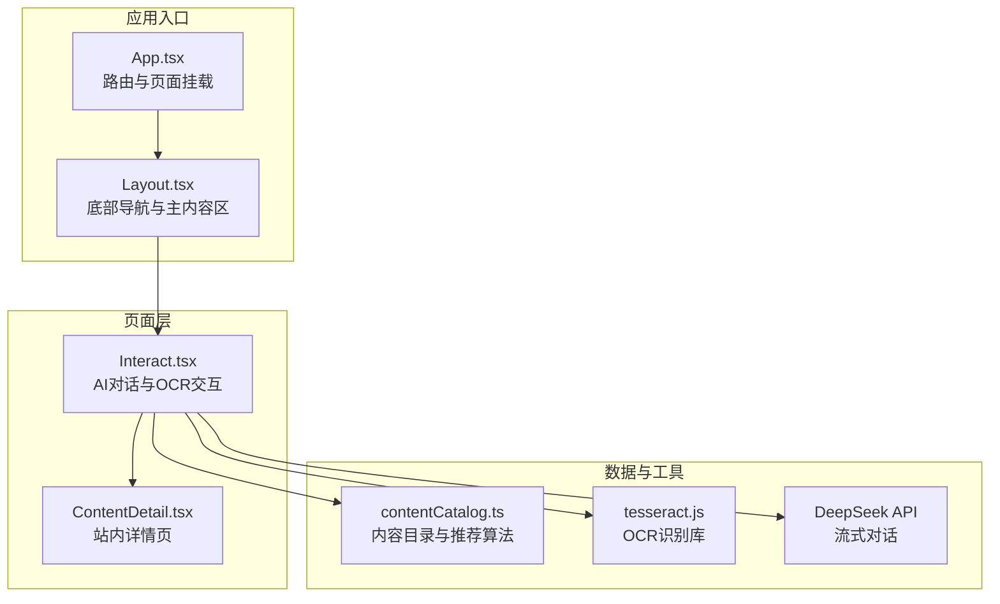
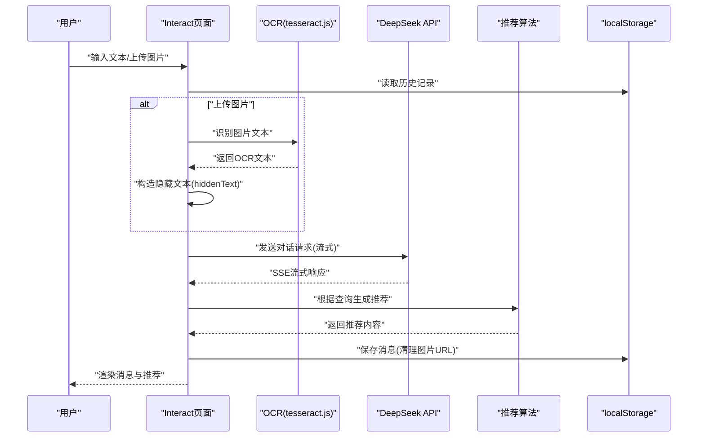
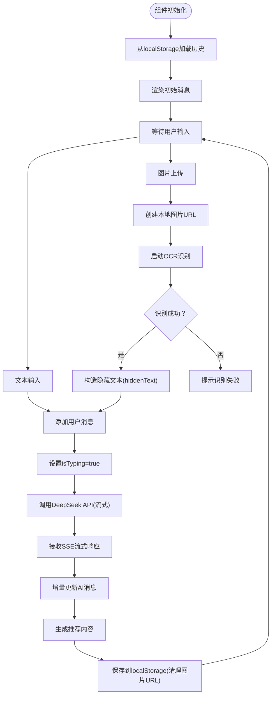
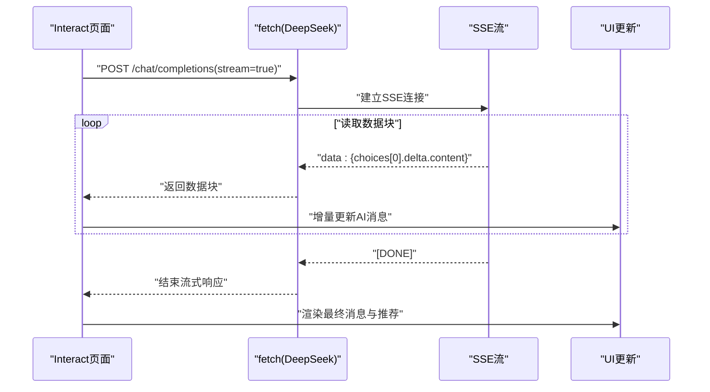
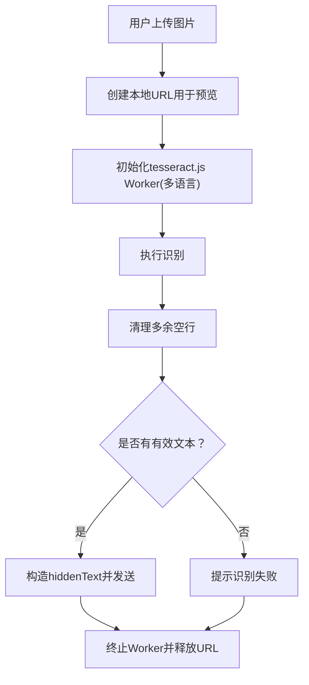
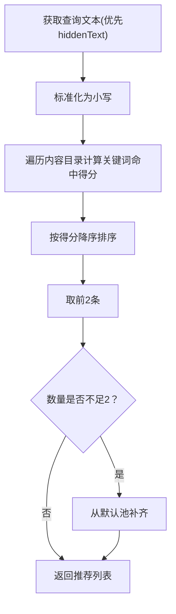
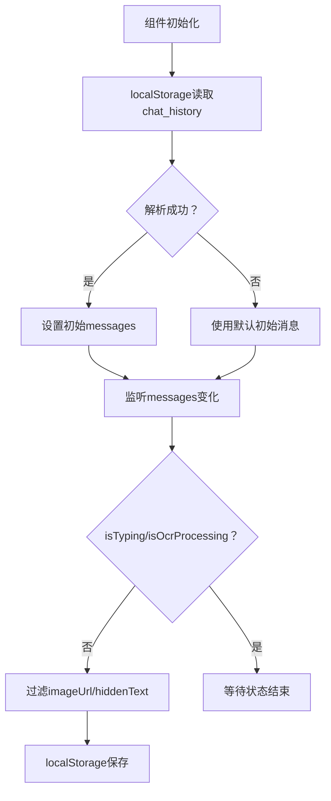
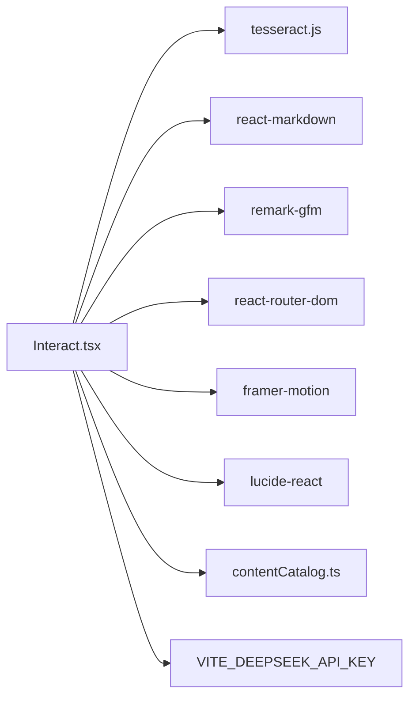

# AI交互系统

<cite>
**本文档引用的文件**
- [Interact.tsx](file://src/pages/Interact.tsx)
- [contentCatalog.ts](file://src/data/contentCatalog.ts)
- [App.tsx](file://src/App.tsx)
- [Layout.tsx](file://src/components/Layout.tsx)
- [package.json](file://package.json)
- [vite.config.ts](file://vite.config.ts)
- [test-tesseract.js](file://test-tesseract.js)
- [2026-04-14-chat-persistence-design.md](file://docs/superpowers/specs/2026-04-14-chat-persistence-design.md)
- [2026-04-14-chat-recommendations-design.md](file://docs/superpowers/specs/2026-04-14-chat-recommendations-design.md)
</cite>

## 目录
1. [简介](#简介)
2. [项目结构](#项目结构)
3. [核心组件](#核心组件)
4. [架构总览](#架构总览)
5. [详细组件分析](#详细组件分析)
6. [依赖关系分析](#依赖关系分析)
7. [性能考虑](#性能考虑)
8. [故障排除指南](#故障排除指南)
9. [结论](#结论)
10. [附录](#附录)

## 简介
本技术文档面向AI健康助手系统中的Interact页面，系统性解析其对话系统架构、DeepSeek API集成方案、OCR图像识别功能实现原理，并详细说明聊天消息处理流程、对话状态管理、推荐算法设计思路与对话持久化机制。同时，文档涵盖Tesseract.js OCR库的配置与使用方法、图像预处理流程、识别结果后处理逻辑，以及AI交互的用户体验设计、响应时间优化与错误处理策略。最后提供API调用示例、配置参数说明与调试技巧，并文档化系统的扩展点、性能监控与质量保证措施。

## 项目结构
该项目采用React + TypeScript + Vite的现代前端架构，采用按页面组织的目录结构，Interact页面位于src/pages/Interact.tsx，UI布局与导航位于src/components/Layout.tsx，应用路由配置在src/App.tsx中，内容推荐与数据模型位于src/data/contentCatalog.ts。

**图表来源**
- [App.tsx:19-51](file://src/App.tsx#L19-L51)
- [Layout.tsx:19-65](file://src/components/Layout.tsx#L19-L65)
- [Interact.tsx:37-461](file://src/pages/Interact.tsx#L37-L461)
- [contentCatalog.ts:1-101](file://src/data/contentCatalog.ts#L1-L101)

**章节来源**
- [App.tsx:19-51](file://src/App.tsx#L19-L51)
- [Layout.tsx:19-65](file://src/components/Layout.tsx#L19-L65)
- [package.json:13-26](file://package.json#L13-L26)

## 核心组件
- Interact页面：负责用户输入、消息渲染、OCR识别、DeepSeek API调用、推荐内容展示与对话持久化。
- 内容目录与推荐算法：提供本地内容库与关键词匹配推荐。
- 路由与布局：提供页面导航与底部TabBar。
- OCR库：基于tesseract.js的浏览器端图像识别。
- API集成：通过fetch调用DeepSeek Chat Completions接口，支持SSE流式响应。

**章节来源**
- [Interact.tsx:18-35](file://src/pages/Interact.tsx#L18-L35)
- [contentCatalog.ts:69-99](file://src/data/contentCatalog.ts#L69-L99)
- [Layout.tsx:10-17](file://src/components/Layout.tsx#L10-L17)

## 架构总览
系统采用“页面-数据-外部服务”的分层架构：
- 页面层：Interact.tsx负责UI交互与业务流程编排。
- 数据层：contentCatalog.ts提供内容模型与推荐算法。
- 外部服务：tesseract.js提供OCR能力；DeepSeek API提供对话能力。
- 持久化：localStorage用于对话历史的跨页面保存。

**图表来源**
- [Interact.tsx:86-142](file://src/pages/Interact.tsx#L86-L142)
- [Interact.tsx:144-248](file://src/pages/Interact.tsx#L144-L248)
- [contentCatalog.ts:69-99](file://src/data/contentCatalog.ts#L69-L99)

## 详细组件分析

### Interact页面：对话系统与状态管理
- 消息结构：包含发送方、内容、图片URL、隐藏文本、推荐内容等字段，支持Markdown渲染与图片展示。
- 状态管理：
  - messages：维护完整对话历史，支持localStorage持久化。
  - isTyping：控制AI打字动画。
  - isOcrProcessing：控制OCR识别状态。
  - 快速问题：提供通用百问快捷入口。
- 滚动与可见性：自动滚动到底部，确保最新消息可见。
- 持久化策略：在非输入/请求状态下，过滤掉图片URL并标记图片消息，避免localStorage溢出。

**图表来源**
- [Interact.tsx:37-84](file://src/pages/Interact.tsx#L37-L84)
- [Interact.tsx:86-142](file://src/pages/Interact.tsx#L86-L142)
- [Interact.tsx:144-248](file://src/pages/Interact.tsx#L144-L248)

**章节来源**
- [Interact.tsx:18-35](file://src/pages/Interact.tsx#L18-L35)
- [Interact.tsx:37-84](file://src/pages/Interact.tsx#L37-L84)
- [2026-04-14-chat-persistence-design.md:1-22](file://docs/superpowers/specs/2026-04-14-chat-persistence-design.md#L1-L22)

### DeepSeek API集成：流式对话与错误处理
- 认证与请求：通过环境变量VITE_DEEPSEEK_API_KEY进行认证，使用application/json与Bearer Token。
- 请求体：包含system角色、历史消息与当前用户消息，temperature=0.7，启用流式响应。
- 流式处理：使用TextDecoder与reader循环读取SSE数据块，逐行解析JSON，增量更新AI消息内容。
- 错误处理：网络异常、API错误、reader不可用等情况均捕获并回退为友好的提示消息，同时生成推荐内容以维持体验连续性。

**图表来源**
- [Interact.tsx:167-186](file://src/pages/Interact.tsx#L167-L186)
- [Interact.tsx:192-229](file://src/pages/Interact.tsx#L192-L229)

**章节来源**
- [Interact.tsx:56](file://src/pages/Interact.tsx#L56)
- [Interact.tsx:144-248](file://src/pages/Interact.tsx#L144-L248)

### OCR图像识别：Tesseract.js配置与预处理
- 库与配置：依赖tesseract.js，测试脚本验证了多语言引擎加载与终止。
- 图像处理：使用URL.createObjectURL生成本地预览URL；识别完成后及时释放内存。
- 预处理：去除OCR文本中的多余空行，提升可读性与模型输入质量。
- 隐私与安全：hiddenText仅用于发送给AI，不直接渲染，避免敏感信息泄露。

**图表来源**
- [Interact.tsx:95-127](file://src/pages/Interact.tsx#L95-L127)
- [test-tesseract.js:1-6](file://test-tesseract.js#L1-L6)

**章节来源**
- [Interact.tsx:86-142](file://src/pages/Interact.tsx#L86-L142)
- [test-tesseract.js:1-6](file://test-tesseract.js#L1-L6)

### 推荐算法：关键词匹配与补全策略
- 输入来源：优先使用hiddenText（OCR文本+引导语），其次使用content。
- 匹配规则：对每条内容的keywords执行包含匹配，命中计1分，按分数倒序取前2条。
- 补全策略：若不足2条，使用默认推荐池补齐，避免空推荐。
- 去重：确保同一ID不重复。
- 展示：在AI消息下方渲染2条推荐，点击进入站内详情页。

**图表来源**
- [contentCatalog.ts:69-99](file://src/data/contentCatalog.ts#L69-L99)

**章节来源**
- [contentCatalog.ts:69-99](file://src/data/contentCatalog.ts#L69-L99)
- [2026-04-14-chat-recommendations-design.md:55-68](file://docs/superpowers/specs/2026-04-14-chat-recommendations-design.md#L55-L68)

### 对话持久化机制：localStorage策略
- 读取：组件初始化时从localStorage读取chat_history，解析失败则回退到初始消息。
- 写入：在非输入/请求状态下监听messages变化，序列化并保存。
- 图片处理：保存前过滤imageUrl与hiddenText，避免localStorage溢出；UI层通过isImagePlaceholder标识图片消息，显示过期提示。

**图表来源**
- [Interact.tsx:37-84](file://src/pages/Interact.tsx#L37-L84)
- [2026-04-14-chat-persistence-design.md:11-18](file://docs/superpowers/specs/2026-04-14-chat-persistence-design.md#L11-L18)

**章节来源**
- [Interact.tsx:37-84](file://src/pages/Interact.tsx#L37-L84)
- [2026-04-14-chat-persistence-design.md:1-22](file://docs/superpowers/specs/2026-04-14-chat-persistence-design.md#L1-L22)

## 依赖关系分析
- 外部依赖：tesseract.js用于OCR，react-markdown与remark-gfm用于Markdown渲染，lucide-react提供图标，framer-motion提供动画，react-router-dom提供路由。
- 环境变量：VITE_DEEPSEEK_API_KEY用于DeepSeek认证。
- 构建配置：Vite插件包括react、tsconfig路径与Trae徽章插件。

**图表来源**
- [package.json:13-26](file://package.json#L13-L26)
- [Interact.tsx:56](file://src/pages/Interact.tsx#L56)

**章节来源**
- [package.json:13-26](file://package.json#L13-L26)
- [vite.config.ts:11-21](file://vite.config.ts#L11-L21)

## 性能考虑
- 流式响应：DeepSeek API启用stream=true，前端使用SSE增量渲染，显著降低首屏延迟。
- 图像处理：OCR在用户侧执行，避免上传大图带来的网络压力；识别完成后立即释放URL与Worker资源。
- 状态更新：仅在必要时触发localStorage写入，避免频繁I/O。
- UI优化：使用动画与滚动优化提升交互流畅度。
- 建议：可引入缓存策略（如对相同OCR文本的结果进行短期缓存）、懒加载推荐内容、对超长消息进行截断与折叠。

[本节为通用性能指导，无需特定文件引用]

## 故障排除指南
- OCR识别失败
  - 现象：提示“未能识别出文字”或“识别过程中发生错误”。
  - 排查：确认图片清晰度、角度与亮度；检查tesseract.js Worker初始化与终止流程；确认URL释放逻辑。
  - 参考：[Interact.tsx:119-136](file://src/pages/Interact.tsx#L119-L136)
- DeepSeek API错误
  - 现象：网络或服务异常导致无法回答。
  - 排查：检查VITE_DEEPSEEK_API_KEY配置；确认fetch请求头与body格式；查看SSE流解析日志。
  - 参考：[Interact.tsx:152-166](file://src/pages/Interact.tsx#L152-L166)，[Interact.tsx:237-247](file://src/pages/Interact.tsx#L237-L247)
- 对话丢失
  - 现象：切换页面后历史记录消失。
  - 排查：确认localStorage读取与写入逻辑；检查isTyping/isOcrProcessing状态是否阻塞保存。
  - 参考：[Interact.tsx:37-84](file://src/pages/Interact.tsx#L37-L84)，[2026-04-14-chat-persistence-design.md:14-18](file://docs/superpowers/specs/2026-04-14-chat-persistence-design.md#L14-L18)
- 推荐无命中
  - 现象：推荐列表为空或仅默认内容。
  - 排查：检查关键词匹配逻辑与默认池；确认查询文本来源（hiddenText vs content）。
  - 参考：[contentCatalog.ts:69-99](file://src/data/contentCatalog.ts#L69-L99)

**章节来源**
- [Interact.tsx:119-136](file://src/pages/Interact.tsx#L119-L136)
- [Interact.tsx:152-166](file://src/pages/Interact.tsx#L152-L166)
- [Interact.tsx:237-247](file://src/pages/Interact.tsx#L237-L247)
- [Interact.tsx:37-84](file://src/pages/Interact.tsx#L37-L84)
- [contentCatalog.ts:69-99](file://src/data/contentCatalog.ts#L69-L99)

## 结论
AI健康助手的Interact页面实现了完整的端到端交互闭环：从用户输入与图片上传，到OCR识别与DeepSeek流式对话，再到推荐内容与对话持久化。系统通过localStorage解决跨页面状态丢失问题，通过hiddenText保障隐私与模型输入质量，通过SSE流式渲染优化响应时间。推荐算法采用关键词匹配与默认池补全策略，确保每次对话后都有相关内容引导。未来可在缓存、懒加载与监控方面进一步优化，以提升整体性能与可维护性。

[本节为总结性内容，无需特定文件引用]

## 附录

### API调用示例与配置参数
- DeepSeek API
  - 端点：/chat/completions
  - 方法：POST
  - 认证：Authorization: Bearer ${VITE_DEEPSEEK_API_KEY}
  - 请求体字段：model、messages（包含system、历史、当前用户消息）、temperature、stream
  - 响应：SSE流式JSON，逐行data: {...}
  - 参考：[Interact.tsx:167-186](file://src/pages/Interact.tsx#L167-L186)，[Interact.tsx:192-229](file://src/pages/Interact.tsx#L192-L229)

**章节来源**
- [Interact.tsx:167-186](file://src/pages/Interact.tsx#L167-L186)
- [Interact.tsx:192-229](file://src/pages/Interact.tsx#L192-L229)

### 调试技巧
- 环境变量：在开发环境中设置VITE_DEEPSEEK_API_KEY以启用AI功能；若未设置，系统将回退到本地推荐。
- 控制台日志：关注OCR与API错误日志，定位具体失败环节。
- 状态检查：通过浏览器开发者工具查看localStorage中chat_history的结构与大小。
- 参考：[Interact.tsx:56](file://src/pages/Interact.tsx#L56)，[Interact.tsx:37-84](file://src/pages/Interact.tsx#L37-L84)

**章节来源**
- [Interact.tsx:56](file://src/pages/Interact.tsx#L56)
- [Interact.tsx:37-84](file://src/pages/Interact.tsx#L37-L84)

### 扩展点与质量保证
- 扩展点
  - 后端推荐接口：替换本地推荐算法为后端接口。
  - 多模态输入：支持语音、视频等输入方式。
  - 会话归档：将localStorage迁移至IndexedDB或服务端存储。
  - A/B测试：对推荐策略与UI进行A/B测试。
- 质量保证
  - 单元测试：为推荐算法与消息处理逻辑编写单元测试。
  - E2E测试：覆盖OCR识别、API调用与推荐展示的端到端流程。
  - 性能监控：埋点记录首屏时间、流式响应延迟与错误率。
  - 参考：[2026-04-14-chat-recommendations-design.md:93-103](file://docs/superpowers/specs/2026-04-14-chat-recommendations-design.md#L93-L103)，[2026-04-14-chat-persistence-design.md:1-22](file://docs/superpowers/specs/2026-04-14-chat-persistence-design.md#L1-L22)

**章节来源**
- [2026-04-14-chat-recommendations-design.md:93-103](file://docs/superpowers/specs/2026-04-14-chat-recommendations-design.md#L93-L103)
- [2026-04-14-chat-persistence-design.md:1-22](file://docs/superpowers/specs/2026-04-14-chat-persistence-design.md#L1-L22)