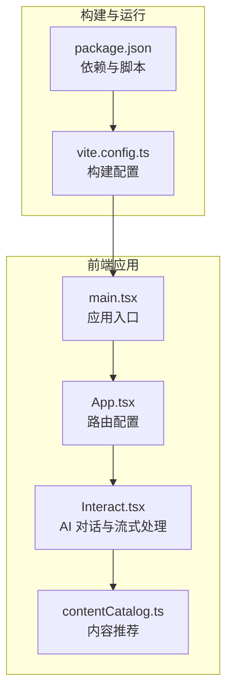
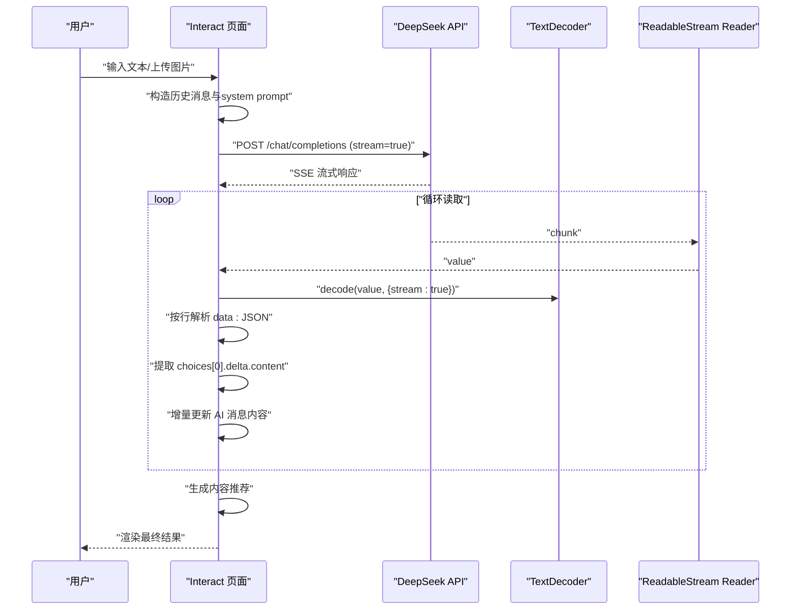
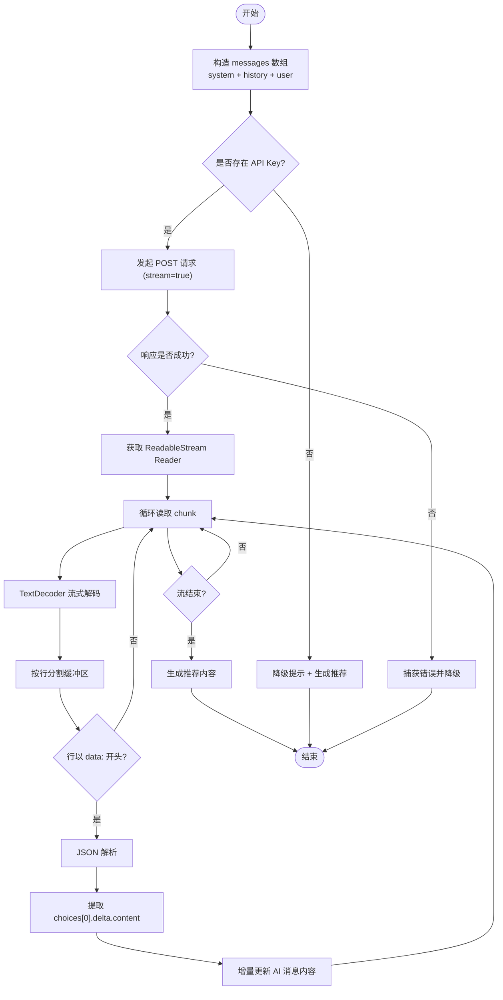
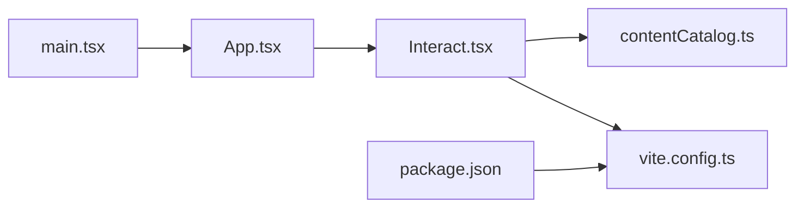

# API集成方案

<cite>
**本文引用的文件**
- [Interact.tsx](file://src/pages/Interact.tsx)
- [contentCatalog.ts](file://src/data/contentCatalog.ts)
- [vite.config.ts](file://vite.config.ts)
- [package.json](file://package.json)
- [App.tsx](file://src/App.tsx)
- [main.tsx](file://src/main.tsx)
- [nginx-config.txt](file://nginx-config.txt)
</cite>

## 目录
1. [简介](#简介)
2. [项目结构](#项目结构)
3. [核心组件](#核心组件)
4. [架构总览](#架构总览)
5. [详细组件分析](#详细组件分析)
6. [依赖关系分析](#依赖关系分析)
7. [性能考量](#性能考量)
8. [故障排查指南](#故障排查指南)
9. [结论](#结论)
10. [附录](#附录)

## 简介
本方案围绕 DeepSeek API 在前端 React 应用中的集成实践展开，重点解析 Interact 页面中的 fetchAIResponse 函数实现，涵盖以下方面：
- HTTP 请求构建与认证配置
- 请求参数构造（model、temperature、system prompt、messages 组织）
- 流式响应处理（ReadableStream、TextDecoder、增量内容实时更新）
- 错误处理、降级与推荐内容联动
- API 密钥安全、环境变量配置与生产部署注意事项
- 完整请求/响应示例与调试技巧

## 项目结构
该仓库采用 Vite + React + TypeScript 技术栈，前端页面通过 React Router 进行路由分发。与 DeepSeek API 集成的核心逻辑集中在 Interact 页面，同时依赖内容推荐模块生成相关推荐。

图表来源
- [main.tsx:1-11](file://src/main.tsx#L1-L11)
- [App.tsx:19-51](file://src/App.tsx#L19-L51)
- [Interact.tsx:37-462](file://src/pages/Interact.tsx#L37-L462)
- [contentCatalog.ts:69-99](file://src/data/contentCatalog.ts#L69-L99)
- [vite.config.ts:1-22](file://vite.config.ts#L1-L22)
- [package.json:1-48](file://package.json#L1-L48)

章节来源
- [main.tsx:1-11](file://src/main.tsx#L1-L11)
- [App.tsx:19-51](file://src/App.tsx#L19-L51)
- [Interact.tsx:37-462](file://src/pages/Interact.tsx#L37-L462)
- [contentCatalog.ts:69-99](file://src/data/contentCatalog.ts#L69-L99)
- [vite.config.ts:1-22](file://vite.config.ts#L1-L22)
- [package.json:1-48](file://package.json#L1-L48)

## 核心组件
- Interact 页面：负责消息状态管理、OCR 图片上传与解析、调用 DeepSeek API 并处理流式响应。
- 内容推荐模块：基于关键词匹配生成相关健康内容推荐，用于无 API Key 场景下的降级展示。
- 构建与路由：Vite 配置与 React Router 路由，确保 SPA 正常运行与静态资源缓存。

章节来源
- [Interact.tsx:37-462](file://src/pages/Interact.tsx#L37-L462)
- [contentCatalog.ts:69-99](file://src/data/contentCatalog.ts#L69-L99)
- [vite.config.ts:1-22](file://vite.config.ts#L1-L22)
- [package.json:1-48](file://package.json#L1-L48)

## 架构总览
下图展示了从前端交互到 DeepSeek API 的整体调用链路，包括认证、请求参数、流式读取与 UI 更新。

图表来源
- [Interact.tsx:144-248](file://src/pages/Interact.tsx#L144-L248)

章节来源
- [Interact.tsx:144-248](file://src/pages/Interact.tsx#L144-L248)

## 详细组件分析

### fetchAIResponse 函数实现原理
- HTTP 请求构建
  - 目标地址：DeepSeek 官方 Chat Completions 接口
  - 方法：POST
  - 头部：Content-Type 为 application/json；Authorization 使用 Bearer Token（来自 VITE_DEEPSEEK_API_KEY）
- 认证机制
  - 通过 import.meta.env.VITE_DEEPSEEK_API_KEY 获取密钥
  - 若未配置，直接返回降级提示并生成推荐内容
- 请求参数构造
  - model：固定为 deepseek-chat
  - temperature：0.7
  - messages：
    - system：设定角色与风格（医疗健康助手，专业且温和，必要时建议就医）
    - history：将已存在消息映射为 assistant/user 角色与内容（优先使用 hiddenText）
    - user：当前用户输入（OCR 时为隐藏文本）
  - stream：true 启用流式传输
- 流式响应处理
  - 从 response.body 获取 Reader
  - 使用 TextDecoder 以 UTF-8 流式解码
  - 基于换行符切分行缓冲，逐行解析 data: 开头的事件行
  - 解析 JSON，提取 choices[0].delta.content 作为增量内容
  - 实时更新对应 AI 消息的 content
- 错误处理与降级
  - 响应非 OK：抛错并进入降级流程
  - 读取阶段异常：捕获 JSON 解析错误并记录日志
  - 降级：提示“网络或服务原因”并生成推荐内容
- 推荐内容联动
  - 在流式结束后根据查询词生成最多两条内容推荐，并写回消息对象

图表来源
- [Interact.tsx:144-248](file://src/pages/Interact.tsx#L144-L248)

章节来源
- [Interact.tsx:144-248](file://src/pages/Interact.tsx#L144-L248)

### 请求参数与消息组织
- model 选择
  - 固定为 deepseek-chat，确保与 DeepSeek API 兼容
- temperature 调节
  - 设为 0.7，在创造性与稳定性之间取得平衡
- system prompt 设计
  - 角色定位：医疗健康助手
  - 风格要求：专业、温暖
  - 行为约束：对复杂症状建议就医；可使用 Markdown 结构化输出
- messages 数组组织
  - system：一次性角色设定
  - history：将之前的消息映射为 assistant/user，优先使用 hiddenText（OCR 文本）
  - user：当前输入，若为 OCR 则使用隐藏文本

章节来源
- [Interact.tsx:173-185](file://src/pages/Interact.tsx#L173-L185)
- [Interact.tsx:146-150](file://src/pages/Interact.tsx#L146-L150)

### 流式传输机制
- ReadableStream 使用
  - 从 response.body 获取 Reader
  - 循环调用 reader.read() 获取 value 与 done
- TextDecoder 解码
  - 以 UTF-8 流式解码，避免大块数据一次性解码导致的内存压力
- 增量内容实时更新
  - 逐行解析 data: 行，提取 JSON 字符串
  - 解析后取 choices[0].delta.content，拼接到当前 AI 内容
  - 通过状态更新触发 UI 渐进式渲染

章节来源
- [Interact.tsx:193-229](file://src/pages/Interact.tsx#L193-L229)

### 错误处理策略、重试机制与降级方案
- 错误处理
  - 响应非 OK：抛错并进入降级
  - JSON 解析异常：记录错误日志，继续消费剩余流
  - 无 Reader：抛错并降级
- 降级方案
  - 未配置 API Key：提示配置方法并生成推荐
  - 网络/服务异常：提示“网络或服务原因”，并生成推荐
- 重试机制
  - 当前实现未内置自动重试；可在上层调用处增加指数退避重试逻辑（建议）

章节来源
- [Interact.tsx:152-166](file://src/pages/Interact.tsx#L152-L166)
- [Interact.tsx:237-247](file://src/pages/Interact.tsx#L237-L247)

### API 密钥安全管理与环境变量配置
- 密钥来源
  - 通过 Vite 的 import.meta.env.VITE_DEEPSEEK_API_KEY 注入
  - 仅在客户端可见，不建议在生产环境暴露给浏览器
- 安全建议
  - 建议将 API 调用迁移至后端代理，前端仅调用自有后端接口
  - 后端统一持有密钥，前端通过自有服务转发请求
- 环境变量与构建
  - Vite 构建时会将 VITE_ 前缀的变量注入到客户端
  - 生产部署需确保环境变量正确注入

章节来源
- [Interact.tsx:56](file://src/pages/Interact.tsx#L56)
- [vite.config.ts:1-22](file://vite.config.ts#L1-L22)
- [package.json:1-48](file://package.json#L1-L48)

### 生产环境部署注意事项
- Nginx 配置
  - 单页应用路由：使用 try_files 将所有路由指向 index.html
  - 静态资源缓存：对 JS/CSS/字体等设置长缓存
- 构建优化
  - 开启隐藏源码映射（hidden）以降低泄露风险
  - 使用 React Router 的 HTML5 History 模式需配合服务器配置
- 安全加固
  - 建议将 API Key 放置于后端，前端仅调用自有后端接口
  - 对外暴露的前端产物不应包含敏感信息

章节来源
- [nginx-config.txt:1-22](file://nginx-config.txt#L1-L22)
- [vite.config.ts:8-10](file://vite.config.ts#L8-L10)

### 请求/响应示例与调试技巧
- 请求示例（路径参考）
  - 请求方法与 URL：POST https://api.deepseek.com/chat/completions
  - 请求头：Content-Type: application/json；Authorization: Bearer <VITE_DEEPSEEK_API_KEY>
  - 请求体字段：model、messages（含 system/history/user）、temperature、stream
  - 参考路径：[Interact.tsx:167-186](file://src/pages/Interact.tsx#L167-L186)
- 响应示例（路径参考）
  - 成功响应：SSE 流式数据，每行以 data: 开头，结尾为 [DONE]
  - 参考路径：[Interact.tsx:209-227](file://src/pages/Interact.tsx#L209-L227)
- 调试技巧
  - 打开浏览器开发者工具 Network 面板，观察 SSE 流式数据
  - 在控制台打印 messages 状态，确认增量内容是否正确拼接
  - 若出现乱码，检查 TextDecoder 编码与缓冲区切分逻辑
  - 若无响应，检查 API Key 是否正确注入与网络连通性

章节来源
- [Interact.tsx:167-186](file://src/pages/Interact.tsx#L167-L186)
- [Interact.tsx:209-227](file://src/pages/Interact.tsx#L209-L227)

## 依赖关系分析
- 组件耦合
  - Interact 依赖 contentCatalog 的推荐能力
  - 构建配置影响前端产物与运行时行为
- 外部依赖
  - react-markdown 与 remark-gfm 用于渲染 Markdown
  - tesseract.js 用于图片 OCR
- 路由与入口
  - App 与 main 负责应用启动与路由分发

图表来源
- [Interact.tsx:37-462](file://src/pages/Interact.tsx#L37-L462)
- [contentCatalog.ts:69-99](file://src/data/contentCatalog.ts#L69-L99)
- [vite.config.ts:1-22](file://vite.config.ts#L1-L22)
- [package.json:1-48](file://package.json#L1-L48)
- [App.tsx:19-51](file://src/App.tsx#L19-L51)
- [main.tsx:1-11](file://src/main.tsx#L1-L11)

章节来源
- [Interact.tsx:37-462](file://src/pages/Interact.tsx#L37-L462)
- [contentCatalog.ts:69-99](file://src/data/contentCatalog.ts#L69-L99)
- [vite.config.ts:1-22](file://vite.config.ts#L1-L22)
- [package.json:1-48](file://package.json#L1-L48)
- [App.tsx:19-51](file://src/App.tsx#L19-L51)
- [main.tsx:1-11](file://src/main.tsx#L1-L11)

## 性能考量
- 流式解码与增量渲染
  - 使用 TextDecoder 流式解码，避免一次性解码大块数据
  - 增量更新消息内容，减少不必要的重渲染
- 消息持久化与存储
  - 将图片 URL 与隐藏文本清理后保存，避免 localStorage 过大
- 构建优化
  - 隐藏源码映射，降低泄露风险
  - 合理缓存静态资源，提升首屏加载速度

章节来源
- [Interact.tsx:70-84](file://src/pages/Interact.tsx#L70-L84)
- [vite.config.ts:8-10](file://vite.config.ts#L8-L10)

## 故障排查指南
- 未配置 API Key
  - 现象：显示降级提示并生成推荐
  - 处理：在部署环境中设置 VITE_DEEPSEEK_API_KEY 并重启/重新构建
  - 参考路径：[Interact.tsx:152-166](file://src/pages/Interact.tsx#L152-L166)
- 网络/服务异常
  - 现象：提示“网络或服务原因”，并生成推荐
  - 处理：检查网络连通性与 API Key 有效性
  - 参考路径：[Interact.tsx:237-247](file://src/pages/Interact.tsx#L237-L247)
- 流式解析异常
  - 现象：JSON 解析报错或内容不完整
  - 处理：检查 data: 行格式与缓冲区切分逻辑
  - 参考路径：[Interact.tsx:215-225](file://src/pages/Interact.tsx#L215-L225)
- OCR 识别失败
  - 现象：图片上传后无文字或提示错误
  - 处理：检查图片清晰度与格式，重试识别
  - 参考路径：[Interact.tsx:128-136](file://src/pages/Interact.tsx#L128-L136)

章节来源
- [Interact.tsx:152-166](file://src/pages/Interact.tsx#L152-L166)
- [Interact.tsx:237-247](file://src/pages/Interact.tsx#L237-L247)
- [Interact.tsx:215-225](file://src/pages/Interact.tsx#L215-L225)
- [Interact.tsx:128-136](file://src/pages/Interact.tsx#L128-L136)

## 结论
本方案在前端实现了与 DeepSeek API 的稳定集成，具备如下特点：
- 完整的消息组织与 system prompt 设计，确保输出风格一致
- 基于 ReadableStream 的高效流式处理，实现低延迟增量渲染
- 健全的错误处理与降级策略，保障用户体验
- 建议在生产环境中将 API Key 管理迁移到后端，进一步提升安全性

## 附录
- 相关实现路径
  - [Interact.tsx:144-248](file://src/pages/Interact.tsx#L144-L248)
  - [contentCatalog.ts:69-99](file://src/data/contentCatalog.ts#L69-L99)
  - [vite.config.ts:1-22](file://vite.config.ts#L1-L22)
  - [package.json:1-48](file://package.json#L1-L48)
  - [App.tsx:19-51](file://src/App.tsx#L19-L51)
  - [main.tsx:1-11](file://src/main.tsx#L1-L11)
  - [nginx-config.txt:1-22](file://nginx-config.txt#L1-L22)