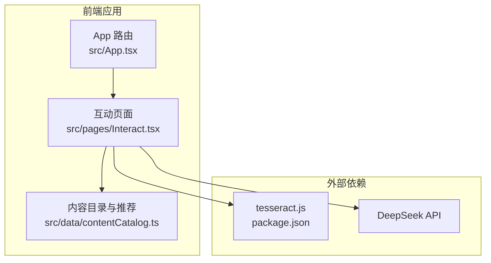
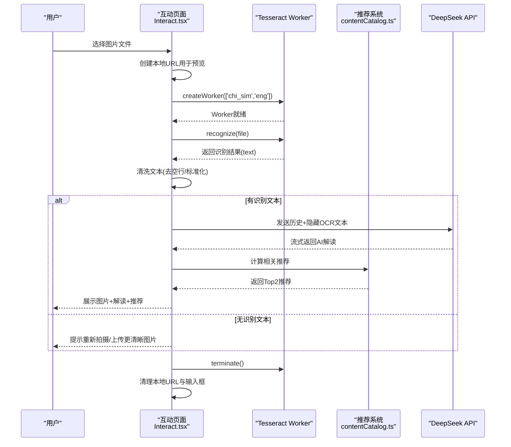
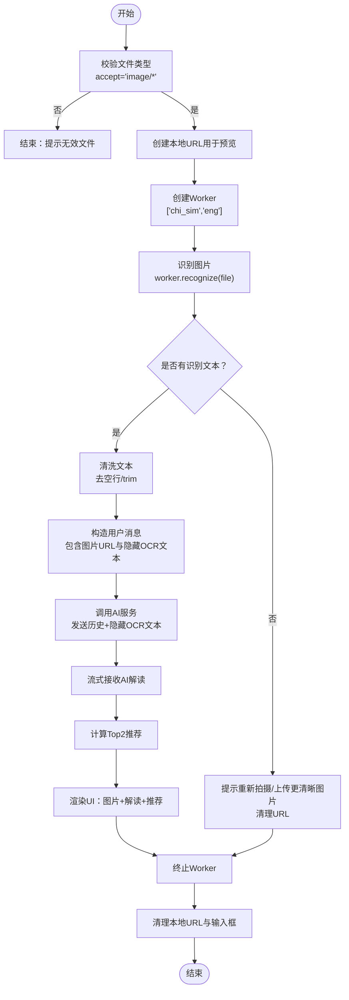
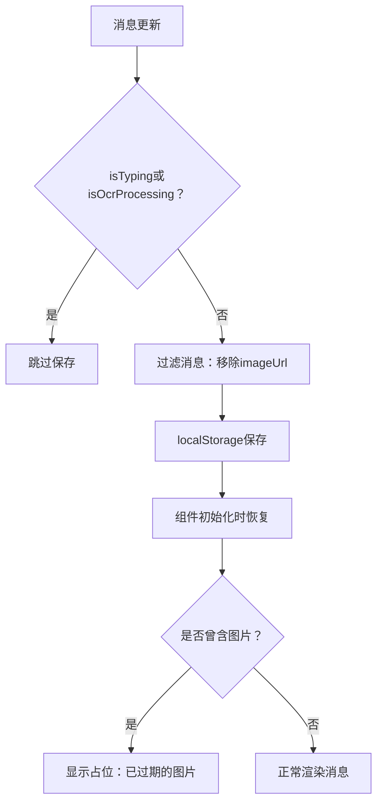
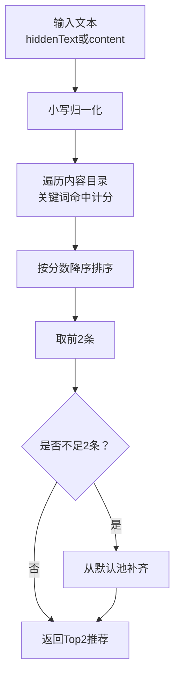
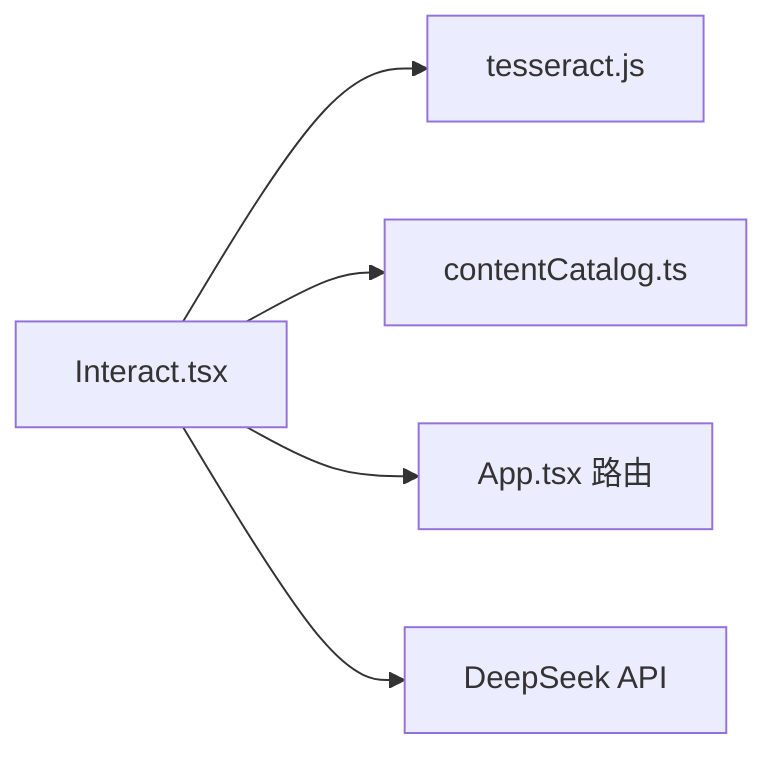

# OCR图像识别功能

<cite>
**本文引用的文件**
- [Interact.tsx](file://src/pages/Interact.tsx)
- [test-tesseract.js](file://test-tesseract.js)
- [package.json](file://package.json)
- [contentCatalog.ts](file://src/data/contentCatalog.ts)
- [App.tsx](file://src/App.tsx)
- [2026-04-14-chat-persistence-design.md](file://docs/superpowers/specs/2026-04-14-chat-persistence-design.md)
</cite>

## 目录
1. [简介](#简介)
2. [项目结构](#项目结构)
3. [核心组件](#核心组件)
4. [架构总览](#架构总览)
5. [详细组件分析](#详细组件分析)
6. [依赖关系分析](#依赖关系分析)
7. [性能考虑](#性能考虑)
8. [故障排查指南](#故障排查指南)
9. [结论](#结论)
10. [附录](#附录)

## 简介
本技术文档围绕项目中的OCR图像识别功能展开，聚焦于Tesseract.js的集成实现与使用流程，涵盖以下方面：
- Worker的创建、初始化与销毁生命周期
- 图像上传处理机制：文件校验、本地URL创建、内存与资源清理策略
- OCR识别核心流程：多语言模型选择（chi_sim、eng）、文本识别、结果后处理与错误恢复
- 图像预处理思路：格式转换、尺寸调整与质量优化的实践建议
- 结果清洗算法：空行去除、格式标准化等处理逻辑
- 性能优化建议、内存使用监控与用户体验改进方案
- 测试用例与调试方法

## 项目结构
该项目采用React + TypeScript + Vite的前端架构，OCR功能集中在“互动”页面中，结合本地内容推荐系统与DeepSeek API完成“图片OCR + AI解读”的闭环。

图表来源
- [App.tsx:19-51](file://src/App.tsx#L19-L51)
- [Interact.tsx:1-462](file://src/pages/Interact.tsx#L1-L462)
- [contentCatalog.ts:1-101](file://src/data/contentCatalog.ts#L1-L101)
- [package.json:13-26](file://package.json#L13-L26)

章节来源
- [App.tsx:19-51](file://src/App.tsx#L19-L51)
- [package.json:13-26](file://package.json#L13-L26)

## 核心组件
- 互动页面（Interact.tsx）：负责图像上传、OCR识别、结果后处理、与AI服务交互、消息持久化与UI渲染。
- 内容目录（contentCatalog.ts）：提供本地推荐内容，用于识别后的内容关联与引导。
- Tesseract.js：OCR引擎，提供Worker创建、识别与终止能力。
- DeepSeek API：在OCR完成后，将隐藏的OCR文本发送至AI服务获取解读。

章节来源
- [Interact.tsx:18-27](file://src/pages/Interact.tsx#L18-L27)
- [contentCatalog.ts:69-99](file://src/data/contentCatalog.ts#L69-L99)
- [package.json:24-24](file://package.json#L24-L24)

## 架构总览
OCR识别流程在前端完成，整体架构如下：

图表来源
- [Interact.tsx:86-142](file://src/pages/Interact.tsx#L86-L142)
- [Interact.tsx:144-248](file://src/pages/Interact.tsx#L144-L248)
- [contentCatalog.ts:69-99](file://src/data/contentCatalog.ts#L69-L99)

## 详细组件分析

### 组件A：图像上传与OCR识别流程
- 文件验证：仅接受图片类型，防止非图片文件进入OCR流程。
- 本地URL创建：使用URL.createObjectURL(file)生成预览URL，便于即时展示。
- Worker生命周期：按需创建Worker，识别完成后立即terminate，避免资源泄漏。
- 识别与清洗：调用worker.recognize(file)，对返回文本执行空行去除与trim处理。
- 错误恢复：捕获异常并提示用户，同时清理本地URL与输入框，确保状态一致。
- 资源清理：无论成功与否，均在finally中清理本地URL与输入框，避免内存泄漏。

图表来源
- [Interact.tsx:86-142](file://src/pages/Interact.tsx#L86-L142)
- [Interact.tsx:144-248](file://src/pages/Interact.tsx#L144-L248)

章节来源
- [Interact.tsx:86-142](file://src/pages/Interact.tsx#L86-L142)
- [Interact.tsx:144-248](file://src/pages/Interact.tsx#L144-L248)

### 组件B：消息持久化与图片URL处理
- 持久化策略：使用localStorage保存聊天历史，避免页面切换导致状态丢失。
- 图片URL清理：保存前过滤掉imageUrl字段，避免localStorage被大体积Blob URL撑爆。
- UI占位：恢复时对曾包含图片的消息显示“已过期的图片”占位，提升体验。

图表来源
- [Interact.tsx:70-84](file://src/pages/Interact.tsx#L70-L84)
- [2026-04-14-chat-persistence-design.md:11-18](file://docs/superpowers/specs/2026-04-14-chat-persistence-design.md#L11-L18)

章节来源
- [Interact.tsx:70-84](file://src/pages/Interact.tsx#L70-L84)
- [2026-04-14-chat-persistence-design.md:11-18](file://docs/superpowers/specs/2026-04-14-chat-persistence-design.md#L11-L18)

### 组件C：推荐系统与内容匹配
- 输入来源：优先使用消息的hiddenText（OCR文本），其次使用content。
- 匹配规则：关键词包含匹配，按命中次数排序，取Top2；不足时用默认池补齐。
- UI呈现：在AI回复气泡下方展示推荐列表，点击跳转至站内详情页。

图表来源
- [contentCatalog.ts:69-99](file://src/data/contentCatalog.ts#L69-L99)
- [Interact.tsx:231-235](file://src/pages/Interact.tsx#L231-L235)

章节来源
- [contentCatalog.ts:69-99](file://src/data/contentCatalog.ts#L69-L99)
- [Interact.tsx:231-235](file://src/pages/Interact.tsx#L231-L235)

### 组件D：Tesseract.js集成与测试
- Worker创建：通过createWorker传入['chi_sim','eng']加载双语模型。
- 测试脚本：test-tesseract.js演示了Worker创建与终止的最小流程，便于离线验证环境。

章节来源
- [Interact.tsx:95-95](file://src/pages/Interact.tsx#L95-L95)
- [test-tesseract.js:1-6](file://test-tesseract.js#L1-L6)
- [package.json:24-24](file://package.json#L24-L24)

## 依赖关系分析
- 依赖声明：tesseract.js在package.json中声明为生产依赖。
- 组件耦合：Interact.tsx直接依赖tesseract.js与contentCatalog.ts，间接依赖App路由配置。
- 外部接口：DeepSeek API用于AI解读，受环境变量控制。

图表来源
- [package.json:24-24](file://package.json#L24-L24)
- [Interact.tsx:1-10](file://src/pages/Interact.tsx#L1-L10)
- [App.tsx:19-51](file://src/App.tsx#L19-L51)

章节来源
- [package.json:24-24](file://package.json#L24-L24)
- [Interact.tsx:1-10](file://src/pages/Interact.tsx#L1-L10)
- [App.tsx:19-51](file://src/App.tsx#L19-L51)

## 性能考虑
- Worker生命周期管理：每次识别后立即terminate，避免多实例占用内存。
- 本地URL清理：识别失败或结束后及时revokeObjectURL，防止内存泄漏。
- 文本清洗：使用正则一次性去除多余空行，降低后续渲染与网络传输开销。
- 模型选择：双语模型覆盖中文与英文场景，兼顾准确性与体积。
- 用户体验：在OCR进行时禁用输入与按钮，避免并发操作引发状态混乱。
- 推荐计算：本地关键词匹配，避免额外网络请求，响应迅速。

## 故障排查指南
- OCR失败
  - 现象：识别结果为空或报错。
  - 排查：确认文件类型为图片；检查Worker创建与terminate调用是否成对出现；查看控制台错误日志。
  - 处理：提示用户重新拍摄或上传更清晰图片；确保finally中清理URL与输入框。
- 本地存储异常
  - 现象：localStorage保存失败或恢复异常。
  - 排查：检查消息对象是否包含imageUrl；确认持久化逻辑在非输入/请求状态下触发。
  - 处理：过滤imageUrl后再保存；恢复时对曾含图片的消息显示占位。
- AI服务不可用
  - 现象：网络错误或API返回异常。
  - 排查：确认VITE_DEEPSEEK_API_KEY是否配置；检查fetch请求与流式读取逻辑。
  - 处理：捕获异常并提示用户稍后再试；保留推荐计算逻辑以保证基本体验。

章节来源
- [Interact.tsx:128-136](file://src/pages/Interact.tsx#L128-L136)
- [Interact.tsx:237-247](file://src/pages/Interact.tsx#L237-L247)
- [2026-04-14-chat-persistence-design.md:11-18](file://docs/superpowers/specs/2026-04-14-chat-persistence-design.md#L11-L18)

## 结论
本项目通过Tesseract.js实现了高效的前端OCR识别，配合本地消息持久化与内容推荐系统，形成了“图片上传 → 文本识别 → AI解读 → 内容推荐”的完整闭环。通过严格的Worker生命周期管理、本地URL清理与文本清洗策略，保障了性能与稳定性。未来可在图像预处理（格式转换、尺寸调整、质量优化）方面进一步增强，以提升识别准确率与用户体验。

## 附录

### 图像预处理建议（概念性说明）
- 格式转换：优先使用WebP/JPEG/PNG，避免过大BMP/PSD。
- 尺寸调整：限制最大边长，降低WASM推理负担。
- 质量优化：灰度化、对比度增强、去噪，提升识别效果。
- 注意：上述为通用建议，当前实现未包含图像预处理逻辑。

### 识别结果清洗算法（概念性说明）
- 空行去除：使用正则将多个连续换行压缩为单个换行，并去除首尾空白。
- 格式标准化：统一标点、去除多余空白字符，保留关键信息。
- 注意：当前实现已在代码中体现空行去除与trim处理。

### 测试用例与调试方法
- 单元测试（Worker）
  - 场景：创建Worker并终止，验证生命周期。
  - 参考路径：[test-tesseract.js:1-6](file://test-tesseract.js#L1-L6)
- 端到端测试（图像上传）
  - 场景：选择图片 → 预览URL创建 → OCR识别 → 文本清洗 → AI解读 → 推荐 → 清理资源。
  - 参考路径：[Interact.tsx:86-142](file://src/pages/Interact.tsx#L86-L142)
- 调试技巧
  - 控制台日志：在OCR与AI请求处添加日志，定位异常节点。
  - 网络面板：检查AI请求的响应与流式数据。
  - 存储检查：确认localStorage中消息是否已过滤imageUrl。