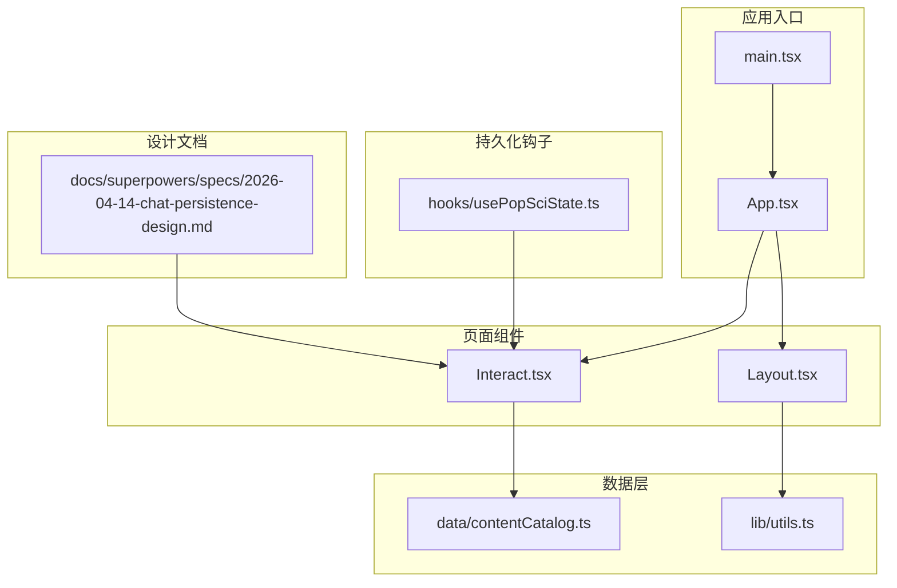
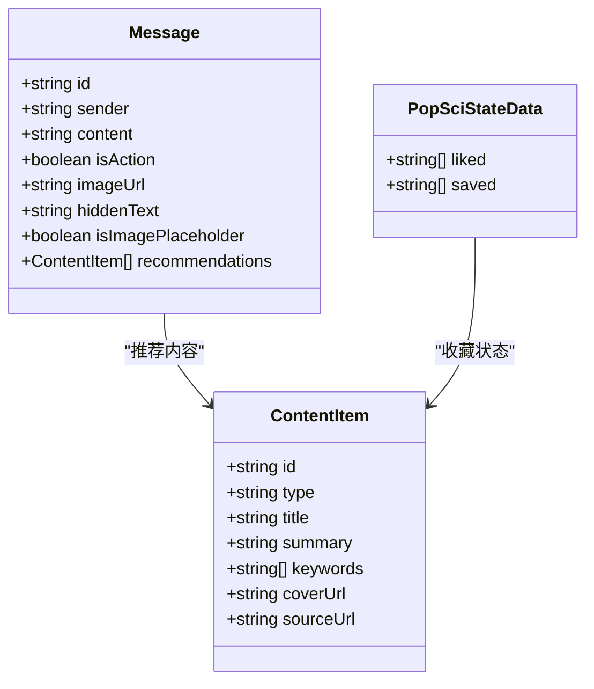
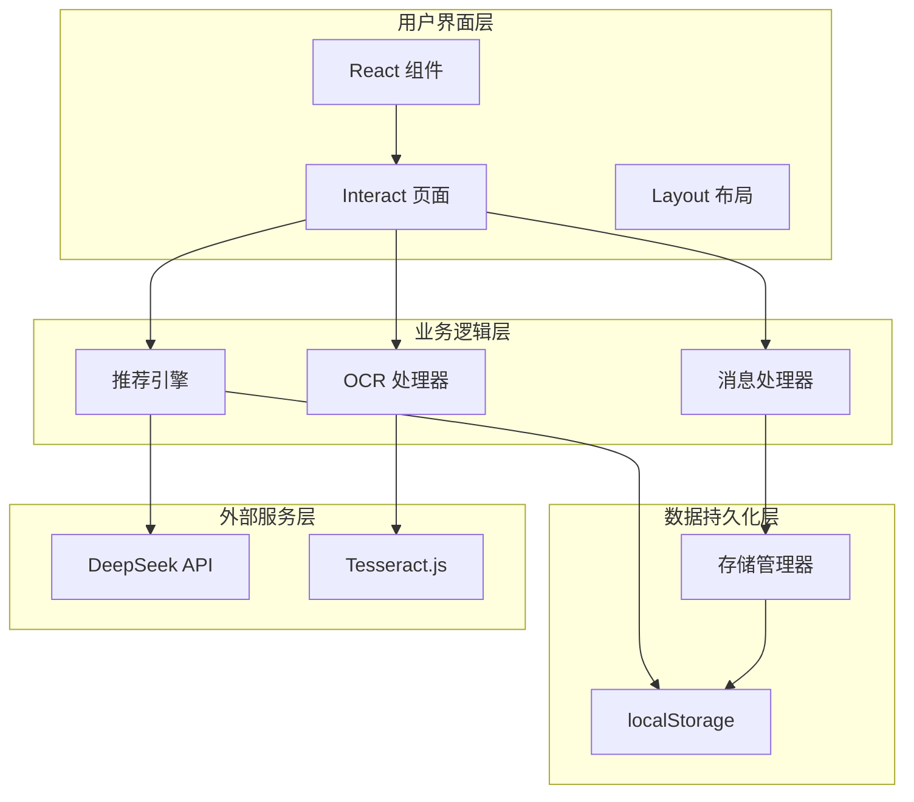
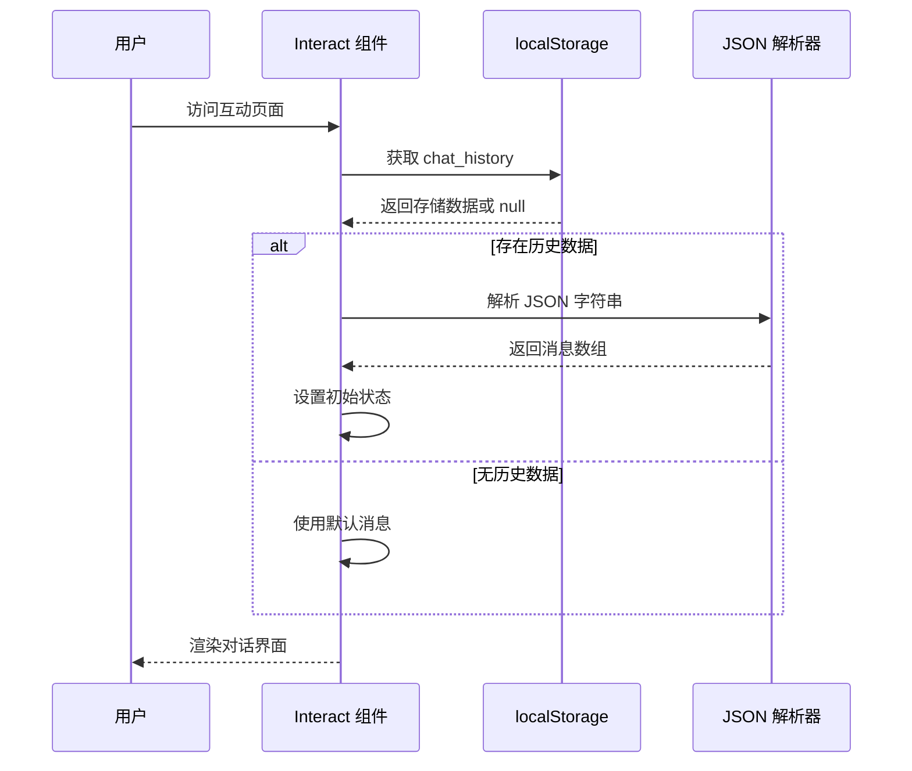
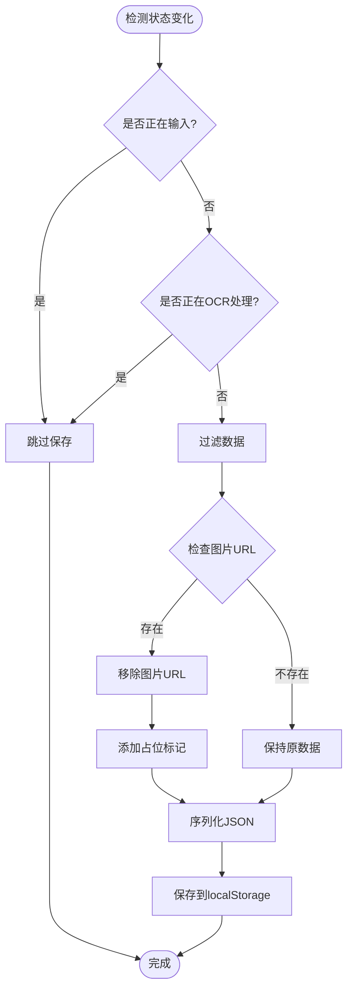
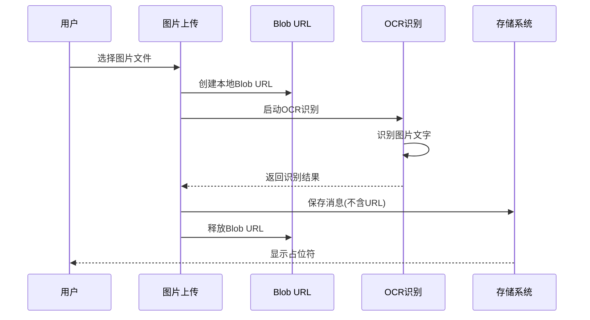
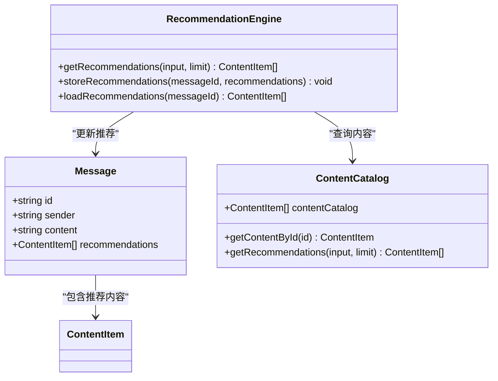
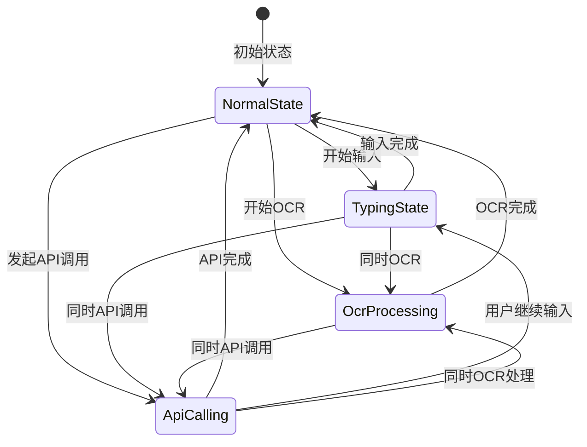
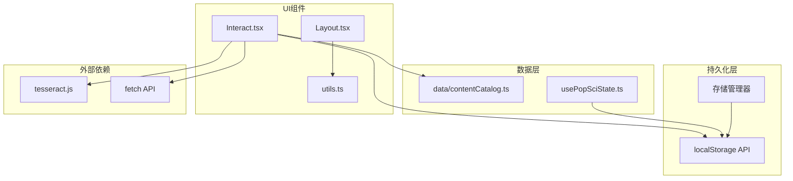
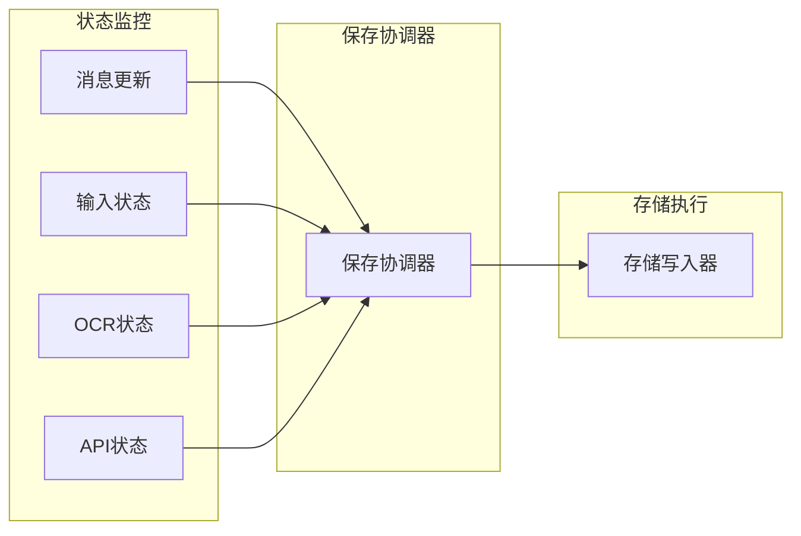

# 对话持久化机制

<cite>
**本文档引用的文件**
- [src/pages/Interact.tsx](file://src/pages/Interact.tsx)
- [docs/superpowers/specs/2026-04-14-chat-persistence-design.md](file://docs/superpowers/specs/2026-04-14-chat-persistence-design.md)
- [src/hooks/usePopSciState.ts](file://src/hooks/usePopSciState.ts)
- [src/data/contentCatalog.ts](file://src/data/contentCatalog.ts)
- [src/components/Layout.tsx](file://src/components/Layout.tsx)
- [src/lib/utils.ts](file://src/lib/utils.ts)
- [src/App.tsx](file://src/App.tsx)
- [src/main.tsx](file://src/main.tsx)
</cite>

## 目录
1. [简介](#简介)
2. [项目结构](#项目结构)
3. [核心组件](#核心组件)
4. [架构概览](#架构概览)
5. [详细组件分析](#详细组件分析)
6. [依赖关系分析](#依赖关系分析)
7. [性能考虑](#性能考虑)
8. [故障排除指南](#故障排除指南)
9. [结论](#结论)
10. [附录](#附录)

## 简介

本项目实现了基于 localStorage 的对话持久化系统，为用户提供跨页面和刷新的对话历史保存能力。该系统特别针对医疗健康场景设计，能够处理图片上传、OCR 文字识别、智能推荐等功能的持久化需求。

## 项目结构

该项目采用 React + TypeScript + Vite 技术栈，主要文件组织如下：

**图表来源**
- [src/main.tsx:1-11](file://src/main.tsx#L1-L11)
- [src/App.tsx:19-51](file://src/App.tsx#L19-L51)
- [src/pages/Interact.tsx:1-462](file://src/pages/Interact.tsx#L1-L462)

**章节来源**
- [src/main.tsx:1-11](file://src/main.tsx#L1-L11)
- [src/App.tsx:19-51](file://src/App.tsx#L19-L51)

## 核心组件

### 对话持久化核心实现

对话持久化系统的核心实现在 `Interact.tsx` 文件中，该组件负责：

1. **消息状态管理**：维护用户和AI的消息历史
2. **本地存储集成**：使用 localStorage 实现跨页面持久化
3. **图片处理机制**：处理检查报告图片的上传和OCR识别
4. **智能推荐系统**：基于用户查询内容提供相关内容推荐

### 数据模型设计

**图表来源**
- [src/pages/Interact.tsx:18-27](file://src/pages/Interact.tsx#L18-L27)
- [src/data/contentCatalog.ts:3-11](file://src/data/contentCatalog.ts#L3-L11)
- [src/hooks/usePopSciState.ts:6-9](file://src/hooks/usePopSciState.ts#L6-L9)

**章节来源**
- [src/pages/Interact.tsx:18-35](file://src/pages/Interact.tsx#L18-L35)
- [src/data/contentCatalog.ts:1-101](file://src/data/contentCatalog.ts#L1-L101)

## 架构概览

对话持久化系统采用分层架构设计，确保数据的可靠性和性能：

**图表来源**
- [src/pages/Interact.tsx:37-84](file://src/pages/Interact.tsx#L37-L84)
- [src/hooks/usePopSciState.ts:30-79](file://src/hooks/usePopSciState.ts#L30-L79)

## 详细组件分析

### 对话历史持久化机制

#### 初始化流程

**图表来源**
- [src/pages/Interact.tsx:37-49](file://src/pages/Interact.tsx#L37-L49)

#### 数据保存策略

系统采用智能保存策略，避免不必要的存储操作：

**图表来源**
- [src/pages/Interact.tsx:70-84](file://src/pages/Interact.tsx#L70-L84)

**章节来源**
- [src/pages/Interact.tsx:37-84](file://src/pages/Interact.tsx#L37-L84)

### 图片处理与存储优化

#### 大文件URL处理机制

系统针对图片上传进行了专门优化，避免存储空间溢出：

**图表来源**
- [src/pages/Interact.tsx:86-142](file://src/pages/Interact.tsx#L86-L142)

#### 内存优化策略

系统实施了多重内存优化措施：

1. **URL对象清理**：识别完成后立即释放 Blob URL
2. **数据精简**：仅保存必要的消息字段
3. **占位符机制**：用简洁标识替代完整图片数据
4. **条件保存**：避免在输入和处理状态下频繁保存

**章节来源**
- [src/pages/Interact.tsx:86-142](file://src/pages/Interact.tsx#L86-L142)

### 智能推荐系统持久化

#### 推荐结果存储

推荐系统与对话持久化深度集成：

**图表来源**
- [src/pages/Interact.tsx:231-235](file://src/pages/Interact.tsx#L231-L235)
- [src/data/contentCatalog.ts:69-99](file://src/data/contentCatalog.ts#L69-L99)

**章节来源**
- [src/pages/Interact.tsx:231-235](file://src/pages/Interact.tsx#L231-L235)
- [src/data/contentCatalog.ts:69-99](file://src/data/contentCatalog.ts#L69-L99)

### 状态持久化管理

#### typing状态处理

系统区分不同状态以优化存储时机：

| 状态类型 | 触发条件 | 存储行为 |
|---------|----------|----------|
| 正常状态 | `!isTyping && !isOcrProcessing` | 允许保存 |
| 输入状态 | `isTyping` | 跳过保存 |
| OCR处理 | `isOcrProcessing` | 跳过保存 |
| API调用 | `isApiCalling` | 跳过保存 |

#### 多状态协调机制

**图表来源**
- [src/pages/Interact.tsx:50-52](file://src/pages/Interact.tsx#L50-L52)
- [src/pages/Interact.tsx:70-84](file://src/pages/Interact.tsx#L70-L84)

**章节来源**
- [src/pages/Interact.tsx:50-52](file://src/pages/Interact.tsx#L50-L52)
- [src/pages/Interact.tsx:70-84](file://src/pages/Interact.tsx#L70-L84)

## 依赖关系分析

### 组件间依赖关系

**图表来源**
- [src/pages/Interact.tsx:8-9](file://src/pages/Interact.tsx#L8-L9)
- [src/hooks/usePopSciState.ts:30-38](file://src/hooks/usePopSciState.ts#L30-L38)

### 外部依赖分析

系统依赖的主要外部库：

1. **tesseract.js**：OCR文字识别
2. **react-markdown**：Markdown渲染
3. **lucide-react**：图标组件
4. **framer-motion**：动画效果

**章节来源**
- [src/pages/Interact.tsx:1-10](file://src/pages/Interact.tsx#L1-L10)
- [src/hooks/usePopSciState.ts:30-38](file://src/hooks/usePopSciState.ts#L30-L38)

## 性能考虑

### 存储空间管理

#### 容量限制应对策略

localStorage 约 5MB 的容量限制要求系统实施严格的存储优化：

1. **数据压缩**：移除冗余字段和大尺寸数据
2. **增量更新**：仅保存变化部分而非完整状态
3. **缓存策略**：合理控制消息数量和大小
4. **清理机制**：定期清理过期或无效数据

#### 批量写入优化

系统通过状态协调实现智能批量保存：

**图表来源**
- [src/pages/Interact.tsx:70-84](file://src/pages/Interact.tsx#L70-L84)

### 延迟保存策略

系统采用延迟保存机制减少存储压力：

1. **防抖处理**：连续状态变化合并为一次保存
2. **条件触发**：仅在稳定状态下执行保存
3. **异步处理**：避免阻塞主线程
4. **错误恢复**：保存失败时自动重试

**章节来源**
- [src/pages/Interact.tsx:70-84](file://src/pages/Interact.tsx#L70-L84)

## 故障排除指南

### 常见问题诊断

#### 数据恢复失败

**问题表现**：页面加载时对话历史丢失

**可能原因**：
1. localStorage 权限被禁用
2. 存储数据格式损坏
3. 浏览器存储空间不足

**解决方案**：
1. 检查浏览器开发者工具的 Application 面板
2. 验证 JSON 数据格式有效性
3. 清理过期或损坏的存储数据

#### 图片显示异常

**问题表现**：图片消息显示为占位符而非实际图片

**可能原因**：
1. Blob URL 已过期
2. 存储数据被清理
3. 浏览器缓存问题

**解决方案**：
1. 重新上传图片文件
2. 检查浏览器存储限制
3. 清除浏览器缓存

#### 推荐内容缺失

**问题表现**：AI回复中缺少相关内容推荐

**可能原因**：
1. API 密钥未配置
2. 网络连接异常
3. 推荐算法计算失败

**解决方案**：
1. 配置正确的 API 密钥环境变量
2. 检查网络连接状态
3. 查看控制台错误日志

**章节来源**
- [src/pages/Interact.tsx:42-47](file://src/pages/Interact.tsx#L42-L47)
- [src/pages/Interact.tsx:152-165](file://src/pages/Interact.tsx#L152-L165)

### 性能监控指标

建议监控以下关键指标：

1. **存储使用率**：监控 localStorage 使用情况
2. **保存频率**：统计保存操作的频率和时机
3. **恢复时间**：测量数据恢复的响应时间
4. **错误率**：跟踪持久化操作的成功率

## 结论

本对话持久化系统通过精心设计的架构和优化策略，成功实现了医疗健康场景下的对话历史保存需求。系统的主要优势包括：

1. **可靠性**：基于 localStorage 的跨页面持久化
2. **性能**：智能保存策略和内存优化
3. **扩展性**：模块化设计便于功能扩展
4. **用户体验**：无缝的对话体验和数据恢复

未来可以考虑的改进方向：
- 实现 IndexedDB 支持以处理更大规模数据
- 添加数据压缩和加密功能
- 增强错误处理和恢复机制
- 实现多设备同步功能

## 附录

### 配置选项

#### 环境变量配置

| 变量名 | 类型 | 必需 | 描述 |
|--------|------|------|------|
| VITE_DEEPSEEK_API_KEY | string | 否 | DeepSeek API 访问密钥 |

#### 存储键值映射

| 键名 | 数据类型 | 描述 |
|------|----------|------|
| chat_history | Message[] | 对话历史记录 |
| popsci_state_v1 | PopSciStateData | 科普内容收藏状态 |

### 最佳实践建议

1. **数据验证**：始终验证存储数据的有效性
2. **错误处理**：实现完善的异常捕获和恢复机制
3. **性能监控**：持续监控存储性能和用户体验
4. **安全考虑**：避免存储敏感个人信息
5. **兼容性**：确保跨浏览器兼容性