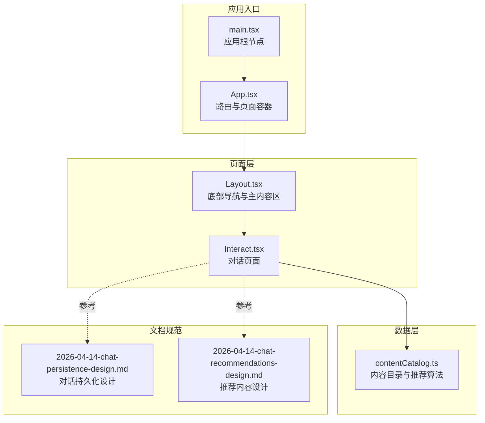
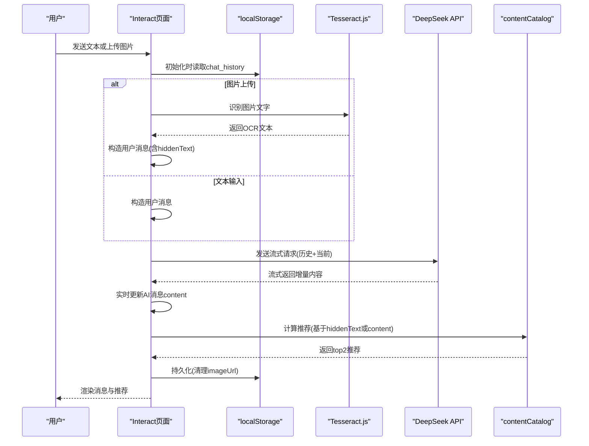
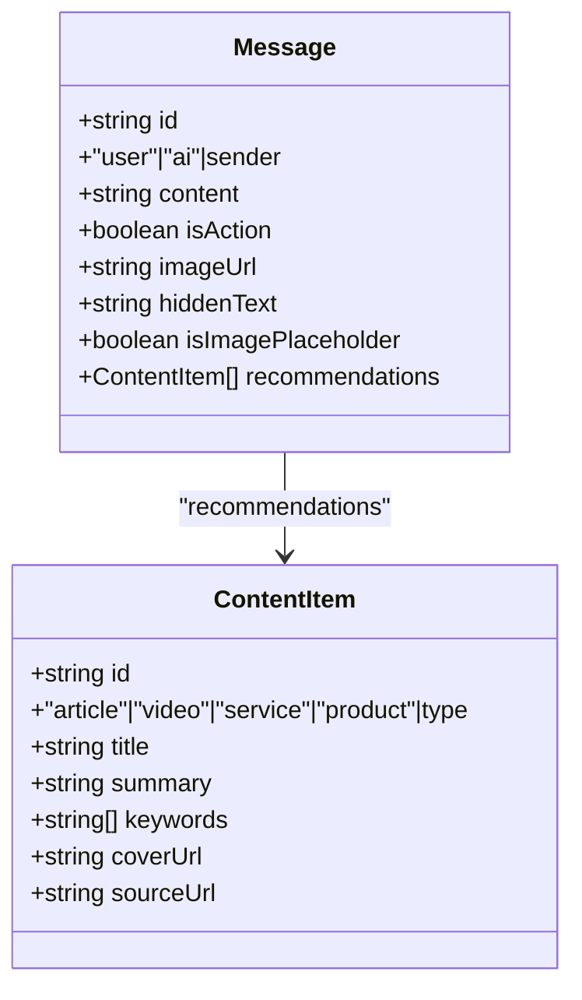
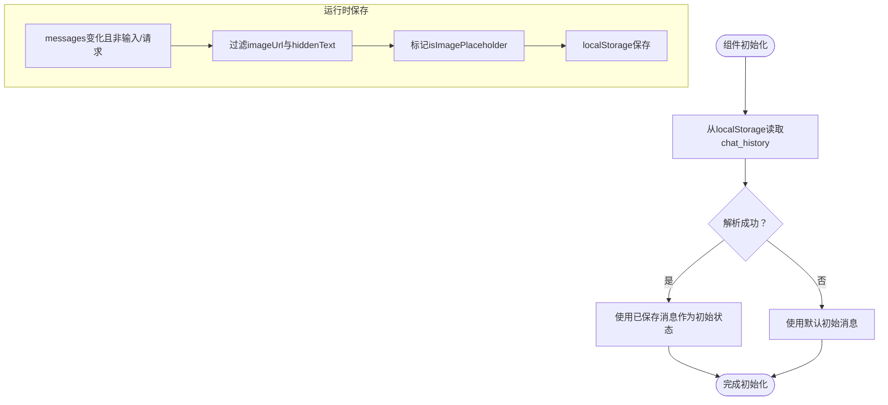
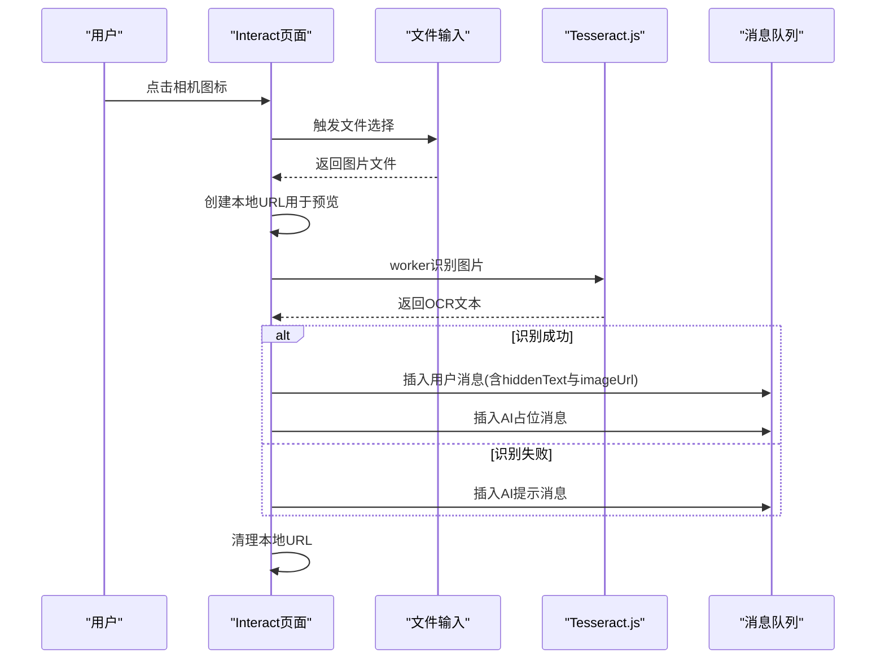
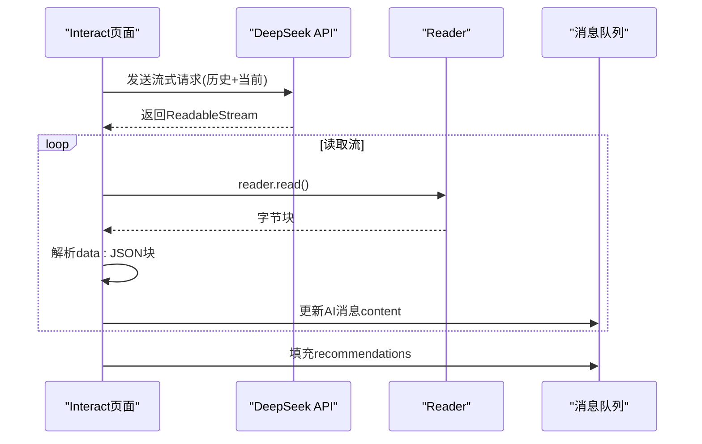
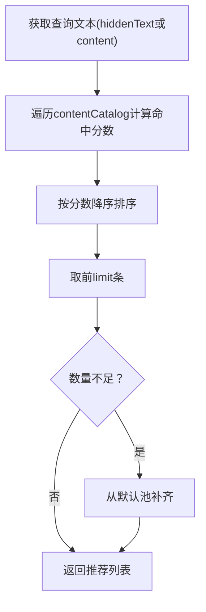
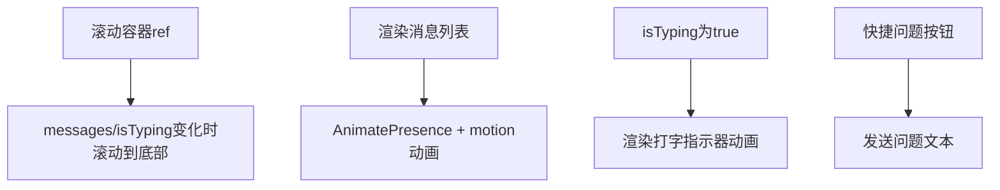
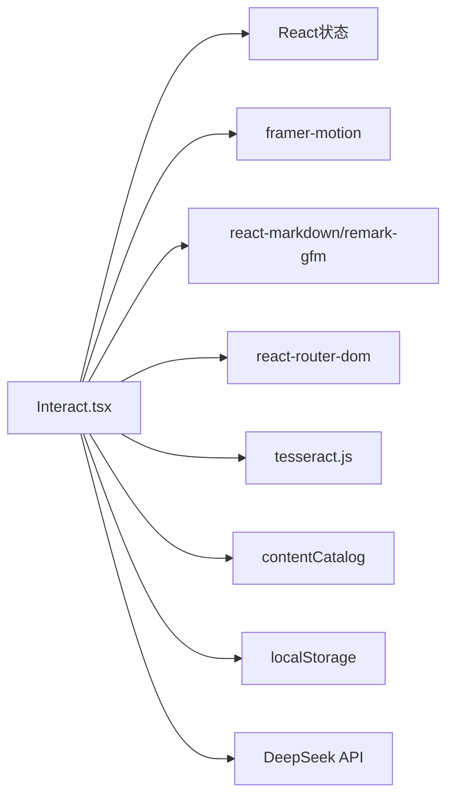

# 对话系统架构

<cite>
**本文档引用的文件**
- [Interact.tsx](file://src/pages/Interact.tsx)
- [App.tsx](file://src/App.tsx)
- [Layout.tsx](file://src/components/Layout.tsx)
- [contentCatalog.ts](file://src/data/contentCatalog.ts)
- [2026-04-14-chat-persistence-design.md](file://docs/superpowers/specs/2026-04-14-chat-persistence-design.md)
- [2026-04-14-chat-recommendations-design.md](file://docs/superpowers/specs/2026-04-14-chat-recommendations-design.md)
- [package.json](file://package.json)
- [README.md](file://README.md)
</cite>

## 目录
1. [简介](#简介)
2. [项目结构](#项目结构)
3. [核心组件](#核心组件)
4. [架构总览](#架构总览)
5. [详细组件分析](#详细组件分析)
6. [依赖关系分析](#依赖关系分析)
7. [性能考量](#性能考量)
8. [故障排查指南](#故障排查指南)
9. [结论](#结论)
10. [附录](#附录)

## 简介
本文件面向AI对话系统，聚焦Interact页面的对话状态管理机制，系统性解析以下方面：
- 消息队列的数据结构设计与消息类型区分（用户消息、AI回复、图片消息）
- 对话历史的持久化策略（localStorage、图片URL清理与占位）
- 消息生命周期管理、状态更新机制与UI渲染逻辑
- 消息对象的完整结构与字段作用（id、sender、content、imageUrl、hiddenText等）
- 对话滚动机制、动画效果实现与响应式布局适配
- 消息处理最佳实践、性能优化技巧与错误处理策略

## 项目结构
该项目采用React + TypeScript + Vite技术栈，页面级组件位于src/pages，通用组件位于src/components，数据目录位于src/data。Interact页面作为核心对话组件，负责消息状态、OCR图像识别、AI流式响应与推荐内容展示。

图表来源
- [main.tsx:1-11](file://src/main.tsx#L1-L11)
- [App.tsx:1-52](file://src/App.tsx#L1-L52)
- [Layout.tsx:1-66](file://src/components/Layout.tsx#L1-L66)
- [Interact.tsx:1-462](file://src/pages/Interact.tsx#L1-L462)
- [contentCatalog.ts:1-101](file://src/data/contentCatalog.ts#L1-L101)
- [2026-04-14-chat-persistence-design.md:1-22](file://docs/superpowers/specs/2026-04-14-chat-persistence-design.md#L1-L22)
- [2026-04-14-chat-recommendations-design.md:1-103](file://docs/superpowers/specs/2026-04-14-chat-recommendations-design.md#L1-L103)

章节来源
- [main.tsx:1-11](file://src/main.tsx#L1-L11)
- [App.tsx:1-52](file://src/App.tsx#L1-L52)
- [Layout.tsx:1-66](file://src/components/Layout.tsx#L1-L66)
- [Interact.tsx:1-462](file://src/pages/Interact.tsx#L1-L462)
- [contentCatalog.ts:1-101](file://src/data/contentCatalog.ts#L1-L101)
- [2026-04-14-chat-persistence-design.md:1-22](file://docs/superpowers/specs/2026-04-14-chat-persistence-design.md#L1-L22)
- [2026-04-14-chat-recommendations-design.md:1-103](file://docs/superpowers/specs/2026-04-14-chat-recommendations-design.md#L1-L103)

## 核心组件
- Interact页面：负责消息状态管理、OCR图像识别、AI流式响应、推荐内容渲染与UI动画。
- Layout组件：提供底部导航栏与主内容区容器，承载Interact页面。
- 内容目录与推荐：contentCatalog提供内容项与关键词匹配算法，用于AI回复后的推荐展示。

章节来源
- [Interact.tsx:1-462](file://src/pages/Interact.tsx#L1-L462)
- [Layout.tsx:1-66](file://src/components/Layout.tsx#L1-L66)
- [contentCatalog.ts:1-101](file://src/data/contentCatalog.ts#L1-L101)

## 架构总览
Interact页面通过React状态管理维护消息队列，结合localStorage实现跨路由持久化；通过tesseract.js实现图片OCR；通过DeepSeek API实现流式AI回复；通过contentCatalog实现推荐内容匹配与渲染。

图表来源
- [Interact.tsx:37-248](file://src/pages/Interact.tsx#L37-L248)
- [contentCatalog.ts:69-99](file://src/data/contentCatalog.ts#L69-L99)
- [2026-04-14-chat-persistence-design.md:1-22](file://docs/superpowers/specs/2026-04-14-chat-persistence-design.md#L1-L22)

## 详细组件分析

### 消息队列与数据结构
- 消息类型定义：包含id、sender（user/ai）、content、可选字段isAction、imageUrl、hiddenText、isImagePlaceholder、recommendations。
- 初始消息：包含欢迎语，便于首次进入时的引导。
- 消息生命周期：
  - 用户发送：构造用户消息，插入消息队列，同时插入一条空的AI消息占位，标记isAction=false。
  - AI响应：流式接收，逐步拼接content，实时更新对应AI消息。
  - 推荐生成：在AI响应完成后，基于查询文本计算推荐内容，填充recommendations。
  - 持久化：在非输入/请求状态下，过滤掉imageUrl以避免localStorage溢出，必要时标记isImagePlaceholder以便UI显示占位。

图表来源
- [Interact.tsx:18-27](file://src/pages/Interact.tsx#L18-L27)
- [contentCatalog.ts:3-11](file://src/data/contentCatalog.ts#L3-L11)

章节来源
- [Interact.tsx:18-35](file://src/pages/Interact.tsx#L18-L35)
- [Interact.tsx:70-84](file://src/pages/Interact.tsx#L70-L84)

### 对话历史持久化策略
- 读取策略：组件初始化时从localStorage读取chat_history，解析失败则回退到初始消息。
- 写入策略：监听messages变化，在非输入/请求状态时保存；保存前过滤imageUrl与hiddenText，避免存储空间溢出；对曾包含图片的消息标记isImagePlaceholder，以便UI显示占位。
- 影响范围：涉及Interact.tsx的初始化与持久化effect。

图表来源
- [Interact.tsx:37-49](file://src/pages/Interact.tsx#L37-L49)
- [Interact.tsx:70-84](file://src/pages/Interact.tsx#L70-L84)
- [2026-04-14-chat-persistence-design.md:11-22](file://docs/superpowers/specs/2026-04-14-chat-persistence-design.md#L11-L22)

章节来源
- [Interact.tsx:37-49](file://src/pages/Interact.tsx#L37-L49)
- [Interact.tsx:70-84](file://src/pages/Interact.tsx#L70-L84)
- [2026-04-14-chat-persistence-design.md:1-22](file://docs/superpowers/specs/2026-04-14-chat-persistence-design.md#L1-L22)

### 图片消息与OCR处理
- 图片上传：通过隐藏的file input触发，创建本地URL用于预览。
- OCR识别：使用tesseract.js创建worker，识别图片文本；清理多余空行。
- 消息构造：将OCR文本封装为hiddenText，content显示简要说明；同时保留imageUrl用于UI预览。
- 错误处理：识别失败或异常时，插入AI提示消息，并清理本地URL。

图表来源
- [Interact.tsx:86-142](file://src/pages/Interact.tsx#L86-L142)

章节来源
- [Interact.tsx:86-142](file://src/pages/Interact.tsx#L86-L142)

### AI流式响应与状态更新
- 请求构造：将历史消息映射为role/content，使用hiddenText或content作为当前用户消息。
- 流式读取：使用fetch的ReadableStream，按行解析data: JSON块，增量更新AI消息content。
- 状态控制：isTyping在请求开始时置true，请求结束或异常时置false；在非typing状态下才保存localStorage。
- 推荐生成：在AI响应完成后，基于查询文本计算推荐内容并填充至AI消息。

图表来源
- [Interact.tsx:144-248](file://src/pages/Interact.tsx#L144-L248)

章节来源
- [Interact.tsx:144-248](file://src/pages/Interact.tsx#L144-L248)

### 推荐内容与内容目录
- 推荐策略：基于输入文本与内容关键词的包含匹配，按命中次数排序，取前2条；不足时用默认推荐池补齐。
- UI渲染：在AI消息气泡下方渲染两条推荐卡片，点击跳转至站内详情页。
- 类型标签：根据ContentItem.type映射为中文标签。

图表来源
- [contentCatalog.ts:69-99](file://src/data/contentCatalog.ts#L69-L99)
- [Interact.tsx:353-376](file://src/pages/Interact.tsx#L353-L376)

章节来源
- [contentCatalog.ts:1-101](file://src/data/contentCatalog.ts#L1-L101)
- [Interact.tsx:353-376](file://src/pages/Interact.tsx#L353-L376)
- [2026-04-14-chat-recommendations-design.md:1-103](file://docs/superpowers/specs/2026-04-14-chat-recommendations-design.md#L1-L103)

### UI渲染与动画效果
- 滚动机制：每次messages或isTyping变化时，将滚动容器滚动到底部，确保最新消息可见。
- 动画效果：使用framer-motion实现消息入场动画与打字指示器的脉冲动画。
- 响应式布局：使用Tailwind类控制宽度、间距、圆角与阴影，配合max-w与flex布局适配移动端。
- 快速问题：顶部提供快捷问题按钮，点击即发送。

图表来源
- [Interact.tsx:64-68](file://src/pages/Interact.tsx#L64-L68)
- [Interact.tsx:296-398](file://src/pages/Interact.tsx#L296-L398)
- [Interact.tsx:280-293](file://src/pages/Interact.tsx#L280-L293)

章节来源
- [Interact.tsx:64-68](file://src/pages/Interact.tsx#L64-L68)
- [Interact.tsx:296-398](file://src/pages/Interact.tsx#L296-L398)
- [Interact.tsx:280-293](file://src/pages/Interact.tsx#L280-L293)

## 依赖关系分析
- Interact依赖：
  - 状态管理：useState/useEffect/useRef/useNavigate
  - 动画：framer-motion
  - Markdown渲染：react-markdown + remark-gfm
  - 路由：react-router-dom
  - OCR：tesseract.js
  - 内容目录：contentCatalog
- 外部依赖：DeepSeek API（流式响应）、localStorage（持久化）

图表来源
- [Interact.tsx:1-10](file://src/pages/Interact.tsx#L1-L10)
- [package.json:13-26](file://package.json#L13-L26)

章节来源
- [Interact.tsx:1-10](file://src/pages/Interact.tsx#L1-L10)
- [package.json:13-26](file://package.json#L13-L26)

## 性能考量
- 流式渲染：使用ReadableStream增量更新AI消息content，避免一次性渲染大文本，提升交互流畅度。
- 持久化优化：保存前过滤imageUrl与hiddenText，减少localStorage占用；仅在非输入/请求状态保存，降低频繁IO。
- 图片处理：OCR完成后及时清理本地URL，防止内存泄漏。
- 动画与滚动：仅在必要时触发动画与滚动，避免不必要的重排重绘。
- 推荐计算：关键词匹配为线性扫描，limit较小，性能可控；可考虑缓存热门查询结果以进一步优化。

## 故障排查指南
- OCR识别失败
  - 现象：插入AI提示消息，本地URL被清理。
  - 排查：确认图片格式与清晰度；检查tesseract.js worker创建与terminate流程。
  - 参考路径：[handleImageUpload:86-142](file://src/pages/Interact.tsx#L86-L142)
- API请求异常
  - 现象：AI消息content显示错误提示，isTyping置false。
  - 排查：检查DeepSeek API Key配置、网络连通性与响应体格式。
  - 参考路径：[fetchAIResponse:144-248](file://src/pages/Interact.tsx#L144-L248)
- 持久化异常
  - 现象：解析失败或localStorage溢出。
  - 排查：确认保存时机（非typing/ocr），检查过滤逻辑与占位标记。
  - 参考路径：[持久化effect:70-84](file://src/pages/Interact.tsx#L70-L84)
- 推荐无命中
  - 现象：使用默认推荐池补齐。
  - 排查：检查关键词匹配与默认池配置。
  - 参考路径：[getRecommendations:69-99](file://src/data/contentCatalog.ts#L69-L99)

章节来源
- [Interact.tsx:86-142](file://src/pages/Interact.tsx#L86-L142)
- [Interact.tsx:144-248](file://src/pages/Interact.tsx#L144-L248)
- [Interact.tsx:70-84](file://src/pages/Interact.tsx#L70-L84)
- [contentCatalog.ts:69-99](file://src/data/contentCatalog.ts#L69-L99)

## 结论
Interact页面通过精心设计的消息队列、完善的持久化策略、高效的OCR与流式AI响应机制，以及简洁实用的推荐内容系统，构建了一个体验良好、性能稳定的移动端AI对话系统。其状态管理与UI渲染解耦清晰，便于后续扩展与维护。

## 附录
- 快捷问题：顶部提供一组常见问题按钮，便于快速发起对话。
- 底部导航：Layout组件提供底部导航栏，承载Interact页面与其他页面。
- 路由配置：App.tsx中配置Interact路由与内容详情页路由。

章节来源
- [Interact.tsx:11-16](file://src/pages/Interact.tsx#L11-L16)
- [Layout.tsx:10-17](file://src/components/Layout.tsx#L10-L17)
- [App.tsx:29-46](file://src/App.tsx#L29-L46)