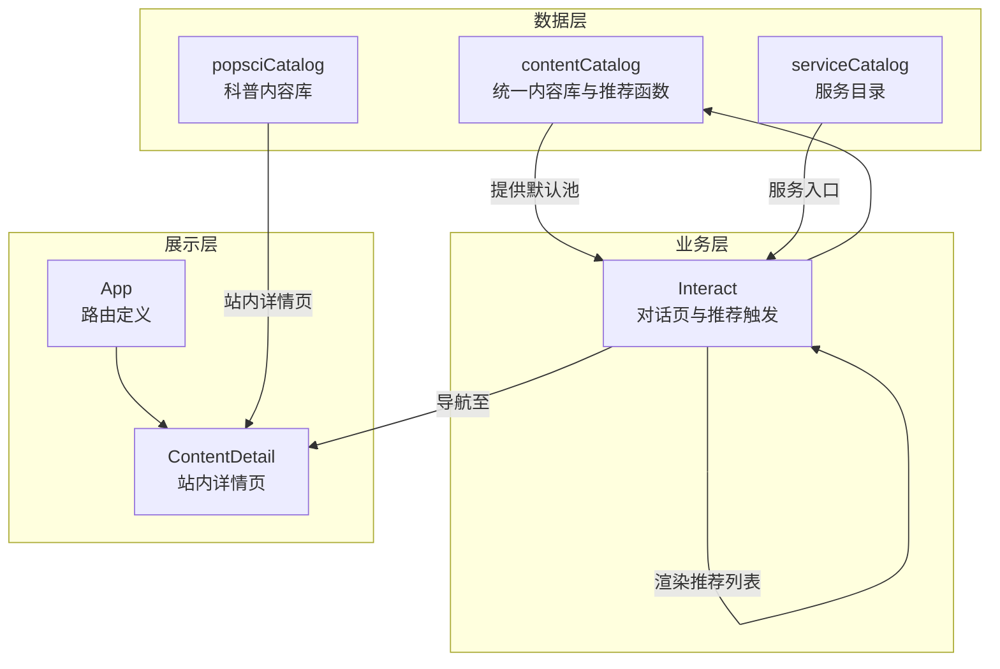
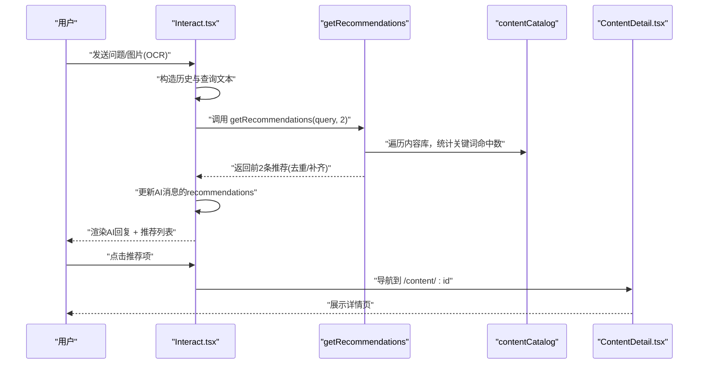
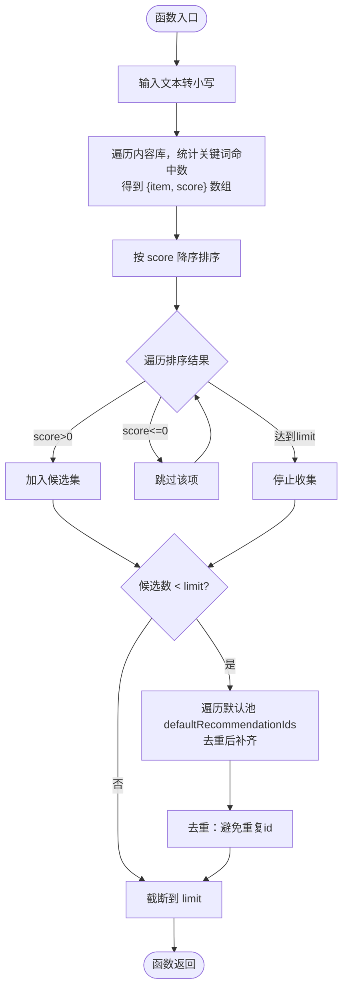
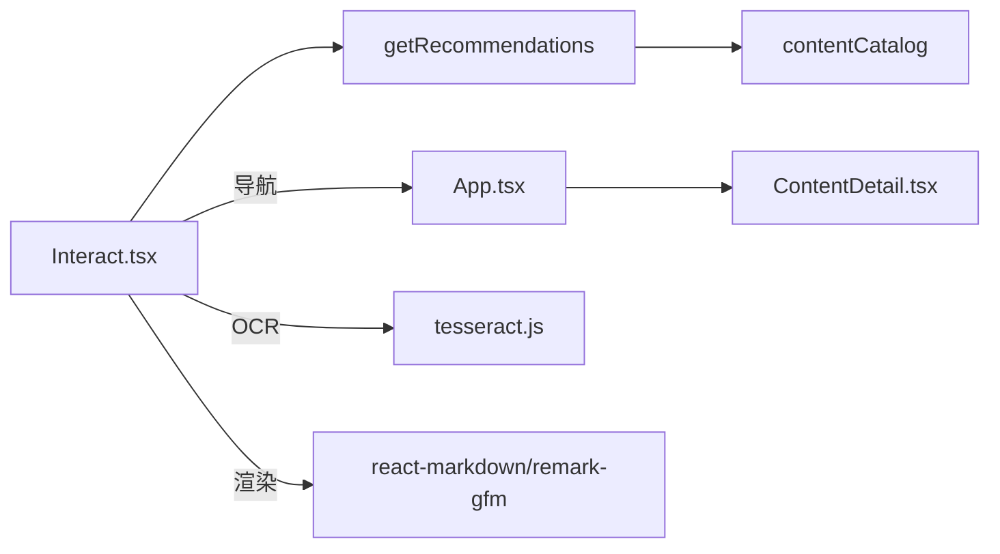

# 推荐算法设计

<cite>
**本文引用的文件**
- [contentCatalog.ts](file://src/data/contentCatalog.ts)
- [popsciCatalog.ts](file://src/data/popsciCatalog.ts)
- [serviceCatalog.ts](file://src/data/serviceCatalog.ts)
- [Interact.tsx](file://src/pages/Interact.tsx)
- [ContentDetail.tsx](file://src/pages/ContentDetail.tsx)
- [App.tsx](file://src/App.tsx)
- [2026-04-14-chat-recommendations-design.md](file://docs/superpowers/specs/2026-04-14-chat-recommendations-design.md)
- [README.md](file://README.md)
- [package.json](file://package.json)
</cite>

## 目录
1. [简介](#简介)
2. [项目结构](#项目结构)
3. [核心组件](#核心组件)
4. [架构总览](#架构总览)
5. [详细组件分析](#详细组件分析)
6. [依赖关系分析](#依赖关系分析)
7. [性能考量](#性能考量)
8. [故障排查指南](#故障排查指南)
9. [结论](#结论)
10. [附录](#附录)

## 简介
本文件面向AI推荐算法的技术文档，聚焦于对话后推荐模块的实现与扩展。系统在用户完成一次提问（含文本或图片报告）并收到AI回复后，在该条AI消息气泡下方自动展示2条相关推荐内容，引导用户继续阅读科普文章/视频、观看视频或了解服务包/商品。推荐内容来源于本地固定内容库，通过关键词包含匹配规则计算相似度，按分数排序并进行去重与数量限制，最终进入站内详情页。

## 项目结构
推荐系统涉及以下关键文件与职责划分：
- 数据层
  - contentCatalog：统一的内容库（文章/视频/服务/商品），提供关键词与元数据，以及推荐计算函数
  - popsciCatalog：科普内容库（文章/视频），用于站内详情页与列表展示
  - serviceCatalog：服务目录，提供服务项的描述与CTA信息
- 业务层
  - Interact：对话页，负责构造输入文本、调用推荐函数、渲染AI回复与推荐列表
- 展示层
  - ContentDetail：站内详情页，承载推荐项进入后的落地页
  - App：路由定义，包含content/:id等路由
- 设计文档
  - 2026-04-14-chat-recommendations-design：推荐策略、UI交互与验收标准的规范说明

图表来源
- [contentCatalog.ts:1-101](file://src/data/contentCatalog.ts#L1-L101)
- [popsciCatalog.ts:1-98](file://src/data/popsciCatalog.ts#L1-L98)
- [serviceCatalog.ts:1-49](file://src/data/serviceCatalog.ts#L1-L49)
- [Interact.tsx:1-200](file://src/pages/Interact.tsx#L1-L200)
- [ContentDetail.tsx:1-134](file://src/pages/ContentDetail.tsx#L1-L134)
- [App.tsx:1-52](file://src/App.tsx#L1-L52)

章节来源
- [contentCatalog.ts:1-101](file://src/data/contentCatalog.ts#L1-L101)
- [popsciCatalog.ts:1-98](file://src/data/popsciCatalog.ts#L1-L98)
- [serviceCatalog.ts:1-49](file://src/data/serviceCatalog.ts#L1-L49)
- [Interact.tsx:1-200](file://src/pages/Interact.tsx#L1-L200)
- [ContentDetail.tsx:1-134](file://src/pages/ContentDetail.tsx#L1-L134)
- [App.tsx:1-52](file://src/App.tsx#L1-L52)
- [2026-04-14-chat-recommendations-design.md:1-103](file://docs/superpowers/specs/2026-04-14-chat-recommendations-design.md#L1-L103)

## 核心组件
- 统一内容库与推荐函数
  - ContentItem结构：包含id、type、title、summary、keywords、coverUrl、sourceUrl等字段
  - defaultRecommendationIds：默认推荐池，用于在无命中时补齐
  - getRecommendations(input, limit)：核心推荐函数，执行关键词匹配、打分、排序、去重与数量限制
- 对话页与推荐触发
  - Interact.tsx：构造消息、调用getRecommendations、渲染AI回复与推荐列表
- 站内详情页
  - ContentDetail.tsx：根据id从contentCatalog加载内容，展示摘要、关键词与外部链接/服务入口
- 路由与导航
  - App.tsx：定义content/:id等路由，支撑推荐项跳转

章节来源
- [contentCatalog.ts:3-11](file://src/data/contentCatalog.ts#L3-L11)
- [contentCatalog.ts:58-67](file://src/data/contentCatalog.ts#L58-L67)
- [contentCatalog.ts:69-99](file://src/data/contentCatalog.ts#L69-L99)
- [Interact.tsx:18-27](file://src/pages/Interact.tsx#L18-L27)
- [Interact.tsx:231-235](file://src/pages/Interact.tsx#L231-L235)
- [ContentDetail.tsx:14-17](file://src/pages/ContentDetail.tsx#L14-L17)
- [App.tsx:45](file://src/App.tsx#L45)

## 架构总览
推荐系统采用“本地固定内容库 + 规则匹配”的轻量级架构，确保稳定性与可控性。核心流程如下：
- 输入文本来源：普通文本提问或图片OCR后的hiddenText
- 推荐计算：遍历contentCatalog，对每个ContentItem统计关键词命中次数作为相似度分数
- 排序与筛选：按分数降序，过滤零分项，达到limit后停止；不足时用默认池补齐，再次去重
- 结果绑定：将推荐结果写入AI消息的recommendations字段，渲染为按钮列表
- 导航：点击推荐项跳转至站内详情页

图表来源
- [Interact.tsx:231-235](file://src/pages/Interact.tsx#L231-L235)
- [contentCatalog.ts:69-99](file://src/data/contentCatalog.ts#L69-L99)
- [ContentDetail.tsx:14-17](file://src/pages/ContentDetail.tsx#L14-L17)

章节来源
- [Interact.tsx:231-235](file://src/pages/Interact.tsx#L231-L235)
- [contentCatalog.ts:69-99](file://src/data/contentCatalog.ts#L69-L99)
- [ContentDetail.tsx:14-17](file://src/pages/ContentDetail.tsx#L14-L17)
- [2026-04-14-chat-recommendations-design.md:55-68](file://docs/superpowers/specs/2026-04-14-chat-recommendations-design.md#L55-L68)

## 详细组件分析

### getRecommendations函数实现原理
- 查询内容分析
  - 输入文本统一转小写，便于不区分大小写的关键词匹配
  - 从用户消息中优先取hiddenText（OCR文本），否则取content
- 相似度计算
  - 对每个ContentItem，遍历其keywords数组，统计输入文本中包含关键词的数量
  - 该数量即为相似度分数score
- 推荐结果筛选机制
  - 先映射为{item, score}数组，再按score降序排序
  - 顺序遍历，累计加入结果集，达到limit后停止
  - 过滤掉score<=0的项
  - 若不足limit，则遍历默认推荐池defaultRecommendationIds，逐个去重后补齐
  - 最终截断到limit长度

图表来源
- [contentCatalog.ts:69-99](file://src/data/contentCatalog.ts#L69-L99)

章节来源
- [contentCatalog.ts:69-99](file://src/data/contentCatalog.ts#L69-L99)
- [Interact.tsx:231-235](file://src/pages/Interact.tsx#L231-L235)

### 推荐系统的数据源与使用
- contentCatalog（统一内容库）
  - 提供ContentItem集合与关键词字段，作为推荐匹配的核心数据源
  - 提供getContentById与defaultRecommendationIds，用于详情页与默认池补齐
- popsciCatalog（科普内容库）
  - 提供PopSciItem集合，支持文章/视频两类，用于站内详情页与列表展示
- serviceCatalog（服务目录）
  - 提供服务项描述、CTA等，用于服务入口与跳转

章节来源
- [contentCatalog.ts:13-67](file://src/data/contentCatalog.ts#L13-L67)
- [popsciCatalog.ts:29-98](file://src/data/popsciCatalog.ts#L29-L98)
- [serviceCatalog.ts:10-49](file://src/data/serviceCatalog.ts#L10-L49)

### 推荐算法核心逻辑
- 关键词匹配
  - 使用包含匹配（includes）判断输入文本是否包含某关键词
  - 不区分大小写，提升召回鲁棒性
- 语义分析
  - 当前实现为基于关键词的浅层匹配，未引入词向量或语义模型
- 内容类型权重计算
  - 当前实现未对不同类型（文章/视频/服务/商品）设置差异化权重
  - 可在扩展点中增加类型权重与多模态特征融合

章节来源
- [contentCatalog.ts:72-78](file://src/data/contentCatalog.ts#L72-L78)
- [2026-04-14-chat-recommendations-design.md:60-67](file://docs/superpowers/specs/2026-04-14-chat-recommendations-design.md#L60-L67)

### 排序策略、去重机制与数量限制
- 排序策略
  - 按关键词命中数降序排序，确保相关性强的内容优先
- 去重机制
  - 在补齐默认池时，检查候选集中是否已存在相同id，避免重复
- 数量限制
  - 默认limit=2，保证推荐列表简洁明确

章节来源
- [contentCatalog.ts:79](file://src/data/contentCatalog.ts#L79)
- [contentCatalog.ts:82-96](file://src/data/contentCatalog.ts#L82-L96)
- [Interact.tsx:355-356](file://src/pages/Interact.tsx#L355-L356)

### UI组件绑定机制与交互设计
- 推荐结果绑定
  - Interact.tsx在AI消息中新增recommendations字段，渲染为按钮列表
  - 每条推荐项显示类型标签、标题与右侧箭头图标
- 点击行为
  - 点击推荐项触发导航至/content/:id
- 详情页展示
  - ContentDetail根据id从contentCatalog加载内容，展示摘要、关键词与外部链接/服务入口

章节来源
- [Interact.tsx:353-369](file://src/pages/Interact.tsx#L353-L369)
- [App.tsx:45](file://src/App.tsx#L45)
- [ContentDetail.tsx:14-17](file://src/pages/ContentDetail.tsx#L14-L17)

## 依赖关系分析
- 组件耦合
  - Interact依赖contentCatalog的getRecommendations与类型标签映射
  - ContentDetail依赖contentCatalog的getContentById
  - App路由支撑站内详情页导航
- 外部依赖
  - tesseract.js：用于图片OCR，提取hiddenText
  - react-router-dom：用于路由与导航
  - remark-gfm、react-markdown：用于AI回复的Markdown渲染

图表来源
- [Interact.tsx:8-9](file://src/pages/Interact.tsx#L8-L9)
- [contentCatalog.ts:69-99](file://src/data/contentCatalog.ts#L69-L99)
- [App.tsx:45](file://src/App.tsx#L45)
- [ContentDetail.tsx:14-17](file://src/pages/ContentDetail.tsx#L14-L17)
- [package.json:24](file://package.json#L24)
- [package.json:20-21](file://package.json#L20-L21)

章节来源
- [Interact.tsx:8-9](file://src/pages/Interact.tsx#L8-L9)
- [package.json:20-25](file://package.json#L20-L25)

## 性能考量
- 时间复杂度
  - 对于N条内容，关键词匹配为O(N·K)，K为每条内容的关键词数量；排序为O(N log N)
  - 整体约为O(N log N + N·K)
- 空间复杂度
  - 需要额外数组存储{item, score}与候选集，空间复杂度O(N)
- 优化建议
  - 缓存关键词索引（如建立小写词到内容ID的倒排索引），将匹配降为O(K_query)
  - 限制输入文本长度与关键词数量，避免极端情况
  - 对默认池进行预过滤（如按类型分布），减少补齐轮次
  - 并行化OCR与API调用，缩短端到端响应时间

[本节为通用性能讨论，无需特定文件来源]

## 故障排查指南
- 推荐无命中
  - 检查输入文本是否为空或过短
  - 确认contentCatalog中是否存在相关关键词
  - 验证defaultRecommendationIds是否包含有效id且未被去重
- OCR文本过长
  - hiddenText仅用于推荐匹配与模型输入，不直接渲染
  - 建议在OCR后做摘要或截断处理
- 路由错误
  - 站内详情页兜底“未找到内容”，检查id是否存在于contentCatalog
- API异常
  - 当未配置API Key或网络异常时，系统会回退到本地推荐并提示错误

章节来源
- [Interact.tsx:154-165](file://src/pages/Interact.tsx#L154-L165)
- [Interact.tsx:240-247](file://src/pages/Interact.tsx#L240-L247)
- [ContentDetail.tsx:43-56](file://src/pages/ContentDetail.tsx#L43-L56)
- [2026-04-14-chat-recommendations-design.md:93-96](file://docs/superpowers/specs/2026-04-14-chat-recommendations-design.md#L93-L96)

## 结论
本推荐系统以“本地固定内容库 + 关键词包含匹配”为核心，具备实现简单、可控性强、端到端性能稳定的特点。当前版本满足最小可用目标，后续可在关键词索引、类型权重、语义增强与A/B测试等方面持续演进，以提升推荐质量与用户体验。

[本节为总结性内容，无需特定文件来源]

## 附录

### 推荐系统的扩展点
- 新算法集成
  - 引入TF-IDF/余弦相似度或嵌入向量相似度，替换当前包含匹配
  - 增加类型权重与多模态特征（标题、摘要、关键词、封面图等）
- 性能优化
  - 建立倒排索引与缓存，降低匹配与排序成本
  - 限制输入与关键词长度，控制内存与CPU占用
- A/B测试方案
  - 将推荐函数抽象为策略接口，按用户/会话维度分流
  - 定义点击率、停留时长、转化率等指标评估效果
- 用户反馈与迭代
  - 收集用户对推荐结果的显隐反馈，持续优化关键词与默认池
  - 建立灰度发布与回滚机制，保障稳定性

[本节为概念性扩展建议，无需特定文件来源]