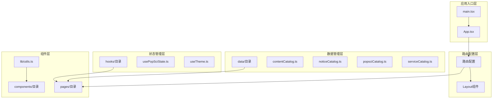
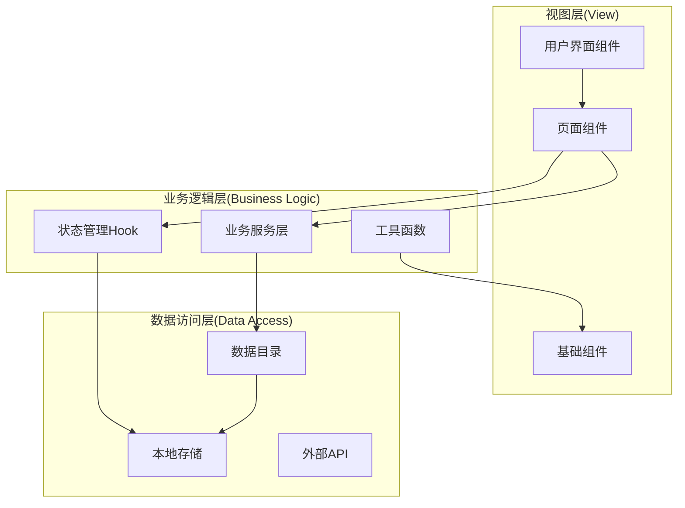
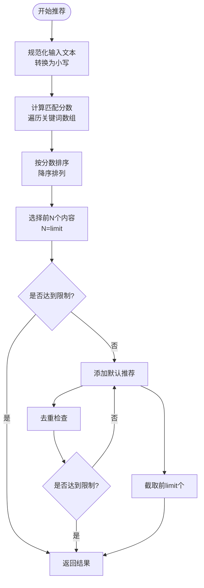
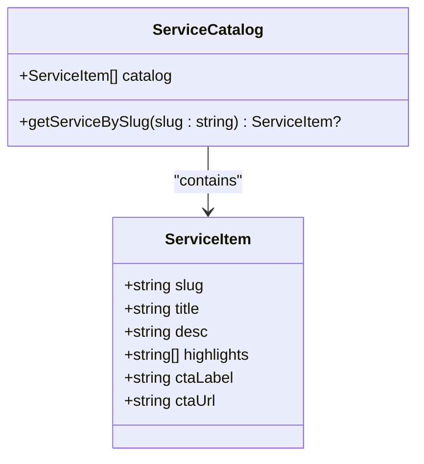
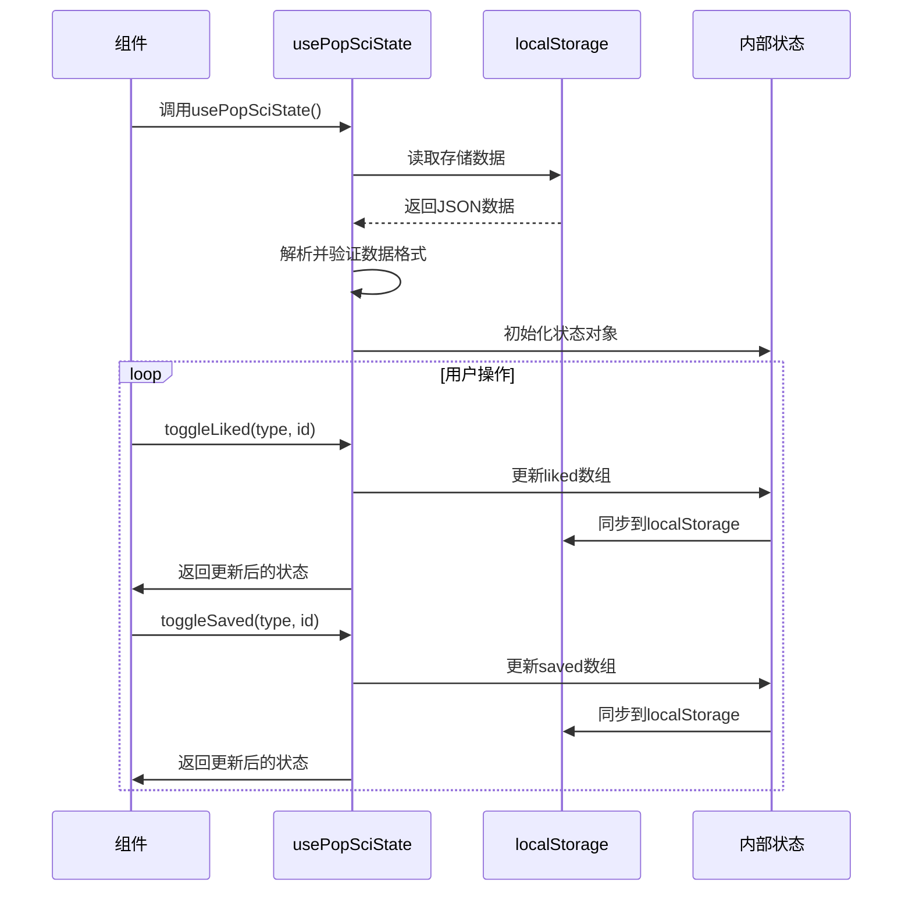
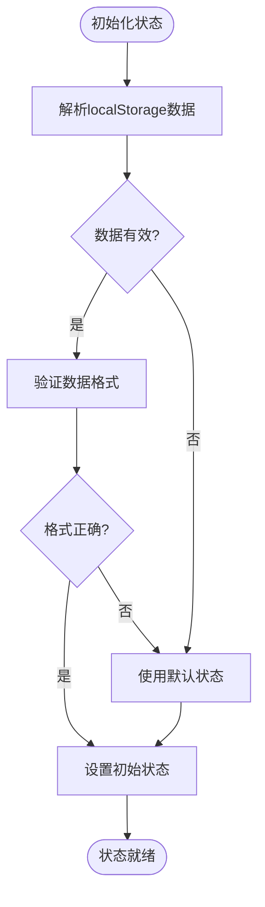
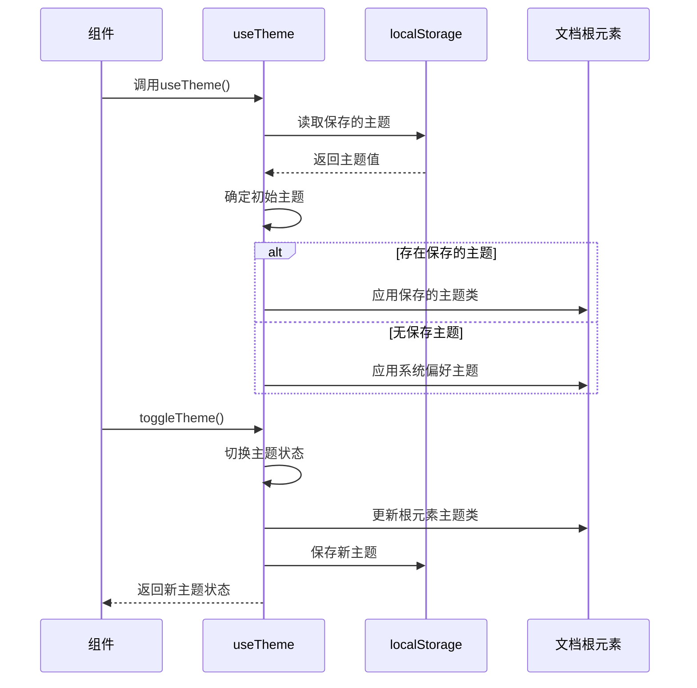
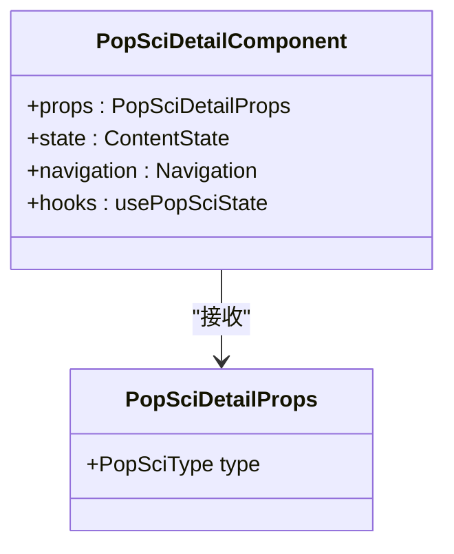
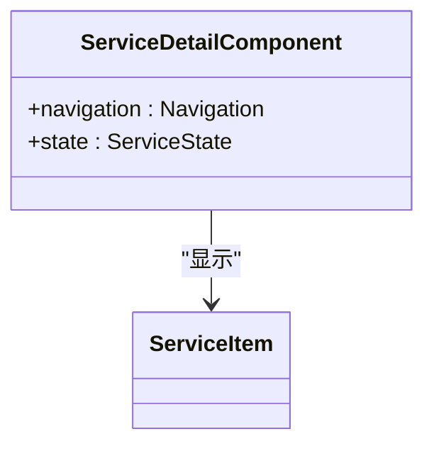
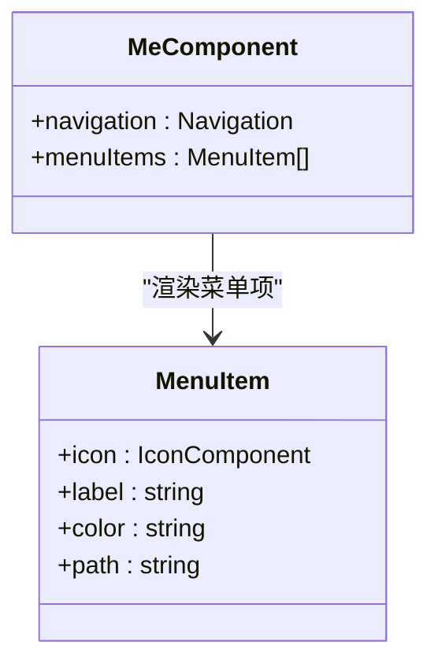

# API参考文档

<cite>
**本文档引用的文件**
- [contentCatalog.ts](file://src/data/contentCatalog.ts)
- [noticeCatalog.ts](file://src/data/noticeCatalog.ts)
- [popsciCatalog.ts](file://src/data/popsciCatalog.ts)
- [serviceCatalog.ts](file://src/data/serviceCatalog.ts)
- [usePopSciState.ts](file://src/hooks/usePopSciState.ts)
- [useTheme.ts](file://src/hooks/useTheme.ts)
- [utils.ts](file://src/lib/utils.ts)
- [App.tsx](file://src/App.tsx)
- [Layout.tsx](file://src/components/Layout.tsx)
- [PopSciDetail.tsx](file://src/pages/PopSciDetail.tsx)
- [ServiceDetail.tsx](file://src/pages/ServiceDetail.tsx)
- [Me.tsx](file://src/pages/Me.tsx)
- [package.json](file://package.json)
- [tsconfig.json](file://tsconfig.json)
- [README.md](file://README.md)
</cite>

## 目录
1. [简介](#简介)
2. [项目结构](#项目结构)
3. [核心组件](#核心组件)
4. [架构概览](#架构概览)
5. [详细组件分析](#详细组件分析)
6. [依赖分析](#依赖分析)
7. [性能考虑](#性能考虑)
8. [故障排除指南](#故障排除指南)
9. [结论](#结论)
10. [附录](#附录)

## 简介

本项目是一个基于React + TypeScript + Vite构建的移动端健康科普应用，专注于提供科学严谨的健康知识传播和个性化内容推荐服务。应用采用模块化架构设计，通过数据目录管理内容生态，通过状态管理Hook实现用户行为追踪，通过组件化开发确保代码的可维护性和可扩展性。

本API参考文档旨在为开发者提供全面的技术接口说明，涵盖数据目录接口、状态管理Hook、组件Props接口以及相关的类型定义和使用规范。文档将详细解释每个API的设计理念、调用方式、参数验证规则和错误处理机制，并提供最佳实践指导和性能优化建议。

## 项目结构

项目采用清晰的分层架构，主要分为以下几个核心层次：



**图表来源**
- [main.tsx:1-11](file://src/main.tsx#L1-L11)
- [App.tsx:19-52](file://src/App.tsx#L19-L52)
- [Layout.tsx:19-66](file://src/components/Layout.tsx#L19-L66)

**章节来源**
- [main.tsx:1-11](file://src/main.tsx#L1-L11)
- [App.tsx:19-52](file://src/App.tsx#L19-L52)
- [Layout.tsx:19-66](file://src/components/Layout.tsx#L19-L66)

## 核心组件

### 数据目录系统

数据目录系统是应用的核心数据层，负责管理不同类型的内容资源。系统包含四个主要的数据目录模块：

1. **内容目录** (`contentCatalog.ts`) - 管理文章、视频、服务、产品等综合内容
2. **公告目录** (`noticeCatalog.ts`) - 管理提醒和新闻类公告
3. **科普目录** (`popsciCatalog.ts`) - 管理科普文章和视频内容
4. **服务目录** (`serviceCatalog.ts`) - 管理医疗服务和产品信息

### 状态管理Hook

应用提供了两个核心的状态管理Hook：

1. **usePopSciState** - 管理用户对科普内容的点赞和收藏状态
2. **useTheme** - 管理应用主题切换和持久化存储

### 工具函数

工具函数库提供了一些常用的辅助功能，目前包含CSS类名合并工具。

**章节来源**
- [contentCatalog.ts:1-101](file://src/data/contentCatalog.ts#L1-L101)
- [noticeCatalog.ts:1-59](file://src/data/noticeCatalog.ts#L1-L59)
- [popsciCatalog.ts:1-98](file://src/data/popsciCatalog.ts#L1-L98)
- [serviceCatalog.ts:1-49](file://src/data/serviceCatalog.ts#L1-L49)
- [usePopSciState.ts:1-80](file://src/hooks/usePopSciState.ts#L1-L80)
- [useTheme.ts:1-29](file://src/hooks/useTheme.ts#L1-L29)
- [utils.ts:1-7](file://src/lib/utils.ts#L1-L7)

## 架构概览

应用采用MVVM架构模式，通过清晰的职责分离实现松耦合的设计：



**图表来源**
- [App.tsx:19-52](file://src/App.tsx#L19-L52)
- [usePopSciState.ts:30-80](file://src/hooks/usePopSciState.ts#L30-L80)
- [useTheme.ts:5-29](file://src/hooks/useTheme.ts#L5-L29)

## 详细组件分析

### 数据目录API

#### 内容目录 (contentCatalog.ts)

内容目录管理系统提供统一的内容管理接口，支持多种内容类型的标准化存储和检索。

**类型定义**

```mermaid
classDiagram
class ContentType {
<<enumeration>>
"article"
"video"
"service"
"product"
}
class ContentItem {
+string id
+ContentType type
+string title
+string summary
+string[] keywords
+string coverUrl?
+string sourceUrl?
}
class ContentCatalog {
+ContentItem[] catalog
+string[] defaultRecommendationIds
+getContentById(id : string) ContentItem?
+getRecommendations(input : string, limit : number) ContentItem[]
}
ContentCatalog --> ContentItem : "contains"
ContentItem --> ContentType : "uses"
```

**图表来源**
- [contentCatalog.ts:1-101](file://src/data/contentCatalog.ts#L1-L101)

**API接口规范**

1. **getContentById**
   - 参数: `id` (string) - 内容唯一标识符
   - 返回值: `ContentItem | undefined` - 匹配的内容项或undefined
   - 功能: 根据ID精确查找内容项

2. **getRecommendations**
   - 参数: 
     - `input` (string) - 搜索关键词
     - `limit` (number, 默认2) - 推荐数量限制
   - 返回值: `ContentItem[]` - 推荐内容列表
   - 功能: 基于关键词匹配度的内容推荐算法

**算法流程图**



**图表来源**
- [contentCatalog.ts:69-99](file://src/data/contentCatalog.ts#L69-L99)

**章节来源**
- [contentCatalog.ts:1-101](file://src/data/contentCatalog.ts#L1-L101)

#### 公告目录 (noticeCatalog.ts)

公告目录专门管理提醒和新闻类公告信息，提供分类管理和检索功能。

**类型定义**

```mermaid
classDiagram
class NoticeCategory {
<<enumeration>>
"reminder"
"news"
}
class NoticeItem {
+string id
+NoticeCategory category
+string title
+string summary?
+string contentMarkdown
+string publishedAt?
}
class NoticeCatalog {
+NoticeItem[] catalog
+getNoticeById(id : string) NoticeItem?
+listNotices(category : NoticeCategory) NoticeItem[]
}
NoticeCatalog --> NoticeItem : "contains"
NoticeItem --> NoticeCategory : "uses"
```

**图表来源**
- [noticeCatalog.ts:1-59](file://src/data/noticeCatalog.ts#L1-L59)

**API接口规范**

1. **getNoticeById**
   - 参数: `id` (string) - 公告唯一标识符
   - 返回值: `NoticeItem | undefined` - 匹配的公告项
   - 功能: 根据ID查找特定公告

2. **listNotices**
   - 参数: `category` (NoticeCategory) - 公告分类
   - 返回值: `NoticeItem[]` - 指定分类的所有公告
   - 功能: 获取指定分类下的所有公告列表

**章节来源**
- [noticeCatalog.ts:1-59](file://src/data/noticeCatalog.ts#L1-L59)

#### 科普目录 (popsciCatalog.ts)

科普目录管理健康科普内容，支持文章和视频两种形式的多媒体内容。

**类型定义**

```mermaid
classDiagram
class PopSciType {
<<enumeration>>
"article"
"video"
}
class PopSciItemBase {
+string id
+PopSciType type
+string title
+string summary
+string coverUrl
+string[] tags
+string author?
+string publishedAt?
+number views?
+number likes?
}
class PopSciArticle {
+string bodyMarkdown
}
class PopSciVideo {
+string duration?
+string sourceUrl
}
class PopSciItem {
<<union type>>
PopSciArticle | PopSciVideo
}
class PopSciCatalog {
+PopSciItem[] catalog
+getPopSciItem(type : PopSciType, id : string) PopSciItem?
+listPopSci(type : PopSciType) PopSciItem[]
}
PopSciItemBase <|-- PopSciArticle
PopSciItemBase <|-- PopSciVideo
PopSciCatalog --> PopSciItem : "contains"
PopSciItem --> PopSciType : "uses"
```

**图表来源**
- [popsciCatalog.ts:1-98](file://src/data/popsciCatalog.ts#L1-L98)

**API接口规范**

1. **getPopSciItem**
   - 参数: 
     - `type` (PopSciType) - 内容类型
     - `id` (string) - 内容唯一标识符
   - 返回值: `PopSciItem | undefined` - 匹配的科普内容
   - 功能: 根据类型和ID查找特定科普内容

2. **listPopSci**
   - 参数: `type` (PopSciType) - 内容类型
   - 返回值: `PopSciItem[]` - 指定类型的所有科普内容
   - 功能: 获取指定类型的所有科普内容列表

**章节来源**
- [popsciCatalog.ts:1-98](file://src/data/popsciCatalog.ts#L1-L98)

#### 服务目录 (serviceCatalog.ts)

服务目录管理医疗服务和产品信息，提供标准化的服务描述和导航。

**类型定义**



**图表来源**
- [serviceCatalog.ts:1-49](file://src/data/serviceCatalog.ts#L1-L49)

**API接口规范**

1. **getServiceBySlug**
   - 参数: `slug` (string) - 服务URL友好标识符
   - 返回值: `ServiceItem | undefined` - 匹配的服务项
   - 功能: 根据slug查找特定服务

**章节来源**
- [serviceCatalog.ts:1-49](file://src/data/serviceCatalog.ts#L1-L49)

### 状态管理Hook API

#### usePopSciState Hook

usePopSciState Hook提供用户对科普内容的交互状态管理，包括点赞和收藏功能。

**Hook接口规范**



**图表来源**
- [usePopSciState.ts:30-80](file://src/hooks/usePopSciState.ts#L30-L80)

**Hook返回值结构**

| 属性名 | 类型 | 描述 | 默认值 |
|--------|------|------|--------|
| isLiked | `(type: PopSciType, id: string) => boolean` | 检查内容是否已点赞 | - |
| isSaved | `(type: PopSciType, id: string) => boolean` | 检查内容是否已收藏 | - |
| toggleLiked | `(type: PopSciType, id: string) => void` | 切换点赞状态 | - |
| toggleSaved | `(type: PopSciType, id: string) => void` | 切换收藏状态 | - |
| likedKeys | `string[]` | 所有已点赞内容的键数组 | [] |
| savedKeys | `string[]` | 所有已收藏内容的键数组 | [] |
| likedCount | `number` | 点赞总数 | 0 |
| savedCount | `number` | 收藏总数 | 0 |

**状态存储格式**



**图表来源**
- [usePopSciState.ts:13-34](file://src/hooks/usePopSciState.ts#L13-L34)

**章节来源**
- [usePopSciState.ts:1-80](file://src/hooks/usePopSciState.ts#L1-L80)

#### useTheme Hook

useTheme Hook提供应用主题切换和持久化功能，支持明暗主题模式。

**Hook接口规范**



**图表来源**
- [useTheme.ts:5-29](file://src/hooks/useTheme.ts#L5-L29)

**Hook返回值结构**

| 属性名 | 类型 | 描述 | 示例值 |
|--------|------|------|--------|
| theme | `"light" \| "dark"` | 当前主题状态 | "light" 或 "dark" |
| toggleTheme | `() => void` | 切换主题的方法 | - |
| isDark | `boolean` | 是否为深色主题 | true/false |

**章节来源**
- [useTheme.ts:1-29](file://src/hooks/useTheme.ts#L1-L29)

### 组件Props接口

#### PopSciDetail 组件

PopSciDetail组件用于显示具体的科普内容详情，支持文章和视频两种类型。

**Props接口定义**



**图表来源**
- [PopSciDetail.tsx:15-19](file://src/pages/PopSciDetail.tsx#L15-L19)

**组件功能特性**

1. **类型安全**: 通过泛型约束确保type参数的有效性
2. **响应式导航**: 使用react-router-dom进行页面导航
3. **状态集成**: 集成usePopSciState进行用户交互状态管理
4. **条件渲染**: 根据内容类型动态渲染不同的UI布局

**章节来源**
- [PopSciDetail.tsx:1-150](file://src/pages/PopSciDetail.tsx#L1-L150)

#### ServiceDetail 组件

ServiceDetail组件用于显示服务详情页面。

**Props接口定义**



**图表来源**
- [ServiceDetail.tsx:6-9](file://src/pages/ServiceDetail.tsx#L6-L9)

**组件功能特性**

1. **无Props需求**: 通过URL参数获取服务信息
2. **导航集成**: 提供返回和跳转功能
3. **响应式设计**: 适配移动端显示需求

**章节来源**
- [ServiceDetail.tsx:1-75](file://src/pages/ServiceDetail.tsx#L1-L75)

#### Me 组件

Me组件作为用户中心页面的基础布局组件。

**Props接口定义**



**图表来源**
- [Me.tsx:4-12](file://src/pages/Me.tsx#L4-L12)

**组件功能特性**

1. **菜单管理**: 动态生成用户中心菜单
2. **导航集成**: 集成路由导航功能
3. **图标系统**: 使用Lucide React图标库

**章节来源**
- [Me.tsx:1-65](file://src/pages/Me.tsx#L1-L65)

### 工具函数API

#### cn 函数

cn函数提供CSS类名合并功能，结合clsx和tailwind-merge实现智能类名处理。

**函数签名**
- `cn(...inputs: ClassValue[]): string`

**参数说明**
- `...inputs: ClassValue[]` - 可变数量的类名输入，支持字符串、对象、数组等

**功能特性**
1. **智能合并**: 自动处理重复类名和空值
2. **Tailwind兼容**: 与Tailwind CSS类名冲突解决
3. **类型安全**: 完整的TypeScript类型支持

**章节来源**
- [utils.ts:1-7](file://src/lib/utils.ts#L1-L7)

## 依赖分析

项目采用现代化的前端技术栈，主要依赖关系如下：

```mermaid
graph TB
subgraph "运行时依赖"
React[react@^18.3.1]
ReactDOM[react-dom@^18.3.1]
Router[react-router-dom@^7.3.0]
Markdown[react-markdown@^10.1.0]
Icons[lucide-react@^0.511.0]
Framer[framer-motion@^12.38.0]
Tailwind[tailwind-merge@^3.0.2]
end
subgraph "开发时依赖"
Vite[vite@^6.3.5]
TS[typescript@~5.8.3]
ESLint[eslint@^9.25.0]
SWC[plugin-react-swc@...]
end
subgraph "应用代码"
AppCode[应用代码]
Data[data/目录]
Hooks[hooks/目录]
Pages[pages/目录]
Components[components/目录]
end
AppCode --> React
AppCode --> Router
AppCode --> Markdown
AppCode --> Icons
Data --> AppCode
Hooks --> AppCode
Pages --> AppCode
Components --> AppCode
```

**图表来源**
- [package.json:13-46](file://package.json#L13-L46)

**章节来源**
- [package.json:1-48](file://package.json#L1-L48)
- [tsconfig.json:1-38](file://tsconfig.json#L1-L38)

## 性能考虑

### 数据访问优化

1. **内存缓存**: 所有数据目录在首次访问时加载到内存中，避免重复I/O操作
2. **懒加载**: 页面组件按需加载，减少初始包体积
3. **状态持久化**: 使用localStorage缓存用户状态，提升用户体验

### 渲染性能

1. **React.memo**: 合理使用React.memo避免不必要的重新渲染
2. **useMemo/useCallback**: 对复杂计算和回调函数进行缓存
3. **虚拟滚动**: 对长列表内容使用虚拟滚动技术

### 网络优化

1. **CDN资源**: 图片和静态资源通过CDN加速
2. **图片懒加载**: 实现图片的延迟加载机制
3. **压缩传输**: 启用Gzip/Brotli压缩

## 故障排除指南

### 常见问题及解决方案

**问题1: 数据加载失败**
- 检查网络连接和API可用性
- 验证数据格式的完整性
- 查看控制台错误日志

**问题2: 状态同步异常**
- 确认localStorage权限
- 检查数据序列化格式
- 验证状态更新逻辑

**问题3: 主题切换失效**
- 检查CSS类名冲突
- 验证DOM元素存在性
- 确认事件绑定正确性

**章节来源**
- [usePopSciState.ts:13-24](file://src/hooks/usePopSciState.ts#L13-L24)
- [useTheme.ts:14-18](file://src/hooks/useTheme.ts#L14-L18)

## 结论

本项目通过精心设计的API架构实现了功能完整、性能优良的健康科普应用。数据目录系统提供了统一的内容管理接口，状态管理Hook确保了用户交互体验的一致性，组件化的开发模式保证了代码的可维护性和可扩展性。

未来的发展方向包括：
1. 增强API的错误处理和重试机制
2. 扩展数据目录的搜索和过滤功能
3. 优化移动端的性能表现
4. 增加国际化支持

## 附录

### 版本管理策略

项目采用语义化版本控制，遵循以下规则：
- 主版本号：重大API变更
- 次版本号：新增功能但向后兼容
- 修订号：bug修复和小改进

### 兼容性说明

- **浏览器支持**: 现代浏览器（Chrome 80+, Firefox 74+, Safari 13+）
- **移动端支持**: iOS 13+ 和 Android 6+
- **无障碍支持**: 符合WCAG 2.1 AA标准

### 迁移指南

当API发生破坏性变更时，按照以下步骤进行迁移：

1. **备份当前代码** - 确保可以回滚
2. **更新依赖版本** - 修改package.json中的版本号
3. **重构API调用** - 更新所有API使用点
4. **测试验证** - 全面测试功能完整性
5. **部署上线** - 逐步部署到生产环境

**章节来源**
- [README.md:1-58](file://README.md#L1-L58)