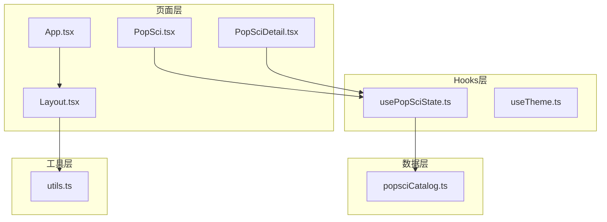
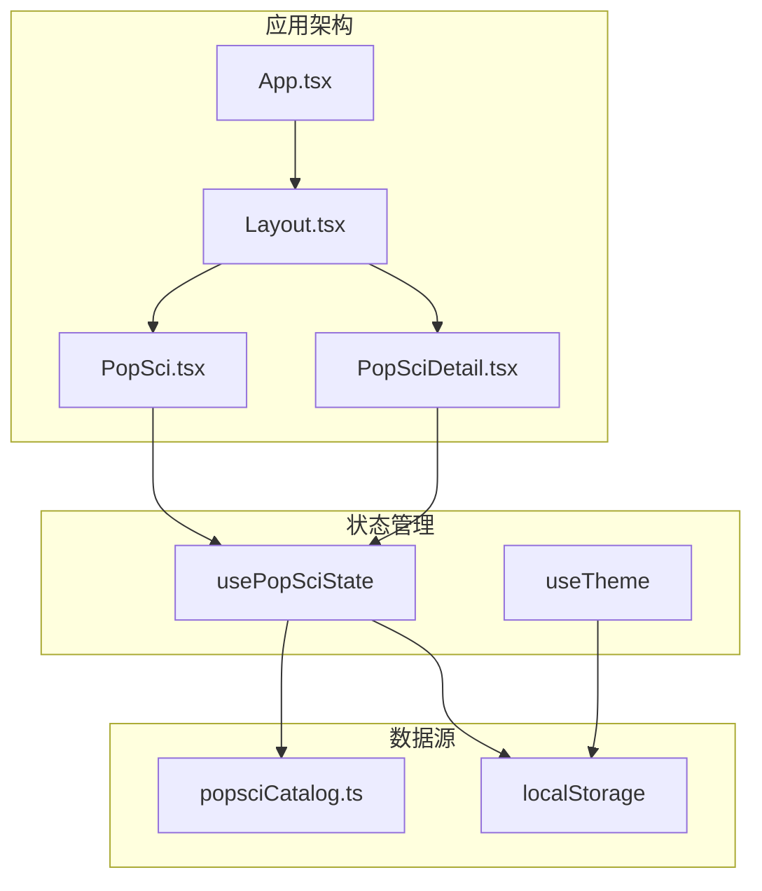
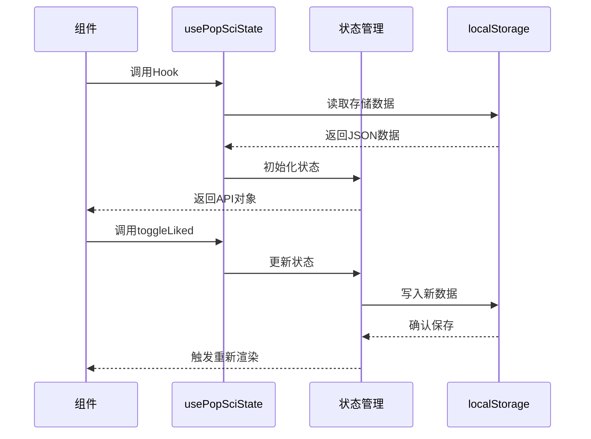
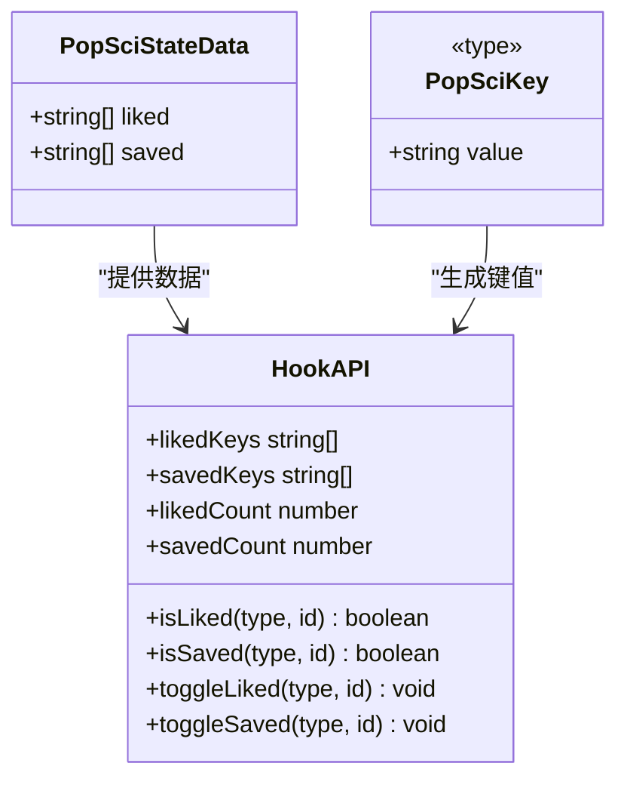
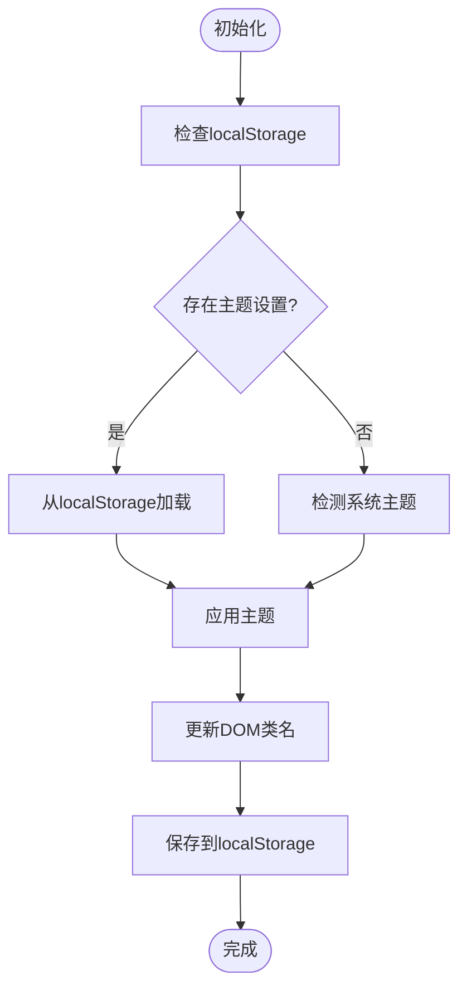
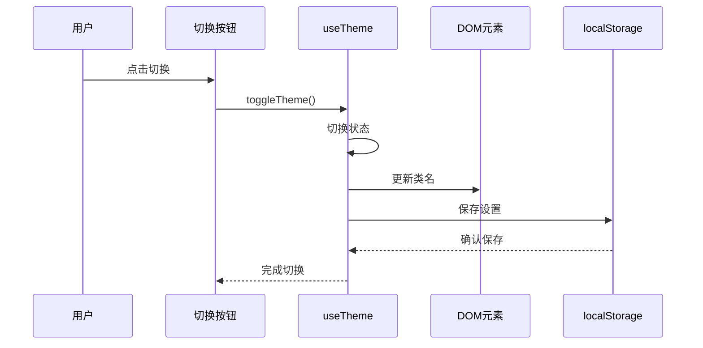
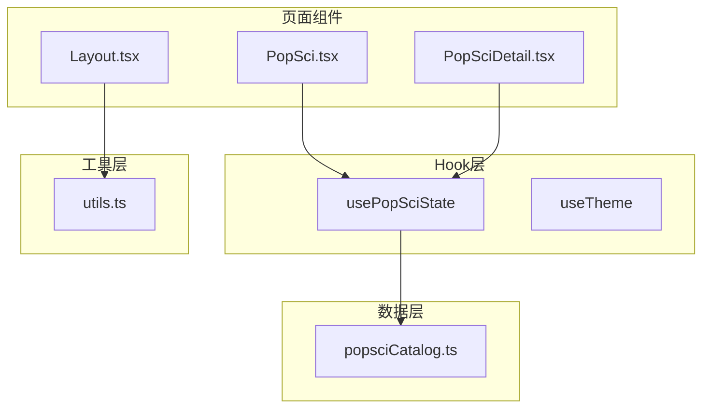
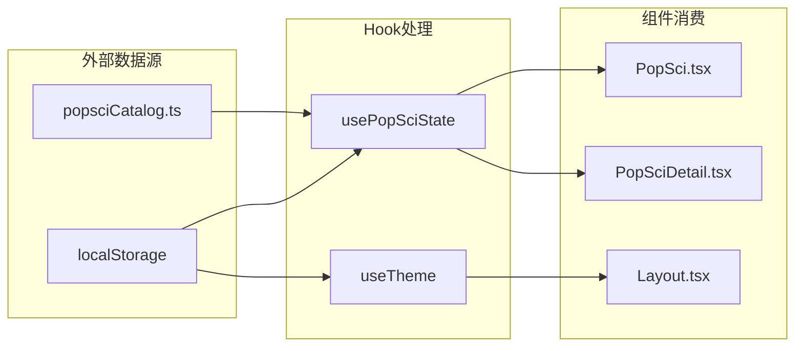

# Hook接口文档

<cite>
**本文档引用的文件**
- [usePopSciState.ts](file://src/hooks/usePopSciState.ts)
- [useTheme.ts](file://src/hooks/useTheme.ts)
- [PopSci.tsx](file://src/pages/PopSci.tsx)
- [PopSciDetail.tsx](file://src/pages/PopSciDetail.tsx)
- [Layout.tsx](file://src/components/Layout.tsx)
- [App.tsx](file://src/App.tsx)
- [popsciCatalog.ts](file://src/data/popsciCatalog.ts)
- [utils.ts](file://src/lib/utils.ts)
</cite>

## 目录
1. [简介](#简介)
2. [项目结构](#项目结构)
3. [核心组件](#核心组件)
4. [架构概览](#架构概览)
5. [详细组件分析](#详细组件分析)
6. [依赖关系分析](#依赖关系分析)
7. [性能考虑](#性能考虑)
8. [故障排除指南](#故障排除指南)
9. [结论](#结论)

## 简介

本文件为应用中自定义Hook的全面API参考文档，重点涵盖`usePopSciState`和`useTheme`两个核心Hook的设计与使用方法。文档详细说明了Hook的接口设计、参数定义、返回值结构、状态管理机制以及副作用处理方式。同时深入解析了Hook的内部实现原理、依赖关系和性能优化策略，并提供了完整的使用示例、最佳实践和常见陷阱说明。

## 项目结构

该项目采用React + TypeScript构建，主要涉及以下关键目录和文件：



**图表来源**
- [usePopSciState.ts:1-80](file://src/hooks/usePopSciState.ts#L1-L80)
- [useTheme.ts:1-29](file://src/hooks/useTheme.ts#L1-L29)
- [PopSci.tsx:1-270](file://src/pages/PopSci.tsx#L1-L270)
- [PopSciDetail.tsx:1-150](file://src/pages/PopSciDetail.tsx#L1-L150)

**章节来源**
- [usePopSciState.ts:1-80](file://src/hooks/usePopSciState.ts#L1-L80)
- [useTheme.ts:1-29](file://src/hooks/useTheme.ts#L1-L29)

## 核心组件

### usePopSciState Hook

`usePopSciState`是一个专门用于管理科普内容收藏和点赞状态的自定义Hook。它提供了完整的状态持久化机制，支持localStorage存储和实时UI更新。

#### 主要功能特性
- **状态持久化**：自动保存和恢复用户收藏/点赞状态
- **类型安全**：使用联合类型确保内容类型的正确性
- **高性能**：通过useCallback和useMemo优化渲染性能
- **原子操作**：提供toggle方法实现原子性的状态切换

#### 返回值结构
Hook返回一个包含以下属性的对象：

| 属性名 | 类型 | 描述 |
|--------|------|------|
| isLiked | `(type: PopSciType, id: string) => boolean` | 检查指定内容是否已点赞 |
| isSaved | `(type: PopSciType, id: string) => boolean` | 检查指定内容是否已收藏 |
| toggleLiked | `(type: PopSciType, id: string) => void` | 切换指定内容的点赞状态 |
| toggleSaved | `(type: PopSciType, id: string) => void` | 切换指定内容的收藏状态 |
| likedKeys | `string[]` | 当前所有已点赞内容的键数组 |
| savedKeys | `string[]` | 当前所有已收藏内容的键数组 |
| likedCount | `number` | 已点赞内容的数量 |
| savedCount | `number` | 已收藏内容的数量 |

**章节来源**
- [usePopSciState.ts:30-79](file://src/hooks/usePopSciState.ts#L30-L79)

### useTheme Hook

`useTheme`是一个用于管理应用主题切换的自定义Hook，支持明暗主题模式的自动检测和手动切换。

#### 主要功能特性
- **系统主题检测**：自动检测用户的系统偏好设置
- **本地存储持久化**：保存用户的选择主题
- **DOM类名管理**：动态更新根元素的主题类名
- **简洁API设计**：提供直观的主题切换接口

#### 返回值结构
Hook返回一个包含以下属性的对象：

| 属性名 | 类型 | 描述 |
|--------|------|------|
| theme | `"light" \| "dark"` | 当前主题状态 |
| toggleTheme | `() => void` | 切换主题的方法 |
| isDark | `boolean` | 是否为暗色主题的便捷属性 |

**章节来源**
- [useTheme.ts:5-29](file://src/hooks/useTheme.ts#L5-L29)

## 架构概览

两个Hook在应用中的整体架构关系如下：



**图表来源**
- [App.tsx:19-51](file://src/App.tsx#L19-L51)
- [Layout.tsx:19-65](file://src/components/Layout.tsx#L19-L65)
- [PopSci.tsx:26-29](file://src/pages/PopSci.tsx#L26-L29)
- [PopSciDetail.tsx:15-18](file://src/pages/PopSciDetail.tsx#L15-L18)

## 详细组件分析

### usePopSciState Hook深度解析

#### 内部实现原理



**图表来源**
- [usePopSciState.ts:30-79](file://src/hooks/usePopSciState.ts#L30-L79)

#### 数据结构设计

Hook使用复合数据结构来管理状态：



**图表来源**
- [usePopSciState.ts:6-28](file://src/hooks/usePopSciState.ts#L6-L28)

#### 性能优化策略

1. **useCallback优化**：对所有返回函数使用useCallback进行记忆化
2. **useMemo优化**：对整个API对象使用useMemo避免不必要的重渲染
3. **依赖数组优化**：精确控制effect和回调函数的依赖项
4. **条件渲染**：根据状态变化进行条件渲染

**章节来源**
- [usePopSciState.ts:40-79](file://src/hooks/usePopSciState.ts#L40-L79)

### useTheme Hook深度解析

#### 实现机制



**图表来源**
- [useTheme.ts:5-18](file://src/hooks/useTheme.ts#L5-L18)

#### 主题切换流程



**图表来源**
- [useTheme.ts:20-22](file://src/hooks/useTheme.ts#L20-L22)

**章节来源**
- [useTheme.ts:14-18](file://src/hooks/useTheme.ts#L14-L18)

### Hook使用示例

#### 在列表页面使用usePopSciState

```typescript
// PopSci.tsx中的使用示例
const { isLiked, isSaved, toggleLiked, toggleSaved } = usePopSciState();

// 在卡片渲染中使用
const liked = isLiked(item.type, item.id);
const saved = isSaved(item.type, item.id);

// 在按钮点击事件中使用
<button
  onClick={(e) => {
    e.preventDefault();
    e.stopPropagation();
    toggleSaved(item.type, item.id);
  }}
>
  {saved ? <BookmarkCheck size={16} /> : <Bookmark size={16} />}
</button>
```

#### 在详情页面使用usePopSciState

```typescript
// PopSciDetail.tsx中的使用示例
const { isLiked, isSaved, toggleLiked, toggleSaved } = usePopSciState();
const liked = item ? isLiked(item.type, item.id) : false;
const saved = item ? isSaved(item.type, item.id) : false;

// 在头部收藏和点赞按钮中使用
<button
  onClick={() => toggleSaved(item.type, item.id)}
  className={cn(
    "w-9 h-9 rounded-full bg-white border shadow-sm flex items-center justify-center transition-colors",
    saved ? "text-[#6a9bcc] border-[#6a9bcc]/40" : "text-[#b0aea5] border-[#e8e6dc] hover:text-[#6a9bcc] hover:border[#6a9bcc]/30"
  )}
>
  {saved ? <BookmarkCheck size={18} /> : <Bookmark size={18} />}
</button>
```

**章节来源**
- [PopSci.tsx:29](file://src/pages/PopSci.tsx#L29)
- [PopSciDetail.tsx:18](file://src/pages/PopSciDetail.tsx#L18)

## 依赖关系分析

### 组件间依赖关系



**图表来源**
- [PopSci.tsx:7](file://src/pages/PopSci.tsx#L7)
- [PopSciDetail.tsx:8](file://src/pages/PopSciDetail.tsx#L8)
- [Layout.tsx:6](file://src/components/Layout.tsx#L6)

### 数据流分析



**图表来源**
- [popsciCatalog.ts:29-98](file://src/data/popsciCatalog.ts#L29-L98)
- [usePopSciState.ts:31-38](file://src/hooks/usePopSciState.ts#L31-L38)
- [useTheme.ts:6-18](file://src/hooks/useTheme.ts#L6-L18)

**章节来源**
- [popsciCatalog.ts:1-98](file://src/data/popsciCatalog.ts#L1-L98)

## 性能考虑

### 优化策略

1. **记忆化优化**
   - 使用useCallback包装所有返回函数
   - 使用useMemo包装整个API对象
   - 精确控制依赖数组

2. **状态更新优化**
   - 使用函数式setState避免不必要的重渲染
   - 合理的数据结构设计减少计算开销

3. **存储访问优化**
   - localStorage访问最小化
   - 解析失败时的容错处理

### 内存管理

- **自动清理**：React在组件卸载时自动清理effect
- **引用稳定**：useCallback确保函数引用稳定性
- **状态压缩**：合理的数据结构避免内存泄漏

## 故障排除指南

### 常见问题及解决方案

#### localStorage访问失败

**问题描述**：浏览器禁用了localStorage或存储空间不足

**解决方案**：
- 检查浏览器设置和存储配额
- 实现降级策略，使用内存状态作为后备
- 添加错误边界处理

#### 状态不一致问题

**问题描述**：多个组件同时修改同一状态导致冲突

**解决方案**：
- 使用原子操作确保状态变更的原子性
- 避免直接修改状态对象
- 使用不可变更新模式

#### 性能问题

**问题描述**：大量组件频繁重渲染

**解决方案**：
- 检查依赖数组是否正确
- 使用React.memo包装子组件
- 优化数据结构和算法复杂度

**章节来源**
- [usePopSciState.ts:13-24](file://src/hooks/usePopSciState.ts#L13-L24)

## 结论

本文档全面介绍了应用中`usePopSciState`和`useTheme`两个自定义Hook的设计理念、实现细节和使用方法。通过类型安全的设计、高效的性能优化和完善的错误处理机制，这些Hook为应用提供了可靠的状态管理解决方案。

关键要点包括：
- 明确的API设计和类型约束
- 高效的性能优化策略
- 完善的错误处理和降级机制
- 丰富的使用示例和最佳实践

开发者可以基于这些Hook进行扩展和定制，以满足更复杂的业务需求。