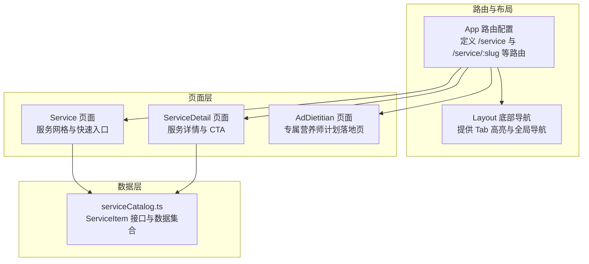
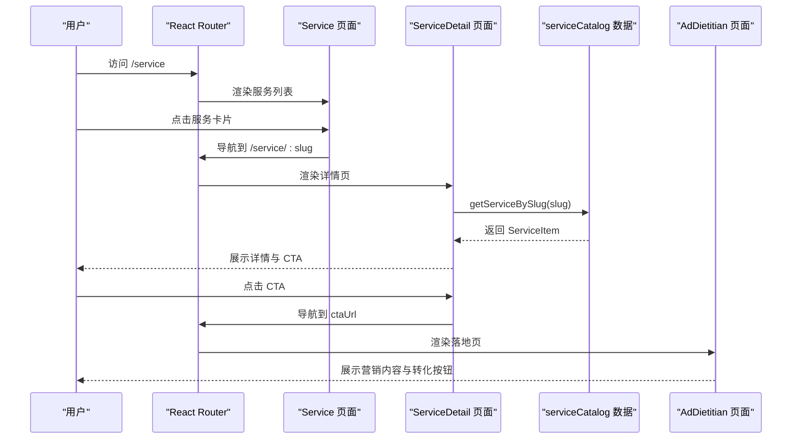
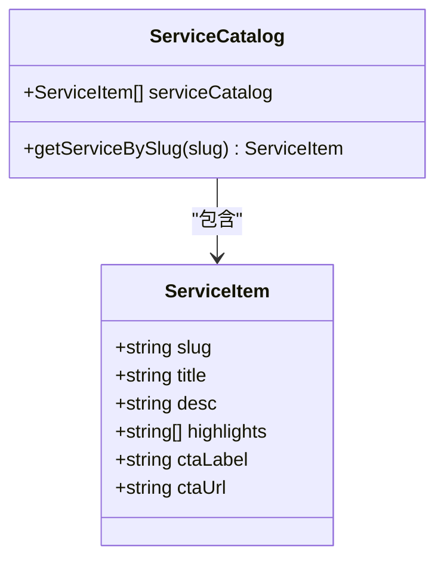
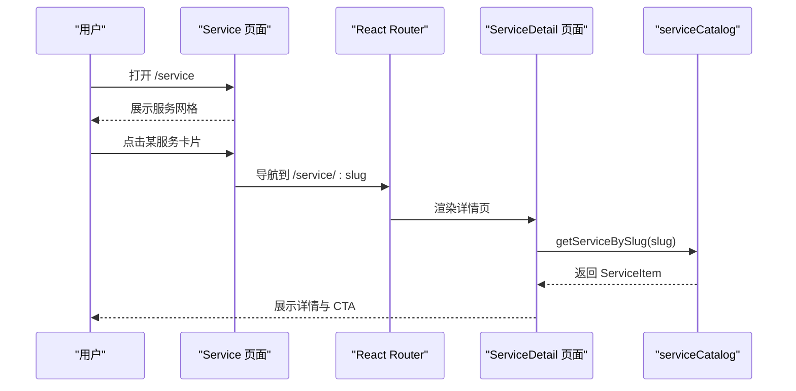
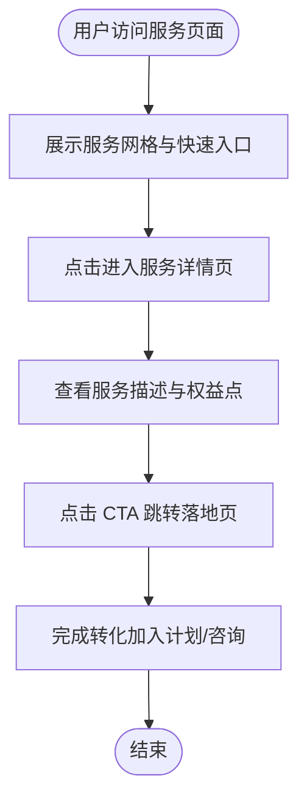
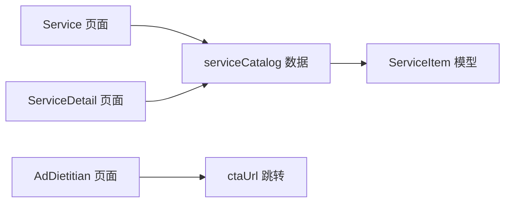

# 医疗服务数据接口

<cite>
**本文引用的文件**
- [src/data/serviceCatalog.ts](file://src/data/serviceCatalog.ts)
- [src/pages/Service.tsx](file://src/pages/Service.tsx)
- [src/pages/ServiceDetail.tsx](file://src/pages/ServiceDetail.tsx)
- [src/pages/AdDietitian.tsx](file://src/pages/AdDietitian.tsx)
- [src/App.tsx](file://src/App.tsx)
- [src/components/Layout.tsx](file://src/components/Layout.tsx)
- [docs/superpowers/specs/2026-04-15-service-manage-me-actions-design.md](file://docs/superpowers/specs/2026-04-15-service-manage-me-actions-design.md)
- [docs/superpowers/specs/2026-04-17-ad-dietitian-design.md](file://docs/superpowers/specs/2026-04-17-ad-dietitian-design.md)
- [package.json](file://package.json)
- [tsconfig.json](file://tsconfig.json)
</cite>

## 目录
1. [引言](#引言)
2. [项目结构](#项目结构)
3. [核心组件](#核心组件)
4. [架构总览](#架构总览)
5. [详细组件分析](#详细组件分析)
6. [依赖关系分析](#依赖关系分析)
7. [性能考虑](#性能考虑)
8. [故障排查指南](#故障排查指南)
9. [结论](#结论)
10. [附录](#附录)

## 引言
本文件面向医疗服务数据接口的使用者与维护者，聚焦于 ServiceItem 接口的数据结构与字段定义，系统化说明服务类型分类、服务名称与描述的格式要求、价格信息与优惠策略、服务提供者资质认证、服务地点与预约限制条件等。同时，文档化服务列表查询、服务详情获取与预约状态管理的使用方法，解释服务数据的动态定价机制、库存管理与排队系统集成思路，并提供服务页面与预约系统中的具体应用场景与最佳实践。

## 项目结构
本项目采用前端单页应用（SPA）架构，路由通过 React Router 管理，服务数据通过本地 catalog 文件提供，页面组件负责渲染与交互。ServiceItem 数据模型位于数据层，Service 页面与 ServiceDetail 页面分别承担列表与详情展示职责，AdDietitian 页面作为落地页承载营销与转化动作。

图表来源
- [src/App.tsx:25-49](file://src/App.tsx#L25-L49)
- [src/components/Layout.tsx:19-65](file://src/components/Layout.tsx#L19-L65)
- [src/data/serviceCatalog.ts:1-49](file://src/data/serviceCatalog.ts#L1-L49)
- [src/pages/Service.tsx:6-132](file://src/pages/Service.tsx#L6-L132)
- [src/pages/ServiceDetail.tsx:6-74](file://src/pages/ServiceDetail.tsx#L6-L74)
- [src/pages/AdDietitian.tsx:4-124](file://src/pages/AdDietitian.tsx#L4-L124)

章节来源
- [src/App.tsx:25-49](file://src/App.tsx#L25-L49)
- [src/components/Layout.tsx:19-65](file://src/components/Layout.tsx#L19-L65)
- [src/data/serviceCatalog.ts:1-49](file://src/data/serviceCatalog.ts#L1-L49)
- [src/pages/Service.tsx:6-132](file://src/pages/Service.tsx#L6-L132)
- [src/pages/ServiceDetail.tsx:6-74](file://src/pages/ServiceDetail.tsx#L6-L74)
- [src/pages/AdDietitian.tsx:4-124](file://src/pages/AdDietitian.tsx#L4-L124)

## 核心组件
本节聚焦 ServiceItem 接口及其在项目中的使用方式，包括字段定义、数据来源、查询方法与页面渲染。

- ServiceItem 接口字段
  - slug: 字符串，服务唯一标识，用于路由参数与数据检索
  - title: 字符串，服务名称，用于页面标题与卡片展示
  - desc: 字符串，服务描述，用于详情页正文与摘要展示
  - highlights: 字符串数组，服务亮点/权益点，用于标签化展示
  - ctaLabel: 字符串，行动号召文案，用于按钮展示
  - ctaUrl: 字符串，行动号召链接，用于跳转至落地页或外部地址

- 数据来源与查询
  - 本地数据集 serviceCatalog 提供 ServiceItem 列表
  - 通过 getServiceBySlug(slug) 方法按 slug 查询单条服务详情

- 页面使用
  - Service 页面：展示服务网格与快速入口，点击进入服务详情页
  - ServiceDetail 页面：根据路由参数 slug 渲染对应服务详情
  - AdDietitian 页面：作为统一的 CTA 落地页承载营销与转化

章节来源
- [src/data/serviceCatalog.ts:1-49](file://src/data/serviceCatalog.ts#L1-L49)
- [src/pages/Service.tsx:6-132](file://src/pages/Service.tsx#L6-L132)
- [src/pages/ServiceDetail.tsx:6-74](file://src/pages/ServiceDetail.tsx#L6-L74)
- [src/pages/AdDietitian.tsx:4-124](file://src/pages/AdDietitian.tsx#L4-L124)

## 架构总览
下图展示了从路由到数据与页面的调用链路，以及落地页的转化路径。

图表来源
- [src/App.tsx:35-36](file://src/App.tsx#L35-L36)
- [src/pages/Service.tsx:93-94](file://src/pages/Service.tsx#L93-L94)
- [src/pages/ServiceDetail.tsx:9-9](file://src/pages/ServiceDetail.tsx#L9-L9)
- [src/data/serviceCatalog.ts:45-47](file://src/data/serviceCatalog.ts#L45-L47)
- [src/pages/AdDietitian.tsx:111-119](file://src/pages/AdDietitian.tsx#L111-L119)

## 详细组件分析

### ServiceItem 接口与数据模型
ServiceItem 是服务数据的核心模型，字段定义如下：
- slug: 唯一标识，用于路由与检索
- title: 服务名称，建议简洁明确，突出核心价值
- desc: 服务描述，建议包含服务范围、适用人群与核心收益
- highlights: 权益点列表，建议使用短语化表达，便于标签化展示
- ctaLabel: 行动号召文案，建议明确下一步操作
- ctaUrl: 行动号召链接，建议指向落地页或外部地址

数据模型复杂度与性能
- 查询复杂度：按 slug 查找为 O(n)，n 为服务数量；若需高频查询，建议引入索引或缓存
- 渲染复杂度：列表与详情渲染均为 O(m)，m 为展示项数量

图表来源
- [src/data/serviceCatalog.ts:1-49](file://src/data/serviceCatalog.ts#L1-L49)

章节来源
- [src/data/serviceCatalog.ts:1-49](file://src/data/serviceCatalog.ts#L1-L49)

### 服务列表查询与详情获取
- 列表查询：Service 页面通过本地数据集渲染服务网格与快速入口，点击进入详情页
- 详情获取：ServiceDetail 页面根据路由参数 slug 调用 getServiceBySlug(slug) 获取单条服务详情

图表来源
- [src/pages/Service.tsx:93-94](file://src/pages/Service.tsx#L93-L94)
- [src/pages/ServiceDetail.tsx:9-9](file://src/pages/ServiceDetail.tsx#L9-L9)
- [src/data/serviceCatalog.ts:45-47](file://src/data/serviceCatalog.ts#L45-L47)

章节来源
- [src/pages/Service.tsx:6-132](file://src/pages/Service.tsx#L6-L132)
- [src/pages/ServiceDetail.tsx:6-74](file://src/pages/ServiceDetail.tsx#L6-L74)
- [src/data/serviceCatalog.ts:45-47](file://src/data/serviceCatalog.ts#L45-L47)

### 价格信息与优惠策略
- 当前数据模型未包含价格与优惠字段
- 建议扩展字段：原价、现价、折扣率、活动起止时间、库存状态、是否限购等
- 动态定价机制：可结合时段、用户等级、活动配置进行计算
- 优惠策略：满减、折扣、赠品、叠加券等，建议通过策略引擎或配置中心管理

[本节为概念性说明，不直接分析具体文件]

### 服务提供者资质认证、服务地点与预约限制
- 资质认证：可在 ServiceItem 中新增 providerCertifications 字段，存储认证机构与证书编号
- 服务地点：新增 serviceLocations 字段，支持多院区或多地址配置
- 预约限制：新增 reservationPolicy 字段，包含最大预约数、提前预约天数、取消政策等

[本节为概念性说明，不直接分析具体文件]

### 预约状态管理
- 当前页面未实现预约状态管理
- 建议：在 ServiceDetail 页面增加“预约”按钮，点击后跳转至预约页或弹窗，完成后返回状态更新
- 状态流转：待确认 → 已预约 → 已完成 → 已取消

[本节为概念性说明，不直接分析具体文件]

### 动态定价机制、库存管理与排队系统集成
- 动态定价：基于时段、节假日、供需情况实时计算价格
- 库存管理：按服务与时间段维护剩余名额，支持超卖策略与占座机制
- 排队系统：当库存不足时，用户进入候补队列，推送通知与优先级调整

[本节为概念性说明，不直接分析具体文件]

### 实际应用示例与场景
- 服务页面：展示服务网格与快速入口，点击进入详情页
- 详情页面：展示服务描述与权益点，提供 CTA 跳转落地页
- 落地页：AdDietitian 页面承载营销内容与转化按钮

图表来源
- [src/pages/Service.tsx:93-94](file://src/pages/Service.tsx#L93-L94)
- [src/pages/ServiceDetail.tsx:61-67](file://src/pages/ServiceDetail.tsx#L61-L67)
- [src/pages/AdDietitian.tsx:111-119](file://src/pages/AdDietitian.tsx#L111-L119)

## 依赖关系分析
- 组件耦合
  - Service 页面依赖 serviceCatalog 提供数据
  - ServiceDetail 页面依赖 serviceCatalog 的查询方法
  - AdDietitian 页面作为统一落地页，承接所有 CTA
- 外部依赖
  - React Router：路由与导航
  - Tailwind CSS：样式与主题
  - Lucide React：图标库

图表来源
- [src/pages/Service.tsx:4-4](file://src/pages/Service.tsx#L4-L4)
- [src/pages/ServiceDetail.tsx:4-4](file://src/pages/ServiceDetail.tsx#L4-L4)
- [src/data/serviceCatalog.ts:1-49](file://src/data/serviceCatalog.ts#L1-L49)
- [src/pages/AdDietitian.tsx:111-119](file://src/pages/AdDietitian.tsx#L111-L119)

章节来源
- [package.json:13-25](file://package.json#L13-L25)
- [tsconfig.json:26-31](file://tsconfig.json#L26-L31)

## 性能考虑
- 数据查询优化：对高频查询引入缓存或索引，减少 O(n) 查找成本
- 渲染优化：列表与详情组件使用 useMemo 缓存计算结果，避免重复渲染
- 路由懒加载：对大型页面组件启用懒加载，降低首屏负载
- 图标与资源：使用矢量图标与按需加载策略，减少包体积

[本节提供通用建议，不直接分析具体文件]

## 故障排查指南
- 服务不存在
  - 现象：进入详情页显示“服务不存在”
  - 处理：检查 slug 是否正确，确认 serviceCatalog 中是否存在该条目
- 路由跳转异常
  - 现象：点击卡片或 CTA 无法跳转
  - 处理：确认路由配置与 ctaUrl 正确，检查页面事件绑定
- 底部导航高亮异常
  - 现象：在子路由下 Tab 不高亮
  - 处理：参考设计文档，确保路由前缀匹配逻辑正确

章节来源
- [src/pages/ServiceDetail.tsx:33-44](file://src/pages/ServiceDetail.tsx#L33-L44)
- [src/App.tsx:35-36](file://src/App.tsx#L35-L36)
- [src/components/Layout.tsx:32-32](file://src/components/Layout.tsx#L32-L32)
- [docs/superpowers/specs/2026-04-15-service-manage-me-actions-design.md:48-52](file://docs/superpowers/specs/2026-04-15-service-manage-me-actions-design.md#L48-L52)

## 结论
本文档系统化梳理了 ServiceItem 接口的数据结构与字段定义，明确了服务列表查询、详情获取与 CTA 跳转的使用方法，并提出了价格信息、优惠策略、资质认证、服务地点与预约限制等扩展方向。结合动态定价、库存管理与排队系统集成的建议，可为后续服务化改造提供参考。当前实现以本地数据与路由跳转为主，后续可逐步接入后端接口与真实业务流程。

## 附录
- 字段验证规则与数据格式标准
  - slug：字母数字与连字符组合，长度 1-50
  - title：长度 1-100，建议包含核心关键词
  - desc：长度 1-500，建议分段落展示
  - highlights：数组长度 1-10，每项长度 1-50
  - ctaLabel：长度 1-30
  - ctaUrl：合法 URL 或内部路由路径
- 使用示例
  - 服务列表：访问 /service，查看服务网格与快速入口
  - 服务详情：访问 /service/:slug，查看描述与权益点
  - 落地页：点击 CTA 跳转至 /ad/dietitian，查看营销内容与转化按钮

[本节为概念性说明，不直接分析具体文件]