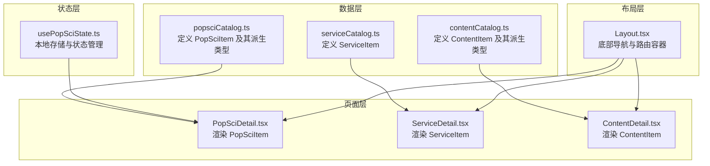
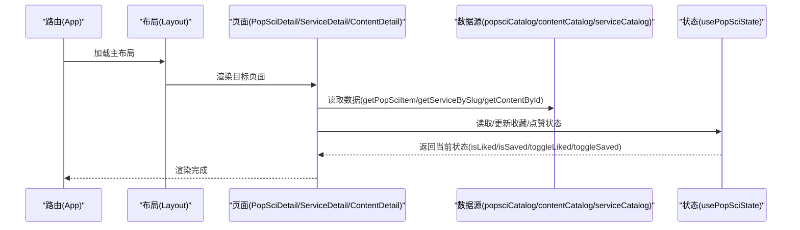
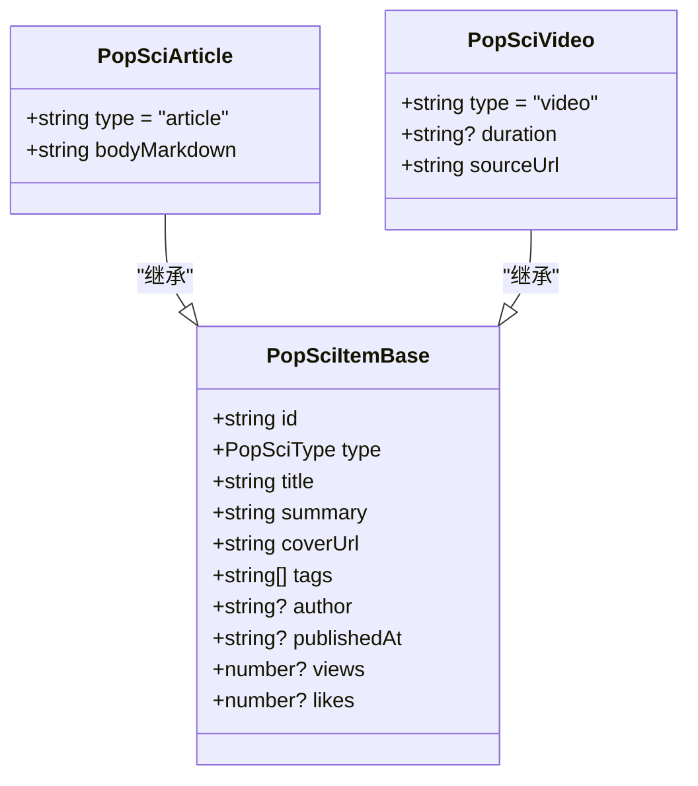
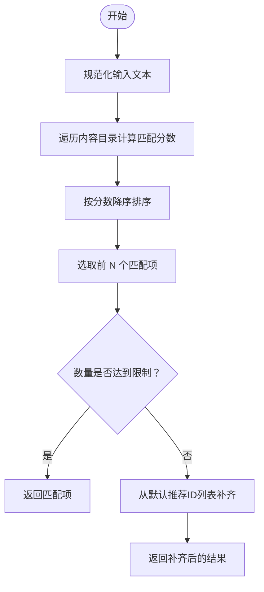
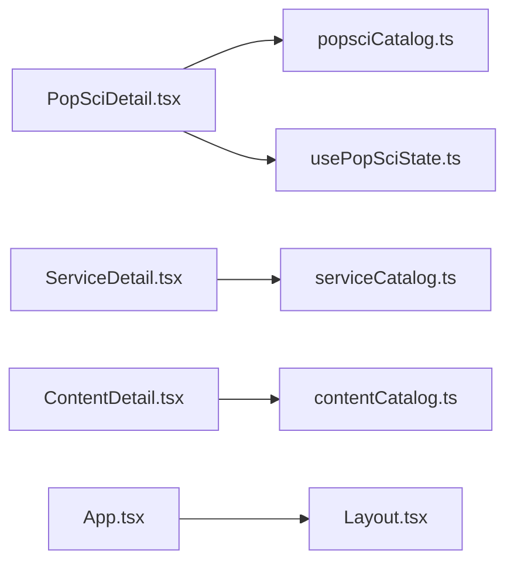

# 数据接口规范

<cite>
**本文引用的文件**
- [popsciCatalog.ts](file://src/data/popsciCatalog.ts)
- [contentCatalog.ts](file://src/data/contentCatalog.ts)
- [serviceCatalog.ts](file://src/data/serviceCatalog.ts)
- [PopSciDetail.tsx](file://src/pages/PopSciDetail.tsx)
- [ServiceDetail.tsx](file://src/pages/ServiceDetail.tsx)
- [usePopSciState.ts](file://src/hooks/usePopSciState.ts)
- [Layout.tsx](file://src/components/Layout.tsx)
- [App.tsx](file://src/App.tsx)
- [ContentDetail.tsx](file://src/pages/ContentDetail.tsx)
- [tsconfig.json](file://tsconfig.json)
</cite>

## 目录
1. [简介](#简介)
2. [项目结构](#项目结构)
3. [核心数据类型](#核心数据类型)
4. [架构总览](#架构总览)
5. [详细组件分析](#详细组件分析)
6. [依赖关系分析](#依赖关系分析)
7. [性能考量](#性能考量)
8. [故障排查指南](#故障排查指南)
9. [结论](#结论)
10. [附录](#附录)

## 简介
本文件面向前端与后端开发者，系统化梳理应用中的数据接口规范，重点覆盖以下核心数据类型：
- PopSciItem：用于“科普内容”的统一抽象，支持文章与视频两种形态
- ContentItem：用于“内容目录”的统一抽象，支持文章、视频、服务、商品四种形态
- ServiceItem：用于“服务详情”的数据模型

文档将从类型定义、字段说明、继承与联合关系、数据校验与格式要求、最佳实践、错误处理策略、版本兼容与迁移等方面进行全面说明，并提供可视化图示与实际使用示例路径，帮助开发者正确理解与使用这些接口。

## 项目结构
本项目采用按功能域划分的组织方式，数据接口主要集中在 src/data 目录下，页面组件在 src/pages 中消费这些数据模型；状态管理通过自定义 Hook 在 src/hooks 中实现；UI 布局在 src/components 中提供通用组件。

图表来源
- [popsciCatalog.ts:1-98](file://src/data/popsciCatalog.ts#L1-L98)
- [contentCatalog.ts:1-101](file://src/data/contentCatalog.ts#L1-L101)
- [serviceCatalog.ts:1-49](file://src/data/serviceCatalog.ts#L1-L49)
- [PopSciDetail.tsx:1-150](file://src/pages/PopSciDetail.tsx#L1-L150)
- [ServiceDetail.tsx:1-75](file://src/pages/ServiceDetail.tsx#L1-L75)
- [ContentDetail.tsx:1-40](file://src/pages/ContentDetail.tsx#L1-L40)
- [usePopSciState.ts:1-80](file://src/hooks/usePopSciState.ts#L1-L80)
- [Layout.tsx:1-66](file://src/components/Layout.tsx#L1-L66)

章节来源
- [App.tsx:25-51](file://src/App.tsx#L25-L51)
- [Layout.tsx:19-66](file://src/components/Layout.tsx#L19-L66)

## 核心数据类型
本节对三个核心数据类型进行逐项说明，包括字段定义、数据类型、可选/必填属性、继承与联合关系、以及在页面中的使用方式。

### PopSciItem 类型族
- 类型别名与基础接口
  - PopSciType：字面量联合类型，取值为 "article" 或 "video"
  - PopSciItemBase：所有科普内容的基础字段集合
  - PopSciArticle：扩展 PopSciItemBase，限定 type 为 "article"，新增 bodyMarkdown 字段
  - PopSciVideo：扩展 PopSciItemBase，限定 type 为 "video"，新增 duration 与 sourceUrl 字段
  - PopSciItem：联合类型 PopSciArticle | PopSciVideo，实现“鉴别联合”以区分文章与视频

- 字段定义与约束
  - id：字符串，唯一标识
  - type：字面量联合类型，用于鉴别具体形态
  - title：字符串，标题
  - summary：字符串，摘要
  - coverUrl：字符串，封面图地址
  - tags：字符串数组，标签列表
  - author：可选字符串，作者
  - publishedAt：可选字符串，发布日期
  - views：可选数值，浏览量
  - likes：可选数值，点赞数
  - bodyMarkdown：仅文章形态存在，Markdown 内容
  - duration：仅视频形态存在，时长字符串
  - sourceUrl：仅视频形态存在，视频源地址

- 继承与联合关系
  - PopSciArticle 与 PopSciVideo 均继承自 PopSciItemBase，通过 type 字段形成鉴别联合
  - 在运行时可通过 type 字段进行分支判断，从而安全访问特定字段

- 页面使用示例
  - PopSciDetail 页面通过 getPopSciItem(type, id) 获取 PopSciItem，并根据 type 渲染文章 Markdown 或跳转视频源

章节来源
- [popsciCatalog.ts:1-27](file://src/data/popsciCatalog.ts#L1-L27)
- [popsciCatalog.ts:29-98](file://src/data/popsciCatalog.ts#L29-L98)
- [PopSciDetail.tsx:15-19](file://src/pages/PopSciDetail.tsx#L15-L19)

### ContentItem 类型族
- 类型别名与基础接口
  - ContentType：字面量联合类型，取值为 "article" | "video" | "service" | "product"
  - ContentItem：内容目录的基础字段集合，type 为 ContentType，用于区分文章、视频、服务、商品
  - contentCatalog：ContentItem 数组，作为本地内容目录数据源
  - 默认推荐 ID 列表 defaultRecommendationIds：当关键词匹配不足时的兜底推荐

- 字段定义与约束
  - id：字符串，唯一标识
  - type：ContentType，内容类型
  - title：字符串，标题
  - summary：字符串，摘要
  - keywords：字符串数组，关键词列表
  - coverUrl：可选字符串，封面图地址
  - sourceUrl：可选字符串，外部来源地址

- 推荐算法
  - getRecommendations(input, limit)：基于关键词匹配度打分，优先返回匹配度高的内容；若不足 limit，则从默认推荐 ID 列表中补齐

- 页面使用示例
  - ContentDetail 页面通过 getContentById(id) 获取 ContentItem 并渲染详情

章节来源
- [contentCatalog.ts:1-11](file://src/data/contentCatalog.ts#L1-L11)
- [contentCatalog.ts:13-101](file://src/data/contentCatalog.ts#L13-L101)
- [ContentDetail.tsx:14-17](file://src/pages/ContentDetail.tsx#L14-L17)

### ServiceItem 类型
- 字段定义与约束
  - slug：字符串，服务唯一标识
  - title：字符串，标题
  - desc：字符串，描述
  - highlights：字符串数组，亮点列表
  - ctaLabel：字符串，行动号召文案
  - ctaUrl：字符串，行动号召链接

- 页面使用示例
  - ServiceDetail 页面通过 getServiceBySlug(slug) 获取 ServiceItem 并渲染详情

章节来源
- [serviceCatalog.ts:1-8](file://src/data/serviceCatalog.ts#L1-L8)
- [serviceCatalog.ts:10-49](file://src/data/serviceCatalog.ts#L10-L49)
- [ServiceDetail.tsx:6-9](file://src/pages/ServiceDetail.tsx#L6-L9)

## 架构总览
下图展示了数据模型与页面组件之间的交互关系，以及状态管理在其中的作用。

图表来源
- [App.tsx:25-51](file://src/App.tsx#L25-L51)
- [Layout.tsx:19-66](file://src/components/Layout.tsx#L19-L66)
- [PopSciDetail.tsx:15-19](file://src/pages/PopSciDetail.tsx#L15-L19)
- [ServiceDetail.tsx:6-9](file://src/pages/ServiceDetail.tsx#L6-L9)
- [ContentDetail.tsx:14-17](file://src/pages/ContentDetail.tsx#L14-L17)
- [usePopSciState.ts:30-79](file://src/hooks/usePopSciState.ts#L30-L79)
- [popsciCatalog.ts:90-98](file://src/data/popsciCatalog.ts#L90-L98)
- [serviceCatalog.ts:45-49](file://src/data/serviceCatalog.ts#L45-L49)
- [contentCatalog.ts:65-67](file://src/data/contentCatalog.ts#L65-L67)

## 详细组件分析

### PopSciItem 类型族与页面渲染
- 鉴别联合与字段分支
  - 通过 type 字段区分文章与视频，分别渲染 Markdown 内容或外部视频源链接
  - 文章形态包含 bodyMarkdown，视频形态包含 duration 与 sourceUrl
- 状态管理集成
  - 使用 usePopSciState 管理收藏与点赞状态，键值采用 `${type}:${id}` 的形式，持久化至本地存储

图表来源
- [popsciCatalog.ts:3-27](file://src/data/popsciCatalog.ts#L3-L27)

章节来源
- [PopSciDetail.tsx:105-142](file://src/pages/PopSciDetail.tsx#L105-L142)
- [usePopSciState.ts:4-28](file://src/hooks/usePopSciState.ts#L4-L28)

### ContentItem 类型族与推荐机制
- ContentItem 的多态性
  - 支持文章、视频、服务、商品四种形态，通过 type 字段进行区分
- 推荐算法
  - 基于关键词匹配度打分，不足时以默认推荐 ID 列表兜底

图表来源
- [contentCatalog.ts:69-99](file://src/data/contentCatalog.ts#L69-L99)

章节来源
- [ContentDetail.tsx:14-17](file://src/pages/ContentDetail.tsx#L14-L17)

### ServiceItem 类型与页面渲染
- ServiceItem 的字段简洁明确，适用于服务详情页的展示与引导跳转
- 页面通过 slug 定位服务项，渲染描述、亮点与行动号召按钮

章节来源
- [ServiceDetail.tsx:6-69](file://src/pages/ServiceDetail.tsx#L6-L69)
- [serviceCatalog.ts:45-49](file://src/data/serviceCatalog.ts#L45-L49)

## 依赖关系分析
- 数据模型依赖
  - PopSciDetail 依赖 popsciCatalog 的 getPopSciItem 与 PopSciItem 类型
  - ServiceDetail 依赖 serviceCatalog 的 getServiceBySlug 与 ServiceItem 类型
  - ContentDetail 依赖 contentCatalog 的 getContentById 与 ContentItem 类型
- 状态依赖
  - usePopSciState 依赖 localStorage 进行状态持久化，键值格式为 `${type}:${id}`
- 路由与布局
  - App 路由配置与 Layout 底部导航共同决定页面入口与导航行为

图表来源
- [PopSciDetail.tsx:6-19](file://src/pages/PopSciDetail.tsx#L6-L19)
- [ServiceDetail.tsx:4-9](file://src/pages/ServiceDetail.tsx#L4-L9)
- [ContentDetail.tsx:4-17](file://src/pages/ContentDetail.tsx#L4-L17)
- [usePopSciState.ts:30-79](file://src/hooks/usePopSciState.ts#L30-L79)
- [App.tsx:25-51](file://src/App.tsx#L25-L51)
- [Layout.tsx:19-66](file://src/components/Layout.tsx#L19-L66)

章节来源
- [App.tsx:25-51](file://src/App.tsx#L25-L51)
- [Layout.tsx:19-66](file://src/components/Layout.tsx#L19-L66)

## 性能考量
- 虚拟化建议
  - 当内容列表规模较大时，建议引入虚拟滚动以降低 DOM 节点数量，提升渲染性能
- 本地状态持久化
  - 使用 localStorage 存储用户偏好与状态，注意序列化/反序列化的健壮性与体积控制
- 资源加载优化
  - 图片资源建议使用合适的尺寸与格式，避免超大图片导致首屏加载缓慢

## 故障排查指南
- 类型断言与字段缺失
  - 在使用鉴别联合时，务必通过 type 字段进行分支判断后再访问特定字段，避免运行时访问不存在的属性
- 本地状态解析失败
  - 当本地存储数据损坏或格式不符时，safeParse 会返回空状态，需确保键值格式与预期一致
- 推荐算法无结果
  - 若关键词匹配度均为 0，系统会尝试从默认推荐 ID 列表补齐；请检查默认列表是否存在对应项

章节来源
- [usePopSciState.ts:13-24](file://src/hooks/usePopSciState.ts#L13-L24)
- [contentCatalog.ts:88-99](file://src/data/contentCatalog.ts#L88-L99)

## 结论
本文档系统化梳理了 PopSciItem、ContentItem、ServiceItem 三大核心数据类型及其在页面中的使用方式，明确了字段定义、可选/必填属性、鉴别联合与多态关系，并提供了推荐算法、状态管理与路由集成的参考。建议在实际开发中遵循类型安全与字段校验原则，结合本地状态持久化与性能优化策略，确保接口稳定与用户体验。

## 附录

### 字段验证与数据格式要求
- 字符串字段
  - id、title、summary、coverUrl、sourceUrl、author、publishedAt、duration、ctaLabel、ctaUrl 等均应为字符串
  - keywords、tags 为字符串数组
- 数值字段
  - views、likes 为数值类型，建议非负整数
- 时间字段
  - publishedAt 建议采用 ISO 8601 日期格式（如 YYYY-MM-DD）
- 联合类型
  - type 字段必须严格匹配对应字面量，用于鉴别联合分支

### 版本兼容与废弃字段处理
- 当前版本
  - PopSciItem 与 ContentItem 均采用鉴别联合与字面量类型，具备良好的向后兼容性
- 迁移建议
  - 新增字段时优先使用可选属性，避免破坏现有数据
  - 对于已废弃字段，保留读取逻辑但不再写入，逐步替换为新字段

### 最佳实践
- 类型安全
  - 使用鉴别联合与字面量类型，避免运行时类型错误
- 数据校验
  - 在消费数据前进行字段存在性与类型检查，必要时提供默认值
- 状态管理
  - 使用键值格式 `${type}:${id}` 统一管理多态状态，避免冲突
- 错误处理
  - 页面渲染前检查数据是否存在，提供友好的“内容不存在”提示

### 实际使用示例路径
- PopSciItem
  - 获取单条内容：[popsciCatalog.ts:getPopSciItem:90-92](file://src/data/popsciCatalog.ts#L90-L92)
  - 渲染文章详情：[PopSciDetail.tsx:PopSciDetail:15-19](file://src/pages/PopSciDetail.tsx#L15-L19)
  - 渲染视频详情：[PopSciDetail.tsx:PopSciDetail:131-142](file://src/pages/PopSciDetail.tsx#L131-L142)
- ContentItem
  - 获取单条内容：[contentCatalog.ts:getContentById:65-67](file://src/data/contentCatalog.ts#L65-L67)
  - 推荐算法：[contentCatalog.ts:getRecommendations:69-99](file://src/data/contentCatalog.ts#L69-L99)
  - 渲染详情：[ContentDetail.tsx:ContentDetail:14-17](file://src/pages/ContentDetail.tsx#L14-L17)
- ServiceItem
  - 获取单条服务：[serviceCatalog.ts:getServiceBySlug:45-47](file://src/data/serviceCatalog.ts#L45-L47)
  - 渲染详情：[ServiceDetail.tsx:ServiceDetail:6-9](file://src/pages/ServiceDetail.tsx#L6-L9)