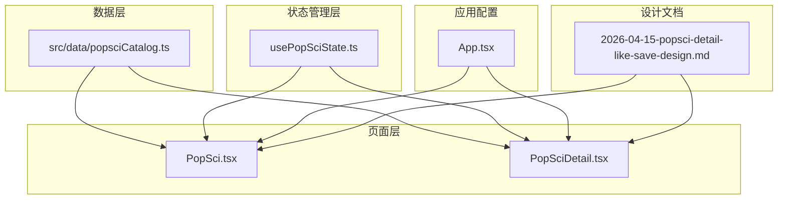
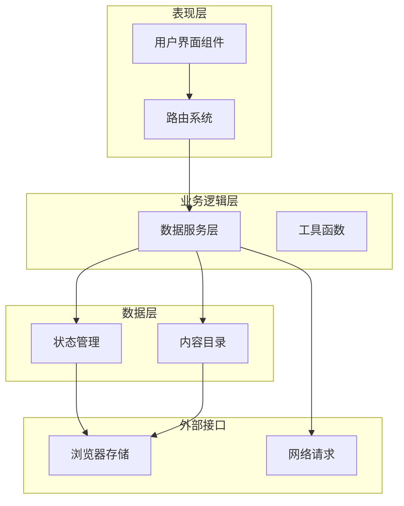
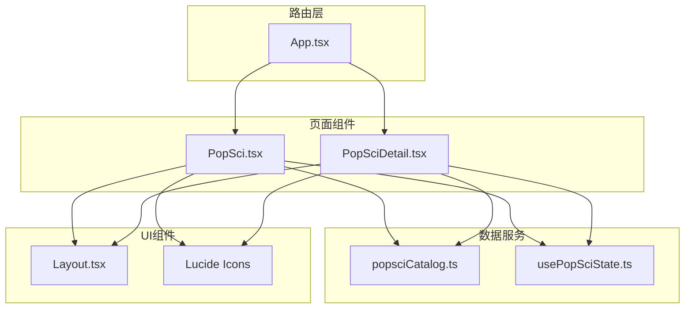
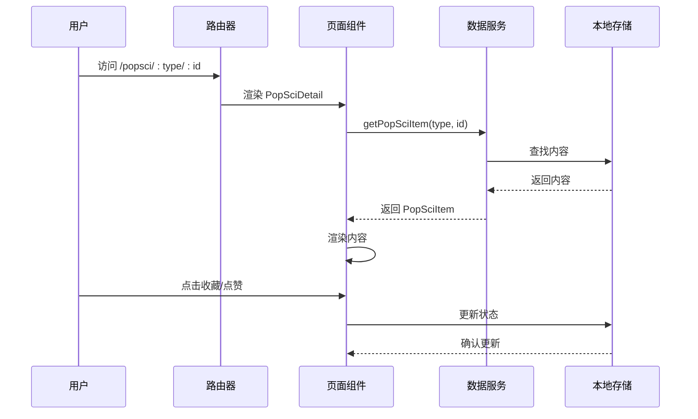

# 科普内容数据接口

<cite>
**本文档引用的文件**
- [popsciCatalog.ts](file://src/data/popsciCatalog.ts)
- [PopSci.tsx](file://src/pages/PopSci.tsx)
- [PopSciDetail.tsx](file://src/pages/PopSciDetail.tsx)
- [usePopSciState.ts](file://src/hooks/usePopSciState.ts)
- [App.tsx](file://src/App.tsx)
- [2026-04-15-popsci-detail-like-save-design.md](file://docs/2026-04-15-popsci-detail-like-save-design.md)
</cite>

## 目录
1. [简介](#简介)
2. [项目结构](#项目结构)
3. [核心组件](#核心组件)
4. [架构概览](#架构概览)
5. [详细组件分析](#详细组件分析)
6. [依赖关系分析](#依赖关系分析)
7. [性能考虑](#性能考虑)
8. [故障排除指南](#故障排除指南)
9. [结论](#结论)
10. [附录](#附录)

## 简介

本文档详细记录了科普内容数据接口的设计规范，重点涵盖了以下核心数据类型：

- PopSciItemBase：所有科普内容的基础接口
- PopSciArticle：文章类型的特有字段
- PopSciVideo：视频类型的特有字段
- PopSciItem：联合类型，统一处理文章和视频两种内容类型

同时文档还详细说明了PopSciType枚举类型、字段验证规则、数据格式要求、辅助函数的使用方法和最佳实践，以及接口的版本兼容性和扩展策略。

## 项目结构

该项目采用模块化的前端架构，主要涉及以下关键目录和文件：



**图表来源**
- [popsciCatalog.ts:1-98](file://src/data/popsciCatalog.ts#L1-L98)
- [PopSci.tsx:1-270](file://src/pages/PopSci.tsx#L1-L270)
- [PopSciDetail.tsx:1-150](file://src/pages/PopSciDetail.tsx#L1-L150)
- [usePopSciState.ts:1-80](file://src/hooks/usePopSciState.ts#L1-L80)
- [App.tsx:1-52](file://src/App.tsx#L1-L52)

**章节来源**
- [popsciCatalog.ts:1-98](file://src/data/popsciCatalog.ts#L1-L98)
- [PopSci.tsx:1-270](file://src/pages/PopSci.tsx#L1-L270)
- [PopSciDetail.tsx:1-150](file://src/pages/PopSciDetail.tsx#L1-L150)
- [usePopSciState.ts:1-80](file://src/hooks/usePopSciState.ts#L1-L80)
- [App.tsx:1-52](file://src/App.tsx#L1-L52)

## 核心组件

### PopSciType 枚举类型

PopSciType 是一个字符串字面量联合类型，定义了两种内容类型：

```typescript
export type PopSciType = "article" | "video";
```

这个类型确保了类型安全，防止传入无效的内容类型值。

**章节来源**
- [popsciCatalog.ts:1](file://src/data/popsciCatalog.ts#L1-L1)

### PopSciItemBase 基础接口

PopSciItemBase 定义了所有科普内容共有的基础字段：

| 字段名 | 类型 | 必填 | 描述 | 示例 |
|--------|------|------|------|------|
| id | string | 是 | 内容唯一标识符 | "a-htn-winter-meds" |
| type | PopSciType | 是 | 内容类型 | "article" 或 "video" |
| title | string | 是 | 标题 | "高血压患者入冬后如何调整用药？" |
| summary | string | 是 | 摘要/简介 | "气温下降会让血压更"敏感"" |
| coverUrl | string | 是 | 封面图片URL | https://example.com/image.jpg |
| tags | string[] | 是 | 标签数组 | ["高血压", "冬季", "用药"] |
| author | string | 否 | 作者信息 | "心内科医生" |
| publishedAt | string | 否 | 发布日期 | "2026-04-01" |
| views | number | 否 | 浏览量 | 12000 |
| likes | number | 否 | 点赞数 | 342 |

**章节来源**
- [popsciCatalog.ts:3-14](file://src/data/popsciCatalog.ts#L3-L14)

### PopSciArticle 文章特有字段

PopSciArticle 继承自 PopSciItemBase，并添加了文章特有的字段：

| 字段名 | 类型 | 必填 | 描述 | 示例 |
|--------|------|------|------|------|
| type | "article" | 是 | 固定为 "article" | "article" |
| bodyMarkdown | string | 是 | Markdown格式的文章正文 | "# 冬季血压波动..." |

**章节来源**
- [popsciCatalog.ts:16-19](file://src/data/popsciCatalog.ts#L16-L19)

### PopSciVideo 视频特有字段

PopSciVideo 继承自 PopSciItemBase，并添加了视频特有的字段：

| 字段名 | 类型 | 必填 | 描述 | 示例 |
|--------|------|------|------|------|
| type | "video" | 是 | 固定为 "video" | "video" |
| duration | string | 否 | 视频时长 | "03:15" |
| sourceUrl | string | 是 | 视频源地址 | "https://demo.hzmwmt.com/" |

**章节来源**
- [popsciCatalog.ts:21-25](file://src/data/popsciCatalog.ts#L21-L25)

### PopSciItem 联合类型

PopSciItem 是文章和视频两种类型的联合类型，允许统一处理不同内容类型：

```typescript
export type PopSciItem = PopSciArticle | PopSciVideo;
```

这种设计提供了类型安全的多态性，使得开发者可以在编译时捕获类型错误。

**章节来源**
- [popsciCatalog.ts:27](file://src/data/popsciCatalog.ts#L27-L27)

## 架构概览

系统采用分层架构设计，各层职责清晰分离：



**图表来源**
- [PopSci.tsx:1-270](file://src/pages/PopSci.tsx#L1-L270)
- [PopSciDetail.tsx:1-150](file://src/pages/PopSciDetail.tsx#L1-L150)
- [usePopSciState.ts:1-80](file://src/hooks/usePopSciState.ts#L1-L80)
- [popsciCatalog.ts:1-98](file://src/data/popsciCatalog.ts#L1-L98)

## 详细组件分析

### 数据模型类图

```mermaid
classDiagram
class PopSciType {
<<enumeration>>
"article"
"video"
}
class PopSciItemBase {
+string id
+PopSciType type
+string title
+string summary
+string coverUrl
+string[] tags
+string author?
+string publishedAt?
+number views?
+number likes?
}
class PopSciArticle {
+string type = "article"
+string bodyMarkdown
}
class PopSciVideo {
+string type = "video"
+string duration?
+string sourceUrl
}
class PopSciItem {
<<union type>>
}
PopSciArticle --|> PopSciItemBase : 继承
PopSciVideo --|> PopSciItemBase : 继承
PopSciItem --|> PopSciArticle : 联合类型
PopSciItem --|> PopSciVideo : 联合类型
```

**图表来源**
- [popsciCatalog.ts:1-27](file://src/data/popsciCatalog.ts#L1-L27)

### PopSciItemBase 字段验证规则

PopSciItemBase 的字段验证遵循以下规则：

1. **必需字段验证**
   - 所有必填字段必须存在且非空
   - 字符串字段应进行长度验证
   - 数字字段应进行范围验证

2. **类型验证**
   - id 和 title 必须为字符串
   - type 必须匹配 PopSciType 枚举值
   - views 和 likes 必须为非负整数

3. **格式验证**
   - coverUrl 和 sourceUrl 必须为有效的URL格式
   - publishedAt 必须为有效的日期格式
   - tags 必须为非空字符串数组

**章节来源**
- [popsciCatalog.ts:3-14](file://src/data/popsciCatalog.ts#L3-L14)

### 辅助函数使用方法

#### getPopSciItem 函数

getPopSciItem 函数用于根据类型和ID获取特定的科普内容项：

```typescript
export function getPopSciItem(type: PopSciType, id: string): PopSciItem | undefined {
  return popsciCatalog.find((item) => item.type === type && item.id === id);
}
```

**使用示例路径**：
- [PopSciDetail.tsx:19](file://src/pages/PopSciDetail.tsx#L19-L19)

**最佳实践**：
- 始终检查返回值是否为 undefined
- 在路由参数变化时重新调用函数
- 使用 useMemo 优化性能

#### listPopSci 函数

listPopSci 函数用于获取指定类型的所有科普内容：

```typescript
export function listPopSci(type: PopSciType): PopSciItem[] {
  return popsciCatalog.filter((item) => item.type === type);
}
```

**使用示例路径**：
- [PopSci.tsx:32](file://src/pages/PopSci.tsx#L32-L32)

**最佳实践**：
- 结合 useMemo 进行缓存
- 在类型变化时重新过滤数据
- 考虑实现分页加载

**章节来源**
- [popsciCatalog.ts:90-96](file://src/data/popsciCatalog.ts#L90-L96)
- [PopSci.tsx:31-36](file://src/pages/PopSci.tsx#L31-L36)
- [PopSciDetail.tsx:19](file://src/pages/PopSciDetail.tsx#L19-L19)

### 类型守卫机制

系统实现了多种类型守卫机制来确保类型安全：

#### 字面量类型守卫

```typescript
// 在 PopSciDetail.tsx 中使用
if (item.type === "article") {
  // TypeScript 知道 item 是 PopSciArticle 类型
  renderArticleContent(item);
} else {
  // TypeScript 知道 item 是 PopSciVideo 类型
  renderVideoContent(item);
}
```

#### 属性存在性守卫

```typescript
// 在 PopSciDetail.tsx 中使用
if ("duration" in item && item.duration) {
  // 只有视频类型才会有 duration 字段
  showDurationBadge(item.duration);
}
```

#### 联合类型处理

```typescript
// 在 PopSci.tsx 中使用
const goDetail = (item: PopSciItem) => {
  navigate(`/popsci/${item.type}/${item.id}`);
};
```

**章节来源**
- [PopSciDetail.tsx:92-103](file://src/pages/PopSciDetail.tsx#L92-L103)
- [PopSci.tsx:34-36](file://src/pages/PopSci.tsx#L34-L36)

### 数据格式要求

#### 文章内容格式

文章内容使用 Markdown 格式存储，支持基本的 Markdown 语法：

- 标题：使用 `#` 到 `######` 表示
- 列表：支持有序和无序列表
- 强调：使用 `**` 包围粗体文本
- 引用：使用 `>` 表示引用块

#### 视频内容格式

视频内容包含以下必要字段：
- duration：格式为 "MM:SS"
- sourceUrl：有效的外部链接

**章节来源**
- [popsciCatalog.ts:42-43](file://src/data/popsciCatalog.ts#L42-L43)
- [popsciCatalog.ts:69](file://src/data/popsciCatalog.ts#L69-L69)

## 依赖关系分析

### 组件依赖图



**图表来源**
- [App.tsx:19-51](file://src/App.tsx#L19-L51)
- [PopSci.tsx:1-270](file://src/pages/PopSci.tsx#L1-L270)
- [PopSciDetail.tsx:1-150](file://src/pages/PopSciDetail.tsx#L1-L150)
- [popsciCatalog.ts:1-98](file://src/data/popsciCatalog.ts#L1-L98)
- [usePopSciState.ts:1-80](file://src/hooks/usePopSciState.ts#L1-L80)

### 数据流分析



**图表来源**
- [App.tsx:31-32](file://src/App.tsx#L31-L32)
- [PopSciDetail.tsx:19](file://src/pages/PopSciDetail.tsx#L19-L19)
- [usePopSciState.ts:30-78](file://src/hooks/usePopSciState.ts#L30-L78)

**章节来源**
- [App.tsx:29-47](file://src/App.tsx#L29-L47)
- [PopSciDetail.tsx:15-22](file://src/pages/PopSciDetail.tsx#L15-L22)
- [usePopSciState.ts:30-78](file://src/hooks/usePopSciState.ts#L30-L78)

## 性能考虑

### 数据缓存策略

1. **内存缓存**
   - 使用 useMemo 缓存过滤后的数据
   - 避免重复渲染相同内容

2. **本地存储优化**
   - 使用 localStorage 存储用户偏好
   - 实现增量更新避免全量重载

3. **懒加载机制**
   - 图片资源使用懒加载
   - 非关键资源延迟加载

### 渲染优化

1. **虚拟滚动**
   - 对于大量内容使用虚拟滚动
   - 减少DOM节点数量

2. **组件拆分**
   - 将大组件拆分为小组件
   - 使用 React.memo 优化重渲染

3. **事件处理优化**
   - 使用 useCallback 缓存回调函数
   - 避免不必要的事件绑定

## 故障排除指南

### 常见问题及解决方案

#### 内容为空或未找到

**问题描述**：访问详情页时显示内容不存在

**可能原因**：
- ID 参数不正确
- 数据源中不存在该内容
- 类型参数与实际内容不符

**解决方案**：
- 检查路由参数是否正确传递
- 验证 getPopSciItem 返回值
- 添加错误边界处理

#### 状态不同步

**问题描述**：收藏/点赞状态在刷新后丢失

**可能原因**：
- localStorage 读写失败
- 状态更新逻辑错误
- 组件卸载导致状态丢失

**解决方案**：
- 检查 localStorage 权限
- 验证状态更新函数
- 使用 useEffect 确保状态持久化

#### 性能问题

**问题描述**：页面渲染缓慢或卡顿

**可能原因**：
- 数据量过大
- 渲染逻辑复杂
- 事件处理频繁触发

**解决方案**：
- 实现数据分页
- 优化渲染算法
- 使用防抖和节流

**章节来源**
- [PopSciDetail.tsx:77-86](file://src/pages/PopSciDetail.tsx#L77-L86)
- [usePopSciState.ts:13-24](file://src/hooks/usePopSciState.ts#L13-L24)

## 结论

本项目的科普内容数据接口设计体现了现代前端开发的最佳实践：

1. **类型安全**：通过 TypeScript 的联合类型和字面量类型确保编译时类型检查
2. **扩展性**：清晰的继承关系便于未来添加新的内容类型
3. **性能优化**：合理的缓存策略和渲染优化
4. **用户体验**：完整的收藏/点赞状态管理和本地持久化

该接口设计为未来的功能扩展奠定了良好的基础，包括但不限于：
- 新的内容类型支持
- 更丰富的元数据字段
- 服务端数据同步
- 高级搜索和过滤功能

## 附录

### 版本兼容性

当前版本为 v1.0，遵循以下兼容性原则：
- 向后兼容：新增字段不影响现有客户端
- 版本控制：通过文件名和版本号区分不同版本
- 迁移策略：提供向后兼容的数据转换函数

### 字段扩展策略

新增字段时应遵循以下步骤：
1. 在基础接口中添加可选字段
2. 更新类型守卫逻辑
3. 提供默认值处理
4. 更新相关组件渲染逻辑

### 数据转换方法

系统提供了以下数据转换方法：

#### 类型转换

```typescript
// 将联合类型转换为具体类型
const article = item as PopSciArticle;
const video = item as PopSciVideo;
```

#### 数据验证

```typescript
// 基础字段验证
function validatePopSciItem(item: any): item is PopSciItem {
  return typeof item.id === 'string' &&
         typeof item.title === 'string' &&
         typeof item.coverUrl === 'string' &&
         Array.isArray(item.tags);
}
```

**章节来源**
- [popsciCatalog.ts:27](file://src/data/popsciCatalog.ts#L27-L27)
- [PopSciDetail.tsx:92-103](file://src/pages/PopSciDetail.tsx#L92-L103)