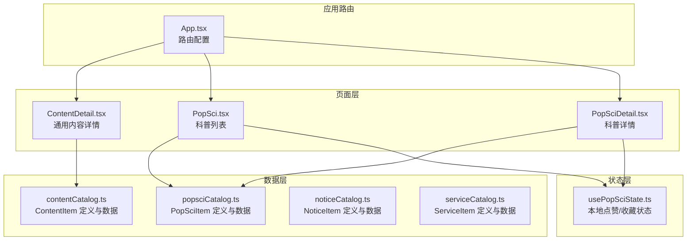
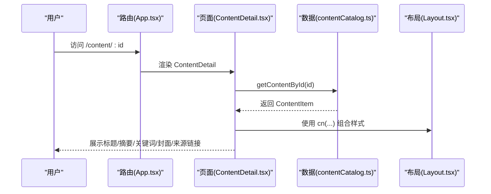
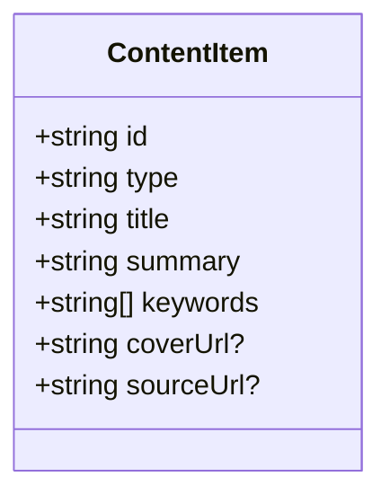
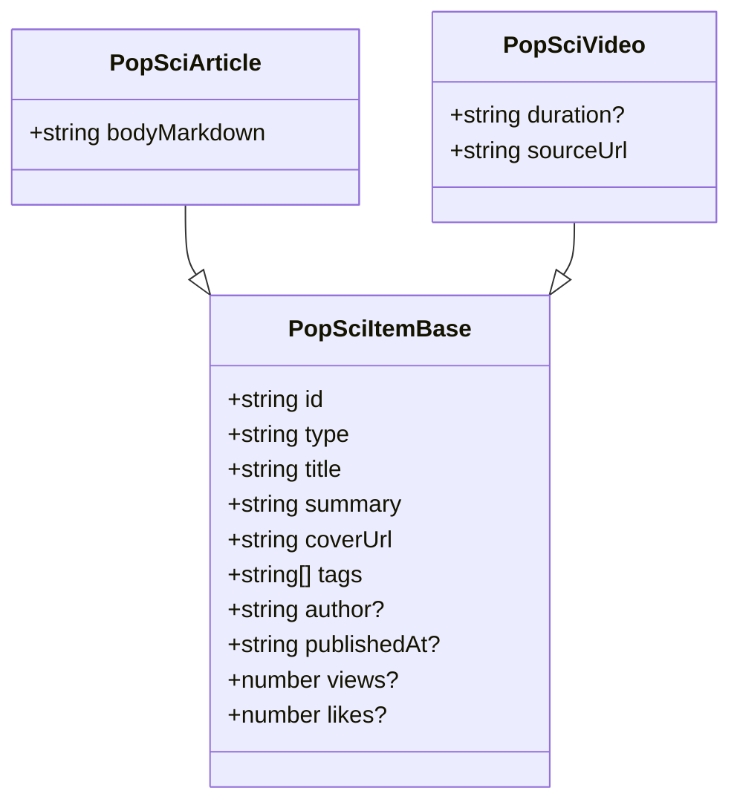
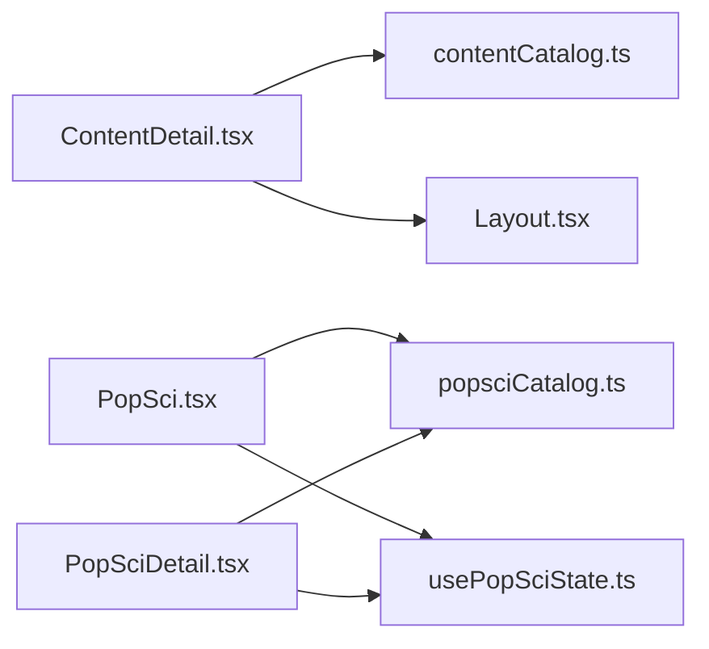

# 通用内容数据接口

<cite>
**本文引用的文件**
- [contentCatalog.ts](file://src/data/contentCatalog.ts)
- [ContentDetail.tsx](file://src/pages/ContentDetail.tsx)
- [Layout.tsx](file://src/components/Layout.tsx)
- [popsciCatalog.ts](file://src/data/popsciCatalog.ts)
- [PopSci.tsx](file://src/pages/PopSci.tsx)
- [PopSciDetail.tsx](file://src/pages/PopSciDetail.tsx)
- [usePopSciState.ts](file://src/hooks/usePopSciState.ts)
- [serviceCatalog.ts](file://src/data/serviceCatalog.ts)
- [noticeCatalog.ts](file://src/data/noticeCatalog.ts)
- [App.tsx](file://src/App.tsx)
- [package.json](file://package.json)
</cite>

## 目录
1. [简介](#简介)
2. [项目结构](#项目结构)
3. [核心组件](#核心组件)
4. [架构总览](#架构总览)
5. [详细组件分析](#详细组件分析)
6. [依赖分析](#依赖分析)
7. [性能考虑](#性能考虑)
8. [故障排查指南](#故障排查指南)
9. [结论](#结论)
10. [附录](#附录)

## 简介
本文件面向通用内容数据接口，聚焦 ContentItem 接口的数据结构与字段定义，系统化说明内容类型分类、标题与摘要格式、封面图片 URL 规范、标签系统、发布状态与浏览量统计、点赞数管理、作者信息字段，并提供内容列表查询、详情获取与搜索的使用方法。同时文档化缓存策略、性能优化建议与数据一致性保障，辅以实际数据示例与页面应用场景。

## 项目结构
本项目采用前端单页应用结构，内容数据主要由数据模块提供，页面组件负责渲染与交互。与通用内容接口直接相关的核心文件包括：
- 数据层：内容目录与类型定义
- 页面层：内容详情页与科普内容列表/详情页
- 状态层：本地点赞/收藏状态管理
- 应用路由：页面与接口路径映射

**图表来源**
- [App.tsx:19-51](file://src/App.tsx#L19-L51)
- [contentCatalog.ts:1-101](file://src/data/contentCatalog.ts#L1-L101)
- [popsciCatalog.ts:1-98](file://src/data/popsciCatalog.ts#L1-L98)
- [noticeCatalog.ts:1-59](file://src/data/noticeCatalog.ts#L1-L59)
- [serviceCatalog.ts:1-49](file://src/data/serviceCatalog.ts#L1-L49)
- [ContentDetail.tsx:14-134](file://src/pages/ContentDetail.tsx#L14-L134)
- [PopSci.tsx:26-270](file://src/pages/PopSci.tsx#L26-L270)
- [PopSciDetail.tsx:15-150](file://src/pages/PopSciDetail.tsx#L15-L150)
- [usePopSciState.ts:30-80](file://src/hooks/usePopSciState.ts#L30-L80)

**章节来源**
- [App.tsx:19-51](file://src/App.tsx#L19-L51)
- [contentCatalog.ts:1-101](file://src/data/contentCatalog.ts#L1-L101)
- [popsciCatalog.ts:1-98](file://src/data/popsciCatalog.ts#L1-L98)
- [noticeCatalog.ts:1-59](file://src/data/noticeCatalog.ts#L1-L59)
- [serviceCatalog.ts:1-49](file://src/data/serviceCatalog.ts#L1-L49)
- [ContentDetail.tsx:14-134](file://src/pages/ContentDetail.tsx#L14-L134)
- [PopSci.tsx:26-270](file://src/pages/PopSci.tsx#L26-L270)
- [PopSciDetail.tsx:15-150](file://src/pages/PopSciDetail.tsx#L15-L150)
- [usePopSciState.ts:30-80](file://src/hooks/usePopSciState.ts#L30-L80)

## 核心组件
本节聚焦通用内容数据接口的定义与实现要点，涵盖 ContentItem 的字段、类型与使用方式。

- 内容类型枚举
  - 支持类型："article"（文章）、"video"（视频）、"service"（服务）、"product"（商品）
  - 类型定义参考：[contentCatalog.ts:1](file://src/data/contentCatalog.ts#L1)

- ContentItem 字段定义
  - id：字符串，唯一标识
  - type：ContentType，内容类型
  - title：字符串，标题
  - summary：字符串，摘要
  - keywords：字符串数组，关键词标签
  - coverUrl：可选字符串，封面图片 URL
  - sourceUrl：可选字符串，原文链接
  - 字段定义参考：[contentCatalog.ts:3-11](file://src/data/contentCatalog.ts#L3-L11)

- 默认推荐内容 ID 列表
  - defaultRecommendationIds：用于兜底推荐
  - 参考：[contentCatalog.ts:58-63](file://src/data/contentCatalog.ts#L58-L63)

- 内容检索与推荐
  - getContentById：按 id 获取内容
  - getRecommendations：基于关键词匹配的推荐算法
  - 参考：[contentCatalog.ts:65-101](file://src/data/contentCatalog.ts#L65-L101)

- 页面集成
  - ContentDetail 页面通过路由参数加载 ContentItem 并渲染
  - 参考：[ContentDetail.tsx:14-134](file://src/pages/ContentDetail.tsx#L14-L134)

**章节来源**
- [contentCatalog.ts:1-11](file://src/data/contentCatalog.ts#L1-L11)
- [contentCatalog.ts:58-63](file://src/data/contentCatalog.ts#L58-L63)
- [contentCatalog.ts:65-101](file://src/data/contentCatalog.ts#L65-L101)
- [ContentDetail.tsx:14-134](file://src/pages/ContentDetail.tsx#L14-L134)

## 架构总览
通用内容接口与页面/状态层的交互关系如下：

**图表来源**
- [App.tsx:45](file://src/App.tsx#L45)
- [ContentDetail.tsx:14-134](file://src/pages/ContentDetail.tsx#L14-L134)
- [contentCatalog.ts:65-67](file://src/data/contentCatalog.ts#L65-L67)
- [Layout.tsx:6-8](file://src/components/Layout.tsx#L6-L8)

## 详细组件分析

### ContentItem 接口与字段规范
- 字段说明
  - id：内容唯一标识，用于详情页路由与推荐兜底
  - type：内容类型，决定页面渲染与行为
  - title：标题，建议简洁明确，便于列表与搜索识别
  - summary：摘要，应概括核心要点，长度适中
  - keywords：关键词数组，用于推荐与搜索匹配
  - coverUrl：封面图 URL，建议使用 HTTPS，尺寸与比例统一
  - sourceUrl：原文链接，若存在则在详情页提供跳转入口

- 字段验证与格式建议
  - id：非空字符串，全局唯一
  - type：枚举值之一
  - title/summary：UTF-8 编码，避免冗余换行
  - keywords：建议每个关键词长度合理，总数控制在 8 以内
  - coverUrl/sourceUrl：合法 URL，HTTPS 优先

- 示例数据
  - 文章示例：见 [contentCatalog.ts:13-56](file://src/data/contentCatalog.ts#L13-L56)
  - 视频示例：见 [contentCatalog.ts:21-41](file://src/data/contentCatalog.ts#L21-L41)

**章节来源**
- [contentCatalog.ts:3-11](file://src/data/contentCatalog.ts#L3-L11)
- [contentCatalog.ts:13-56](file://src/data/contentCatalog.ts#L13-L56)
- [contentCatalog.ts:21-41](file://src/data/contentCatalog.ts#L21-L41)

### 内容类型分类与页面映射
- 类型分类
  - article：文章
  - video：视频
  - service：服务
  - product：商品

- 页面映射
  - 通用内容详情：/content/:id → ContentDetail
  - 科普内容详情：/popsci/:type/:id → PopSciDetail
  - 科普列表：/ → PopSci

- 路由定义参考：[App.tsx:28-47](file://src/App.tsx#L28-L47)

**章节来源**
- [App.tsx:28-47](file://src/App.tsx#L28-L47)

### 标签系统与推荐机制
- 标签系统
  - ContentItem 使用 keywords 数组作为标签
  - PopSciItem 使用 tags 数组作为标签
  - PopSci 列表页展示标签并支持收藏/点赞

- 推荐机制
  - getRecommendations：基于关键词匹配打分，取前 N 条；不足时用默认推荐兜底
  - 参考：[contentCatalog.ts:69-99](file://src/data/contentCatalog.ts#L69-L99)

- 点赞/收藏状态
  - usePopSciState：本地持久化存储 liked/saved，键格式为 "type:id"
  - 参考：[usePopSciState.ts:30-80](file://src/hooks/usePopSciState.ts#L30-L80)

**章节来源**
- [contentCatalog.ts:69-99](file://src/data/contentCatalog.ts#L69-L99)
- [usePopSciState.ts:30-80](file://src/hooks/usePopSciState.ts#L30-L80)

### 发布状态、浏览量与点赞数管理
- 发布状态
  - ContentItem 不包含发布状态字段；如需发布/下线控制，可在业务侧扩展
  - PopSciItem 包含 publishedAt（日期字符串），可用于排序与筛选

- 浏览量统计
  - ContentItem 不包含 views 字段
  - PopSciItem 包含 views（数字），用于展示与排序
  - 参考：[popsciCatalog.ts:12-13](file://src/data/popsciCatalog.ts#L12-L13)

- 点赞数管理
  - ContentItem 不包含 likes 字段
  - PopSciItem 包含 likes（数字），页面根据本地状态动态计算显示值
  - 参考：[popsciCatalog.ts:12-13](file://src/data/popsciCatalog.ts#L12-L13)，[PopSci.tsx:83-84](file://src/pages/PopSci.tsx#L83-L84)

**章节来源**
- [popsciCatalog.ts:12-13](file://src/data/popsciCatalog.ts#L12-L13)
- [PopSci.tsx:83-84](file://src/pages/PopSci.tsx#L83-L84)

### 作者信息字段
- ContentItem 不包含作者字段
- PopSciItem 包含 author（可选字符串），用于详情页展示
- 参考：[popsciCatalog.ts:10](file://src/data/popsciCatalog.ts#L10)

**章节来源**
- [popsciCatalog.ts:10](file://src/data/popsciCatalog.ts#L10)

### 内容列表查询、详情获取与搜索
- 列表查询
  - 通用内容：通过 getContentById 获取单条内容
  - 科普内容：通过 listPopSci 过滤指定类型
  - 参考：[contentCatalog.ts:65-67](file://src/data/contentCatalog.ts#L65-L67)，[popsciCatalog.ts:94-96](file://src/data/popsciCatalog.ts#L94-L96)

- 详情获取
  - 通用内容：/content/:id → ContentDetail
  - 科普内容：/popsci/:type/:id → PopSciDetail
  - 参考：[App.tsx:45](file://src/App.tsx#L45)，[App.tsx:31-32](file://src/App.tsx#L31-L32)

- 搜索与推荐
  - 基于关键词匹配的推荐：getRecommendations
  - 参考：[contentCatalog.ts:69-99](file://src/data/contentCatalog.ts#L69-L99)

**章节来源**
- [contentCatalog.ts:65-67](file://src/data/contentCatalog.ts#L65-L67)
- [contentCatalog.ts:69-99](file://src/data/contentCatalog.ts#L69-L99)
- [popsciCatalog.ts:94-96](file://src/data/popsciCatalog.ts#L94-L96)
- [App.tsx:31-32](file://src/App.tsx#L31-L32)
- [App.tsx:45](file://src/App.tsx#L45)

### 数据模型与页面应用
- ContentItem 模型

**图表来源**
- [contentCatalog.ts:3-11](file://src/data/contentCatalog.ts#L3-L11)

- PopSciItem 模型

**图表来源**
- [popsciCatalog.ts:3-27](file://src/data/popsciCatalog.ts#L3-L27)

- 页面应用
  - ContentDetail：渲染 ContentItem 的标题、摘要、关键词、封面与来源链接
  - PopSci：展示 PopSciItem 的封面、标签、摘要、浏览量与点赞数
  - PopSciDetail：渲染 PopSciItem 的正文（文章）或外部播放链接（视频）
  - 参考：[ContentDetail.tsx:14-134](file://src/pages/ContentDetail.tsx#L14-L134)，[PopSci.tsx:26-270](file://src/pages/PopSci.tsx#L26-L270)，[PopSciDetail.tsx:15-150](file://src/pages/PopSciDetail.tsx#L15-L150)

**章节来源**
- [ContentDetail.tsx:14-134](file://src/pages/ContentDetail.tsx#L14-L134)
- [PopSci.tsx:26-270](file://src/pages/PopSci.tsx#L26-L270)
- [PopSciDetail.tsx:15-150](file://src/pages/PopSciDetail.tsx#L15-L150)

## 依赖分析
- 组件耦合
  - ContentDetail 依赖 contentCatalog 的 getContentById
  - PopSci/PopSciDetail 依赖 popsciCatalog 的 listPopSci/getPopSciItem
  - PopSci/PopSciDetail 依赖 usePopSciState 管理本地点赞/收藏状态

- 外部依赖
  - react-router-dom：路由与导航
  - lucide-react：图标
  - react-markdown/remark-gfm：文章 Markdown 渲染
  - framer-motion：动画
  - clsx/tailwind-merge：样式工具
  - 参考：[package.json:13-26](file://package.json#L13-L26)

**图表来源**
- [ContentDetail.tsx:4](file://src/pages/ContentDetail.tsx#L4)
- [popsciCatalog.ts:6-7](file://src/data/popsciCatalog.ts#L6-L7)
- [PopSci.tsx:6-7](file://src/pages/PopSci.tsx#L6-L7)
- [PopSciDetail.tsx:6-8](file://src/pages/PopSciDetail.tsx#L6-L8)
- [usePopSciState.ts:30-80](file://src/hooks/usePopSciState.ts#L30-L80)
- [Layout.tsx:6-8](file://src/components/Layout.tsx#L6-L8)

**章节来源**
- [package.json:13-26](file://package.json#L13-L26)

## 性能考虑
- 列表渲染优化
  - 使用 useMemo 缓存列表计算，减少重复渲染
  - PopSci 列表中对点赞/收藏状态进行本地计算，避免频繁网络请求
  - 参考：[PopSci.tsx:32](file://src/pages/PopSci.tsx#L32)，[PopSci.tsx:81-84](file://src/pages/PopSci.tsx#L81-L84)

- 图片加载优化
  - 使用合适的封面图尺寸与比例，避免超大图片导致首屏卡顿
  - PopSci 列表中对封面图进行裁剪与缩放，提升滚动性能
  - 参考：[PopSci.tsx:143](file://src/pages/PopSci.tsx#L143)，[PopSciDetail.tsx:91](file://src/pages/PopSciDetail.tsx#L91)

- 本地状态持久化
  - usePopSciState 使用 localStorage 存储点赞/收藏，避免每次刷新丢失
  - 参考：[usePopSciState.ts:31-38](file://src/hooks/usePopSciState.ts#L31-L38)

- 搜索与推荐
  - getRecommendations 对关键词进行预处理与打分，限制返回数量，避免过度计算
  - 参考：[contentCatalog.ts:69-99](file://src/data/contentCatalog.ts#L69-L99)

[本节为通用性能建议，无需特定文件引用]

## 故障排查指南
- 内容不存在
  - 现象：ContentDetail 或 PopSciDetail 展示“内容不存在”
  - 排查：确认 id 是否正确、数据源是否包含对应项
  - 参考：[ContentDetail.tsx:43-56](file://src/pages/ContentDetail.tsx#L43-L56)，[PopSciDetail.tsx:77-86](file://src/pages/PopSciDetail.tsx#L77-L86)

- 路由无法访问
  - 现象：访问 /content/:id 报错
  - 排查：确认 App 路由配置与页面导入
  - 参考：[App.tsx:45](file://src/App.tsx#L45)

- 点赞/收藏状态异常
  - 现象：刷新后点赞/收藏丢失
  - 排查：localStorage 是否可用、键格式是否一致
  - 参考：[usePopSciState.ts:31-38](file://src/hooks/usePopSciState.ts#L31-L38)，[usePopSciState.ts:26-28](file://src/hooks/usePopSciState.ts#L26-L28)

- 封面图加载失败
  - 现象：封面图空白或加载缓慢
  - 排查：URL 是否有效、尺寸是否过大、CDN 是否可用
  - 参考：[PopSci.tsx:143](file://src/pages/PopSci.tsx#L143)，[PopSciDetail.tsx:91](file://src/pages/PopSciDetail.tsx#L91)

**章节来源**
- [ContentDetail.tsx:43-56](file://src/pages/ContentDetail.tsx#L43-L56)
- [PopSciDetail.tsx:77-86](file://src/pages/PopSciDetail.tsx#L77-L86)
- [App.tsx:45](file://src/App.tsx#L45)
- [usePopSciState.ts:31-38](file://src/hooks/usePopSciState.ts#L31-L38)
- [usePopSciState.ts:26-28](file://src/hooks/usePopSciState.ts#L26-L28)
- [PopSci.tsx:143](file://src/pages/PopSci.tsx#L143)
- [PopSciDetail.tsx:91](file://src/pages/PopSciDetail.tsx#L91)

## 结论
通用内容数据接口以 ContentItem 为核心，结合关键词标签与推荐算法，为内容发现提供基础能力。页面层通过路由与数据模块实现内容列表、详情与交互体验。本地状态管理确保用户操作的即时反馈与持久化。建议在生产环境中扩展发布状态、浏览量与点赞数的后端统计，并引入缓存与 CDN 加速以提升性能与稳定性。

[本节为总结性内容，无需特定文件引用]

## 附录

### 字段验证与格式标准
- id：非空字符串，全局唯一
- type：枚举值之一
- title/summary：UTF-8，避免冗长换行
- keywords/tags：建议每个关键词长度合理，总数控制在 8 以内
- coverUrl/sourceUrl：HTTPS，清晰可访问

**章节来源**
- [contentCatalog.ts:3-11](file://src/data/contentCatalog.ts#L3-L11)
- [popsciCatalog.ts:3-27](file://src/data/popsciCatalog.ts#L3-L27)

### 数据一致性保证
- 本地状态与远端数据分离：使用 localStorage 存储用户偏好，避免与远端状态耦合
- 键格式统一：type:id，确保跨页面一致识别
- 参考：[usePopSciState.ts:26-28](file://src/hooks/usePopSciState.ts#L26-L28)

**章节来源**
- [usePopSciState.ts:26-28](file://src/hooks/usePopSciState.ts#L26-L28)

### 实际数据示例
- ContentItem 示例
  - 文章：见 [contentCatalog.ts:13-20](file://src/data/contentCatalog.ts#L13-L20)
  - 视频：见 [contentCatalog.ts:21-27](file://src/data/contentCatalog.ts#L21-L27)
- PopSciItem 示例
  - 文章：见 [popsciCatalog.ts:29-44](file://src/data/popsciCatalog.ts#L29-L44)
  - 视频：见 [popsciCatalog.ts:60-87](file://src/data/popsciCatalog.ts#L60-L87)

**章节来源**
- [contentCatalog.ts:13-20](file://src/data/contentCatalog.ts#L13-L20)
- [contentCatalog.ts:21-27](file://src/data/contentCatalog.ts#L21-L27)
- [popsciCatalog.ts:29-44](file://src/data/popsciCatalog.ts#L29-L44)
- [popsciCatalog.ts:60-87](file://src/data/popsciCatalog.ts#L60-L87)