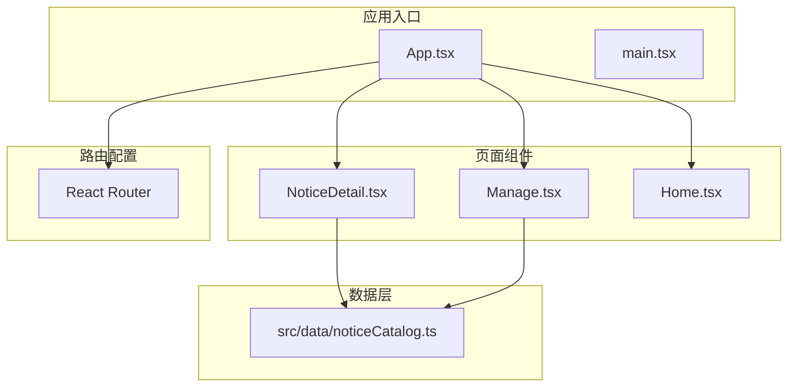
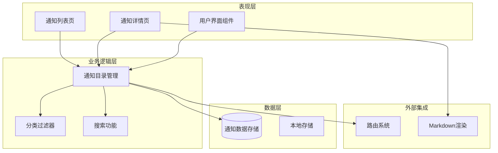
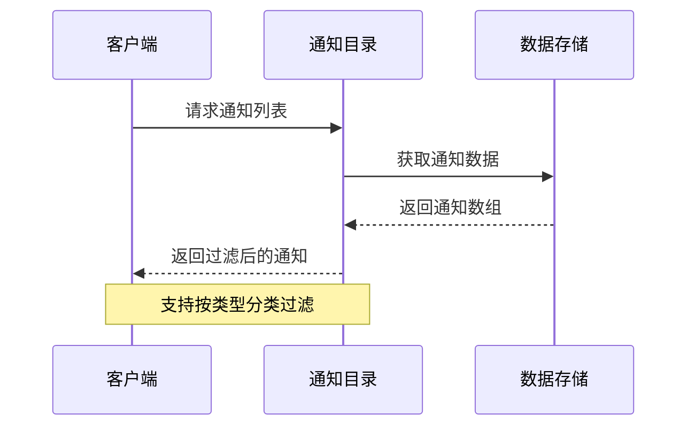
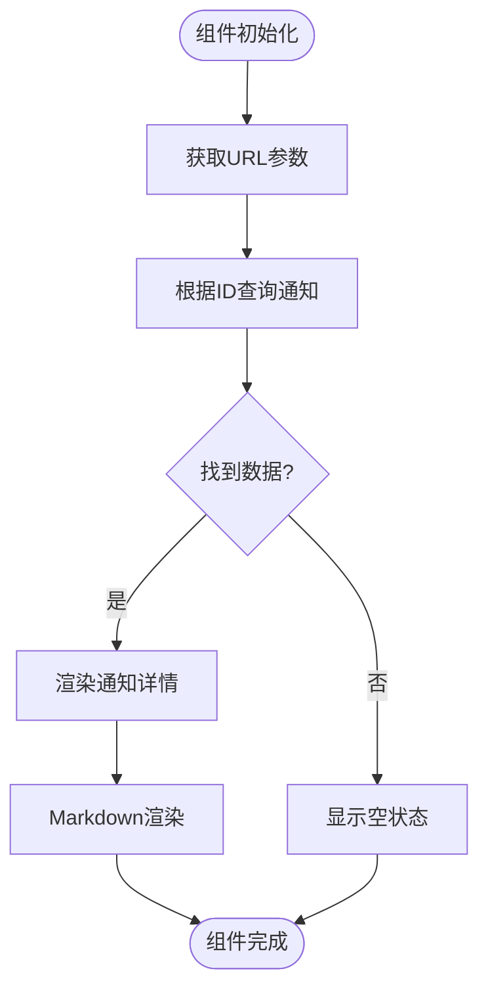
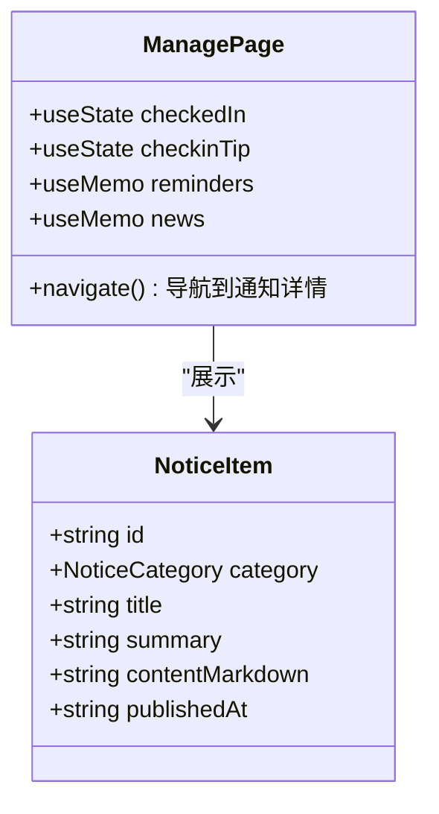
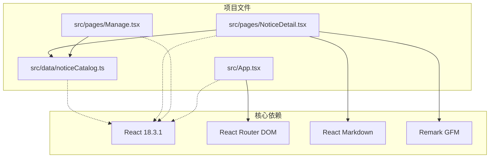

# 通知公告数据接口

<cite>
**本文档引用的文件**
- [noticeCatalog.ts](file://src/data/noticeCatalog.ts)
- [NoticeDetail.tsx](file://src/pages/NoticeDetail.tsx)
- [Manage.tsx](file://src/pages/Manage.tsx)
- [App.tsx](file://src/App.tsx)
- [Home.tsx](file://src/pages/Home.tsx)
</cite>

## 目录
1. [简介](#简介)
2. [项目结构](#项目结构)
3. [核心组件](#核心组件)
4. [架构概览](#架构概览)
5. [详细组件分析](#详细组件分析)
6. [依赖关系分析](#依赖关系分析)
7. [性能考虑](#性能考虑)
8. [故障排除指南](#故障排除指南)
9. [结论](#结论)

## 简介

本文件为通知公告数据接口的详细API文档，专注于`NoticeItem`接口的数据结构和字段定义。该系统实现了基于React + TypeScript + Vite的技术栈，提供通知类型分类、标题和正文内容格式要求、发布时间和有效期管理等功能。文档详细说明了通知的优先级设置、目标用户群体和推送策略，并提供了完整的`NoticeItem`接口示例、字段验证规则和数据格式标准。

## 项目结构

该项目采用模块化的前端架构设计，主要包含以下核心目录结构：



**图表来源**
- [App.tsx:25-49](file://src/App.tsx#L25-L49)
- [noticeCatalog.ts:12-49](file://src/data/noticeCatalog.ts#L12-L49)

**章节来源**
- [App.tsx:19-51](file://src/App.tsx#L19-L51)
- [noticeCatalog.ts:1-59](file://src/data/noticeCatalog.ts#L1-L59)

## 核心组件

### NoticeItem 接口定义

`NoticeItem`是通知公告系统的核心数据结构，定义了所有通知项的标准格式：

```mermaid
classDiagram
class NoticeItem {
+string id
+NoticeCategory category
+string title
+string summary
+string contentMarkdown
+string publishedAt
}
class NoticeCategory {
<<enumeration>>
"reminder"
"news"
}
NoticeItem --> NoticeCategory : "使用"
```

**图表来源**
- [noticeCatalog.ts:3-10](file://src/data/noticeCatalog.ts#L3-L10)

### 数据模型详细说明

| 字段名 | 类型 | 必填 | 描述 | 示例值 |
|--------|------|------|------|--------|
| id | string | 是 | 通知唯一标识符 | "reminder-cold" |
| category | NoticeCategory | 是 | 通知类型分类 | "reminder" 或 "news" |
| title | string | 是 | 通知标题 | "非医提醒：今晚降温" |
| summary | string | 否 | 通知摘要内容 | "夜间气温将明显下降，请注意保暖。" |
| contentMarkdown | string | 是 | Markdown格式的正文内容 | 支持标准Markdown语法 |
| publishedAt | string | 否 | 发布时间（YYYY-MM-DD格式） | "2026-04-15" |

**章节来源**
- [noticeCatalog.ts:3-10](file://src/data/noticeCatalog.ts#L3-L10)

## 架构概览

通知公告系统采用分层架构设计，实现了清晰的职责分离：



**图表来源**
- [noticeCatalog.ts:51-59](file://src/data/noticeCatalog.ts#L51-L59)
- [NoticeDetail.tsx:6](file://src/pages/NoticeDetail.tsx#L6)

## 详细组件分析

### 通知数据管理

通知数据通过`noticeCatalog`数组进行集中管理，提供了完整的通知数据集合：



**图表来源**
- [noticeCatalog.ts:12-49](file://src/data/noticeCatalog.ts#L12-L49)

### 通知详情展示组件

`NoticeDetail`组件负责展示单个通知的详细内容，支持Markdown格式渲染：



**图表来源**
- [NoticeDetail.tsx:8-51](file://src/pages/NoticeDetail.tsx#L8-L51)

**章节来源**
- [NoticeDetail.tsx:1-51](file://src/pages/NoticeDetail.tsx#L1-L51)

### 通知列表管理

`Manage`页面展示了通知的综合管理功能，包括健康提醒和最新资讯的展示：



**图表来源**
- [Manage.tsx:7-166](file://src/pages/Manage.tsx#L7-L166)

**章节来源**
- [Manage.tsx:1-166](file://src/pages/Manage.tsx#L1-L166)

### 路由配置

应用使用React Router进行路由管理，通知详情页通过动态路由参数访问：

```mermaid
graph LR
subgraph "路由路径"
Root[/] --> Layout[布局组件]
Layout --> Home[首页]
Layout --> NoticeDetail[通知详情]
Layout --> OtherPages[其他页面]
end
NoticeDetail --> DetailRoute["/notice/:id"]
DetailRoute --> DynamicParam[动态ID参数]
```

**图表来源**
- [App.tsx:44](file://src/App.tsx#L44)

**章节来源**
- [App.tsx:25-49](file://src/App.tsx#L25-L49)

## 依赖关系分析

通知公告系统的关键依赖关系如下：



**图表来源**
- [noticeCatalog.ts:1](file://src/data/noticeCatalog.ts#L1)
- [NoticeDetail.tsx:1](file://src/pages/NoticeDetail.tsx#L1)
- [Manage.tsx:1](file://src/pages/Manage.tsx#L1)
- [App.tsx:1](file://src/App.tsx#L1)

**章节来源**
- [noticeCatalog.ts:1-59](file://src/data/noticeCatalog.ts#L1-L59)
- [NoticeDetail.tsx:1-6](file://src/pages/NoticeDetail.tsx#L1-L6)
- [Manage.tsx:1-5](file://src/pages/Manage.tsx#L1-L5)
- [App.tsx:1-17](file://src/App.tsx#L1-L17)

## 性能考虑

通知公告系统的性能优化策略：

### 数据加载优化
- 使用`useMemo`缓存计算结果，避免重复渲染
- 实现按需加载，只在需要时获取通知数据
- 支持数据懒加载，提升首屏加载速度

### 渲染性能
- Markdown内容使用React组件进行高效渲染
- 图片和媒体资源按需加载
- 组件层级扁平化，减少DOM树深度

### 内存管理
- 及时清理事件监听器和订阅
- 合理使用React的生命周期钩子
- 避免内存泄漏和不必要的状态更新

## 故障排除指南

### 常见问题及解决方案

**问题1：通知无法显示**
- 检查通知ID是否正确
- 验证通知数据格式是否符合规范
- 确认路由配置是否正确

**问题2：Markdown渲染异常**
- 检查Markdown语法是否正确
- 验证渲染插件配置
- 确认内容编码格式

**问题3：数据加载失败**
- 检查网络连接状态
- 验证数据源可用性
- 查看浏览器控制台错误信息

**章节来源**
- [NoticeDetail.tsx:35-39](file://src/pages/NoticeDetail.tsx#L35-L39)

## 结论

通知公告数据接口通过清晰的`NoticeItem`接口定义和完善的组件架构，为用户提供了一个功能完整、易于扩展的通知管理系统。系统支持多种通知类型、灵活的内容格式、以及良好的用户体验设计。

主要特点包括：
- 标准化的数据接口定义
- 灵活的通知分类机制
- 支持Markdown格式的内容渲染
- 用户友好的界面设计
- 可扩展的架构设计

该系统为后续的功能扩展和集成提供了良好的基础，包括用户偏好设置集成、定时发布机制、批量推送策略等功能都可以在此基础上进行扩展开发。