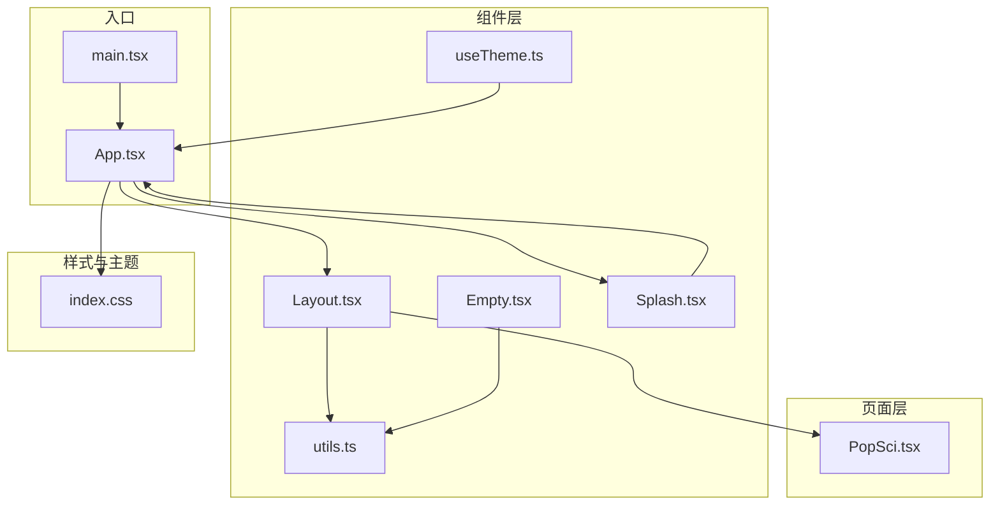
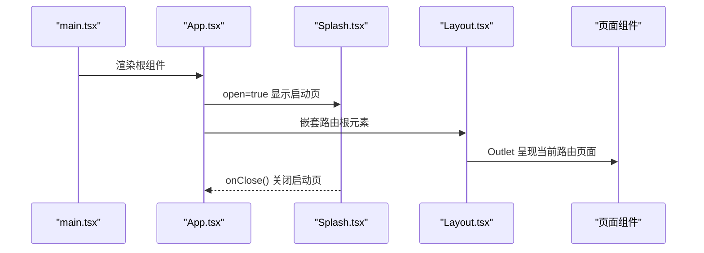
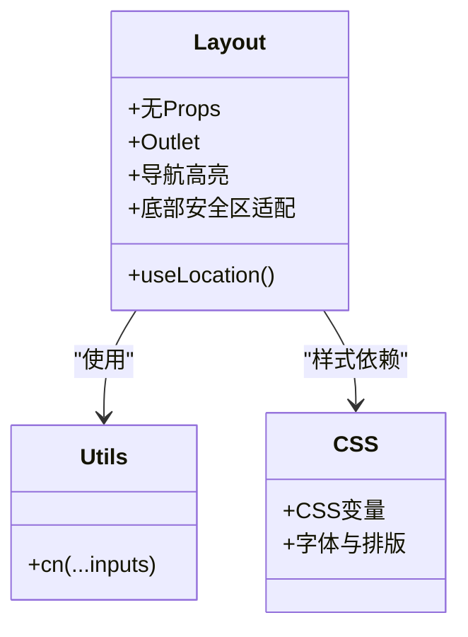
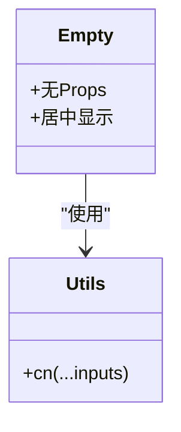
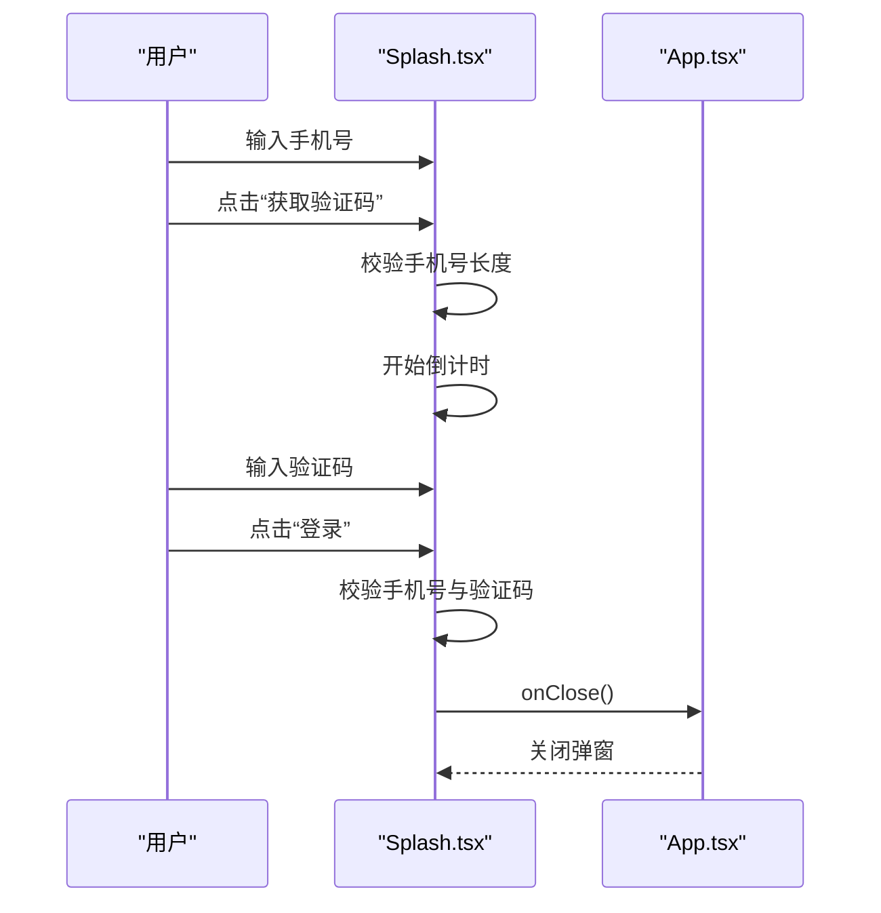
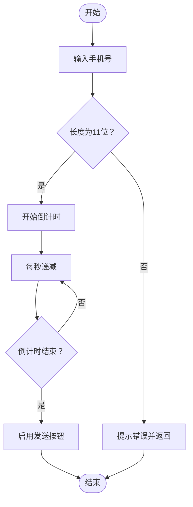
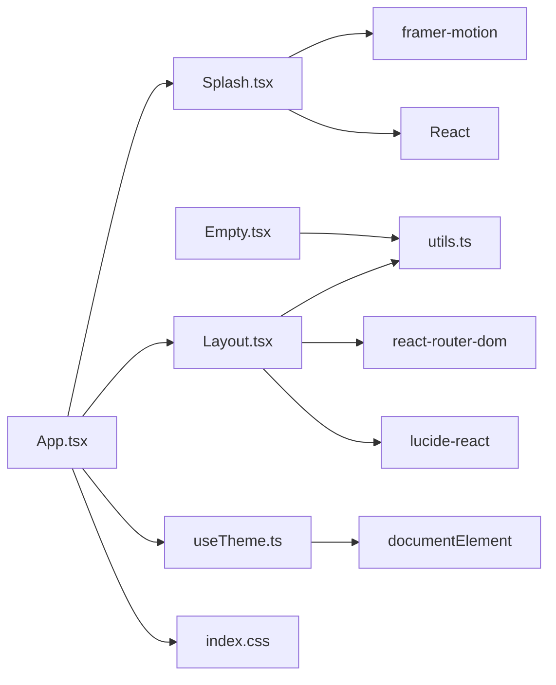

# 组件接口规范

<cite>
**本文引用的文件**
- [Layout.tsx](file://src/components/Layout.tsx)
- [Empty.tsx](file://src/components/Empty.tsx)
- [Splash.tsx](file://src/components/Splash.tsx)
- [utils.ts](file://src/lib/utils.ts)
- [useTheme.ts](file://src/hooks/useTheme.ts)
- [App.tsx](file://src/App.tsx)
- [index.css](file://src/index.css)
- [main.tsx](file://src/main.tsx)
- [PopSci.tsx](file://src/pages/PopSci.tsx)
- [usePopSciState.ts](file://src/hooks/usePopSciState.ts)
- [package.json](file://package.json)
</cite>

## 目录
1. [简介](#简介)
2. [项目结构](#项目结构)
3. [核心组件](#核心组件)
4. [架构总览](#架构总览)
5. [组件详细分析](#组件详细分析)
6. [依赖关系分析](#依赖关系分析)
7. [性能考量](#性能考量)
8. [故障排查指南](#故障排查指南)
9. [结论](#结论)
10. [附录](#附录)

## 简介
本文件为应用中核心UI组件的API参考文档，重点覆盖以下组件：
- Layout：移动端适配的主布局容器与底部导航
- Empty：占位空态组件
- Splash：启动页/登录弹窗组件

文档内容包括：
- Props接口定义（类型、是否必需、默认值）
- 使用方法与典型场景
- 事件处理、回调与状态传递机制
- 样式定制与主题支持
- 组合模式、嵌套使用与布局配置
- 无障碍访问、响应式设计与跨浏览器兼容性
- 最佳实践与常见问题排查

## 项目结构
该应用采用基于功能分层的组织方式，核心UI组件位于 src/components，页面组件位于 src/pages，通用工具与Hook位于 src/lib 与 src/hooks。

图表来源
- [main.tsx:1-11](file://src/main.tsx#L1-L11)
- [App.tsx:1-52](file://src/App.tsx#L1-L52)
- [Layout.tsx:1-66](file://src/components/Layout.tsx#L1-L66)
- [Empty.tsx:1-9](file://src/components/Empty.tsx#L1-L9)
- [Splash.tsx:1-171](file://src/components/Splash.tsx#L1-L171)
- [utils.ts:1-7](file://src/lib/utils.ts#L1-L7)
- [useTheme.ts:1-29](file://src/hooks/useTheme.ts#L1-L29)
- [index.css:1-61](file://src/index.css#L1-L61)
- [PopSci.tsx:1-270](file://src/pages/PopSci.tsx#L1-L270)

章节来源
- [main.tsx:1-11](file://src/main.tsx#L1-L11)
- [App.tsx:1-52](file://src/App.tsx#L1-L52)

## 核心组件
本节概述三个核心组件的职责与对外接口。

- Layout
  - 职责：提供移动端主布局容器与底部导航；通过 Outlet 呈现路由页面；使用 cn 合并Tailwind类名。
  - 关键特性：移动端最大宽度限制、阴影与溢出控制、底部安全区适配、导航高亮与交互态。
- Empty
  - 职责：占位空态组件，居中显示“Empty”文本。
  - 关键特性：无Props，最小实现。
- Splash
  - 职责：启动页/登录弹窗，包含手机号输入、验证码发送与倒计时、登录与游客浏览入口。
  - 关键特性：动画入场/出场、表单校验、状态管理、回调关闭。

章节来源
- [Layout.tsx:10-66](file://src/components/Layout.tsx#L10-L66)
- [Empty.tsx:3-8](file://src/components/Empty.tsx#L3-L8)
- [Splash.tsx:4-49](file://src/components/Splash.tsx#L4-L49)

## 架构总览
应用通过 React Router 进行路由管理，App 作为根容器渲染 Splash 与 Layout，并在 Layout 内部通过 Outlet 呈现各页面。主题通过 useTheme Hook 管理，全局样式由 index.css 提供。

图表来源
- [main.tsx:6-10](file://src/main.tsx#L6-L10)
- [App.tsx:19-51](file://src/App.tsx#L19-L51)
- [Layout.tsx:19-66](file://src/components/Layout.tsx#L19-L66)
- [Splash.tsx:9-49](file://src/components/Splash.tsx#L9-L49)

## 组件详细分析

### Layout 组件
- 组件定位：移动端主布局容器，提供统一的顶部内容区域与底部导航栏。
- 主要职责：
  - 容器：限制最大宽度、居中、背景色、阴影与溢出控制。
  - 内容区：通过 Outlet 呈现代理的页面内容。
  - 导航栏：底部固定导航，根据当前路径高亮对应项，支持图标与文字。
- Props 接口
  - 无外部Props传入
  - 依赖 react-router-dom 的 useLocation 与 Outlet
- 事件与状态
  - 通过 useLocation 判断当前路径，动态计算导航高亮状态。
  - 通过 Link 组件进行路由跳转。
- 样式与主题
  - 使用 cn 合并类名，结合 Tailwind 工具类实现颜色、尺寸、间距与过渡效果。
  - 颜色变量来源于全局 CSS 变量，支持浅/深主题切换。
- 无障碍与响应式
  - 导航项具备 focus-visible ring，支持键盘导航。
  - 底部导航包含安全区适配类名，提升移动端体验。
- 使用示例
  - 在路由根路径下包裹 Layout，内部通过 Outlet 呈现子路由页面。
- 组合与嵌套
  - 作为路由嵌套的根组件，内部仅承载 Outlet 与导航栏。
- 最佳实践
  - 将 Layout 作为所有页面的外层容器，避免在页面内重复实现导航。
  - 使用 cn 合并类名，确保样式可维护性。

章节来源
- [Layout.tsx:10-66](file://src/components/Layout.tsx#L10-L66)
- [utils.ts:4-6](file://src/lib/utils.ts#L4-L6)
- [index.css:7-44](file://src/index.css#L7-L44)

#### 类图（组件关系）

图表来源
- [Layout.tsx:6-8](file://src/components/Layout.tsx#L6-L8)
- [utils.ts:4-6](file://src/lib/utils.ts#L4-L6)
- [index.css:7-44](file://src/index.css#L7-L44)

### Empty 组件
- 组件定位：占位空态组件，用于在数据为空时显示提示。
- 主要职责：居中显示“Empty”文本，便于调试与占位。
- Props 接口
  - 无外部Props
- 事件与状态
  - 无内部状态与事件处理。
- 样式与主题
  - 使用 cn 合并类名，居中布局。
- 无障碍与响应式
  - 无特殊无障碍属性，适合静态占位。
- 使用示例
  - 在列表为空时渲染 Empty。
- 组合与嵌套
  - 可直接在任意容器内使用。
- 最佳实践
  - 与条件渲染配合，避免在加载中显示空态。

章节来源
- [Empty.tsx:3-8](file://src/components/Empty.tsx#L3-L8)
- [utils.ts:4-6](file://src/lib/utils.ts#L4-L6)

#### 类图（组件关系）

图表来源
- [Empty.tsx:1](file://src/components/Empty.tsx#L1)
- [utils.ts:4-6](file://src/lib/utils.ts#L4-L6)

### Splash 组件
- 组件定位：启动页/登录弹窗，提供手机号登录与游客浏览入口。
- 主要职责：
  - 动画弹窗：使用 AnimatePresence 与 motion 实现入场/出场动画。
  - 表单逻辑：手机号输入、验证码发送与倒计时、登录校验、游客浏览。
  - 回调关闭：通过 onClose 回调关闭弹窗。
- Props 接口
  - open: boolean（必需）- 控制弹窗显示/隐藏
  - onClose: () => void（必需）- 关闭弹窗的回调
- 事件与状态
  - 内部状态：phone、code、countdown、isSending
  - 事件：handleGetCode、handleLogin、handleGuest
  - 校验：手机号长度11位、验证码长度6位
- 样式与主题
  - 使用 Tailwind 工具类与 CSS 变量，统一颜色与排版风格。
- 无障碍与响应式
  - 输入框具备 focus-visible ring，按钮支持键盘操作。
  - 移动端最大宽度限制与安全区适配。
- 使用示例
  - 在应用根组件中通过 App 状态控制 open 与 onClose。
- 组合与嵌套
  - 作为顶层弹窗组件，通常置于路由容器之上。
- 最佳实践
  - 在应用初始化阶段显示 Splash，登录成功后通过 onClose 关闭。
  - 验证逻辑应与后端接口对接，此处为演示用法。

章节来源
- [Splash.tsx:4-49](file://src/components/Splash.tsx#L4-L49)
- [Splash.tsx:15-49](file://src/components/Splash.tsx#L15-L49)
- [App.tsx:19-23](file://src/App.tsx#L19-L23)

#### 时序图（登录流程）

图表来源
- [Splash.tsx:15-49](file://src/components/Splash.tsx#L15-L49)
- [App.tsx:19-23](file://src/App.tsx#L19-L23)

#### 流程图（验证码倒计时）

图表来源
- [Splash.tsx:15-32](file://src/components/Splash.tsx#L15-L32)

## 依赖关系分析
- 组件依赖
  - Layout 依赖 utils.cn 与 react-router-dom（useLocation、Outlet），依赖图标库 lucide-react。
  - Empty 依赖 utils.cn。
  - Splash 依赖 framer-motion（AnimatePresence、motion）、React（useState）。
- 主题与样式
  - useTheme 管理主题状态并在 documentElement 上添加类名，index.css 提供 CSS 变量与基础样式。
- 页面集成
  - App 中通过 useState 控制 Splash 的 open 状态，并通过回调 onClose 关闭弹窗。
  - PopSci 页面演示了 cn 的使用与无障碍属性。

图表来源
- [Layout.tsx:1-8](file://src/components/Layout.tsx#L1-L8)
- [Empty.tsx:1](file://src/components/Empty.tsx#L1)
- [Splash.tsx:1-2](file://src/components/Splash.tsx#L1-L2)
- [App.tsx:19-23](file://src/App.tsx#L19-L23)
- [useTheme.ts:14-18](file://src/hooks/useTheme.ts#L14-L18)
- [index.css:7-44](file://src/index.css#L7-L44)

章节来源
- [package.json:13-26](file://package.json#L13-L26)
- [Layout.tsx:1-8](file://src/components/Layout.tsx#L1-L8)
- [Empty.tsx:1](file://src/components/Empty.tsx#L1)
- [Splash.tsx:1-2](file://src/components/Splash.tsx#L1-L2)
- [App.tsx:19-23](file://src/App.tsx#L19-L23)
- [useTheme.ts:14-18](file://src/hooks/useTheme.ts#L14-L18)
- [index.css:7-44](file://src/index.css#L7-L44)

## 性能考量
- 动画与渲染
  - Splash 使用 AnimatePresence 与 motion，注意在频繁切换时避免过度重绘。
  - Layout 与页面组件使用 CSS 过渡与 transform，尽量避免强制回流。
- 样式合并
  - 使用 utils.cn 合并类名，减少无效类名带来的样式冲突与重排。
- 路由与懒加载
  - 页面组件按需加载，减少首屏负担。
- 本地存储
  - usePopSciState 使用 localStorage 缓存状态，注意序列化/反序列化开销与异常处理。

[本节为通用指导，无需特定文件来源]

## 故障排查指南
- Layout 导航不高亮
  - 检查 useLocation 返回的 pathname 与 navItems 的 path 是否匹配。
  - 确认 isActive 计算逻辑与路径前缀判断。
- Splash 弹窗无法关闭
  - 确认 App 中的 showSplash 状态与 onClose 回调是否正确传递。
  - 检查 onClose 是否被多次调用导致状态抖动。
- 样式异常
  - 检查 index.css 中的 CSS 变量是否生效。
  - 确认 Tailwind 层级与工具类拼写。
- 主题切换无效
  - 检查 useTheme 是否正确更新 documentElement 类名与 localStorage。
- 表单校验失败
  - 确认手机号与验证码长度校验逻辑与输入过滤规则一致。

章节来源
- [Layout.tsx:20-32](file://src/components/Layout.tsx#L20-L32)
- [App.tsx:19-23](file://src/App.tsx#L19-L23)
- [Splash.tsx:15-49](file://src/components/Splash.tsx#L15-L49)
- [useTheme.ts:14-18](file://src/hooks/useTheme.ts#L14-L18)

## 结论
- Layout、Empty、Splash 三者分别承担布局容器、占位空态与启动页/登录弹窗的核心职责。
- 通过 cn 合并与 Tailwind 工具类，组件具备良好的可定制性与一致性。
- 主题系统与无障碍属性使组件在不同设备与用户群体中具备良好体验。
- 建议在实际业务中将 Splash 与路由状态结合，确保用户体验连贯；在页面中合理使用 Empty 与 cn，提升可维护性。

[本节为总结性内容，无需特定文件来源]

## 附录

### Props 接口速查
- Layout
  - 无Props
- Empty
  - 无Props
- Splash
  - open: boolean（必需）
  - onClose: () => void（必需）

章节来源
- [Layout.tsx:19-66](file://src/components/Layout.tsx#L19-L66)
- [Empty.tsx:3-8](file://src/components/Empty.tsx#L3-L8)
- [Splash.tsx:4-7](file://src/components/Splash.tsx#L4-L7)

### 样式与主题
- 全局变量与字体
  - CSS 变量：背景、文本、边框、医疗蓝、健康绿、警示橙等。
  - 字体：正文使用 Lora，标题使用 Poppins。
- 主题切换
  - useTheme 读取 localStorage 或系统偏好，设置 documentElement 类名并持久化。
- 无障碍与响应式
  - focus-visible ring、安全区适配类名、键盘导航支持。

章节来源
- [index.css:7-44](file://src/index.css#L7-L44)
- [useTheme.ts:6-12](file://src/hooks/useTheme.ts#L6-L12)
- [useTheme.ts:14-18](file://src/hooks/useTheme.ts#L14-L18)

### 组件使用场景与最佳实践
- Layout
  - 作为路由嵌套路由的根容器，统一页面布局与导航。
  - 在页面中使用 cn 合并类名，保持样式一致性。
- Empty
  - 在数据为空时渲染，避免空白区域影响体验。
- Splash
  - 在应用初始化阶段显示，登录成功后通过 onClose 关闭。
  - 表单校验与倒计时逻辑需与后端接口对接。

章节来源
- [App.tsx:19-51](file://src/App.tsx#L19-L51)
- [PopSci.tsx:5,26-269](file://src/pages/PopSci.tsx#L5,L26-L269)
- [usePopSciState.ts:30-79](file://src/hooks/usePopSciState.ts#L30-L79)