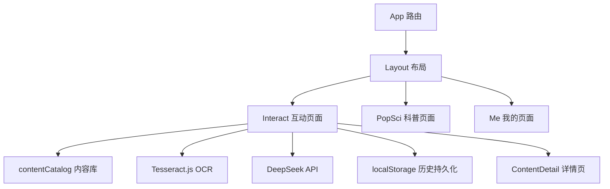
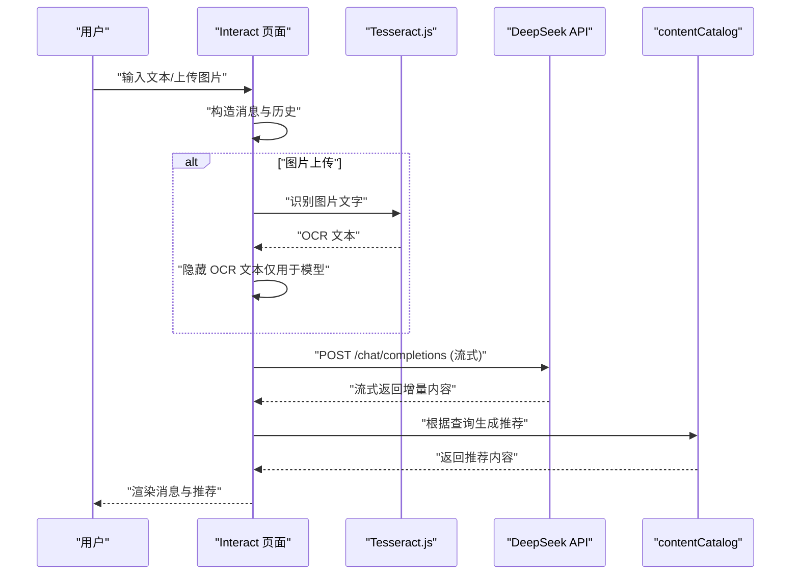
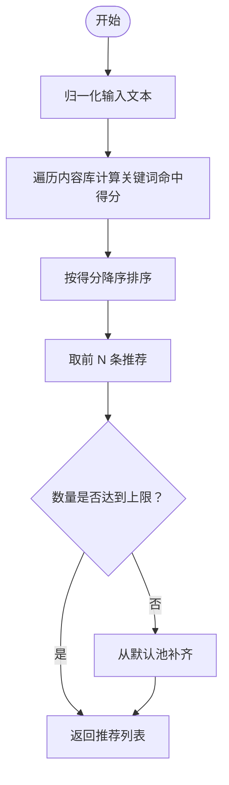
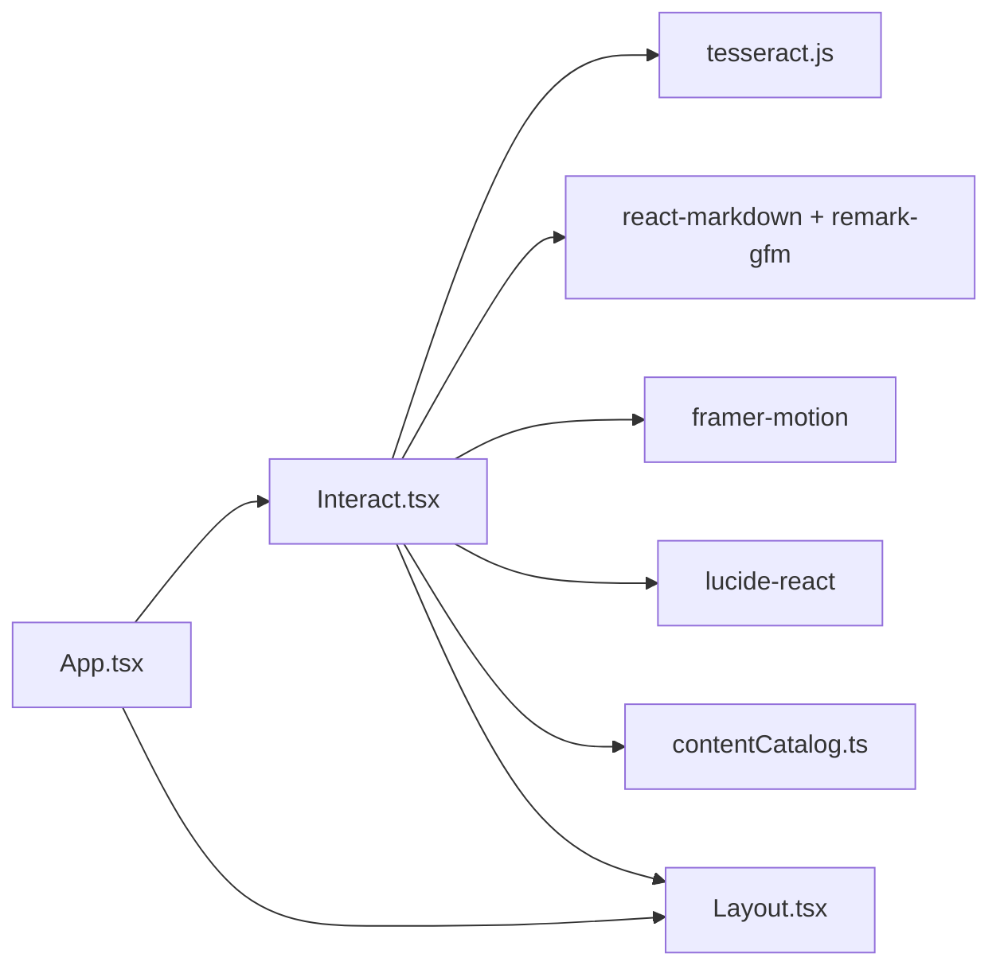

# AI交互页面接口

<cite>
**本文档引用的文件**
- [Interact.tsx](file://src/pages/Interact.tsx)
- [contentCatalog.ts](file://src/data/contentCatalog.ts)
- [chat-persistence-design.md](file://docs/superpowers/specs/2026-04-14-chat-persistence-design.md)
- [chat-recommendations-design.md](file://docs/superpowers/specs/2026-04-14-chat-recommendations-design.md)
- [App.tsx](file://src/App.tsx)
- [Layout.tsx](file://src/components/Layout.tsx)
- [ContentDetail.tsx](file://src/pages/ContentDetail.tsx)
- [usePopSciState.ts](file://src/hooks/usePopSciState.ts)
- [popsciCatalog.ts](file://src/data/popsciCatalog.ts)
- [noticeCatalog.ts](file://src/data/noticeCatalog.ts)
- [package.json](file://package.json)
</cite>

## 目录
1. [简介](#简介)
2. [项目结构](#项目结构)
3. [核心组件](#核心组件)
4. [架构总览](#架构总览)
5. [详细组件分析](#详细组件分析)
6. [依赖关系分析](#依赖关系分析)
7. [性能考量](#性能考量)
8. [故障排查指南](#故障排查指南)
9. [结论](#结论)
10. [附录](#附录)

## 简介
本文件为“AI健康助手交互页面”的API与接口文档，聚焦Interact页面组件的接口规范、AI交互流程、消息处理机制与状态管理。文档同时覆盖OCR图像识别、报告解读、对话历史持久化、推荐算法以及用户偏好设置的接口设计，并提供实时通信、错误处理与会话持久化的实现方案与最佳实践。

## 项目结构
- 应用入口与路由：App组件定义页面路由，Interact作为互动页面。
- 交互页面：Interact负责消息渲染、AI问答、OCR识别、推荐内容展示与历史持久化。
- 内容与推荐：contentCatalog提供本地内容库与推荐算法；ContentDetail负责站内详情页。
- 布局与导航：Layout提供底部导航栏与全局样式工具。
- 用户偏好：usePopSciState提供点赞/收藏状态的本地持久化钩子。
- 设计文档：chat-persistence-design与chat-recommendations-design定义了历史持久化与推荐策略。

图表来源
- [App.tsx:19-49](file://src/App.tsx#L19-L49)
- [Layout.tsx:19-65](file://src/components/Layout.tsx#L19-L65)
- [Interact.tsx:37-461](file://src/pages/Interact.tsx#L37-L461)
- [contentCatalog.ts:69-99](file://src/data/contentCatalog.ts#L69-L99)

章节来源
- [App.tsx:19-49](file://src/App.tsx#L19-L49)
- [Layout.tsx:19-65](file://src/components/Layout.tsx#L19-L65)

## 核心组件
- Interact页面组件：负责消息列表渲染、输入处理、AI问答流式响应、OCR识别与推荐展示。
- contentCatalog：提供本地内容库与推荐算法，支持关键词匹配与默认池补齐。
- ContentDetail：站内详情页，承载推荐内容的入口。
- usePopSciState：提供点赞/收藏状态的本地持久化钩子（与互动页的用户偏好相关）。

章节来源
- [Interact.tsx:37-461](file://src/pages/Interact.tsx#L37-L461)
- [contentCatalog.ts:69-99](file://src/data/contentCatalog.ts#L69-L99)
- [ContentDetail.tsx:14-134](file://src/pages/ContentDetail.tsx#L14-L134)
- [usePopSciState.ts:30-79](file://src/hooks/usePopSciState.ts#L30-L79)

## 架构总览
Interact页面采用“前端直连AI模型”的架构模式，结合本地OCR与内容推荐，形成完整的健康问答闭环。其核心交互路径如下：

图表来源
- [Interact.tsx:86-142](file://src/pages/Interact.tsx#L86-L142)
- [Interact.tsx:144-248](file://src/pages/Interact.tsx#L144-L248)
- [contentCatalog.ts:69-99](file://src/data/contentCatalog.ts#L69-L99)

## 详细组件分析

### Interact 页面组件接口规范
- 组件职责
  - 渲染消息列表与输入区，支持文本与图片上传。
  - 调用DeepSeek API进行流式问答，支持Markdown渲染。
  - 使用Tesseract.js进行图片OCR，提取报告文字并隐藏至模型可见。
  - 基于contentCatalog生成推荐内容，点击跳转站内详情页。
  - 通过localStorage实现对话历史持久化与图片URL清理。

- Props与状态
  - 状态字段
    - messages: 消息数组，包含用户与AI消息，支持图片占位与推荐标记。
    - input: 当前输入文本。
    - isTyping: 是否处于AI回复中。
    - isOcrProcessing: 是否处于OCR识别中。
  - 消息结构（Message）
    - id: 消息唯一标识。
    - sender: 发送方（user/ai）。
    - content: 显示内容（AI侧支持Markdown）。
    - isAction: 是否为动作消息（旧版占位，现由推荐替代）。
    - imageUrl: 本地图片URL（仅用于预览，持久化时清理）。
    - hiddenText: 隐藏的OCR文本（仅用于发送给AI模型）。
    - isImagePlaceholder: 是否为已清理的图片消息占位。
    - recommendations: 推荐内容列表。

- 关键方法
  - handleImageUpload: 处理图片上传，生成本地URL，调用OCR识别，构造消息并触发AI问答。
  - fetchAIResponse: 构造历史与请求体，调用DeepSeek API，解析流式响应，更新消息与推荐。
  - handleSend: 处理文本输入，构造消息并触发AI问答。
  - 快捷问题：QUICK_QUESTIONS数组提供常用问题，一键发送。

- 实时通信与流式响应
  - 使用fetch与ReadableStream解析SSE风格的流式数据，逐行解析JSON增量内容，逐步更新AI回复。
  - 错误处理：捕获API错误与JSON解析异常，回退为默认提示并保留推荐。

- 会话持久化
  - 初始化：从localStorage恢复messages，若失败则使用初始消息。
  - 写入：监听messages变化，在非输入/请求状态下序列化并保存；对包含图片的消息清理imageUrl并标记占位。
  - 图片URL清理：避免存储大体积Blob URL，防止localStorage溢出。

- 推荐算法
  - 输入来源：优先使用hiddenText（OCR文本），其次使用content。
  - 匹配规则：关键词命中计分，按分数排序取前N条；不足时用默认池补齐。
  - 去重：确保推荐不重复。
  - 展示：在AI消息下方展示2条推荐，点击跳转至ContentDetail。

- 用户偏好设置
  - 与互动页直接关联的偏好：通过localStorage存储聊天历史与图片占位。
  - 间接关联：点赞/收藏偏好由usePopSciState维护，用于PopSci详情页。

章节来源
- [Interact.tsx:18-35](file://src/pages/Interact.tsx#L18-L35)
- [Interact.tsx:86-142](file://src/pages/Interact.tsx#L86-L142)
- [Interact.tsx:144-248](file://src/pages/Interact.tsx#L144-L248)
- [Interact.tsx:70-84](file://src/pages/Interact.tsx#L70-L84)
- [chat-persistence-design.md:11-22](file://docs/superpowers/specs/2026-04-14-chat-persistence-design.md#L11-L22)

### 推荐系统接口设计
- 数据模型
  - ContentItem：包含id、type、title、summary、keywords、coverUrl、sourceUrl。
  - ContentType：article、video、service、product。
- 推荐函数
  - getRecommendations(input, limit)：根据关键词匹配与默认池补齐，返回最多limit条推荐。
- UI交互
  - 在AI消息下方展示推荐列表，点击跳转至ContentDetail。

图表来源
- [contentCatalog.ts:69-99](file://src/data/contentCatalog.ts#L69-L99)

章节来源
- [contentCatalog.ts:1-101](file://src/data/contentCatalog.ts#L1-L101)
- [chat-recommendations-design.md:55-103](file://docs/superpowers/specs/2026-04-14-chat-recommendations-design.md#L55-L103)

### 站内详情页接口设计
- 路由参数：/content/:id
- 功能：根据id查找ContentItem并展示标题、摘要、关键词与操作按钮（相关服务/原始链接）。
- 错误处理：找不到内容时提示并提供返回按钮。

章节来源
- [ContentDetail.tsx:14-134](file://src/pages/ContentDetail.tsx#L14-L134)
- [contentCatalog.ts:65-67](file://src/data/contentCatalog.ts#L65-L67)

### 用户偏好与状态管理
- usePopSciState：提供isLiked/isSaved/toggleLiked/toggleSaved等能力，状态持久化至localStorage。
- 与Interact的关联：虽然偏好不直接影响AI问答，但可作为后续扩展（如个性化推荐）的基础。

章节来源
- [usePopSciState.ts:30-79](file://src/hooks/usePopSciState.ts#L30-L79)

## 依赖关系分析
- 外部依赖
  - tesseract.js：提供OCR识别能力。
  - react-markdown + remark-gfm：渲染AI回复的Markdown。
  - framer-motion：动画与过渡效果。
  - lucide-react：图标库。
- 内部依赖
  - contentCatalog：提供本地内容库与推荐算法。
  - Layout：提供全局样式与导航。
  - App：定义路由与页面布局。

图表来源
- [package.json:13-25](file://package.json#L13-L25)
- [Interact.tsx:1-10](file://src/pages/Interact.tsx#L1-L10)
- [App.tsx:19-49](file://src/App.tsx#L19-L49)

章节来源
- [package.json:13-25](file://package.json#L13-L25)

## 性能考量
- 流式响应优化
  - 使用ReadableStream与TextDecoder增量解码，避免一次性等待完整响应，提升交互流畅度。
  - 增量更新消息内容，减少重渲染次数。
- OCR处理优化
  - 仅在用户上传图片时触发OCR，识别完成后终止worker，释放资源。
  - 对OCR文本进行清洗（去除多余空行），降低传输与渲染负担。
- 本地存储优化
  - 持久化前清理imageUrl，避免localStorage溢出。
  - 仅在非输入/请求状态时写入，减少频繁IO。
- 推荐算法优化
  - 关键词匹配采用线性扫描与计分，复杂度与内容库规模线性相关；可通过索引或缓存进一步优化。
- UI渲染优化
  - 使用AnimatePresence与Motion进行局部动画，避免整页重绘。
  - 消息列表使用key驱动渲染，减少不必要的diff。

## 故障排查指南
- API密钥缺失
  - 现象：AI回复提示未配置API Key。
  - 处理：在部署环境设置VITE_DEEPSEEK_API_KEY并重启/重新构建。
- OCR识别失败
  - 现象：图片识别为空或报错。
  - 处理：检查图片清晰度与格式；确认Tesseract.js加载成功；查看控制台错误日志。
- 流式响应异常
  - 现象：AI回复卡顿或中断。
  - 处理：检查网络连接与API可用性；确认响应体存在且可读；验证JSON解析逻辑。
- 历史记录丢失
  - 现象：切换页面后聊天记录消失。
  - 处理：确认localStorage可用；检查初始化与写入逻辑；验证messages结构。
- 推荐内容不相关
  - 现象：推荐内容与主题无关。
  - 处理：增加ContentItem的关键词覆盖度；调整默认池；优化匹配规则。

章节来源
- [Interact.tsx:152-166](file://src/pages/Interact.tsx#L152-L166)
- [Interact.tsx:128-136](file://src/pages/Interact.tsx#L128-L136)
- [Interact.tsx:237-247](file://src/pages/Interact.tsx#L237-L247)
- [chat-persistence-design.md:11-22](file://docs/superpowers/specs/2026-04-14-chat-persistence-design.md#L11-L22)
- [chat-recommendations-design.md:93-103](file://docs/superpowers/specs/2026-04-14-chat-recommendations-design.md#L93-L103)

## 结论
Interact页面通过本地OCR与DeepSeek流式API实现了高效的健康问答体验，并结合本地内容库提供即时推荐。通过localStorage实现历史持久化与图片URL清理，兼顾了性能与用户体验。未来可在推荐算法、个性化偏好与后端服务集成方面进一步扩展。

## 附录
- 开发最佳实践
  - 严格区分“显示内容”与“模型可见内容”，使用hiddenText传递OCR文本。
  - 在UI层对Markdown进行安全渲染，避免不受信任内容执行。
  - 对流式响应进行超时与重试策略，提升鲁棒性。
  - 对localStorage容量进行监控与清理策略，避免溢出。
  - 对推荐内容进行A/B测试与用户反馈收集，持续优化匹配规则。