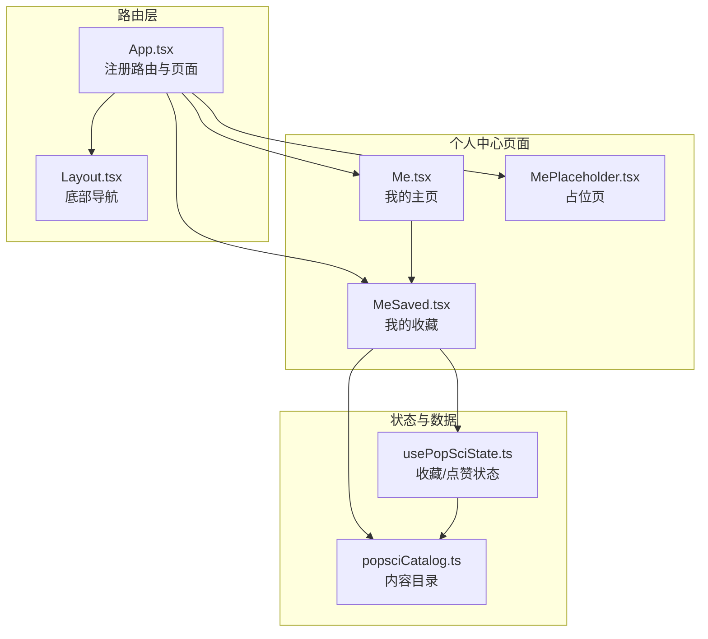
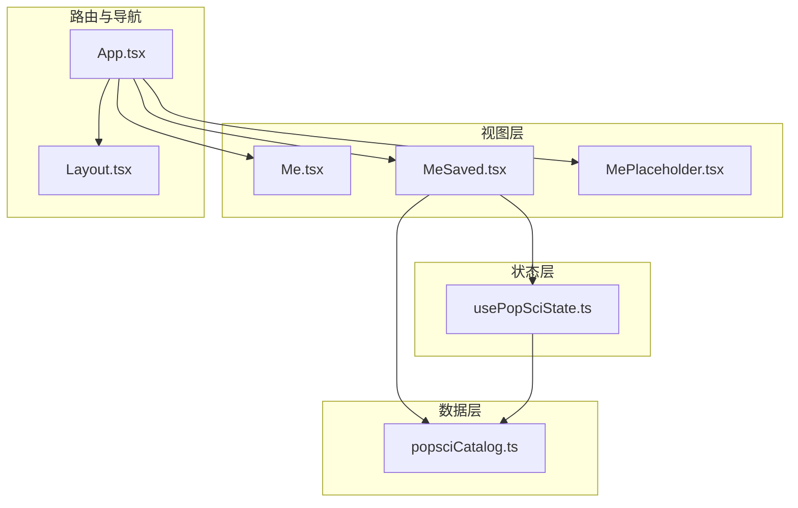
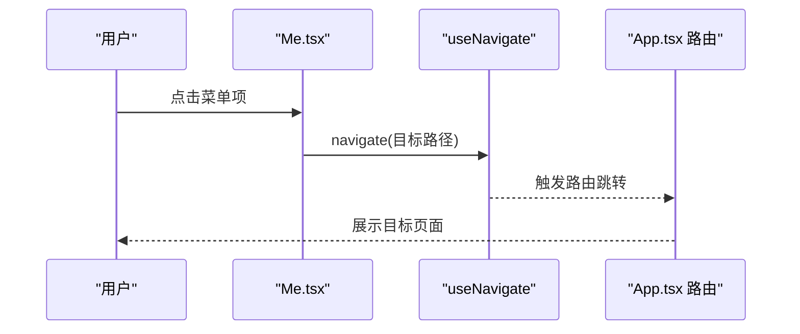
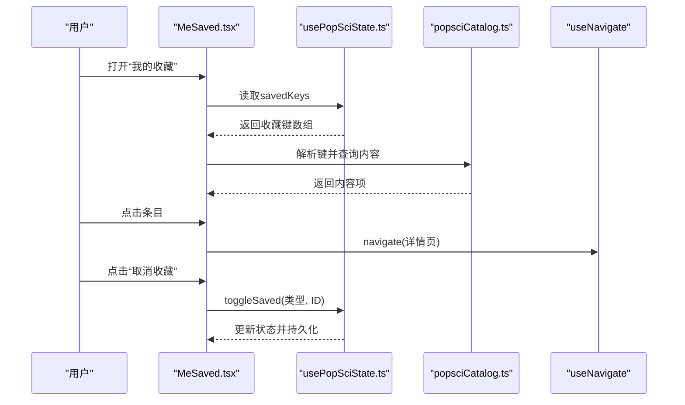
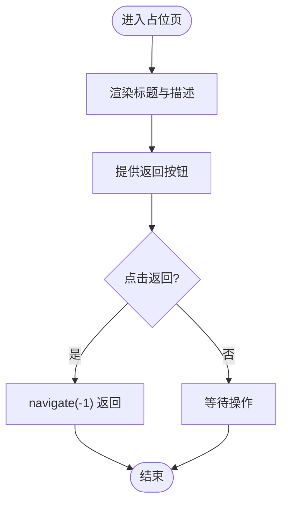
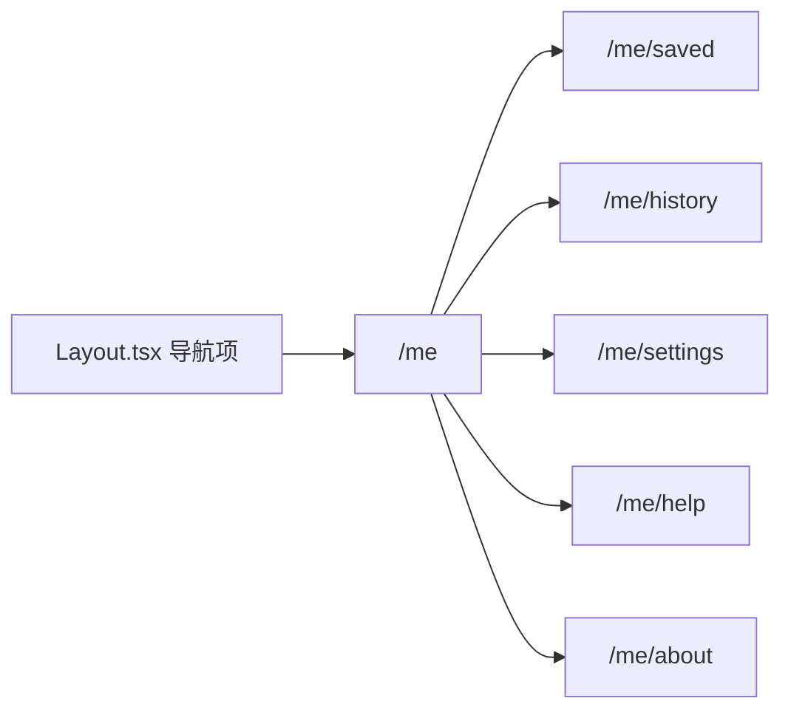
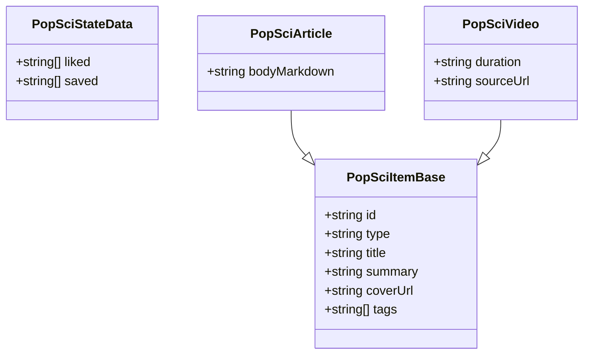
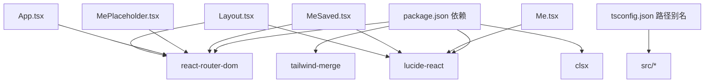

# 个人中心页面接口

<cite>
**本文档引用的文件**
- [Me.tsx](file://src/pages/Me.tsx)
- [MeSaved.tsx](file://src/pages/MeSaved.tsx)
- [MePlaceholder.tsx](file://src/pages/MePlaceholder.tsx)
- [App.tsx](file://src/App.tsx)
- [Layout.tsx](file://src/components/Layout.tsx)
- [usePopSciState.ts](file://src/hooks/usePopSciState.ts)
- [popsciCatalog.ts](file://src/data/popsciCatalog.ts)
- [2026-04-14-me-page-design.md](file://docs/superpowers/specs/2026-04-14-me-page-design.md)
- [2026-04-15-service-manage-me-actions-design.md](file://docs/superpowers/specs/2026-04-15-service-manage-me-actions-design.md)
- [package.json](file://package.json)
- [tsconfig.json](file://tsconfig.json)
</cite>

## 目录
1. [引言](#引言)
2. [项目结构](#项目结构)
3. [核心组件](#核心组件)
4. [架构总览](#架构总览)
5. [详细组件分析](#详细组件分析)
6. [依赖关系分析](#依赖关系分析)
7. [性能考量](#性能考量)
8. [故障排查指南](#故障排查指南)
9. [结论](#结论)
10. [附录](#附录)

## 引言
本文件面向个人中心（Me）页面的API与接口设计，聚焦“我的收藏”“浏览历史”“个人设置”“帮助与反馈”“关于我们”等Me系列页面的接口规范与用户管理功能。文档覆盖以下方面：
- 个人资料、收藏管理、历史记录等功能的Props接口与状态管理
- 用户认证、数据同步与权限控制的实现机制
- 个人设置、账户管理与隐私保护的接口设计
- 用户数据的存储策略、缓存机制与安全考虑
- 页面间导航、状态管理与用户体验优化方案
- 实际的个人中心集成示例与开发最佳实践

## 项目结构
个人中心相关模块位于src/pages目录，配合路由配置、状态钩子与数据目录共同构成Me系列页面的前端实现。

**图表来源**
- [App.tsx:25-49](file://src/App.tsx#L25-L49)
- [Layout.tsx:19-62](file://src/components/Layout.tsx#L19-L62)
- [Me.tsx:4-64](file://src/pages/Me.tsx#L4-L64)
- [MeSaved.tsx:16-131](file://src/pages/MeSaved.tsx#L16-L131)
- [usePopSciState.ts:30-79](file://src/hooks/usePopSciState.ts#L30-L79)
- [popsciCatalog.ts:29-98](file://src/data/popsciCatalog.ts#L29-L98)

**章节来源**
- [App.tsx:19-51](file://src/App.tsx#L19-L51)
- [Layout.tsx:19-65](file://src/components/Layout.tsx#L19-L65)
- [Me.tsx:4-64](file://src/pages/Me.tsx#L4-L64)
- [MeSaved.tsx:16-131](file://src/pages/MeSaved.tsx#L16-L131)
- [MePlaceholder.tsx:4-34](file://src/pages/MePlaceholder.tsx#L4-L34)
- [usePopSciState.ts:30-79](file://src/hooks/usePopSciState.ts#L30-L79)
- [popsciCatalog.ts:29-98](file://src/data/popsciCatalog.ts#L29-L98)

## 核心组件
本节梳理Me系列页面的关键组件及其职责与接口。

- Me主页（个人中心入口）
  - 功能：展示用户头像与昵称、状态标签；提供“我的收藏”“浏览历史”“个人设置”“帮助与反馈”“关于我们”等入口。
  - Props：无
  - 状态：无
  - 导航：点击菜单项触发路由跳转至对应子页面

- 我的收藏（收藏列表）
  - 功能：展示用户收藏的科普内容（文章/视频），支持取消收藏、查看详情、返回上级。
  - Props：无
  - 状态：依赖usePopSciState提供的收藏键集合与工具函数
  - 数据：依赖popsciCatalog解析保存的键生成内容项

- 占位页（历史/设置/帮助/关于）
  - 功能：展示标题与描述，提供返回上级的能力。
  - Props：title（字符串）、description（字符串）
  - 状态：无
  - 导航：返回上级

- 路由与布局
  - App路由：注册/me、/me/saved、/me/history、/me/settings、/me/help、/me/about等路径
  - 底部导航：在Layout中注册“我的”Tab，支持子路由高亮

**章节来源**
- [Me.tsx:6-12](file://src/pages/Me.tsx#L6-L12)
- [MeSaved.tsx:16-28](file://src/pages/MeSaved.tsx#L16-L28)
- [MePlaceholder.tsx:4-34](file://src/pages/MePlaceholder.tsx#L4-L34)
- [App.tsx:37-43](file://src/App.tsx#L37-L43)
- [Layout.tsx:10-17](file://src/components/Layout.tsx#L10-L17)

## 架构总览
个人中心页面的架构围绕“路由-页面-状态-数据”四层展开，采用本地状态与本地存储相结合的方式实现用户行为的持久化。

**图表来源**
- [App.tsx:25-49](file://src/App.tsx#L25-L49)
- [Me.tsx:4-64](file://src/pages/Me.tsx#L4-L64)
- [MeSaved.tsx:16-131](file://src/pages/MeSaved.tsx#L16-L131)
- [MePlaceholder.tsx:4-34](file://src/pages/MePlaceholder.tsx#L4-L34)
- [usePopSciState.ts:30-79](file://src/hooks/usePopSciState.ts#L30-L79)
- [popsciCatalog.ts:29-98](file://src/data/popsciCatalog.ts#L29-L98)

## 详细组件分析

### Me主页（个人中心入口）
- 组件职责
  - 渲染用户信息区域（头像、昵称、状态标签）
  - 提供功能入口列表，点击后跳转至对应子页面
- Props与状态
  - 无外部Props
  - 无内部状态
- 导航流程
  - 点击菜单项触发useNavigate跳转至指定路径
- 可访问性
  - 图标元素提供aria-hidden标识，按钮提供aria-label
- 性能与体验
  - 使用分组hover/active态与过渡动画提升交互反馈

**图表来源**
- [Me.tsx:44-48](file://src/pages/Me.tsx#L44-L48)
- [App.tsx:37-43](file://src/App.tsx#L37-L43)

**章节来源**
- [Me.tsx:4-64](file://src/pages/Me.tsx#L4-L64)

### 我的收藏（收藏列表）
- 组件职责
  - 展示用户收藏的科普内容（文章/视频）
  - 支持取消收藏、查看详情、返回上级
- Props与状态
  - 无外部Props
  - 依赖usePopSciState的状态与方法
- 数据处理
  - 解析保存键（格式：类型:ID），从popsciCatalog中查找对应内容
  - 过滤无效键，渲染有效内容项
- 交互流程
  - 点击条目跳转至详情页
  - 点击“取消收藏”调用toggleSaved

**图表来源**
- [MeSaved.tsx:16-28](file://src/pages/MeSaved.tsx#L16-L28)
- [MeSaved.tsx:65-125](file://src/pages/MeSaved.tsx#L65-L125)
- [usePopSciState.ts:30-79](file://src/hooks/usePopSciState.ts#L30-L79)
- [popsciCatalog.ts:90-92](file://src/data/popsciCatalog.ts#L90-L92)

**章节来源**
- [MeSaved.tsx:16-131](file://src/pages/MeSaved.tsx#L16-L131)
- [usePopSciState.ts:30-79](file://src/hooks/usePopSciState.ts#L30-L79)
- [popsciCatalog.ts:90-92](file://src/data/popsciCatalog.ts#L90-L92)

### 占位页（历史/设置/帮助/关于）
- 组件职责
  - 展示标题与描述文本，提供返回上级能力
- Props接口
  - title: 字符串
  - description: 字符串
- 导航流程
  - 点击返回按钮调用navigate(-1)返回上一页

**图表来源**
- [MePlaceholder.tsx:4-34](file://src/pages/MePlaceholder.tsx#L4-L34)

**章节来源**
- [MePlaceholder.tsx:4-34](file://src/pages/MePlaceholder.tsx#L4-L34)

### 路由与导航
- 路由注册
  - 主路由：/me、/me/saved、/me/history、/me/settings、/me/help、/me/about
  - 子路由：在Me主页下提供收藏、历史、设置、帮助、关于等入口
- 底部导航
  - 在Layout中注册“我的”Tab，支持子路由高亮

**图表来源**
- [Layout.tsx:10-17](file://src/components/Layout.tsx#L10-L17)
- [App.tsx:37-43](file://src/App.tsx#L37-L43)

**章节来源**
- [App.tsx:25-49](file://src/App.tsx#L25-L49)
- [Layout.tsx:19-65](file://src/components/Layout.tsx#L19-L65)

### 状态管理与数据模型
- 状态钩子usePopSciState
  - 数据结构：liked（点赞键数组）、saved（收藏键数组）
  - 键格式：类型:ID（如article:a-htn-winter-meds、video:v-report-reading）
  - 持久化：localStorage存储，键名固定
  - 方法：isLiked、isSaved、toggleLiked、toggleSaved、读取键数组与计数
- 数据目录popsciCatalog
  - 类型：文章/视频两类
  - 结构：包含标题、摘要、封面、标签、作者、发布时间、播放时长等字段
  - 查询：按类型与ID检索内容项

**图表来源**
- [usePopSciState.ts:6-9](file://src/hooks/usePopSciState.ts#L6-L9)
- [popsciCatalog.ts:3-27](file://src/data/popsciCatalog.ts#L3-L27)

**章节来源**
- [usePopSciState.ts:30-79](file://src/hooks/usePopSciState.ts#L30-L79)
- [popsciCatalog.ts:1-98](file://src/data/popsciCatalog.ts#L1-L98)

## 依赖关系分析
- 组件耦合
  - MeSaved依赖usePopSciState与popsciCatalog
  - App负责路由注册与页面装配
  - Layout负责底部导航与页面容器
- 外部依赖
  - react-router-dom：路由与导航
  - lucide-react：图标
  - tailwind-merge/clsx：样式合并
- 版本与配置
  - 依赖声明与TypeScript路径别名配置

**图表来源**
- [package.json:13-25](file://package.json#L13-L25)
- [tsconfig.json:27-31](file://tsconfig.json#L27-L31)
- [Me.tsx:1](file://src/pages/Me.tsx#L1)
- [MeSaved.tsx:3](file://src/pages/MeSaved.tsx#L3)
- [MePlaceholder.tsx:1](file://src/pages/MePlaceholder.tsx#L1)
- [App.tsx:2](file://src/App.tsx#L2)
- [Layout.tsx:1](file://src/components/Layout.tsx#L1)

**章节来源**
- [package.json:13-25](file://package.json#L13-L25)
- [tsconfig.json:27-31](file://tsconfig.json#L27-L31)

## 性能考量
- 渲染优化
  - MeSaved使用useMemo对收藏项进行计算，避免重复渲染
  - 列表项使用key与受控交互，减少重排
- 状态持久化
  - usePopSciState在状态变化时写入localStorage，注意I/O开销与序列化成本
- 资源加载
  - 图片资源通过coverUrl加载，建议在详情页懒加载与错误兜底
- 导航体验
  - 底部导航在子路由下保持高亮，提升用户定位感

**章节来源**
- [MeSaved.tsx:20-28](file://src/pages/MeSaved.tsx#L20-L28)
- [usePopSciState.ts:36-38](file://src/hooks/usePopSciState.ts#L36-L38)
- [Layout.tsx:32](file://src/components/Layout.tsx#L32)

## 故障排查指南
- 路由无法跳转
  - 检查App路由是否注册目标路径
  - 确认Layout导航项与路由路径一致
- 收藏列表为空
  - 检查localStorage中状态键是否存在
  - 确认保存键格式与popsciCatalog中的ID匹配
- 图标显示异常
  - 确认lucide-react依赖安装
- 样式错乱
  - 检查Tailwind配置与路径别名
- 访问性问题
  - 确保按钮与图标提供aria-label或aria-hidden合理标注

**章节来源**
- [App.tsx:37-43](file://src/App.tsx#L37-L43)
- [Layout.tsx:10-17](file://src/components/Layout.tsx#L10-L17)
- [usePopSciState.ts:11](file://src/hooks/usePopSciState.ts#L11)
- [popsciCatalog.ts:90-92](file://src/data/popsciCatalog.ts#L90-L92)
- [Me.tsx:24](file://src/pages/Me.tsx#L24)

## 结论
个人中心页面通过清晰的路由分层、稳定的本地状态与数据模型，实现了收藏管理与占位功能的可扩展架构。未来可在以下方向演进：
- 用户认证与多端同步：引入登录态与服务端同步
- 个人设置与隐私：提供设置入口与数据导出/删除
- 数据迁移：从localStorage迁移到IndexedDB或服务端存储
- 权限控制：基于角色与登录态的细粒度权限校验

## 附录

### 接口与类型定义
- Me主页
  - 无Props
  - 无状态
- 我的收藏
  - 无Props
  - 依赖usePopSciState返回的键集合与方法
- 占位页
  - Props: title（字符串）、description（字符串）

**章节来源**
- [Me.tsx:4-64](file://src/pages/Me.tsx#L4-L64)
- [MeSaved.tsx:16-131](file://src/pages/MeSaved.tsx#L16-L131)
- [MePlaceholder.tsx:4-34](file://src/pages/MePlaceholder.tsx#L4-L34)

### 开发最佳实践
- 路由设计
  - 保持路径语义化，子路由与父路由层级清晰
- 状态管理
  - 将本地状态与持久化解耦，避免直接操作localStorage
- 数据模型
  - 明确键格式与类型约束，便于跨页面共享
- 可访问性
  - 为交互元素提供标签与键盘支持
- 安全与隐私
  - 不在前端存储敏感信息；对用户输入进行校验与清理

**章节来源**
- [usePopSciState.ts:11](file://src/hooks/usePopSciState.ts#L11)
- [Me.tsx:24](file://src/pages/Me.tsx#L24)