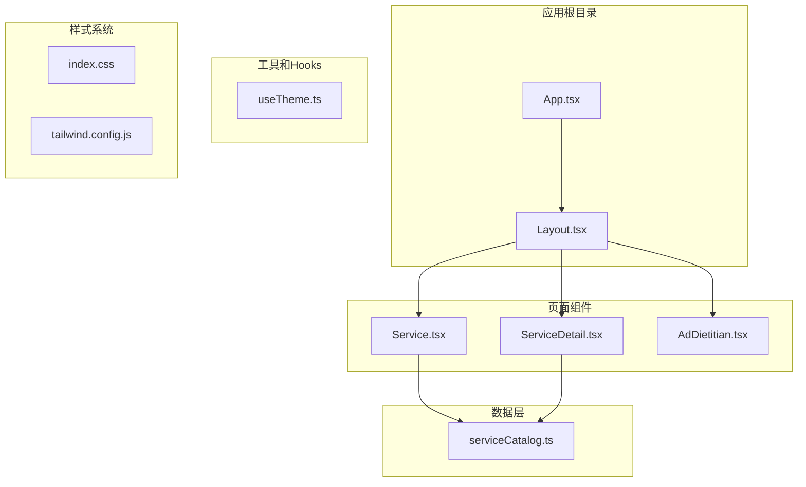
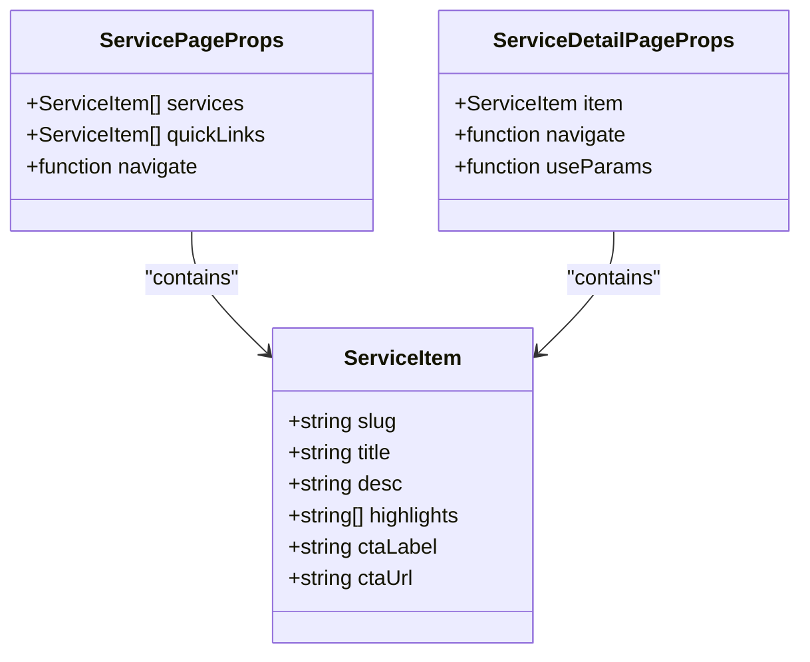
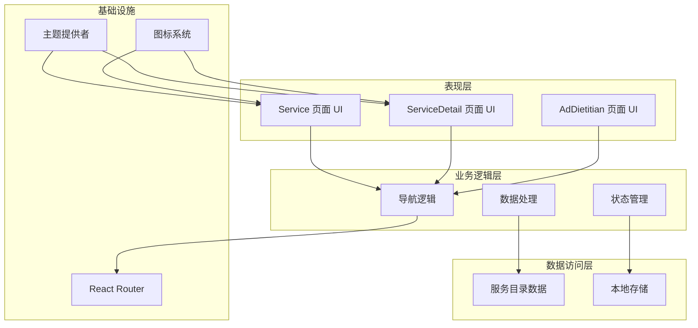
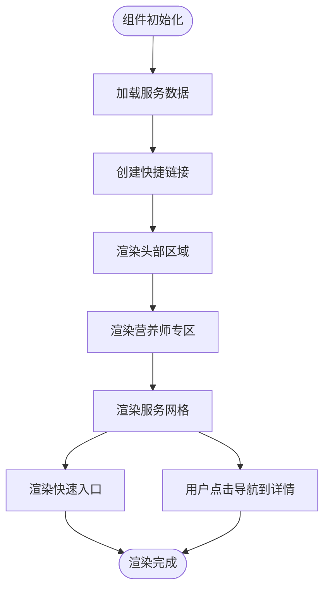
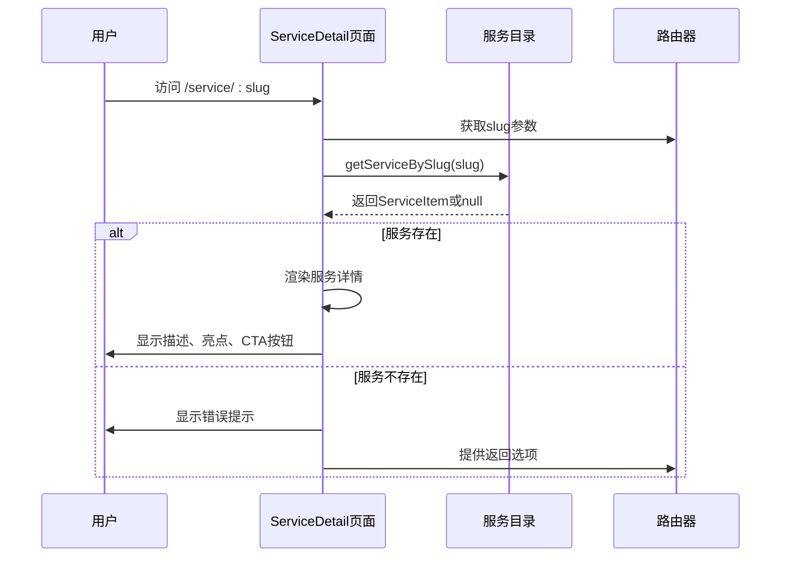
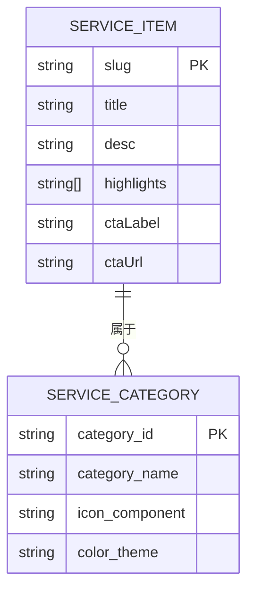
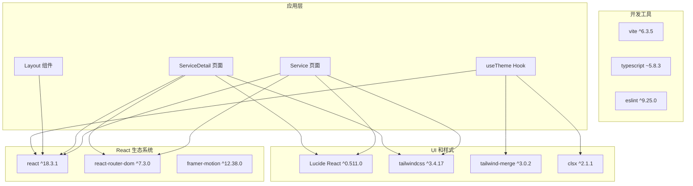

# 医疗服务页面接口

<cite>
**本文档引用的文件**
- [src/pages/Service.tsx](file://src/pages/Service.tsx)
- [src/pages/ServiceDetail.tsx](file://src/pages/ServiceDetail.tsx)
- [src/pages/AdDietitian.tsx](file://src/pages/AdDietitian.tsx)
- [src/data/serviceCatalog.ts](file://src/data/serviceCatalog.ts)
- [src/components/Layout.tsx](file://src/components/Layout.tsx)
- [src/App.tsx](file://src/App.tsx)
- [src/hooks/useTheme.ts](file://src/hooks/useTheme.ts)
- [src/index.css](file://src/index.css)
- [tailwind.config.js](file://tailwind.config.js)
- [tsconfig.json](file://tsconfig.json)
- [package.json](file://package.json)
</cite>

## 目录
1. [简介](#简介)
2. [项目结构](#项目结构)
3. [核心组件](#核心组件)
4. [架构概览](#架构概览)
5. [详细组件分析](#详细组件分析)
6. [依赖分析](#依赖分析)
7. [性能考虑](#性能考虑)
8. [故障排除指南](#故障排除指南)
9. [结论](#结论)
10. [附录](#附录)

## 简介

本文件为医疗服务页面组件的全面API文档，专注于Service（服务）和ServiceDetail（服务详情）页面的接口规范。该系统采用React + TypeScript + Vite技术栈构建，提供医疗服务分类展示、详情页面渲染和预约功能。文档详细说明了医疗服务的数据模型、Props接口和状态管理机制，解释了服务分类展示、详情页面渲染和预约功能的实现方式。

## 项目结构

该项目采用模块化的前端架构，主要包含以下核心目录和文件：



**图表来源**
- [src/App.tsx:19-51](file://src/App.tsx#L19-L51)
- [src/components/Layout.tsx:19-65](file://src/components/Layout.tsx#L19-L65)
- [src/pages/Service.tsx:6-132](file://src/pages/Service.tsx#L6-L132)
- [src/pages/ServiceDetail.tsx:6-73](file://src/pages/ServiceDetail.tsx#L6-L73)

**章节来源**
- [src/App.tsx:19-51](file://src/App.tsx#L19-L51)
- [src/components/Layout.tsx:19-65](file://src/components/Layout.tsx#L19-L65)

## 核心组件

### 数据模型定义

系统的核心数据模型基于TypeScript接口定义，确保类型安全和开发体验：



**图表来源**
- [src/data/serviceCatalog.ts:1-8](file://src/data/serviceCatalog.ts#L1-L8)
- [src/pages/Service.tsx:6-132](file://src/pages/Service.tsx#L6-L132)
- [src/pages/ServiceDetail.tsx:6-73](file://src/pages/ServiceDetail.tsx#L6-L73)

### 接口规范

#### Service 页面接口

Service页面提供医疗服务的主入口，包含以下核心功能：

**路由定义**
- 路径: `/service`
- 组件: `Service` 默认导出函数

**Props接口**
```typescript
interface ServicePageProps {
  services: ServiceItem[];
  quickLinks: ServiceItem[];
  navigate: (path: string) => void;
}
```

**状态管理**
- 使用React的`useState`和`useMemo`进行状态管理
- 通过`useNavigate`实现页面导航
- 本地状态存储：服务列表、快捷链接

**章节来源**
- [src/pages/Service.tsx:6-132](file://src/pages/Service.tsx#L6-L132)
- [src/data/serviceCatalog.ts:10-43](file://src/data/serviceCatalog.ts#L10-L43)

#### ServiceDetail 页面接口

ServiceDetail页面负责显示具体服务的详细信息：

**路由定义**
- 路径: `/service/:slug`
- 组件: `ServiceDetail` 默认导出函数

**Props接口**
```typescript
interface ServiceDetailPageProps {
  navigate: (path: string) => void;
  params: { slug: string };
  item: ServiceItem | null;
}
```

**状态管理**
- 使用`useMemo`进行数据计算和缓存
- 通过`useParams`获取路由参数
- 条件渲染处理服务不存在的情况

**章节来源**
- [src/pages/ServiceDetail.tsx:6-73](file://src/pages/ServiceDetail.tsx#L6-L73)
- [src/data/serviceCatalog.ts:45-47](file://src/data/serviceCatalog.ts#L45-L47)

## 架构概览

系统采用分层架构设计，清晰分离了表现层、业务逻辑层和数据访问层：



**图表来源**
- [src/App.tsx:25-49](file://src/App.tsx#L25-L49)
- [src/components/Layout.tsx:19-65](file://src/components/Layout.tsx#L19-L65)
- [src/hooks/useTheme.ts:5-28](file://src/hooks/useTheme.ts#L5-L28)

## 详细组件分析

### Service 页面组件

Service页面是医疗服务的主入口，提供服务分类展示和快速导航功能：

#### 组件结构



**图表来源**
- [src/pages/Service.tsx:6-132](file://src/pages/Service.tsx#L6-L132)

#### 核心功能实现

**服务分类展示**
- 支持四种主要服务类型：绿通招募、健康套餐、产品分享、名医在线
- 每个服务项包含标题、描述、图标、颜色主题和slug标识符
- 使用响应式网格布局实现自适应显示

**快速导航功能**
- 基于服务目录的前三个条目创建快捷入口
- 提供直观的卡片式界面，支持快速访问常用服务

**章节来源**
- [src/pages/Service.tsx:9-43](file://src/pages/Service.tsx#L9-L43)
- [src/pages/Service.tsx:83-127](file://src/pages/Service.tsx#L83-L127)

### ServiceDetail 页面组件

ServiceDetail页面专门处理服务详情的展示和交互：

#### 详情渲染流程



**图表来源**
- [src/pages/ServiceDetail.tsx:6-73](file://src/pages/ServiceDetail.tsx#L6-L73)
- [src/data/serviceCatalog.ts:45-47](file://src/data/serviceCatalog.ts#L45-L47)

#### 错误处理机制

系统实现了完善的错误处理机制：

**服务不存在场景**
- 条件渲染：当`item`为null时显示错误状态
- 友好的用户提示：提供明确的错误信息和返回选项
- 导航回退：允许用户返回到服务列表页面

**章节来源**
- [src/pages/ServiceDetail.tsx:33-44](file://src/pages/ServiceDetail.tsx#L33-L44)

### 数据模型和状态管理

#### ServiceItem 接口详解



**图表来源**
- [src/data/serviceCatalog.ts:1-8](file://src/data/serviceCatalog.ts#L1-L8)

#### 状态管理模式

**本地状态管理**
- 使用React Hooks进行状态管理
- `useMemo`用于计算属性的缓存
- 避免不必要的重新渲染

**数据流控制**
- 单向数据流：从数据源流向UI组件
- 事件驱动：用户交互触发状态更新
- 导航驱动：路由变化触发页面切换

**章节来源**
- [src/pages/Service.tsx:1-4](file://src/pages/Service.tsx#L1-L4)
- [src/pages/ServiceDetail.tsx:1-4](file://src/pages/ServiceDetail.tsx#L1-L4)

## 依赖分析

### 外部依赖关系

系统依赖于多个关键的第三方库：



**图表来源**
- [package.json:13-25](file://package.json#L13-L25)
- [src/pages/Service.tsx:1-4](file://src/pages/Service.tsx#L1-L4)
- [src/pages/ServiceDetail.tsx:1-4](file://src/pages/ServiceDetail.tsx#L1-L4)

### 内部模块依赖

**路由配置依赖**
- App组件作为应用的根容器
- Layout组件提供全局布局和导航
- 页面组件按需加载和渲染

**数据依赖链**
- Service页面依赖serviceCatalog数据源
- ServiceDetail页面依赖serviceCatalog的查询功能
- AdDietitian页面作为预约入口

**章节来源**
- [src/App.tsx:25-49](file://src/App.tsx#L25-L49)
- [src/components/Layout.tsx:19-65](file://src/components/Layout.tsx#L19-L65)

## 性能考虑

### 渲染性能优化

**懒加载和记忆化**
- 使用`useMemo`缓存计算结果，避免重复计算
- 仅在依赖项变化时重新计算
- 减少不必要的组件重渲染

**虚拟滚动和分页**
- 对于大量数据的场景，考虑实现虚拟滚动
- 分页加载减少初始渲染负担
- 懒加载图片和资源

### 缓存策略

**本地缓存**
- 利用浏览器本地存储缓存用户偏好
- 实现数据的短期缓存以提升响应速度
- 合理设置缓存失效时间

**CDN和静态资源**
- 图标和静态资源使用CDN加速
- 图片资源优化和压缩
- 静态文件版本控制

### 网络请求优化

**请求合并**
- 合并多个小请求为批量请求
- 实现请求去重机制
- 使用防抖和节流控制频繁操作

**错误重试**
- 实现指数退避算法
- 用户友好的错误提示
- 自动恢复机制

## 故障排除指南

### 常见问题诊断

**路由导航问题**
- 检查路由配置是否正确
- 验证路径参数是否匹配
- 确认组件是否正确导入

**数据加载失败**
- 检查API端点可用性
- 验证数据格式和结构
- 实现适当的错误边界

**样式显示异常**
- 检查Tailwind配置
- 验证CSS变量定义
- 确认主题切换逻辑

### 调试技巧

**开发工具使用**
- 利用React DevTools检查组件树
- 使用浏览器开发者工具调试样式
- 实现日志记录和错误追踪

**性能监控**
- 监控组件渲染时间和内存使用
- 分析网络请求性能
- 优化关键渲染路径

**章节来源**
- [src/hooks/useTheme.ts:5-28](file://src/hooks/useTheme.ts#L5-L28)
- [src/pages/Service.tsx:6-132](file://src/pages/Service.tsx#L6-L132)

## 结论

本医疗服务页面组件提供了完整的医疗服务平台前端解决方案。通过清晰的组件分离、类型安全的接口设计和高效的性能优化，系统能够为用户提供流畅的医疗服务体验。

关键优势包括：
- **模块化架构**：清晰的组件职责分离
- **类型安全**：完整的TypeScript接口定义
- **用户体验**：直观的导航和响应式设计
- **可扩展性**：易于添加新的服务类型和功能

建议的后续改进方向：
- 实现服务搜索和筛选功能
- 添加用户认证和个性化推荐
- 优化移动端性能和交互体验
- 集成真实的医疗服务API

## 附录

### API 接口规范

#### 服务目录接口

| 字段 | 类型 | 必填 | 描述 |
|------|------|------|------|
| slug | string | 是 | 服务唯一标识符 |
| title | string | 是 | 服务标题 |
| desc | string | 是 | 服务描述 |
| highlights | string[] | 是 | 服务亮点列表 |
| ctaLabel | string | 是 | 行动号召按钮文本 |
| ctaUrl | string | 是 | 行动号召链接 |

#### 路由接口

| 路径 | 方法 | 参数 | 描述 |
|------|------|------|------|
| `/service` | GET | 无 | 服务主页面 |
| `/service/:slug` | GET | slug: string | 服务详情页面 |
| `/ad/dietitian` | GET | 无 | 营养师预约页面 |

### 开发最佳实践

**代码组织**
- 按功能模块组织代码文件
- 使用语义化的组件命名
- 实现一致的代码风格

**测试策略**
- 单元测试覆盖核心逻辑
- 集成测试验证组件交互
- 端到端测试确保用户体验

**部署优化**
- 代码分割和懒加载
- 资源压缩和优化
- CDN加速和缓存策略

**章节来源**
- [src/data/serviceCatalog.ts:1-49](file://src/data/serviceCatalog.ts#L1-L49)
- [src/App.tsx:25-49](file://src/App.tsx#L25-L49)