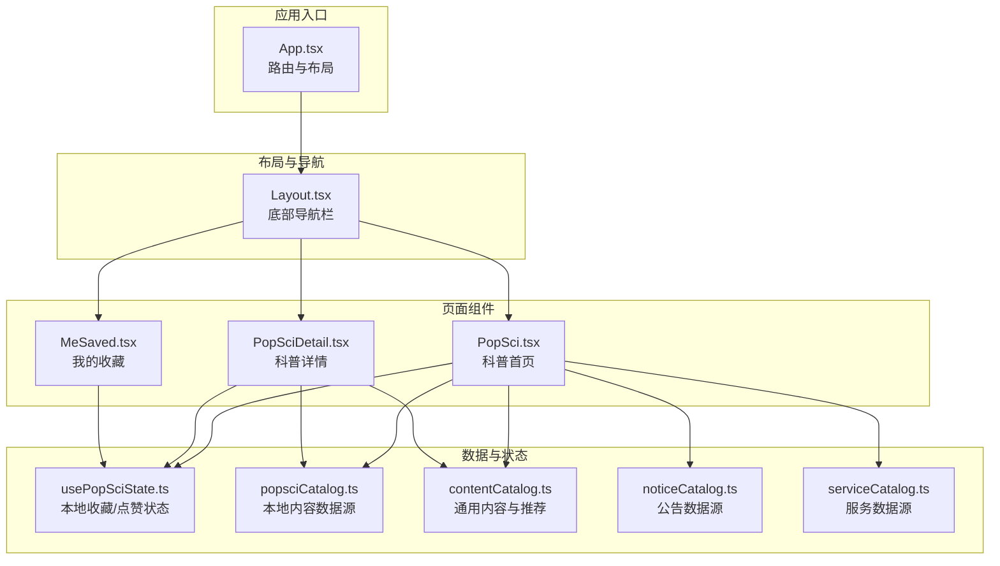
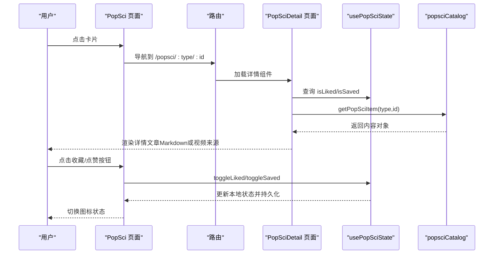
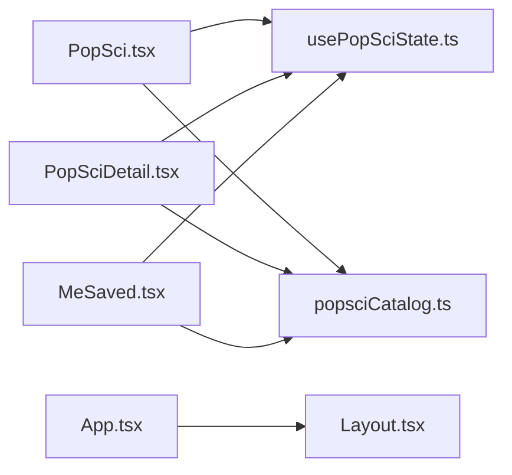

# 科普内容页面接口

<cite>
**本文引用的文件**
- [App.tsx](file://src/App.tsx)
- [Layout.tsx](file://src/components/Layout.tsx)
- [PopSci.tsx](file://src/pages/PopSci.tsx)
- [PopSciDetail.tsx](file://src/pages/PopSciDetail.tsx)
- [MeSaved.tsx](file://src/pages/MeSaved.tsx)
- [usePopSciState.ts](file://src/hooks/usePopSciState.ts)
- [popsciCatalog.ts](file://src/data/popsciCatalog.ts)
- [contentCatalog.ts](file://src/data/contentCatalog.ts)
- [noticeCatalog.ts](file://src/data/noticeCatalog.ts)
- [serviceCatalog.ts](file://src/data/serviceCatalog.ts)
- [2026-04-15-popsci-detail-like-save-design.md](file://docs/superpowers/specs/2026-04-15-popsci-detail-like-save-design.md)
- [2026-04-17-popsci-faq-design.md](file://docs/superpowers/specs/2026-04-17-popsci-faq-design.md)
</cite>

## 目录
1. [引言](#引言)
2. [项目结构](#项目结构)
3. [核心组件](#核心组件)
4. [架构总览](#架构总览)
5. [详细组件分析](#详细组件分析)
6. [依赖关系分析](#依赖关系分析)
7. [性能考量](#性能考量)
8. [故障排查指南](#故障排查指南)
9. [结论](#结论)
10. [附录](#附录)

## 引言
本文件为健康科普页面组件的全面API文档，聚焦PopSci（科普首页）与PopSciDetail（科普详情）两大页面的接口规范与实现细节。文档覆盖以下方面：
- 科普内容的数据模型与类型系统
- 页面Props接口与状态管理机制
- 内容列表展示、详情页面渲染与收藏/点赞功能
- 内容分类、搜索过滤与推荐算法的接口设计
- 内容数据的获取方式、缓存策略与错误处理
- 页面间导航的参数传递、状态同步与性能优化方案
- 实际页面集成示例与开发最佳实践

## 项目结构
本项目采用按页面与功能分层的组织方式，路由集中在应用根组件中统一配置，页面组件位于pages目录，UI布局与工具函数位于components目录，数据模型与本地数据源位于data目录，自定义Hook位于hooks目录。

图表来源
- [App.tsx:29-47](file://src/App.tsx#L29-L47)
- [Layout.tsx:19-65](file://src/components/Layout.tsx#L19-L65)
- [PopSci.tsx:1-270](file://src/pages/PopSci.tsx#L1-L270)
- [PopSciDetail.tsx:1-150](file://src/pages/PopSciDetail.tsx#L1-L150)
- [MeSaved.tsx:1-132](file://src/pages/MeSaved.tsx#L1-L132)
- [usePopSciState.ts:1-80](file://src/hooks/usePopSciState.ts#L1-L80)
- [popsciCatalog.ts:1-98](file://src/data/popsciCatalog.ts#L1-L98)
- [contentCatalog.ts:1-101](file://src/data/contentCatalog.ts#L1-L101)
- [noticeCatalog.ts:1-59](file://src/data/noticeCatalog.ts#L1-L59)
- [serviceCatalog.ts:1-49](file://src/data/serviceCatalog.ts#L1-L49)

章节来源
- [App.tsx:29-47](file://src/App.tsx#L29-L47)
- [Layout.tsx:19-65](file://src/components/Layout.tsx#L19-L65)

## 核心组件
本节概述PopSci与PopSciDetail页面的核心职责、Props接口与状态管理。

- PopSci（科普首页）
  - 职责：展示文章/视频/康复故事三类内容的列表，支持标签切换、收藏/点赞、跳转详情。
  - Props：无（使用路由参数type与本地状态）。
  - 关键行为：根据当前Tab筛选内容；点击卡片跳转至详情路由；收藏/点赞按钮通过状态钩子更新本地存储。
  - 导航参数：无（详情路由通过卡片项的type与id拼接）。

- PopSciDetail（科普详情）
  - 职责：根据路由参数渲染文章或视频详情，支持收藏/点赞、返回导航、Markdown正文渲染（文章）或外链跳转（视频）。
  - Props：type（文章/视频），由路由绑定。
  - 关键行为：根据type与id从本地数据源检索内容；渲染封面、标签、摘要、作者/发布时间；文章使用Markdown渲染正文；视频提供来源链接。
  - 导航参数：/popsci/:type/:id。

- 状态管理（usePopSciState）
  - 职责：封装收藏/点赞的本地状态，基于localStorage持久化，提供查询与切换API。
  - 数据结构：liked/saved为字符串键数组，键格式为"type:id"。
  - API：isLiked(type,id)、isSaved(type,id)、toggleLiked(type,id)、toggleSaved(type,id)，以及统计字段likedCount/savedCount。

- 数据源（popsciCatalog）
  - 职责：提供本地固定内容数据，包含文章与视频两类，支持按类型筛选与按id检索。
  - 接口：listPopSci(type)、getPopSciItem(type,id)。

章节来源
- [PopSci.tsx:26-270](file://src/pages/PopSci.tsx#L26-L270)
- [PopSciDetail.tsx:15-150](file://src/pages/PopSciDetail.tsx#L15-L150)
- [usePopSciState.ts:30-80](file://src/hooks/usePopSciState.ts#L30-L80)
- [popsciCatalog.ts:90-98](file://src/data/popsciCatalog.ts#L90-L98)

## 架构总览
下图展示了PopSci与PopSciDetail之间的数据流与交互关系，以及与状态钩子和数据源的耦合。

图表来源
- [PopSci.tsx:34-36](file://src/pages/PopSci.tsx#L34-L36)
- [PopSciDetail.tsx:18-19](file://src/pages/PopSciDetail.tsx#L18-L19)
- [usePopSciState.ts:50-64](file://src/hooks/usePopSciState.ts#L50-L64)
- [popsciCatalog.ts:90-92](file://src/data/popsciCatalog.ts#L90-L92)

## 详细组件分析

### 数据模型与类型系统
- 类型定义
  - PopSciType：枚举"article"|"video"。
  - PopSciItemBase：所有内容的基础字段（id、type、title、summary、coverUrl、tags、author、publishedAt、views、likes）。
  - PopSciArticle：扩展bodyMarkdown。
  - PopSciVideo：扩展duration与sourceUrl。
  - PopSciItem：联合类型。

- 数据结构复杂度
  - 列表筛选listPopSci：O(n)遍历过滤。
  - 按id检索getPopSciItem：O(n)线性查找。
  - 本地状态键生成与查询：O(1)哈希键，O(k)数组包含判断（k为已收藏/点赞数量）。

- 设计要点
  - 文章与视频字段差异通过联合类型隔离，避免冗余字段污染。
  - 本地数据源便于快速迭代与离线体验，后续可平滑替换为远程接口。

章节来源
- [popsciCatalog.ts:1-27](file://src/data/popsciCatalog.ts#L1-L27)
- [popsciCatalog.ts:29-88](file://src/data/popsciCatalog.ts#L29-L88)

### PopSci（科普首页）API规范
- 路由与导航
  - 路由：/（首页），内部嵌套多个子路由（含科普详情）。
  - 导航：点击卡片跳转至/ popsci/:type/:id，其中type为"article"或"video"。

- Props与状态
  - Props：无。
  - 状态：使用usePopSciState提供的isLiked/isSaved/toggleLiked/toggleSaved。

- 列表渲染逻辑
  - Tab切换：文章/视频/康复故事三类，切换时重新计算items。
  - 文章卡片：标题、摘要、封面、阅读量、点赞数（基于本地状态或初始值）、收藏/点赞按钮。
  - 视频卡片：封面、时长、标题、来源按钮。
  - 康复故事：占位列表（当前版本）。

- 性能与交互
  - 使用useMemo缓存按类型筛选结果，避免重复计算。
  - 使用AnimatePresence与layoutId实现Tab切换动画与布局稳定性。

- 错误处理
  - 当前版本未见显式错误边界，建议在详情页增加内容不存在时的友好提示与回退导航。

章节来源
- [PopSci.tsx:26-270](file://src/pages/PopSci.tsx#L26-L270)
- [App.tsx:31-32](file://src/App.tsx#L31-L32)

### PopSciDetail（科普详情）API规范
- 路由参数
  - 参数：type（"article"|"video"）、id（内容标识符）。
  - 路由：/popsci/article/:id、/popsci/video/:id。

- Props与状态
  - Props：type（由路由绑定）。
  - 状态：使用usePopSciState查询与切换收藏/点赞。

- 渲染逻辑
  - 标题区：返回按钮、标题、类型标签。
  - 内容区：封面图、时长徽标（视频）、标签、摘要、作者/发布时间。
  - 文章：使用react-markdown + remark-gfm渲染bodyMarkdown。
  - 视频：提供"打开视频来源"按钮，外链跳转。

- 错误处理
  - 当getPopSciItem返回空时，显示"未找到该内容"提示与返回按钮。

- 导航与参数传递
  - 详情页返回使用navigate(-1)。
  - 从列表页传参通过路由参数传递，无需额外状态同步。

章节来源
- [PopSciDetail.tsx:15-150](file://src/pages/PopSciDetail.tsx#L15-L150)
- [App.tsx:31-32](file://src/App.tsx#L31-L32)

### 状态管理（usePopSciState）API规范
- 存储策略
  - 本地存储键：popsci_state_v1。
  - 结构：{ liked: string[], saved: string[] }。
  - 键格式："type:id"，如"article:123"。

- API清单
  - isLiked(type, id): 查询是否已点赞。
  - isSaved(type, id): 查询是否已收藏。
  - toggleLiked(type, id): 切换点赞状态。
  - toggleSaved(type, id): 切换收藏状态。
  - 统计字段：likedCount、savedCount。

- 并发与一致性
  - 通过useState与useEffect保证状态变更后持久化。
  - 事件冒泡控制：收藏/点赞按钮点击时阻止冒泡，避免误触卡片跳转。

- 错误处理
  - 解析localStorage失败时回退为空状态，确保健壮性。

章节来源
- [usePopSciState.ts:30-80](file://src/hooks/usePopSciState.ts#L30-L80)

### 数据获取与缓存策略
- 数据源
  - 本地数据：popsciCatalog提供固定内容集合。
  - 通用推荐：contentCatalog提供关键词匹配与默认推荐策略。

- 缓存策略
  - 列表筛选：listPopSci(type)在组件内使用useMemo缓存结果。
  - 详情检索：getPopSciItem(type,id)在组件内使用useMemo缓存结果。
  - 本地状态：localStorage持久化，应用启动时初始化，变更时自动写入。

- 性能优化
  - 使用useMemo避免重复计算。
  - 使用AnimatePresence与layoutId减少重排抖动。
  - 图片懒加载与尺寸固定（封面图宽高已设定）。

章节来源
- [popsciCatalog.ts:94-96](file://src/data/popsciCatalog.ts#L94-L96)
- [contentCatalog.ts:69-99](file://src/data/contentCatalog.ts#L69-L99)
- [usePopSciState.ts:31-38](file://src/hooks/usePopSciState.ts#L31-L38)

### 内容分类、搜索过滤与推荐算法
- 内容分类
  - popsciCatalog：按type区分文章与视频。
  - 标签：每个内容包含tags数组，用于详情页展示与后续筛选。

- 搜索过滤
  - PopSci首页当前未实现全文搜索过滤，但数据源具备tags与keywords字段，可扩展为按标签/关键词过滤。

- 推荐算法
  - contentCatalog提供getRecommendations(input, limit)：基于输入关键词与内容关键字的匹配计分，优先返回匹配度高的内容，不足时用默认推荐集补齐。

- 设计文档参考
  - 百问FAQ设计文档描述了按分类过滤与手风琴展开的交互模式，可作为未来扩展的参考。

章节来源
- [popsciCatalog.ts:3-27](file://src/data/popsciCatalog.ts#L3-L27)
- [contentCatalog.ts:69-99](file://src/data/contentCatalog.ts#L69-L99)
- [2026-04-17-popsci-faq-design.md:17-28](file://docs/superpowers/specs/2026-04-17-popsci-faq-design.md#L17-L28)

### 页面间导航与状态同步
- 导航参数传递
  - PopSci -> PopSciDetail：通过路由参数type与id传递。
  - PopSci -> 我的收藏：直接跳转/me/saved。
  - PopSciDetail -> PopSci：使用navigate(-1)返回。

- 状态同步
  - 收藏/点赞状态通过localStorage同步，跨页面与跨会话保持一致。
  - 列表页与详情页共享同一状态钩子实例，状态即时生效。

- 性能优化
  - 使用useMemo缓存数据与计算结果。
  - 使用AnimatePresence与layoutId优化动画与布局稳定性。

章节来源
- [PopSci.tsx:34-36](file://src/pages/PopSci.tsx#L34-L36)
- [PopSciDetail.tsx:31-32](file://src/pages/PopSciDetail.tsx#L31-L32)
- [MeSaved.tsx:73-78](file://src/pages/MeSaved.tsx#L73-L78)

### 开发最佳实践
- 数据模型
  - 使用联合类型隔离文章与视频差异字段，避免冗余字段。
  - 为每个内容提供稳定的id与type，便于路由与状态管理。

- 状态管理
  - 将本地状态集中于usePopSciState，避免分散在多个组件中。
  - 对localStorage读写进行容错处理，防止解析失败导致崩溃。

- 性能
  - 对昂贵计算使用useMemo缓存。
  - 对列表渲染使用虚拟化或分页（未来可扩展）。

- 可访问性
  - 为按钮添加aria-label与键盘事件支持（Enter/Space）。
  - 为图片提供alt文本，提升可访问性。

- 错误处理
  - 详情页对不存在的内容提供友好提示与回退导航。
  - 对网络/数据异常预留扩展点（当前为本地数据源）。

章节来源
- [usePopSciState.ts:13-24](file://src/hooks/usePopSciState.ts#L13-L24)
- [PopSciDetail.tsx:77-86](file://src/pages/PopSciDetail.tsx#L77-L86)

## 依赖关系分析
- 组件依赖
  - PopSci依赖usePopSciState与popsciCatalog。
  - PopSciDetail依赖usePopSciState与popsciCatalog。
  - MeSaved依赖usePopSciState与popsciCatalog。
  - App与Layout负责路由与全局导航。

- 外部依赖
  - react-router-dom：路由与导航。
  - framer-motion：动画与过渡。
  - lucide-react：图标。
  - react-markdown + remark-gfm：文章Markdown渲染。

图表来源
- [PopSci.tsx:6-7](file://src/pages/PopSci.tsx#L6-L7)
- [PopSciDetail.tsx:6-8](file://src/pages/PopSciDetail.tsx#L6-L8)
- [MeSaved.tsx:4-5](file://src/pages/MeSaved.tsx#L4-L5)
- [App.tsx:5-17](file://src/App.tsx#L5-L17)

章节来源
- [App.tsx:5-17](file://src/App.tsx#L5-L17)
- [Layout.tsx:19-65](file://src/components/Layout.tsx#L19-L65)

## 性能考量
- 计算优化
  - 列表筛选与详情检索使用useMemo缓存，避免重复计算。
  - 动画使用AnimatePresence与layoutId，减少布局抖动。

- 存储优化
  - localStorage仅保存必要的键数组，体积小、读写快。
  - 初始化时进行安全解析，失败回退为空状态。

- 渲染优化
  - 图片尺寸固定，避免重排。
  - 列表项使用key稳定标识，提升重渲染效率。

- 可扩展性
  - 当前为本地数据源，后续可替换为远程接口，保持现有API不变。
  - 推荐算法可扩展为远程服务调用。

## 故障排查指南
- 详情页空白或“未找到该内容”
  - 检查路由参数type与id是否正确传递。
  - 检查popsciCatalog中是否存在对应id与type的内容。
  - 查看getPopSciItem返回值，确认数据源完整性。

- 收藏/点赞状态不生效
  - 检查localStorage键popsci_state_v1是否存在且可读写。
  - 确认toggleLiked/toggleSaved调用路径，避免事件冒泡导致误触发。
  - 查看usePopSciState初始化逻辑，确认安全解析是否成功。

- 列表渲染异常
  - 检查listPopSci筛选条件与useMemo缓存是否正确。
  - 确认Tab切换逻辑与key属性，避免重复渲染。

- 动画或布局抖动
  - 检查AnimatePresence与layoutId使用是否正确。
  - 确认图片尺寸与容器约束，避免动态高度变化。

章节来源
- [PopSciDetail.tsx:77-86](file://src/pages/PopSciDetail.tsx#L77-L86)
- [usePopSciState.ts:13-24](file://src/hooks/usePopSciState.ts#L13-L24)
- [popsciCatalog.ts:90-92](file://src/data/popsciCatalog.ts#L90-L92)

## 结论
本项目通过清晰的数据模型、简洁的状态管理与本地数据源，实现了PopSci与PopSciDetail页面的高效渲染与交互。收藏/点赞功能基于localStorage实现本地闭环，配合路由参数传递与动画优化，提供了良好的用户体验。未来可在保持现有API兼容的前提下，逐步引入远程数据源、搜索过滤与推荐算法，进一步增强功能与性能。

## 附录
- 路由与页面映射
  - /：PopSci（科普首页）
  - /popsci/article/:id：PopSciDetail（文章详情）
  - /popsci/video/:id：PopSciDetail（视频详情）
  - /me/saved：MeSaved（我的收藏）

- 相关设计文档
  - 科普详情页收藏/点赞设计文档
  - 百问FAQ设计文档

章节来源
- [App.tsx:31-32](file://src/App.tsx#L31-L32)
- [2026-04-15-popsci-detail-like-save-design.md:24-26](file://docs/superpowers/specs/2026-04-15-popsci-detail-like-save-design.md#L24-L26)
- [2026-04-17-popsci-faq-design.md:18-19](file://docs/superpowers/specs/2026-04-17-popsci-faq-design.md#L18-L19)