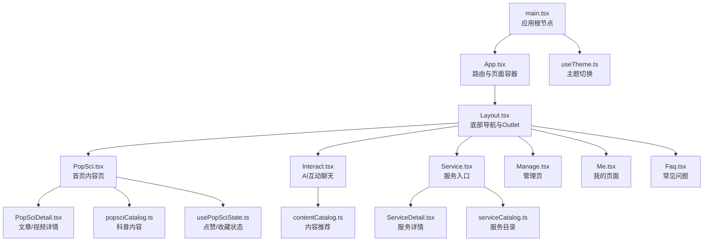
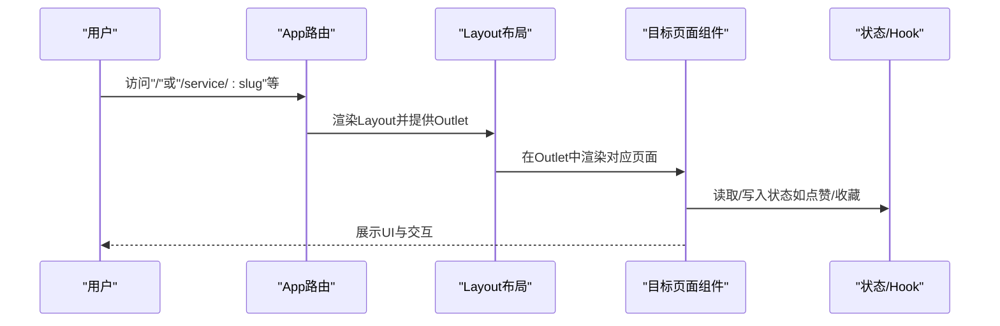
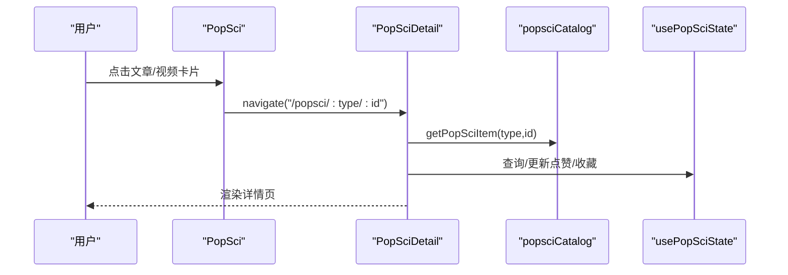
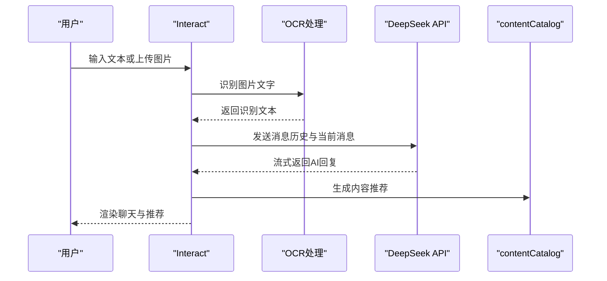
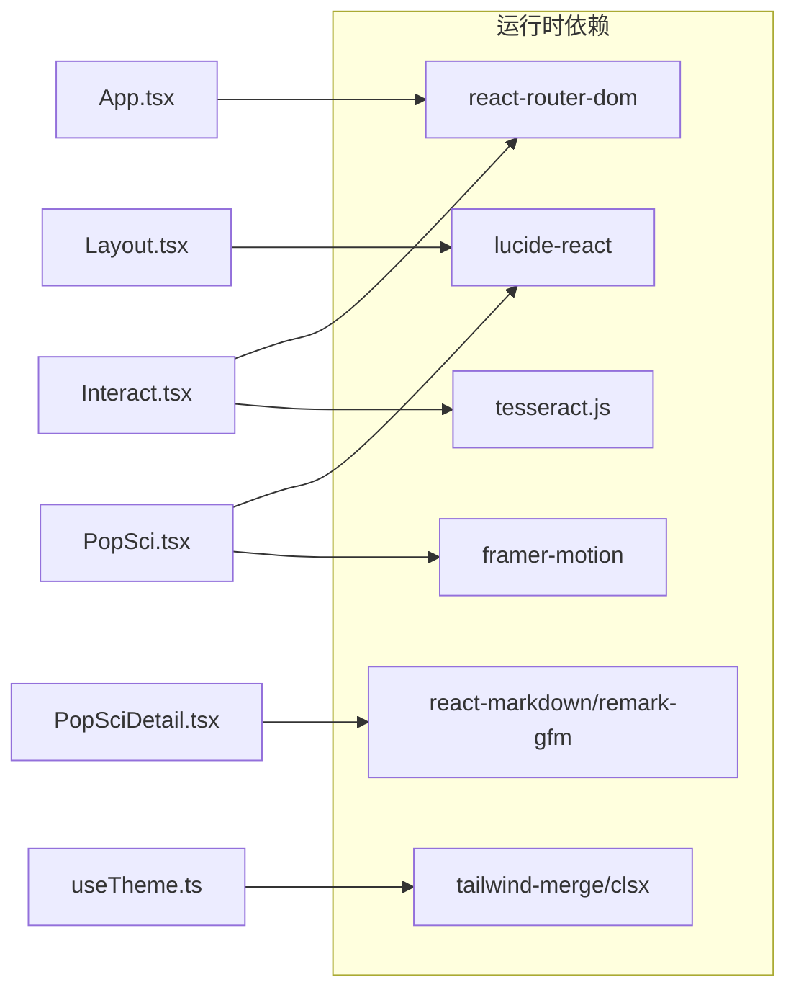

# 页面组件接口

<cite>
**本文引用的文件**
- [src/App.tsx](file://src/App.tsx)
- [src/main.tsx](file://src/main.tsx)
- [src/components/Layout.tsx](file://src/components/Layout.tsx)
- [src/pages/Home.tsx](file://src/pages/Home.tsx)
- [src/pages/PopSci.tsx](file://src/pages/PopSci.tsx)
- [src/pages/PopSciDetail.tsx](file://src/pages/PopSciDetail.tsx)
- [src/pages/Interact.tsx](file://src/pages/Interact.tsx)
- [src/pages/Service.tsx](file://src/pages/Service.tsx)
- [src/pages/ServiceDetail.tsx](file://src/pages/ServiceDetail.tsx)
- [src/pages/Manage.tsx](file://src/pages/Manage.tsx)
- [src/pages/Me.tsx](file://src/pages/Me.tsx)
- [src/pages/Faq.tsx](file://src/pages/Faq.tsx)
- [src/hooks/usePopSciState.ts](file://src/hooks/usePopSciState.ts)
- [src/hooks/useTheme.ts](file://src/hooks/useTheme.ts)
- [src/data/popsciCatalog.ts](file://src/data/popsciCatalog.ts)
- [src/data/contentCatalog.ts](file://src/data/contentCatalog.ts)
- [src/data/serviceCatalog.ts](file://src/data/serviceCatalog.ts)
- [package.json](file://package.json)
- [vite.config.ts](file://vite.config.ts)
</cite>

## 目录
1. [简介](#简介)
2. [项目结构](#项目结构)
3. [核心组件](#核心组件)
4. [架构总览](#架构总览)
5. [详细组件分析](#详细组件分析)
6. [依赖分析](#依赖分析)
7. [性能考虑](#性能考虑)
8. [故障排查指南](#故障排查指南)
9. [结论](#结论)
10. [附录](#附录)

## 简介
本文件为应用页面组件的全面API参考文档，覆盖Home、PopSci、Interact、Service、Me等页面组件的路由配置、Props接口、状态管理、生命周期钩子、导航机制、参数传递与状态同步、懒加载策略、性能优化、SEO配置、国际化支持、主题切换与响应式布局，并提供页面间集成示例与开发最佳实践。

## 项目结构
应用采用基于路由的页面组织方式，主入口负责全局路由与布局包装；页面组件位于src/pages目录，公共布局与工具位于src/components与src/hooks，数据模型位于src/data。

图表来源
- [src/main.tsx:1-11](file://src/main.tsx#L1-L11)
- [src/App.tsx:19-51](file://src/App.tsx#L19-L51)
- [src/components/Layout.tsx:19-65](file://src/components/Layout.tsx#L19-L65)
- [src/pages/PopSci.tsx:26-269](file://src/pages/PopSci.tsx#L26-L269)
- [src/pages/Interact.tsx:37-461](file://src/pages/Interact.tsx#L37-L461)
- [src/pages/Service.tsx:6-132](file://src/pages/Service.tsx#L6-L132)
- [src/pages/Manage.tsx:7-166](file://src/pages/Manage.tsx#L7-L166)
- [src/pages/Me.tsx:4-64](file://src/pages/Me.tsx#L4-L64)
- [src/pages/Faq.tsx:7-100](file://src/pages/Faq.tsx#L7-L100)
- [src/pages/PopSciDetail.tsx:15-148](file://src/pages/PopSciDetail.tsx#L15-L148)
- [src/pages/ServiceDetail.tsx:6-73](file://src/pages/ServiceDetail.tsx#L6-L73)
- [src/data/contentCatalog.ts:1-101](file://src/data/contentCatalog.ts#L1-L101)
- [src/data/popsciCatalog.ts:1-98](file://src/data/popsciCatalog.ts#L1-L98)
- [src/data/serviceCatalog.ts:1-49](file://src/data/serviceCatalog.ts#L1-L49)
- [src/hooks/usePopSciState.ts:30-79](file://src/hooks/usePopSciState.ts#L30-L79)
- [src/hooks/useTheme.ts:5-29](file://src/hooks/useTheme.ts#L5-L29)

章节来源
- [src/App.tsx:19-51](file://src/App.tsx#L19-L51)
- [src/main.tsx:1-11](file://src/main.tsx#L1-L11)

## 核心组件
- 应用入口与渲染
  - main.tsx：挂载StrictMode与App根组件，引入全局样式。
  - App.tsx：BrowserRouter包裹，定义所有页面路由与嵌套路由，包含Splash启动屏与Layout布局容器。
- 布局与导航
  - Layout.tsx：提供Outlet内容区与底部导航栏，根据当前路径高亮对应导航项。
- 页面组件
  - Home、PopSci、Interact、Service、Manage、Me、Faq等均为独立页面组件，部分页面存在子路由（如PopSciDetail、ServiceDetail）。
- 状态与Hook
  - usePopSciState.ts：持久化存储“点赞/收藏”状态，提供查询与切换能力。
  - useTheme.ts：主题状态管理与DOM类名切换。
- 数据模型
  - popsciCatalog.ts：定义PopSci内容类型与数据结构，提供查询与列表方法。
  - contentCatalog.ts：定义内容类型与推荐算法。
  - serviceCatalog.ts：定义服务项与查询方法。

章节来源
- [src/main.tsx:1-11](file://src/main.tsx#L1-L11)
- [src/App.tsx:19-51](file://src/App.tsx#L19-L51)
- [src/components/Layout.tsx:19-65](file://src/components/Layout.tsx#L19-L65)
- [src/hooks/usePopSciState.ts:30-79](file://src/hooks/usePopSciState.ts#L30-L79)
- [src/hooks/useTheme.ts:5-29](file://src/hooks/useTheme.ts#L5-L29)
- [src/data/popsciCatalog.ts:1-98](file://src/data/popsciCatalog.ts#L1-L98)
- [src/data/contentCatalog.ts:1-101](file://src/data/contentCatalog.ts#L1-L101)
- [src/data/serviceCatalog.ts:1-49](file://src/data/serviceCatalog.ts#L1-L49)

## 架构总览
应用采用“路由驱动”的单页应用架构，通过React Router v6的Routes/Route与嵌套路由实现页面级导航；Layout作为页面容器，统一承载底部导航与内容区；页面组件通过useNavigate、useParams、useMemo等钩子实现参数传递与状态同步；状态持久化通过localStorage与自定义Hook实现；主题切换通过useTheme Hook与DOM类名切换实现。

图表来源
- [src/App.tsx:28-47](file://src/App.tsx#L28-L47)
- [src/components/Layout.tsx:24-27](file://src/components/Layout.tsx#L24-L27)
- [src/pages/PopSci.tsx:26-269](file://src/pages/PopSci.tsx#L26-L269)
- [src/pages/Service.tsx:6-132](file://src/pages/Service.tsx#L6-L132)
- [src/hooks/usePopSciState.ts:30-79](file://src/hooks/usePopSciState.ts#L30-L79)

## 详细组件分析

### 路由与导航
- 根路由与嵌套路由
  - App.tsx定义根路由与嵌套路由，包含首页、科普详情、互动、服务、服务详情、我的、FAQ、公告详情、内容详情、广告页等。
  - 嵌套路由以Layout为父容器，子路由在Outlet中渲染。
- 底部导航
  - Layout.tsx提供导航项数组，根据当前路径高亮对应导航，支持前缀匹配（如/me/history）。
- 导航触发
  - 页面内通过useNavigate进行编程式导航，如PopSci跳转至PopSciDetail、Service跳转至ServiceDetail、Me跳转至各子菜单等。

章节来源
- [src/App.tsx:28-47](file://src/App.tsx#L28-L47)
- [src/components/Layout.tsx:10-17](file://src/components/Layout.tsx#L10-L17)
- [src/components/Layout.tsx:30-62](file://src/components/Layout.tsx#L30-L62)

### Home 页面组件
- 组件职责
  - 当前为空白占位，可作为未来首页入口或重定向目标。
- Props
  - 无显式Props接口。
- 生命周期
  - 无特殊生命周期钩子。
- 使用示例
  - 可通过路由"/"访问，或在导航中指向该路径。

章节来源
- [src/pages/Home.tsx:1-3](file://src/pages/Home.tsx#L1-L3)

### PopSci 页面组件
- 组件职责
  - 展示科普文章与视频列表，支持标签切换、点赞/收藏、跳转详情。
- Props
  - 无显式Props接口（内部通过useMemo与useNavigate消费外部上下文）。
- 状态管理
  - 使用usePopSciState Hook管理点赞/收藏状态，持久化于localStorage。
- 路由参数
  - 详情页路由形如"/popsci/article/:id"或"/popsci/video/:id"，PopSciDetail接收type参数。
- 导航机制
  - 点击卡片调用navigate跳转至PopSciDetail，携带type与id。
- 性能优化
  - 使用useMemo缓存列表数据，避免重复过滤；使用AnimatePresence与motion实现过渡动画。
- 国际化与主题
  - 文案为中文；主题切换通过全局类名实现。
- SEO
  - 页面标题与描述可在后续通过head管理库注入（当前未见实现）。

图表来源
- [src/pages/PopSci.tsx:34-36](file://src/pages/PopSci.tsx#L34-L36)
- [src/pages/PopSciDetail.tsx:15-19](file://src/pages/PopSciDetail.tsx#L15-L19)
- [src/data/popsciCatalog.ts:90-96](file://src/data/popsciCatalog.ts#L90-L96)
- [src/hooks/usePopSciState.ts:40-48](file://src/hooks/usePopSciState.ts#L40-L48)

章节来源
- [src/pages/PopSci.tsx:26-269](file://src/pages/PopSci.tsx#L26-L269)
- [src/pages/PopSciDetail.tsx:15-148](file://src/pages/PopSciDetail.tsx#L15-L148)
- [src/data/popsciCatalog.ts:1-98](file://src/data/popsciCatalog.ts#L1-L98)
- [src/hooks/usePopSciState.ts:30-79](file://src/hooks/usePopSciState.ts#L30-L79)

### Interact 页面组件
- 组件职责
  - 提供AI健康助手聊天界面，支持文本与图片OCR输入，流式输出，内容推荐。
- Props
  - 无显式Props接口。
- 状态管理
  - 本地状态messages、input、isTyping、isOcrProcessing；聊天历史持久化至localStorage。
- 路由参数
  - 无路由参数；通过navigate跳转至content详情。
- 导航机制
  - AI回复中的推荐内容点击后跳转至"/content/:id"。
- 性能优化
  - 使用Tesseract.js进行OCR处理，流式渲染AI响应；对图片URL进行及时释放。
- 权限与安全
  - 通过环境变量VITE_DEEPSEEK_API_KEY控制AI功能开关；未配置时提供降级提示与默认推荐。
- 国际化与主题
  - 文案为中文；主题切换通过全局类名实现。

图表来源
- [src/pages/Interact.tsx:86-142](file://src/pages/Interact.tsx#L86-L142)
- [src/pages/Interact.tsx:144-248](file://src/pages/Interact.tsx#L144-L248)
- [src/data/contentCatalog.ts:69-99](file://src/data/contentCatalog.ts#L69-L99)

章节来源
- [src/pages/Interact.tsx:37-461](file://src/pages/Interact.tsx#L37-L461)
- [src/data/contentCatalog.ts:1-101](file://src/data/contentCatalog.ts#L1-L101)

### Service 页面组件
- 组件职责
  - 展示服务入口与快捷跳转，包含营养师专属服务与精选服务网格。
- Props
  - 无显式Props接口。
- 状态管理
  - 无页面级状态。
- 路由参数
  - 通过slug参数跳转至ServiceDetail。
- 导航机制
  - 点击服务卡片navigate至"/service/:slug"。
- 性能优化
  - 使用useMemo缓存快速链接列表。
- 国际化与主题
  - 文案为中文；主题切换通过全局类名实现。

章节来源
- [src/pages/Service.tsx:6-132](file://src/pages/Service.tsx#L6-L132)
- [src/pages/ServiceDetail.tsx:6-73](file://src/pages/ServiceDetail.tsx#L6-L73)
- [src/data/serviceCatalog.ts:1-49](file://src/data/serviceCatalog.ts#L1-L49)

### Manage 页面组件
- 组件职责
  - 展示用户画像、健康积分、每日打卡、健康提醒与最新资讯。
- Props
  - 无显式Props接口。
- 状态管理
  - 本地状态checkedIn、checkinTip；通过useMemo缓存提醒与新闻列表。
- 路由参数
  - 无路由参数；点击跳转至"/notice/:id"。
- 导航机制
  - 点击提醒与新闻项跳转至公告详情页。
- 性能优化
  - 使用Framer Motion实现进度环动画与卡片展开收起。
- 国际化与主题
  - 文案为中文；主题切换通过全局类名实现。

章节来源
- [src/pages/Manage.tsx:7-166](file://src/pages/Manage.tsx#L7-L166)

### Me 页面组件
- 组件职责
  - 展示用户头像与等级、菜单入口（我的收藏、浏览历史、个人设置、帮助与反馈、关于我们）。
- Props
  - 无显式Props接口。
- 状态管理
  - 无页面级状态。
- 路由参数
  - 无路由参数；点击跳转至各子菜单路径。
- 导航机制
  - 点击菜单项navigate至"/me/saved"、"/me/history"、"/me/settings"、"/me/help"、"/me/about"。
- 性能优化
  - 无特殊优化。
- 国际化与主题
  - 文案为中文；主题切换通过全局类名实现。

章节来源
- [src/pages/Me.tsx:4-64](file://src/pages/Me.tsx#L4-L64)

### Faq 页面组件
- 组件职责
  - 展示常见问题，支持分类筛选与折叠展开。
- Props
  - 无显式Props接口。
- 状态管理
  - 本地状态faqCategory、expandedFaqId。
- 路由参数
  - 无路由参数。
- 导航机制
  - 无页面内导航。
- 性能优化
  - 使用AnimatePresence与motion实现展开/收起动画。
- 国际化与主题
  - 文案为中文；主题切换通过全局类名实现。

章节来源
- [src/pages/Faq.tsx:7-100](file://src/pages/Faq.tsx#L7-L100)

### PopSciDetail 页面组件
- 组件职责
  - 展示文章或视频详情，支持收藏/点赞、返回上级、打开外部视频源。
- Props
  - 接收type参数（"article"或"video"）。
- 状态管理
  - 使用usePopSciState查询/更新点赞/收藏状态。
- 路由参数
  - 通过useParams读取id；type来自Props。
- 导航机制
  - 点击返回按钮navigate(-1)；点击收藏/点赞更新状态。
- 性能优化
  - 使用useMemo缓存详情项；根据类型渲染不同内容区域。
- 国际化与主题
  - 文案为中文；主题切换通过全局类名实现。

章节来源
- [src/pages/PopSciDetail.tsx:15-148](file://src/pages/PopSciDetail.tsx#L15-L148)
- [src/hooks/usePopSciState.ts:30-79](file://src/hooks/usePopSciState.ts#L30-L79)
- [src/data/popsciCatalog.ts:1-98](file://src/data/popsciCatalog.ts#L1-L98)

### ServiceDetail 页面组件
- 组件职责
  - 展示服务详情与CTA按钮。
- Props
  - 无显式Props接口。
- 状态管理
  - 无页面级状态。
- 路由参数
  - 通过useParams读取slug；通过serviceCatalog查询服务项。
- 导航机制
  - 点击返回按钮navigate(-1)；点击CTA按钮navigate至ctaUrl。
- 性能优化
  - 使用useMemo缓存服务项。
- 国际化与主题
  - 文案为中文；主题切换通过全局类名实现。

章节来源
- [src/pages/ServiceDetail.tsx:6-73](file://src/pages/ServiceDetail.tsx#L6-L73)
- [src/data/serviceCatalog.ts:1-49](file://src/data/serviceCatalog.ts#L1-L49)

### 状态与Hook
- usePopSciState
  - 提供isLiked/isSaved/toggleLiked/toggleSaved与计数器；状态持久化于localStorage。
- useTheme
  - 提供theme/toggleTheme与isDark；切换时更新documentElement类名并持久化。

章节来源
- [src/hooks/usePopSciState.ts:30-79](file://src/hooks/usePopSciState.ts#L30-L79)
- [src/hooks/useTheme.ts:5-29](file://src/hooks/useTheme.ts#L5-L29)

## 依赖分析
- 路由与导航
  - react-router-dom：提供BrowserRouter、Routes、Route、Outlet、useNavigate、useParams、useLocation。
- 动画与交互
  - framer-motion：提供AnimatePresence、motion组件与过渡动画。
- 图标与排版
  - lucide-react：提供图标组件；react-markdown与remark-gfm：渲染Markdown。
- OCR与AI
  - tesseract.js：图片OCR识别；fetch流式响应处理。
- 主题与样式
  - tailwind-merge与clsx：类名合并；useTheme通过DOM类名切换主题。
- 构建与插件
  - vite与@vitejs/plugin-react：开发与构建；vite-tsconfig-paths：路径别名解析。

图表来源
- [package.json:13-26](file://package.json#L13-L26)
- [src/App.tsx:2-3](file://src/App.tsx#L2-L3)
- [src/pages/PopSci.tsx:2-7](file://src/pages/PopSci.tsx#L2-L7)
- [src/pages/PopSciDetail.tsx:3-5](file://src/pages/PopSciDetail.tsx#L3-L5)
- [src/pages/Interact.tsx:2-6](file://src/pages/Interact.tsx#L2-L6)
- [src/components/Layout.tsx:1-3](file://src/components/Layout.tsx#L1-L3)
- [src/hooks/useTheme.ts:1-2](file://src/hooks/useTheme.ts#L1-L2)

章节来源
- [package.json:13-26](file://package.json#L13-L26)

## 性能考虑
- 路由与渲染
  - 使用useMemo缓存列表与计算结果，减少不必要的重渲染。
  - 使用AnimatePresence与motion实现平滑过渡，避免频繁DOM重排。
- 状态持久化
  - usePopSciState与localStorage结合，减少刷新丢失状态。
  - Interact聊天历史仅保存必要字段，避免存储膨胀。
- 资源管理
  - OCR完成后及时释放图片URL对象，防止内存泄漏。
- 构建优化
  - Vite配置启用隐藏sourcemap，提升生产构建安全性与体积控制。

章节来源
- [src/pages/PopSci.tsx:32-32](file://src/pages/PopSci.tsx#L32-L32)
- [src/pages/Interact.tsx:70-84](file://src/pages/Interact.tsx#L70-L84)
- [src/pages/Interact.tsx:136-141](file://src/pages/Interact.tsx#L136-L141)
- [vite.config.ts:8-10](file://vite.config.ts#L8-L10)

## 故障排查指南
- 路由跳转无效
  - 检查App.tsx中路由路径与Layout嵌套关系；确认目标页面组件已导入。
- 参数缺失
  - PopSciDetail与ServiceDetail需确保路由参数存在；若不存在则显示“内容不存在/服务不存在”。
- AI功能不可用
  - 确认VITE_DEEPSEEK_API_KEY环境变量已配置；未配置时将返回降级提示与默认推荐。
- 主题切换不生效
  - 检查useTheme是否正确更新documentElement类名；确认CSS中针对.light/.dark的样式规则。
- OCR失败
  - 检查图片格式与清晰度；确认Tesseract.js worker初始化与terminate调用；查看控制台错误日志。

章节来源
- [src/App.tsx:28-47](file://src/App.tsx#L28-L47)
- [src/pages/PopSciDetail.tsx:77-86](file://src/pages/PopSciDetail.tsx#L77-L86)
- [src/pages/ServiceDetail.tsx:33-44](file://src/pages/ServiceDetail.tsx#L33-L44)
- [src/pages/Interact.tsx:152-166](file://src/pages/Interact.tsx#L152-L166)
- [src/hooks/useTheme.ts:14-18](file://src/hooks/useTheme.ts#L14-L18)
- [src/pages/Interact.tsx:128-141](file://src/pages/Interact.tsx#L128-L141)

## 结论
本项目采用清晰的路由与页面组织方式，结合自定义Hook实现状态持久化与主题切换，页面组件职责明确、可扩展性强。建议在后续迭代中完善SEO元信息注入、路由守卫与权限控制、国际化文案与主题切换的深层集成，并进一步优化首屏渲染与资源加载策略。

## 附录

### 路由表与页面映射
- 根路由与嵌套路由
  - "/" -> Layout -> PopSci
  - "/popsci/article/:id" -> PopSciDetail(type="article")
  - "/popsci/video/:id" -> PopSciDetail(type="video")
  - "/interact" -> Interact
  - "/manage" -> Manage
  - "/service" -> Service
  - "/service/:slug" -> ServiceDetail
  - "/me" -> Me
  - "/faq" -> Faq
  - "/me/saved" -> MeSaved
  - "/me/history" -> MePlaceholder
  - "/me/settings" -> MePlaceholder
  - "/me/help" -> MePlaceholder
  - "/me/about" -> MePlaceholder
  - "/notice/:id" -> NoticeDetail
  - "/content/:id" -> ContentDetail
  - "/ad/dietitian" -> AdDietitian

章节来源
- [src/App.tsx:28-47](file://src/App.tsx#L28-L47)

### 页面Props与状态摘要
- PopSci
  - Props：无；状态：activeTab、usePopSciState。
- PopSciDetail
  - Props：{ type: PopSciType }；状态：item查询、点赞/收藏。
- Interact
  - Props：无；状态：messages、input、isTyping、isOcrProcessing。
- Service
  - Props：无；状态：无。
- ServiceDetail
  - Props：无；状态：item查询。
- Manage
  - Props：无；状态：checkedIn、checkinTip。
- Me
  - Props：无；状态：无。
- Faq
  - Props：无；状态：faqCategory、expandedFaqId。

章节来源
- [src/pages/PopSci.tsx:26-269](file://src/pages/PopSci.tsx#L26-L269)
- [src/pages/PopSciDetail.tsx:15-148](file://src/pages/PopSciDetail.tsx#L15-L148)
- [src/pages/Interact.tsx:37-461](file://src/pages/Interact.tsx#L37-L461)
- [src/pages/Service.tsx:6-132](file://src/pages/Service.tsx#L6-L132)
- [src/pages/ServiceDetail.tsx:6-73](file://src/pages/ServiceDetail.tsx#L6-L73)
- [src/pages/Manage.tsx:7-166](file://src/pages/Manage.tsx#L7-L166)
- [src/pages/Me.tsx:4-64](file://src/pages/Me.tsx#L4-L64)
- [src/pages/Faq.tsx:7-100](file://src/pages/Faq.tsx#L7-L100)

### 开发最佳实践
- 路由设计
  - 保持路由层级扁平，避免过深嵌套；为详情页提供明确的参数命名与类型约束。
- 状态管理
  - 将跨页面共享的状态抽象为自定义Hook；对大体量状态进行分片存储与惰性加载。
- 性能优化
  - 对昂贵计算使用useMemo/useCallback；对长列表使用虚拟滚动或分页；对图片与媒体资源进行懒加载与尺寸裁剪。
- 可访问性
  - 为交互元素提供aria-label与键盘可达性；为图片提供替代文本。
- 国际化与主题
  - 将文案集中管理；为主题切换提供系统偏好回退与持久化。
- 安全与合规
  - 对外部API调用进行错误兜底与超时控制；对敏感信息（如API Key）通过环境变量注入并在前端做最小暴露。