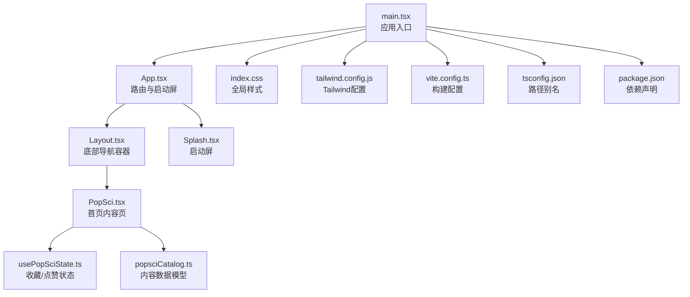
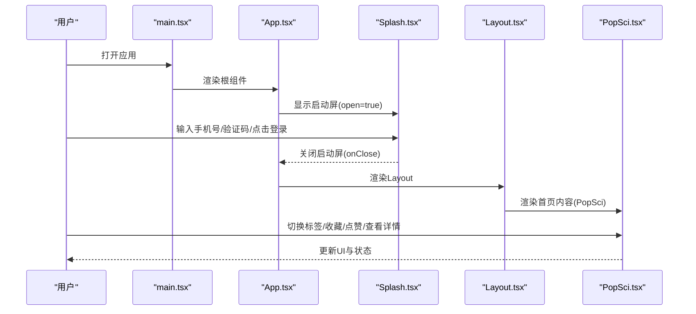
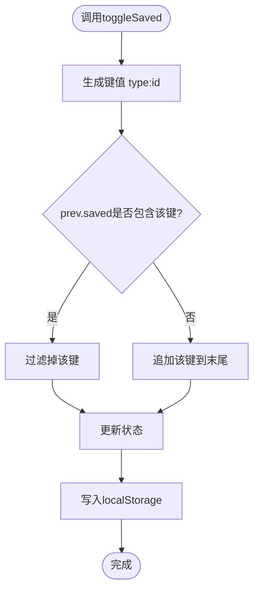
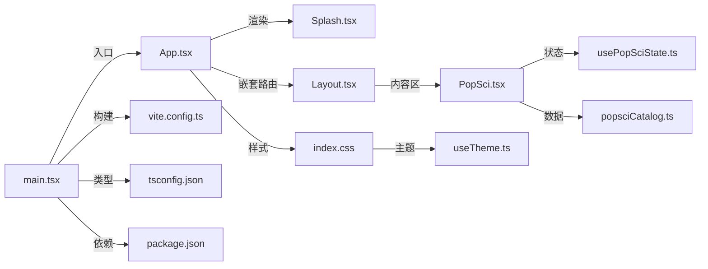

# 首页组件接口

<cite>
**本文引用的文件**
- [Home.tsx](file://src/pages/Home.tsx)
- [App.tsx](file://src/App.tsx)
- [Layout.tsx](file://src/components/Layout.tsx)
- [Splash.tsx](file://src/components/Splash.tsx)
- [PopSci.tsx](file://src/pages/PopSci.tsx)
- [usePopSciState.ts](file://src/hooks/usePopSciState.ts)
- [useTheme.ts](file://src/hooks/useTheme.ts)
- [popsciCatalog.ts](file://src/data/popsciCatalog.ts)
- [index.css](file://src/index.css)
- [tailwind.config.js](file://tailwind.config.js)
- [vite.config.ts](file://vite.config.ts)
- [tsconfig.json](file://tsconfig.json)
- [package.json](file://package.json)
</cite>

## 目录
1. [简介](#简介)
2. [项目结构](#项目结构)
3. [核心组件](#核心组件)
4. [架构总览](#架构总览)
5. [详细组件分析](#详细组件分析)
6. [依赖关系分析](#依赖关系分析)
7. [性能考量](#性能考量)
8. [故障排查指南](#故障排查指南)
9. [结论](#结论)
10. [附录](#附录)

## 简介
本文件面向首页组件的API文档与实现解析，聚焦于Home页面组件的接口规范、状态管理机制与生命周期行为；阐述首页作为应用入口页面的设计模式，包括内容展示、导航集成与用户体验优化；提供首页组件的使用示例、路由配置与状态同步机制；文档化首页的响应式布局、主题适配与性能优化策略，并给出实际集成示例与开发最佳实践。

## 项目结构
该工程采用基于功能模块的组织方式，页面按业务域划分，公共组件与工具函数分别位于独立目录中。首页组件当前为空白占位，实际内容由路由嵌套在Layout中的子页面承载。

图表来源
- [main.tsx:1-11](file://src/main.tsx#L1-L11)
- [App.tsx:1-52](file://src/App.tsx#L1-L52)
- [Layout.tsx:1-66](file://src/components/Layout.tsx#L1-L66)
- [PopSci.tsx:1-270](file://src/pages/PopSci.tsx#L1-L270)
- [Splash.tsx:1-171](file://src/components/Splash.tsx#L1-L171)
- [usePopSciState.ts:1-80](file://src/hooks/usePopSciState.ts#L1-L80)
- [popsciCatalog.ts:1-98](file://src/data/popsciCatalog.ts#L1-L98)
- [index.css:1-61](file://src/index.css#L1-L61)
- [tailwind.config.js:1-16](file://tailwind.config.js#L1-L16)
- [vite.config.ts:1-22](file://vite.config.ts#L1-L22)
- [tsconfig.json:1-38](file://tsconfig.json#L1-L38)
- [package.json:1-48](file://package.json#L1-L48)

章节来源
- [main.tsx:1-11](file://src/main.tsx#L1-L11)
- [App.tsx:1-52](file://src/App.tsx#L1-L52)

## 核心组件
- 首页组件（Home）
  - 当前实现：空占位组件，返回一个空容器节点。
  - 设计意图：作为路由嵌套的父级容器，承载Layout与底部导航；实际首页内容由子路由页面PopSci呈现。
- 应用根组件（App）
  - 职责：配置BrowserRouter、渲染启动屏、定义路由层级与默认首页。
  - 默认首页：Layout包裹的PopSci页面。
- 布局组件（Layout）
  - 职责：提供主内容区Outlet与底部导航栏，基于location动态高亮选中项。
- 启动屏组件（Splash）
  - 职责：提供手机号登录、验证码倒计时、游客浏览等入口能力，控制应用启动流程。
- 内容页（PopSci）
  - 职责：首页内容展示，包含标签切换、列表渲染、收藏/点赞交互、跳转详情等。
- 状态钩子（usePopSciState）
  - 职责：维护收藏/点赞状态，持久化至localStorage，提供查询与切换方法。
- 主题钩子（useTheme）
  - 职责：读取系统偏好或用户保存的主题，写入DOM与localStorage，支持切换。

章节来源
- [Home.tsx:1-3](file://src/pages/Home.tsx#L1-L3)
- [App.tsx:19-51](file://src/App.tsx#L19-L51)
- [Layout.tsx:19-65](file://src/components/Layout.tsx#L19-L65)
- [Splash.tsx:9-171](file://src/components/Splash.tsx#L9-L171)
- [PopSci.tsx:26-270](file://src/pages/PopSci.tsx#L26-L270)
- [usePopSciState.ts:30-80](file://src/hooks/usePopSciState.ts#L30-L80)
- [useTheme.ts:5-29](file://src/hooks/useTheme.ts#L5-L29)

## 架构总览
首页作为应用入口页面，采用“路由嵌套 + 容器布局”的设计模式：
- App负责顶层路由与启动屏控制；
- Layout提供统一的主内容区与底部导航；
- 首页内容由PopSci承担，通过标签切换与数据模型驱动渲染；
- 状态管理通过自定义Hook集中处理，确保跨页面一致性与持久化。

图表来源
- [main.tsx:6-10](file://src/main.tsx#L6-L10)
- [App.tsx:19-51](file://src/App.tsx#L19-L51)
- [Splash.tsx:9-171](file://src/components/Splash.tsx#L9-L171)
- [Layout.tsx:19-65](file://src/components/Layout.tsx#L19-L65)
- [PopSci.tsx:26-270](file://src/pages/PopSci.tsx#L26-L270)

## 详细组件分析

### 首页组件（Home）接口规范
- 组件类型：函数组件
- Props：无（当前为空占位）
- 返回值：空容器节点
- 设计定位：作为路由嵌套的父级容器，承载Layout与底部导航；实际首页内容由子路由页面PopSci呈现

章节来源
- [Home.tsx:1-3](file://src/pages/Home.tsx#L1-L3)

### 应用根组件（App）路由与生命周期
- 路由配置
  - 根路由"/"下嵌套Layout，index路由指向PopSci
  - 子路由覆盖科普、互动、管理、服务、我的、FAQ等页面
- 启动屏控制
  - showSplash状态控制启动屏显示
  - handleCloseSplash回调关闭启动屏
- 生命周期
  - 初始化阶段：设置showSplash为true
  - 用户交互阶段：登录/验证码验证后关闭启动屏
  - 渲染阶段：根据路由渲染对应页面

章节来源
- [App.tsx:19-51](file://src/App.tsx#L19-L51)

### 布局组件（Layout）导航与状态
- 导航项配置：包含“科普/互动/管理/服务/我的/百问”
- 激活态判断：首页激活条件特殊处理，其余路由通过精确匹配或前缀匹配
- 样式与主题：使用Tailwind类名与颜色变量，支持深浅主题切换
- 结构：主内容区Outlet + 底部导航栏，支持安全区域适配

章节来源
- [Layout.tsx:10-17](file://src/components/Layout.tsx#L10-L17)
- [Layout.tsx:19-65](file://src/components/Layout.tsx#L19-L65)

### 启动屏组件（Splash）登录流程
- Props接口
  - open: boolean，控制显示/隐藏
  - onClose: () => void，关闭回调
- 状态管理
  - phone: string，手机号输入
  - code: string，验证码输入
  - countdown: number，倒计时
  - isSending: boolean，发送中状态
- 交互逻辑
  - 获取验证码：校验手机号长度，启动倒计时定时器
  - 登录：校验手机号与验证码长度，触发onClose
  - 游客浏览：直接触发onClose
- 动画与视觉
  - 使用Framer Motion进行显隐动画
  - 响应式布局与品牌文案展示

章节来源
- [Splash.tsx:4-7](file://src/components/Splash.tsx#L4-L7)
- [Splash.tsx:9-171](file://src/components/Splash.tsx#L9-L171)

### 首页内容页（PopSci）数据流与交互
- 数据模型
  - PopSciType: article | video
  - PopSciItem: 文章/视频基础字段集合
  - 数据源：popsciCatalog.ts提供列表与单项查询
- 状态管理
  - usePopSciState：维护收藏/点赞键集合，持久化存储
- 交互流程
  - 标签切换：切换文章/视频/康复故事视图
  - 收藏/点赞：通过toggleSaved/toggleLiked更新状态
  - 跳转详情：根据类型与ID生成路由路径
- 性能优化
  - useMemo缓存列表计算
  - AnimatePresence与layoutId实现流畅过渡

章节来源
- [PopSci.tsx:26-270](file://src/pages/PopSci.tsx#L26-L270)
- [usePopSciState.ts:30-80](file://src/hooks/usePopSciState.ts#L30-L80)
- [popsciCatalog.ts:1-98](file://src/data/popsciCatalog.ts#L1-L98)

### 状态管理机制（usePopSciState）
- 数据结构
  - liked: string[]，键格式为"type:id"
  - saved: string[]
- 持久化策略
  - 初始化：从localStorage读取，若不存在则回退默认值
  - 更新：每次状态变更写入localStorage
- 查询与操作
  - isLiked/isSaved：判断是否已收藏/点赞
  - toggleLiked/toggleSaved：切换收藏/点赞状态
- 复杂度
  - 查询：O(n)（数组includes），n为已收藏/点赞数量
  - 更新：O(n)（数组复制与过滤）

图表来源
- [usePopSciState.ts:50-64](file://src/hooks/usePopSciState.ts#L50-L64)
- [usePopSciState.ts:36-38](file://src/hooks/usePopSciState.ts#L36-L38)

章节来源
- [usePopSciState.ts:30-80](file://src/hooks/usePopSciState.ts#L30-L80)

### 主题适配（useTheme）
- 主题枚举：light | dark
- 初始化策略：优先读取localStorage，其次匹配系统偏好
- DOM注入：向<html>添加class并写入localStorage
- 切换逻辑：在light与dark之间切换

章节来源
- [useTheme.ts:5-29](file://src/hooks/useTheme.ts#L5-L29)

## 依赖关系分析
- 组件耦合
  - App与Splash：通过状态与回调控制启动屏显示
  - Layout与PopSci：通过Outlet实现内容区渲染
  - PopSci与usePopSciState：通过Hook共享收藏/点赞状态
- 外部依赖
  - React Router：提供路由与导航能力
  - Tailwind CSS：提供原子化样式与响应式工具类
  - Framer Motion：提供动画与过渡效果
  - lucide-react：提供图标库
- 构建与工具
  - Vite：开发与构建工具链
  - TypeScript：类型系统与路径别名
  - ESLint：代码质量保障

图表来源
- [App.tsx:19-51](file://src/App.tsx#L19-L51)
- [Layout.tsx:19-65](file://src/components/Layout.tsx#L19-L65)
- [PopSci.tsx:26-270](file://src/pages/PopSci.tsx#L26-L270)
- [usePopSciState.ts:30-80](file://src/hooks/usePopSciState.ts#L30-L80)
- [popsciCatalog.ts:1-98](file://src/data/popsciCatalog.ts#L1-L98)
- [index.css:1-61](file://src/index.css#L1-L61)
- [useTheme.ts:5-29](file://src/hooks/useTheme.ts#L5-L29)
- [main.tsx:1-11](file://src/main.tsx#L1-L11)
- [vite.config.ts:1-22](file://vite.config.ts#L1-L22)
- [tsconfig.json:1-38](file://tsconfig.json#L1-L38)
- [package.json:1-48](file://package.json#L1-L48)

章节来源
- [package.json:13-25](file://package.json#L13-L25)

## 性能考量
- 渲染优化
  - PopSci使用useMemo缓存列表计算，避免重复过滤与映射
  - AnimatePresence与layoutId实现流畅过渡，减少重排
- 状态持久化
  - usePopSciState在状态变更时写入localStorage，避免频繁IO
- 样式与主题
  - Tailwind原子类减少CSS体积，useTheme通过class切换实现主题切换
- 构建与打包
  - Vite隐藏SourceMap，减少生产包体积
  - TypeScript路径别名提升开发体验与编译效率

章节来源
- [PopSci.tsx:32-32](file://src/pages/PopSci.tsx#L32-L32)
- [usePopSciState.ts:36-38](file://src/hooks/usePopSciState.ts#L36-L38)
- [index.css:1-61](file://src/index.css#L1-L61)
- [vite.config.ts:8-10](file://vite.config.ts#L8-L10)
- [tsconfig.json:26-31](file://tsconfig.json#L26-L31)

## 故障排查指南
- 启动屏无法关闭
  - 检查App中showSplash状态与handleCloseSplash回调是否正确传递给Splash
  - 确认Splash的onClose调用时机与条件
- 首页导航不生效
  - 检查Layout中navItems与useLocation的匹配逻辑
  - 确认根路由"/"下的index路由是否指向PopSci
- 收藏/点赞状态不同步
  - 检查usePopSciState初始化与localStorage读取逻辑
  - 确认toggleSaved/toggleLiked调用路径与事件冒泡处理
- 主题切换无效
  - 检查useTheme是否正确向<html>添加class
  - 确认Tailwind配置中darkMode为"class"

章节来源
- [App.tsx:19-51](file://src/App.tsx#L19-L51)
- [Layout.tsx:19-65](file://src/components/Layout.tsx#L19-L65)
- [usePopSciState.ts:30-80](file://src/hooks/usePopSciState.ts#L30-L80)
- [useTheme.ts:14-18](file://src/hooks/useTheme.ts#L14-L18)
- [tailwind.config.js:4-4](file://tailwind.config.js#L4-L4)

## 结论
首页组件当前以空占位形式存在，实际功能由路由嵌套的Layout与PopSci共同实现。通过清晰的路由分层、统一的布局容器与集中式的状态管理，首页具备良好的可扩展性与用户体验。建议在保持现有架构的基础上，逐步完善首页内容与交互细节，并持续优化性能与主题适配。

## 附录

### 首页组件使用示例
- 路由配置示例
  - 在App中配置根路由"/"，index元素指向PopSci
  - 子路由覆盖主要业务页面
- 启动屏集成示例
  - 在App中渲染Splash，通过状态控制显示
  - 登录成功后调用onClose关闭启动屏
- 导航集成示例
  - 在Layout中配置navItems，使用useLocation判断激活态
  - 通过Link组件实现底部导航跳转

章节来源
- [App.tsx:28-47](file://src/App.tsx#L28-L47)
- [Splash.tsx:9-171](file://src/components/Splash.tsx#L9-L171)
- [Layout.tsx:10-17](file://src/components/Layout.tsx#L10-L17)
- [Layout.tsx:19-65](file://src/components/Layout.tsx#L19-L65)

### 状态同步机制
- usePopSciState
  - 初始化：从localStorage读取，若失败回退默认值
  - 更新：每次状态变更写入localStorage
  - 查询：通过includes判断收藏/点赞状态
- 主题同步
  - useTheme：读取系统偏好或用户选择，写入<html>与localStorage

章节来源
- [usePopSciState.ts:31-38](file://src/hooks/usePopSciState.ts#L31-L38)
- [useTheme.ts:6-18](file://src/hooks/useTheme.ts#L6-L18)

### 响应式布局与主题适配
- 响应式布局
  - 使用Tailwind工具类实现移动端适配
  - 安全区域适配：pb-safe类处理刘海屏底部留白
- 主题适配
  - darkMode为"class"，通过<html>的class切换实现主题
  - 颜色变量集中定义于index.css

章节来源
- [tailwind.config.js:4-4](file://tailwind.config.js#L4-L4)
- [index.css:37-44](file://src/index.css#L37-L44)
- [index.css:8-16](file://src/index.css#L8-L16)