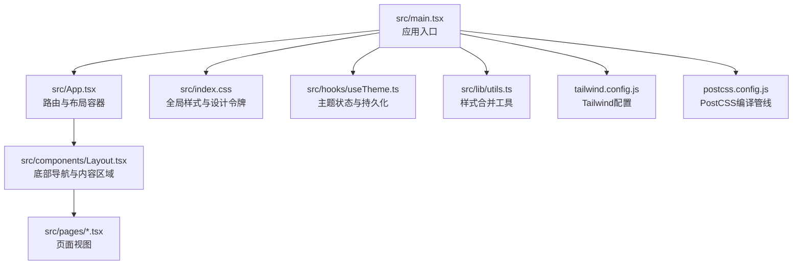
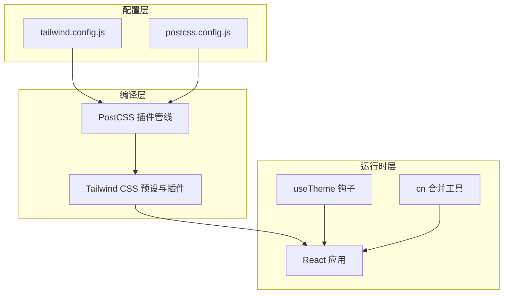
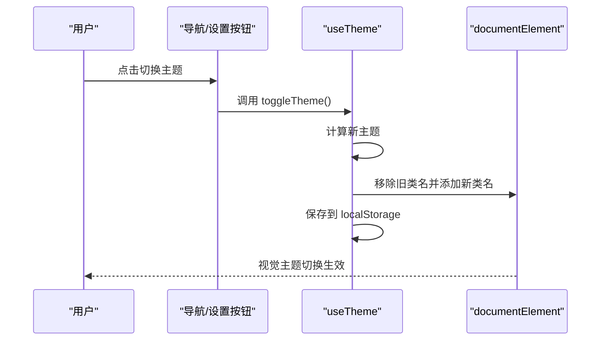
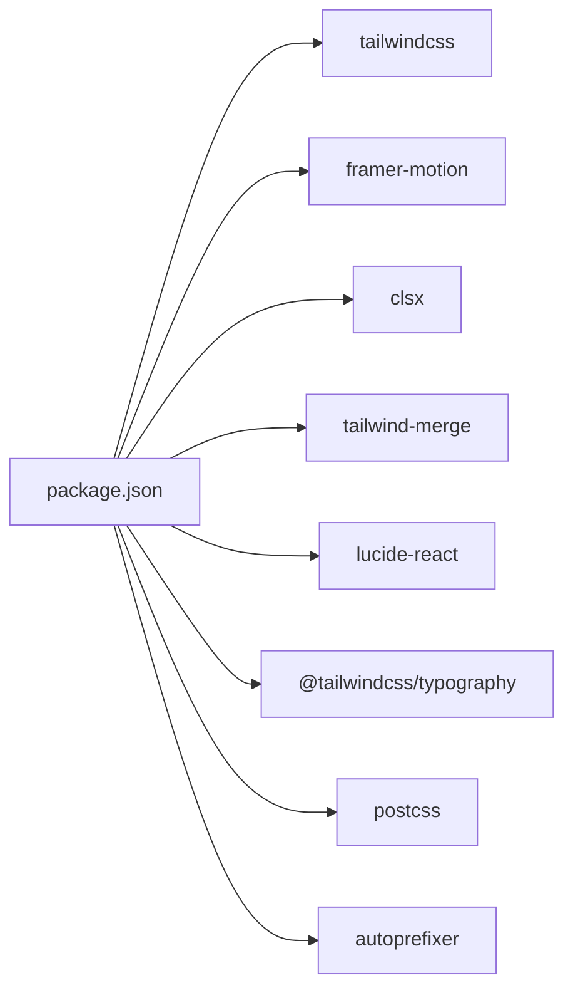

# UI/UX设计系统

<cite>
**本文引用的文件**
- [tailwind.config.js](file://tailwind.config.js)
- [postcss.config.js](file://postcss.config.js)
- [src/index.css](file://src/index.css)
- [src/hooks/useTheme.ts](file://src/hooks/useTheme.ts)
- [src/components/Layout.tsx](file://src/components/Layout.tsx)
- [src/lib/utils.ts](file://src/lib/utils.ts)
- [src/App.tsx](file://src/App.tsx)
- [src/pages/PopSci.tsx](file://src/pages/PopSci.tsx)
- [package.json](file://package.json)
- [src/main.tsx](file://src/main.tsx)
</cite>

## 目录
1. [简介](#简介)
2. [项目结构](#项目结构)
3. [核心组件](#核心组件)
4. [架构总览](#架构总览)
5. [详细组件分析](#详细组件分析)
6. [依赖分析](#依赖分析)
7. [性能考量](#性能考量)
8. [故障排查指南](#故障排查指南)
9. [结论](#结论)
10. [附录](#附录)

## 简介
本设计系统围绕移动端优先的健康科普类应用构建，采用React + TypeScript + Vite技术栈，结合Tailwind CSS进行原子化样式控制，并通过PostCSS完成编译与自动前缀处理。系统以“轻量、一致、可扩展”为核心目标，提供统一的颜色体系、字体排版、间距与交互反馈规范，确保在手机端（最大宽度约480px）获得良好的可用性与可访问性体验。

## 项目结构
整体采用按功能域分层的组织方式：
- 根目录包含构建与工具链配置（Vite、ESLint、TypeScript、Tailwind等）
- 源码位于src目录，按职责划分为组件、页面、数据、钩子、工具库等
- 样式入口为全局CSS，使用@layer分层组织基础、组件与工具类
- 主题切换通过useTheme钩子与HTML类名实现深浅模式

图表来源
- [src/main.tsx:1-11](file://src/main.tsx#L1-L11)
- [src/App.tsx:1-52](file://src/App.tsx#L1-L52)
- [src/components/Layout.tsx:1-66](file://src/components/Layout.tsx#L1-L66)
- [src/index.css:1-61](file://src/index.css#L1-L61)
- [src/hooks/useTheme.ts:1-29](file://src/hooks/useTheme.ts#L1-L29)
- [src/lib/utils.ts:1-7](file://src/lib/utils.ts#L1-L7)
- [tailwind.config.js:1-16](file://tailwind.config.js#L1-L16)
- [postcss.config.js:1-11](file://postcss.config.js#L1-L11)

章节来源
- [src/main.tsx:1-11](file://src/main.tsx#L1-L11)
- [src/App.tsx:1-52](file://src/App.tsx#L1-L52)
- [src/components/Layout.tsx:1-66](file://src/components/Layout.tsx#L1-L66)
- [src/index.css:1-61](file://src/index.css#L1-L61)
- [tailwind.config.js:1-16](file://tailwind.config.js#L1-L16)
- [postcss.config.js:1-11](file://postcss.config.js#L1-L11)

## 核心组件
- 设计令牌与样式系统
  - 全局CSS中定义了基础变量（背景主色、文本主色、辅助色等），并在@layer base中统一初始化字体族与滚动条样式
  - 使用@layer utilities扩展安全区域内边距与等宽数字等实用类
- 主题系统
  - useTheme钩子负责读取系统偏好或本地存储，切换html根元素的类名，实现深浅模式
  - 支持主题切换函数与当前主题判定
- 样式合并工具
  - 统一封装clsx与tailwind-merge，避免冲突类名导致的样式覆盖
- 布局与导航
  - Layout组件提供固定宽度容器、内容区与底部导航栏，导航项根据路径高亮与图标缩放反馈
- 动画与交互
  - 页面卡片与列表项使用过渡与悬停/激活态反馈，部分交互采用Framer Motion实现流畅动画

章节来源
- [src/index.css:1-61](file://src/index.css#L1-L61)
- [src/hooks/useTheme.ts:1-29](file://src/hooks/useTheme.ts#L1-L29)
- [src/lib/utils.ts:1-7](file://src/lib/utils.ts#L1-L7)
- [src/components/Layout.tsx:1-66](file://src/components/Layout.tsx#L1-L66)
- [src/pages/PopSci.tsx:1-270](file://src/pages/PopSci.tsx#L1-L270)

## 架构总览
设计系统由“配置—编译—运行时”三层构成：
- 配置层：Tailwind与PostCSS配置决定工具类生成范围、插件与浏览器兼容策略
- 编译层：PostCSS在构建时注入Tailwind预设、自动前缀与插件（如排版增强）
- 运行时层：React组件通过原子化类名组合实现视觉与交互一致性；主题钩子在DOM上切换类名驱动样式切换

图表来源
- [tailwind.config.js:1-16](file://tailwind.config.js#L1-L16)
- [postcss.config.js:1-11](file://postcss.config.js#L1-L11)
- [src/hooks/useTheme.ts:1-29](file://src/hooks/useTheme.ts#L1-L29)
- [src/lib/utils.ts:1-7](file://src/lib/utils.ts#L1-L7)

## 详细组件分析

### Tailwind CSS配置与定制
- 深色模式策略
  - 通过darkMode: "class"启用基于类名的深浅模式，配合useTheme在html根元素添加light/dark类
- 内容扫描范围
  - content包含HTML与TS/TSX源码，确保仅生成实际使用的工具类，减少体积
- 扩展点
  - theme.extend留作未来扩展自定义尺寸、圆角、阴影等
- 插件
  - @tailwindcss/typography用于正文排版的语义化样式增强

章节来源
- [tailwind.config.js:1-16](file://tailwind.config.js#L1-L16)

### PostCSS编译管线
- 自动前缀与Tailwind集成
  - 在开发与生产构建中自动注入tailwindcss与autoprefixer，保证多浏览器兼容
- 版本与稳定性
  - 与Tailwind版本匹配，避免编译冲突

章节来源
- [postcss.config.js:1-11](file://postcss.config.js#L1-L11)

### 全局样式与设计令牌
- 设计令牌
  - 定义主背景、主文字、次级文字、辅助色等变量，作为所有组件的基础色彩来源
- 字体系统
  - 正文使用衬线字体，标题使用无衬线字体，满足信息层级与可读性
- 可访问性与体验
  - 隐藏滚动条、禁用触摸高亮、设置line-height与字体平滑渲染
- 实用类扩展
  - 安全区域内边距与等宽数字等工具类提升移动端阅读体验

章节来源
- [src/index.css:1-61](file://src/index.css#L1-L61)

### 主题切换机制
- 状态管理
  - useTheme读取本地存储或系统偏好，初始化主题；变更时更新DOM类名并持久化
- 切换流程
  - 用户触发toggleTheme后，组件重新渲染，类名切换驱动样式变化

图表来源
- [src/hooks/useTheme.ts:1-29](file://src/hooks/useTheme.ts#L1-L29)

章节来源
- [src/hooks/useTheme.ts:1-29](file://src/hooks/useTheme.ts#L1-L29)

### 样式合并工具与组件样式
- 工具函数
  - cn封装clsx与tailwind-merge，避免冲突类名叠加导致的样式异常
- 组件应用
  - Layout中的导航项、卡片、按钮等均通过cn组合条件类名，确保样式一致性与可维护性

章节来源
- [src/lib/utils.ts:1-7](file://src/lib/utils.ts#L1-L7)
- [src/components/Layout.tsx:1-66](file://src/components/Layout.tsx#L1-L66)

### 响应式与移动端适配
- 固定容器宽度
  - 布局容器最大宽度限制在480px，保证移动端阅读密度与点击目标大小
- 安全区域内边距
  - 通过pb-safe工具类适配刘海屏/圆角屏的安全区域
- 导航栏高度与交互
  - 底部导航固定高度、图标与文字在选中态有缩放与颜色强调，提供明确的触控反馈

章节来源
- [src/components/Layout.tsx:1-66](file://src/components/Layout.tsx#L1-L66)
- [src/index.css:37-44](file://src/index.css#L37-L44)

### 动画与交互反馈
- 卡片与列表项
  - 悬停/激活态提供阴影与缩放反馈，点击时轻微缩放，提升触控确认感
- 选项卡切换
  - 使用Framer Motion的layoutId实现指示条的流畅过渡动画
- 视频卡片
  - 悬停时遮罩渐变与播放按钮放大，增强操作意图表达

章节来源
- [src/pages/PopSci.tsx:1-270](file://src/pages/PopSci.tsx#L1-L270)

### 数据流与路由集成
- 路由嵌套
  - App中以Layout为根路由，内部嵌套多个页面路由，形成清晰的页面层次
- 页面内容
  - PopSci作为首页内容页，承载标签页、列表与卡片交互

章节来源
- [src/App.tsx:1-52](file://src/App.tsx#L1-L52)
- [src/pages/PopSci.tsx:1-270](file://src/pages/PopSci.tsx#L1-L270)

## 依赖分析
- 核心依赖
  - Tailwind CSS：原子化样式与响应式工具类
  - Framer Motion：轻量动画与布局动画
  - lucide-react：图标库，统一视觉风格
  - clsx/tailwind-merge：类名合并与冲突消解
  - @tailwindcss/typography：正文排版增强
- 开发依赖
  - Vite、PostCSS、Autoprefixer、Tailwind等，保障构建效率与兼容性

图表来源
- [package.json:13-46](file://package.json#L13-L46)

章节来源
- [package.json:13-46](file://package.json#L13-L46)

## 性能考量
- 构建体积优化
  - Tailwind content扫描精确到源码与HTML，避免生成未使用类
  - 使用clsx与tailwind-merge减少重复与冲突类，降低CSS体积
- 运行时性能
  - 将动画与交互集中在必要组件，避免过度重绘
  - 使用固定容器宽度与合理的阴影/边框，减少复杂绘制开销
- 浏览器兼容
  - PostCSS自动前缀，确保主流移动端浏览器表现一致

## 故障排查指南
- 类名冲突或样式失效
  - 检查是否正确使用cn工具函数合并类名，避免重复覆盖
- 深浅模式不生效
  - 确认useTheme已将light/dark类添加至documentElement，并检查本地存储值
- 字体或排版异常
  - 检查全局CSS中字体声明与@layer顺序，确保基础层先于组件层应用
- 动画卡顿
  - 减少不必要的布局抖动，优先使用transform与opacity等合成属性
- 构建报错
  - 确认Tailwind与PostCSS版本匹配，清理缓存后重试

章节来源
- [src/lib/utils.ts:1-7](file://src/lib/utils.ts#L1-L7)
- [src/hooks/useTheme.ts:1-29](file://src/hooks/useTheme.ts#L1-L29)
- [src/index.css:1-61](file://src/index.css#L1-L61)
- [tailwind.config.js:1-16](file://tailwind.config.js#L1-L16)
- [postcss.config.js:1-11](file://postcss.config.js#L1-L11)

## 结论
该设计系统以Tailwind CSS为核心，结合PostCSS与React组件化开发，实现了移动端优先、主题可切换、交互反馈明确且具备良好可访问性的UI/UX框架。通过设计令牌、样式工具与路由结构的协同，系统在保持一致性的同时具备良好的扩展性，适合持续演进与规模化复用。

## 附录
- 最佳实践清单
  - 使用cn合并类名，避免硬编码样式字符串
  - 以设计令牌为中心管理颜色与间距，统一命名与取值
  - 在移动端优先的前提下，谨慎使用阴影与圆角，避免过度绘制
  - 对重要交互节点提供明确的视觉与动效反馈
  - 保持深浅模式的一致性，确保无障碍可用性