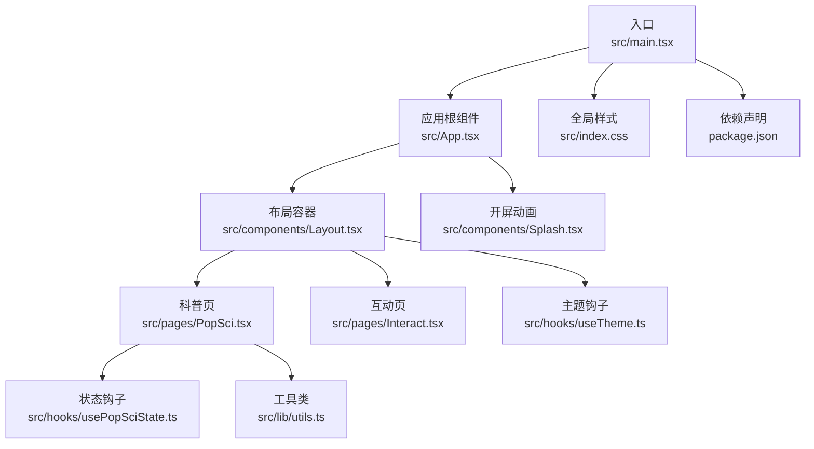
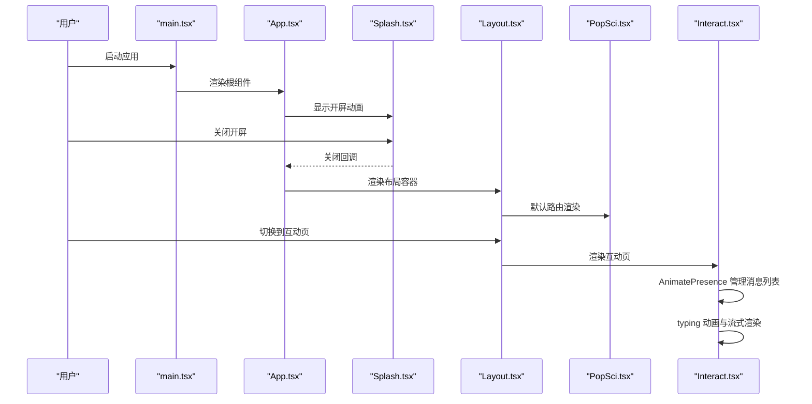
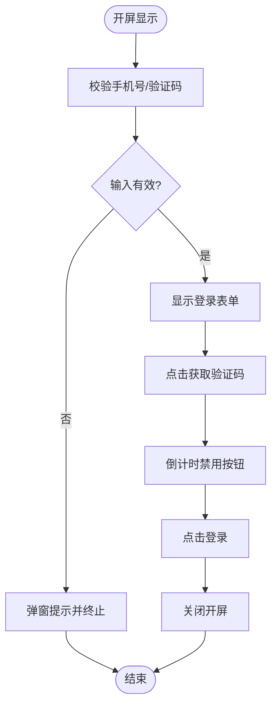
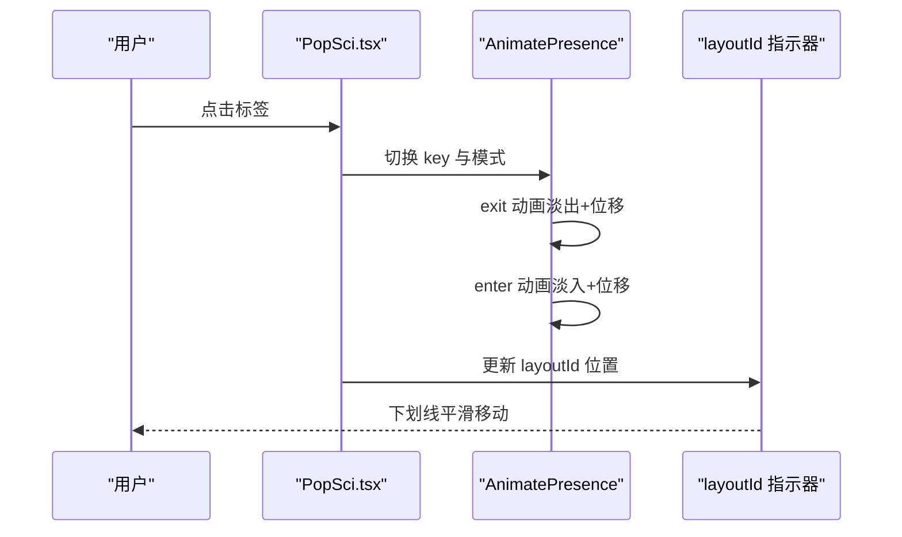
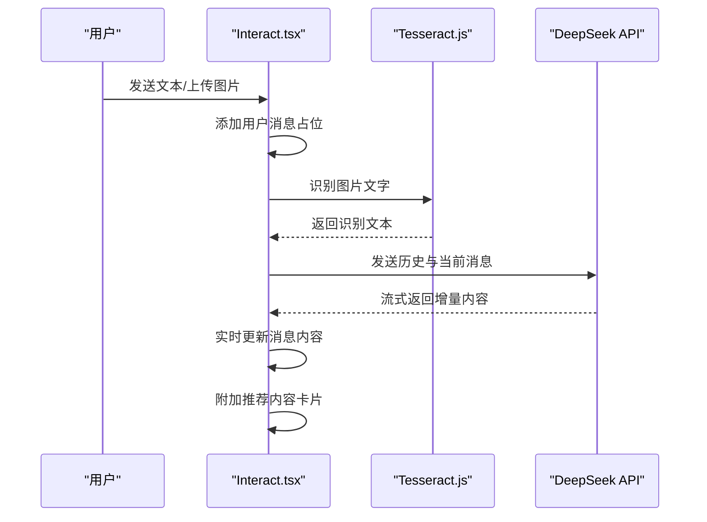
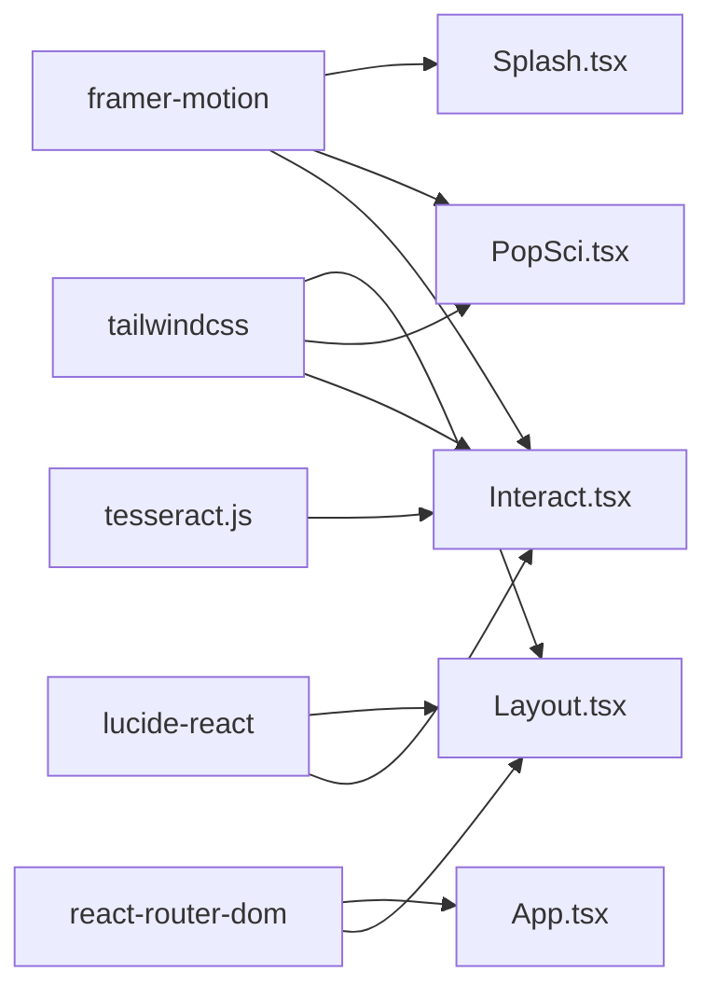

# 动画与交互设计

<cite>
**本文引用的文件**
- [src/App.tsx](file://src/App.tsx)
- [src/main.tsx](file://src/main.tsx)
- [src/components/Layout.tsx](file://src/components/Layout.tsx)
- [src/components/Splash.tsx](file://src/components/Splash.tsx)
- [src/pages/PopSci.tsx](file://src/pages/PopSci.tsx)
- [src/pages/Interact.tsx](file://src/pages/Interact.tsx)
- [src/hooks/usePopSciState.ts](file://src/hooks/usePopSciState.ts)
- [src/hooks/useTheme.ts](file://src/hooks/useTheme.ts)
- [src/lib/utils.ts](file://src/lib/utils.ts)
- [src/index.css](file://src/index.css)
- [package.json](file://package.json)
- [visual-companion.html](file://visual-companion.html)
</cite>

## 目录
1. [引言](#引言)
2. [项目结构](#项目结构)
3. [核心组件](#核心组件)
4. [架构总览](#架构总览)
5. [详细组件分析](#详细组件分析)
6. [依赖关系分析](#依赖关系分析)
7. [性能考量](#性能考量)
8. [故障排查指南](#故障排查指南)
9. [结论](#结论)
10. [附录](#附录)

## 引言
本文件系统性梳理本项目的动画与交互设计，围绕 Framer Motion 的集成方式、动画生命周期与性能优化策略展开；同时总结过渡动画设计规范、缓动与时间控制原则，并覆盖用户交互反馈、状态提示与确认机制。文档还包含页面切换与组件进入/退出效果、微交互设计、性能监控与帧率优化、内存管理、无障碍动画支持与减少动画偏好的适配、手势与拖拽反馈、触摸响应实现、以及动画调试与质量保障流程。

## 项目结构
项目采用 React + TypeScript + Vite 技术栈，UI 基于 TailwindCSS，动画与交互主要通过 Framer Motion 实现。路由由 React Router 管理，页面组件按功能模块组织，公共组件与样式集中在 components 与 pages 目录，工具函数与主题钩子位于 hooks 与 lib 目录。

图表来源
- [src/main.tsx:1-11](file://src/main.tsx#L1-L11)
- [src/App.tsx:19-51](file://src/App.tsx#L19-L51)
- [src/components/Layout.tsx:19-65](file://src/components/Layout.tsx#L19-L65)
- [src/components/Splash.tsx:9-169](file://src/components/Splash.tsx#L9-L169)
- [src/pages/PopSci.tsx:26-269](file://src/pages/PopSci.tsx#L26-L269)
- [src/pages/Interact.tsx:37-461](file://src/pages/Interact.tsx#L37-L461)
- [src/hooks/usePopSciState.ts:30-79](file://src/hooks/usePopSciState.ts#L30-L79)
- [src/hooks/useTheme.ts:5-29](file://src/hooks/useTheme.ts#L5-L29)
- [src/lib/utils.ts:4-6](file://src/lib/utils.ts#L4-L6)
- [src/index.css:1-61](file://src/index.css#L1-L61)
- [package.json:13-26](file://package.json#L13-L26)

章节来源
- [src/main.tsx:1-11](file://src/main.tsx#L1-L11)
- [src/App.tsx:19-51](file://src/App.tsx#L19-L51)
- [package.json:13-26](file://package.json#L13-L26)

## 核心组件
- 应用根组件负责路由与开屏动画的生命周期控制，承载页面级切换与布局容器。
- 布局容器提供底部导航与内容区 Outlet，承载页面级交互与微交互。
- 开屏动画组件使用 Framer Motion 的 AnimatePresence 与 motion 元素实现淡入淡出与逐层出现的入场动画。
- 科普页通过 AnimatePresence 与 layoutId 实现标签切换时的布局过渡动画，结合进入/退出动画完成内容切换。
- 互动页以 AnimatePresence 管理消息列表的进入/退出，typing 动画通过重复动画实现“打字”反馈，支持 OCR 图片上传与流式 AI 回复。
- 主题钩子与工具类提供主题切换与类名合并能力，辅助交互反馈与视觉一致性。
- 全局样式定义字体、滚动条与安全区域等基础样式，为动画提供统一的视觉基线。

章节来源
- [src/App.tsx:19-51](file://src/App.tsx#L19-L51)
- [src/components/Layout.tsx:19-65](file://src/components/Layout.tsx#L19-L65)
- [src/components/Splash.tsx:9-169](file://src/components/Splash.tsx#L9-L169)
- [src/pages/PopSci.tsx:26-269](file://src/pages/PopSci.tsx#L26-L269)
- [src/pages/Interact.tsx:37-461](file://src/pages/Interact.tsx#L37-L461)
- [src/hooks/useTheme.ts:5-29](file://src/hooks/useTheme.ts#L5-L29)
- [src/lib/utils.ts:4-6](file://src/lib/utils.ts#L4-L6)
- [src/index.css:1-61](file://src/index.css#L1-L61)

## 架构总览
下图展示了应用启动、开屏动画、路由切换与页面级动画的整体流程。

图表来源
- [src/main.tsx:6-10](file://src/main.tsx#L6-L10)
- [src/App.tsx:19-51](file://src/App.tsx#L19-L51)
- [src/components/Splash.tsx:21-49](file://src/components/Splash.tsx#L21-L49)
- [src/components/Layout.tsx:19-65](file://src/components/Layout.tsx#L19-L65)
- [src/pages/PopSci.tsx:26-269](file://src/pages/PopSci.tsx#L26-L269)
- [src/pages/Interact.tsx:37-461](file://src/pages/Interact.tsx#L37-L461)

## 详细组件分析

### 开屏动画（Splash）
- 使用 AnimatePresence 包裹可见条件渲染的根节点，配合 motion.div 的初始、动画与退出状态，实现透明度过渡与整体淡入淡出。
- 内容分层出现：品牌标题、副标题、登录表单、游客入口与标语分别设置不同延迟，形成渐进式加载体验。
- 行为控制：手机号与验证码输入校验、倒计时禁用按钮、登录关闭回调，确保交互前置条件满足后才关闭开屏。

图表来源
- [src/components/Splash.tsx:15-49](file://src/components/Splash.tsx#L15-L49)
- [src/components/Splash.tsx:52-168](file://src/components/Splash.tsx#L52-L168)

章节来源
- [src/components/Splash.tsx:9-169](file://src/components/Splash.tsx#L9-L169)

### 布局与导航（Layout）
- 底部导航栏使用 Link 组件与 useLocation 判断当前激活项，通过过渡类实现图标与文字的缩放、透明度与颜色变化。
- 导航项在激活态时添加轻微缩放与上移，hover 与 focus-visible 提供明确的可交互反馈。

章节来源
- [src/components/Layout.tsx:19-65](file://src/components/Layout.tsx#L19-L65)

### 科普页（PopSci）
- 标签切换：使用 AnimatePresence 包裹不同内容块，设置进入/退出动画与 popLayout 模式，实现平滑的列表位移过渡。
- 布局过渡：标签指示器通过 layoutId 在不同标签间建立布局约束，实现下划线的平滑移动。
- 交互反馈：卡片 hover、focus-visible 与 active 缩放提供即时反馈；收藏/点赞按钮根据状态切换颜色与填充。

图表来源
- [src/pages/PopSci.tsx:70-266](file://src/pages/PopSci.tsx#L70-L266)
- [src/pages/PopSci.tsx:58-62](file://src/pages/PopSci.tsx#L58-L62)

章节来源
- [src/pages/PopSci.tsx:26-269](file://src/pages/PopSci.tsx#L26-L269)

### 互动页（Interact）
- 消息列表：使用 AnimatePresence 管理消息进入/退出，初始状态设置透明度与缩放，进入时恢复至完全可见与正常尺寸。
- 打字动画：通过重复动画实现三个点的缩放脉冲，营造“正在输入”的反馈。
- 流式渲染：基于流式 API 的增量内容拼接，实时更新消息内容，并在完成后附加推荐内容卡片。
- 上传与 OCR：文件选择触发上传，预览图片 URL，调用 OCR 识别后构造隐藏文本消息，避免将大体积图片数据持久化。

图表来源
- [src/pages/Interact.tsx:86-142](file://src/pages/Interact.tsx#L86-L142)
- [src/pages/Interact.tsx:144-248](file://src/pages/Interact.tsx#L144-L248)
- [src/pages/Interact.tsx:297-398](file://src/pages/Interact.tsx#L297-L398)

章节来源
- [src/pages/Interact.tsx:37-461](file://src/pages/Interact.tsx#L37-L461)

### 状态与主题钩子
- 科普状态钩子：封装收藏/点赞的状态持久化与去重逻辑，提供查询与切换方法，避免重复写入。
- 主题钩子：监听系统偏好与本地存储，动态切换 html 的主题类名，提供主题切换函数。

章节来源
- [src/hooks/usePopSciState.ts:30-79](file://src/hooks/usePopSciState.ts#L30-L79)
- [src/hooks/useTheme.ts:5-29](file://src/hooks/useTheme.ts#L5-L29)

### 工具与样式
- 类名合并工具：统一处理 Tailwind 与 clsx 的类名冲突与合并。
- 全局样式：定义字体、滚动条隐藏、安全区域与文本渲染优化，为动画提供一致的视觉环境。

章节来源
- [src/lib/utils.ts:4-6](file://src/lib/utils.ts#L4-L6)
- [src/index.css:1-61](file://src/index.css#L1-L61)

## 依赖关系分析
- 动画与交互：Framer Motion 作为核心依赖，提供 AnimatePresence、motion、layoutId 等能力。
- 路由与页面：React Router 管理页面切换，Layout 容器承载页面级交互。
- 主题与工具：自定义钩子与工具函数支撑主题切换与类名合并。
- 第三方库：Lucide React 提供图标，TailwindCSS 提供原子化样式，Tesseract.js 支持 OCR。

图表来源
- [package.json:16](file://package.json#L16)
- [package.json:21](file://package.json#L21)
- [package.json:23](file://package.json#L23)
- [package.json:24](file://package.json#L24)
- [package.json:25](file://package.json#L25)
- [src/components/Splash.tsx:2](file://src/components/Splash.tsx#L2)
- [src/pages/PopSci.tsx:2](file://src/pages/PopSci.tsx#L2)
- [src/pages/Interact.tsx:3](file://src/pages/Interact.tsx#L3)
- [src/components/Layout.tsx:2](file://src/components/Layout.tsx#L2)

章节来源
- [package.json:13-26](file://package.json#L13-L26)

## 性能考量
- 动画时长与缓动
  - 开屏与内容分层出现普遍采用较短时长（约 0.3–0.5s）与 easeOut 缓动，确保快速感知与顺滑过渡。
  - PopSci 标签切换使用 0.3s easeOut，兼顾流畅与即时感。
- 布局过渡
  - 使用 layoutId 实现精确的布局约束，避免不必要的重排与闪烁。
  - AnimatePresence 的 popLayout 模式在列表切换时提供自然的位移动画。
- 视觉反馈
  - hover/focus/active 的过渡时长多为 200–300ms，强调即时反馈但不过度占用资源。
- 性能优化建议
  - 控制动画数量与层级，避免在同一帧内触发过多昂贵属性（如 transform 与 filter）。
  - 对高频动画（如打字点）使用重复动画而非复杂曲线，降低计算成本。
  - 列表项进入/退出时优先使用 opacity/y/transform 等 GPU 加速属性。
  - 对长列表与流式渲染，采用虚拟滚动与节流策略，减少 DOM 节点数量。
- 内存管理
  - 互动页对图片 URL 使用 URL.createObjectURL 生成预览，识别失败或切换后及时 revoke，防止内存泄漏。
  - 本地存储仅保存必要字段，对包含图片的历史记录进行占位标记，避免存储膨胀。
- 帧率监控
  - 使用浏览器开发者工具的 Performance 面板录制交互场景，观察主线程占用与丢帧情况。
  - 对高频事件（如滚动、键盘输入）使用 requestAnimationFrame 或节流/防抖，降低主线程压力。

章节来源
- [src/components/Splash.tsx:56-59](file://src/components/Splash.tsx#L56-L59)
- [src/pages/PopSci.tsx:74-77](file://src/pages/PopSci.tsx#L74-L77)
- [src/pages/Interact.tsx:301-303](file://src/pages/Interact.tsx#L301-L303)
- [src/pages/Interact.tsx:104-127](file://src/pages/Interact.tsx#L104-L127)
- [src/pages/Interact.tsx:74-83](file://src/pages/Interact.tsx#L74-L83)

## 故障排查指南
- 开屏动画不消失
  - 检查关闭回调是否被正确调用与状态更新链路。
  - 确认 AnimatePresence 的包裹与 key 值变化。
- 标签切换无过渡
  - 确保 AnimatePresence 的 mode 与 key 正确，layoutId 是否在同级元素中一致。
- 打字动画异常
  - 检查重复动画的持续时间与延迟，避免与其他动画冲突。
- OCR 与流式回复问题
  - 确认 API Key 配置与网络状态；对流式读取进行错误捕获与降级提示。
  - 对图片 URL 的生命周期管理，确保识别失败后及时清理。
- 无障碍与减少动画
  - 检查系统减少动画偏好设置对过渡时长的影响；必要时提供更短的动画或禁用选项。
  - 确保键盘可达性与焦点可见性，避免仅靠动画传达状态变化。

章节来源
- [src/components/Splash.tsx:21-49](file://src/components/Splash.tsx#L21-L49)
- [src/pages/PopSci.tsx:70-266](file://src/pages/PopSci.tsx#L70-L266)
- [src/pages/Interact.tsx:144-248](file://src/pages/Interact.tsx#L144-L248)
- [src/pages/Interact.tsx:104-142](file://src/pages/Interact.tsx#L104-L142)

## 结论
本项目以 Framer Motion 为核心，结合 React Router 与 TailwindCSS，在开屏、页面切换、列表过渡与交互反馈等方面实现了统一且高效的动效体系。通过合理的缓动与时间控制、布局约束与 GPU 加速属性的使用，兼顾了流畅性与性能。未来可在长列表虚拟化、流式渲染节流、内存与存储优化方面进一步深化，同时完善无障碍与减少动画偏好的适配策略。

## 附录
- 设计规范与实践
  - 过渡动画：使用 0.2–0.5s 的时长与 easeOut/easeInOut 缓动，确保感知与顺滑平衡。
  - 微交互：hover/focus/active 的过渡时长控制在 150–300ms，强调即时反馈。
  - 页面切换：使用 AnimatePresence 与布局约束，避免突兀跳变。
- 动画调试与测试
  - 使用浏览器性能面板录制关键交互路径，定位主线程瓶颈。
  - 对高频动画与流式渲染进行 A/B 测试，评估不同缓动与时长对用户体验的影响。
  - 建立自动化测试用例，验证动画在不同设备与系统偏好下的表现。