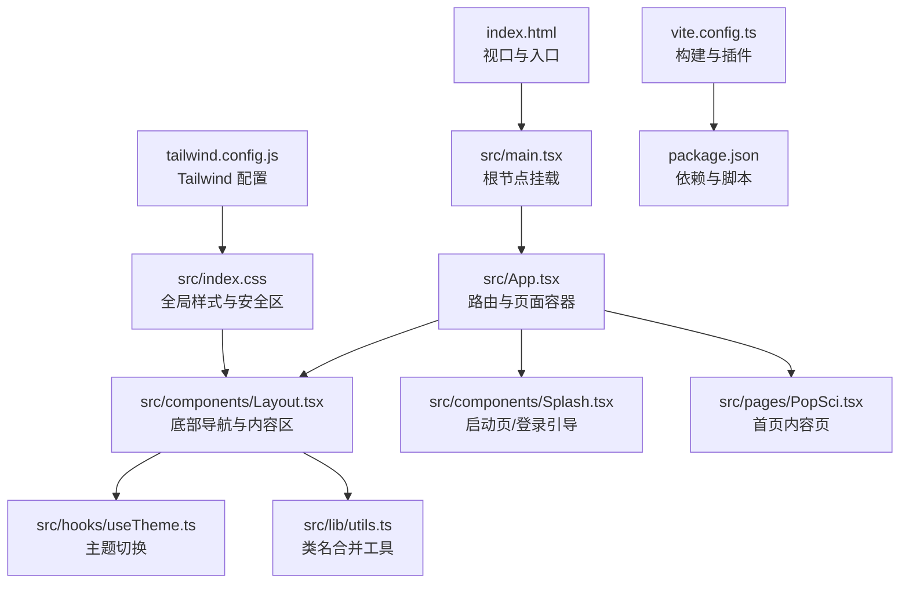
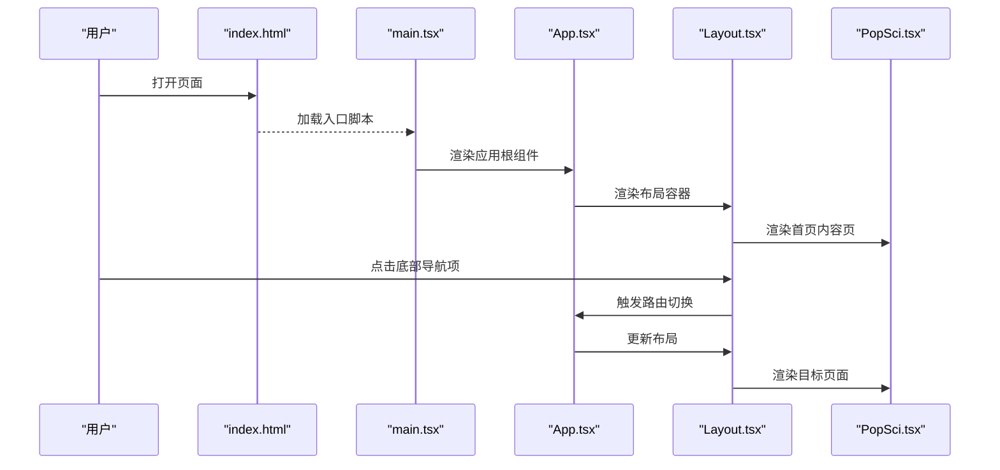
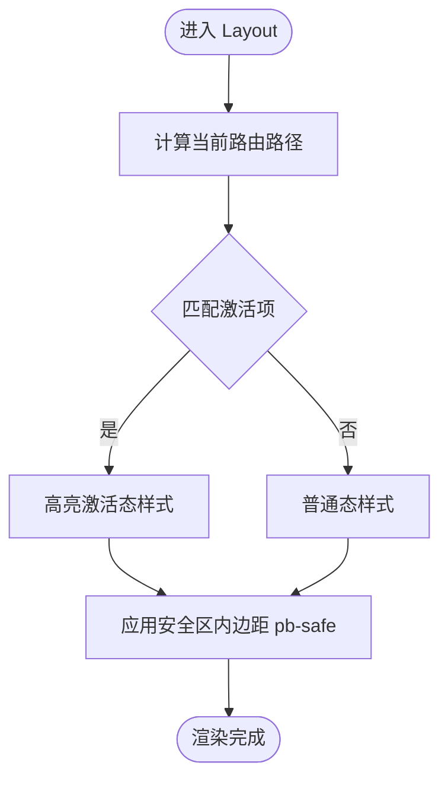
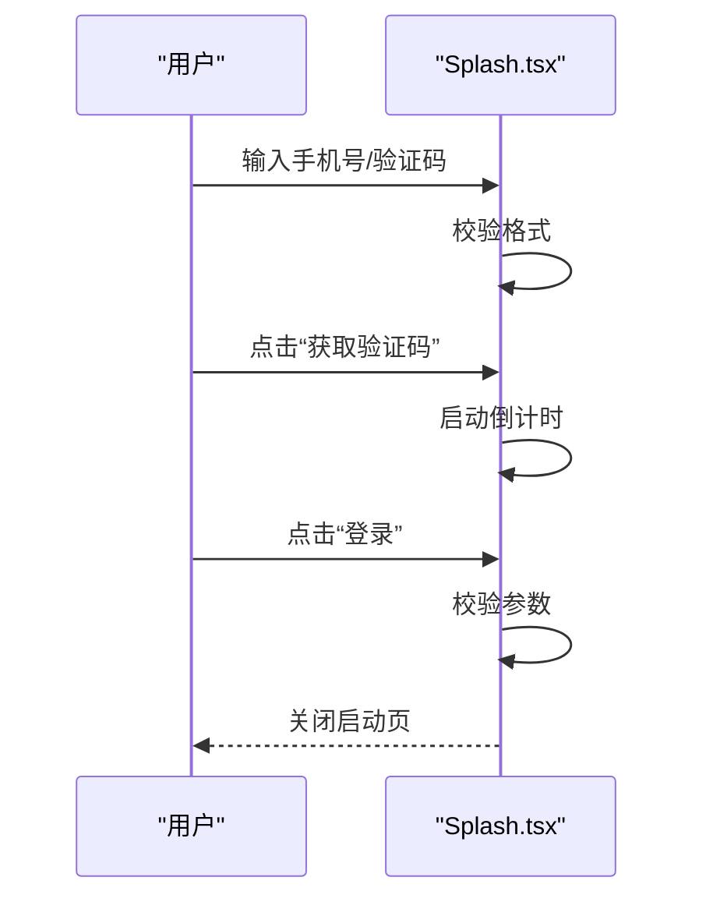
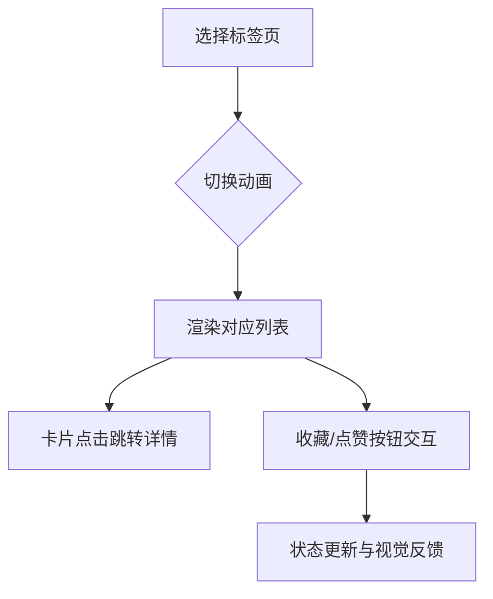
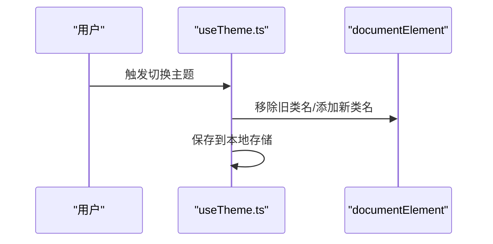
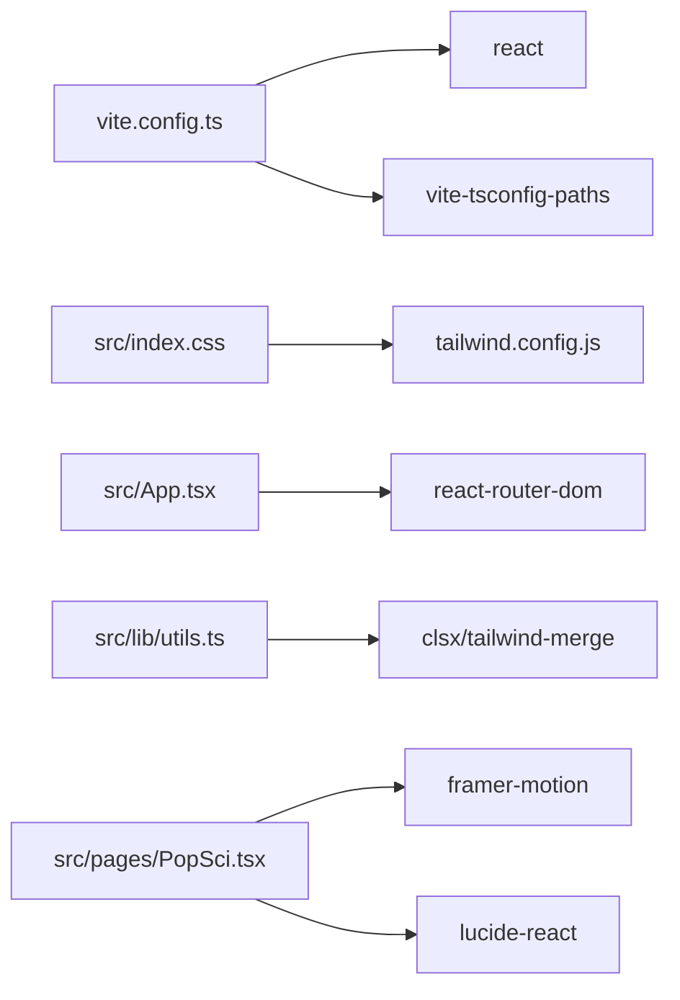

# 响应式与移动端设计

<cite>
**本文引用的文件**
- [README.md](file://README.md)
- [index.html](file://index.html)
- [src/index.css](file://src/index.css)
- [tailwind.config.js](file://tailwind.config.js)
- [vite.config.ts](file://vite.config.ts)
- [package.json](file://package.json)
- [src/main.tsx](file://src/main.tsx)
- [src/App.tsx](file://src/App.tsx)
- [src/components/Layout.tsx](file://src/components/Layout.tsx)
- [src/components/Splash.tsx](file://src/components/Splash.tsx)
- [src/hooks/useTheme.ts](file://src/hooks/useTheme.ts)
- [src/lib/utils.ts](file://src/lib/utils.ts)
- [src/pages/PopSci.tsx](file://src/pages/PopSci.tsx)
</cite>

## 目录
1. [引言](#引言)
2. [项目结构](#项目结构)
3. [核心组件](#核心组件)
4. [架构总览](#架构总览)
5. [详细组件分析](#详细组件分析)
6. [依赖关系分析](#依赖关系分析)
7. [性能考量](#性能考量)
8. [故障排查指南](#故障排查指南)
9. [结论](#结论)
10. [附录](#附录)

## 引言
本文件面向移动端优先的设计与实现，结合当前仓库中的前端技术栈（React + TypeScript + Vite + TailwindCSS + Framer Motion），系统梳理响应式断点、弹性布局、流式网格、触摸交互、手势支持、安全区域与刘海屏适配、视口与缩放控制、性能优化、以及 PWA 相关能力现状与落地建议。文档同时提供可视化图示与实操指引，帮助在多设备上实现一致且优质的用户体验。

## 项目结构
该工程采用现代前端工作流，以 Vite 作为构建工具，TailwindCSS 提供原子化样式与基础断点，React Router 管理路由，Framer Motion 负责动效，配合自定义主题 Hook 实现明暗主题切换。整体结构清晰，便于扩展移动端专用组件与交互。

**图表来源**
- [index.html:1-25](file://index.html#L1-L25)
- [src/main.tsx:1-11](file://src/main.tsx#L1-L11)
- [src/App.tsx:1-52](file://src/App.tsx#L1-L52)
- [src/components/Layout.tsx:1-66](file://src/components/Layout.tsx#L1-L66)
- [src/components/Splash.tsx:1-171](file://src/components/Splash.tsx#L1-L171)
- [src/pages/PopSci.tsx:1-270](file://src/pages/PopSci.tsx#L1-L270)
- [src/hooks/useTheme.ts:1-29](file://src/hooks/useTheme.ts#L1-L29)
- [src/lib/utils.ts:1-7](file://src/lib/utils.ts#L1-L7)
- [src/index.css:1-61](file://src/index.css#L1-L61)
- [tailwind.config.js:1-16](file://tailwind.config.js#L1-L16)
- [vite.config.ts:1-22](file://vite.config.ts#L1-L22)
- [package.json:1-48](file://package.json#L1-L48)

**章节来源**
- [README.md:1-58](file://README.md#L1-L58)
- [index.html:1-25](file://index.html#L1-L25)
- [src/main.tsx:1-11](file://src/main.tsx#L1-L11)
- [src/App.tsx:1-52](file://src/App.tsx#L1-L52)
- [src/components/Layout.tsx:1-66](file://src/components/Layout.tsx#L1-L66)
- [src/components/Splash.tsx:1-171](file://src/components/Splash.tsx#L1-L171)
- [src/pages/PopSci.tsx:1-270](file://src/pages/PopSci.tsx#L1-L270)
- [src/hooks/useTheme.ts:1-29](file://src/hooks/useTheme.ts#L1-L29)
- [src/lib/utils.ts:1-7](file://src/lib/utils.ts#L1-L7)
- [src/index.css:1-61](file://src/index.css#L1-L61)
- [tailwind.config.js:1-16](file://tailwind.config.js#L1-L16)
- [vite.config.ts:1-22](file://vite.config.ts#L1-L22)
- [package.json:1-48](file://package.json#L1-L48)

## 核心组件
- 视口与入口
  - 在 HTML 中通过视口元标签确保移动端初始缩放与宽度适配；入口脚本按模块加载，便于热更新与错误监听。
- 应用与路由
  - 使用路由容器包裹页面，统一承载启动页、底部导航与各业务页面。
- 布局与导航
  - 采用固定宽度容器与底部导航栏，结合安全区内边距实现刘海屏与安全区域适配。
- 启动页与登录
  - 提供手机号登录与游客浏览流程，使用动画过渡提升首屏体验。
- 主题与样式
  - 自定义主题 Hook 支持明暗主题切换，并持久化存储；全局样式中定义安全区与字体渲染优化。
- 动画与交互
  - 页面内容切换与按钮交互使用轻量动画，提升触控反馈与层级感。

**章节来源**
- [index.html:1-25](file://index.html#L1-L25)
- [src/App.tsx:1-52](file://src/App.tsx#L1-L52)
- [src/components/Layout.tsx:1-66](file://src/components/Layout.tsx#L1-L66)
- [src/components/Splash.tsx:1-171](file://src/components/Splash.tsx#L1-L171)
- [src/hooks/useTheme.ts:1-29](file://src/hooks/useTheme.ts#L1-L29)
- [src/index.css:1-61](file://src/index.css#L1-L61)

## 架构总览
下图展示了从浏览器到页面渲染、路由与组件的调用链路，以及关键交互节点。

**图表来源**
- [index.html:1-25](file://index.html#L1-L25)
- [src/main.tsx:1-11](file://src/main.tsx#L1-L11)
- [src/App.tsx:1-52](file://src/App.tsx#L1-L52)
- [src/components/Layout.tsx:1-66](file://src/components/Layout.tsx#L1-L66)
- [src/pages/PopSci.tsx:1-270](file://src/pages/PopSci.tsx#L1-L270)

## 详细组件分析

### 布局与导航组件（Layout）
- 固定最大宽度与居中容器，保证移动端窄屏与桌面端宽屏的一致阅读体验。
- 底部导航栏采用等分布局，结合安全区内边距，避免被系统 UI 遮挡。
- 导航项状态通过路径匹配高亮，图标与文字在激活态有微动效，增强触控反馈。
- 使用类名合并工具统一样式组合，减少重复与冲突。

**图表来源**
- [src/components/Layout.tsx:19-62](file://src/components/Layout.tsx#L19-L62)

**章节来源**
- [src/components/Layout.tsx:1-66](file://src/components/Layout.tsx#L1-L66)
- [src/lib/utils.ts:1-7](file://src/lib/utils.ts#L1-L7)

### 启动页与登录流程（Splash）
- 提供手机号输入、验证码倒计时与登录校验，支持游客浏览。
- 使用动画库进行入场与退出过渡，改善首屏加载体验。
- 输入框对数字与长度进行限制，降低错误输入成本。

**图表来源**
- [src/components/Splash.tsx:9-49](file://src/components/Splash.tsx#L9-L49)

**章节来源**
- [src/components/Splash.tsx:1-171](file://src/components/Splash.tsx#L1-L171)

### 内容页与交互（PopSci）
- 顶部标题与标签页切换，使用动画库实现标签指示器的平滑过渡。
- 列表项采用卡片布局，左右分栏与图片占位，保证在小屏下的可读性与点击面积。
- 收藏与点赞按钮使用紧凑尺寸，结合焦点可见轮廓与触控反馈，提升可用性。
- 使用国际化数字格式化显示浏览量与点赞数，增强可读性。

**图表来源**
- [src/pages/PopSci.tsx:26-268](file://src/pages/PopSci.tsx#L26-L268)

**章节来源**
- [src/pages/PopSci.tsx:1-270](file://src/pages/PopSci.tsx#L1-L270)

### 主题与样式（useTheme 与 index.css）
- 主题 Hook 读取系统偏好并在本地持久化，切换时动态添加/移除类名。
- 全局样式中启用安全区内边距类，底部导航使用该类避免被系统栏遮挡。
- 字体渲染优化与滚动条隐藏，提升移动端阅读体验。

**图表来源**
- [src/hooks/useTheme.ts:5-18](file://src/hooks/useTheme.ts#L5-L18)

**章节来源**
- [src/hooks/useTheme.ts:1-29](file://src/hooks/useTheme.ts#L1-L29)
- [src/index.css:1-61](file://src/index.css#L1-L61)

## 依赖关系分析
- 构建与开发
  - Vite 提供快速热更新与生产构建；插件包括 React 与路径别名解析。
- 样式与工具
  - TailwindCSS 提供原子化样式与基础断点；自定义工具函数用于类名合并。
- 动画与图标
  - Framer Motion 提供流畅的页面与元素过渡；Lucide React 提供图标。
- 路由与状态
  - React Router 管理页面路由；Zustand 可用于轻量状态管理（如收藏/点赞）。

**图表来源**
- [vite.config.ts:1-22](file://vite.config.ts#L1-L22)
- [src/index.css:1-61](file://src/index.css#L1-L61)
- [tailwind.config.js:1-16](file://tailwind.config.js#L1-L16)
- [src/App.tsx:1-52](file://src/App.tsx#L1-L52)
- [src/lib/utils.ts:1-7](file://src/lib/utils.ts#L1-L7)
- [src/pages/PopSci.tsx:1-270](file://src/pages/PopSci.tsx#L1-L270)
- [package.json:13-26](file://package.json#L13-L26)

**章节来源**
- [vite.config.ts:1-22](file://vite.config.ts#L1-L22)
- [tailwind.config.js:1-16](file://tailwind.config.js#L1-L16)
- [src/index.css:1-61](file://src/index.css#L1-L61)
- [src/App.tsx:1-52](file://src/App.tsx#L1-L52)
- [src/lib/utils.ts:1-7](file://src/lib/utils.ts#L1-L7)
- [src/pages/PopSci.tsx:1-270](file://src/pages/PopSci.tsx#L1-L270)
- [package.json:13-26](file://package.json#L13-L26)

## 性能考量
- 构建与打包
  - 生产构建开启隐藏源码映射，平衡调试与体积；按需引入动画与图标，避免全量引入。
- 图片与资源
  - 列表项使用占位图与紧凑尺寸，减少首屏渲染压力；可结合懒加载策略进一步优化。
- 动画与交互
  - 使用轻量动画与合理的过渡时间，避免在低端设备上造成掉帧。
- 字体与渲染
  - 启用字体抗锯齿与渲染优化，减少移动端字体抖动与模糊。

**章节来源**
- [vite.config.ts:8-10](file://vite.config.ts#L8-L10)
- [src/pages/PopSci.tsx:176-184](file://src/pages/PopSci.tsx#L176-L184)
- [src/index.css:56-60](file://src/index.css#L56-L60)

## 故障排查指南
- 视口与缩放异常
  - 确认 HTML 中存在视口元标签，确保初始缩放与设备宽度正确。
- 安全区遮挡
  - 检查底部导航是否应用安全区内边距类，避免被系统栏覆盖。
- 主题切换无效
  - 确认主题 Hook 已将类名写入根元素，且本地存储键值存在。
- 动画卡顿
  - 减少复杂动画层级，优先使用 transform 与 opacity；在低端设备上适当降低动画时长。
- 路由跳转失效
  - 检查路由配置与路径拼接，确保嵌套路由与参数传递正确。

**章节来源**
- [index.html:6](file://index.html#L6)
- [src/components/Layout.tsx:30](file://src/components/Layout.tsx#L30)
- [src/hooks/useTheme.ts:14-18](file://src/hooks/useTheme.ts#L14-L18)
- [src/App.tsx:28-48](file://src/App.tsx#L28-L48)

## 结论
本项目已具备移动端优先的基础能力：固定宽度容器、底部导航、安全区适配、主题切换与轻量动画。建议在现有基础上进一步完善横竖屏适配、手势支持、图片懒加载与资源压缩、PWA 缓存策略与离线能力，以实现更佳的跨设备一致性与性能表现。

## 附录

### 响应式断点与流式网格设计要点
- 断点策略
  - 基于 Tailwind 默认断点与业务容器宽度（如固定最大宽度）组织布局，优先满足移动端窄屏体验。
- 流式网格
  - 使用弹性布局与等分列，在小屏下自动换行；在大屏下通过容器约束最大宽度，避免内容过宽影响阅读。
- 触摸交互
  - 控件尺寸与间距遵循移动端点击热区标准；为按钮与链接提供可见焦点状态与触控反馈。

### 触摸交互优化与手势支持
- 点击与键盘访问
  - 为可交互元素提供明确的键盘可达性与焦点轮廓，避免仅依赖触摸。
- 滚动与吸附
  - 对吸顶标题与导航栏使用合适的滚动吸附策略，避免频繁重排。
- 手势建议
  - 可引入轻量手势库（如针对滑动/长按的场景）以增强移动端操作体验。

### 视口配置、缩放控制与屏幕适配
- 视口元标签
  - 确保初始缩放与设备宽度设置合理，避免页面被过度缩放。
- 屏幕适配
  - 使用相对单位与弹性布局，结合媒体查询在极端尺寸下调整排版与间距。

### 横竖屏适配、安全区域与刘海屏兼容
- 安全区
  - 为底部导航与悬浮元素应用安全区内边距类，避免被系统栏遮挡。
- 横竖屏
  - 在横屏时适当调整卡片排列与文本换行策略，保持可读性与点击面积。

### 性能优化与资源策略
- 图片懒加载
  - 对长列表与图片较多的页面启用懒加载，减少首屏资源占用。
- 资源压缩
  - 构建阶段启用压缩与 Tree Shaking，按需引入第三方库与图标。
- 动画优化
  - 使用 transform 与 opacity 进行动画，避免触发重排；控制动画数量与时长。

### PWA 特性与离线缓存
- 当前状态
  - 未发现 PWA 相关注册与缓存策略配置。
- 建议
  - 添加 Service Worker 与 Web App Manifest，实现离线缓存与安装提示；对静态资源与关键接口进行缓存策略配置。

### 跨设备一致性与测试
- 一致性
  - 统一样式变量与交互反馈，确保在不同设备与系统上的视觉与行为一致。
- 测试
  - 使用浏览器开发者工具的设备模拟与真机联调相结合；关注滚动性能、字体渲染与手势响应。