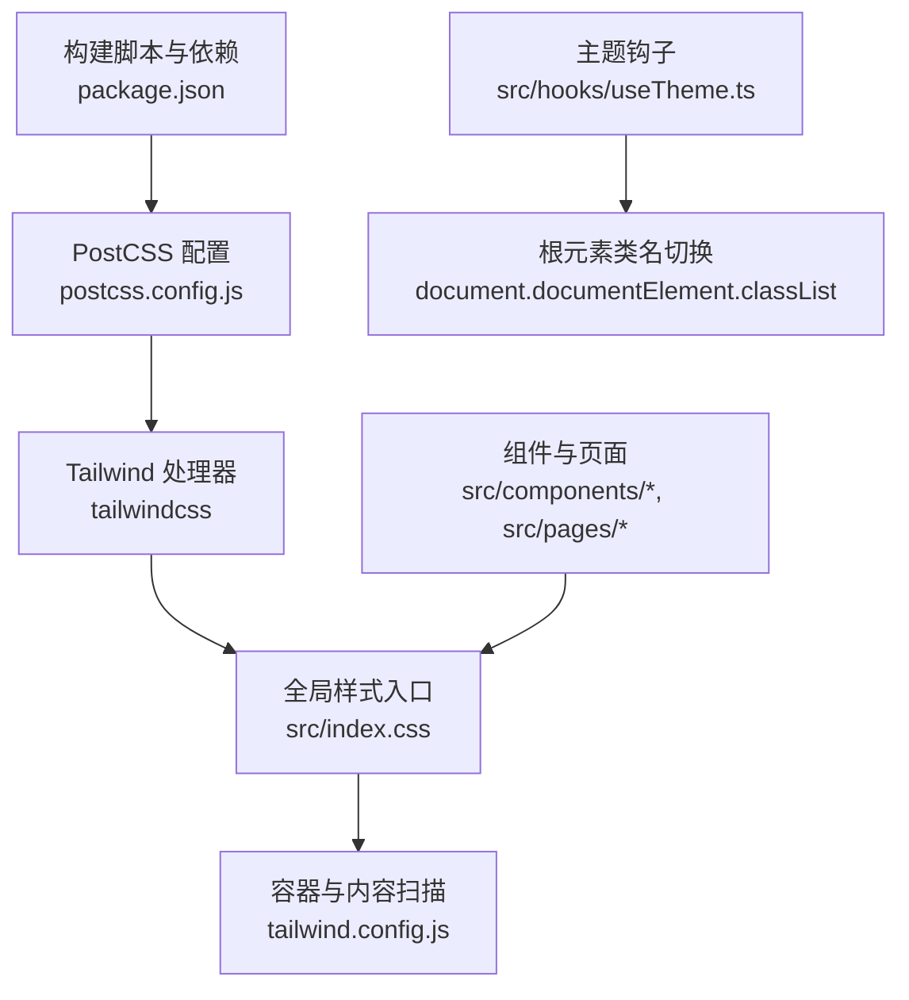
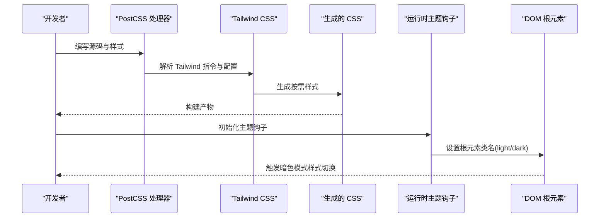
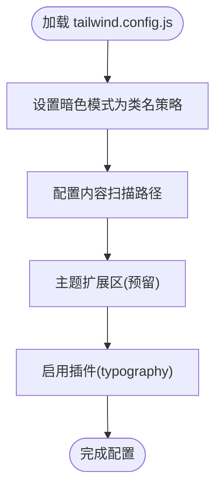
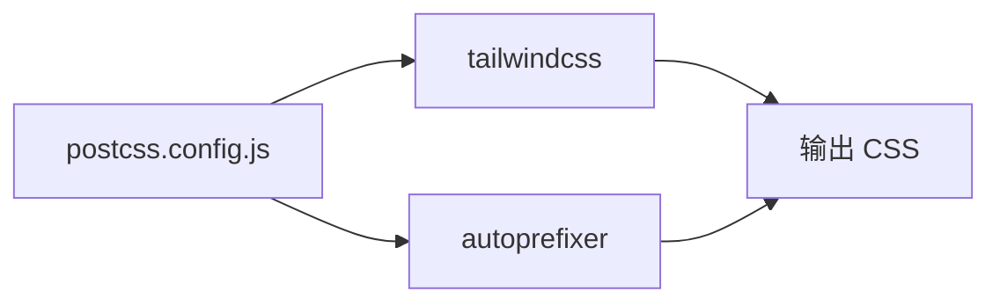
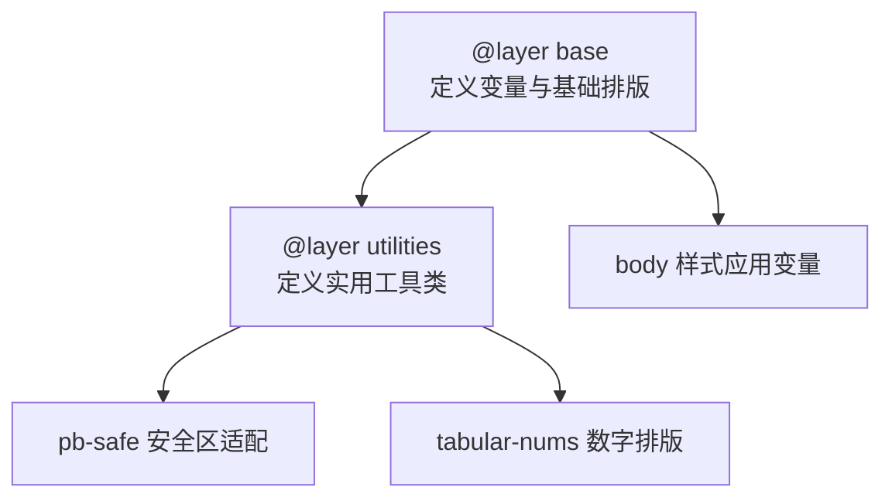
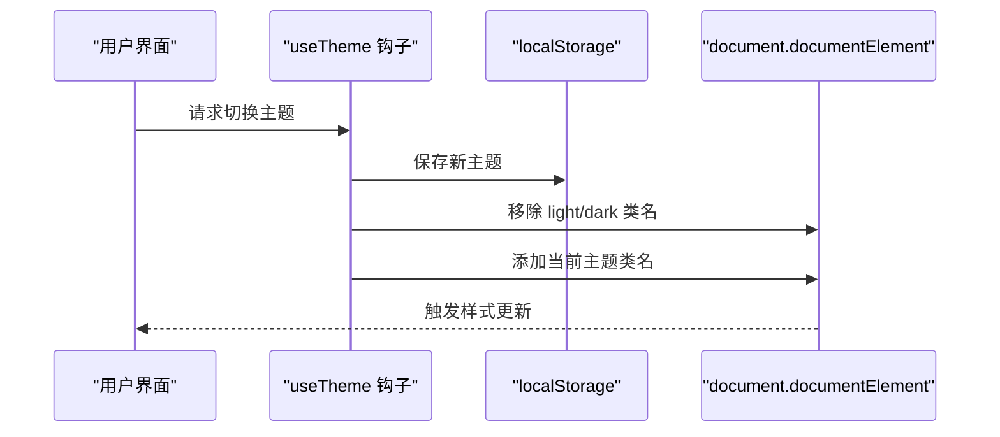
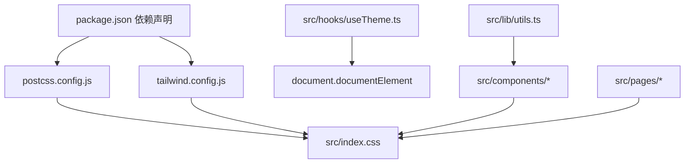

# 样式系统架构

<cite>
**本文引用的文件**
- [tailwind.config.js](file://tailwind.config.js)
- [postcss.config.js](file://postcss.config.js)
- [index.css](file://src/index.css)
- [package.json](file://package.json)
- [useTheme.ts](file://src/hooks/useTheme.ts)
- [utils.ts](file://src/lib/utils.ts)
- [Layout.tsx](file://src/components/Layout.tsx)
- [AdDietitian.tsx](file://src/pages/AdDietitian.tsx)
- [visual-companion.html](file://visual-companion.html)
- [.trae 文档/前端设计规范.md](file://.trae/documents/frontend_design_guidelines.md)
</cite>

## 目录
1. [简介](#简介)
2. [项目结构](#项目结构)
3. [核心组件](#核心组件)
4. [架构总览](#架构总览)
5. [详细组件分析](#详细组件分析)
6. [依赖关系分析](#依赖关系分析)
7. [性能考虑](#性能考虑)
8. [故障排查指南](#故障排查指南)
9. [结论](#结论)
10. [附录](#附录)

## 简介
本文件系统化梳理并文档化该仓库的样式系统架构，围绕 Tailwind CSS 的配置策略与定制化方案展开，深入解析主题扩展机制、暗色模式实现与响应式断点配置；阐述 CSS 架构组织原则、样式文件结构与模块化管理策略；解释样式继承机制、冲突解决规则与优先级管理；覆盖自定义 CSS 变量的使用、CSS 变量管理与动态样式生成；提供样式性能优化技巧、打包策略与运行时优化方法；并总结第三方样式库的集成方案、插件生态系统与扩展机制，最后给出样式调试工具、开发工作流与团队协作规范。

## 项目结构
样式系统由以下关键要素构成：
- PostCSS 与 Tailwind CSS：通过 PostCSS 配置启用 Tailwind 与 Autoprefixer 插件，实现从源码到产物的自动处理。
- Tailwind 配置：定义内容扫描范围、暗色模式策略、主题扩展与插件。
- 全局样式入口：在全局 CSS 中引入 Tailwind 指令与自定义图层，集中管理基础样式、变量与工具类。
- 主题钩子：在运行时切换根元素类名以驱动暗色模式，并持久化用户偏好。
- 组件与页面：通过 Tailwind 工具类与自定义工具类实现一致的视觉语言与交互反馈。
- 开发与调试：可视化预览工具与设计规范文档支撑主题与配色一致性。

图表来源
- [postcss.config.js:1-11](file://postcss.config.js#L1-L11)
- [tailwind.config.js:1-16](file://tailwind.config.js#L1-L16)
- [index.css:1-61](file://src/index.css#L1-L61)
- [useTheme.ts:1-29](file://src/hooks/useTheme.ts#L1-L29)
- [package.json:1-48](file://package.json#L1-L48)

章节来源
- [postcss.config.js:1-11](file://postcss.config.js#L1-L11)
- [tailwind.config.js:1-16](file://tailwind.config.js#L1-L16)
- [index.css:1-61](file://src/index.css#L1-L61)
- [package.json:1-48](file://package.json#L1-L48)

## 核心组件
- Tailwind 配置与内容扫描
  - 内容扫描路径覆盖 HTML 与 TS/JSX/TSX 源文件，确保按需生成样式。
  - 暗色模式采用类名策略，便于与主题钩子联动。
  - 主题扩展区预留扩展点，支持未来新增语义化变量或工具类。
- PostCSS 配置
  - 启用 tailwindcss 与 autoprefixer，保障跨浏览器兼容与最小化体积。
- 全局样式入口
  - 引入 Tailwind 三大指令，确保基础、组件与工具类分层有序。
  - 自定义 CSS 变量集中于 :root，形成可复用的主题令牌。
  - 使用 @layer 将基础样式与工具类分层，明确优先级与覆盖顺序。
- 主题钩子
  - 读取本地存储与系统偏好，初始化主题。
  - 切换根元素类名并持久化，驱动暗色模式生效。
- 工具函数
  - clsx 与 tailwind-merge 组合，合并与去重类名，避免冲突与冗余。
- 组件与页面
  - 使用语义化颜色变量与工具类，统一视觉与交互反馈。
  - 底部安全区工具类 pb-safe 适配移动端刘海屏等安全区域。

章节来源
- [tailwind.config.js:1-16](file://tailwind.config.js#L1-L16)
- [postcss.config.js:1-11](file://postcss.config.js#L1-L11)
- [index.css:1-61](file://src/index.css#L1-L61)
- [useTheme.ts:1-29](file://src/hooks/useTheme.ts#L1-L29)
- [utils.ts:1-6](file://src/lib/utils.ts#L1-L6)
- [Layout.tsx:1-66](file://src/components/Layout.tsx#L1-L66)
- [AdDietitian.tsx:104-124](file://src/pages/AdDietitian.tsx#L104-L124)

## 架构总览
下图展示了样式系统从配置到运行时的整体流程，包括构建期与运行时的关键节点。

图表来源
- [postcss.config.js:1-11](file://postcss.config.js#L1-L11)
- [tailwind.config.js:1-16](file://tailwind.config.js#L1-L16)
- [index.css:1-61](file://src/index.css#L1-L61)
- [useTheme.ts:1-29](file://src/hooks/useTheme.ts#L1-L29)

## 详细组件分析

### Tailwind 配置与主题扩展
- 内容扫描范围
  - 扫描 index.html 与 src 下所有 TS/JSX/TSX 文件，确保仅生成被使用的样式。
- 暗色模式策略
  - 使用类名策略，与 useTheme 钩子配合，实现可控的主题切换。
- 主题扩展
  - 当前为空，预留扩展点用于新增语义化变量或工具类，保持与现有变量体系一致。
- 插件生态
  - 已启用 typography 插件，提升排版可读性与一致性。

图表来源
- [tailwind.config.js:1-16](file://tailwind.config.js#L1-L16)

章节来源
- [tailwind.config.js:1-16](file://tailwind.config.js#L1-L16)

### PostCSS 与构建链路
- 插件组合
  - tailwindcss：解析与生成样式。
  - autoprefixer：自动添加厂商前缀，提升兼容性。
- 版本与依赖
  - 与 tailwindcss、postcss、autoprefixer 的版本在 package.json 中声明，确保链路稳定。

图表来源
- [postcss.config.js:1-11](file://postcss.config.js#L1-L11)
- [package.json:1-48](file://package.json#L1-L48)

章节来源
- [postcss.config.js:1-11](file://postcss.config.js#L1-L11)
- [package.json:1-48](file://package.json#L1-L48)

### 全局样式入口与图层组织
- Tailwind 指令
  - 引入 base、components、utilities，确保分层有序。
- 自定义 CSS 变量
  - 在 :root 定义主背景、主文本、次级文本、次级背景与强调色等语义化变量。
- 字体与排版
  - 设置正文与标题字体族，优化渲染与抗锯齿。
- 图层与工具类
  - 使用 @layer base 与 @layer utilities 明确优先级，避免意外覆盖。
  - 提供 pb-safe 与 tabular-nums 等实用工具类。

图表来源
- [index.css:1-61](file://src/index.css#L1-L61)

章节来源
- [index.css:1-61](file://src/index.css#L1-L61)

### 主题扩展机制与暗色模式实现
- 主题钩子逻辑
  - 初始化：优先读取本地存储，其次匹配系统偏好，否则默认亮色。
  - 切换：移除 light/dark 类名后添加当前主题，并持久化。
- 运行时切换
  - 根元素类名决定暗色模式样式是否生效，与 Tailwind 配置的类名策略一致。
- 设计规范对齐
  - 主题变量与设计规范中的色彩系统保持一致，确保视觉一致性。

图表来源
- [useTheme.ts:1-29](file://src/hooks/useTheme.ts#L1-L29)

章节来源
- [useTheme.ts:1-29](file://src/hooks/useTheme.ts#L1-L29)
- [.trae 文档/前端设计规范.md:1-17](file://.trae/documents/frontend_design_guidelines.md#L1-L17)

### 响应式断点配置
- 断点策略
  - Tailwind 默认断点满足移动端优先与常见布局需求。
  - 若需扩展，可在 tailwind.config.js 的 theme.extend 中新增断点或调整现有断点。
- 实践建议
  - 在组件中优先使用默认断点，避免过度定制导致维护成本上升。
  - 如需特殊断点，统一在扩展区集中管理，保持命名一致性。

章节来源
- [tailwind.config.js:1-16](file://tailwind.config.js#L1-L16)

### 样式文件结构与模块化管理
- 结构原则
  - 全局样式集中于 src/index.css，按图层组织，职责清晰。
  - 组件样式通过工具类与变量实现模块化，避免全局污染。
- 模块化实践
  - 使用 cn 工具函数合并与去重类名，降低冲突概率。
  - 页面与组件中统一使用语义化颜色变量，减少硬编码。

章节来源
- [index.css:1-61](file://src/index.css#L1-L61)
- [utils.ts:1-6](file://src/lib/utils.ts#L1-L6)
- [Layout.tsx:1-66](file://src/components/Layout.tsx#L1-L66)
- [AdDietitian.tsx:104-124](file://src/pages/AdDietitian.tsx#L104-L124)

### 样式继承机制、冲突解决与优先级管理
- 继承与覆盖
  - 通过 @layer base 与 @layer utilities 明确优先级，避免意外覆盖。
  - 使用工具类时遵循“就近覆盖”的原则，必要时使用 !important 作为最后手段。
- 冲突解决
  - 使用 clsx 与 tailwind-merge 合并类名，自动去重与合并冲突类。
  - 在组件中尽量使用单一语义类，减少多类叠加导致的冲突。
- 优先级管理
  - Tailwind 默认优先级已满足大多数场景；如需更高优先级，可通过 @layer 或自定义 CSS 覆盖。

章节来源
- [index.css:1-61](file://src/index.css#L1-L61)
- [utils.ts:1-6](file://src/lib/utils.ts#L1-L6)

### 自定义 CSS 属性与动态样式生成
- CSS 变量管理
  - 在 :root 定义语义化变量，组件与页面通过 var() 使用，便于主题切换与动态修改。
- 动态样式生成
  - 通过根元素类名切换触发暗色模式样式；也可在运行时通过 JS 修改 CSS 变量实现动态主题。
- 工具类补充
  - 新增工具类如 pb-safe、tabular-nums，统一在 @layer utilities 中维护。

章节来源
- [index.css:1-61](file://src/index.css#L1-L61)
- [useTheme.ts:1-29](file://src/hooks/useTheme.ts#L1-L29)

### 第三方样式库与插件生态系统
- 已集成插件
  - @tailwindcss/typography：提升排版一致性与可读性。
- 其他常用插件
  - 可根据需要引入其他官方或社区插件，但需评估体积与维护成本。
- 版本管理
  - 在 package.json 中统一声明版本，确保团队一致性与可复现性。

章节来源
- [package.json:1-48](file://package.json#L1-L48)
- [tailwind.config.js:1-16](file://tailwind.config.js#L1-L16)

### 样式调试工具与开发工作流
- 可视化预览
  - visual-companion.html 提供主题切换与动画演示，便于快速验证视觉效果。
- 设计规范对齐
  - 前端设计与开发规范文档提供色彩系统与视觉规范，确保一致性。
- 开发工作流
  - 在组件中优先使用工具类与变量，减少手写样式；通过主题钩子与 CSS 变量实现主题切换。

章节来源
- [visual-companion.html:30-105](file://visual-companion.html#L30-L105)
- [.trae 文档/前端设计规范.md:1-17](file://.trae/documents/frontend_design_guidelines.md#L1-L17)

## 依赖关系分析
样式系统各组件之间的依赖关系如下：

图表来源
- [package.json:1-48](file://package.json#L1-L48)
- [postcss.config.js:1-11](file://postcss.config.js#L1-L11)
- [tailwind.config.js:1-16](file://tailwind.config.js#L1-L16)
- [index.css:1-61](file://src/index.css#L1-L61)
- [useTheme.ts:1-29](file://src/hooks/useTheme.ts#L1-L29)
- [utils.ts:1-6](file://src/lib/utils.ts#L1-L6)
- [Layout.tsx:1-66](file://src/components/Layout.tsx#L1-L66)
- [AdDietitian.tsx:104-124](file://src/pages/AdDietitian.tsx#L104-L124)

章节来源
- [package.json:1-48](file://package.json#L1-L48)
- [postcss.config.js:1-11](file://postcss.config.js#L1-L11)
- [tailwind.config.js:1-16](file://tailwind.config.js#L1-L16)
- [index.css:1-61](file://src/index.css#L1-L61)
- [useTheme.ts:1-29](file://src/hooks/useTheme.ts#L1-L29)
- [utils.ts:1-6](file://src/lib/utils.ts#L1-L6)
- [Layout.tsx:1-66](file://src/components/Layout.tsx#L1-L66)
- [AdDietitian.tsx:104-124](file://src/pages/AdDietitian.tsx#L104-L124)

## 性能考虑
- 构建期优化
  - 通过内容扫描仅生成被使用的样式，减少体积。
  - 使用 PostCSS 与 Autoprefixer 生成兼容性最佳的产物。
- 运行时优化
  - 使用 clsx 与 tailwind-merge 合并类名，避免重复与冲突，降低渲染负担。
  - 通过 CSS 变量与根元素类名切换实现主题切换，避免频繁重绘。
- 体积控制
  - 避免在组件中内联大量样式，优先使用工具类与变量。
  - 合理使用插件，避免引入不必要的功能。

[本节为通用指导，无需特定文件来源]

## 故障排查指南
- 暗色模式未生效
  - 检查 useTheme 是否正确设置根元素类名，确认 tailwind.config.js 的 darkMode 策略为类名。
- 样式未按预期生成
  - 确认内容扫描路径是否包含目标文件，避免遗漏导致样式缺失。
- 类名冲突或样式错乱
  - 使用 cn 工具函数合并类名，减少冲突；必要时检查 @layer 优先级与工具类顺序。
- 主题切换不持久
  - 确认本地存储键值与 useTheme 的读取/写入逻辑一致。

章节来源
- [useTheme.ts:1-29](file://src/hooks/useTheme.ts#L1-L29)
- [tailwind.config.js:1-16](file://tailwind.config.js#L1-L16)
- [utils.ts:1-6](file://src/lib/utils.ts#L1-L6)

## 结论
该样式系统以 Tailwind CSS 为核心，结合 PostCSS 与 Autoprefixer 实现高效构建；通过类名策略的暗色模式与 CSS 变量体系实现主题扩展；以图层化组织与工具函数保障样式一致性与性能。建议在扩展阶段继续完善主题扩展区、统一断点策略与工具类命名，并持续对齐设计规范，确保可维护性与一致性。

[本节为总结性内容，无需特定文件来源]

## 附录
- 团队协作规范
  - 统一使用工具类与变量，避免手写样式。
  - 新增工具类需在 @layer utilities 中集中维护，并提供命名规范。
  - 主题扩展需在 tailwind.config.js 的扩展区统一管理。
- 开发工具
  - 使用 visual-companion.html 快速验证主题与动效。
  - 对照前端设计与开发规范文档，确保视觉一致性。

[本节为通用指导，无需特定文件来源]