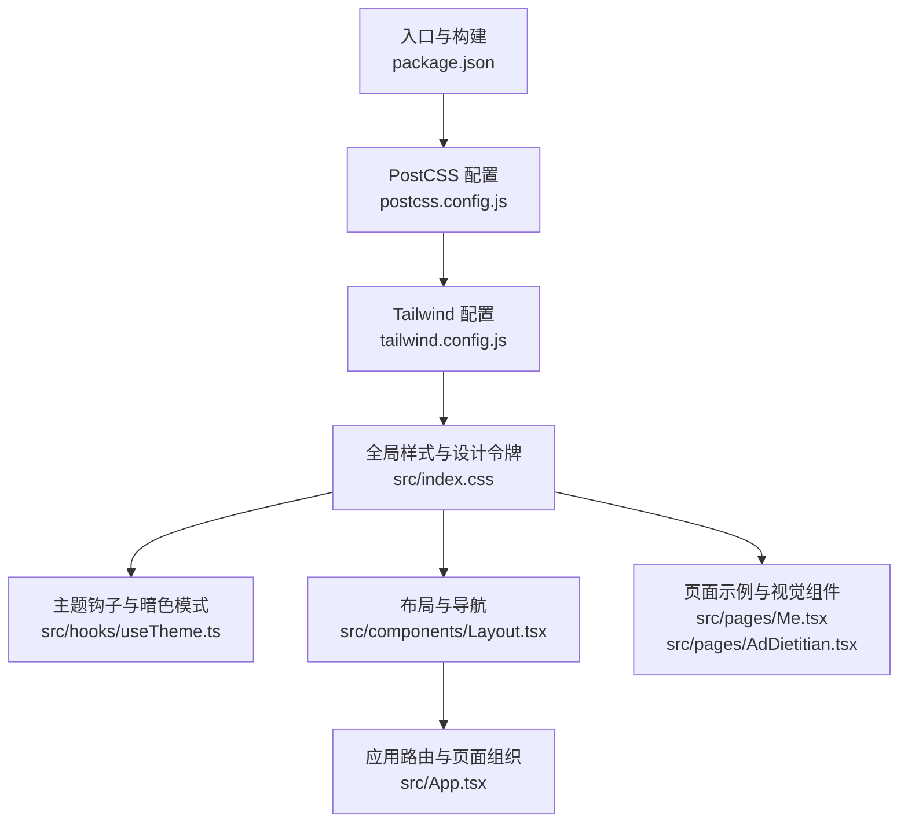
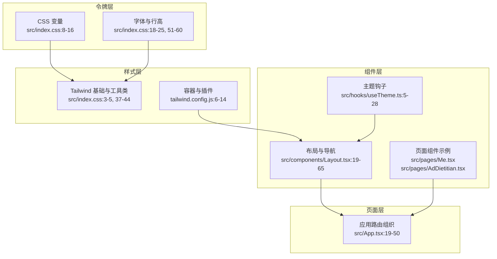
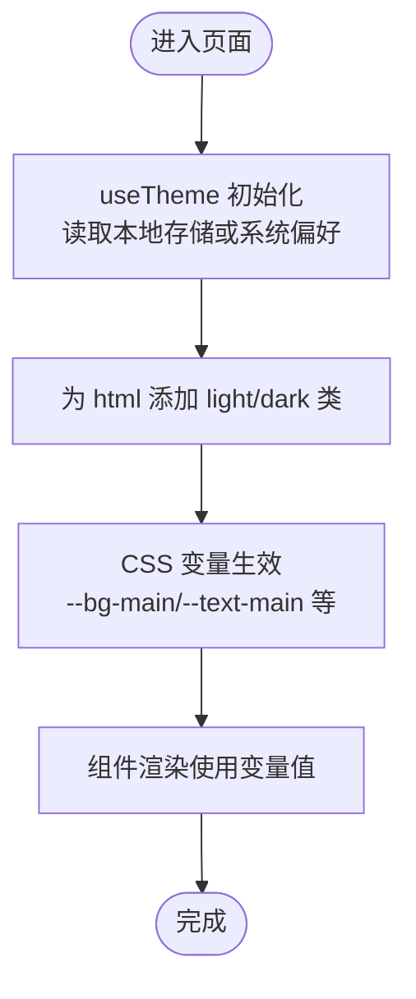
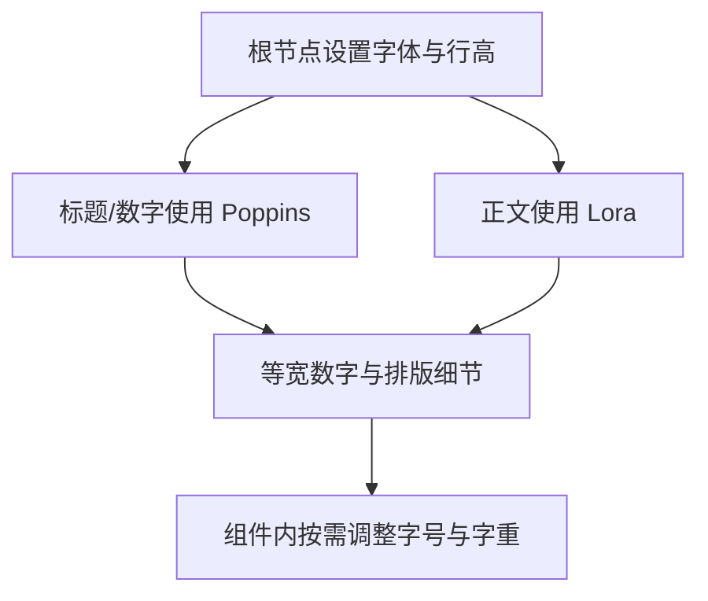
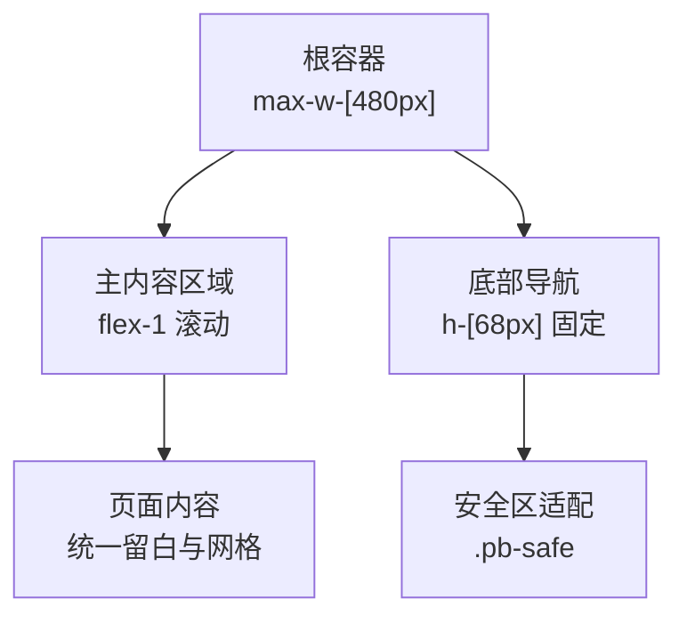
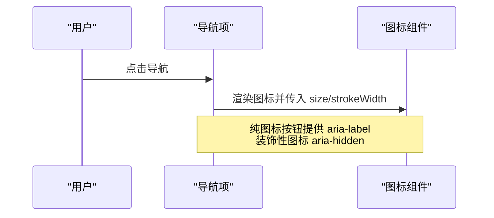
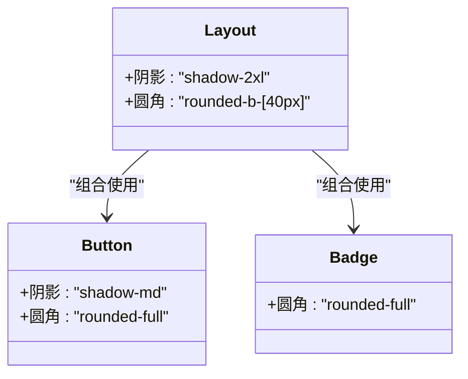
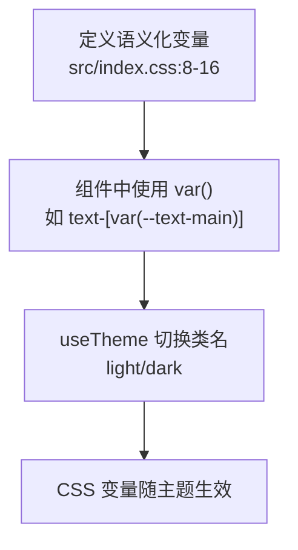
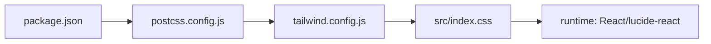

# 设计规范与标准

<cite>
**本文档引用的文件**
- [src/index.css](file://src/index.css)
- [tailwind.config.js](file://tailwind.config.js)
- [postcss.config.js](file://postcss.config.js)
- [.trae/documents/frontend_design_guidelines.md](file://.trae/documents/frontend_design_guidelines.md)
- [src/hooks/useTheme.ts](file://src/hooks/useTheme.ts)
- [src/components/Layout.tsx](file://src/components/Layout.tsx)
- [src/pages/Me.tsx](file://src/pages/Me.tsx)
- [src/pages/AdDietitian.tsx](file://src/pages/AdDietitian.tsx)
- [src/App.tsx](file://src/App.tsx)
- [package.json](file://package.json)
- [visual-companion.html](file://visual-companion.html)
</cite>

## 目录
1. [简介](#简介)
2. [项目结构](#项目结构)
3. [核心组件](#核心组件)
4. [架构总览](#架构总览)
5. [详细组件分析](#详细组件分析)
6. [依赖分析](#依赖分析)
7. [性能考虑](#性能考虑)
8. [故障排查指南](#故障排查指南)
9. [结论](#结论)
10. [附录](#附录)

## 简介
本文件系统化梳理并文档化本应用的设计系统核心规范，覆盖颜色系统、字体排版、间距与网格、设计令牌管理、图标与阴影、边框圆角、一致性保障与视觉层级、可访问性与对比度要求等。规范既来源于源码中的实际实现，也结合了设计文档中的指导原则，确保落地可执行、维护可持续。

## 项目结构
应用采用 React + Tailwind CSS 架构，通过 PostCSS 自动前缀与 Tailwind 处理原子类，配合自定义 CSS 变量与主题钩子实现品牌色与主题切换。整体结构清晰，便于扩展与维护。

图表来源
- [package.json:1-48](file://package.json#L1-L48)
- [postcss.config.js:1-11](file://postcss.config.js#L1-L11)
- [tailwind.config.js:1-16](file://tailwind.config.js#L1-L16)
- [src/index.css:1-61](file://src/index.css#L1-L61)
- [src/hooks/useTheme.ts:1-29](file://src/hooks/useTheme.ts#L1-L29)
- [src/components/Layout.tsx:1-66](file://src/components/Layout.tsx#L1-L66)
- [src/pages/Me.tsx:14-36](file://src/pages/Me.tsx#L14-L36)
- [src/pages/AdDietitian.tsx:104-124](file://src/pages/AdDietitian.tsx#L104-L124)
- [src/App.tsx:1-52](file://src/App.tsx#L1-L52)

章节来源
- [package.json:1-48](file://package.json#L1-L48)
- [postcss.config.js:1-11](file://postcss.config.js#L1-L11)
- [tailwind.config.js:1-16](file://tailwind.config.js#L1-L16)
- [src/index.css:1-61](file://src/index.css#L1-L61)
- [src/hooks/useTheme.ts:1-29](file://src/hooks/useTheme.ts#L1-L29)
- [src/components/Layout.tsx:1-66](file://src/components/Layout.tsx#L1-L66)
- [src/pages/Me.tsx:14-36](file://src/pages/Me.tsx#L14-L36)
- [src/pages/AdDietitian.tsx:104-124](file://src/pages/AdDietitian.tsx#L104-L124)
- [src/App.tsx:1-52](file://src/App.tsx#L1-L52)

## 核心组件
- 设计令牌与颜色系统：通过 CSS 变量集中管理品牌色与语义色，支持明暗主题切换。
- 字体排版：标题与正文分别采用不同字体族，正文使用 Lora 提升阅读沉浸感，标题使用 Poppins 强化结构感；提供等宽数字与排版细节规范。
- 间距与网格：容器居中、安全区适配、底部导航固定高度与内边距，形成稳定的网格与留白体系。
- 图标系统：统一使用 lucide-react，保持图标风格一致与可访问性。
- 阴影与圆角：通过 Tailwind 原子类与组件内样式组合，形成一致的阴影与圆角规范。
- 主题与可访问性：useTheme 钩子支持系统偏好与用户选择，焦点可见性与无障碍标签贯穿组件。

章节来源
- [src/index.css:7-44](file://src/index.css#L7-L44)
- [src/hooks/useTheme.ts:1-29](file://src/hooks/useTheme.ts#L1-L29)
- [src/components/Layout.tsx:19-65](file://src/components/Layout.tsx#L19-L65)
- [src/pages/Me.tsx:14-36](file://src/pages/Me.tsx#L14-L36)
- [src/pages/AdDietitian.tsx:104-124](file://src/pages/AdDietitian.tsx#L104-L124)
- [.trae/documents/frontend_design_guidelines.md:19-36](file://.trae/documents/frontend_design_guidelines.md#L19-L36)

## 架构总览
设计系统由“令牌层 → 样式层 → 组件层 → 页面层”逐级抽象，确保从基础变量到具体页面的一致性与可维护性。

图表来源
- [src/index.css:3-44](file://src/index.css#L3-L44)
- [tailwind.config.js:6-14](file://tailwind.config.js#L6-L14)
- [src/hooks/useTheme.ts:5-28](file://src/hooks/useTheme.ts#L5-L28)
- [src/components/Layout.tsx:19-65](file://src/components/Layout.tsx#L19-L65)
- [src/pages/Me.tsx:14-36](file://src/pages/Me.tsx#L14-L36)
- [src/pages/AdDietitian.tsx:104-124](file://src/pages/AdDietitian.tsx#L104-L124)
- [src/App.tsx:19-50](file://src/App.tsx#L19-L50)

## 详细组件分析

### 颜色系统与设计令牌
- 令牌定义：在基础层集中声明品牌主色与语义色，作为全局设计令牌。
- 语义化应用：主背景、主文本、次级文本、次级背景、强调色（医疗蓝、健康绿、警示橙）。
- 明暗主题：通过 useTheme 钩子切换类名，结合 CSS 变量实现主题切换与持久化。

图表来源
- [src/hooks/useTheme.ts:5-28](file://src/hooks/useTheme.ts#L5-L28)
- [src/index.css:8-16](file://src/index.css#L8-L16)

章节来源
- [src/index.css:8-16](file://src/index.css#L8-L16)
- [src/hooks/useTheme.ts:5-28](file://src/hooks/useTheme.ts#L5-L28)
- [.trae/documents/frontend_design_guidelines.md:8-18](file://.trae/documents/frontend_design_guidelines.md#L8-L18)

### 字体排版规范
- 字体族：标题与数字使用 Poppins，正文使用 Lora，提升专业度与阅读沉浸感。
- 排版细节：避免孤字、等宽数字、标准省略号、数字与单位间使用不换行空格。
- 行高与字重：全局行高与字重在根节点设定，组件内通过原子类微调。

图表来源
- [src/index.css:18-25](file://src/index.css#L18-L25)
- [src/index.css:51-60](file://src/index.css#L51-L60)
- [.trae/documents/frontend_design_guidelines.md:19-27](file://.trae/documents/frontend_design_guidelines.md#L19-L27)

章节来源
- [src/index.css:18-25](file://src/index.css#L18-L25)
- [src/index.css:51-60](file://src/index.css#L51-L60)
- [.trae/documents/frontend_design_guidelines.md:19-27](file://.trae/documents/frontend_design_guidelines.md#L19-L27)

### 间距体系、网格与布局
- 容器与宽度：容器居中，最大宽度约束于 480px，适配移动端。
- 底部安全区：使用安全区变量适配刘海屏与底部胶囊栏。
- 导航栏：固定底部导航，统一高度与内边距，状态反馈与焦点可见性良好。

图表来源
- [src/components/Layout.tsx:22-30](file://src/components/Layout.tsx#L22-L30)
- [src/index.css:37-44](file://src/index.css#L37-L44)

章节来源
- [src/components/Layout.tsx:22-30](file://src/components/Layout.tsx#L22-L30)
- [src/index.css:37-44](file://src/index.css#L37-L44)

### 图标系统与可访问性
- 图标库：统一使用 lucide-react，确保风格一致与体积可控。
- 可访问性：纯图标按钮提供 aria-label；装饰性图标使用 aria-hidden；图片设置明确尺寸防止 CLS。

图表来源
- [src/components/Layout.tsx:34-59](file://src/components/Layout.tsx#L34-L59)
- [.trae/documents/frontend_design_guidelines.md:32-36](file://.trae/documents/frontend_design_guidelines.md#L32-L36)

章节来源
- [src/components/Layout.tsx:34-59](file://src/components/Layout.tsx#L34-L59)
- [.trae/documents/frontend_design_guidelines.md:32-36](file://.trae/documents/frontend_design_guidelines.md#L32-L36)

### 阴影与边框圆角
- 阴影：组件容器使用阴影增强层级感，按钮与卡片根据场景适度添加阴影。
- 圆角：头部区域使用较大圆角，图标徽章与按钮使用中等圆角，保持视觉统一。

图表来源
- [src/components/Layout.tsx:23](file://src/components/Layout.tsx#L23)
- [src/pages/Me.tsx:18](file://src/pages/Me.tsx#L18)
- [src/pages/AdDietitian.tsx:116](file://src/pages/AdDietitian.tsx#L116)

章节来源
- [src/components/Layout.tsx:23](file://src/components/Layout.tsx#L23)
- [src/pages/Me.tsx:18](file://src/pages/Me.tsx#L18)
- [src/pages/AdDietitian.tsx:116](file://src/pages/AdDietitian.tsx#L116)

### 设计令牌管理与命名约定
- 命名约定：采用语义化变量名，如 --bg-main、--text-main、--medical-blue 等。
- 变量作用域：集中于基础层，组件通过 var() 引用，避免硬编码颜色。
- 可维护性策略：通过主题钩子与 CSS 变量解耦，新增/修改令牌无需改动组件。

图表来源
- [src/index.css:8-16](file://src/index.css#L8-L16)
- [src/hooks/useTheme.ts:14-18](file://src/hooks/useTheme.ts#L14-L18)

章节来源
- [src/index.css:8-16](file://src/index.css#L8-L16)
- [src/hooks/useTheme.ts:14-18](file://src/hooks/useTheme.ts#L14-L18)

### 视觉层级与一致性保障
- 层级建立：通过阴影、圆角、颜色与对比度建立信息层级；强调色用于关键动作与状态。
- 一致性：统一字体、字号、行高、圆角与阴影；导航与页面风格一致；图标风格统一。
- 主题一致性：明暗主题下颜色对比度与可读性保持稳定。

章节来源
- [src/components/Layout.tsx:38-56](file://src/components/Layout.tsx#L38-L56)
- [src/pages/Me.tsx:18-35](file://src/pages/Me.tsx#L18-L35)
- [src/pages/AdDietitian.tsx:105-121](file://src/pages/AdDietitian.tsx#L105-L121)
- [.trae/documents/frontend_design_guidelines.md:29-52](file://.trae/documents/frontend_design_guidelines.md#L29-L52)

## 依赖分析
- 构建链路：PostCSS 负责自动前缀与 Tailwind 处理；Tailwind 配置启用 typography 插件与容器居中。
- 运行时依赖：React 生态、lucide-react 图标、clsx/tailwind-merge 类名合并、zustand 状态管理等。
- 设计系统依赖：CSS 变量与 Tailwind 原子类共同构成样式基础设施。

图表来源
- [package.json:13-26](file://package.json#L13-L26)
- [postcss.config.js:5-10](file://postcss.config.js#L5-L10)
- [tailwind.config.js:3-15](file://tailwind.config.js#L3-L15)
- [src/index.css:1-6](file://src/index.css#L1-L6)

章节来源
- [package.json:13-26](file://package.json#L13-L26)
- [postcss.config.js:5-10](file://postcss.config.js#L5-L10)
- [tailwind.config.js:3-15](file://tailwind.config.js#L3-L15)
- [src/index.css:1-6](file://src/index.css#L1-L6)

## 性能考虑
- 动效克制：仅对 transform 与 opacity 动画，避免使用 transition: all。
- 性能友好：尊重系统减少动效偏好，长列表引入虚拟化。
- 渲染优化：使用原子类减少自定义样式开销，合理拆分组件降低重渲染。

章节来源
- [.trae/documents/frontend_design_guidelines.md:48-52](file://.trae/documents/frontend_design_guidelines.md#L48-L52)

## 故障排查指南
- 主题未生效：确认 useTheme 已在根节点设置类名，且 CSS 变量已正确引用。
- 图标不可访问：检查是否为纯图标按钮提供 aria-label，装饰性图标是否设置 aria-hidden。
- 底部遮挡：确认使用 .pb-safe 并检查安全区变量是否正确注入。
- 颜色不一致：检查是否直接硬编码颜色，应统一使用 CSS 变量或 Tailwind 语义色。

章节来源
- [src/hooks/useTheme.ts:14-18](file://src/hooks/useTheme.ts#L14-L18)
- [src/index.css:37-44](file://src/index.css#L37-L44)
- [src/components/Layout.tsx:38-59](file://src/components/Layout.tsx#L38-L59)

## 结论
本设计系统以 CSS 变量为核心令牌，结合 Tailwind 原子类与 React 组件实现高内聚低耦合的样式体系；通过明暗主题钩子与可访问性规范保障跨设备与无障碍体验；在字体、间距、阴影与圆角等方面形成统一的视觉语言。建议持续沿用语义化变量命名与主题切换机制，确保长期可维护性与一致性。

## 附录
- 主题预览：可视化预览页展示了多套主题风格，便于设计评审与快速切换。

章节来源
- [visual-companion.html:62-90](file://visual-companion.html#L62-L90)