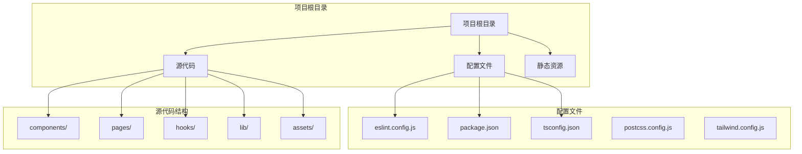
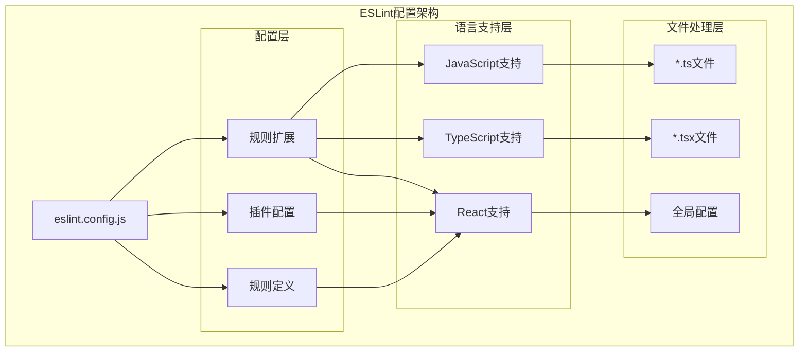
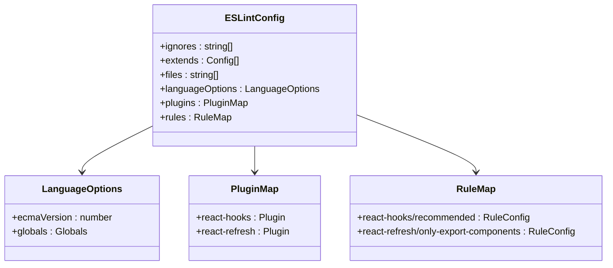
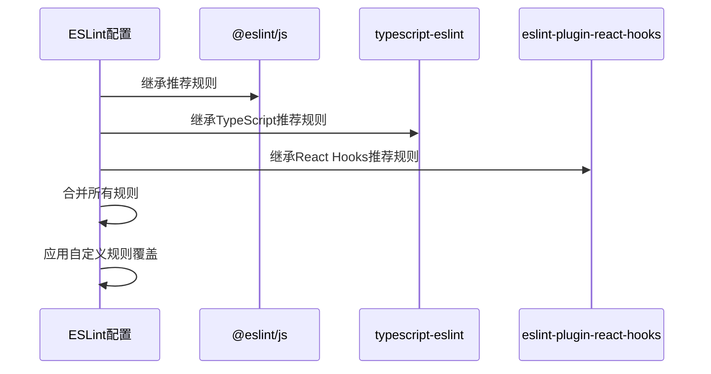
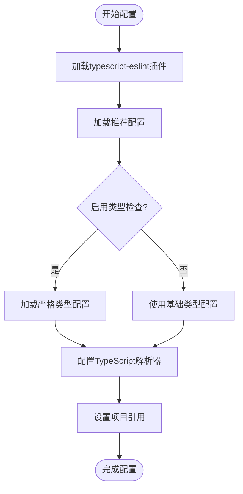
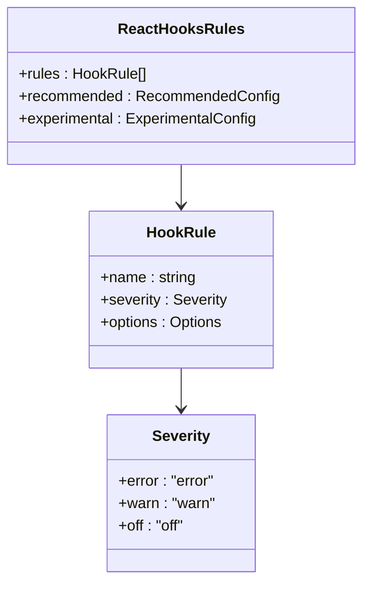
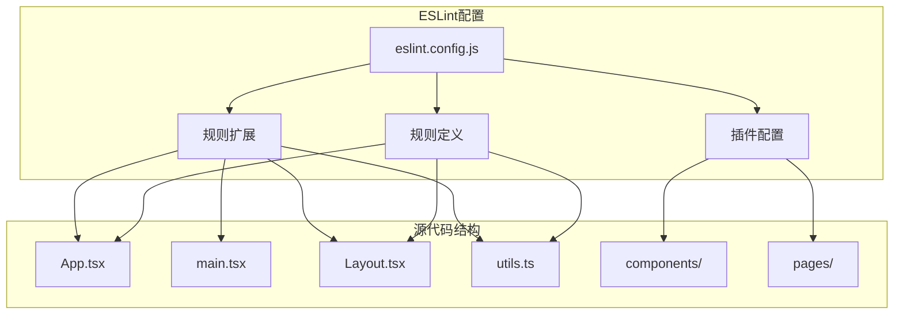

# ESLint代码规范

<cite>
**本文档引用的文件**
- [eslint.config.js](file://eslint.config.js)
- [package.json](file://package.json)
- [README.md](file://README.md)
- [tsconfig.json](file://tsconfig.json)
- [src/App.tsx](file://src/App.tsx)
- [src/main.tsx](file://src/main.tsx)
- [src/components/Layout.tsx](file://src/components/Layout.tsx)
- [src/lib/utils.ts](file://src/lib/utils.ts)
</cite>

## 目录
1. [简介](#简介)
2. [项目结构](#项目结构)
3. [核心组件](#核心组件)
4. [架构概览](#架构概览)
5. [详细组件分析](#详细组件分析)
6. [依赖关系分析](#依赖关系分析)
7. [性能考虑](#性能考虑)
8. [故障排除指南](#故障排除指南)
9. [结论](#结论)

## 简介

本项目采用现代化的ESLint配置方案，基于ESLint v9的新式配置格式（eslint.config.js），为React + TypeScript + Vite项目提供全面的代码质量保障。该配置通过类型感知的TypeScript ESLint插件，结合React特定的lint规则，确保代码的一致性、可维护性和最佳实践遵循。

## 项目结构

该项目是一个React + TypeScript + Vite的现代前端应用，具有清晰的模块化结构：



**图表来源**
- [eslint.config.js:1-29](file://eslint.config.js#L1-L29)
- [package.json:1-48](file://package.json#L1-L48)
- [tsconfig.json:1-38](file://tsconfig.json#L1-L38)

**章节来源**
- [eslint.config.js:1-29](file://eslint.config.js#L1-L29)
- [package.json:1-48](file://package.json#L1-L48)
- [tsconfig.json:1-38](file://tsconfig.json#L1-L38)

## 核心组件

### ESLint配置核心组件

项目的核心ESLint配置由以下关键组件构成：

#### 配置扩展系统
- **基础JavaScript规则**: 继承自`@eslint/js`的推荐规则集
- **TypeScript规则**: 使用`typescript-eslint`提供的推荐配置
- **文件匹配**: 专门针对`.ts`和`.tsx`文件的配置

#### 插件生态系统
- **React Hooks**: 提供React Hooks的最佳实践检查
- **React Refresh**: 确保React组件的正确导出模式
- **全局变量**: 支持浏览器环境的全局变量识别

#### 规则定制
- **Hook推荐规则**: 基于React Hooks官方推荐配置
- **组件导出规则**: 严格检查React组件的导出模式
- **警告级别**: 将特定规则设置为警告而非错误

**章节来源**
- [eslint.config.js:7-28](file://eslint.config.js#L7-L28)
- [package.json:27-46](file://package.json#L27-L46)

## 架构概览

ESLint配置的整体架构采用分层设计，确保不同类型文件得到适当的处理：



**图表来源**
- [eslint.config.js:7-28](file://eslint.config.js#L7-L28)
- [package.json:27-46](file://package.json#L27-L46)

## 详细组件分析

### ESLint配置文件分析

#### 主要配置结构
配置文件采用ESLint v9的推荐格式，提供了清晰的层次化结构：



**图表来源**
- [eslint.config.js:7-28](file://eslint.config.js#L7-L28)

#### 文件匹配策略
配置采用精确的文件匹配机制：
- **目标文件**: `**/*.{ts,tsx}` - 仅处理TypeScript和TypeScript JSX文件
- **忽略目录**: `dist` - 跳过构建输出目录
- **语言选项**: 设置ECMAScript 2020标准和浏览器全局变量

#### 规则继承机制


**图表来源**
- [eslint.config.js:10-26](file://eslint.config.js#L10-L26)

**章节来源**
- [eslint.config.js:1-29](file://eslint.config.js#L1-L29)

### TypeScript集成分析

#### 类型感知配置
项目通过TypeScript ESLint插件实现深度的类型感知：



**图表来源**
- [README.md:14-32](file://README.md#L14-L32)

#### 项目配置映射
TypeScript配置与ESLint配置保持一致的文件处理策略：

| 配置项 | ESLint配置 | TypeScript配置 |
|--------|------------|----------------|
| 目标文件 | `**/*.{ts,tsx}` | `src/**/*.{ts,tsx}` |
| 忽略目录 | `dist` | `build` |
| 语言版本 | ES2020 | ES2020 |
| 模块系统 | ESNext | ESNext |
| JSX处理 | `react-jsx` | `react-jsx` |

**章节来源**
- [tsconfig.json:1-38](file://tsconfig.json#L1-L38)
- [eslint.config.js:10-11](file://eslint.config.js#L10-L11)

### React特定规则分析

#### Hook规则配置
React Hooks插件提供了全面的Hook使用检查：



**图表来源**
- [eslint.config.js:21-25](file://eslint.config.js#L21-L25)

#### 组件导出规则
`react-refresh/only-export-components`规则确保组件的正确导出模式：

| 导出类型 | 允许状态 | 说明 |
|----------|----------|------|
| 函数组件 | ✅ 允许 | 标准函数组件导出 |
| 箭头函数组件 | ✅ 允许 | 箭头函数组件导出 |
| 常量导出 | ✅ 允许 | `allowConstantExport: true` |
| 默认导出 | ⚠️ 警告 | 可能影响热重载 |
| 匿名导出 | ❌ 错误 | 不允许匿名组件导出 |

**章节来源**
- [eslint.config.js:22-25](file://eslint.config.js#L22-L25)

## 依赖关系分析

### 外部依赖关系

项目ESLint配置依赖于多个关键包：

```mermaid
graph LR
subgraph "ESLint生态系统"
ESLintCore[eslint@^9.25.0]
JSPlugin[@eslint/js@^9.25.0]
TSESLint[typescript-eslint@^8.30.1]
Globals[globals@^16.0.0]
end
subgraph "React插件生态"
ReactHooks[eslint-plugin-react-hooks@^5.2.0]
ReactRefresh[eslint-plugin-react-refresh@^0.4.19]
ReactPlugin[eslint-plugin-react@^7.x]
end
subgraph "开发工具"
Vite[vite@^6.3.5]
TypeScript[typescript@~5.8.3]
TailwindCSS[tailwindcss@^3.4.17]
end
ESLintCore --> JSPlugin
ESLintCore --> TSESLint
ESLintCore --> ReactHooks
ESLintCore --> ReactRefresh
ESLintCore --> Globals
TSESLint --> TypeScript
ReactHooks --> ReactPlugin
```

**图表来源**
- [package.json:27-46](file://package.json#L27-L46)

### 内部依赖关系

项目内部的ESLint配置与源代码结构存在密切关系：



**图表来源**
- [eslint.config.js:7-28](file://eslint.config.js#L7-L28)
- [src/App.tsx:1-52](file://src/App.tsx#L1-L52)
- [src/components/Layout.tsx:1-66](file://src/components/Layout.tsx#L1-L66)

**章节来源**
- [package.json:1-48](file://package.json#L1-L48)

## 性能考虑

### 配置优化策略

ESLint配置在性能方面采用了多项优化措施：

#### 缓存机制
- **增量检查**: 利用TypeScript的构建信息进行增量编译
- **文件监听**: 仅处理变更的文件，避免全量扫描
- **内存管理**: 合理的内存使用策略，避免长时间运行时的内存泄漏

#### 扫描优化
- **精确匹配**: 使用精确的文件模式避免不必要的文件扫描
- **忽略配置**: 合理的忽略列表减少处理时间
- **并发处理**: 利用多核处理器并行处理不同类型的文件

#### 规则执行效率
- **早期失败**: 对于明显错误的规则优先级较低
- **智能缓存**: 对于重复的检查结果进行缓存
- **按需加载**: 插件和规则按需加载，减少启动时间

## 故障排除指南

### 常见问题及解决方案

#### 规则冲突问题
当遇到规则冲突时，可以采取以下策略：

1. **优先级确定**: ESLint遵循"最后声明的规则生效"原则
2. **规则覆盖**: 在配置中明确指定需要覆盖的规则
3. **插件分离**: 将不同插件的规则分离到不同的配置块中

#### 类型检查问题
对于TypeScript相关的检查问题：

1. **项目配置**: 确保TypeScript项目配置正确
2. **路径映射**: 检查路径映射是否与ESLint配置一致
3. **类型声明**: 确保所有必要的类型声明文件存在

#### 性能问题
如果遇到ESLint运行缓慢的问题：

1. **文件过滤**: 检查文件匹配模式是否过于宽泛
2. **忽略列表**: 添加不必要的目录到忽略列表
3. **规则禁用**: 临时禁用性能开销较大的规则

### 调试技巧

#### 启用详细日志
通过命令行参数启用更详细的诊断信息：
- `--debug`: 输出调试信息
- `--print-config`: 显示最终的配置
- `--fix`: 自动修复可修复的问题

#### 配置验证
定期验证配置文件的有效性：
- 使用`eslint --print-config`检查最终配置
- 运行`eslint --dry-run`测试配置但不执行修复
- 检查是否有未使用的配置项

**章节来源**
- [eslint.config.js:8](file://eslint.config.js#L8)
- [README.md:10-32](file://README.md#L10-L32)

## 结论

本项目的ESLint配置展现了现代前端开发的最佳实践，通过精心设计的配置结构实现了代码质量的全面保障。配置的核心优势包括：

### 技术优势
- **类型感知**: 通过TypeScript ESLint插件实现深度的类型检查
- **React专用**: 针对React应用的特定规则和最佳实践
- **模块化设计**: 清晰的配置分层和规则继承机制
- **性能优化**: 合理的文件匹配和缓存策略

### 团队协作价值
- **一致性**: 统一的代码风格和质量标准
- **自动化**: CI/CD流程中的自动化代码检查
- **可维护性**: 清晰的配置结构便于维护和修改
- **扩展性**: 支持根据项目需求添加新的规则和插件

### 最佳实践建议
1. **持续改进**: 定期评估和更新规则配置
2. **团队培训**: 确保团队成员理解规则的意义和用途
3. **渐进式引入**: 新增规则时采用渐进式的方式
4. **文档维护**: 保持配置文档与实际使用的一致性

通过这套ESLint配置，项目能够在保证开发效率的同时，维持高质量的代码标准，为长期的项目维护奠定坚实的基础。