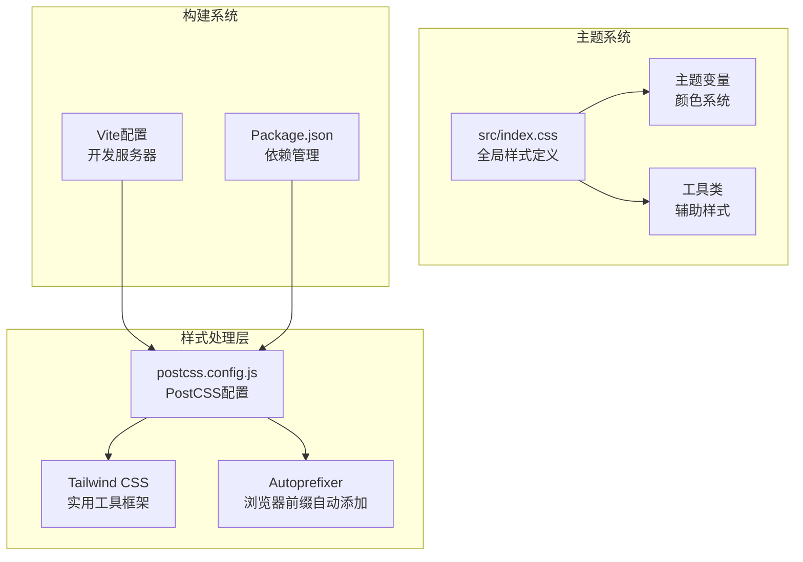
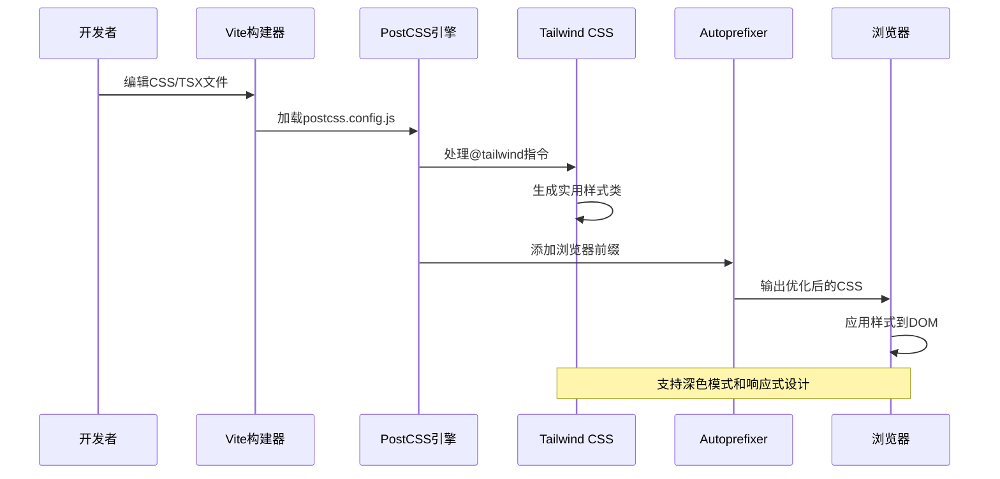
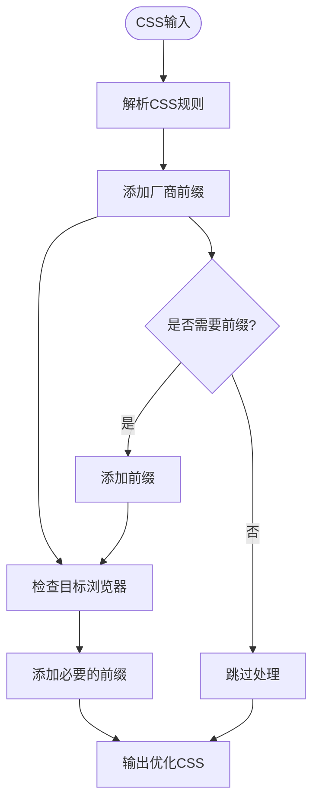
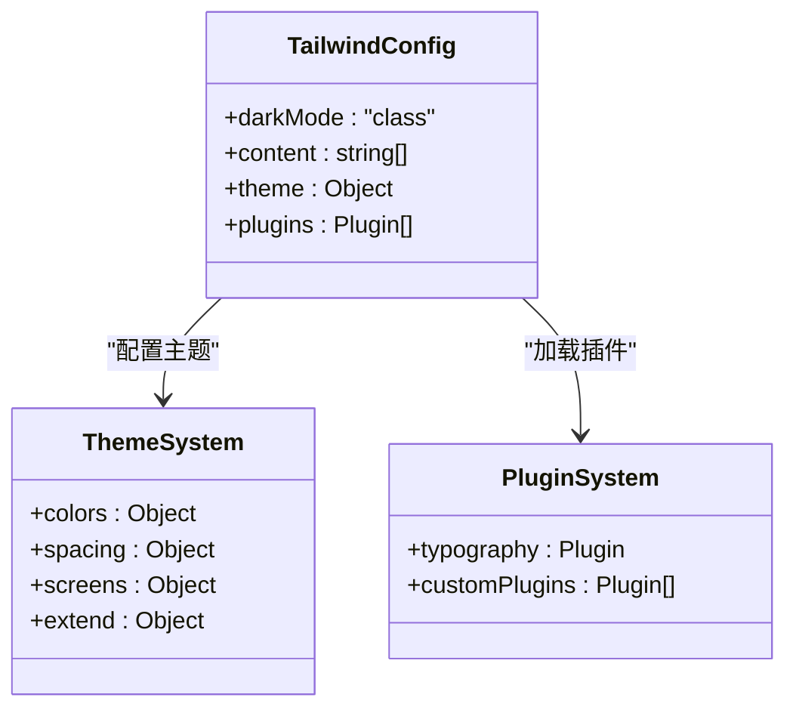
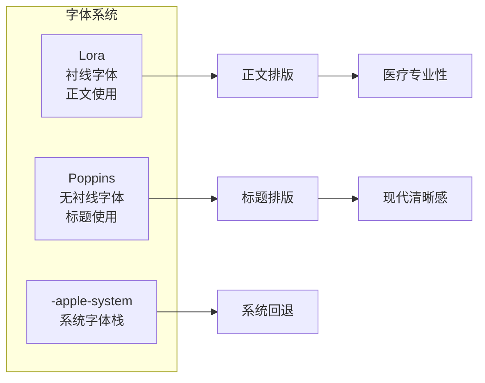
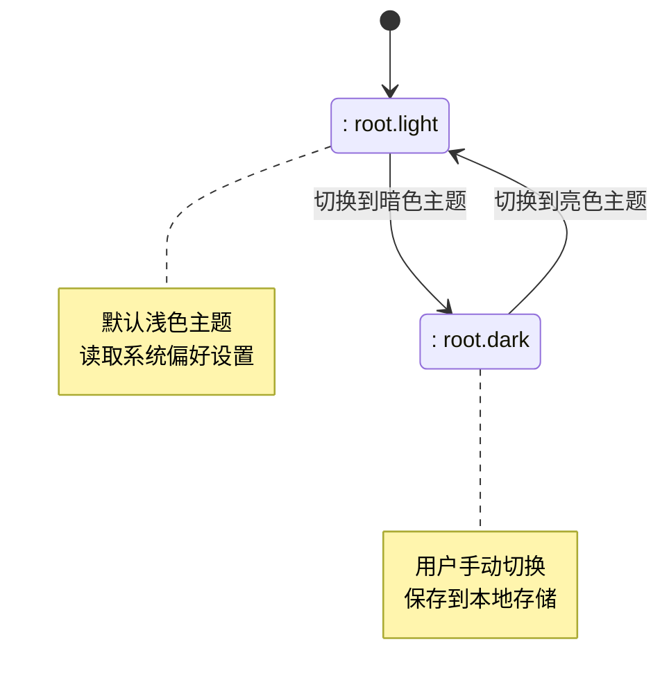
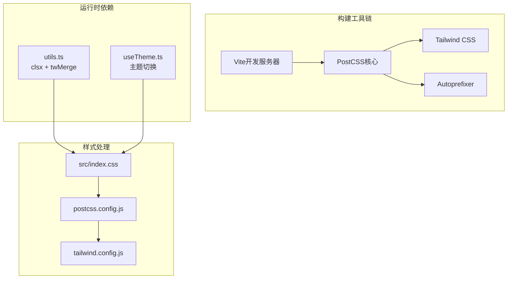
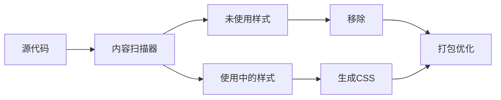

# PostCSS样式处理

<cite>
**本文档引用的文件**
- [postcss.config.js](file://postcss.config.js)
- [tailwind.config.js](file://tailwind.config.js)
- [package.json](file://package.json)
- [src/index.css](file://src/index.css)
- [vite.config.ts](file://vite.config.ts)
- [src/hooks/useTheme.ts](file://src/hooks/useTheme.ts)
- [src/components/Layout.tsx](file://src/components/Layout.tsx)
- [src/lib/utils.ts](file://src/lib/utils.ts)
</cite>

## 目录
1. [简介](#简介)
2. [项目结构](#项目结构)
3. [核心组件](#核心组件)
4. [架构概览](#架构概览)
5. [详细组件分析](#详细组件分析)
6. [依赖关系分析](#依赖关系分析)
7. [性能考虑](#性能考虑)
8. [故障排除指南](#故障排除指南)
9. [结论](#结论)

## 简介

本项目采用现代化的CSS处理工作流程，结合PostCSS、Tailwind CSS和Autoprefixer实现高效的样式处理和浏览器兼容性。该配置专注于医疗健康应用的视觉设计，提供了完整的主题系统、响应式设计和性能优化方案。

## 项目结构

项目的样式处理架构围绕以下核心文件构建：



**图表来源**
- [postcss.config.js:1-11](file://postcss.config.js#L1-L11)
- [tailwind.config.js:1-16](file://tailwind.config.js#L1-L16)
- [src/index.css:1-61](file://src/index.css#L1-L61)

**章节来源**
- [postcss.config.js:1-11](file://postcss.config.js#L1-L11)
- [tailwind.config.js:1-16](file://tailwind.config.js#L1-L16)
- [src/index.css:1-61](file://src/index.css#L1-L61)

## 核心组件

### PostCSS配置系统

PostCSS作为中间件处理所有CSS转换，当前配置包含两个核心插件：

- **Tailwind CSS**: 实用优先的CSS框架，提供原子化样式类
- **Autoprefixer**: 自动添加浏览器兼容性前缀

### Tailwind CSS定制化

Tailwind配置实现了医疗健康应用的专业设计需求：

- **深色模式支持**: 基于class模式的暗色主题切换
- **内容扫描**: 自动从HTML和TypeScript文件中提取使用到的样式
- **扩展主题**: 支持进一步的主题定制和插件集成

### 主题变量系统

项目建立了完整的CSS自定义属性主题系统：

- **基础色彩**: 主背景、主文本、次要文本、背景色
- **医疗专用色彩**: 医疗蓝、健康绿、警示橙
- **字体系统**: Lora衬线字体用于正文，Poppins无衬线字体用于标题
- **安全区域适配**: 支持iOS安全区域的内边距处理

**章节来源**
- [postcss.config.js:5-10](file://postcss.config.js#L5-L10)
- [tailwind.config.js:3-15](file://tailwind.config.js#L3-L15)
- [src/index.css:7-44](file://src/index.css#L7-L44)

## 架构概览

整个样式处理流程从源码到最终输出的完整路径：



**图表来源**
- [postcss.config.js:5-10](file://postcss.config.js#L5-L10)
- [tailwind.config.js:4-5](file://tailwind.config.js#L4-L5)
- [vite.config.ts:7-21](file://vite.config.ts#L7-L21)

## 详细组件分析

### PostCSS插件配置

#### Autoprefixer插件

Autoprefixer负责自动添加浏览器兼容性前缀，确保样式在目标浏览器中正常工作：



**图表来源**
- [postcss.config.js:8](file://postcss.config.js#L8)

#### Tailwind CSS插件

Tailwind CSS通过原子化方法提供高效的设计系统：



**图表来源**
- [tailwind.config.js:3-15](file://tailwind.config.js#L3-L15)

**章节来源**
- [postcss.config.js:5-10](file://postcss.config.js#L5-L10)
- [tailwind.config.js:3-15](file://tailwind.config.js#L3-L15)

### Tailwind CSS主题定制

#### 颜色系统设计

项目实现了专业的医疗健康色彩体系：

| 色彩类别 | 颜色值 | 用途 |
|---------|--------|------|
| 主背景色 | `#faf9f5` | 页面主背景，米白色 |
| 主文本色 | `#141413` | 正文主要文字 |
| 次要文本 | `#b0aea5` | 辅助信息、时间戳 |
| 医疗蓝 | `#6a9bcc` | 主要按钮、激活状态 |
| 健康绿 | `#788c5d` | 成功状态、健康指标 |
| 警示橙 | `#d97757` | 警告、异常指标 |

#### 字体系统配置



**图表来源**
- [src/index.css:18-25](file://src/index.css#L18-L25)

**章节来源**
- [src/index.css:7-44](file://src/index.css#L7-L44)

### 深色模式实现

项目采用class模式的深色主题切换机制：



**图表来源**
- [tailwind.config.js:4](file://tailwind.config.js#L4)
- [src/hooks/useTheme.ts:14-18](file://src/hooks/useTheme.ts#L14-L18)

**章节来源**
- [tailwind.config.js:4](file://tailwind.config.js#L4)
- [src/hooks/useTheme.ts:1-29](file://src/hooks/useTheme.ts#L1-L29)

### 工具类和辅助样式

项目提供了专门的工具类来处理移动设备的特殊需求：

#### 安全区域适配

```mermaid
flowchart TD
SafeArea[安全区域检测] --> EnvVar[env(safe-area-inset-bottom)]
EnvVar --> PaddingCalc[计算底部内边距]
PaddingCalc --> ApplyPadding[应用到元素]
ApplyPadding --> Mobile[移动设备适配]
ApplyPadding --> iOS[iOS Safari优化]
Mobile --> FullHeight[全屏显示]
iOS --> NotchSupport[刘海屏支持]
```

**图表来源**
- [src/index.css:37-44](file://src/index.css#L37-L44)

**章节来源**
- [src/index.css:37-44](file://src/index.css#L37-L44)

### 组件级样式集成

#### 布局组件样式

布局组件展示了如何有效使用Tailwind CSS和自定义工具类：

```mermaid
graph TB
subgraph "布局组件样式"
Container[容器样式<br/>max-w-[480px]<br/>mx-auto<br/>shadow-2xl]
Nav[导航栏样式<br/>border-t<br/>pb-safe<br/>flex布局]
ActiveState[激活状态<br/>text-[#6a9bcc]<br/>scale-110]
HoverState[悬停状态<br/>text-[#141413]<br/>hover:text-[#141413]]
end
Container --> Nav
Nav --> ActiveState
Nav --> HoverState
ActiveState --> Animation[平滑过渡动画]
HoverState --> Transition[状态切换效果]
```

**图表来源**
- [src/components/Layout.tsx:23-62](file://src/components/Layout.tsx#L23-L62)

**章节来源**
- [src/components/Layout.tsx:19-66](file://src/components/Layout.tsx#L19-L66)

## 依赖关系分析

### 核心依赖关系



**图表来源**
- [package.json:13-46](file://package.json#L13-L46)
- [postcss.config.js:5-10](file://postcss.config.js#L5-L10)
- [tailwind.config.js:12-14](file://tailwind.config.js#L12-L14)

### 版本兼容性

项目使用的依赖版本确保了最佳的兼容性和稳定性：

- **PostCSS**: 8.5.3 (最新稳定版本)
- **Tailwind CSS**: 3.4.17 (支持最新的CSS特性)
- **Autoprefixer**: 10.4.21 (浏览器兼容性最佳实践)
- **Vite**: 6.3.5 (快速开发体验)

**章节来源**
- [package.json:27-46](file://package.json#L27-L46)

## 性能考虑

### 样式优化策略

#### Tree Shaking优化

项目通过Tailwind CSS的按需生成机制实现样式树抖动：



#### 构建时优化

- **Source Map**: 使用隐藏的source map进行调试但不影响生产包大小
- **压缩处理**: 生产环境自动压缩CSS文件
- **缓存策略**: 利用浏览器缓存机制提升二次加载速度

### 浏览器兼容性

#### 兼容性矩阵

| 浏览器 | 支持版本 | 前缀需求 | 特性支持 |
|--------|----------|----------|----------|
| Chrome | 80+ | 无 | 完整支持 |
| Firefox | 70+ | 无 | 完整支持 |
| Safari | 14+ | 无 | 完整支持 |
| Edge | 80+ | 无 | 完整支持 |
| IE | 不支持 | - | - |

### 性能监控建议

- **Lighthouse评分**: 建议保持在90分以上
- **CLS (累积布局偏移)**: 控制在0.1以下
- **TTI (首次交互时间)**: 优化至3秒以内

## 故障排除指南

### 常见问题及解决方案

#### 样式不生效

**问题**: Tailwind CSS类名不被识别
**解决方案**:
1. 检查tailwind.config.js中的content配置
2. 确保文件路径正确匹配
3. 重启开发服务器

#### 深色模式切换失效

**问题**: 切换主题后样式不更新
**解决方案**:
1. 检查useTheme hook的状态管理
2. 确认CSS变量的正确应用
3. 验证浏览器的localStorage权限

#### 移动端适配问题

**问题**: 安全区域显示异常
**解决方案**:
1. 检查pb-safe工具类的使用
2. 验证env(safe-area-inset-bottom)的兼容性
3. 测试不同设备的刘海屏适配

**章节来源**
- [tailwind.config.js:5](file://tailwind.config.js#L5)
- [src/hooks/useTheme.ts:14-18](file://src/hooks/useTheme.ts#L14-L18)
- [src/index.css:37-44](file://src/index.css#L37-L44)

## 结论

本项目的PostCSS样式处理配置展现了现代化前端开发的最佳实践。通过合理的插件组合、完善的主题系统和性能优化策略，为医疗健康应用提供了专业、可靠且高性能的视觉体验。

### 关键优势

1. **原子化设计**: Tailwind CSS的实用优先方法提供了高度的样式复用性
2. **深色模式支持**: 完善的主题切换机制满足不同用户需求
3. **浏览器兼容**: Autoprefixer确保跨浏览器的一致性表现
4. **性能优化**: 按需生成和构建时优化提升了整体性能
5. **可维护性**: 清晰的配置结构便于团队协作和长期维护

### 未来改进方向

- 考虑集成PurgeCSS进行更激进的样式清理
- 实现更细粒度的响应式断点配置
- 添加样式linting规则确保代码质量
- 优化深色模式的过渡动画效果