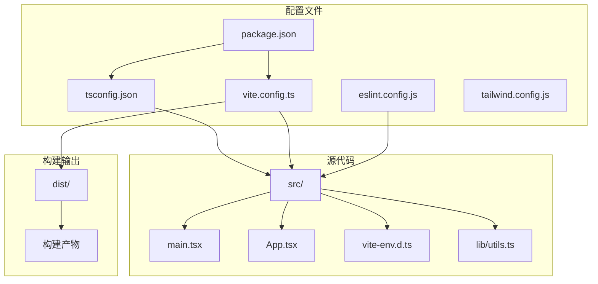
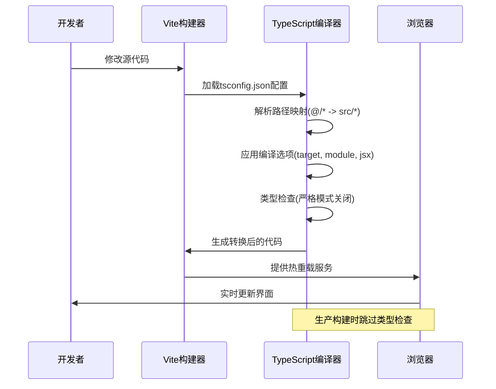
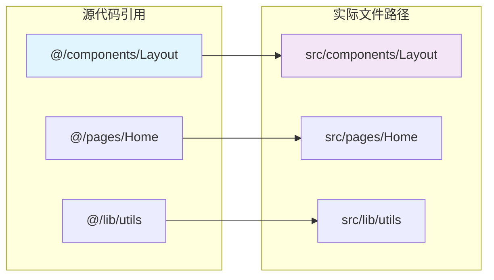
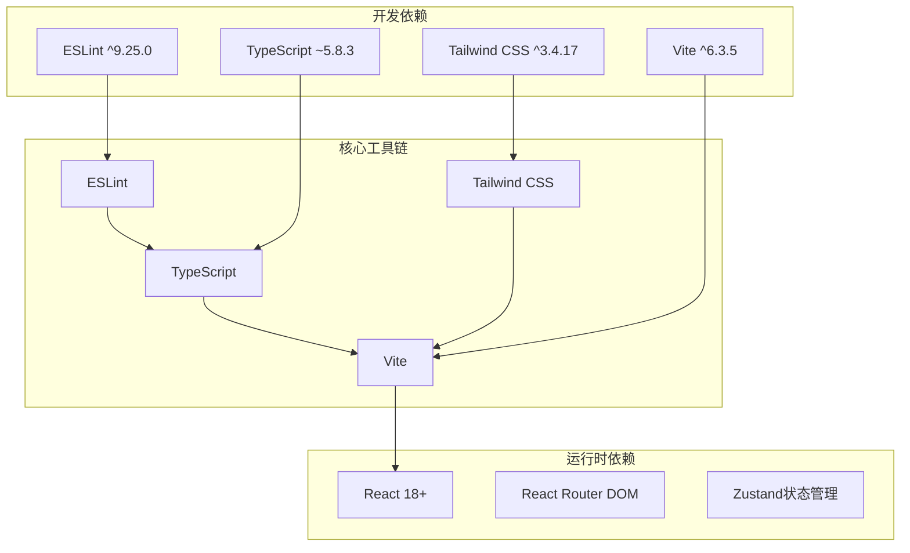

# TypeScript配置

<cite>
**本文档引用的文件**
- [tsconfig.json](file://tsconfig.json)
- [vite.config.ts](file://vite.config.ts)
- [src/vite-env.d.ts](file://src/vite-env.d.ts)
- [package.json](file://package.json)
- [eslint.config.js](file://eslint.config.js)
- [tailwind.config.js](file://tailwind.config.js)
- [src/main.tsx](file://src/main.tsx)
- [src/App.tsx](file://src/App.tsx)
- [src/lib/utils.ts](file://src/lib/utils.ts)
</cite>

## 目录
1. [简介](#简介)
2. [项目结构](#项目结构)
3. [核心组件](#核心组件)
4. [架构概览](#架构概览)
5. [详细组件分析](#详细组件分析)
6. [依赖关系分析](#依赖关系分析)
7. [性能考虑](#性能考虑)
8. [故障排除指南](#故障排除指南)
9. [结论](#结论)
10. [附录](#附录)

## 简介

本项目采用现代TypeScript开发栈，结合Vite构建工具实现高性能的前端开发体验。本文档深入解析TypeScript编译配置，涵盖编译选项、严格模式、路径映射、类型检查规则以及Vite环境声明文件的作用机制。同时提供开发体验优化建议、性能考量和常见问题解决方案。

## 项目结构

该项目采用标准的React + TypeScript + Vite项目结构，主要配置文件分布如下：

**图表来源**
- [tsconfig.json:1-38](file://tsconfig.json#L1-L38)
- [vite.config.ts:1-22](file://vite.config.ts#L1-L22)
- [package.json:1-48](file://package.json#L1-L48)

**章节来源**
- [tsconfig.json:1-38](file://tsconfig.json#L1-L38)
- [vite.config.ts:1-22](file://vite.config.ts#L1-L22)
- [package.json:1-48](file://package.json#L1-L48)

## 核心组件

### 编译器配置核心选项

项目使用了现代化的TypeScript编译配置，重点关注以下关键选项：

**目标平台配置**
- 目标版本：ES2020，确保现代JavaScript特性支持
- 模块系统：ESNext，配合Vite实现原生ES模块支持
- 库文件：包含DOM和DOM.Iterable，为浏览器环境提供完整类型支持

**严格性配置**
- 严格模式：关闭（strict: false），降低学习门槛但需要其他约束措施
- 未使用变量检测：关闭（noUnusedLocals: false）
- 未使用参数检测：关闭（noUnusedParameters: false）

**路径映射配置**
- 基础路径：./，相对于项目根目录
- 路径别名：@/* 映射到 ./src/*
- 支持TS扩展名导入：allowImportingTsExtensions: true

**开发体验优化**
- 跳过库检查：skipLibCheck: true，提升编译速度
- 模块解析：node，与Vite集成更顺畅
- JSX处理：react-jsx，专门为React 18+优化

**章节来源**
- [tsconfig.json:2-31](file://tsconfig.json#L2-L31)

### Vite集成配置

Vite配置与TypeScript紧密集成，提供以下功能：

**插件生态**
- React插件：@vitejs/plugin-react，支持JSX转换和热重载
- 路径解析插件：vite-tsconfig-paths，自动解析tsconfig.json中的路径映射
- 构建优化：隐藏源码映射，减少生产包体积

**构建配置**
- 源码映射：hidden模式，平衡调试需求和包大小
- 开发工具：react-dev-locator插件，增强开发体验

**章节来源**
- [vite.config.ts:1-22](file://vite.config.ts#L1-L22)

## 架构概览

TypeScript编译流程在项目中的作用机制：

**图表来源**
- [tsconfig.json:26-31](file://tsconfig.json#L26-L31)
- [vite.config.ts:11-20](file://vite.config.ts#L11-L20)

## 详细组件分析

### TypeScript编译配置详解

#### 目标版本和模块系统

项目采用ES2020目标版本，配合ESNext模块系统，这种组合提供了以下优势：

**性能优势**
- 现代浏览器原生支持，无需额外转译
- 更小的打包体积，因为不需要polyfill
- 更快的编译速度

**兼容性考虑**
- 需要现代浏览器支持
- 可能需要polyfill处理旧环境

#### 严格模式配置策略

当前配置选择关闭严格模式的原因分析：

**开发友好性**
- 降低新开发者的学习曲线
- 减少初期项目设置复杂度

**替代约束措施**
- ESLint规则集提供代码质量保证
- TypeScript类型检查仍保持基本功能
- 通过其他工具链维护代码质量

#### 路径映射系统

路径映射配置展现了现代TypeScript项目的最佳实践：

**图表来源**
- [tsconfig.json:27-31](file://tsconfig.json#L27-L31)

**章节来源**
- [tsconfig.json:26-31](file://tsconfig.json#L26-L31)

### Vite环境声明文件

#### vite-env.d.ts的作用机制

环境声明文件为Vite特定的客户端API提供类型支持：

**类型声明功能**
- Vite内置模块类型定义
- 环境变量类型推断
- 插件API类型支持

**集成方式**
- 自动包含在编译上下文中
- 与tsconfig.json的include配置协同工作
- 支持开发时智能提示

**章节来源**
- [src/vite-env.d.ts:1-2](file://src/vite-env.d.ts#L1-L2)

### 代码示例分析

#### 主应用入口配置

主入口文件展示了TypeScript在实际项目中的应用：

**模块导入模式**
- 使用ES模块语法
- 支持路径映射简化导入
- 类型安全的组件导入

**类型推断机制**
- React组件类型自动推断
- 路由组件的类型安全
- CSS模块的类型支持

**章节来源**
- [src/main.tsx:1-11](file://src/main.tsx#L1-L11)
- [src/App.tsx:1-52](file://src/App.tsx#L1-L52)

#### 工具函数类型设计

工具函数展示了TypeScript类型系统的实用性：

**类型安全的函数设计**
- 参数类型明确声明
- 返回值类型自动推断
- 组合函数的类型推导

**第三方库集成**
- clsx库的类型支持
- tailwind-merge的类型安全
- 完整的类型推断链

**章节来源**
- [src/lib/utils.ts:1-7](file://src/lib/utils.ts#L1-L7)

## 依赖关系分析

### 开发工具链集成

项目采用多层工具链协作的架构：

**图表来源**
- [package.json:13-46](file://package.json#L13-L46)

### 版本兼容性矩阵

| 工具 | 当前版本 | 推荐版本 | 兼容性 |
|------|----------|----------|--------|
| TypeScript | ~5.8.3 | 5.x | ✅ 完全兼容 |
| Vite | ^6.3.5 | 6.x | ✅ 完全兼容 |
| React | ^18.3.1 | 18.x | ✅ 完全兼容 |
| Tailwind CSS | ^3.4.17 | 3.x | ✅ 完全兼容 |

**章节来源**
- [package.json:13-46](file://package.json#L13-L46)

## 性能考虑

### 编译性能优化

项目在性能方面采用了多项优化策略：

**编译速度优化**
- 跳过库检查：skipLibCheck: true
- 关闭严格模式：减少类型检查开销
- ESNext模块系统：避免额外转换步骤

**构建性能**
- 隐藏源码映射：减少生产包体积
- 模块解析优化：node解析器
- 路径映射缓存：提高模块定位效率

### 内存使用优化

**开发环境优化**
- 不生成类型文件：noEmit: true
- 热重载机制：快速增量编译
- 智能缓存：利用Vite的模块缓存

**生产环境优化**
- 源码映射隐藏：平衡调试和体积
- 无类型检查：加快构建速度
- 现代目标版本：减少polyfill需求

## 故障排除指南

### 常见配置问题

#### 路径映射失效问题

**问题表现**
- 导入语句出现类型错误
- IDE无法解析路径别名

**解决方法**
- 确认tsconfig.json中paths配置正确
- 检查vite.config.ts中tsconfigPaths插件启用
- 验证文件扩展名匹配

#### 类型检查不生效

**问题表现**
- 严格模式相关的类型错误未显示
- 未使用变量警告被忽略

**解决方法**
- 检查strict选项配置
- 确认noUnusedLocals等选项设置
- 验证IDE的TypeScript版本

#### Vite集成问题

**问题表现**
- 开发服务器启动失败
- 热重载功能异常

**解决方法**
- 检查vite.config.ts配置
- 验证插件安装和版本兼容性
- 确认package.json依赖版本

### 调试技巧

#### 开发时调试

**IDE配置**
- 启用TypeScript语言服务
- 配置路径映射支持
- 设置正确的文件关联

**构建时调试**
- 使用check脚本验证类型
- 启用详细的编译日志
- 检查中间产物文件

#### 性能监控

**编译时间监控**
- 使用tsc的详细输出
- 分析大型项目的编译瓶颈
- 优化模块依赖关系

**内存使用监控**
- 监控TypeScript服务内存占用
- 调整编译器选项以优化内存
- 定期清理缓存文件

**章节来源**
- [package.json:6-11](file://package.json#L6-L11)
- [tsconfig.json:12-13](file://tsconfig.json#L12-L13)

## 结论

本项目的TypeScript配置展现了现代前端开发的最佳实践：通过合理的编译选项选择、严格的工具链集成和优化的开发体验配置，实现了高性能的开发流程。虽然选择了相对宽松的严格模式配置，但通过ESLint和其他工具链弥补了这一不足，确保了代码质量和开发效率的平衡。

建议在项目发展过程中：
1. 逐步提高严格性配置
2. 完善类型定义文件
3. 优化大型项目的编译性能
4. 建立完整的类型测试体系

## 附录

### TypeScript最佳实践清单

**配置层面**
- 使用路径映射简化导入
- 合理配置严格性选项
- 优化编译性能选项
- 完善类型检查规则

**开发层面**
- 编写清晰的类型注解
- 利用类型推断减少冗余
- 定期进行类型检查
- 建立类型测试规范

**维护层面**
- 定期更新TypeScript版本
- 监控编译性能指标
- 优化大型项目的配置
- 建立团队编码规范