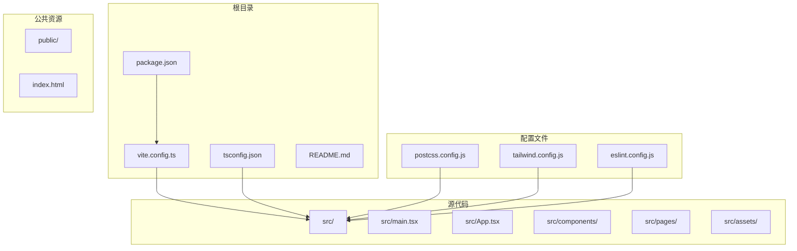
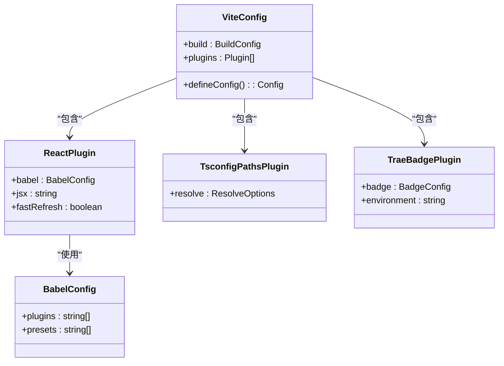
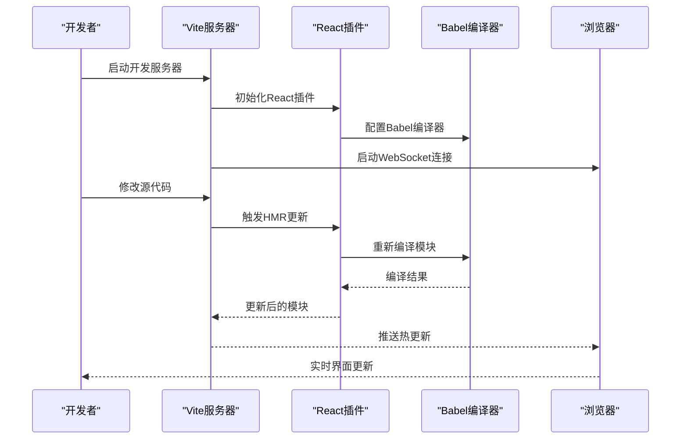
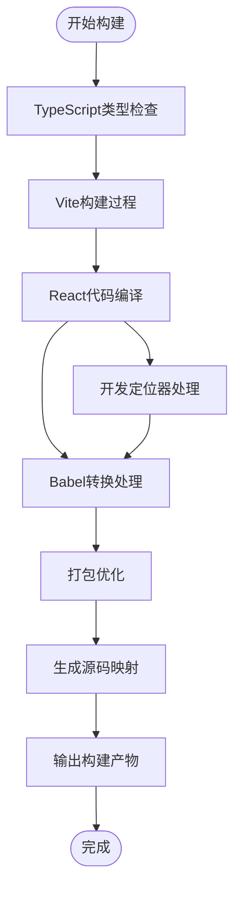
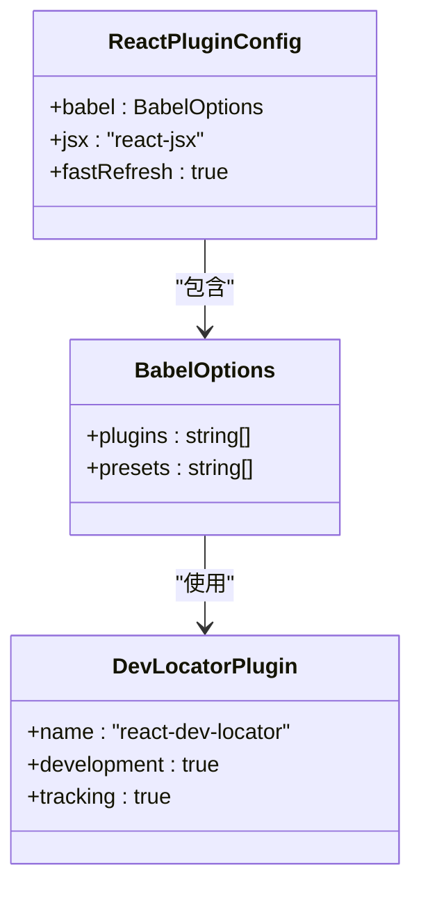
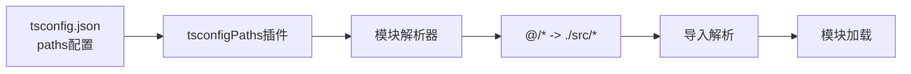
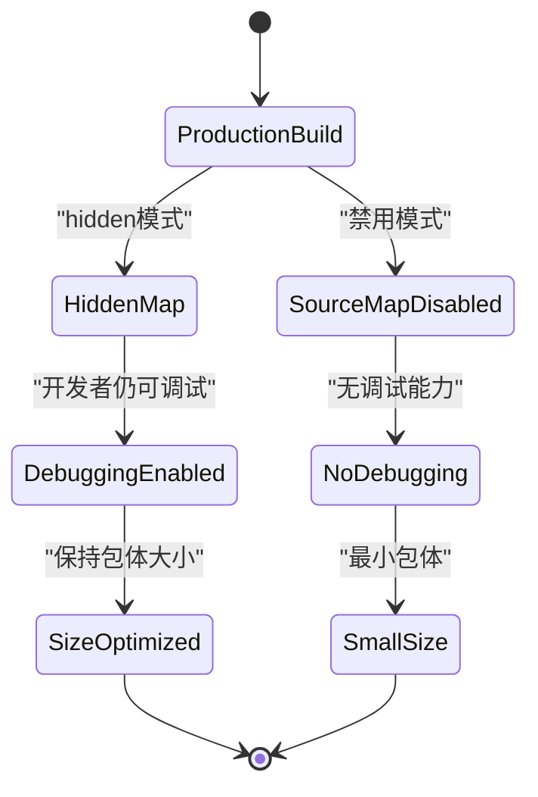
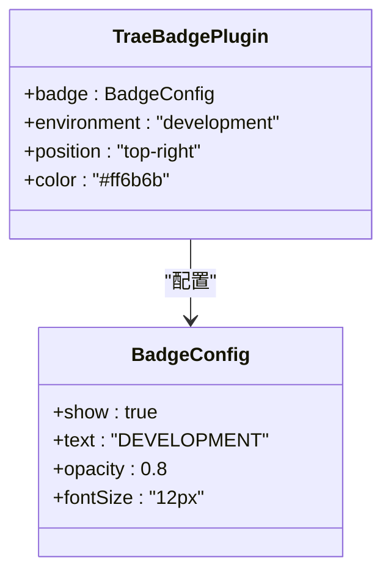

# Vite构建配置

<cite>
**本文档引用的文件**
- [vite.config.ts](file://vite.config.ts)
- [package.json](file://package.json)
- [tsconfig.json](file://tsconfig.json)
- [postcss.config.js](file://postcss.config.js)
- [tailwind.config.js](file://tailwind.config.js)
- [eslint.config.js](file://eslint.config.js)
- [README.md](file://README.md)
- [src/main.tsx](file://src/main.tsx)
- [src/App.tsx](file://src/App.tsx)
- [src/components/Layout.tsx](file://src/components/Layout.tsx)
</cite>

## 目录
1. [简介](#简介)
2. [项目结构](#项目结构)
3. [核心组件](#核心组件)
4. [架构概览](#架构概览)
5. [详细组件分析](#详细组件分析)
6. [依赖关系分析](#依赖关系分析)
7. [性能考虑](#性能考虑)
8. [故障排除指南](#故障排除指南)
9. [结论](#结论)
10. [附录](#附录)

## 简介

这是一个基于Vite的React + TypeScript项目，采用现代化的前端构建工具链。项目配置了完整的开发和生产环境构建流程，集成了React开发定位器、TypeScript路径别名解析和自定义徽章插件等高级功能。

该项目展示了现代前端工程的最佳实践，包括：
- 基于Vite的快速开发服务器
- React插件的Babel集成配置
- TypeScript路径别名支持
- 源码映射的优化策略
- 自定义开发工具插件集成

## 项目结构

项目采用标准的Vite + React + TypeScript结构，主要目录组织如下：



**图表来源**
- [vite.config.ts:1-22](file://vite.config.ts#L1-L22)
- [package.json:1-48](file://package.json#L1-L48)
- [tsconfig.json:1-38](file://tsconfig.json#L1-L38)

**章节来源**
- [vite.config.ts:1-22](file://vite.config.ts#L1-L22)
- [package.json:1-48](file://package.json#L1-L48)
- [tsconfig.json:1-38](file://tsconfig.json#L1-L38)

## 核心组件

### Vite构建配置核心要素

项目的核心构建配置集中在单一的vite.config.ts文件中，采用了最小但功能完整的配置策略：

#### 构建优化设置
- **源码映射配置**: 使用隐藏模式的源码映射，平衡调试需求与生产包体积
- **插件系统**: 集成React开发定位器和TypeScript路径别名解析

#### 插件配置架构


**图表来源**
- [vite.config.ts:7-21](file://vite.config.ts#L7-L21)

**章节来源**
- [vite.config.ts:7-21](file://vite.config.ts#L7-L21)

## 架构概览

### 开发服务器设置

项目采用默认的Vite开发服务器配置，提供热模块替换(HMR)和快速启动能力：



**图表来源**
- [vite.config.ts:11-20](file://vite.config.ts#L11-L20)
- [package.json:6-12](file://package.json#L6-L12)

### 构建流程架构



**图表来源**
- [vite.config.ts:8-21](file://vite.config.ts#L8-L21)
- [package.json:8](file://package.json#L8)

**章节来源**
- [vite.config.ts:8-21](file://vite.config.ts#L8-L21)
- [package.json:6-12](file://package.json#L6-L12)

## 详细组件分析

### React插件配置分析

#### Babel插件集成
React插件通过babel配置项集成了react-dev-locator开发定位器：



**图表来源**
- [vite.config.ts:12-18](file://vite.config.ts#L12-L18)

#### 开发定位器作用机制
开发定位器在开发环境中提供以下功能：
- **组件定位**: 在浏览器中高亮显示React组件边界
- **属性追踪**: 显示组件的props和状态信息
- **性能监控**: 提供组件渲染性能指标
- **调试增强**: 支持更精确的错误定位和调试

**章节来源**
- [vite.config.ts:12-18](file://vite.config.ts#L12-L18)

### TypeScript路径别名插件

#### 配置实现
tsconfigPaths插件自动解析TypeScript配置中的路径别名：



**图表来源**
- [vite.config.ts:19](file://vite.config.ts#L19)
- [tsconfig.json:27-31](file://tsconfig.json#L27-L31)

#### 路径别名使用场景
- **相对路径简化**: 使用@符号替代深层相对路径
- **模块化组织**: 支持清晰的项目结构组织
- **维护性提升**: 减少因文件移动导致的导入路径修改

**章节来源**
- [vite.config.ts:19](file://vite.config.ts#L19)
- [tsconfig.json:27-31](file://tsconfig.json#L27-L31)

### 源码映射配置策略

#### 隐藏模式配置
项目采用`sourcemap: 'hidden'`配置，在生产环境中提供调试能力同时保持包体大小：



**图表来源**
- [vite.config.ts:9](file://vite.config.ts#L9)

#### 源码映射类型对比
- **hidden**: 生产环境推荐，提供调试但不暴露映射文件
- **inline**: 将映射嵌入到输出文件中
- **true**: 生成独立的映射文件
- **false**: 完全禁用映射

**章节来源**
- [vite.config.ts:9](file://vite.config.ts#L9)

### 自定义徽章插件

#### Trae徽章插件集成
项目集成了vite-plugin-trae-solo-badge插件，为开发环境提供可视化标识：



**图表来源**
- [vite.config.ts:4](file://vite.config.ts#L4)

**章节来源**
- [vite.config.ts:4](file://vite.config.ts#L4)

## 依赖关系分析

### 核心依赖架构

```mermaid
graph TB
subgraph "构建工具链"
Vite[Vite 6.3.5]
Rollup[Rollup 4.34.9]
ESBuild[ESBuild 0.25.0]
end
subgraph "React生态"
React[React 18.3.1]
ReactDOM[React DOM 18.3.1]
Router[React Router 7.3.0]
end
subgraph "开发工具"
Typescript[TypeScript 5.8.3]
ESLint[ESLint 9.25.0]
Tailwind[TailwindCSS 3.4.17]
end
subgraph "插件生态系统"
ReactPlugin[@vitejs/plugin-react 4.4.1]
TsconfigPlugin[vite-tsconfig-paths 5.1.4]
TraePlugin[vite-plugin-trae-solo-badge 1.0.0]
DevLocator[babel-plugin-react-dev-locator 1.0.0]
end
Vite --> ReactPlugin
Vite --> TsconfigPlugin
Vite --> TraePlugin
ReactPlugin --> DevLocator
React --> ReactDOM
Typescript --> Vite
ESLint --> Vite
Tailwind --> Vite
```

**图表来源**
- [package.json:13-46](file://package.json#L13-L46)

### 版本兼容性矩阵

| 组件 | 版本要求 | 兼容范围 | 最佳实践 |
|------|----------|----------|----------|
| Node.js | >=18.0.0 | ^18.0.0 \| ^20.0.0 \| >=22.0.0 | 使用LTS版本 |
| Vite | ^6.0.0 | ^6.0.0 \| ^6.1.0 \| ^6.2.0 \| ^6.3.0 | 保持最新稳定版 |
| React | ^18.0.0 | ^18.0.0 \| ^18.1.0 \| ^18.2.0 \| ^18.3.0 | 与React DOM版本匹配 |
| TypeScript | ~5.8.0 | ~5.8.0 \| ~5.8.1 \| ~5.8.2 \| ~5.8.3 | 保持主版本一致 |

**章节来源**
- [package.json:13-46](file://package.json#L13-L46)

## 性能考虑

### 构建优化技巧

#### 代码分割策略
- **路由级分割**: 基于React Router的懒加载实现
- **组件级分割**: 对大型组件进行动态导入
- **第三方库分割**: 将常用依赖单独打包

#### 缓存优化
- **持久化缓存**: 利用Vite的内置缓存机制
- **浏览器缓存**: 启用长期缓存策略
- **CDN优化**: 对静态资源使用CDN分发

#### 资源优化
- **图片压缩**: 使用适当的图片格式和尺寸
- **字体优化**: 采用WOFF2格式和子集化
- **CSS提取**: 将样式提取到独立文件

### 开发体验优化

#### 热重载性能
- **增量编译**: 只编译变更的模块
- **模块联邦**: 支持微前端架构
- **预构建依赖**: 减少首次启动时间

#### 调试工具
- **源码映射**: 完整的开发时调试支持
- **错误边界**: 提供友好的错误信息
- **性能分析**: 内置性能监控工具

## 故障排除指南

### 常见问题及解决方案

#### 插件冲突问题
**症状**: 构建失败或运行时错误
**解决方案**: 
- 检查插件加载顺序
- 验证插件版本兼容性
- 禁用冲突的插件组合

#### 路径解析问题
**症状**: 导入模块失败或路径解析错误
**解决方案**:
- 验证tsconfig.json中的paths配置
- 检查vite.config.ts中的插件配置
- 确认文件路径的相对性

#### 源码映射问题
**症状**: 浏览器调试时无法正确映射源码
**解决方案**:
- 检查sourcemap配置选项
- 验证构建输出文件完整性
- 清理构建缓存后重新构建

#### 性能问题
**症状**: 构建时间过长或内存占用过高
**解决方案**:
- 分析bundle大小和依赖关系
- 启用代码分割和懒加载
- 优化第三方库的使用

**章节来源**
- [vite.config.ts:9](file://vite.config.ts#L9)
- [tsconfig.json:27-31](file://tsconfig.json#L27-L31)

## 结论

本项目展示了Vite构建系统的最佳实践，通过精心设计的配置实现了开发效率与生产性能的平衡。关键优势包括：

### 技术亮点
- **简洁高效的配置**: 最小化的配置文件提供了完整功能
- **现代化工具链**: 集成了最新的React和TypeScript特性
- **开发体验优化**: 提供了优秀的调试和开发工具支持
- **性能导向设计**: 在保证功能的同时注重构建性能

### 适用场景
该配置适合以下类型的项目：
- 中大型React应用
- 需要快速开发迭代的项目
- 对构建性能有较高要求的应用
- 团队协作开发的项目

### 扩展建议
根据项目规模和发展阶段，可以考虑：
- 添加更多的构建优化插件
- 实现更精细的代码分割策略
- 集成自动化测试和部署流程
- 实施更严格的代码质量控制

## 附录

### 配置文件参考

#### 完整的vite.config.ts配置
```typescript
// 项目根配置文件，定义了构建、插件和开发服务器设置
import { defineConfig } from 'vite'
import react from '@vitejs/plugin-react'
import tsconfigPaths from "vite-tsconfig-paths";
import { traeBadgePlugin } from 'vite-plugin-trae-solo-badge';

export default defineConfig({
  build: {
    sourcemap: 'hidden', // 生产环境源码映射配置
  },
  plugins: [
    react({
      babel: {
        plugins: [
          'react-dev-locator', // 开发定位器插件
        ],
      },
    }),
    tsconfigPaths(), // TypeScript路径别名解析
  ],
})
```

#### package.json脚本配置
```json
{
  "scripts": {
    "dev": "vite",           // 启动开发服务器
    "build": "tsc -b && vite build", // 类型检查后构建
    "preview": "vite preview", // 预览生产构建
    "lint": "eslint .",       // 代码质量检查
    "check": "tsc -b --noEmit" // 类型检查
  }
}
```

### 开发工作流

#### 日常开发流程
1. **启动开发服务器**: 运行开发脚本
2. **实时编码**: 享受热重载功能
3. **调试验证**: 使用开发定位器
4. **构建发布**: 生成生产环境包

#### 生产环境部署
1. **完整构建**: 执行构建脚本
2. **预览验证**: 使用预览服务器
3. **部署上线**: 上传构建产物
4. **监控维护**: 跟踪应用性能

**章节来源**
- [vite.config.ts:1-22](file://vite.config.ts#L1-L22)
- [package.json:6-12](file://package.json#L6-L12)
- [README.md:1-58](file://README.md#L1-L58)