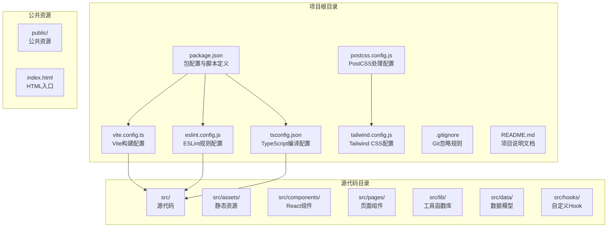
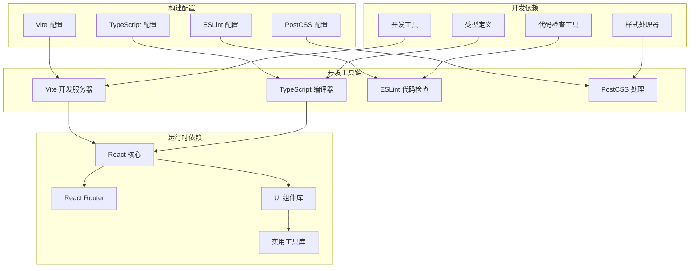
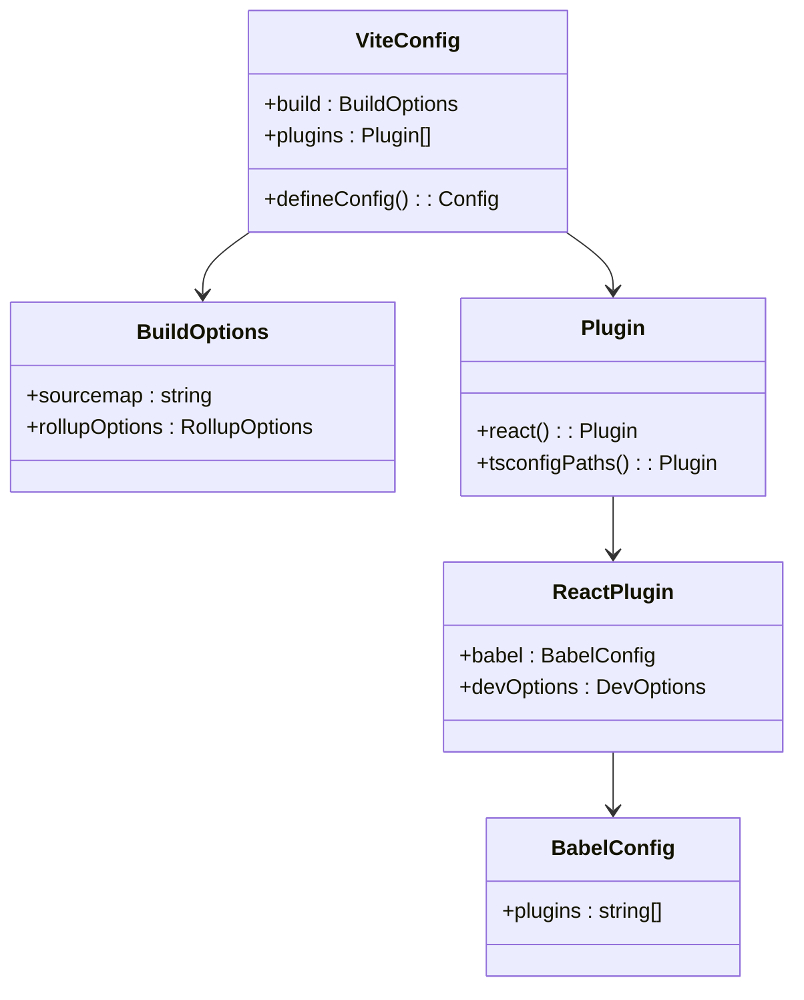
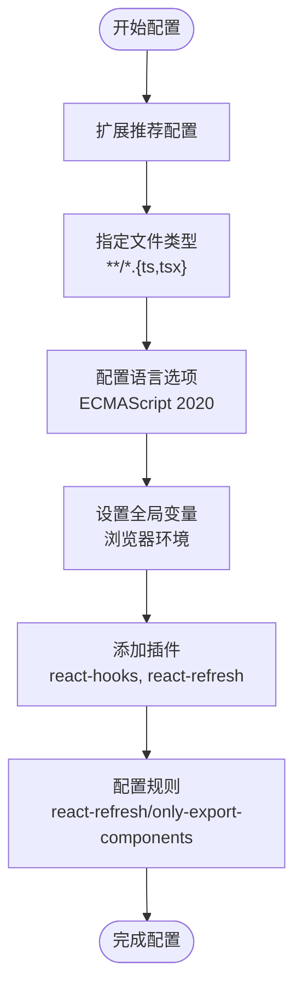
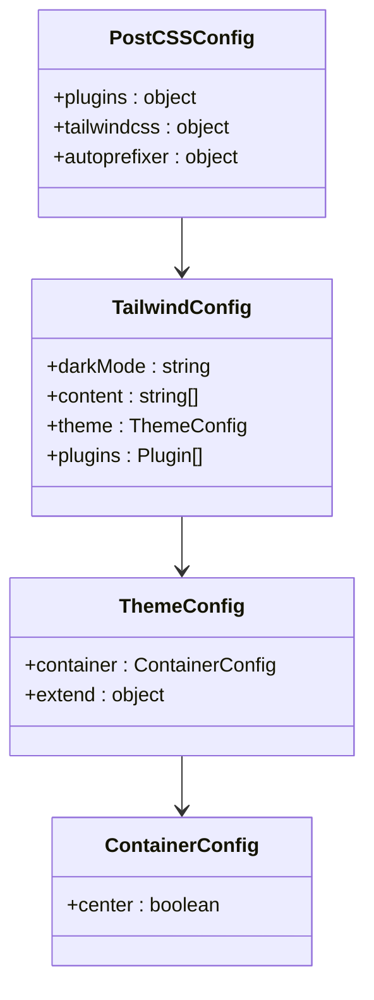
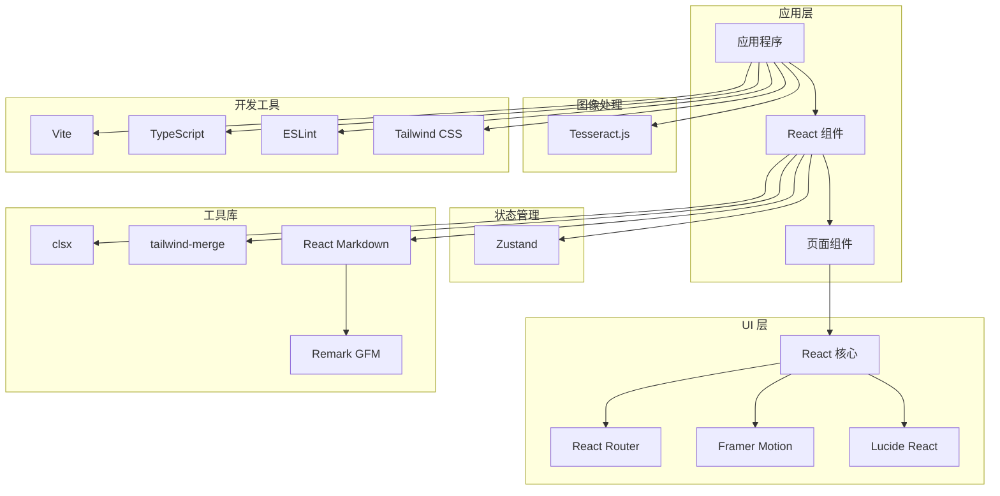
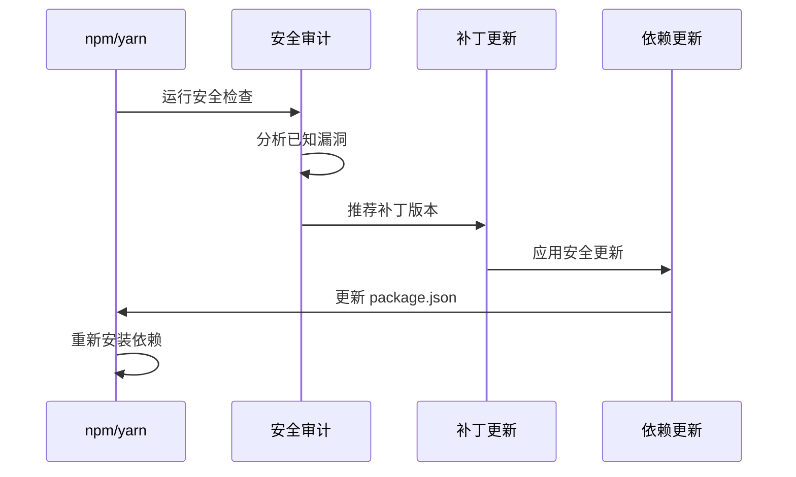

# 包管理与脚本

<cite>
**本文档引用的文件**
- [package.json](file://package.json)
- [vite.config.ts](file://vite.config.ts)
- [eslint.config.js](file://eslint.config.js)
- [tsconfig.json](file://tsconfig.json)
- [postcss.config.js](file://postcss.config.js)
- [tailwind.config.js](file://tailwind.config.js)
- [test-tesseract.js](file://test-tesseract.js)
- [README.md](file://README.md)
- [.gitignore](file://.gitignore)
</cite>

## 目录
1. [简介](#简介)
2. [项目结构](#项目结构)
3. [核心组件](#核心组件)
4. [架构概览](#架构概览)
5. [详细组件分析](#详细组件分析)
6. [依赖分析](#依赖分析)
7. [性能考虑](#性能考虑)
8. [故障排除指南](#故障排除指南)
9. [结论](#结论)

## 简介

这是一个基于 React + TypeScript + Vite 的现代前端项目模板，提供了完整的包管理和脚本配置解决方案。项目采用模块化设计，集成了现代化的开发工具链，包括类型检查、代码格式化、构建优化和样式处理等功能。

## 项目结构

该项目采用典型的现代前端项目结构，主要包含以下关键目录和文件：

**图表来源**
- [package.json:1-48](file://package.json#L1-L48)
- [vite.config.ts:1-22](file://vite.config.ts#L1-L22)
- [tsconfig.json:1-38](file://tsconfig.json#L1-L38)

**章节来源**
- [package.json:1-48](file://package.json#L1-L48)
- [vite.config.ts:1-22](file://vite.config.ts#L1-L22)
- [tsconfig.json:1-38](file://tsconfig.json#L1-L38)

## 核心组件

### 包管理配置

项目使用 npm 作为包管理器，通过 `package.json` 统一管理所有依赖关系和脚本命令。该文件定义了项目的基本元数据、依赖关系分类以及开发脚本。

### 脚本命令系统

项目提供了四个核心脚本命令，每个都有特定的功能和用途：

| 脚本命令 | 功能描述 | 执行流程 |
|---------|----------|----------|
| `dev` | 开发服务器启动 | 启动 Vite 开发服务器，支持热模块替换(HMR) |
| `build` | 生产环境构建 | 先执行 TypeScript 编译，再进行 Vite 构建 |
| `lint` | 代码质量检查 | 运行 ESLint 检查所有源代码文件 |
| `preview` | 预览构建结果 | 启动本地预览服务器查看构建产物 |
| `check` | 类型检查 | 执行 TypeScript 编译但不输出文件 |

### 依赖管理策略

项目采用清晰的依赖分类策略：

**生产依赖 (dependencies)**：运行时必需的库
- React 生态系统：react、react-dom、react-router-dom
- UI 组件库：lucide-react、framer-motion
- 实用工具：clsx、tailwind-merge、zustand
- 文档处理：react-markdown、remark-gfm
- 图像识别：tesseract.js

**开发依赖 (devDependencies)**：开发和构建时使用的工具
- 构建工具：vite、typescript、@vitejs/plugin-react
- 代码质量：eslint、typescript-eslint、@typescript-eslint/eslint-plugin
- 样式处理：tailwindcss、postcss、autoprefixer
- 类型定义：@types/react、@types/react-dom、@types/node
- 开发辅助：vite-plugin-trae-solo-badge、vite-tsconfig-paths

**章节来源**
- [package.json:6-12](file://package.json#L6-L12)
- [package.json:13-26](file://package.json#L13-L26)
- [package.json:27-46](file://package.json#L27-L46)

## 架构概览

项目采用现代化的前端技术栈，通过模块化的方式组织各个组件：

**图表来源**
- [vite.config.ts:7-21](file://vite.config.ts#L7-L21)
- [eslint.config.js:7-28](file://eslint.config.js#L7-L28)
- [tsconfig.json:2-32](file://tsconfig.json#L2-L32)
- [postcss.config.js:5-10](file://postcss.config.js#L5-L10)

## 详细组件分析

### Vite 构建配置

Vite 作为现代前端构建工具，提供了快速的开发体验和高效的生产构建能力。

#### 核心配置特性

**图表来源**
- [vite.config.ts:7-21](file://vite.config.ts#L7-L21)

#### 构建优化策略

- **Source Map 配置**：使用隐藏的 Source Map 提供调试信息同时保持生产包体积最小化
- **插件系统**：集成 React 开发工具和路径别名解析功能
- **开发定位器**：启用 Babel 插件以增强开发体验

**章节来源**
- [vite.config.ts:1-22](file://vite.config.ts#L1-L22)

### TypeScript 编译配置

TypeScript 配置提供了灵活的编译选项，平衡了开发效率和代码质量。

#### 编译选项分析

| 配置项 | 值 | 作用 |
|--------|-----|------|
| target | ES2020 | 目标 JavaScript 版本 |
| module | ESNext | 模块系统选择 |
| jsx | react-jsx | JSX 编译模式 |
| skipLibCheck | true | 跳过库文件类型检查 |
| strict | false | 关闭严格模式 |
| noEmit | true | 不生成输出文件（配合 Vite） |

#### 路径映射配置

项目使用路径别名简化导入语句：
- `@/*` → `./src/*`

这使得代码更加简洁易读，减少了相对路径的复杂性。

**章节来源**
- [tsconfig.json:1-38](file://tsconfig.json#L1-L38)

### ESLint 代码质量配置

ESLint 配置集成了 TypeScript 支持和 React 特定规则，确保代码质量和一致性。

#### 规则配置策略

**图表来源**
- [eslint.config.js:7-28](file://eslint.config.js#L7-L28)

#### 代码质量保障

- **类型感知**：使用 TypeScript ESLint 提供类型安全的代码检查
- **React 专用规则**：集成 React Hooks 和 React Refresh 相关规则
- **严格模式**：提供多种配置级别以适应不同项目需求

**章节来源**
- [eslint.config.js:1-29](file://eslint.config.js#L1-L29)

### Tailwind CSS 配置

Tailwind CSS 提供了实用优先的样式解决方案，结合 PostCSS 实现现代化的样式处理。

#### 样式配置特性

**图表来源**
- [tailwind.config.js:3-15](file://tailwind.config.js#L3-L15)
- [postcss.config.js:5-10](file://postcss.config.js#L5-L10)

#### 配置特点

- **暗色模式支持**：启用基于类名的暗色模式切换
- **内容扫描**：自动扫描 HTML 和组件文件以移除未使用样式
- **插件集成**：集成 Tailwind CSS Typography 插件增强排版

**章节来源**
- [tailwind.config.js:1-16](file://tailwind.config.js#L1-L16)
- [postcss.config.js:1-11](file://postcss.config.js#L1-L11)

## 依赖分析

### 依赖关系图谱

**图表来源**
- [package.json:13-26](file://package.json#L13-L26)
- [package.json:27-46](file://package.json#L27-L46)

### 版本控制策略

项目采用语义化版本控制策略，使用 Caret (^) 符号允许小版本更新：

- **主要版本更新**：需要手动升级，可能包含破坏性变更
- **次版本更新**：向后兼容的小功能更新
- **补丁版本更新**：向后兼容的错误修复

这种策略在保证稳定性的同时，允许项目获得重要的安全更新和功能改进。

### 安全更新机制

**图表来源**
- [package.json:13-46](file://package.json#L13-L46)

**章节来源**
- [package.json:13-46](file://package.json#L13-L46)

## 性能考虑

### 构建性能优化

1. **增量编译**：TypeScript 配置启用构建信息缓存
2. **按需加载**：React Router 支持路由级别的代码分割
3. **Tree Shaking**：ES Module 导入导出支持无副作用的代码消除
4. **Source Map**：生产环境使用隐藏的 Source Map 平衡调试和体积

### 开发体验优化

1. **热模块替换**：Vite 提供快速的热更新体验
2. **类型检查**：分离的类型检查避免阻塞开发流程
3. **代码格式化**：ESLint 集成自动格式化支持
4. **路径别名**：简化导入路径，提高开发效率

## 故障排除指南

### 常见问题及解决方案

#### 依赖安装问题

**问题**：依赖安装失败或版本冲突
**解决方案**：
1. 清理缓存：删除 `node_modules` 和锁定文件
2. 使用正确的包管理器：确保使用与项目配置一致的包管理器
3. 检查网络连接：代理设置或镜像源配置

#### 构建错误

**问题**：TypeScript 或 Vite 构建失败
**排查步骤**：
1. 运行类型检查：`npm run check`
2. 检查配置文件语法：确认 JSON 和 TS 文件格式正确
3. 验证依赖完整性：重新安装所有依赖

#### 开发服务器问题

**问题**：开发服务器无法启动或热更新失效
**解决方法**：
1. 检查端口占用：确保开发端口未被其他进程占用
2. 清理浏览器缓存：强制刷新页面
3. 重启开发服务器：停止并重新启动 Vite 服务

**章节来源**
- [.gitignore:1-24](file://.gitignore#L1-L24)

### 调试技巧

#### 脚本调试

1. **详细日志**：使用 `--verbose` 参数获取更多信息
2. **逐步执行**：将复杂脚本分解为多个简单步骤
3. **环境隔离**：使用独立的环境变量进行测试

#### 性能分析

1. **Bundle 分析**：使用 Vite 的内置分析工具
2. **内存监控**：监控开发服务器的内存使用情况
3. **网络分析**：检查静态资源的加载性能

## 结论

本项目展示了现代前端项目的最佳实践，通过精心设计的包管理和脚本配置，实现了高效、可维护的开发体验。项目的核心优势包括：

1. **清晰的依赖分类**：生产依赖和开发依赖的明确分离
2. **现代化工具链**：Vite、TypeScript、ESLint 等工具的完美集成
3. **灵活的配置系统**：可扩展的构建和开发配置
4. **优秀的开发体验**：快速的热更新和完善的类型支持

通过遵循这些配置模式和最佳实践，开发者可以建立一个稳定、高性能且易于维护的前端项目基础。