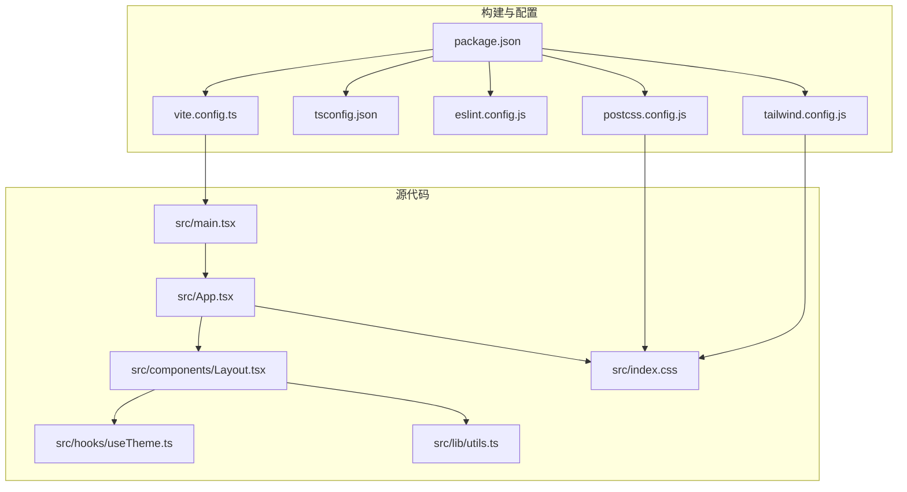
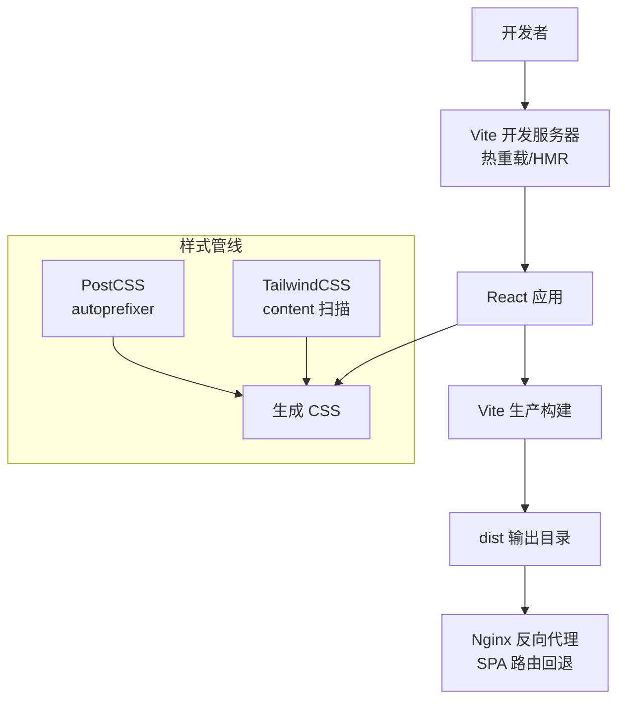
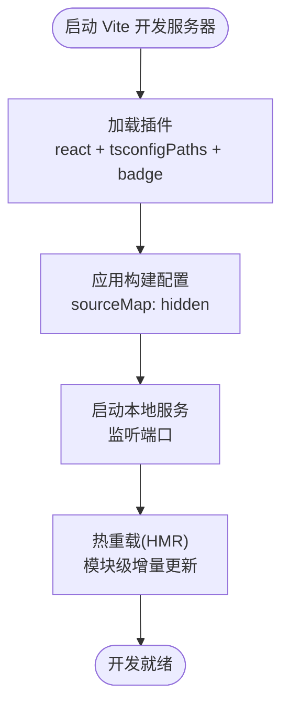
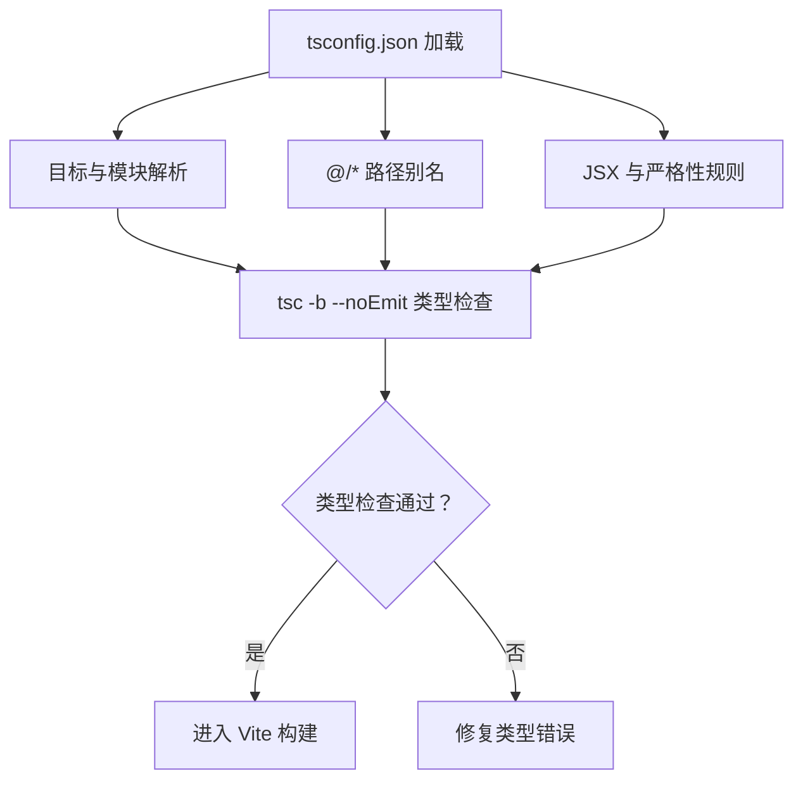
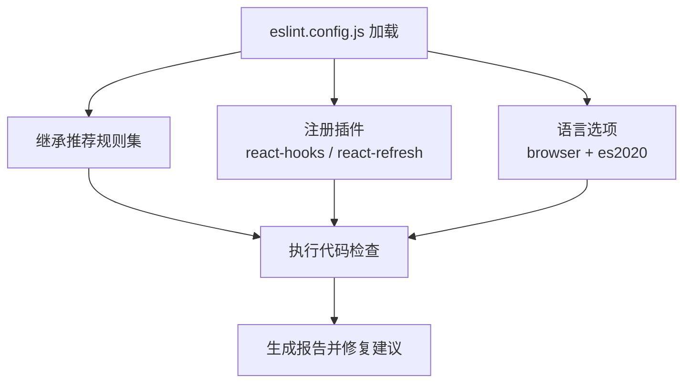
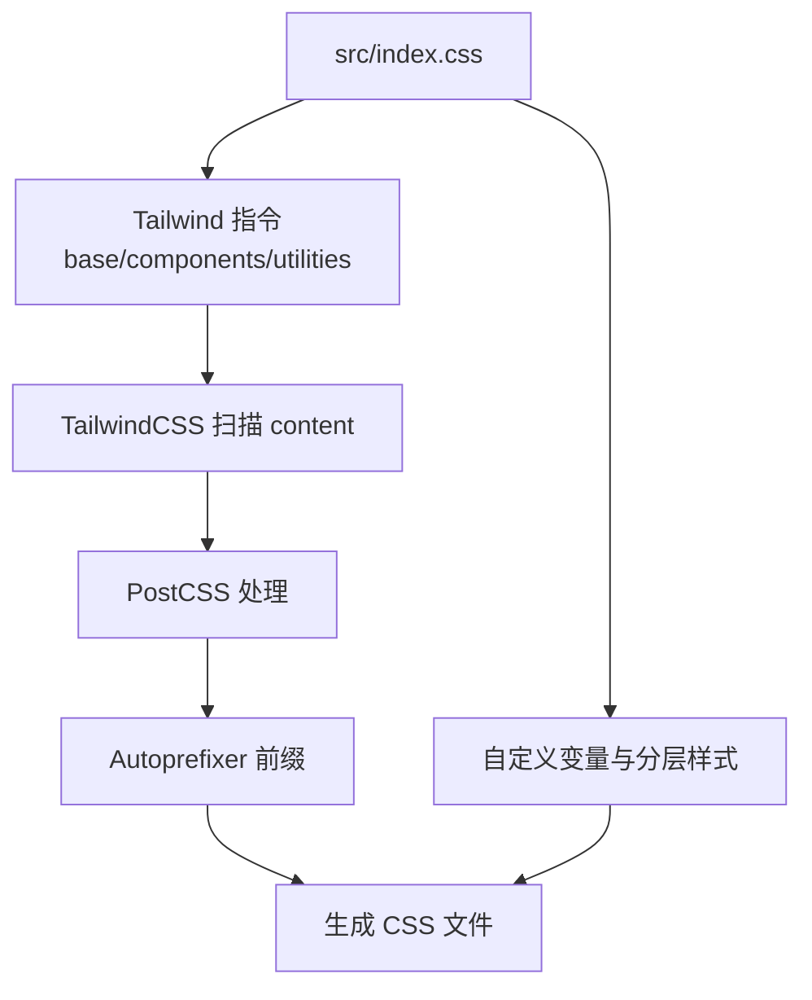
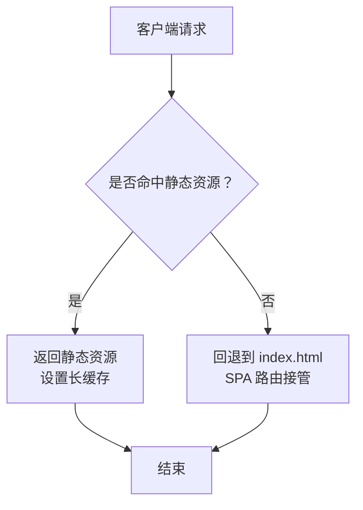
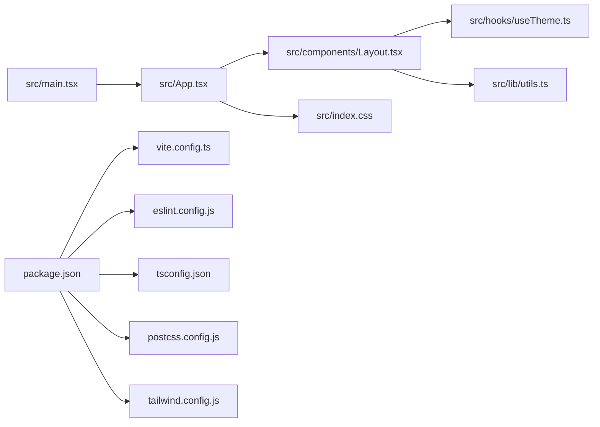

# 开发工具与配置

<cite>
**本文引用的文件**
- [vite.config.ts](file://vite.config.ts)
- [package.json](file://package.json)
- [tsconfig.json](file://tsconfig.json)
- [eslint.config.js](file://eslint.config.js)
- [postcss.config.js](file://postcss.config.js)
- [tailwind.config.js](file://tailwind.config.js)
- [nginx.conf.example](file://nginx.conf.example)
- [nginx-config.txt](file://nginx-config.txt)
- [README.md](file://README.md)
- [src/main.tsx](file://src/main.tsx)
- [src/App.tsx](file://src/App.tsx)
- [src/index.css](file://src/index.css)
- [src/vite-env.d.ts](file://src/vite-env.d.ts)
- [src/components/Layout.tsx](file://src/components/Layout.tsx)
- [src/hooks/useTheme.ts](file://src/hooks/useTheme.ts)
- [src/lib/utils.ts](file://src/lib/utils.ts)
- [test-tesseract.js](file://test-tesseract.js)
</cite>

## 目录
1. [简介](#简介)
2. [项目结构](#项目结构)
3. [核心组件](#核心组件)
4. [架构总览](#架构总览)
5. [详细组件分析](#详细组件分析)
6. [依赖关系分析](#依赖关系分析)
7. [性能考量](#性能考量)
8. [故障排查指南](#故障排查指南)
9. [结论](#结论)
10. [附录](#附录)

## 简介
本文件系统性梳理该项目的开发工具与配置，覆盖以下方面：
- Vite 构建与开发服务器配置、热重载与插件生态
- TypeScript 编译配置与路径别名、严格性与类型检查策略
- ESLint 代码规范配置与推荐规则扩展
- PostCSS 与 Tailwind 样式管线
- 开发命令、脚本与自动化流程
- 部署与反向代理配置（Nginx）及 SPA 路由处理
- 调试工具、性能分析与代码质量保障
- CI/CD 集成思路与环境变量管理建议

## 项目结构
项目采用 React + TypeScript + Vite 技术栈，配合 TailwindCSS 实现样式工程化，使用 ESLint 与 TypeScript ESLint 进行代码质量控制，并通过 PostCSS 自动前缀与按需生成样式。

图示来源
- [src/main.tsx:1-11](file://src/main.tsx#L1-L11)
- [src/App.tsx:1-52](file://src/App.tsx#L1-L52)
- [src/components/Layout.tsx:1-66](file://src/components/Layout.tsx#L1-L66)
- [src/hooks/useTheme.ts:1-29](file://src/hooks/useTheme.ts#L1-L29)
- [src/lib/utils.ts:1-7](file://src/lib/utils.ts#L1-L7)
- [src/index.css:1-61](file://src/index.css#L1-L61)
- [package.json:1-48](file://package.json#L1-L48)
- [vite.config.ts:1-22](file://vite.config.ts#L1-L22)
- [tsconfig.json:1-38](file://tsconfig.json#L1-L38)
- [eslint.config.js:1-29](file://eslint.config.js#L1-L29)
- [postcss.config.js:1-11](file://postcss.config.js#L1-L11)
- [tailwind.config.js:1-16](file://tailwind.config.js#L1-L16)

章节来源
- [src/main.tsx:1-11](file://src/main.tsx#L1-L11)
- [src/App.tsx:1-52](file://src/App.tsx#L1-L52)
- [src/index.css:1-61](file://src/index.css#L1-L61)
- [package.json:1-48](file://package.json#L1-L48)
- [vite.config.ts:1-22](file://vite.config.ts#L1-L22)
- [tsconfig.json:1-38](file://tsconfig.json#L1-L38)
- [eslint.config.js:1-29](file://eslint.config.js#L1-L29)
- [postcss.config.js:1-11](file://postcss.config.js#L1-L11)
- [tailwind.config.js:1-16](file://tailwind.config.js#L1-L16)

## 核心组件
- 构建与开发服务器：Vite 提供快速启动、热重载与生产构建；通过插件增强开发体验与产物优化。
- 类型系统：TypeScript 配置支持路径别名、JSX 语法与严格性开关，结合 tsc 检查提升类型安全。
- 代码规范：ESLint 使用 TypeScript ESLint 推荐规则，结合 React Hooks 与 React Refresh 规则。
- 样式管线：PostCSS + TailwindCSS，自动前缀与按需生成，支持暗色模式与内容扫描。
- 脚本与自动化：统一的 npm scripts 管理开发、构建、预览与检查任务。

章节来源
- [vite.config.ts:1-22](file://vite.config.ts#L1-L22)
- [package.json:6-12](file://package.json#L6-L12)
- [tsconfig.json:27-31](file://tsconfig.json#L27-L31)
- [eslint.config.js:10-27](file://eslint.config.js#L10-L27)
- [postcss.config.js:5-10](file://postcss.config.js#L5-L10)
- [tailwind.config.js:3-15](file://tailwind.config.js#L3-L15)

## 架构总览
下图展示了从开发到生产的整体流程：开发者运行 Vite 开发服务器，热更新即时反映在浏览器；构建阶段先进行类型检查，再由 Vite 打包输出；样式通过 PostCSS/Tailwind 生成；最终部署于 Nginx 并处理 SPA 刷新。

图示来源
- [vite.config.ts:7-22](file://vite.config.ts#L7-L22)
- [package.json:6-12](file://package.json#L6-L12)
- [postcss.config.js:5-10](file://postcss.config.js#L5-L10)
- [tailwind.config.js:3-15](file://tailwind.config.js#L3-L15)
- [nginx.conf.example:1-23](file://nginx.conf.example#L1-L23)

## 详细组件分析

### Vite 构建与开发服务器配置
- 插件生态
  - @vitejs/plugin-react：启用 React 快速刷新与 Babel 转换，集成 react-dev-locator 便于定位组件。
  - vite-tsconfig-paths：基于 tsconfig.json 的路径映射，简化导入路径。
  - vite-plugin-trae-solo-badge：Trae 独立徽章插件（用于特定环境标识）。
- 构建优化
  - 产物 Source Map：采用隐藏 Source Map，兼顾调试与体积控制。
- 开发体验
  - 默认 dev 命令即启动 Vite 开发服务器，支持热重载与实时错误提示。

图示来源
- [vite.config.ts:7-22](file://vite.config.ts#L7-L22)
- [package.json:6-12](file://package.json#L6-L12)

章节来源
- [vite.config.ts:1-22](file://vite.config.ts#L1-L22)
- [package.json:6-12](file://package.json#L6-L12)

### TypeScript 编译配置
- 目标与模块
  - 目标版本与模块解析：ES2020 与 node 解析，支持 ESNext 模块语法。
- JSX 与严格性
  - JSX 使用 react-jsx，严格性与未使用检测等规则已显式关闭，便于快速迭代。
- 路径别名
  - 通过 baseUrl 与 paths 配置 @/* 映射至 src，提升导入可读性。
- 类型检查
  - 通过独立脚本执行 tsc -b --noEmit 进行全量类型检查，确保构建前无类型错误。

图示来源
- [tsconfig.json:2-31](file://tsconfig.json#L2-L31)
- [package.json:11-11](file://package.json#L11-L11)

章节来源
- [tsconfig.json:1-38](file://tsconfig.json#L1-L38)
- [package.json:11-11](file://package.json#L11-L11)

### ESLint 代码规范配置
- 规则集
  - 继承 @eslint/js 与 TypeScript ESLint 推荐规则，确保基础质量。
- 插件
  - React Hooks 与 React Refresh 规则，约束 Hook 使用与组件导出规范。
- 语言选项
  - 浏览器环境全局变量，ECMAScript 2020 语义。
- 建议
  - README 提示可切换为类型感知更严格的规则集，并可引入 React X/DOM 插件以强化 React 相关规则。

图示来源
- [eslint.config.js:7-28](file://eslint.config.js#L7-L28)
- [README.md:10-32](file://README.md#L10-L32)

章节来源
- [eslint.config.js:1-29](file://eslint.config.js#L1-L29)
- [README.md:10-32](file://README.md#L10-L32)

### PostCSS 与 Tailwind 样式处理
- PostCSS 插件
  - tailwindcss：按内容扫描生成所需样式。
  - autoprefixer：自动添加浏览器前缀，提升兼容性。
- Tailwind 配置
  - 暗色模式：class 模式，适配主题切换。
  - 内容扫描：对 HTML 与 src 下的 JS/TSX 文件生效。
  - 插件：启用 typography 插件增强排版。
- 入口样式
  - 在 index.css 中引入 Tailwind 指令与自定义 CSS 变量、分层样式。

图示来源
- [src/index.css:3-61](file://src/index.css#L3-L61)
- [postcss.config.js:5-10](file://postcss.config.js#L5-L10)
- [tailwind.config.js:3-15](file://tailwind.config.js#L3-L15)

章节来源
- [src/index.css:1-61](file://src/index.css#L1-L61)
- [postcss.config.js:1-11](file://postcss.config.js#L1-L11)
- [tailwind.config.js:1-16](file://tailwind.config.js#L1-L16)

### 开发服务器、热重载与代理
- 开发服务器
  - 通过 Vite 默认 dev 命令启动本地服务，支持热重载与错误边界显示。
- 热重载机制
  - Vite 基于 ES 模块的 HMR，模块变更后仅局部刷新，提升开发效率。
- 代理设置
  - 当前仓库未提供代理配置示例；如需代理 API 请求，可在 Vite 配置中新增 server.proxy 选项并结合环境变量管理不同环境地址。

章节来源
- [package.json:7-7](file://package.json#L7-L7)
- [vite.config.ts:7-22](file://vite.config.ts#L7-L22)

### 调试工具与性能分析
- 组件定位
  - Babel 插件 react-dev-locator 已集成，便于在浏览器中快速定位组件来源。
- 性能分析
  - 建议使用浏览器性能面板观察渲染与重绘热点；结合 React DevTools Profiler 分析组件渲染耗时。
- 代码质量
  - 结合 ESLint 与 tsc 检查，持续在本地与 CI 中执行，确保质量门槛。

章节来源
- [vite.config.ts:12-18](file://vite.config.ts#L12-L18)
- [package.json:9-11](file://package.json#L9-L11)

### 部署配置与反向代理（Nginx）
- SPA 路由回退
  - 使用 try_files 将未匹配的请求回退到 index.html，避免刷新出现 404。
- 静态资源缓存
  - 对 JS/CSS/字体/图标等静态资源设置长缓存，减少带宽消耗。
- 示例配置
  - 提供了两份 Nginx 示例文件，分别命名为 .example 与 .txt，便于复制与修改。

图示来源
- [nginx.conf.example:1-23](file://nginx.conf.example#L1-L23)
- [nginx-config.txt:1-22](file://nginx-config.txt#L1-L22)

章节来源
- [nginx.conf.example:1-23](file://nginx.conf.example#L1-L23)
- [nginx-config.txt:1-22](file://nginx-config.txt#L1-L22)

### 环境变量管理与 CI/CD 集成
- 环境变量
  - Vite 支持 .env 文件族（如 .env.development/.env.production），建议将敏感信息与环境差异项分离管理。
- CI/CD 集成
  - 建议在流水线中执行：安装依赖 → 类型检查 → ESLint → 构建 → 预览/部署。
  - 构建产物可直接部署至 Nginx 或静态托管平台。

章节来源
- [vite.config.ts:7-22](file://vite.config.ts#L7-L22)
- [package.json:6-12](file://package.json#L6-L12)

### 常用开发命令与脚本
- 开发：启动 Vite 开发服务器，支持热重载。
- 构建：先执行 tsc -b 进行类型检查，再由 Vite 打包。
- 预览：本地预览生产构建效果。
- 检查：执行 tsc -b --noEmit 进行类型检查。
- Lint：执行 ESLint 检查。

章节来源
- [package.json:6-12](file://package.json#L6-L12)

### 自动化工具与辅助脚本
- 路径别名：通过 vite-tsconfig-paths 插件与 tsconfig.json 的 paths 配置保持一致。
- OCR 测试：提供测试脚本验证 tesseract.js 的基本工作流，便于集成图像识别能力。

章节来源
- [vite.config.ts:19-19](file://vite.config.ts#L19-L19)
- [tsconfig.json:27-31](file://tsconfig.json#L27-L31)
- [test-tesseract.js:1-6](file://test-tesseract.js#L1-L6)

## 依赖关系分析
- 组件耦合
  - Layout 通过 cn 工具函数合并类名，复用 useTheme 控制主题；App 负责路由组织。
- 外部依赖
  - React、React Router、TailwindCSS、Framer Motion、Lucide React 等。
- 构建与开发
  - Vite 作为核心，依赖 React 插件、路径解析与 Trae 徽章插件；ESLint 与 TypeScript ESLint 提升代码质量。

图示来源
- [src/main.tsx:1-11](file://src/main.tsx#L1-L11)
- [src/App.tsx:1-52](file://src/App.tsx#L1-L52)
- [src/components/Layout.tsx:1-66](file://src/components/Layout.tsx#L1-L66)
- [src/hooks/useTheme.ts:1-29](file://src/hooks/useTheme.ts#L1-L29)
- [src/lib/utils.ts:1-7](file://src/lib/utils.ts#L1-L7)
- [src/index.css:1-61](file://src/index.css#L1-L61)
- [package.json:1-48](file://package.json#L1-L48)
- [vite.config.ts:1-22](file://vite.config.ts#L1-L22)
- [eslint.config.js:1-29](file://eslint.config.js#L1-L29)
- [tsconfig.json:1-38](file://tsconfig.json#L1-L38)
- [postcss.config.js:1-11](file://postcss.config.js#L1-L11)
- [tailwind.config.js:1-16](file://tailwind.config.js#L1-L16)

章节来源
- [src/main.tsx:1-11](file://src/main.tsx#L1-L11)
- [src/App.tsx:1-52](file://src/App.tsx#L1-L52)
- [src/components/Layout.tsx:1-66](file://src/components/Layout.tsx#L1-L66)
- [src/hooks/useTheme.ts:1-29](file://src/hooks/useTheme.ts#L1-L29)
- [src/lib/utils.ts:1-7](file://src/lib/utils.ts#L1-L7)
- [src/index.css:1-61](file://src/index.css#L1-L61)
- [package.json:1-48](file://package.json#L1-L48)
- [vite.config.ts:1-22](file://vite.config.ts#L1-L22)
- [eslint.config.js:1-29](file://eslint.config.js#L1-L29)
- [tsconfig.json:1-38](file://tsconfig.json#L1-L38)
- [postcss.config.js:1-11](file://postcss.config.js#L1-L11)
- [tailwind.config.js:1-16](file://tailwind.config.js#L1-L16)

## 性能考量
- 构建体积
  - 合理拆分路由与组件，利用动态导入减少首屏体积。
- 样式体积
  - Tailwind 按内容扫描，避免无用样式；谨慎开启实验性功能。
- 运行时性能
  - 使用 React.memo、useMemo、useCallback 降低重渲染；合理拆分状态域。
- 开发体验
  - 启用 HMR 与最小化重载范围，缩短反馈周期。

## 故障排查指南
- 热重载不生效
  - 检查 Vite 是否正常启动；确认文件保存与模块边界；必要时重启开发服务器。
- 类型检查失败
  - 执行 tsc -b --noEmit 定位具体错误；修正后再次构建。
- ESLint 报错
  - 根据规则提示修复；必要时调整规则或忽略特定文件。
- 样式异常
  - 检查 Tailwind content 扫描路径；确认 PostCSS 插件顺序与版本兼容。
- 部署后路由 404
  - 确认 Nginx 配置中的 try_files 回退规则；确保根目录指向正确的 dist 路径。

章节来源
- [package.json:6-12](file://package.json#L6-L12)
- [tsconfig.json:1-38](file://tsconfig.json#L1-L38)
- [eslint.config.js:1-29](file://eslint.config.js#L1-L29)
- [tailwind.config.js:3-15](file://tailwind.config.js#L3-L15)
- [nginx.conf.example:1-23](file://nginx.conf.example#L1-L23)

## 结论
本项目以 Vite 为核心，结合 TypeScript、ESLint、PostCSS/Tailwind 实现高效、可维护的前端工程化流程。通过合理的配置与脚本，能够在开发阶段获得良好的热重载体验，在构建阶段确保类型安全与代码质量，并在部署阶段通过 Nginx 的 SPA 路由回退实现稳定上线。建议在 CI/CD 中固化类型检查与代码规范检查，持续提升交付质量。

## 附录
- 版本与依赖
  - React、React Router、TailwindCSS、Vite、ESLint、TypeScript 等版本均在 package.json 中声明。
- 路径别名
  - 通过 tsconfig.json 的 paths 与 vite-tsconfig-paths 插件保持一致，便于跨文件引用。
- 主题与导航
  - Layout 组件提供底部导航与主题切换逻辑，cn 工具函数统一类名合并策略。

章节来源
- [package.json:13-46](file://package.json#L13-L46)
- [tsconfig.json:27-31](file://tsconfig.json#L27-L31)
- [src/components/Layout.tsx:1-66](file://src/components/Layout.tsx#L1-L66)
- [src/hooks/useTheme.ts:1-29](file://src/hooks/useTheme.ts#L1-L29)
- [src/lib/utils.ts:1-7](file://src/lib/utils.ts#L1-L7)