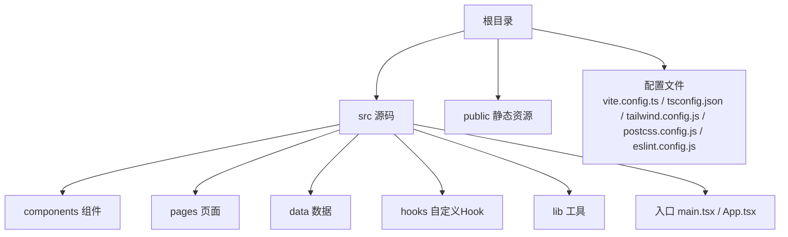
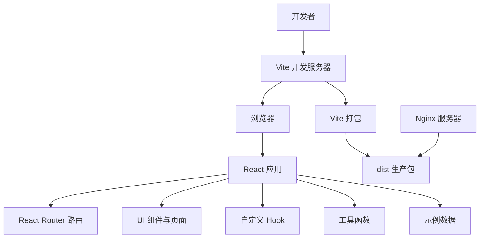
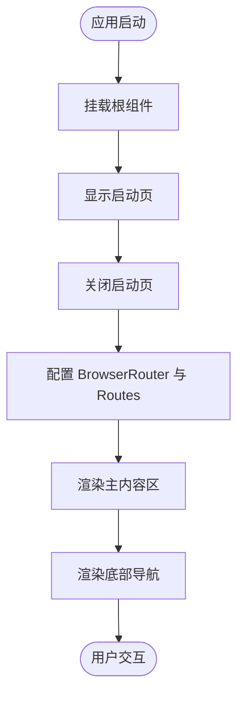
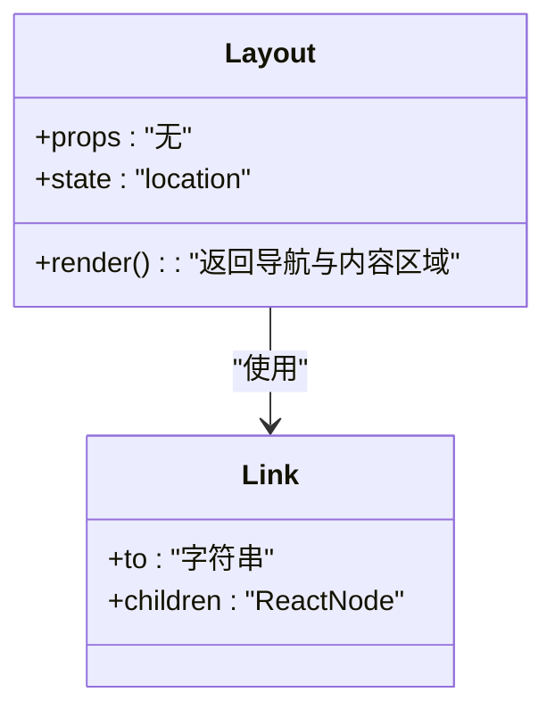
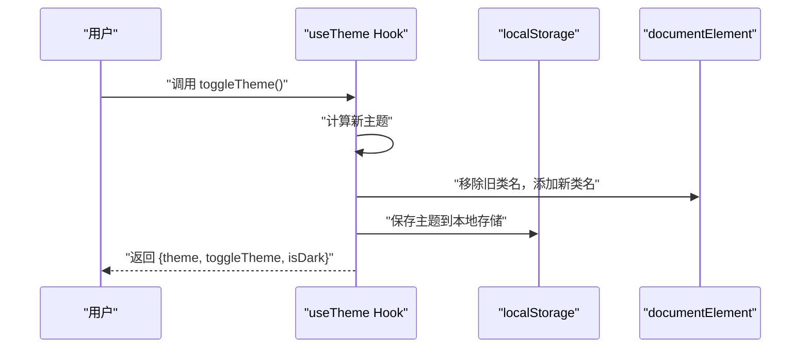
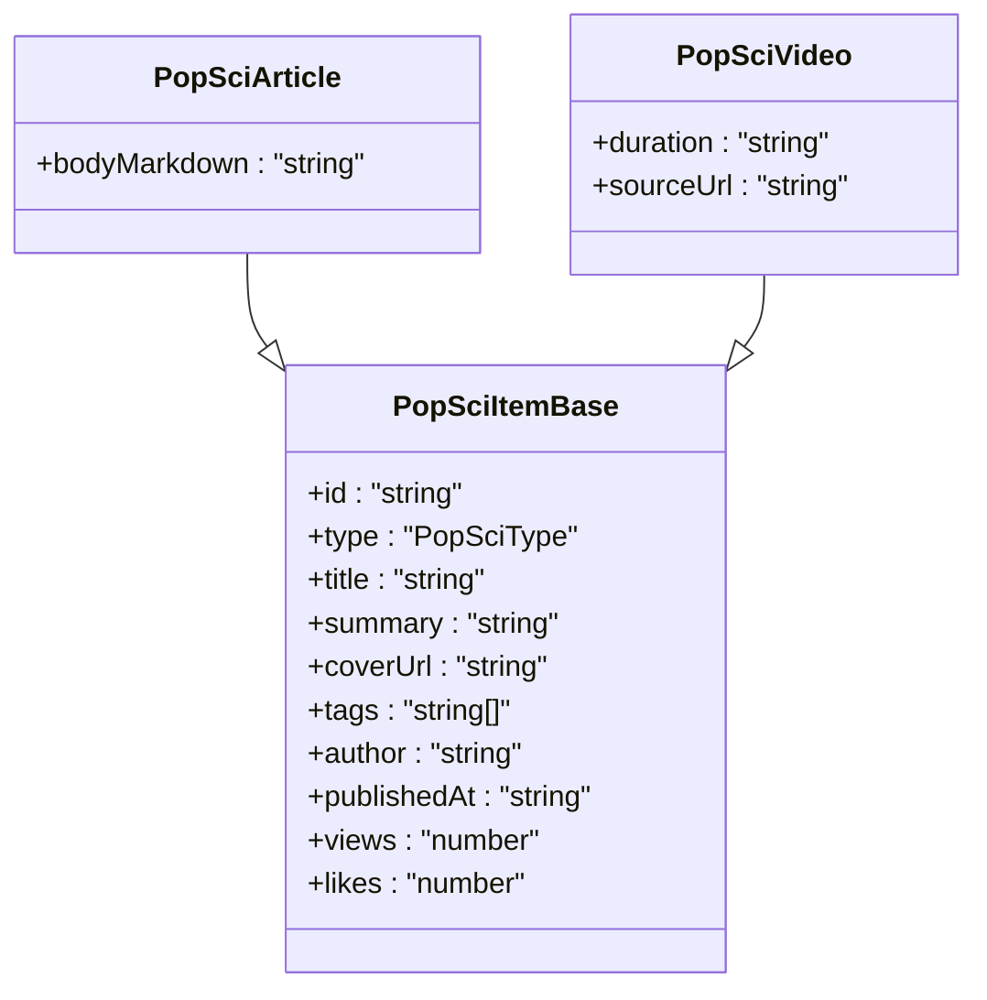

# 快速开始

<cite>
**本文引用的文件**
- [package.json](file://package.json)
- [vite.config.ts](file://vite.config.ts)
- [tsconfig.json](file://tsconfig.json)
- [tailwind.config.js](file://tailwind.config.js)
- [postcss.config.js](file://postcss.config.js)
- [eslint.config.js](file://eslint.config.js)
- [index.html](file://index.html)
- [src/main.tsx](file://src/main.tsx)
- [src/App.tsx](file://src/App.tsx)
- [src/components/Layout.tsx](file://src/components/Layout.tsx)
- [src/hooks/useTheme.ts](file://src/hooks/useTheme.ts)
- [src/lib/utils.ts](file://src/lib/utils.ts)
- [src/data/popsciCatalog.ts](file://src/data/popsciCatalog.ts)
- [nginx-config.txt](file://nginx-config.txt)
- [README.md](file://README.md)
- [test-tesseract.js](file://test-tesseract.js)
</cite>

## 目录
1. [简介](#简介)
2. [项目结构](#项目结构)
3. [核心组件](#核心组件)
4. [架构总览](#架构总览)
5. [详细组件分析](#详细组件分析)
6. [依赖分析](#依赖分析)
7. [性能考虑](#性能考虑)
8. [故障排除指南](#故障排除指南)
9. [结论](#结论)
10. [附录](#附录)

## 简介
本指南面向首次接触本医疗健康科普应用的开发者，帮助你在30分钟内完成环境准备、安装依赖、启动开发服务器、验证热重载、构建生产包，并理解项目目录与关键配置的作用。该应用采用 React + TypeScript + Vite 技术栈，使用 TailwindCSS 进行样式管理，内置 ESLint 规则与类型检查，支持移动端布局与主题切换。

## 项目结构
项目采用按功能分层的组织方式，核心目录与职责如下：
- src：源代码根目录
  - components：通用 UI 组件（如布局导航、启动页等）
  - pages：页面级组件（如首页、科普列表、服务详情等）
  - data：静态数据与类型定义（如科普内容目录）
  - hooks：自定义 Hook（如主题切换）
  - lib：工具函数（如类名合并）
- public：静态资源（图标、图片等）
- 根目录配置文件：Vite、TypeScript、TailwindCSS、ESLint、PostCSS 等

图表来源
- [src/main.tsx:1-11](file://src/main.tsx#L1-L11)
- [src/App.tsx:1-52](file://src/App.tsx#L1-L52)
- [vite.config.ts:1-22](file://vite.config.ts#L1-L22)
- [tsconfig.json:1-38](file://tsconfig.json#L1-L38)
- [tailwind.config.js:1-16](file://tailwind.config.js#L1-L16)
- [postcss.config.js:1-11](file://postcss.config.js#L1-L11)
- [eslint.config.js:1-29](file://eslint.config.js#L1-L29)

章节来源
- [src/main.tsx:1-11](file://src/main.tsx#L1-L11)
- [src/App.tsx:1-52](file://src/App.tsx#L1-L52)
- [vite.config.ts:1-22](file://vite.config.ts#L1-L22)
- [tsconfig.json:1-38](file://tsconfig.json#L1-L38)
- [tailwind.config.js:1-16](file://tailwind.config.js#L1-L16)
- [postcss.config.js:1-11](file://postcss.config.js#L1-L11)
- [eslint.config.js:1-29](file://eslint.config.js#L1-L29)

## 核心组件
- 应用入口与渲染
  - 入口文件负责挂载 React 根节点并渲染应用组件。
  - 参考路径：[src/main.tsx:1-11](file://src/main.tsx#L1-L11)
- 应用根组件与路由
  - 根组件配置浏览器路由、嵌套路由与页面占位符，统一包裹在布局组件中。
  - 参考路径：[src/App.tsx:1-52](file://src/App.tsx#L1-L52)
- 底部导航布局
  - 提供移动端底部导航栏，基于链接高亮与图标状态切换实现。
  - 参考路径：[src/components/Layout.tsx:1-66](file://src/components/Layout.tsx#L1-L66)
- 主题 Hook
  - 支持从本地存储读取主题偏好，监听系统深色模式并持久化切换。
  - 参考路径：[src/hooks/useTheme.ts:1-29](file://src/hooks/useTheme.ts#L1-L29)
- 工具函数
  - 类名合并工具，结合 Tailwind 合并策略，简化条件样式拼接。
  - 参考路径：[src/lib/utils.ts:1-7](file://src/lib/utils.ts#L1-L7)
- 示例数据
  - 科普文章与视频的数据模型与示例集合，便于演示详情页与列表页。
  - 参考路径：[src/data/popsciCatalog.ts:1-98](file://src/data/popsciCatalog.ts#L1-L98)

章节来源
- [src/main.tsx:1-11](file://src/main.tsx#L1-L11)
- [src/App.tsx:1-52](file://src/App.tsx#L1-L52)
- [src/components/Layout.tsx:1-66](file://src/components/Layout.tsx#L1-L66)
- [src/hooks/useTheme.ts:1-29](file://src/hooks/useTheme.ts#L1-L29)
- [src/lib/utils.ts:1-7](file://src/lib/utils.ts#L1-L7)
- [src/data/popsciCatalog.ts:1-98](file://src/data/popsciCatalog.ts#L1-L98)

## 架构总览
应用采用前端单页应用（SPA）架构，基于 React Router 实现客户端路由；Vite 提供开发服务器与打包能力；TailwindCSS 与 PostCSS 负责样式处理；TypeScript 提供类型安全；ESLint 保障代码质量。

图表来源
- [src/main.tsx:1-11](file://src/main.tsx#L1-L11)
- [src/App.tsx:1-52](file://src/App.tsx#L1-L52)
- [vite.config.ts:1-22](file://vite.config.ts#L1-L22)
- [nginx-config.txt:1-22](file://nginx-config.txt#L1-L22)

章节来源
- [src/main.tsx:1-11](file://src/main.tsx#L1-L11)
- [src/App.tsx:1-52](file://src/App.tsx#L1-L52)
- [vite.config.ts:1-22](file://vite.config.ts#L1-L22)
- [nginx-config.txt:1-22](file://nginx-config.txt#L1-L22)

## 详细组件分析

### 组件 A：应用根组件与路由
- 功能概述
  - 配置浏览器路由与嵌套路由，承载多个页面与占位页面，统一使用布局组件包裹。
  - 包含启动页显示逻辑，随后渲染主内容区与底部导航。
- 关键点
  - 路由层级清晰，首页与详情页分别对应不同路径。
  - 使用占位页面展示未来扩展功能（如历史、设置、帮助与关于）。
- 流程图（路由渲染）

图表来源
- [src/App.tsx:1-52](file://src/App.tsx#L1-L52)
- [src/components/Layout.tsx:1-66](file://src/components/Layout.tsx#L1-L66)

章节来源
- [src/App.tsx:1-52](file://src/App.tsx#L1-L52)
- [src/components/Layout.tsx:1-66](file://src/components/Layout.tsx#L1-L66)

### 组件 B：底部导航布局
- 功能概述
  - 提供移动端底部导航，根据当前路径高亮对应菜单项，支持图标与文字状态切换。
- 关键点
  - 使用图标库组件与类名合并工具实现视觉反馈。
  - 通过链接跳转与路径匹配判断当前激活项。
- 类图（组件关系）

图表来源
- [src/components/Layout.tsx:1-66](file://src/components/Layout.tsx#L1-L66)

章节来源
- [src/components/Layout.tsx:1-66](file://src/components/Layout.tsx#L1-L66)

### 组件 C：主题 Hook
- 功能概述
  - 从本地存储读取主题偏好，若未设置则跟随系统深色模式；切换主题时更新 HTML 根元素类名并持久化。
- 关键点
  - 通过副作用监听主题变化，自动写入本地存储。
- 序列图（主题切换）

图表来源
- [src/hooks/useTheme.ts:1-29](file://src/hooks/useTheme.ts#L1-L29)

章节来源
- [src/hooks/useTheme.ts:1-29](file://src/hooks/useTheme.ts#L1-L29)

### 组件 D：示例数据与类型
- 功能概述
  - 定义科普内容的数据模型（文章/视频），提供示例数据与查询方法（查找与列表）。
- 关键点
  - 类型安全：区分文章与视频字段差异。
  - 查询接口：按类型与 ID 查找单项，按类型列出多项。
- 类图（数据模型）

图表来源
- [src/data/popsciCatalog.ts:1-27](file://src/data/popsciCatalog.ts#L1-L27)

章节来源
- [src/data/popsciCatalog.ts:1-98](file://src/data/popsciCatalog.ts#L1-L98)

## 依赖分析
- 运行时依赖
  - React 生态与 UI 组件库：React、React DOM、React Router DOM、Lucide React 图标库。
  - 样式与动画：Tailwind Merge、clsx、Framer Motion。
  - Markdown 渲染：react-markdown、remark-gfm。
  - 状态管理：Zustand。
  - OCR 能力：tesseract.js（示例脚本已提供）。
- 开发依赖
  - Vite、@vitejs/plugin-react、vite-tsconfig-paths、vite-plugin-trae-solo-badge。
  - TypeScript、TailwindCSS、PostCSS、Autoprefixer。
  - ESLint 及相关插件（React Hooks、React Refresh）。
- 关键配置
  - Vite：启用 React 插件、TS 路径映射、开发错误监听。
  - TypeScript：模块解析、JSX、路径别名、严格性配置。
  - TailwindCSS：暗色模式开关、内容扫描范围、插件启用。
  - PostCSS：TailwindCSS 与 Autoprefixer。
  - ESLint：推荐规则、React Hooks 规则、仅导出组件规则。

章节来源
- [package.json:13-46](file://package.json#L13-L46)
- [vite.config.ts:1-22](file://vite.config.ts#L1-L22)
- [tsconfig.json:1-38](file://tsconfig.json#L1-L38)
- [tailwind.config.js:1-16](file://tailwind.config.js#L1-L16)
- [postcss.config.js:1-11](file://postcss.config.js#L1-L11)
- [eslint.config.js:1-29](file://eslint.config.js#L1-L29)

## 性能考虑
- 构建产物映射
  - Vite 构建默认生成 source map，可在生产环境中按需开启或关闭，平衡调试与体积。
  - 参考路径：[vite.config.ts:8-10](file://vite.config.ts#L8-L10)
- 样式与资源
  - TailwindCSS 按需扫描内容，避免无用样式进入产物。
  - 参考路径：[tailwind.config.js](file://tailwind.config.js#L5)
- 资源缓存（部署）
  - Nginx 对静态资源设置长期缓存，提升二次加载速度。
  - 参考路径：[nginx-config.txt:17-20](file://nginx-config.txt#L17-L20)

章节来源
- [vite.config.ts:8-10](file://vite.config.ts#L8-L10)
- [tailwind.config.js](file://tailwind.config.js#L5)
- [nginx-config.txt:17-20](file://nginx-config.txt#L17-L20)

## 故障排除指南
- 启动开发服务器失败
  - 症状：命令执行后无响应或报错。
  - 排查：确认 Node.js 版本满足项目要求；检查网络代理与包管理器缓存；尝试清理 node_modules 并重新安装。
  - 参考路径：[package.json:6-12](file://package.json#L6-L12)
- 热重载不生效
  - 症状：修改代码后浏览器未刷新。
  - 排查：确认开发服务器正在运行；检查浏览器控制台是否有编译错误；查看 HTML 中是否正确引入了热更新脚本。
  - 参考路径：[index.html:8-18](file://index.html#L8-L18)
- 路由 404 或刷新后丢失路径
  - 症状：访问二级路由或刷新页面后出现 404。
  - 排查：确认 Nginx 的 try_files 指向 index.html；或在开发环境下使用 Vite 默认路由。
  - 参考路径：[nginx-config.txt:11-14](file://nginx-config.txt#L11-L14)
- 样式未生效或 Tailwind 未扫描
  - 症状：自定义样式未出现。
  - 排查：确认内容扫描路径包含目标文件；检查 PostCSS 插件是否启用；重启开发服务器。
  - 参考路径：[tailwind.config.js](file://tailwind.config.js#L5)
- ESLint 报错
  - 症状：编辑器或终端提示规则错误。
  - 排查：根据规则提示修复；必要时调整 ESLint 配置或忽略特定文件。
  - 参考路径：[eslint.config.js:1-29](file://eslint.config.js#L1-L29)
- OCR 示例无法加载
  - 症状：OCR 初始化失败或超时。
  - 排查：确认网络可达；检查语言包加载；参考示例脚本进行最小化测试。
  - 参考路径：[test-tesseract.js:1-6](file://test-tesseract.js#L1-L6)

章节来源
- [package.json:6-12](file://package.json#L6-L12)
- [index.html:8-18](file://index.html#L8-L18)
- [nginx-config.txt:11-14](file://nginx-config.txt#L11-L14)
- [tailwind.config.js](file://tailwind.config.js#L5)
- [eslint.config.js:1-29](file://eslint.config.js#L1-L29)
- [test-tesseract.js:1-6](file://test-tesseract.js#L1-L6)

## 结论
通过本指南，你可以在短时间内完成环境准备、安装依赖、启动开发服务器并验证热重载，同时理解项目的核心目录与配置文件作用。建议在开发过程中充分利用 Vite 的快速启动、TypeScript 的类型安全与 TailwindCSS 的样式能力，逐步替换示例数据与页面占位，完善业务功能。

## 附录

### 环境要求与安装步骤
- 环境要求
  - Node.js：建议使用 LTS 版本（具体版本号请以项目实际需求为准）。
  - 包管理器：推荐使用 npm（与 package.json 脚本兼容）。
- 安装步骤
  1) 在项目根目录执行安装命令，等待依赖下载完成。
  2) 安装完成后，执行开发服务器启动脚本，打开浏览器访问本地地址。
  3) 如需预览生产效果，可执行预览脚本。
- 参考路径
  - [package.json:6-12](file://package.json#L6-L12)

章节来源
- [package.json:6-12](file://package.json#L6-L12)

### 项目启动流程与常用命令
- 开发服务器
  - 启动：执行开发脚本，等待编译完成并在浏览器打开。
  - 热重载：修改源码后自动刷新页面。
- 生产构建
  - 构建：执行构建脚本，生成 dist 目录。
  - 预览：执行预览脚本，在本地预览生产包。
- 参考路径
  - [package.json:6-12](file://package.json#L6-L12)
  - [vite.config.ts:1-22](file://vite.config.ts#L1-L22)

章节来源
- [package.json:6-12](file://package.json#L6-L12)
- [vite.config.ts:1-22](file://vite.config.ts#L1-L22)

### 关键配置文件说明
- package.json
  - 定义脚本、依赖与版本信息。
  - 参考路径：[package.json:1-48](file://package.json#L1-L48)
- vite.config.ts
  - 配置 Vite 插件（React、TS 路径映射）、构建参数与开发错误监听。
  - 参考路径：[vite.config.ts:1-22](file://vite.config.ts#L1-L22)
- tsconfig.json
  - TypeScript 编译选项、路径别名、严格性与 JSX 配置。
  - 参考路径：[tsconfig.json:1-38](file://tsconfig.json#L1-L38)
- tailwind.config.js
  - TailwindCSS 暗色模式、内容扫描与插件启用。
  - 参考路径：[tailwind.config.js:1-16](file://tailwind.config.js#L1-L16)
- postcss.config.js
  - PostCSS 插件链（TailwindCSS、Autoprefixer）。
  - 参考路径：[postcss.config.js:1-11](file://postcss.config.js#L1-L11)
- eslint.config.js
  - ESLint 推荐规则、React Hooks 与仅导出组件规则。
  - 参考路径：[eslint.config.js:1-29](file://eslint.config.js#L1-L29)
- index.html
  - 应用入口 HTML，包含热更新错误监听脚本。
  - 参考路径：[index.html:1-25](file://index.html#L1-L25)

章节来源
- [package.json:1-48](file://package.json#L1-L48)
- [vite.config.ts:1-22](file://vite.config.ts#L1-L22)
- [tsconfig.json:1-38](file://tsconfig.json#L1-L38)
- [tailwind.config.js:1-16](file://tailwind.config.js#L1-L16)
- [postcss.config.js:1-11](file://postcss.config.js#L1-L11)
- [eslint.config.js:1-29](file://eslint.config.js#L1-L29)
- [index.html:1-25](file://index.html#L1-L25)

### 生产环境部署参考
- Nginx 配置
  - 设置站点根目录为 dist；启用 try_files 指向 index.html；对静态资源设置长期缓存。
  - 参考路径：[nginx-config.txt:1-22](file://nginx-config.txt#L1-L22)
- 注意事项
  - 若启用 HTTPS，请取消注释重定向语句并配置证书。
  - 确保构建产物完整上传至 dist 目录。

章节来源
- [nginx-config.txt:1-22](file://nginx-config.txt#L1-L22)