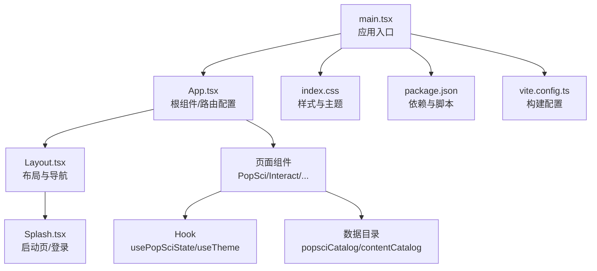
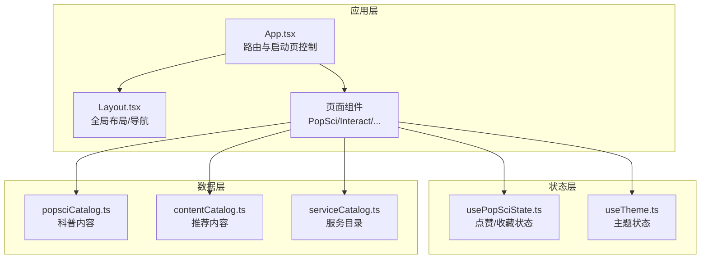
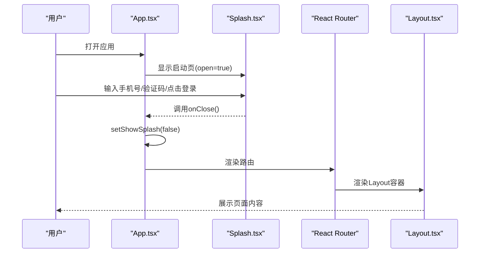
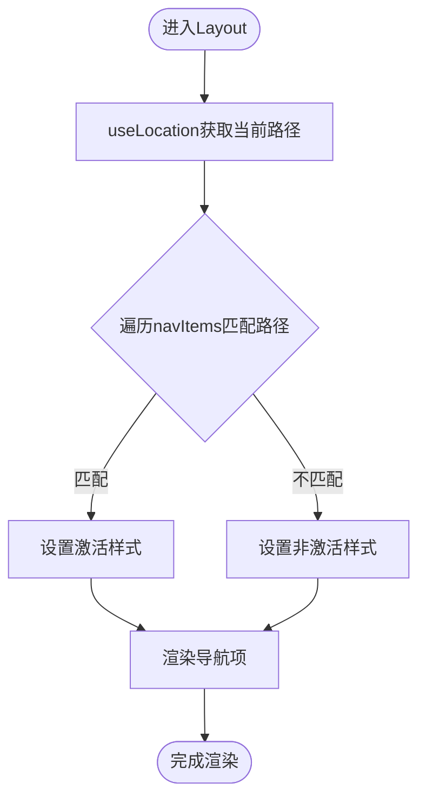
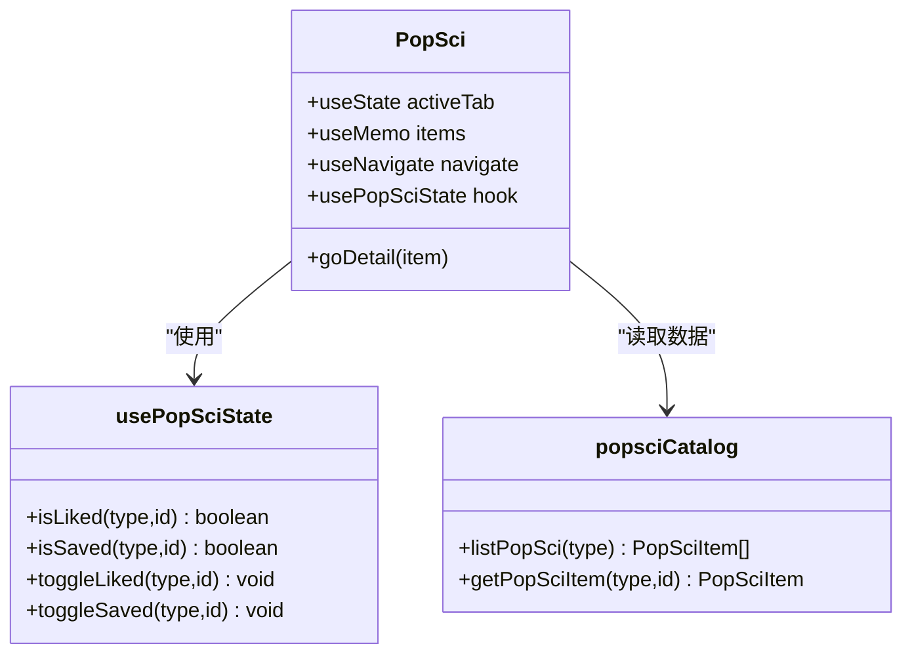
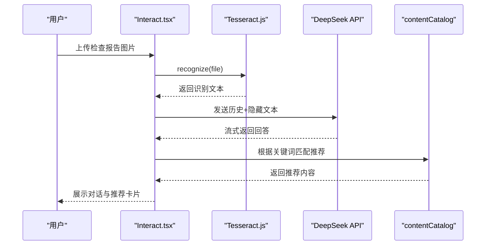
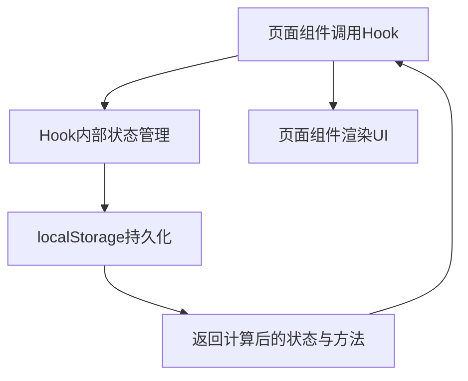
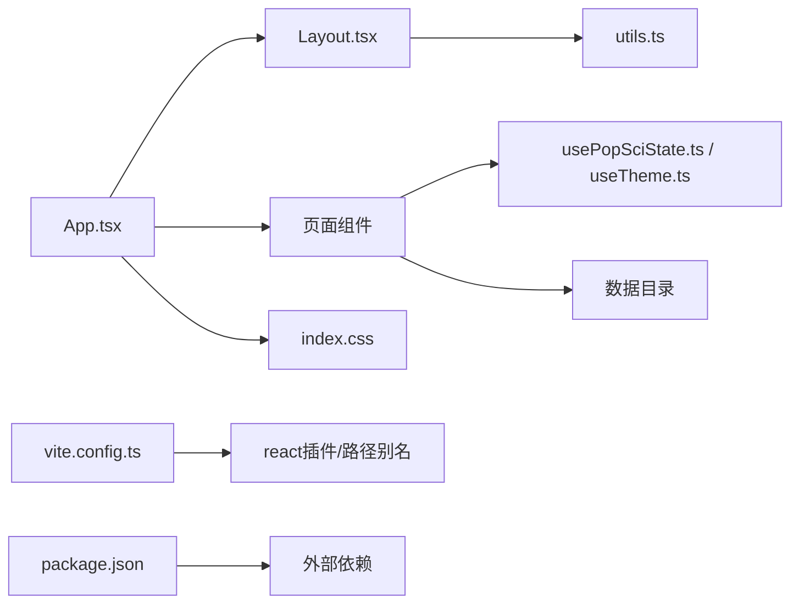

# 前端架构设计

<cite>
**本文档引用的文件**
- [src/App.tsx](file://src/App.tsx)
- [src/main.tsx](file://src/main.tsx)
- [src/components/Layout.tsx](file://src/components/Layout)
- [src/components/Splash.tsx](file://src/components/Splash)
- [src/hooks/usePopSciState.ts](file://src/hooks/usePopSciState)
- [src/hooks/useTheme.ts](file://src/hooks/useTheme)
- [src/lib/utils.ts](file://src/lib/utils)
- [src/pages/PopSci.tsx](file://src/pages/PopSci)
- [src/pages/Interact.tsx](file://src/pages/Interact)
- [src/data/popsciCatalog.ts](file://src/data/popsciCatalog)
- [src/data/contentCatalog.ts](file://src/data/contentCatalog)
- [src/data/serviceCatalog.ts](file://src/data/serviceCatalog)
- [src/index.css](file://src/index.css)
- [package.json](file://package.json)
- [tsconfig.json](file://tsconfig.json)
- [vite.config.ts](file://vite.config.ts)
</cite>

## 目录
1. [简介](#简介)
2. [项目结构](#项目结构)
3. [核心组件](#核心组件)
4. [架构总览](#架构总览)
5. [详细组件分析](#详细组件分析)
6. [依赖关系分析](#依赖关系分析)
7. [性能考虑](#性能考虑)
8. [故障排查指南](#故障排查指南)
9. [结论](#结论)
10. [附录](#附录)

## 简介
本项目为医疗健康科普应用的前端架构设计文档，基于 React 18 + TypeScript + Vite 技术栈，采用组件化架构模式。系统以 App.tsx 作为根组件，通过 React Router v7 实现路由配置；Layout 组件负责全局布局与底部导航；页面组件按功能域划分，共享组件库通过工具函数与 Hook 实现复用。数据层采用本地静态目录与 Hook 状态管理相结合的方式，实现轻量级的状态持久化与主题切换。

## 项目结构
项目采用按功能域分层的组织方式：
- 根入口：main.tsx 渲染 App.tsx
- 应用根：App.tsx 定义路由与顶层状态
- 布局层：Layout.tsx 提供全局容器与底部导航
- 页面层：按业务模块划分的页面组件
- 数据层：静态目录与类型定义
- 工具层：通用样式工具与自定义 Hook
- 样式层：Tailwind CSS 与主题变量

**图示来源**
- [src/main.tsx:1-11](file://src/main.tsx#L1-L11)
- [src/App.tsx:19-51](file://src/App.tsx#L19-L51)
- [src/components/Layout.tsx:19-65](file://src/components/Layout.tsx#L19-L65)
- [src/components/Splash.tsx:9-171](file://src/components/Splash.tsx#L9-L171)
- [src/index.css:1-61](file://src/index.css#L1-L61)
- [package.json:1-48](file://package.json#L1-L48)
- [vite.config.ts:1-22](file://vite.config.ts#L1-L22)

**章节来源**
- [src/main.tsx:1-11](file://src/main.tsx#L1-L11)
- [src/App.tsx:19-51](file://src/App.tsx#L19-L51)
- [src/components/Layout.tsx:19-65](file://src/components/Layout.tsx#L19-L65)
- [src/index.css:1-61](file://src/index.css#L1-L61)
- [package.json:13-26](file://package.json#L13-L26)
- [vite.config.ts:11-21](file://vite.config.ts#L11-L21)

## 核心组件
- 根组件 App.tsx：集中管理路由与启动页状态，使用 React Router v7 的嵌套路由模式，将页面组件挂载至 Layout 容器下。
- 布局组件 Layout.tsx：提供全局内容区与底部导航栏，使用 useLocation 判断激活状态，结合 cn 工具函数实现条件样式。
- 启动页组件 Splash.tsx：提供手机号登录与游客浏览两种入口，集成动画过渡与倒计时交互。
- 自定义 Hook：
  - usePopSciState：管理点赞/收藏状态，使用 localStorage 持久化，提供查询与切换方法。
  - useTheme：管理主题切换与系统偏好，持久化到 localStorage 并动态更新根元素类名。
- 工具函数 cn：封装 clsx 与 tailwind-merge，统一处理条件类名合并。

**章节来源**
- [src/App.tsx:19-51](file://src/App.tsx#L19-L51)
- [src/components/Layout.tsx:19-65](file://src/components/Layout.tsx#L19-L65)
- [src/components/Splash.tsx:9-171](file://src/components/Splash.tsx#L9-L171)
- [src/hooks/usePopSciState.ts:30-79](file://src/hooks/usePopSciState.ts#L30-L79)
- [src/hooks/useTheme.ts:5-29](file://src/hooks/useTheme.ts#L5-L29)
- [src/lib/utils.ts:4-6](file://src/lib/utils.ts#L4-L6)

## 架构总览
系统采用“根组件 + 布局容器 + 页面组件”的三层架构，配合自定义 Hook 实现状态与行为的复用。路由采用嵌套路由，页面组件通过 Outlet 渲染，底部导航与页面内容分离，便于扩展与维护。

**图示来源**
- [src/App.tsx:25-49](file://src/App.tsx#L25-L49)
- [src/components/Layout.tsx:19-65](file://src/components/Layout.tsx#L19-L65)
- [src/hooks/usePopSciState.ts:30-79](file://src/hooks/usePopSciState.ts#L30-L79)
- [src/hooks/useTheme.ts:5-29](file://src/hooks/useTheme.ts#L5-L29)
- [src/data/popsciCatalog.ts:29-98](file://src/data/popsciCatalog.ts#L29-L98)
- [src/data/contentCatalog.ts:13-101](file://src/data/contentCatalog.ts#L13-L101)
- [src/data/serviceCatalog.ts:10-49](file://src/data/serviceCatalog.ts#L10-L49)

## 详细组件分析

### 根组件 App.tsx
- 路由配置：使用 BrowserRouter 包裹，定义多级路由与嵌套路由，将页面组件挂载至 Layout 容器。
- 启动页控制：通过 useState 管理 showSplash 状态，传递给 Splash 组件并在登录成功后关闭。
- 路由映射：涵盖首页、科普详情、互动聊天、服务、我的、FAQ、公告详情、内容详情、广告页等。

**图示来源**
- [src/App.tsx:19-51](file://src/App.tsx#L19-L51)
- [src/components/Splash.tsx:9-49](file://src/components/Splash.tsx#L9-L49)

**章节来源**
- [src/App.tsx:19-51](file://src/App.tsx#L19-L51)

### 布局组件 Layout.tsx
- 结构设计：外层容器限定最大宽度与阴影，主内容区使用 flex-1 实现自适应高度，底部导航使用固定高度与安全区域适配。
- 导航逻辑：通过 useLocation 获取当前路径，根据路径匹配规则判断激活状态，图标与文字颜色随激活状态变化。
- 样式工具：导出 cn 函数，统一处理条件类名合并，便于在页面组件中复用。

**图示来源**
- [src/components/Layout.tsx:19-65](file://src/components/Layout.tsx#L19-L65)

**章节来源**
- [src/components/Layout.tsx:19-65](file://src/components/Layout.tsx#L19-L65)

### 页面组件 PopSci 分析
- 功能职责：展示科普文章与视频列表，支持标签切换、收藏/点赞交互、跳转详情页。
- 状态管理：使用 usePopSciState Hook 管理点赞/收藏状态，本地持久化；使用 useMemo 缓存数据列表。
- 交互设计：使用 Framer Motion 实现标签切换与列表项的动画过渡；键盘可访问性通过 Enter/Space 键触发跳转。
- 数据来源：从 popsciCatalog 中筛选指定类型的数据，支持文章与视频两类。

**图示来源**
- [src/pages/PopSci.tsx:26-36](file://src/pages/PopSci.tsx#L26-L36)
- [src/hooks/usePopSciState.ts:30-79](file://src/hooks/usePopSciState.ts#L30-L79)
- [src/data/popsciCatalog.ts:90-98](file://src/data/popsciCatalog.ts#L90-L98)

**章节来源**
- [src/pages/PopSci.tsx:26-270](file://src/pages/PopSci.tsx#L26-L270)
- [src/hooks/usePopSciState.ts:30-79](file://src/hooks/usePopSciState.ts#L30-L79)
- [src/data/popsciCatalog.ts:29-98](file://src/data/popsciCatalog.ts#L29-L98)

### 页面组件 Interact 分析
- 功能职责：提供健康问答与检查报告 OCR 识别能力，支持图片上传、流式 AI 回答、推荐内容展示。
- 状态管理：使用 useState 管理消息列表、输入文本、打字状态与 OCR 处理状态；通过 useEffect 持久化聊天历史。
- 流式响应：通过 Fetch API 的流式响应解析，逐步更新 AI 回答内容；支持本地默认推荐与关键词匹配推荐。
- OCR 能力：使用 Tesseract.js 进行图片文字识别，清理冗余空行并构造隐藏文本发送给 AI。

**图示来源**
- [src/pages/Interact.tsx:86-142](file://src/pages/Interact.tsx#L86-L142)
- [src/pages/Interact.tsx:144-248](file://src/pages/Interact.tsx#L144-L248)
- [src/data/contentCatalog.ts:69-99](file://src/data/contentCatalog.ts#L69-L99)

**章节来源**
- [src/pages/Interact.tsx:37-462](file://src/pages/Interact.tsx#L37-L462)
- [src/data/contentCatalog.ts:13-101](file://src/data/contentCatalog.ts#L13-L101)

### Hook 设计与状态提升
- usePopSciState：将点赞/收藏状态提升至 Hook，避免在多个页面重复维护，通过 localStorage 实现跨会话持久化。
- useTheme：将主题状态提升至 Hook，结合系统偏好与用户选择，动态更新根元素类名，便于全局样式切换。
- 状态提升策略：将与页面无关的业务状态抽象为 Hook，页面组件仅负责 UI 与交互，降低耦合度。

**图示来源**
- [src/hooks/usePopSciState.ts:30-79](file://src/hooks/usePopSciState.ts#L30-L79)
- [src/hooks/useTheme.ts:5-29](file://src/hooks/useTheme.ts#L5-L29)

**章节来源**
- [src/hooks/usePopSciState.ts:30-79](file://src/hooks/usePopSciState.ts#L30-L79)
- [src/hooks/useTheme.ts:5-29](file://src/hooks/useTheme.ts#L5-L29)

## 依赖关系分析
- 组件依赖：App.tsx 依赖 Layout 与页面组件；页面组件依赖 Hook 与数据目录；Layout 依赖 cn 工具函数。
- 外部依赖：React 18、React Router v7、Framer Motion、Lucide-React、Tailwind CSS、clsx、tailwind-merge、Zustand（声明但未使用）、Tesseract.js。
- 构建与开发：Vite + React 插件 + TypeScript 路径别名；ESLint 配置与类型检查。

**图示来源**
- [src/App.tsx:19-51](file://src/App.tsx#L19-L51)
- [src/components/Layout.tsx:19-65](file://src/components/Layout.tsx#L19-L65)
- [src/lib/utils.ts:4-6](file://src/lib/utils.ts#L4-L6)
- [package.json:13-26](file://package.json#L13-L26)
- [vite.config.ts:11-21](file://vite.config.ts#L11-L21)

**章节来源**
- [package.json:13-26](file://package.json#L13-L26)
- [vite.config.ts:11-21](file://vite.config.ts#L11-L21)
- [tsconfig.json:26-31](file://tsconfig.json#L26-L31)

## 性能考虑
- 渲染优化：页面组件使用 useMemo 缓存数据列表，减少不必要的重渲染；使用 Framer Motion 的布局动画时注意 popLayout 模式下的性能影响。
- 状态持久化：Hook 内部使用 localStorage，避免频繁写入；聊天历史在非打字与非 OCR 时才保存，降低存储压力。
- 图片与 OCR：上传图片后及时释放对象 URL，OCR 失败时清理临时资源；流式响应逐步更新，避免一次性渲染大文本。
- 样式与主题：通过根元素类名切换主题，避免重复样式计算；使用 cn 合并类名，减少无效样式叠加。

## 故障排查指南
- 路由不生效：检查 App.tsx 中路由路径与页面组件导入是否一致，确认 Layout 是否包裹在路由中。
- 启动页无法关闭：确认 Splash 的 onClose 回调是否正确传递并调用 setState。
- 主题切换无效：检查 useTheme 中根元素类名添加与 localStorage 写入逻辑。
- Hook 状态异常：确认 usePopSciState 的键生成规则与 localStorage 解析逻辑，确保类型与 ID 匹配。
- OCR 识别失败：检查文件类型与大小限制，确认 Tesseract.js worker 初始化与终止流程。
- 流式响应卡顿：检查 Fetch 流式读取的 TextDecoder 使用与缓冲区处理，确保及时更新状态。

**章节来源**
- [src/App.tsx:19-51](file://src/App.tsx#L19-L51)
- [src/components/Splash.tsx:9-49](file://src/components/Splash.tsx#L9-L49)
- [src/hooks/useTheme.ts:14-18](file://src/hooks/useTheme.ts#L14-L18)
- [src/hooks/usePopSciState.ts:13-24](file://src/hooks/usePopSciState.ts#L13-L24)
- [src/pages/Interact.tsx:94-142](file://src/pages/Interact.tsx#L94-L142)
- [src/pages/Interact.tsx:144-248](file://src/pages/Interact.tsx#L144-L248)

## 结论
本架构以 React 18 为基础，通过清晰的组件分层与 Hook 状态提升，实现了路由驱动的页面组织与可复用的共享逻辑。Layout 组件承担全局布局职责，页面组件聚焦业务功能，数据目录与 Hook 提供稳定的数据与状态支撑。未来可在以下方面进一步完善：引入错误边界捕获未处理异常、增加组件懒加载与代码分割、完善类型约束与单元测试覆盖、扩展主题系统与无障碍支持。

## 附录
- 接口设计规范
  - 数据接口：统一使用类型定义，字段命名遵循语义化，必要字段使用可选类型标记。
  - Hook 接口：返回值包含状态与操作方法，避免在 Hook 内部直接写入副作用。
  - 路由接口：路径参数与查询参数需明确类型，页面组件通过 useParams/useSearchParams 读取。
- 最佳实践示例
  - 状态提升：将与页面无关的状态抽象为 Hook，减少组件间重复逻辑。
  - 类名合并：统一使用 cn 工具函数，避免字符串拼接导致的样式冲突。
  - 动画与交互：使用 Framer Motion 管理过渡，保持流畅体验的同时控制性能开销。
  - 数据持久化：合理使用 localStorage，避免存储超限与解析异常。