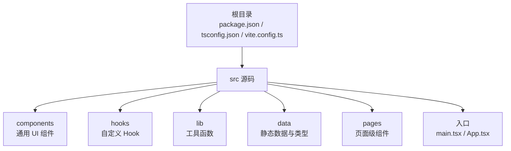
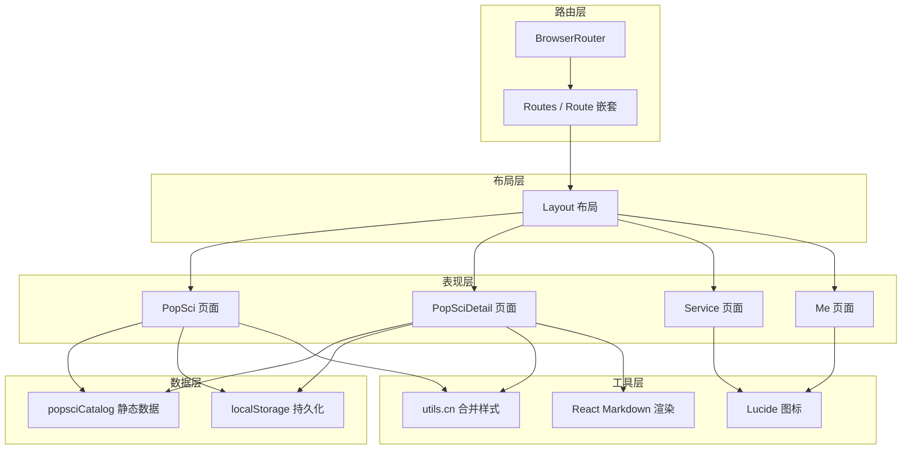
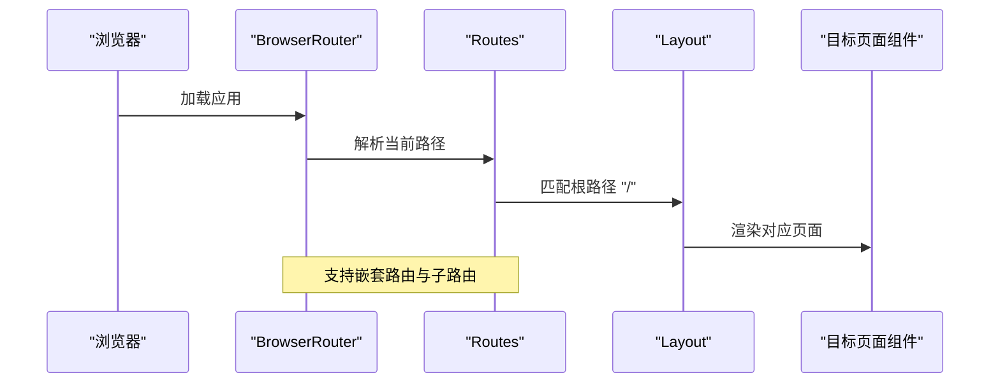
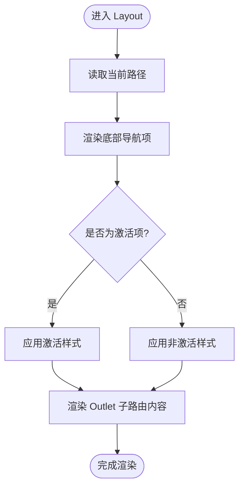
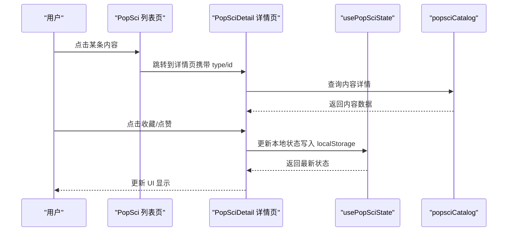
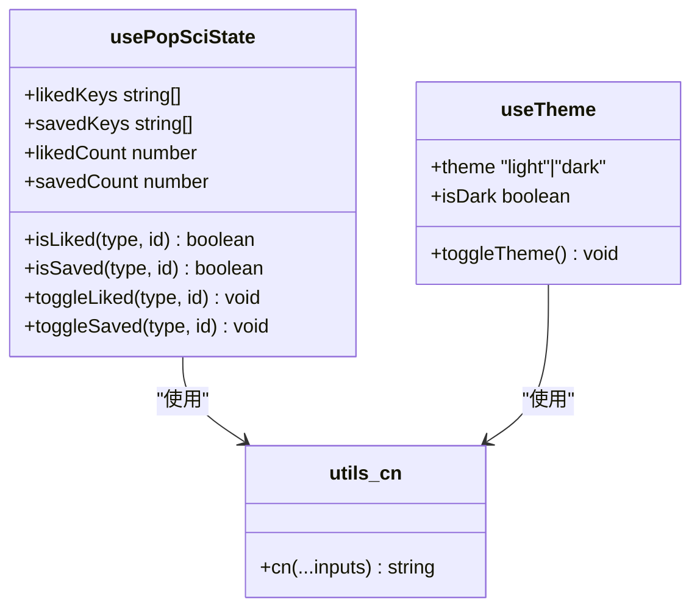
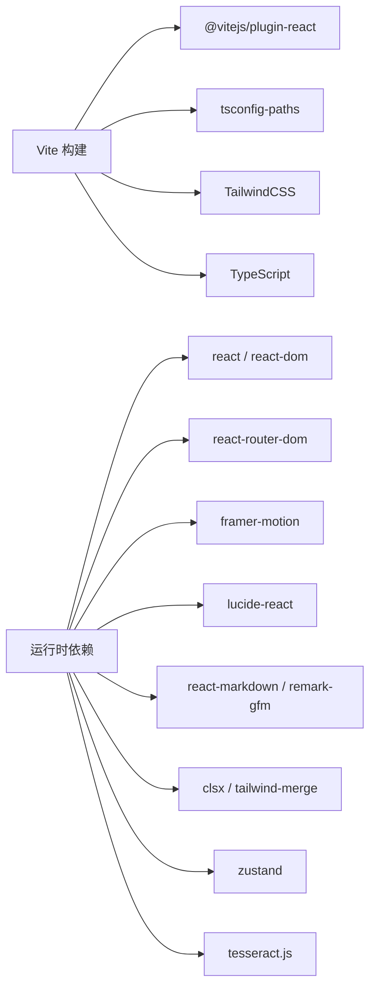

# 技术架构

<cite>
**本文引用的文件**
- [package.json](file://package.json)
- [vite.config.ts](file://vite.config.ts)
- [tsconfig.json](file://tsconfig.json)
- [src/main.tsx](file://src/main.tsx)
- [src/App.tsx](file://src/App.tsx)
- [src/components/Layout.tsx](file://src/components/Layout.tsx)
- [src/hooks/usePopSciState.ts](file://src/hooks/usePopSciState.ts)
- [src/hooks/useTheme.ts](file://src/hooks/useTheme.ts)
- [src/lib/utils.ts](file://src/lib/utils.ts)
- [src/data/popsciCatalog.ts](file://src/data/popsciCatalog.ts)
- [src/pages/Home.tsx](file://src/pages/Home.tsx)
- [src/pages/PopSci.tsx](file://src/pages/PopSci.tsx)
- [src/pages/PopSciDetail.tsx](file://src/pages/PopSciDetail.tsx)
- [src/pages/Service.tsx](file://src/pages/Service.tsx)
- [src/pages/Me.tsx](file://src/pages/Me.tsx)
</cite>

## 目录
1. [引言](#引言)
2. [项目结构](#项目结构)
3. [核心组件](#核心组件)
4. [架构总览](#架构总览)
5. [详细组件分析](#详细组件分析)
6. [依赖分析](#依赖分析)
7. [性能考量](#性能考量)
8. [故障排查指南](#故障排查指南)
9. [结论](#结论)
10. [附录](#附录)

## 引言
本技术架构文档面向医疗健康科普应用，系统性阐述基于 React 18 + TypeScript + Vite 的现代前端架构设计。重点覆盖组件化架构模式、状态管理模式、路由系统设计与构建工具配置；解释技术选型（如 React Router、Zustand、Framer Motion 等）的决策依据；梳理分层架构、模块划分原则与组件间通信机制；并提供数据流向分析、性能优化策略与可扩展性设计建议。文档同时配套架构图与组件关系图，帮助开发者快速理解整体设计与实现细节。

## 项目结构
项目采用按功能域划分的目录组织方式，结合 React 组件与页面的职责边界，形成清晰的层次化结构：
- 根级配置：Vite 构建配置、TypeScript 编译配置、包依赖与脚本
- 源码根目录 src 下：
  - components：通用 UI 组件（布局、空态、启动页）
  - hooks：自定义 Hook（状态与主题）
  - lib：通用工具函数（样式合并）
  - data：静态数据与类型定义（内容目录、服务目录）
  - pages：页面级组件（路由承载）
  - 应用入口：main.tsx、App.tsx

章节来源
- [package.json:1-48](file://package.json#L1-L48)
- [tsconfig.json:1-38](file://tsconfig.json#L1-L38)
- [vite.config.ts:1-22](file://vite.config.ts#L1-L22)

## 核心组件
本应用的核心由以下组件构成：
- 应用入口与路由容器：App.tsx
- 主布局与底部导航：Layout.tsx
- 内容列表与详情页：PopSci.tsx、PopSciDetail.tsx
- 服务入口页：Service.tsx
- 我的页：Me.tsx
- 自定义 Hook：usePopSciState.ts（本地持久化状态）、useTheme.ts（主题切换）
- 工具函数：utils.ts（样式合并）

这些组件共同实现“首页内容浏览—详情阅读—服务入口—个人中心”的完整业务闭环，并通过路由与状态 Hook 实现松耦合的数据流与交互体验。

章节来源
- [src/App.tsx:1-52](file://src/App.tsx#L1-L52)
- [src/components/Layout.tsx:1-66](file://src/components/Layout.tsx#L1-L66)
- [src/pages/PopSci.tsx:1-270](file://src/pages/PopSci.tsx#L1-L270)
- [src/pages/PopSciDetail.tsx:1-150](file://src/pages/PopSciDetail.tsx#L1-L150)
- [src/pages/Service.tsx:1-133](file://src/pages/Service.tsx#L1-L133)
- [src/pages/Me.tsx:1-65](file://src/pages/Me.tsx#L1-L65)
- [src/hooks/usePopSciState.ts:1-80](file://src/hooks/usePopSciState.ts#L1-L80)
- [src/hooks/useTheme.ts:1-29](file://src/hooks/useTheme.ts#L1-L29)
- [src/lib/utils.ts:1-7](file://src/lib/utils.ts#L1-L7)

## 架构总览
应用采用“页面驱动 + 组件化 + 自定义 Hook”的分层架构：
- 表现层：页面组件负责视图渲染与用户交互
- 布局层：Layout 提供统一布局与底部导航
- 数据层：静态数据目录与本地存储状态
- 工具层：样式合并、图标、Markdown 渲染等
- 路由层：BrowserRouter + Routes + Route 嵌套，承载页面与子路由

图表来源
- [src/App.tsx:1-52](file://src/App.tsx#L1-L52)
- [src/components/Layout.tsx:1-66](file://src/components/Layout.tsx#L1-L66)
- [src/pages/PopSci.tsx:1-270](file://src/pages/PopSci.tsx#L1-L270)
- [src/pages/PopSciDetail.tsx:1-150](file://src/pages/PopSciDetail.tsx#L1-L150)
- [src/pages/Service.tsx:1-133](file://src/pages/Service.tsx#L1-L133)
- [src/pages/Me.tsx:1-65](file://src/pages/Me.tsx#L1-L65)
- [src/data/popsciCatalog.ts:1-98](file://src/data/popsciCatalog.ts#L1-L98)
- [src/lib/utils.ts:1-7](file://src/lib/utils.ts#L1-L7)

## 详细组件分析

### 路由与应用容器
- App.tsx 作为顶层容器，使用 BrowserRouter 包裹，集中声明所有路由与嵌套路由，包含启动页、内容列表、详情页、服务页、个人中心及占位页等。
- 通过 Route 的 path 与 element 组合，实现路径到页面组件的映射；嵌套路由用于 Layout 容器下的子路由。

图表来源
- [src/App.tsx:19-51](file://src/App.tsx#L19-L51)

章节来源
- [src/App.tsx:1-52](file://src/App.tsx#L1-L52)

### 布局与导航
- Layout.tsx 提供统一的主内容区与底部导航栏，使用 Outlet 承载子路由内容。
- 导航项根据当前路径高亮，支持图标与标签展示，点击跳转至对应路径。
- 使用 cn 工具函数进行条件样式合并，提升样式可维护性。

图表来源
- [src/components/Layout.tsx:19-65](file://src/components/Layout.tsx#L19-L65)
- [src/lib/utils.ts:4-6](file://src/lib/utils.ts#L4-L6)

章节来源
- [src/components/Layout.tsx:1-66](file://src/components/Layout.tsx#L1-L66)
- [src/lib/utils.ts:1-7](file://src/lib/utils.ts#L1-L7)

### 内容列表与详情页
- PopSci.tsx 负责内容列表展示，支持“文章/视频/康复故事”三类标签切换，使用 Framer Motion 实现卡片切换动画与布局过渡。
- PopSciDetail.tsx 展示内容详情，根据类型渲染 Markdown 或外部视频链接，提供收藏与点赞操作，使用 usePopSciState Hook 管理本地状态。

图表来源
- [src/pages/PopSci.tsx:26-269](file://src/pages/PopSci.tsx#L26-L269)
- [src/pages/PopSciDetail.tsx:15-148](file://src/pages/PopSciDetail.tsx#L15-L148)
- [src/hooks/usePopSciState.ts:30-79](file://src/hooks/usePopSciState.ts#L30-L79)
- [src/data/popsciCatalog.ts:90-98](file://src/data/popsciCatalog.ts#L90-L98)

章节来源
- [src/pages/PopSci.tsx:1-270](file://src/pages/PopSci.tsx#L1-L270)
- [src/pages/PopSciDetail.tsx:1-150](file://src/pages/PopSciDetail.tsx#L1-L150)
- [src/hooks/usePopSciState.ts:1-80](file://src/hooks/usePopSciState.ts#L1-L80)
- [src/data/popsciCatalog.ts:1-98](file://src/data/popsciCatalog.ts#L1-L98)

### 服务入口与个人中心
- Service.tsx 展示服务入口与快捷跳转，使用 Lucide 图标与 Tailwind 样式，提供营养师专属服务入口与快速链接。
- Me.tsx 展示用户信息与菜单项，提供收藏、历史、设置、帮助与关于等入口。

章节来源
- [src/pages/Service.tsx:1-133](file://src/pages/Service.tsx#L1-L133)
- [src/pages/Me.tsx:1-65](file://src/pages/Me.tsx#L1-L65)

### 自定义 Hook 与工具函数
- usePopSciState.ts：封装内容收藏/点赞的本地状态，使用 localStorage 持久化，提供查询与切换方法。
- useTheme.ts：管理明暗主题，自动适配系统偏好并持久化。
- utils.ts：提供 cn 工具函数，合并条件样式类名。

图表来源
- [src/hooks/usePopSciState.ts:30-79](file://src/hooks/usePopSciState.ts#L30-L79)
- [src/hooks/useTheme.ts:5-28](file://src/hooks/useTheme.ts#L5-L28)
- [src/lib/utils.ts:4-6](file://src/lib/utils.ts#L4-L6)

章节来源
- [src/hooks/usePopSciState.ts:1-80](file://src/hooks/usePopSciState.ts#L1-L80)
- [src/hooks/useTheme.ts:1-29](file://src/hooks/useTheme.ts#L1-L29)
- [src/lib/utils.ts:1-7](file://src/lib/utils.ts#L1-L7)

## 依赖分析
- 构建与开发工具：Vite、@vitejs/plugin-react、tsconfig-paths、eslint、tailwindcss、TypeScript
- 运行时依赖：react、react-dom、react-router-dom、framer-motion、lucide-react、react-markdown、remark-gfm、clsx、tailwind-merge、zustand（状态管理）、tesseract.js（OCR，预留）

图表来源
- [package.json:13-26](file://package.json#L13-L26)
- [package.json:27-46](file://package.json#L27-L46)
- [vite.config.ts:11-21](file://vite.config.ts#L11-L21)

章节来源
- [package.json:1-48](file://package.json#L1-L48)
- [vite.config.ts:1-22](file://vite.config.ts#L1-L22)
- [tsconfig.json:1-38](file://tsconfig.json#L1-L38)

## 性能考量
- 路由与渲染优化
  - 使用 React Router 的嵌套路由与 Outlet，避免重复渲染父级布局。
  - 列表页使用 useMemo 缓存筛选结果，减少不必要的重渲染。
- 动画与交互
  - 使用 Framer Motion 实现卡片切换与布局过渡，配合 AnimatePresence 与 layoutId，保证流畅体验。
- 样式与体积
  - 使用 Tailwind 与 clsx/tailwind-merge 合并样式，减少冗余类名，降低打包体积。
- 构建与调试
  - Vite 开发模式启用 react-dev-locator 插件，便于定位组件；生产构建开启隐藏 SourceMap，平衡调试与安全。
- 状态管理
  - 当前使用 localStorage 与自定义 Hook 管理轻量状态，具备良好性能与易用性；若未来业务复杂度上升，可评估引入 Zustand 或 Redux Toolkit。

章节来源
- [src/pages/PopSci.tsx:26-32](file://src/pages/PopSci.tsx#L26-L32)
- [src/App.tsx:19-23](file://src/App.tsx#L19-L23)
- [vite.config.ts:11-21](file://vite.config.ts#L11-L21)

## 故障排查指南
- 路由无法匹配
  - 检查 App.tsx 中路由 path 是否与 Layout 嵌套一致，确认子路由是否正确挂载到 Layout。
- 内容为空或未显示
  - 检查 popsciCatalog 中是否存在对应 type/id 的条目；确认 getPopSciItem 查询逻辑与参数传递。
- 收藏/点赞状态不同步
  - 确认 usePopSciState 的 localStorage 键名一致，检查 toggle 方法调用与依赖数组。
- 主题切换无效
  - 检查 useTheme 的主题类名写入与系统偏好匹配逻辑，确认 DOM 上的 class 切换。
- 构建报错
  - 检查 tsconfig.json 的路径别名与编译选项；确认 Vite 插件配置与依赖安装。

章节来源
- [src/App.tsx:25-49](file://src/App.tsx#L25-L49)
- [src/data/popsciCatalog.ts:90-98](file://src/data/popsciCatalog.ts#L90-L98)
- [src/hooks/usePopSciState.ts:30-79](file://src/hooks/usePopSciState.ts#L30-L79)
- [src/hooks/useTheme.ts:5-28](file://src/hooks/useTheme.ts#L5-L28)
- [tsconfig.json:27-31](file://tsconfig.json#L27-L31)
- [vite.config.ts:11-21](file://vite.config.ts#L11-L21)

## 结论
本应用采用 React 18 + TypeScript + Vite 的现代前端技术栈，结合组件化架构、自定义 Hook 与路由系统，实现了清晰的分层与良好的可维护性。通过 Framer Motion 提升交互体验，通过 Tailwind 与样式工具提升开发效率。当前状态管理以 localStorage 与自定义 Hook 为主，满足轻量需求；随着业务演进，可平滑引入 Zustand 等状态管理方案。整体架构具备良好的扩展性与性能基础，适合在移动端场景下持续迭代。

## 附录
- 技术选型说明
  - React Router：提供声明式路由与嵌套路由能力，适配移动端导航与页面切换。
  - Framer Motion：提供高性能动画与布局过渡，增强用户体验。
  - Zustand：轻量状态管理，适合小型应用或局部状态管理。
  - Tailwind CSS：原子化样式框架，提升样式开发效率与一致性。
  - Vite：快速构建工具，提供热更新与优化的打包能力。
- 可扩展建议
  - 引入 Zustand 管理跨页面共享状态（如用户会话、全局主题）。
  - 对内容列表进行虚拟滚动与懒加载，提升长列表性能。
  - 将静态数据迁移为 API 接口，支持动态内容与多语言。
  - 增加错误边界与日志上报，完善可观测性。