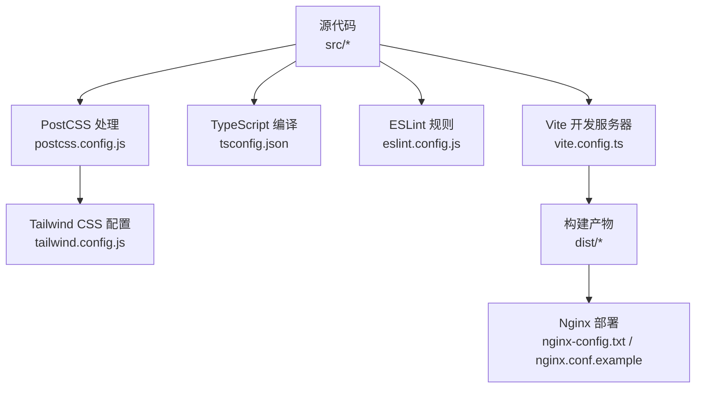
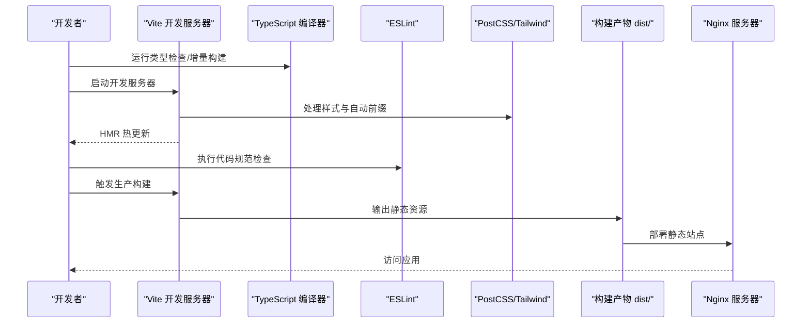
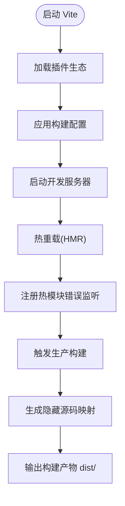
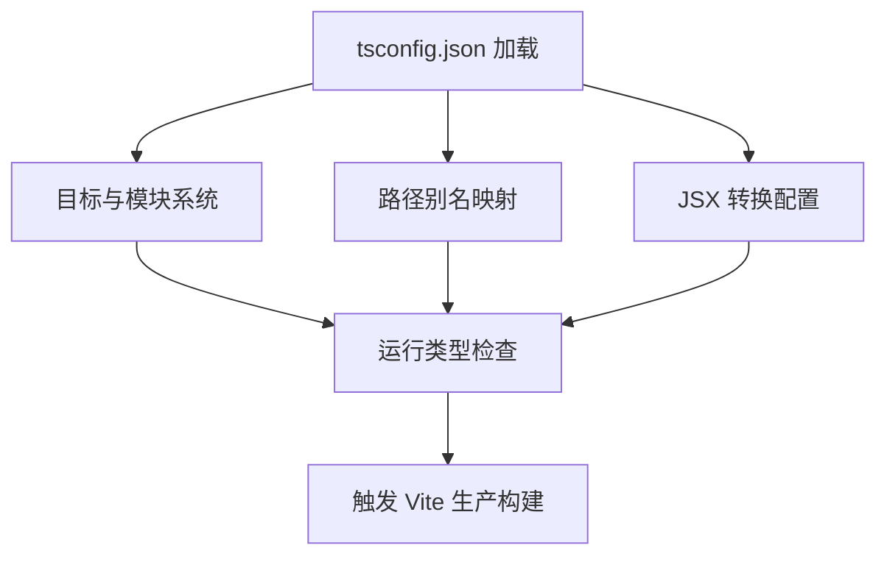
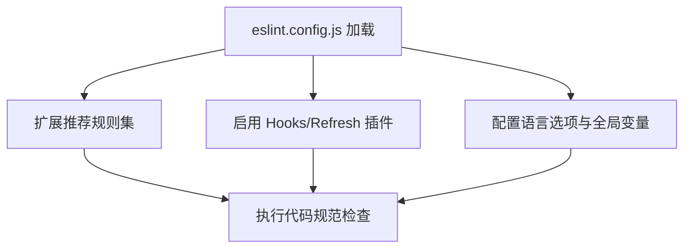
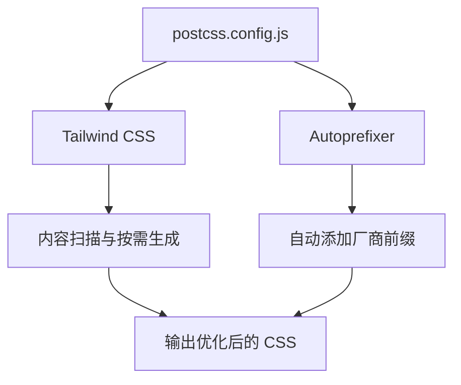
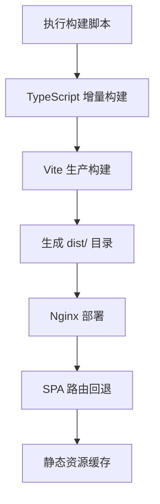
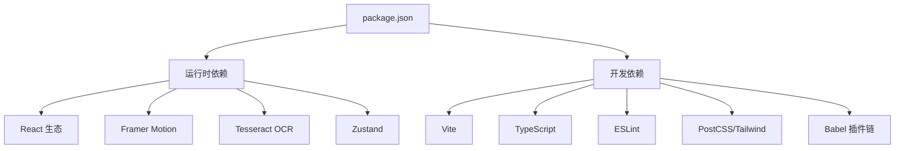

# 构建配置系统

<cite>
**本文档引用的文件**
- [vite.config.ts](file://vite.config.ts)
- [package.json](file://package.json)
- [tsconfig.json](file://tsconfig.json)
- [eslint.config.js](file://eslint.config.js)
- [postcss.config.js](file://postcss.config.js)
- [tailwind.config.js](file://tailwind.config.js)
- [src/vite-env.d.ts](file://src/vite-env.d.ts)
- [index.html](file://index.html)
- [nginx-config.txt](file://nginx-config.txt)
- [nginx.conf.example](file://nginx.conf.example)
- [README.md](file://README.md)
</cite>

## 目录
1. [简介](#简介)
2. [项目结构](#项目结构)
3. [核心组件](#核心组件)
4. [架构总览](#架构总览)
5. [详细组件分析](#详细组件分析)
6. [依赖关系分析](#依赖关系分析)
7. [性能考虑](#性能考虑)
8. [故障排除指南](#故障排除指南)
9. [结论](#结论)
10. [附录](#附录)

## 简介
本文件系统性梳理该医疗健康科普应用的构建配置体系，围绕基于 Vite 的现代化构建流程展开，覆盖开发服务器配置、生产构建优化、插件生态、TypeScript 编译与类型检查、PostCSS 样式处理、ESLint 代码规范、环境变量管理、构建产物优化与部署配置、开发环境搭建与热重载机制、调试配置、构建性能优化策略、代码分割方案、缓存配置以及 Git 工作流与版本管理建议。文档面向不同技术背景读者，既提供高层概览也包含深入的技术细节与可视化图示。

## 项目结构
该项目采用前端单页应用（SPA）架构，使用 React + TypeScript + Vite 技术栈，配合 Tailwind CSS 实现样式体系，通过 PostCSS 自动前缀与按需引入。构建脚本由 Vite 驱动，TypeScript 编译与类型检查通过独立命令执行，ESLint 提供代码质量保障。

图表来源
- [vite.config.ts:1-22](file://vite.config.ts#L1-L22)
- [tsconfig.json:1-38](file://tsconfig.json#L1-L38)
- [eslint.config.js:1-29](file://eslint.config.js#L1-L29)
- [postcss.config.js:1-11](file://postcss.config.js#L1-L11)
- [tailwind.config.js:1-16](file://tailwind.config.js#L1-L16)
- [nginx-config.txt:1-22](file://nginx-config.txt#L1-L22)

章节来源
- [package.json:1-48](file://package.json#L1-L48)
- [index.html:1-25](file://index.html#L1-L25)

## 核心组件
- Vite 构建与开发服务器：负责模块解析、HMR、打包与预览。
- TypeScript 编译与类型检查：独立于 Vite 的类型检查与增量构建。
- ESLint：统一的代码风格与 React Hooks 规则校验。
- PostCSS + Tailwind CSS：原子化样式与自动前缀。
- Nginx 部署：静态资源服务与 SPA 路由回退。

章节来源
- [vite.config.ts:1-22](file://vite.config.ts#L1-L22)
- [package.json:6-12](file://package.json#L6-L12)
- [tsconfig.json:1-38](file://tsconfig.json#L1-L38)
- [eslint.config.js:1-29](file://eslint.config.js#L1-L29)
- [postcss.config.js:1-11](file://postcss.config.js#L1-L11)
- [tailwind.config.js:1-16](file://tailwind.config.js#L1-L16)
- [nginx-config.txt:1-22](file://nginx-config.txt#L1-L22)

## 架构总览
下图展示从开发到生产的完整构建链路，包括热重载、类型检查、代码规范、样式处理与最终部署。

图表来源
- [vite.config.ts:1-22](file://vite.config.ts#L1-L22)
- [package.json:6-12](file://package.json#L6-L12)
- [tsconfig.json:1-38](file://tsconfig.json#L1-L38)
- [eslint.config.js:1-29](file://eslint.config.js#L1-L29)
- [postcss.config.js:1-11](file://postcss.config.js#L1-L11)
- [tailwind.config.js:1-16](file://tailwind.config.js#L1-L16)
- [nginx-config.txt:1-22](file://nginx-config.txt#L1-L22)

## 详细组件分析

### Vite 构建配置
- 插件生态
  - React 插件：启用 Fast Refresh 与 Babel 插件链，包含开发定位辅助插件以提升调试体验。
  - 路径别名插件：通过 tsconfig 路径映射实现 import 路径解析。
  - Trae 徽章插件：用于在开发环境中显示徽章信息。
- 构建输出
  - 源码映射：生产构建使用隐藏源码映射，兼顾调试与体积控制。
- 开发特性
  - HMR：Vite 内置热重载，结合 React 插件实现组件级热替换。
  - 错误监听：HTML 中注册热模块错误事件，便于捕获并打印错误信息与堆栈帧。

图表来源
- [vite.config.ts:1-22](file://vite.config.ts#L1-L22)
- [index.html:8-18](file://index.html#L8-L18)

章节来源
- [vite.config.ts:1-22](file://vite.config.ts#L1-L22)
- [index.html:1-25](file://index.html#L1-L25)

### TypeScript 编译配置
- 目标与模块系统：ES2020 目标与 ESNext 模块解析，支持现代浏览器特性与动态导入。
- JSX 与严格性：使用 React JSX 转换；关闭严格模式与未使用规则，降低入门门槛。
- 路径别名：通过路径映射简化 import 语句，提升可维护性。
- 类型检查：独立于 Vite 的类型检查命令，确保构建前无类型错误。

图表来源
- [tsconfig.json:1-38](file://tsconfig.json#L1-L38)
- [package.json:6-12](file://package.json#L6-L12)

章节来源
- [tsconfig.json:1-38](file://tsconfig.json#L1-L38)
- [package.json:6-12](file://package.json#L6-L12)

### ESLint 代码规范
- 规则扩展：基于推荐规则集，扩展 React Hooks 与 React Refresh 规则。
- 语言选项：启用浏览器全局变量，适配前端环境。
- 推荐实践：提供类型感知的 ESLint 配置升级路径，建议在生产环境启用更严格的规则集。

图表来源
- [eslint.config.js:1-29](file://eslint.config.js#L1-L29)
- [README.md:10-57](file://README.md#L10-L57)

章节来源
- [eslint.config.js:1-29](file://eslint.config.js#L1-L29)
- [README.md:10-57](file://README.md#L10-L57)

### PostCSS 与 Tailwind CSS
- PostCSS 插件：Tailwind CSS 与 Autoprefixer 自动添加厂商前缀。
- Tailwind 配置：深色模式基于类名切换，内容扫描范围覆盖 HTML 与源代码目录，启用排版插件增强文本样式。

图表来源
- [postcss.config.js:1-11](file://postcss.config.js#L1-L11)
- [tailwind.config.js:1-16](file://tailwind.config.js#L1-L16)

章节来源
- [postcss.config.js:1-11](file://postcss.config.js#L1-L11)
- [tailwind.config.js:1-16](file://tailwind.config.js#L1-L16)

### 环境变量与开发环境
- 类型声明：Vite 环境类型声明文件确保开发时类型安全。
- 开发脚本：通过 Vite 启动本地开发服务器，支持热重载与错误监听。
- 预览脚本：本地预览生产构建效果，便于验证打包产物。

章节来源
- [src/vite-env.d.ts:1-2](file://src/vite-env.d.ts#L1-L2)
- [package.json:6-12](file://package.json#L6-L12)
- [index.html:1-25](file://index.html#L1-L25)

### 构建产物优化与部署
- 构建命令：先执行 TypeScript 增量构建，再进行 Vite 生产构建，确保类型安全与打包一致性。
- 源码映射：生产构建使用隐藏源码映射，平衡调试与体积。
- 部署配置：Nginx 配置将根目录指向 dist，使用 try_files 将 SPA 路由回退至 index.html，并对静态资源设置长期缓存。

图表来源
- [package.json:6-12](file://package.json#L6-L12)
- [vite.config.ts:8-10](file://vite.config.ts#L8-L10)
- [nginx-config.txt:1-22](file://nginx-config.txt#L1-L22)

章节来源
- [package.json:6-12](file://package.json#L6-L12)
- [vite.config.ts:8-10](file://vite.config.ts#L8-L10)
- [nginx-config.txt:1-22](file://nginx-config.txt#L1-L22)

## 依赖关系分析
- 开发依赖与运行时依赖：React 生态、Framer Motion 动画库、Tailwind CSS 及其插件、Tesseract OCR、Zustand 状态管理等。
- 构建工具链：Vite、TypeScript、ESLint、PostCSS、Tailwind CSS、Babel 插件链。

图表来源
- [package.json:13-46](file://package.json#L13-L46)

章节来源
- [package.json:13-46](file://package.json#L13-L46)

## 性能考虑
- 构建性能优化策略
  - 使用 Vite 的原生 ESM 与快速冷启动，减少等待时间。
  - 启用隐藏源码映射以降低生产包体积，同时保留必要调试能力。
  - 利用 TypeScript 增量构建与并行编译，缩短类型检查时间。
- 代码分割方案
  - 基于 Vite 的动态导入与路由懒加载，结合 React Router 的按需加载，实现页面级代码分割。
  - Tailwind 按需生成减少 CSS 体积。
- 缓存配置
  - Nginx 对静态资源设置长期缓存，提升二次访问速度。
  - 浏览器端可通过 Service Worker 或 CDN 缓存策略进一步优化。

## 故障排除指南
- 热重载不生效
  - 检查开发服务器是否正常启动，确认 HMR 相关日志输出。
  - 确认 React 插件与 Babel 插件链配置正确。
- 类型检查失败
  - 先执行类型检查命令，修复类型错误后再进行生产构建。
  - 检查 tsconfig 路径映射与包含范围。
- ESLint 报错
  - 根据规则提示修正代码风格与 Hooks 使用问题。
  - 在生产环境可启用更严格的 ESLint 规则集。
- Nginx 部署 404
  - 确认根目录指向 dist，location / 使用 try_files 回退至 index.html。
  - 检查静态资源缓存配置是否影响资源加载。

章节来源
- [vite.config.ts:1-22](file://vite.config.ts#L1-L22)
- [tsconfig.json:1-38](file://tsconfig.json#L1-L38)
- [eslint.config.js:1-29](file://eslint.config.js#L1-L29)
- [nginx-config.txt:1-22](file://nginx-config.txt#L1-L22)

## 结论
该构建配置系统以 Vite 为核心，结合 TypeScript、ESLint、PostCSS/Tailwind CSS 形成完整的现代化前端工程化链路。通过合理的插件生态、严格的类型检查与代码规范、以及 Nginx 的 SPA 路由回退与静态资源缓存策略，实现了开发效率与生产性能的平衡。建议在生产环境中逐步启用更严格的 ESLint 规则集与更细粒度的代码分割策略，以进一步提升代码质量与用户体验。

## 附录
- 开发环境搭建
  - 安装依赖后，使用开发脚本启动本地服务器，即可享受 HMR 与错误监听功能。
- Git 工作流与版本管理
  - 建议采用分支策略（如 Git Flow），在合并主分支前执行类型检查与 ESLint 规范检查，确保代码质量。
- 持续集成配置
  - 在 CI 中增加类型检查、ESLint 规范检查与生产构建步骤，失败即阻断发布。