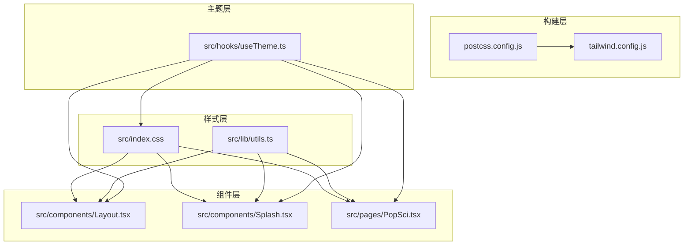
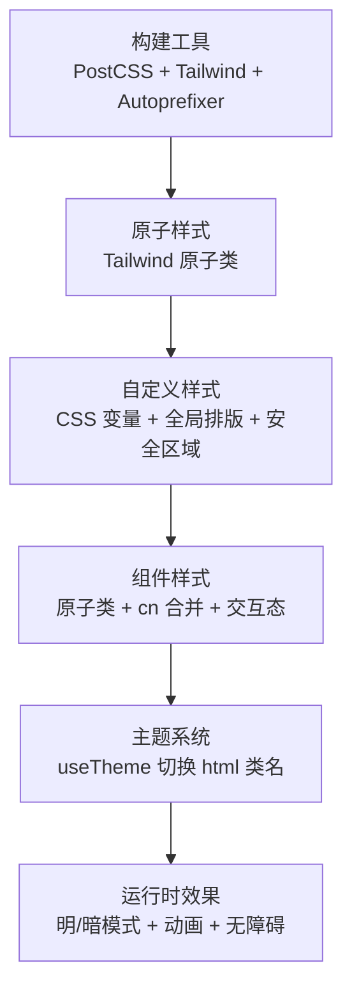
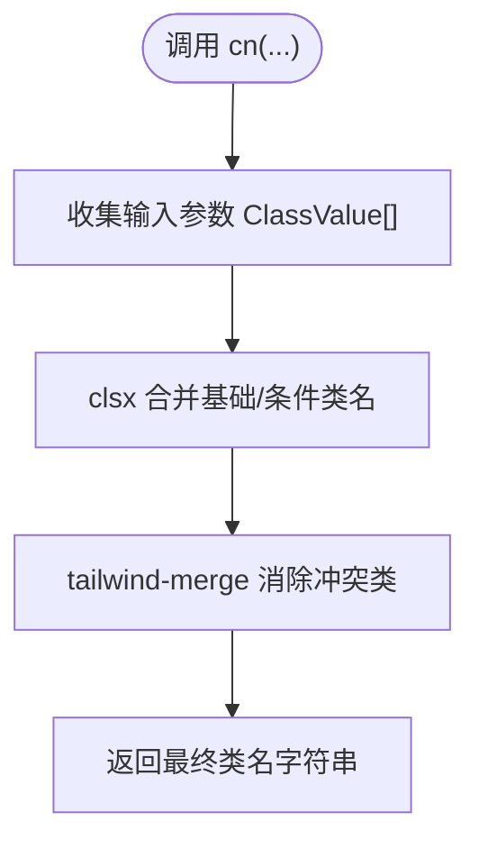
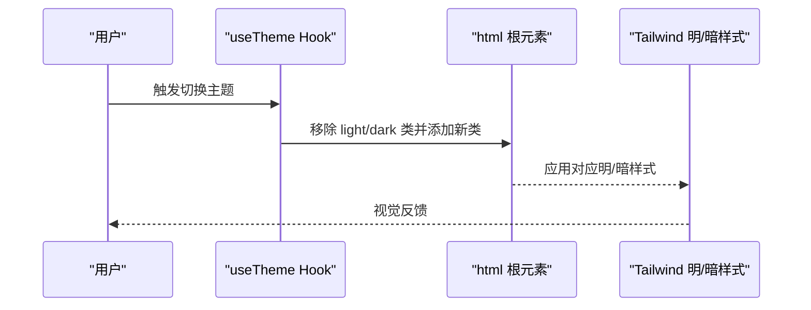
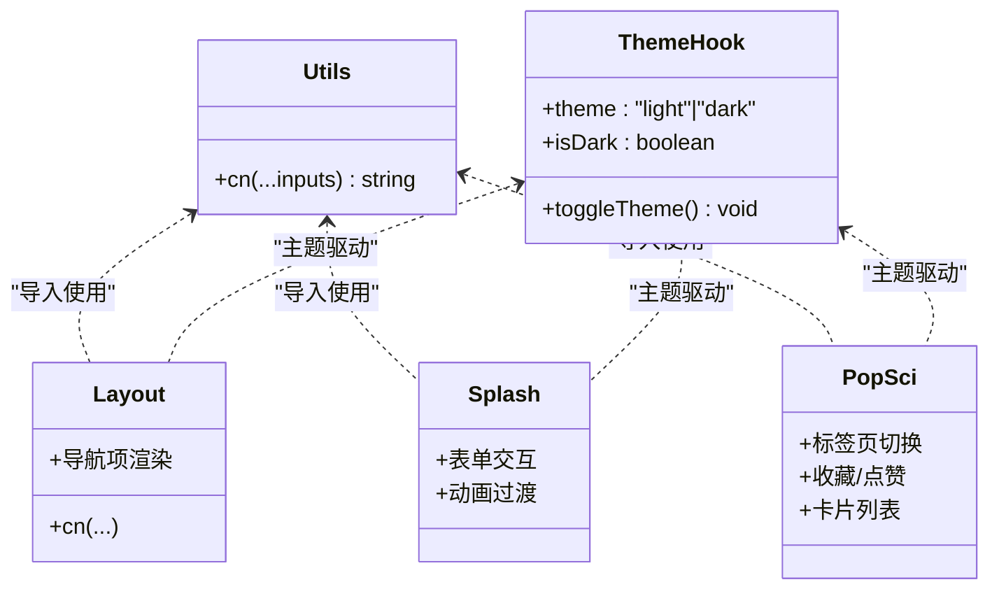
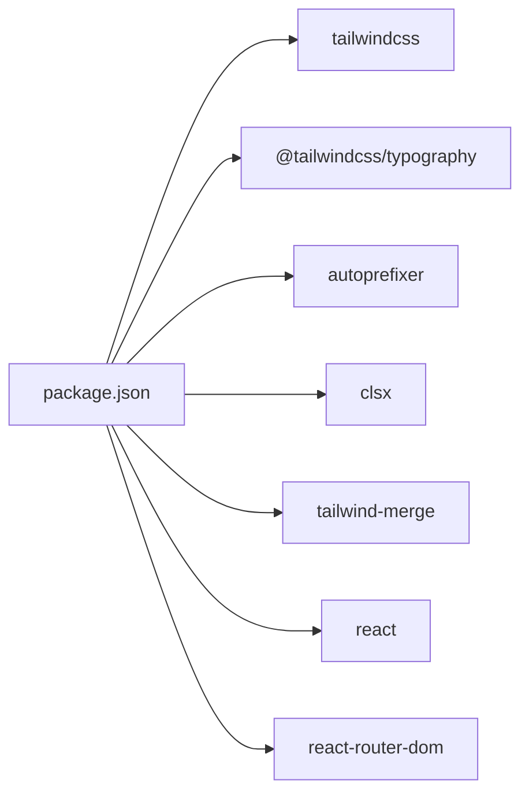

# 样式系统架构

<cite>
**本文档引用的文件**
- [tailwind.config.js](file://tailwind.config.js)
- [postcss.config.js](file://postcss.config.js)
- [src/index.css](file://src/index.css)
- [src/hooks/useTheme.ts](file://src/hooks/useTheme.ts)
- [src/lib/utils.ts](file://src/lib/utils.ts)
- [src/components/Layout.tsx](file://src/components/Layout.tsx)
- [src/components/Splash.tsx](file://src/components/Splash.tsx)
- [src/pages/PopSci.tsx](file://src/pages/PopSci.tsx)
- [src/App.tsx](file://src/App.tsx)
- [package.json](file://package.json)
</cite>

## 目录
1. [简介](#简介)
2. [项目结构](#项目结构)
3. [核心组件](#核心组件)
4. [架构总览](#架构总览)
5. [详细组件分析](#详细组件分析)
6. [依赖关系分析](#依赖关系分析)
7. [性能考量](#性能考量)
8. [故障排查指南](#故障排查指南)
9. [结论](#结论)
10. [附录](#附录)

## 简介
本项目采用基于 Tailwind CSS 的原子化样式系统，结合 PostCSS 自动前缀与 Tailwind 扫描构建，形成可维护、可扩展且面向移动端的样式架构。系统通过自定义 CSS 变量定义品牌色彩与基础排版，配合暗色模式类名切换与安全区域适配工具类，实现统一的主题与视觉语言。组件层广泛使用 clsx/tailwind-merge 进行类名合并与冲突消解，确保样式组合的确定性与可读性。

## 项目结构
样式系统由以下层次构成：
- 构建层：PostCSS 配置启用 Tailwind 与 Autoprefixer，保证 CSS 输出兼容性与最小化。
- 原子层：Tailwind 原子类作为首选样式手段，覆盖布局、颜色、排版、间距、阴影等。
- 自定义层：在 CSS 层中注入品牌变量、全局排版与安全区域适配工具类。
- 组件层：通过 cn 工具函数（clsx + tailwind-merge）进行条件类名合并，避免冲突。
- 主题层：通过 useTheme Hook 切换 html 根元素类名，驱动暗/亮两套样式。

**图表来源**
- [postcss.config.js:1-11](file://postcss.config.js#L1-L11)
- [tailwind.config.js:1-16](file://tailwind.config.js#L1-L16)
- [src/index.css:1-61](file://src/index.css#L1-L61)
- [src/lib/utils.ts:1-7](file://src/lib/utils.ts#L1-L7)
- [src/hooks/useTheme.ts:1-29](file://src/hooks/useTheme.ts#L1-L29)
- [src/components/Layout.tsx:1-66](file://src/components/Layout.tsx#L1-L66)
- [src/components/Splash.tsx:1-171](file://src/components/Splash.tsx#L1-L171)
- [src/pages/PopSci.tsx:1-270](file://src/pages/PopSci.tsx#L1-L270)

**章节来源**
- [postcss.config.js:1-11](file://postcss.config.js#L1-L11)
- [tailwind.config.js:1-16](file://tailwind.config.js#L1-L16)
- [src/index.css:1-61](file://src/index.css#L1-L61)
- [src/lib/utils.ts:1-7](file://src/lib/utils.ts#L1-L7)
- [src/hooks/useTheme.ts:1-29](file://src/hooks/useTheme.ts#L1-L29)
- [src/components/Layout.tsx:1-66](file://src/components/Layout.tsx#L1-L66)
- [src/components/Splash.tsx:1-171](file://src/components/Splash.tsx#L1-L171)
- [src/pages/PopSci.tsx:1-270](file://src/pages/PopSci.tsx#L1-L270)

## 核心组件
- 类名合并工具 cn：封装 clsx 与 tailwind-merge，确保条件类名按预期生效，消除冲突。
- 主题 Hook useTheme：持久化主题状态，切换 html 根元素类名，驱动暗/亮模式。
- 全局样式与变量：在 CSS 层定义品牌主色、文本色、背景色、字体族与安全区域工具类。
- 组件样式规范：统一使用原子类，结合 cn 条件合并，保持一致的交互态与无障碍体验。

**章节来源**
- [src/lib/utils.ts:1-7](file://src/lib/utils.ts#L1-L7)
- [src/hooks/useTheme.ts:1-29](file://src/hooks/useTheme.ts#L1-L29)
- [src/index.css:1-61](file://src/index.css#L1-L61)
- [src/components/Layout.tsx:1-66](file://src/components/Layout.tsx#L1-L66)
- [src/components/Splash.tsx:1-171](file://src/components/Splash.tsx#L1-L171)
- [src/pages/PopSci.tsx:1-270](file://src/pages/PopSci.tsx#L1-L270)

## 架构总览
样式系统以“构建 → 原子 → 自定义 → 组件 → 主题”五层递进，形成清晰的职责边界与扩展路径。Tailwind 提供原子能力，CSS 层承载品牌与全局基线，组件层负责交互态与无障碍，主题层通过类名切换实现明暗模式。

**图表来源**
- [postcss.config.js:1-11](file://postcss.config.js#L1-L11)
- [tailwind.config.js:1-16](file://tailwind.config.js#L1-L16)
- [src/index.css:1-61](file://src/index.css#L1-L61)
- [src/lib/utils.ts:1-7](file://src/lib/utils.ts#L1-L7)
- [src/hooks/useTheme.ts:1-29](file://src/hooks/useTheme.ts#L1-L29)

## 详细组件分析

### Tailwind 配置与插件
- darkMode 使用类名模式，与 useTheme 切换的 html 类名一致，便于统一控制明/暗模式。
- content 扫描范围覆盖根 HTML 与 src 下 TSX 文件，确保按需生成原子类，避免无用 CSS。
- typography 插件增强 prose 样式，适合内容型页面的排版一致性。

**章节来源**
- [tailwind.config.js:1-16](file://tailwind.config.js#L1-L16)

### PostCSS 配置
- 启用 tailwindcss 与 autoprefixer，保障生成 CSS 的兼容性与最小化输出。
- 该配置对样式系统影响主要体现在构建阶段，无需在组件层额外关注。

**章节来源**
- [postcss.config.js:1-11](file://postcss.config.js#L1-L11)

### 全局样式与品牌变量
- 在 CSS 层定义品牌主色、文本色、背景色与强调色，作为原子类无法覆盖的语义化色值来源。
- 设置全局字体族：标题使用 Poppins，正文使用 Lora；同时提供通用字体栈，提升跨平台可读性。
- 提供安全区域工具类 pb-safe，适配刘海屏/圆角屏底部安全区。
- 通过 -webkit-tap-highlight-color 控制触摸高亮，改善移动端交互体验。

**章节来源**
- [src/index.css:1-61](file://src/index.css#L1-L61)

### 类名合并工具 cn
- 封装 clsx 与 tailwind-merge，确保条件类名按顺序生效，避免重复与冲突。
- 在组件层广泛使用，保证复杂交互态下的样式确定性。

**图表来源**
- [src/lib/utils.ts:1-7](file://src/lib/utils.ts#L1-L7)

**章节来源**
- [src/lib/utils.ts:1-7](file://src/lib/utils.ts#L1-L7)

### 主题切换实现
- useTheme 负责读取/保存用户偏好的主题，并在 html 根元素上添加 light/dark 类名。
- 切换时移除旧类再添加新类，避免残留样式影响。
- 结合 Tailwind 的 dark: 前缀与类名模式，实现明/暗两套样式自动切换。

**图表来源**
- [src/hooks/useTheme.ts:1-29](file://src/hooks/useTheme.ts#L1-L29)

**章节来源**
- [src/hooks/useTheme.ts:1-29](file://src/hooks/useTheme.ts#L1-L29)

### 组件样式规范与示例
- Layout 组件：容器最大宽度约束、导航栏安全区适配、图标与文字的激活态与悬停态。
- Splash 组件：登录表单的输入框聚焦态、按钮禁用态、动画过渡与品牌视觉。
- PopSci 页面：卡片式列表、标签页切换、收藏/点赞交互、媒体封面与数值格式化。

**图表来源**
- [src/lib/utils.ts:1-7](file://src/lib/utils.ts#L1-L7)
- [src/hooks/useTheme.ts:1-29](file://src/hooks/useTheme.ts#L1-L29)
- [src/components/Layout.tsx:1-66](file://src/components/Layout.tsx#L1-L66)
- [src/components/Splash.tsx:1-171](file://src/components/Splash.tsx#L1-L171)
- [src/pages/PopSci.tsx:1-270](file://src/pages/PopSci.tsx#L1-L270)

**章节来源**
- [src/components/Layout.tsx:1-66](file://src/components/Layout.tsx#L1-L66)
- [src/components/Splash.tsx:1-171](file://src/components/Splash.tsx#L1-L171)
- [src/pages/PopSci.tsx:1-270](file://src/pages/PopSci.tsx#L1-L270)

## 依赖关系分析
- 构建依赖：tailwindcss、@tailwindcss/typography、autoprefixer、postcss。
- 运行时依赖：clsx、tailwind-merge、react、react-router-dom。
- 通过 package.json 可见样式系统所需的核心包，未发现 CSS-in-JS 替代方案的直接依赖。

**图表来源**
- [package.json:1-48](file://package.json#L1-L48)

**章节来源**
- [package.json:1-48](file://package.json#L1-L48)

## 性能考量
- 按需生成：Tailwind content 扫描仅包含实际使用的源码，减少无效类名生成。
- 原子化优先：通过原子类组合减少自定义样式的体量，降低 CSS 复杂度。
- 合并与去重：使用 tailwind-merge 消除冲突类，避免重复样式规则。
- 动画与过渡：组件内使用轻量动画库，注意控制帧率与合成属性，避免掉帧。
- 字体加载：Google Fonts 引入需考虑首屏时间，可评估本地化或预加载策略。

[本节为通用性能建议，不直接分析具体文件]

## 故障排查指南
- 暗色模式不生效：检查 html 根元素是否正确添加/移除 light/dark 类，确认 useTheme 是否持久化主题。
- 类名冲突导致样式异常：确认组件中使用 cn 合并类名，避免在同一元素上重复声明相同属性的类。
- 安全区域遮挡：确认底部导航使用 pb-safe 工具类，检查设备安全区设置。
- 动画卡顿：减少复杂滤镜与大尺寸阴影，优先使用 transform 与 opacity。
- 字体显示异常：检查字体栈与回退字体，确保在不同系统下可读性一致。

**章节来源**
- [src/hooks/useTheme.ts:1-29](file://src/hooks/useTheme.ts#L1-L29)
- [src/lib/utils.ts:1-7](file://src/lib/utils.ts#L1-L7)
- [src/index.css:1-61](file://src/index.css#L1-L61)

## 结论
本样式系统以 Tailwind 原子化为核心，结合 PostCSS 自动化与 CSS 变量定制，形成简洁、可维护且具备移动端适配能力的前端样式架构。通过 cn 工具与 useTheme 主题钩子，确保类名合并确定性与明/暗模式一致性。建议在后续迭代中进一步细化断点与响应式策略，完善无障碍与性能监控指标。

[本节为总结性内容，不直接分析具体文件]

## 附录

### 颜色系统与品牌变量
- 品牌主色：用于强调与交互态，如链接、按钮、选中态。
- 文本色：主文本、次级文本、占位符与禁用态。
- 背景色：页面主背景、卡片背景、边框与分隔线。
- 强调色：用于提示与警示场景。

**章节来源**
- [src/index.css:7-35](file://src/index.css#L7-L35)

### 字体排版与字号规范
- 标题字体：Poppins，用于导航、标签与重要信息。
- 正文字体：Lora，用于正文段落与说明文字。
- 字号与行高：遵循组件内的原子类设定，保持一致性。

**章节来源**
- [src/index.css:18-25](file://src/index.css#L18-L25)

### 间距与断点配置
- 间距：通过原子类统一管理，避免硬编码数值。
- 断点：当前项目以最大宽度约束容器，移动端优先；如需更细粒度响应式，可在 tailwind.config.js 中扩展 screens。

**章节来源**
- [tailwind.config.js:6-11](file://tailwind.config.js#L6-L11)
- [src/components/Layout.tsx:22-23](file://src/components/Layout.tsx#L22-L23)

### 主题切换与暗色模式
- 切换逻辑：useTheme 读取本地存储或系统偏好，设置 html 类名。
- 样式映射：Tailwind dark: 前缀与类名模式共同作用，实现明/暗两套样式。

**章节来源**
- [src/hooks/useTheme.ts:1-29](file://src/hooks/useTheme.ts#L1-L29)
- [tailwind.config.js:4](file://tailwind.config.js#L4)

### 移动端适配与无障碍
- 安全区域：pb-safe 工具类适配刘海屏/圆角屏。
- 无障碍：为交互元素提供 focus-visible 轮廓，为图标提供 aria-hidden 标记，为关键操作提供 aria-label。

**章节来源**
- [src/index.css:37-44](file://src/index.css#L37-L44)
- [src/components/Layout.tsx:38-56](file://src/components/Layout.tsx#L38-L56)
- [src/components/Splash.tsx:49-151](file://src/components/Splash.tsx#L49-L151)
- [src/pages/PopSci.tsx:87-140](file://src/pages/PopSci.tsx#L87-L140)

### CSS-in-JS 替代方案与选择
- 当前项目未引入 CSS-in-JS 库，全部样式由 Tailwind 与原生 CSS 提供。
- 若未来需要动态主题或组件内局部样式，可评估 styled-components 或 @emotion，但需权衡体积与构建复杂度。

**章节来源**
- [package.json:13-26](file://package.json#L13-L26)