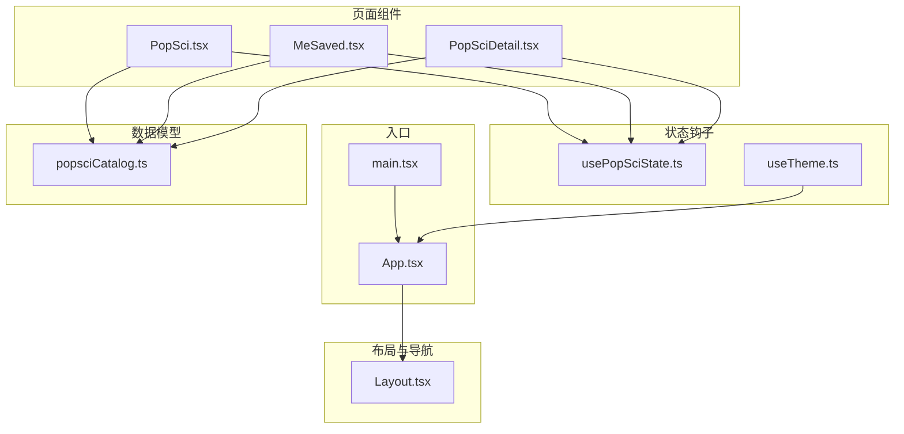
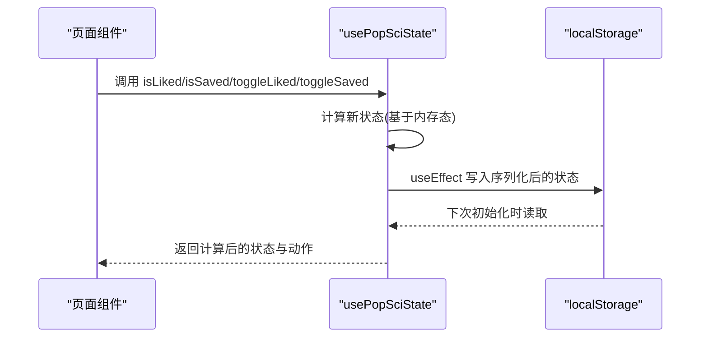
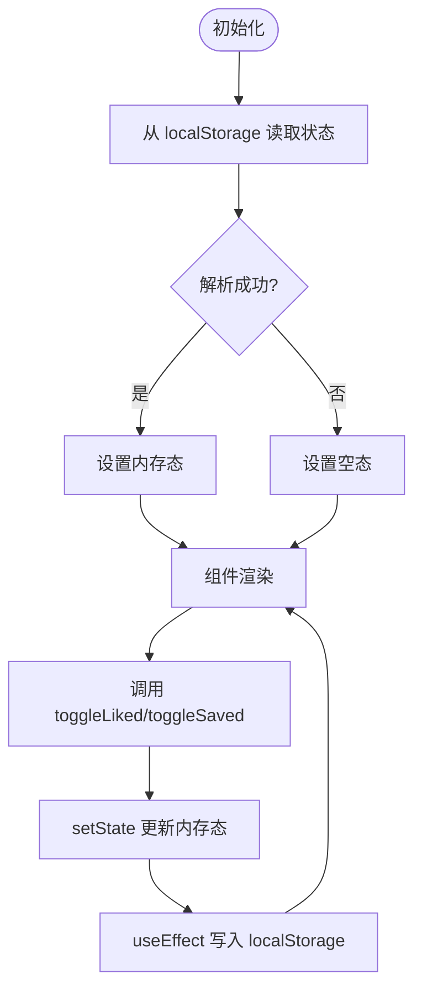
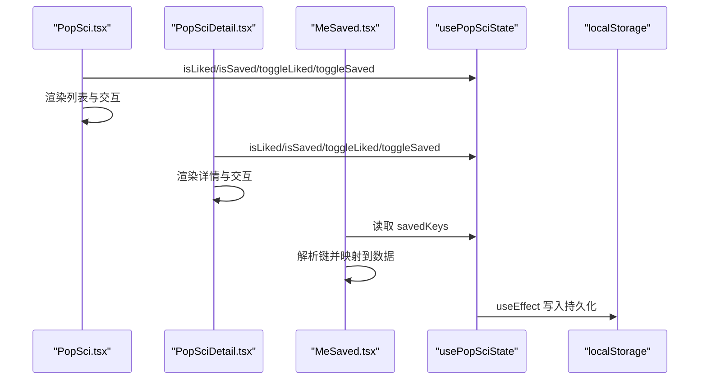
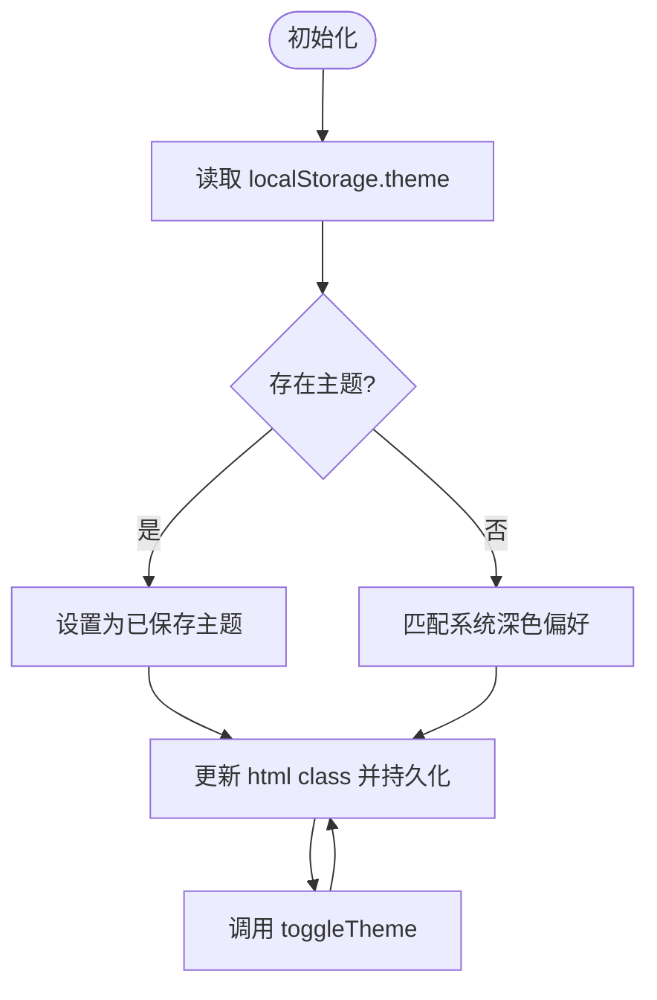
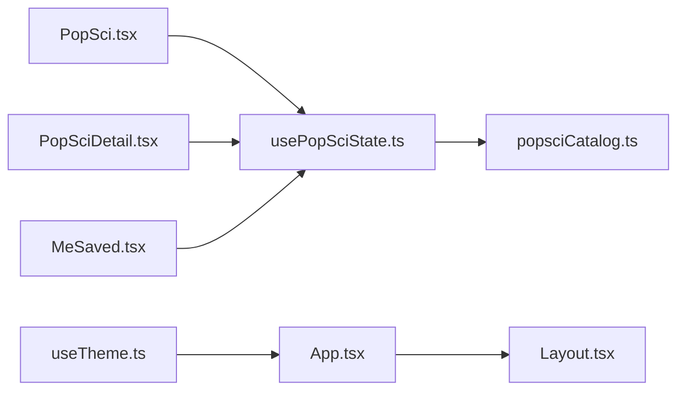

# 状态管理架构

<cite>
**本文引用的文件**
- [usePopSciState.ts](file://src/hooks/usePopSciState.ts)
- [useTheme.ts](file://src/hooks/useTheme.ts)
- [App.tsx](file://src/App.tsx)
- [main.tsx](file://src/main.tsx)
- [PopSci.tsx](file://src/pages/PopSci.tsx)
- [MeSaved.tsx](file://src/pages/MeSaved.tsx)
- [PopSciDetail.tsx](file://src/pages/PopSciDetail.tsx)
- [Layout.tsx](file://src/components/Layout.tsx)
- [popsciCatalog.ts](file://src/data/popsciCatalog.ts)
- [utils.ts](file://src/lib/utils.ts)
- [package.json](file://package.json)
- [2026-04-14-chat-persistence-design.md](file://docs/superpowers/specs/2026-04-14-chat-persistence-design.md)
</cite>

## 目录
1. [简介](#简介)
2. [项目结构](#项目结构)
3. [核心组件](#核心组件)
4. [架构总览](#架构总览)
5. [详细组件分析](#详细组件分析)
6. [依赖关系分析](#依赖关系分析)
7. [性能考量](#性能考量)
8. [故障排查指南](#故障排查指南)
9. [结论](#结论)
10. [附录](#附录)

## 简介
本文件系统化梳理该医疗健康科普应用的状态管理架构，重点围绕基于 React Hooks 的自定义 Hook 设计、状态提升策略与数据流管理展开。文档覆盖以下主题：
- 自定义 Hook 设计与职责边界：usePopSciState、useTheme
- 状态持久化机制：localStorage 序列化/反序列化、健壮性校验
- 组件间状态共享：通过 Hook 抽象在页面组件之间传递状态与动作
- 主题状态管理与用户偏好设置：深浅色主题与系统偏好联动
- 全局状态设计：以“内容收藏/点赞”为中心的轻量全局状态
- 状态更新优化：useCallback、useMemo 的使用与依赖收敛
- 副作用处理与异步状态：useEffect 的触发时机与副作用边界
- 状态调试工具、性能监控与内存泄漏防护
- 状态序列化、跨页面状态保持与离线数据同步策略

## 项目结构
应用采用按功能域组织的目录结构，核心状态逻辑集中在 hooks 目录，页面组件位于 pages 目录，数据模型位于 data 目录，UI 布局位于 components 目录。

图表来源
- [main.tsx:1-11](file://src/main.tsx#L1-L11)
- [App.tsx:19-52](file://src/App.tsx#L19-L52)
- [Layout.tsx:19-66](file://src/components/Layout.tsx#L19-L66)
- [usePopSciState.ts:30-79](file://src/hooks/usePopSciState.ts#L30-L79)
- [useTheme.ts:5-29](file://src/hooks/useTheme.ts#L5-L29)
- [PopSci.tsx:26-270](file://src/pages/PopSci.tsx#L26-L270)
- [MeSaved.tsx:16-132](file://src/pages/MeSaved.tsx#L16-L132)
- [PopSciDetail.tsx:15-150](file://src/pages/PopSciDetail.tsx#L15-L150)
- [popsciCatalog.ts:1-98](file://src/data/popsciCatalog.ts#L1-L98)

章节来源
- [main.tsx:1-11](file://src/main.tsx#L1-L11)
- [App.tsx:19-52](file://src/App.tsx#L19-L52)
- [Layout.tsx:19-66](file://src/components/Layout.tsx#L19-L66)

## 核心组件
本项目的核心状态抽象由两个自定义 Hook 构成：
- usePopSciState：负责“内容收藏/点赞”的全局状态与持久化
- useTheme：负责“主题模式”的全局状态与持久化

二者均采用 React Hooks 的 useState/ useEffect/ useCallback/ useMemo 组合，遵循“最小必要状态”原则，并通过 localStorage 实现跨页面持久化。

章节来源
- [usePopSciState.ts:30-79](file://src/hooks/usePopSciState.ts#L30-L79)
- [useTheme.ts:5-29](file://src/hooks/useTheme.ts#L5-L29)

## 架构总览
应用采用“自底向上”的状态管理模式：
- 页面组件通过 usePopSciState 获取状态与动作，渲染 UI 并响应用户交互
- usePopSciState 内部维护内存态并通过 useEffect 同步到 localStorage
- useTheme 同样维护内存态并通过 useEffect 同步到 localStorage
- 数据模型（popsciCatalog）提供静态数据与查询函数，供页面组件消费

图表来源
- [usePopSciState.ts:30-79](file://src/hooks/usePopSciState.ts#L30-L79)
- [PopSci.tsx:29](file://src/pages/PopSci.tsx#L29)
- [MeSaved.tsx:18](file://src/pages/MeSaved.tsx#L18)
- [PopSciDetail.tsx:18](file://src/pages/PopSciDetail.tsx#L18)

## 详细组件分析

### usePopSciState Hook 设计与实现
- 状态结构
  - liked：字符串数组，元素格式为 “类型:ID”
  - saved：字符串数组，元素格式为 “类型:ID”
- 初始化策略
  - 首次加载从 localStorage 读取，若解析失败则回退为空集合
- 持久化策略
  - 任何状态变更都会触发 useEffect，将当前状态序列化写入 localStorage
- 查询与操作
  - isLiked/isSaved：根据键是否存在判断
  - toggleLiked/toggleSaved：添加或移除对应键
- 性能优化
  - isLiked/isSaved/toggleLiked/toggleSaved 使用 useCallback，依赖稳定
  - 返回对象通过 useMemo 包裹，避免每次渲染都产生新引用
- 依赖链
  - 依赖 data.liked 与 data.saved 的变化，确保查询与操作闭包稳定

图表来源
- [usePopSciState.ts:30-79](file://src/hooks/usePopSciState.ts#L30-L79)

章节来源
- [usePopSciState.ts:13-28](file://src/hooks/usePopSciState.ts#L13-L28)
- [usePopSciState.ts:30-79](file://src/hooks/usePopSciState.ts#L30-L79)

### 页面组件中的状态使用
- PopSci 页面
  - 通过 usePopSciState 获取 isLiked/isSaved/toggleLiked/toggleSaved
  - 基于类型动态筛选列表，渲染卡片并绑定收藏/点赞按钮
- MeSaved 页面
  - 读取 savedKeys，解析键并映射到 popsciCatalog 获取完整项
  - 渲染收藏列表，支持取消收藏与跳转详情
- PopSciDetail 页面
  - 通过 usePopSciState 获取当前项的收藏/点赞状态
  - 提供收藏/点赞切换与返回导航

图表来源
- [PopSci.tsx:29](file://src/pages/PopSci.tsx#L29)
- [PopSciDetail.tsx:18](file://src/pages/PopSciDetail.tsx#L18)
- [MeSaved.tsx:18](file://src/pages/MeSaved.tsx#L18)
- [usePopSciState.ts:36-38](file://src/hooks/usePopSciState.ts#L36-L38)

章节来源
- [PopSci.tsx:29](file://src/pages/PopSci.tsx#L29)
- [MeSaved.tsx:18](file://src/pages/MeSaved.tsx#L18)
- [PopSciDetail.tsx:18](file://src/pages/PopSciDetail.tsx#L18)

### 主题状态管理与用户偏好设置
- 状态结构
  - theme：'light' | 'dark'
- 初始化策略
  - 优先读取 localStorage 中的 theme；若不存在则根据系统配色偏好自动选择
- 持久化策略
  - 切换主题时同步写入 localStorage，并更新根节点 HTML 的 class 以驱动样式
- 功能接口
  - toggleTheme：在 light/dark 之间切换
  - isDark：便捷判断当前是否为深色主题

图表来源
- [useTheme.ts:5-29](file://src/hooks/useTheme.ts#L5-L29)

章节来源
- [useTheme.ts:5-29](file://src/hooks/useTheme.ts#L5-L29)

### 数据模型与状态键规范
- 类型定义
  - PopSciType：'article' | 'video'
  - PopSciItem：统一接口，区分文章与视频
- 键规范
  - 采用 “类型:ID” 字符串作为唯一键，便于跨页面共享与序列化
- 数据访问
  - listPopSci：按类型过滤
  - getPopSciItem：按类型+ID 获取单项

章节来源
- [popsciCatalog.ts:1-98](file://src/data/popsciCatalog.ts#L1-L98)
- [usePopSciState.ts:4](file://src/hooks/usePopSciState.ts#L4)
- [usePopSciState.ts:26-28](file://src/hooks/usePopSciState.ts#L26-L28)

## 依赖关系分析
- 组件耦合
  - 页面组件仅依赖 usePopSciState 与 popsciCatalog，耦合度低
  - 布局组件 Layout 与状态无关，专注导航与容器职责
- 外部依赖
  - localStorage：持久化存储
  - react-router-dom：路由与导航
  - framer-motion、lucide-react：动画与图标
- 内聚性
  - usePopSciState 与 useTheme 分别聚焦“内容状态”和“主题偏好”，内聚性高

图表来源
- [PopSci.tsx:7](file://src/pages/PopSci.tsx#L7)
- [PopSciDetail.tsx:8](file://src/pages/PopSciDetail.tsx#L8)
- [MeSaved.tsx:5](file://src/pages/MeSaved.tsx#L5)
- [usePopSciState.ts:1](file://src/hooks/usePopSciState.ts#L1)
- [useTheme.ts:1](file://src/hooks/useTheme.ts#L1)
- [App.tsx:3](file://src/App.tsx#L3)
- [Layout.tsx:1](file://src/components/Layout.tsx#L1)

章节来源
- [package.json:13-25](file://package.json#L13-L25)

## 性能考量
- 状态更新优化
  - 使用 useCallback 包裹查询与操作函数，减少子组件重渲染
  - 使用 useMemo 包裹返回对象，避免每次渲染产生新引用
- 渲染优化
  - 列表渲染中仅对必要字段进行计算（如点赞数）
  - 使用 memo 与 AnimatePresence 优化动画场景
- 副作用边界
  - localStorage 写入仅在状态变更时触发，避免频繁 IO
- 异步状态管理
  - 当前状态均为同步更新；若引入网络请求，建议在 Hook 内部封装异步流程并在 UI 层提供 loading/错误状态

章节来源
- [usePopSciState.ts:40-78](file://src/hooks/usePopSciState.ts#L40-L78)
- [PopSci.tsx:32](file://src/pages/PopSci.tsx#L32)

## 故障排查指南
- localStorage 异常
  - 现象：初始化失败或状态丢失
  - 排查：确认浏览器允许 localStorage；检查键名与序列化格式
  - 参考：usePopSciState 的安全解析逻辑与默认回退
- 键格式不一致
  - 现象：isLiked/isSaved 始终为 false
  - 排查：确认键格式为 “类型:ID”，与 makeKey 生成规则一致
- 页面切换后状态丢失
  - 现象：切换路由后收藏/点赞状态消失
  - 排查：确认 useEffect 是否正确执行；检查路由是否导致组件重新挂载
- 图片或大对象持久化风险
  - 参考：聊天历史持久化设计文档，避免将大体积数据直接存入 localStorage
- 内存泄漏防护
  - 确保副作用清理（如定时器）在组件卸载时释放
  - 避免在回调中持有过期引用

章节来源
- [usePopSciState.ts:13-24](file://src/hooks/usePopSciState.ts#L13-L24)
- [usePopSciState.ts:26-28](file://src/hooks/usePopSciState.ts#L26-L28)
- [2026-04-14-chat-persistence-design.md:1-22](file://docs/superpowers/specs/2026-04-14-chat-persistence-design.md#L1-L22)

## 结论
本项目采用轻量级、声明式的 React Hooks 状态管理模式：
- 通过 usePopSciState 与 useTheme 实现“内容状态”和“主题偏好”的全局共享
- 以 localStorage 为持久化介质，保证跨页面与刷新的一致性
- 通过 useCallback/useMemo 优化渲染与重渲染成本
- 未来可在现有 Hook 基础上扩展异步状态与服务端同步，同时遵循“小而美”的状态设计原则

## 附录
- 状态调试建议
  - 在开发环境开启 React DevTools，观察组件渲染次数与 Hook 返回值变化
  - 为 localStorage 增加版本号前缀，便于迁移与清理
- 性能监控
  - 使用浏览器性能面板观察重排/重绘热点
  - 对长列表渲染启用虚拟化（如需）
- 内存泄漏防护
  - 对定时器、事件监听器在 useEffect 返回中清理
  - 避免在回调中持有对已卸载组件的引用