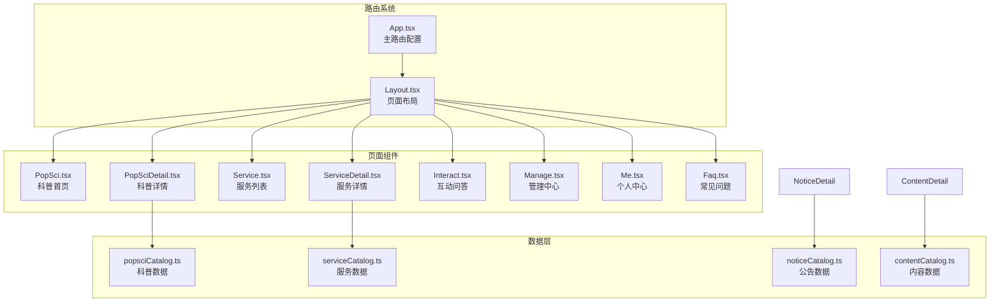
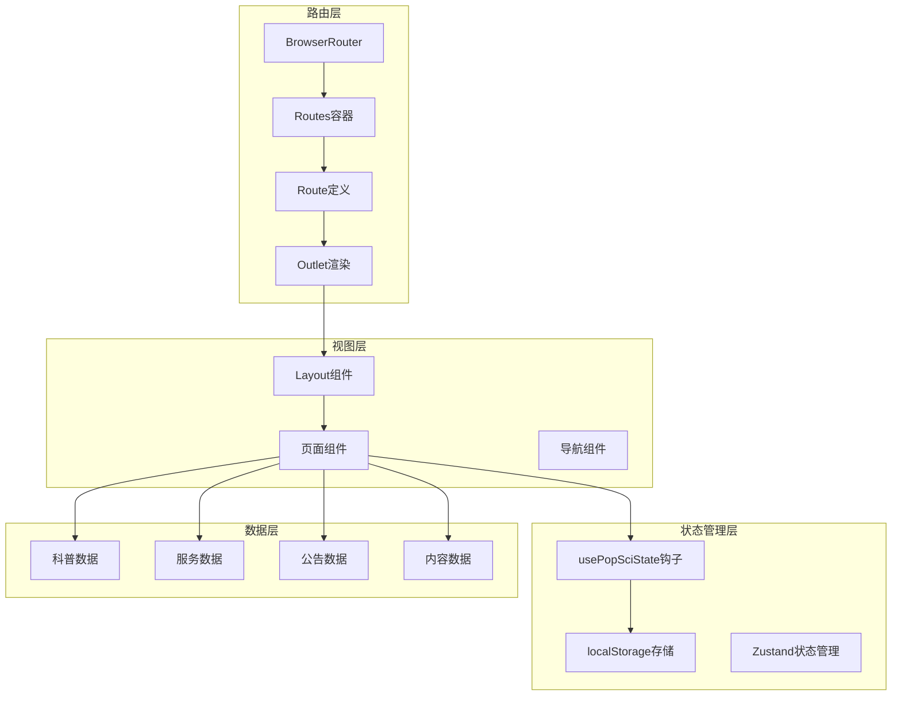
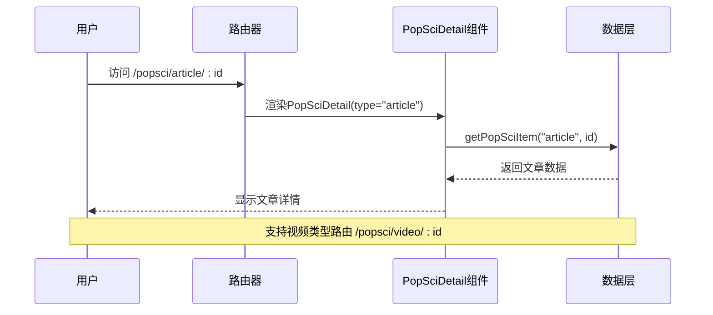
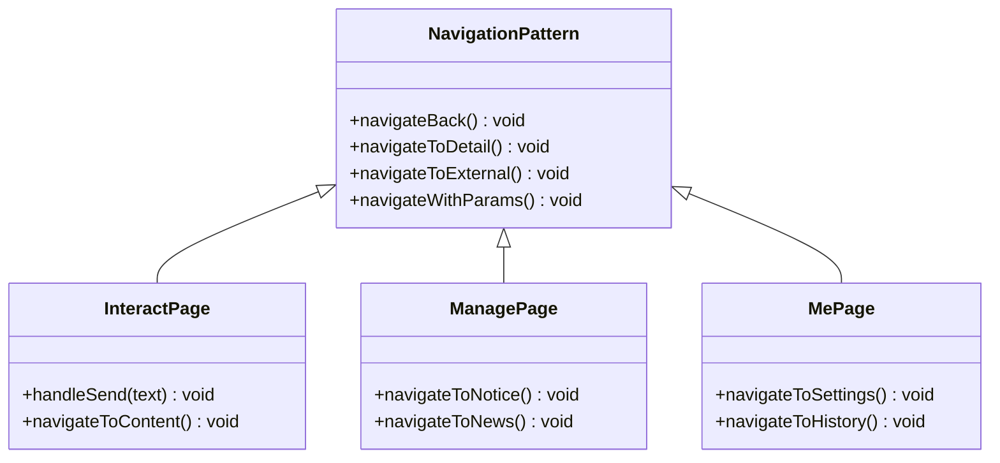
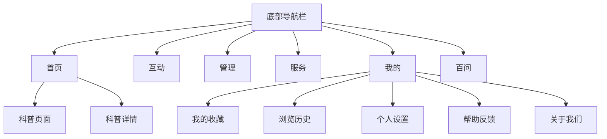
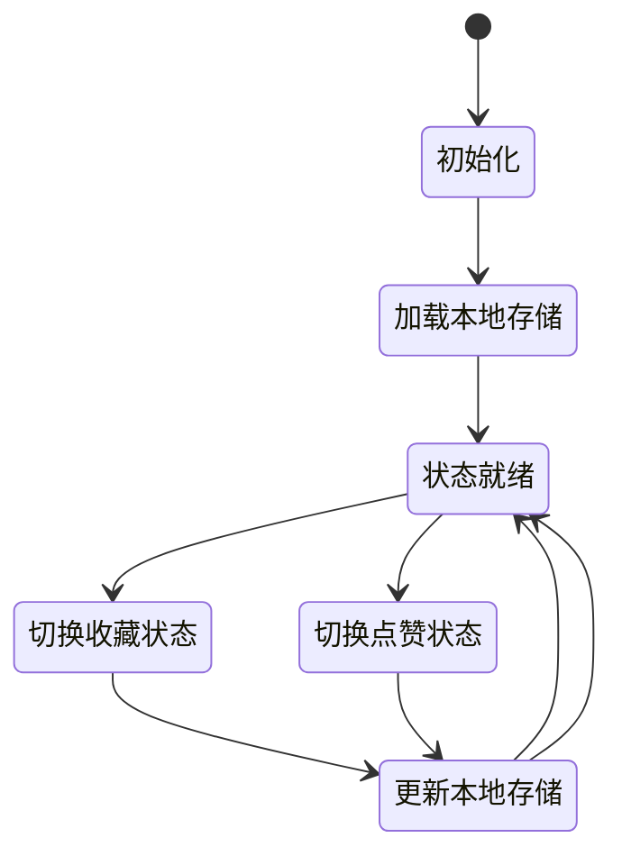
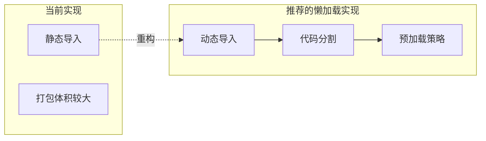
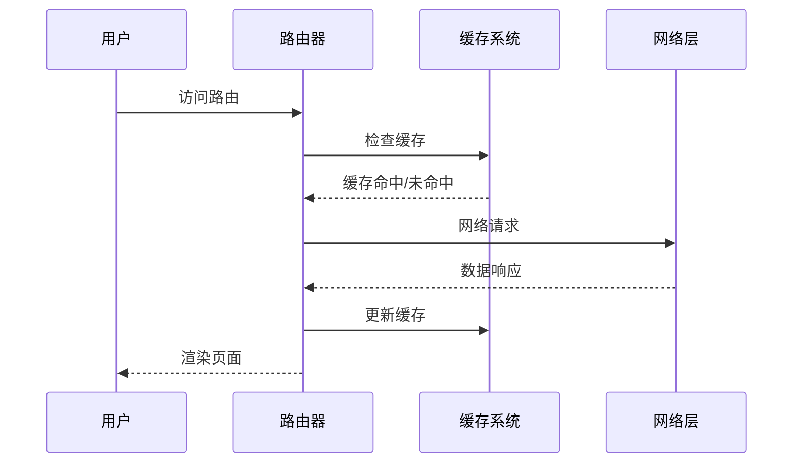

# 路由系统设计

<cite>
**本文档引用的文件**
- [App.tsx](file://src/App.tsx)
- [Layout.tsx](file://src/components/Layout.tsx)
- [PopSciDetail.tsx](file://src/pages/PopSciDetail.tsx)
- [ServiceDetail.tsx](file://src/pages/ServiceDetail.tsx)
- [NoticeDetail.tsx](file://src/pages/NoticeDetail.tsx)
- [ContentDetail.tsx](file://src/pages/ContentDetail.tsx)
- [Interact.tsx](file://src/pages/Interact.tsx)
- [Manage.tsx](file://src/pages/Manage.tsx)
- [Me.tsx](file://src/pages/Me.tsx)
- [usePopSciState.ts](file://src/hooks/usePopSciState.ts)
- [popsciCatalog.ts](file://src/data/popsciCatalog.ts)
- [serviceCatalog.ts](file://src/data/serviceCatalog.ts)
- [noticeCatalog.ts](file://src/data/noticeCatalog.ts)
- [contentCatalog.ts](file://src/data/contentCatalog.ts)
- [main.tsx](file://src/main.tsx)
- [package.json](file://package.json)
</cite>

## 目录
1. [简介](#简介)
2. [项目结构](#项目结构)
3. [核心组件](#核心组件)
4. [架构概览](#架构概览)
5. [详细组件分析](#详细组件分析)
6. [依赖分析](#依赖分析)
7. [性能考虑](#性能考虑)
8. [故障排除指南](#故障排除指南)
9. [结论](#结论)

## 简介

本设计文档针对医疗健康科普应用的路由系统进行全面分析，基于React Router 7.3.0实现的嵌套路由配置。该应用采用移动端优先的设计理念，通过BrowserRouter作为根路由容器，结合Layout组件实现统一的页面布局和底部导航栏。

路由系统主要包含三个层次：主路由Layout、页面级路由和参数化路由。系统支持动态路由参数传递、查询字符串处理以及路由状态管理。通过usePopSciState钩子实现收藏和点赞状态的持久化存储，确保用户体验的一致性。

## 项目结构

应用采用按功能模块组织的文件结构，路由相关的组件分布如下：



**图表来源**
- [App.tsx:19-51](file://src/App.tsx#L19-L51)
- [Layout.tsx:19-65](file://src/components/Layout.tsx#L19-L65)

**章节来源**
- [App.tsx:1-52](file://src/App.tsx#L1-L52)
- [Layout.tsx:1-66](file://src/components/Layout.tsx#L1-L66)

## 核心组件

### 主路由配置

应用的路由配置位于App.tsx文件中，采用嵌套路由模式实现：

```mermaid
flowchart TD
Router[BrowserRouter] --> RoutesContainer[Routes容器]
RoutesContainer --> LayoutRoute[Layout路由]
LayoutRoute --> IndexRoute[首页路由<br/>path="/"]
LayoutRoute --> PopSciArticle[科普文章详情<br/>path="popsci/article/:id"]
LayoutRoute --> PopSciVideo[科普视频详情<br/>path="popsci/video/:id"]
LayoutRoute --> InteractRoute[互动问答<br/>path="interact"]
LayoutRoute --> ManageRoute[管理中心<br/>path="manage"]
LayoutRoute --> ServiceRoute[服务列表<br/>path="service"]
LayoutRoute --> ServiceDetailRoute[服务详情<br/>path="service/:slug"]
LayoutRoute --> MeRoute[个人中心<br/>path="me"]
LayoutRoute --> FAQRoute[常见问题<br/>path="faq"]
LayoutRoute --> MeSaved[我的收藏<br/>path="me/saved"]
LayoutRoute --> MeHistory[浏览历史<br/>path="me/history"]
LayoutRoute --> MeSettings[个人设置<br/>path="me/settings"]
LayoutRoute --> MeHelp[帮助反馈<br/>path="me/help"]
LayoutRoute --> MeAbout[关于我们<br/>path="me/about"]
LayoutRoute --> NoticeDetail[公告详情<br/>path="notice/:id"]
LayoutRoute --> ContentDetail[内容详情<br/>path="content/:id"]
LayoutRoute --> AdDietitian[营养师广告<br/>path="ad/dietitian"]
```

**图表来源**
- [App.tsx:28-47](file://src/App.tsx#L28-L47)

### 布局组件

Layout组件作为所有页面的父容器，提供统一的页面结构和导航体验：

- **响应式设计**：最大宽度480px，适配移动端屏幕
- **底部导航栏**：包含5个主要功能入口
- **Outlet渲染**：动态渲染子路由组件
- **导航状态管理**：根据当前路径高亮对应导航项

**章节来源**
- [Layout.tsx:19-65](file://src/components/Layout.tsx#L19-L65)

## 架构概览

应用采用分层架构设计，路由系统贯穿整个应用：



**图表来源**
- [App.tsx:25-50](file://src/App.tsx#L25-L50)
- [Layout.tsx:22-27](file://src/components/Layout.tsx#L22-L27)

## 详细组件分析

### 参数化路由实现

应用实现了多种参数化路由模式，满足不同业务场景的需求：

#### 动态ID路由
用于内容详情页面，支持文章和视频两种类型：



**图表来源**
- [App.tsx:31-32](file://src/App.tsx#L31-L32)
- [PopSciDetail.tsx:15-19](file://src/pages/PopSciDetail.tsx#L15-L19)

#### Slug路由
用于服务详情页面，使用语义化URL：


**图表来源**
- [App.tsx:36](file://src/App.tsx#L36)
- [ServiceDetail.tsx:6-9](file://src/pages/ServiceDetail.tsx#L6-L9)

**章节来源**
- [PopSciDetail.tsx:15-19](file://src/pages/PopSciDetail.tsx#L15-L19)
- [ServiceDetail.tsx:6-9](file://src/pages/ServiceDetail.tsx#L6-L9)

### 导航模式分析

应用实现了多种导航模式，包括页面跳转、面包屑导航和路由权限控制：

#### 页面跳转模式
通过useNavigate钩子实现程序化导航：



**图表来源**
- [Interact.tsx:359-360](file://src/pages/Interact.tsx#L359-L360)
- [Manage.tsx:106-107](file://src/pages/Manage.tsx#L106-L107)
- [Me.tsx:47-58](file://src/pages/Me.tsx#L47-L58)

#### 嵌套路导航
Layout组件实现底部导航栏，支持多级路由：



**图表来源**
- [Layout.tsx:10-17](file://src/components/Layout.tsx#L10-L17)
- [Layout.tsx:31-61](file://src/components/Layout.tsx#L31-L61)

**章节来源**
- [Interact.tsx:359-360](file://src/pages/Interact.tsx#L359-L360)
- [Manage.tsx:106-107](file://src/pages/Manage.tsx#L106-L107)
- [Me.tsx:47-58](file://src/pages/Me.tsx#L47-L58)

### 路由状态管理

应用通过自定义Hook实现路由相关的状态管理：



**图表来源**
- [usePopSciState.ts:31-38](file://src/hooks/usePopSciState.ts#L31-L38)
- [usePopSciState.ts:50-64](file://src/hooks/usePopSciState.ts#L50-L64)

**章节来源**
- [usePopSciState.ts:30-79](file://src/hooks/usePopSciState.ts#L30-L79)

## 依赖分析

应用的路由系统依赖关系如下：

```mermaid
graph TB
subgraph "核心依赖"
React[react@^18.3.1]
RouterDom[react-router-dom@^7.3.0]
Lucide[Lucide React图标库]
Tailwind[Tailwind CSS]
end
subgraph "应用组件"
App[App.tsx]
Layout[Layout.tsx]
Pages[页面组件]
Hooks[自定义Hook]
Data[数据层]
end
subgraph "开发工具"
Vite[Vite构建工具]
TypeScript[TypeScript]
ESLint[ESLint]
end
React --> RouterDom
RouterDom --> App
App --> Layout
Layout --> Pages
Pages --> Hooks
Hooks --> Data
Vite --> React
TypeScript --> React
ESLint --> Vite
```

**图表来源**
- [package.json:13-26](file://package.json#L13-L26)
- [package.json:27-46](file://package.json#L27-L46)

**章节来源**
- [package.json:13-48](file://package.json#L13-L48)

## 性能考虑

### 路由懒加载策略

虽然当前实现采用静态导入，但系统架构已为懒加载做好准备：



### 预加载优化



### SEO友好设计

应用已具备基础的SEO优化特性：

- **语义化路由结构**：清晰的URL层次结构
- **内容组织**：按主题分类的内容组织方式
- **元数据支持**：为未来SEO增强预留空间

## 故障排除指南

### 常见路由问题

#### 参数解析问题
当路由参数无法正确解析时，检查以下方面：

1. **路由定义一致性**：确保App.tsx中的路由定义与组件参数匹配
2. **参数类型验证**：在组件中添加参数有效性检查
3. **默认值处理**：为缺失参数提供合理的默认值

#### 导航状态异常
底部导航栏状态不正确的问题排查：

1. **路径匹配逻辑**：检查Layout组件中的isActive判断逻辑
2. **嵌套路径处理**：确认startsWith方法对子路径的正确处理
3. **状态更新时机**：验证useLocation钩子的状态更新机制

**章节来源**
- [Layout.tsx:32](file://src/components/Layout.tsx#L32)
- [PopSciDetail.tsx:17](file://src/pages/PopSciDetail.tsx#L17)

### 性能问题诊断

#### 内存泄漏排查
使用React DevTools检查以下组件：

1. **useEffect清理**：确保所有useEffect都有适当的清理函数
2. **事件监听器**：检查是否有未移除的DOM事件监听器
3. **定时器清理**：验证setInterval/setTimeout的清理

#### 渲染性能优化
- **组件拆分**：将大型组件拆分为更小的可复用组件
- **memo优化**：使用useMemo/useCallback优化昂贵计算
- **条件渲染**：实现必要的条件渲染逻辑

## 结论

该医疗健康科普应用的路由系统设计体现了现代前端应用的最佳实践：

**架构优势**：
- 采用嵌套路由模式，提供了清晰的页面层次结构
- 实现了响应式设计，适配移动设备使用场景
- 通过自定义Hook实现了状态管理的模块化

**技术特点**：
- 支持多种路由参数类型（ID、slug）
- 集成了导航状态管理和用户交互
- 具备良好的扩展性和维护性

**改进建议**：
1. 实施路由懒加载以优化首屏加载性能
2. 添加路由守卫机制实现权限控制
3. 增强错误边界处理提升应用稳定性
4. 实现预加载策略改善用户体验

该路由系统为医疗健康科普应用提供了坚实的技术基础，能够支持未来的功能扩展和性能优化需求。