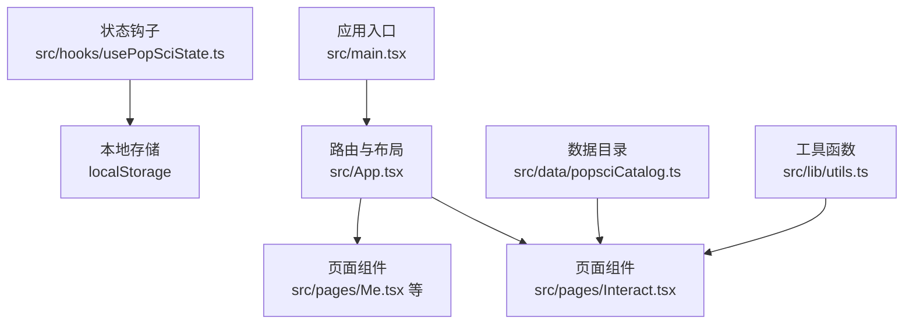
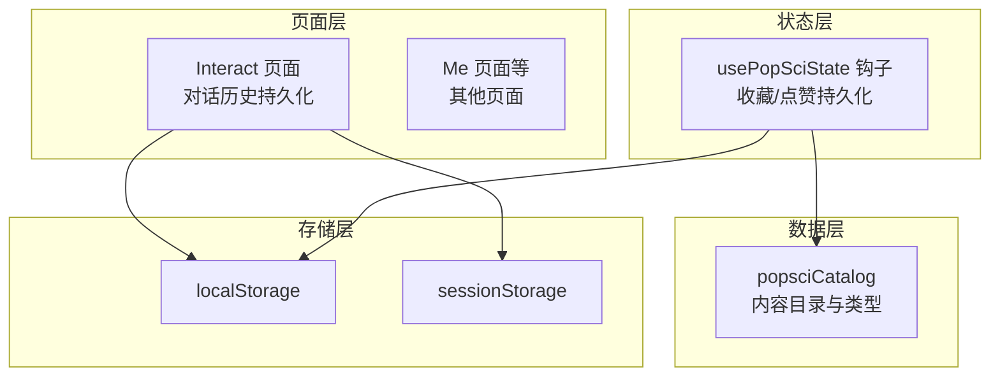
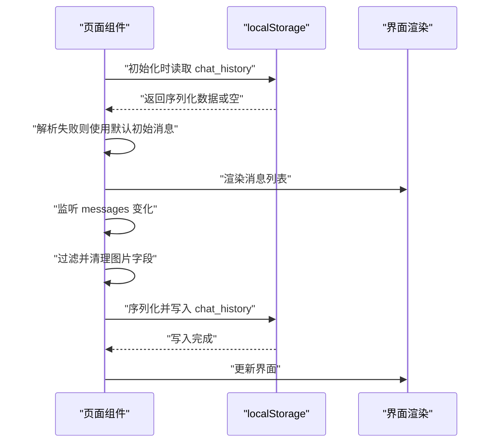
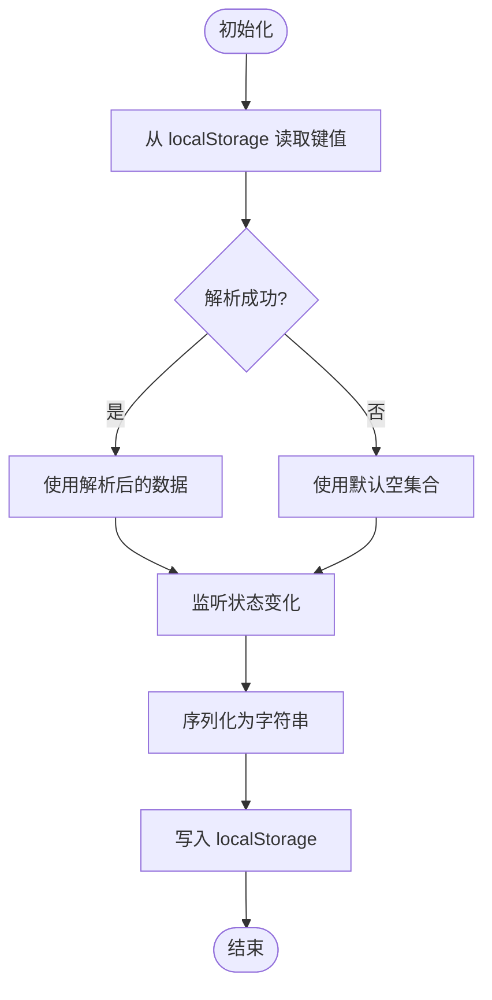
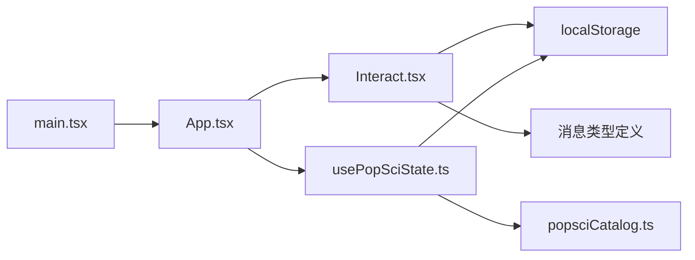

# 数据持久化策略

<cite>
**本文引用的文件**
- [README.md](file://README.md)
- [src/App.tsx](file://src/App.tsx)
- [src/main.tsx](file://src/main.tsx)
- [src/pages/Interact.tsx](file://src/pages/Interact.tsx)
- [src/hooks/usePopSciState.ts](file://src/hooks/usePopSciState.ts)
- [src/data/popsciCatalog.ts](file://src/data/popsciCatalog.ts)
- [src/lib/utils.ts](file://src/lib/utils.ts)
- [docs/superpowers/specs/2026-04-14-chat-persistence-design.md](file://docs/superpowers/specs/2026-04-14-chat-persistence-design.md)
</cite>

## 目录
1. [引言](#引言)
2. [项目结构](#项目结构)
3. [核心组件](#核心组件)
4. [架构总览](#架构总览)
5. [详细组件分析](#详细组件分析)
6. [依赖关系分析](#依赖关系分析)
7. [性能考量](#性能考量)
8. [故障排查指南](#故障排查指南)
9. [结论](#结论)
10. [附录](#附录)

## 引言
本技术文档系统梳理应用中的数据持久化策略，覆盖本地存储（localStorage/sessionStorage）、序列化/反序列化与版本管理、增量更新与批量操作、事务处理、备份恢复与迁移升级、错误处理、性能优化与存储空间管理、并发控制与一致性保障、以及数据安全与隐私保护。文档基于仓库现有实现进行归纳总结，并对可扩展的改进点提出建议。

## 项目结构
应用采用前端单页应用（SPA）架构，路由由浏览器历史模式驱动，页面组件负责业务交互与状态管理，部分状态通过本地存储实现跨页面与刷新持久化。核心文件分布如下：
- 应用入口与路由：src/main.tsx、src/App.tsx
- 业务页面与交互：src/pages/Interact.tsx（对话历史持久化）
- 业务状态钩子：src/hooks/usePopSciState.ts（收藏/点赞状态持久化）
- 数据目录与类型：src/data/popsciCatalog.ts（内容目录与类型定义）
- 工具函数：src/lib/utils.ts（样式合并工具）

图表来源
- [src/main.tsx:1-11](file://src/main.tsx#L1-L11)
- [src/App.tsx:1-52](file://src/App.tsx#L1-L52)
- [src/pages/Interact.tsx:1-462](file://src/pages/Interact.tsx#L1-L462)
- [src/hooks/usePopSciState.ts:1-80](file://src/hooks/usePopSciState.ts#L1-L80)
- [src/data/popsciCatalog.ts:1-98](file://src/data/popsciCatalog.ts#L1-L98)
- [src/lib/utils.ts:1-7](file://src/lib/utils.ts#L1-L7)

章节来源
- [src/main.tsx:1-11](file://src/main.tsx#L1-L11)
- [src/App.tsx:1-52](file://src/App.tsx#L1-L52)

## 核心组件
- 对话历史持久化（Interact 页面）
  - 初始化：从 localStorage 恢复 chat_history，失败则使用默认初始消息。
  - 写入：在非输入/请求状态时，将消息数组序列化后写入 localStorage。
  - 图片处理：对包含图片的消息进行字段清理，避免存储空间溢出；UI 层对“过期图片”做占位提示。
  - 参考设计文档：采用 localStorage 的决策与策略。
- 收藏/点赞状态持久化（usePopSciState 钩子）
  - 使用统一键名 popsci_state_v1 存储 liked/saved 列表。
  - 安全解析：解析失败时回退为空集合，确保健壮性。
  - 增量更新：通过回调函数对 liked/saved 列表进行添加/移除，触发写入。
  - 类型安全：键值采用 type:id 形式，避免类型混淆。
- 数据目录与类型（popsciCatalog）
  - 定义 PopSciType、PopSciItem 及文章/视频两类实体，为收藏/点赞提供数据基础。

章节来源
- [src/pages/Interact.tsx:37-84](file://src/pages/Interact.tsx#L37-L84)
- [docs/superpowers/specs/2026-04-14-chat-persistence-design.md:1-22](file://docs/superpowers/specs/2026-04-14-chat-persistence-design.md#L1-L22)
- [src/hooks/usePopSciState.ts:1-80](file://src/hooks/usePopSciState.ts#L1-L80)
- [src/data/popsciCatalog.ts:1-98](file://src/data/popsciCatalog.ts#L1-L98)

## 架构总览
下图展示了数据持久化在应用中的整体流向：页面组件读取/写入本地存储，状态钩子封装持久化逻辑，数据目录提供类型与数据源支撑。

图表来源
- [src/pages/Interact.tsx:37-84](file://src/pages/Interact.tsx#L37-L84)
- [src/hooks/usePopSciState.ts:1-80](file://src/hooks/usePopSciState.ts#L1-L80)
- [src/data/popsciCatalog.ts:1-98](file://src/data/popsciCatalog.ts#L1-L98)

## 详细组件分析

### 组件一：对话历史持久化（Interact 页面）
- 读取流程
  - 组件初始化时，从 localStorage 读取 chat_history。
  - 若解析成功则作为初始状态；否则使用默认初始消息。
- 写入流程
  - 监听 messages 变化，在非输入/请求状态时执行序列化写入。
  - 对包含图片的消息进行字段清理（移除图片 URL），避免存储膨胀；UI 层对“过期图片”做占位提示。
- 错误处理
  - 解析失败时记录错误并回退到默认初始消息。
- 并发与一致性
  - 当前实现为单页面组件内的本地状态，不存在跨标签页并发写入；若需跨标签页同步，可引入 storage 事件监听与去重策略。
- 版本管理
  - 未见版本号字段；可通过键名后缀或新增字段实现版本演进。

图表来源
- [src/pages/Interact.tsx:37-84](file://src/pages/Interact.tsx#L37-L84)

章节来源
- [src/pages/Interact.tsx:37-84](file://src/pages/Interact.tsx#L37-L84)
- [docs/superpowers/specs/2026-04-14-chat-persistence-design.md:1-22](file://docs/superpowers/specs/2026-04-14-chat-persistence-design.md#L1-L22)

### 组件二：收藏/点赞状态持久化（usePopSciState 钩子）
- 数据结构
  - 存储 liked/saved 两个数组，元素为 type:id 字符串键。
- 初始化与写入
  - 初始化时从 localStorage 读取并安全解析；失败则回退为空集合。
  - 任意状态变更都会触发 localStorage 写入。
- 增量更新
  - 提供 toggleLiked/toggleSaved 回调，内部对数组进行添加/移除，形成增量更新。
- 类型安全
  - 通过 makeKey(type,id) 生成键，避免类型与 ID 混淆。

图表来源
- [src/hooks/usePopSciState.ts:30-38](file://src/hooks/usePopSciState.ts#L30-L38)

章节来源
- [src/hooks/usePopSciState.ts:1-80](file://src/hooks/usePopSciState.ts#L1-L80)

### 组件三：数据目录与类型（popsciCatalog）
- 类型定义
  - PopSciType：文章/视频两类。
  - PopSciItem：统一接口，派生文章/视频两类实体。
- 数据访问
  - 提供 getPopSciItem 与 listPopSci 辅助方法，为收藏/点赞提供数据基础。
- 与持久化的关系
  - 收藏/点赞键基于 type:id，与目录项一一对应，便于后续迁移与校验。

章节来源
- [src/data/popsciCatalog.ts:1-98](file://src/data/popsciCatalog.ts#L1-L98)

### 组件四：应用入口与路由（App/main）
- 应用入口
  - 渲染根节点并挂载 App。
- 路由与页面
  - 定义多页面路由，Interact 页面承载对话历史持久化场景。
- 与持久化的关系
  - 通过路由切换实现页面间状态隔离，localStorage 跨页面共享，保证刷新后状态恢复。

章节来源
- [src/main.tsx:1-11](file://src/main.tsx#L1-L11)
- [src/App.tsx:1-52](file://src/App.tsx#L1-L52)

## 依赖关系分析
- 组件耦合
  - Interact 页面直接依赖 localStorage 与消息类型定义。
  - usePopSciState 钩子依赖 localStorage 与 popsciCatalog 类型。
- 外部依赖
  - 无第三方持久化库，完全基于浏览器原生 API。
- 潜在循环依赖
  - 当前模块间无循环导入，结构清晰。

图表来源
- [src/pages/Interact.tsx:1-462](file://src/pages/Interact.tsx#L1-L462)
- [src/hooks/usePopSciState.ts:1-80](file://src/hooks/usePopSciState.ts#L1-L80)
- [src/data/popsciCatalog.ts:1-98](file://src/data/popsciCatalog.ts#L1-L98)
- [src/main.tsx:1-11](file://src/main.tsx#L1-L11)
- [src/App.tsx:1-52](file://src/App.tsx#L1-L52)

章节来源
- [src/pages/Interact.tsx:1-462](file://src/pages/Interact.tsx#L1-L462)
- [src/hooks/usePopSciState.ts:1-80](file://src/hooks/usePopSciState.ts#L1-L80)
- [src/data/popsciCatalog.ts:1-98](file://src/data/popsciCatalog.ts#L1-L98)
- [src/main.tsx:1-11](file://src/main.tsx#L1-L11)
- [src/App.tsx:1-52](file://src/App.tsx#L1-L52)

## 性能考量
- 序列化与反序列化
  - 使用 JSON.stringify/parse，简单高效；注意避免存储超大对象导致内存与性能抖动。
- 存储空间管理
  - 对图片消息进行字段清理，避免存储 Blob URL；建议定期清理过期或冗余数据。
- 写入频率控制
  - Interact 页面在非输入/请求状态才写入，降低频繁 IO；可进一步引入防抖/节流。
- 读取与渲染
  - 初始读取失败回退默认值，避免阻塞渲染；UI 层对“过期图片”做占位，提升体验。
- 并发与一致性
  - 单页面组件内无跨标签页并发；若引入 storage 事件，需去重与幂等处理。

## 故障排查指南
- 读取失败
  - 现象：localStorage 中数据损坏导致解析异常。
  - 处理：安全解析函数返回空集合，组件回退到默认初始消息。
- 写入失败
  - 现象：localStorage 满或受配额限制。
  - 处理：清理冗余数据、拆分存储、或迁移到 IndexedDB。
- 图片过期
  - 现象：刷新后图片不可用。
  - 处理：保存时清理图片 URL，UI 层显示占位提示。
- API 依赖
  - 现象：未配置 API Key 时无法进行 AI 解读。
  - 处理：检测环境变量并在 UI 中提示配置方式。

章节来源
- [src/pages/Interact.tsx:37-84](file://src/pages/Interact.tsx#L37-L84)
- [src/hooks/usePopSciState.ts:13-24](file://src/hooks/usePopSciState.ts#L13-L24)

## 结论
当前实现以 localStorage 为核心，结合安全解析与字段清理策略，实现了对话历史与收藏/点赞状态的跨页面持久化。通过设计文档与钩子封装，系统具备良好的可维护性与扩展性。建议后续在版本管理、事务与批量操作、并发控制与一致性、以及安全与隐私方面进一步完善，以应对更复杂的业务场景。

## 附录

### 数据持久化策略清单
- 存储介质
  - localStorage：跨页面与刷新持久化，容量约 5MB。
  - sessionStorage：会话级临时存储，关闭标签页即丢失。
- 序列化与反序列化
  - JSON.stringify/parse；解析失败安全回退。
- 版本管理
  - 建议在键名或数据结构中引入版本号，支持平滑迁移。
- 增量更新与批量操作
  - 增量：usePopSciState 的添加/移除操作。
  - 批量：可引入队列与批处理策略，减少频繁写入。
- 事务处理
  - 建议在关键写入前加锁或使用唯一标识，保证原子性。
- 备份与恢复
  - 导出：将 localStorage 数据导出为 JSON 文件。
  - 恢复：提供导入接口，按版本与键名进行校验与修复。
- 迁移升级
  - 新增/删除字段时，提供迁移脚本与兼容读取逻辑。
- 错误处理
  - 解析失败、存储满、API 异常等场景均有相应兜底。
- 性能优化
  - 防抖/节流写入、字段清理、定期清理、拆分存储。
- 并发控制与一致性
  - storage 事件去重、幂等处理、写入前校验。
- 安全与隐私
  - 避免存储敏感信息；对图片 URL 进行清理；必要时引入加密存储方案。