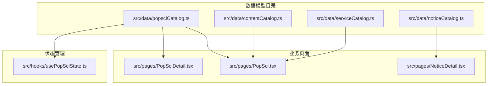
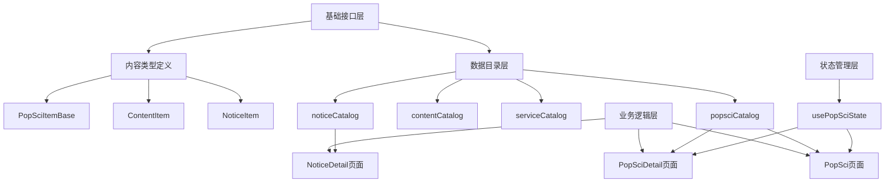
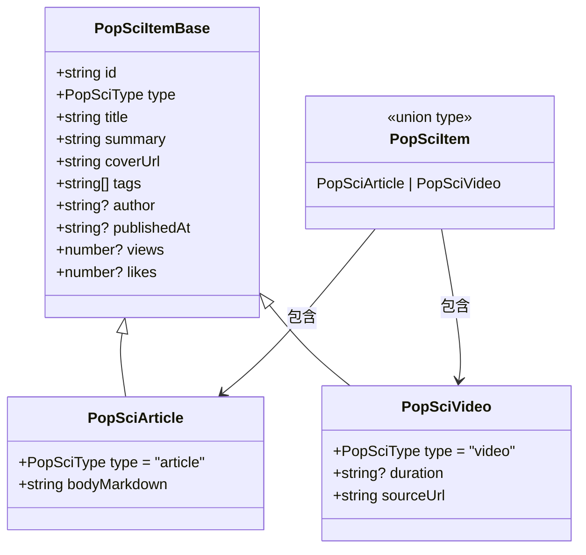
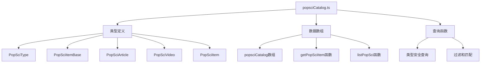
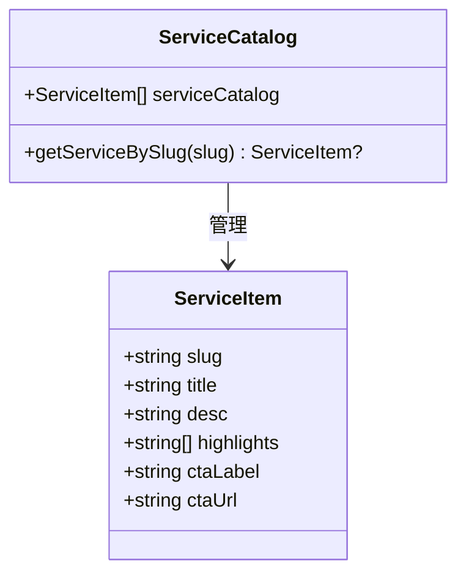
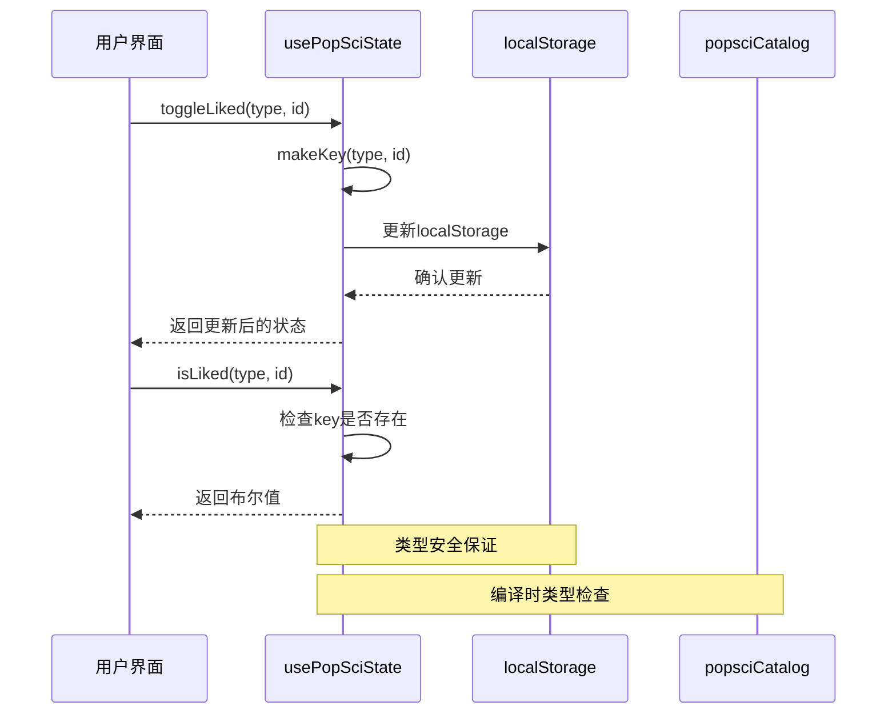
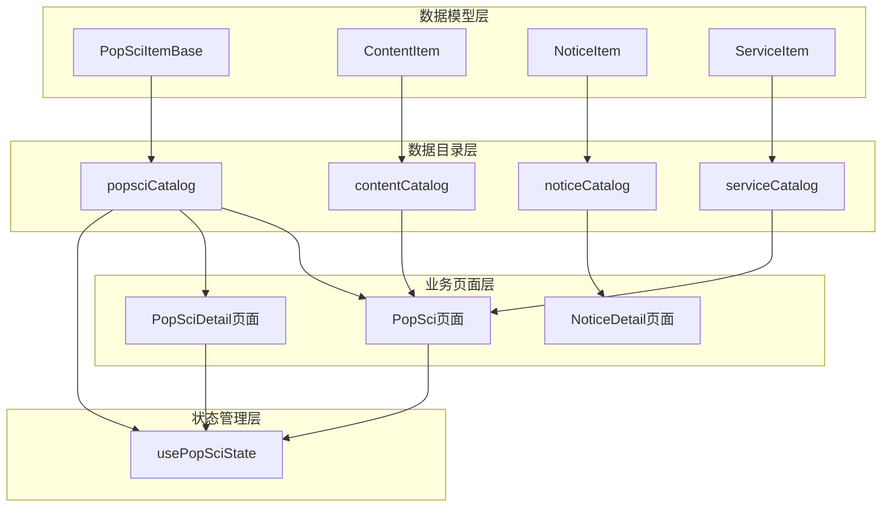
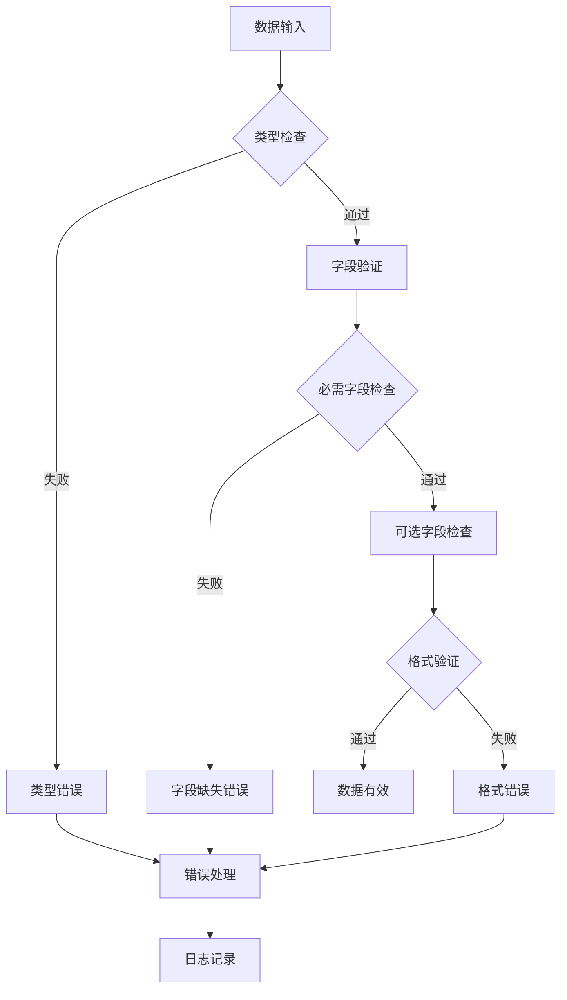

# 数据模型设计

<cite>
**本文档引用的文件**
- [popsciCatalog.ts](file://src/data/popsciCatalog.ts)
- [contentCatalog.ts](file://src/data/contentCatalog.ts)
- [serviceCatalog.ts](file://src/data/serviceCatalog.ts)
- [noticeCatalog.ts](file://src/data/noticeCatalog.ts)
- [usePopSciState.ts](file://src/hooks/usePopSciState.ts)
- [PopSci.tsx](file://src/pages/PopSci.tsx)
- [PopSciDetail.tsx](file://src/pages/PopSciDetail.tsx)
- [NoticeDetail.tsx](file://src/pages/NoticeDetail.tsx)
- [2026-04-15-popsci-detail-like-save-design.md](file://docs/superpowers/specs/2026-04-15-popsci-detail-like-save-design.md)
</cite>

## 目录
1. [引言](#引言)
2. [项目结构](#项目结构)
3. [核心数据模型](#核心数据模型)
4. [架构概览](#架构概览)
5. [详细组件分析](#详细组件分析)
6. [依赖关系分析](#依赖关系分析)
7. [性能考量](#性能考量)
8. [故障排除指南](#故障排除指南)
9. [结论](#结论)

## 引言

本文件深入解析项目中的数据模型设计，重点关注PopSciItemBase基础接口、PopSciArticle和PopSciVideo的具体实现差异，以及PopSciType联合类型的使用策略。同时详细说明contentCatalog、serviceCatalog、noticeCatalog等目录的数据结构设计原则，包括数据字段的类型约束、可选属性设计和继承关系。文档还涵盖数据验证规则、类型安全保证和接口扩展的最佳实践，并提供新增数据类型的集成方法和向后兼容性考虑。

## 项目结构

项目采用按功能模块组织的数据模型设计，主要包含以下核心数据目录：



**图表来源**
- [popsciCatalog.ts:1-98](file://src/data/popsciCatalog.ts#L1-L98)
- [contentCatalog.ts:1-101](file://src/data/contentCatalog.ts#L1-L101)
- [serviceCatalog.ts:1-49](file://src/data/serviceCatalog.ts#L1-L49)
- [noticeCatalog.ts:1-59](file://src/data/noticeCatalog.ts#L1-L59)

**章节来源**
- [popsciCatalog.ts:1-98](file://src/data/popsciCatalog.ts#L1-L98)
- [contentCatalog.ts:1-101](file://src/data/contentCatalog.ts#L1-L101)
- [serviceCatalog.ts:1-49](file://src/data/serviceCatalog.ts#L1-L49)
- [noticeCatalog.ts:1-59](file://src/data/noticeCatalog.ts#L1-L59)

## 核心数据模型

### PopSciType联合类型

PopSciType是项目中最核心的联合类型定义，用于区分不同类型的内容：

```mermaid
classDiagram
class PopSciType {
<<union type>>
"article" | "video"
}
class PopSciItemBase {
+string id
+PopSciType type
+string title
+string summary
+string coverUrl
+string[] tags
+string? author
+string? publishedAt
+number? views
+number? likes
}
class PopSciArticle {
+PopSciType type = "article"
+string bodyMarkdown
}
class PopSciVideo {
+PopSciType type = "video"
+string? duration
+string sourceUrl
}
PopSciArticle --|> PopSciItemBase : 继承
PopSciVideo --|> PopSciItemBase : 继承
PopSciItemBase --> PopSciType : 使用
```

**图表来源**
- [popsciCatalog.ts:1-27](file://src/data/popsciCatalog.ts#L1-L27)

PopSciType的设计体现了以下特点：
- **类型安全**：通过字面量类型确保type字段的值域限制
- **可扩展性**：未来可通过添加新的字面量类型支持更多内容类型
- **编译时验证**：TypeScript在编译时就能验证类型一致性

**章节来源**
- [popsciCatalog.ts:1-27](file://src/data/popsciCatalog.ts#L1-L27)

### ContentItem统一内容模型

ContentItem作为更通用的内容抽象，支持多种内容类型：

```mermaid
classDiagram
class ContentType {
<<union type>>
"article" | "video" | "service" | "product"
}
class ContentItem {
+string id
+ContentType type
+string title
+string summary
+string[] keywords
+string? coverUrl
+string? sourceUrl
}
class ServiceItem {
+string slug
+string title
+string desc
+string[] highlights
+string ctaLabel
+string ctaUrl
}
ContentItem --> ContentType : 使用
ServiceItem ..|> ContentItem : 特化
```

**图表来源**
- [contentCatalog.ts:1-11](file://src/data/contentCatalog.ts#L1-L11)

ContentItem的设计体现了：
- **统一抽象**：为不同类型的内容提供统一的访问接口
- **灵活扩展**：通过keywords字段支持内容检索和推荐
- **可选字段**：根据内容类型动态提供相关信息

**章节来源**
- [contentCatalog.ts:1-11](file://src/data/contentCatalog.ts#L1-L11)

### NoticeItem通知系统模型

NoticeItem专门用于处理系统通知和提醒：

```mermaid
classDiagram
class NoticeCategory {
<<union type>>
"reminder" | "news"
}
class NoticeItem {
+string id
+NoticeCategory category
+string title
+string? summary
+string contentMarkdown
+string? publishedAt
}
NoticeItem --> NoticeCategory : 使用
```

**图表来源**
- [noticeCatalog.ts:1-10](file://src/data/noticeCatalog.ts#L1-L10)

NoticeItem的特点：
- **分类管理**：通过category字段区分提醒和新闻
- **Markdown支持**：contentMarkdown字段支持富文本内容
- **时间戳管理**：publishedAt字段便于内容排序和过期处理

**章节来源**
- [noticeCatalog.ts:1-10](file://src/data/noticeCatalog.ts#L1-L10)

## 架构概览

项目的数据模型采用分层设计，从基础接口到具体实现形成清晰的层次结构：



**图表来源**
- [popsciCatalog.ts:1-98](file://src/data/popsciCatalog.ts#L1-L98)
- [contentCatalog.ts:1-101](file://src/data/contentCatalog.ts#L1-L101)
- [noticeCatalog.ts:1-59](file://src/data/noticeCatalog.ts#L1-L59)
- [usePopSciState.ts:1-80](file://src/hooks/usePopSciState.ts#L1-L80)

## 详细组件分析

### PopSci数据模型详解

PopSci数据模型是项目的核心内容管理系统，采用了类型安全的继承设计：

#### PopSciItemBase基础接口

PopSciItemBase作为所有科普内容的基础接口，定义了所有内容共有的属性：

| 字段名 | 类型 | 必填 | 描述 |
|--------|------|------|------|
| id | string | 是 | 内容唯一标识符 |
| type | PopSciType | 是 | 内容类型（"article" | "video"） |
| title | string | 是 | 内容标题 |
| summary | string | 是 | 内容摘要 |
| coverUrl | string | 是 | 封面图片URL |
| tags | string[] | 是 | 标签数组 |
| author | string? | 否 | 作者信息 |
| publishedAt | string? | 否 | 发布时间 |
| views | number? | 否 | 浏览量统计 |
| likes | number? | 否 | 点赞数统计 |

#### PopSciArticle实现

PopSciArticle继承自PopSciItemBase，专门为文章类型内容扩展了特定属性：

| 字段名 | 类型 | 必填 | 描述 |
|--------|------|------|------|
| type | "article" | 是 | 固定值为"article" |
| bodyMarkdown | string | 是 | 文章正文的Markdown格式内容 |

#### PopSciVideo实现

PopSciVideo同样继承自PopSciItemBase，针对视频内容提供了必要的属性：

| 字段名 | 类型 | 必填 | 描述 |
|--------|------|------|------|
| type | "video" | 是 | 固定值为"video" |
| duration | string? | 否 | 视频时长（格式如"03:15"） |
| sourceUrl | string | 是 | 视频源地址 |

#### PopSciItem联合类型

PopSciItem是PopSciArticle和PopSciVideo的联合类型，允许在同一上下文中处理不同类型的科普内容：



**图表来源**
- [popsciCatalog.ts:1-27](file://src/data/popsciCatalog.ts#L1-L27)

**章节来源**
- [popsciCatalog.ts:1-27](file://src/data/popsciCatalog.ts#L1-L27)

### 数据目录设计原则

#### popsciCatalog数据目录

popsciCatalog实现了完整的数据目录模式，包含数据存储、查询函数和工具函数：



**图表来源**
- [popsciCatalog.ts:29-98](file://src/data/popsciCatalog.ts#L29-L98)

#### contentCatalog数据目录

contentCatalog提供了更通用的内容管理能力，支持多种内容类型：

```mermaid
classDiagram
class ContentItem {
+string id
+ContentType type
+string title
+string summary
+string[] keywords
+string? coverUrl
+string? sourceUrl
}
class ContentType {
<<union type>>
"article" | "video" | "service" | "product"
}
class ContentCatalog {
+ContentItem[] contentCatalog
+string[] defaultRecommendationIds
+getContentById(id) ContentItem?
+getRecommendations(input, limit) ContentItem[]
}
ContentItem --> ContentType : 使用
ContentCatalog --> ContentItem : 管理
```

**图表来源**
- [contentCatalog.ts:1-101](file://src/data/contentCatalog.ts#L1-L101)

#### serviceCatalog数据目录

serviceCatalog专注于医疗服务项目的管理：



**图表来源**
- [serviceCatalog.ts:1-49](file://src/data/serviceCatalog.ts#L1-L49)

#### noticeCatalog数据目录

noticeCatalog专门处理系统通知和提醒：

```mermaid
classDiagram
class NoticeItem {
+string id
+NoticeCategory category
+string title
+string? summary
+string contentMarkdown
+string? publishedAt
}
class NoticeCategory {
<<union type>>
"reminder" | "news"
}
class NoticeCatalog {
+NoticeItem[] noticeCatalog
+getNoticeById(id) NoticeItem?
+listNotices(category) NoticeItem[]
}
NoticeItem --> NoticeCategory : 使用
NoticeCatalog --> NoticeItem : 管理
```

**图表来源**
- [noticeCatalog.ts:1-59](file://src/data/noticeCatalog.ts#L1-L59)

**章节来源**
- [contentCatalog.ts:1-101](file://src/data/contentCatalog.ts#L1-L101)
- [serviceCatalog.ts:1-49](file://src/data/serviceCatalog.ts#L1-L49)
- [noticeCatalog.ts:1-59](file://src/data/noticeCatalog.ts#L1-L59)

### 状态管理与类型安全

usePopSciState钩子实现了类型安全的状态管理，确保收藏和点赞状态与内容类型保持一致：



**图表来源**
- [usePopSciState.ts:1-80](file://src/hooks/usePopSciState.ts#L1-L80)

**章节来源**
- [usePopSciState.ts:1-80](file://src/hooks/usePopSciState.ts#L1-L80)

## 依赖关系分析

项目的数据模型之间存在清晰的依赖关系，形成了稳定的架构层次：



**图表来源**
- [popsciCatalog.ts:1-98](file://src/data/popsciCatalog.ts#L1-L98)
- [contentCatalog.ts:1-101](file://src/data/contentCatalog.ts#L1-L101)
- [noticeCatalog.ts:1-59](file://src/data/noticeCatalog.ts#L1-L59)
- [usePopSciState.ts:1-80](file://src/hooks/usePopSciState.ts#L1-L80)

### 类型安全保证机制

项目通过多种机制确保类型安全：

1. **字面量类型约束**：确保type字段的值域限制
2. **可选属性设计**：通过?标记区分必需和可选字段
3. **联合类型**：通过|操作符定义互斥的类型选择
4. **编译时检查**：利用TypeScript的类型系统在编译时发现错误

**章节来源**
- [popsciCatalog.ts:1-27](file://src/data/popsciCatalog.ts#L1-L27)
- [contentCatalog.ts:1-11](file://src/data/contentCatalog.ts#L1-L11)
- [noticeCatalog.ts:1-10](file://src/data/noticeCatalog.ts#L1-L10)

## 性能考量

### 数据访问优化

项目在数据访问层面采用了多项优化策略：

1. **懒加载设计**：数据目录采用模块化导入，按需加载
2. **内存缓存**：页面组件使用useMemo进行计算结果缓存
3. **虚拟化支持**：为大量数据项提供虚拟滚动支持的架构设计

### 类型检查性能

- **编译时验证**：类型检查在构建时完成，运行时无额外开销
- **增量编译**：TypeScript支持增量编译，提高开发效率
- **严格模式**：启用严格类型检查，避免运行时类型错误

## 故障排除指南

### 常见类型错误

1. **类型不匹配**：确保PopSciArticle的type字段始终为"article"
2. **必需字段缺失**：检查所有必需字段是否正确填充
3. **可选字段误用**：正确使用?标记区分可选属性

### 数据验证规则



**图表来源**
- [usePopSciState.ts:13-24](file://src/hooks/usePopSciState.ts#L13-L24)

### 错误处理策略

1. **空值检查**：所有查询函数都返回可选类型，调用方需进行空值检查
2. **类型守卫**：使用typeof和in操作符进行运行时类型检查
3. **默认值处理**：为可选字段提供合理的默认值

**章节来源**
- [usePopSciState.ts:13-24](file://src/hooks/usePopSciState.ts#L13-L24)

## 结论

本项目的数据模型设计展现了现代前端应用的最佳实践：

### 设计优势

1. **类型安全**：通过严格的类型系统确保数据完整性
2. **可扩展性**：清晰的继承和联合类型设计支持未来扩展
3. **模块化**：独立的数据目录便于维护和测试
4. **性能优化**：合理的数据结构和访问模式提升用户体验

### 最佳实践总结

1. **接口设计**：优先使用接口定义抽象，通过继承实现特化
2. **类型约束**：利用字面量类型和联合类型确保值域限制
3. **可选属性**：合理使用可选属性设计灵活的数据结构
4. **状态管理**：通过专用钩子实现类型安全的状态管理
5. **错误处理**：建立完善的错误处理和验证机制

### 未来发展方向

1. **API集成**：从本地数据目录迁移到远程API
2. **缓存策略**：实现智能缓存和失效机制
3. **数据验证**：引入运行时数据验证库
4. **性能监控**：添加数据访问性能监控
5. **国际化支持**：扩展多语言内容管理