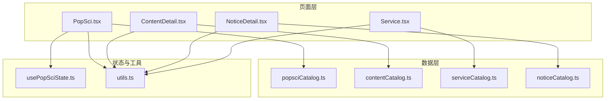
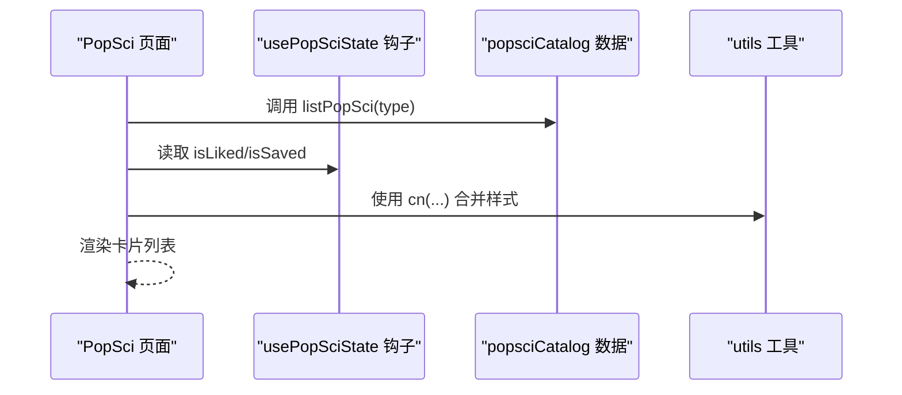
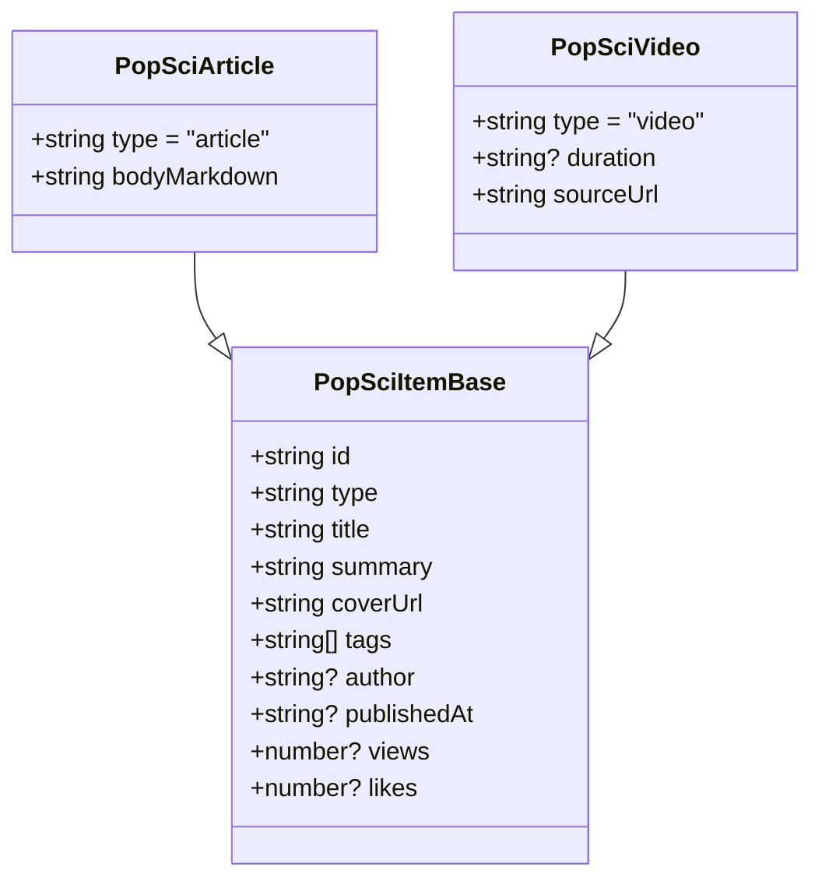
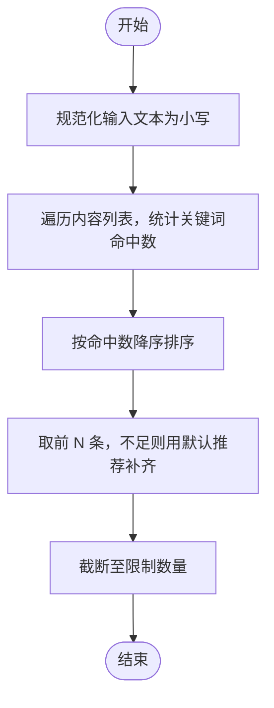
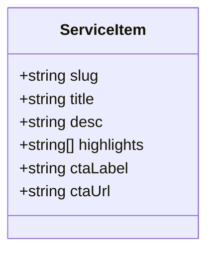
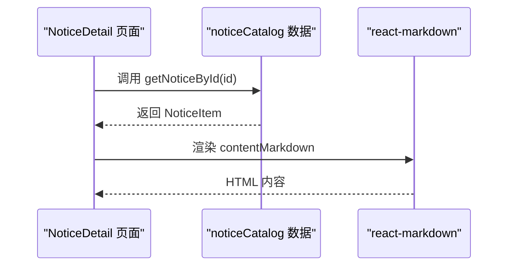
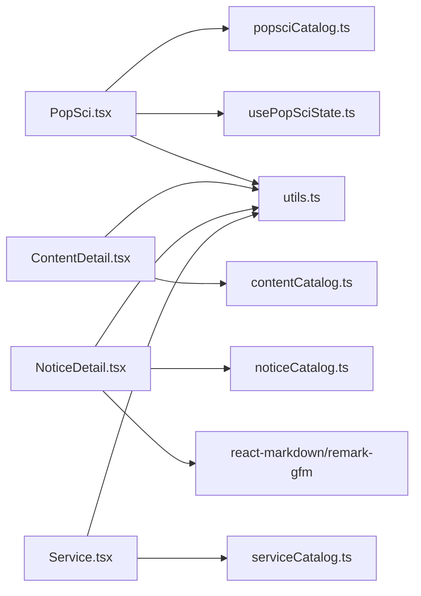

# 数据目录结构

<cite>
**本文引用的文件**
- [src/data/popsciCatalog.ts](file://src/data/popsciCatalog.ts)
- [src/data/contentCatalog.ts](file://src/data/contentCatalog.ts)
- [src/data/serviceCatalog.ts](file://src/data/serviceCatalog.ts)
- [src/data/noticeCatalog.ts](file://src/data/noticeCatalog.ts)
- [src/hooks/usePopSciState.ts](file://src/hooks/usePopSciState.ts)
- [src/pages/PopSci.tsx](file://src/pages/PopSci.tsx)
- [src/pages/ContentDetail.tsx](file://src/pages/ContentDetail.tsx)
- [src/pages/NoticeDetail.tsx](file://src/pages/NoticeDetail.tsx)
- [src/pages/Service.tsx](file://src/pages/Service.tsx)
- [src/lib/utils.ts](file://src/lib/utils.ts)
- [package.json](file://package.json)
</cite>

## 目录
1. [简介](#简介)
2. [项目结构](#项目结构)
3. [核心组件](#核心组件)
4. [架构总览](#架构总览)
5. [详细组件分析](#详细组件分析)
6. [依赖分析](#依赖分析)
7. [性能考虑](#性能考虑)
8. [故障排查指南](#故障排查指南)
9. [结论](#结论)
10. [附录](#附录)

## 简介
本文件系统化梳理项目中的数据目录结构，聚焦以下目录的设计理念、组织方式与使用模式：
- popsciCatalog：健康科普内容目录（文章/视频），支持按类型筛选与按标识检索
- contentCatalog：通用内容目录（文章/视频/服务/商品），支持关键词匹配与默认推荐
- serviceCatalog：服务目录（服务包/商品/在线问诊等），支持按 slug 快速定位
- noticeCatalog：公告与提醒目录（提醒/新闻），支持按类别与按标识检索

文档将解释数据目录的加载机制、查询优化与索引设计思路，文档化分类标准、标签系统与检索算法，提供扩展方法、新增内容类型的集成流程与数据一致性保障，并总结性能优化技巧、缓存策略与批量操作最佳实践，最后阐述数据目录与页面组件的解耦设计与动态加载机制。

## 项目结构
数据目录位于 src/data 下，采用“按领域划分”的扁平模块化组织，每个目录一个独立 TS 文件，导出强类型接口与数据数组，并提供若干查询函数用于页面层消费。页面组件通过 import 方式直接引用数据目录与工具函数，形成“声明式数据消费”。

图表来源
- [src/data/popsciCatalog.ts](file://src/data/popsciCatalog.ts)
- [src/data/contentCatalog.ts](file://src/data/contentCatalog.ts)
- [src/data/serviceCatalog.ts](file://src/data/serviceCatalog.ts)
- [src/data/noticeCatalog.ts](file://src/data/noticeCatalog.ts)
- [src/pages/PopSci.tsx](file://src/pages/PopSci.tsx)
- [src/pages/ContentDetail.tsx](file://src/pages/ContentDetail.tsx)
- [src/pages/NoticeDetail.tsx](file://src/pages/NoticeDetail.tsx)
- [src/pages/Service.tsx](file://src/pages/Service.tsx)
- [src/hooks/usePopSciState.ts](file://src/hooks/usePopSciState.ts)
- [src/lib/utils.ts](file://src/lib/utils.ts)

章节来源
- [src/data/popsciCatalog.ts](file://src/data/popsciCatalog.ts)
- [src/data/contentCatalog.ts](file://src/data/contentCatalog.ts)
- [src/data/serviceCatalog.ts](file://src/data/serviceCatalog.ts)
- [src/data/noticeCatalog.ts](file://src/data/noticeCatalog.ts)
- [src/pages/PopSci.tsx](file://src/pages/PopSci.tsx)
- [src/pages/ContentDetail.tsx](file://src/pages/ContentDetail.tsx)
- [src/pages/NoticeDetail.tsx](file://src/pages/NoticeDetail.tsx)
- [src/pages/Service.tsx](file://src/pages/Service.tsx)
- [src/lib/utils.ts](file://src/lib/utils.ts)

## 核心组件
- popsciCatalog：定义 PopSciType 与 PopSciItem 接口，导出 popsciCatalog 数组与 getPopSciItem/listPopSci 查询函数
- contentCatalog：定义 ContentType 与 ContentItem 接口，导出 contentCatalog 数组、默认推荐 ID 列表与 getContentById/getRecommendations 查询函数
- serviceCatalog：定义 ServiceItem 接口，导出 serviceCatalog 数组与 getServiceBySlug 查询函数
- noticeCatalog：定义 NoticeCategory 与 NoticeItem 接口，导出 noticeCatalog 数组与 getNoticeById/listNotices 查询函数
- usePopSciState：封装本地收藏/点赞状态，提供 isLiked/isSaved/toggleLiked/toggleSaved 等 API

章节来源
- [src/data/popsciCatalog.ts](file://src/data/popsciCatalog.ts)
- [src/data/contentCatalog.ts](file://src/data/contentCatalog.ts)
- [src/data/serviceCatalog.ts](file://src/data/serviceCatalog.ts)
- [src/data/noticeCatalog.ts](file://src/data/noticeCatalog.ts)
- [src/hooks/usePopSciState.ts](file://src/hooks/usePopSciState.ts)

## 架构总览
数据目录采用“静态声明 + 函数式查询”的轻量架构。页面组件通过 import 直接消费数据与状态钩子，实现解耦与可测试性。查询函数提供 O(n) 级别的过滤与排序能力，满足当前规模下的性能需求。

图表来源
- [src/pages/PopSci.tsx](file://src/pages/PopSci.tsx)
- [src/hooks/usePopSciState.ts](file://src/hooks/usePopSciState.ts)
- [src/data/popsciCatalog.ts](file://src/data/popsciCatalog.ts)
- [src/lib/utils.ts](file://src/lib/utils.ts)

## 详细组件分析

### popsciCatalog 组件分析
- 设计理念
  - 以联合类型区分文章与视频两类内容，统一基类字段便于跨类型渲染
  - 提供 getPopSciItem 与 listPopSci 两个查询函数，分别支持按类型+ID 精确查找与按类型过滤
- 数据组织策略
  - 以数组形式存储，元素为强类型对象，包含标题、摘要、封面、标签、作者、发布时间、浏览/点赞数等
  - 文章与视频在字段层面做差异化扩展，避免冗余字段污染
- 访问模式
  - 页面通过 useMemo 缓存 listPopSci 结果，减少重复计算
  - 与 usePopSciState 解耦，状态持久化于本地存储
- 查询优化与索引设计
  - 当前为线性扫描，复杂度 O(n)，适合中小规模数据
  - 可选优化：为 id/type 建立 Map 索引，将精确查找降为 O(1)
- 扩展方法
  - 新增内容类型：定义新接口与联合类型，扩展查询函数以支持新类型
  - 新增字段：在基类或特定类型接口中增加字段，保持向后兼容

图表来源
- [src/data/popsciCatalog.ts](file://src/data/popsciCatalog.ts)

章节来源
- [src/data/popsciCatalog.ts](file://src/data/popsciCatalog.ts)
- [src/pages/PopSci.tsx](file://src/pages/PopSci.tsx)
- [src/hooks/usePopSciState.ts](file://src/hooks/usePopSciState.ts)

### contentCatalog 组件分析
- 设计理念
  - 通用内容模型，支持文章/视频/服务/商品四类内容，统一关键字检索
  - 默认推荐 ID 列表作为兜底策略，确保推荐结果数量与质量
- 数据组织策略
  - 关键字数组用于语义匹配，覆盖范围广、易扩展
  - 支持外部链接与封面图，便于跨域内容聚合
- 访问模式
  - 页面通过 getContentById 获取详情，getRecommendations 实现关键词匹配推荐
- 检索算法
  - 对每个内容项统计关键词命中数，按分数降序排序，取前 N 条
  - 不足数量时用默认推荐 ID 列表补齐
- 性能与优化
  - 当前为 O(n*m*k) 级别（n 为内容数，m 为每项关键词数，k 为输入词数），适合小中型数据集
  - 可选优化：对关键词建立倒排索引，命中阶段使用集合交并运算加速

图表来源
- [src/data/contentCatalog.ts](file://src/data/contentCatalog.ts)

章节来源
- [src/data/contentCatalog.ts](file://src/data/contentCatalog.ts)
- [src/pages/ContentDetail.tsx](file://src/pages/ContentDetail.tsx)

### serviceCatalog 组件分析
- 设计理念
  - 以 slug 为稳定标识，便于路由与跳转
  - 高光特性与 CTA 配置化，便于运营侧快速调整
- 数据组织策略
  - 服务项包含标题、描述、高亮特性、按钮文案与跳转地址
- 访问模式
  - 页面通过 getServiceBySlug 获取单项，或直接消费 serviceCatalog 数组进行列表渲染
- 扩展方法
  - 新增服务类型：在接口中扩展字段，或引入枚举约束
  - 新增跳转目标：统一收敛到 ctaUrl，便于后续改造

图表来源
- [src/data/serviceCatalog.ts](file://src/data/serviceCatalog.ts)
- [src/pages/Service.tsx](file://src/pages/Service.tsx)

章节来源
- [src/data/serviceCatalog.ts](file://src/data/serviceCatalog.ts)
- [src/pages/Service.tsx](file://src/pages/Service.tsx)

### noticeCatalog 组件分析
- 设计理念
  - 区分提醒与新闻两类内容，便于前端展示策略差异化
  - Markdown 内容便于富文本渲染与版本迭代
- 数据组织策略
  - 以 id 为唯一标识，category 为分类键
- 访问模式
  - 页面通过 getNoticeById 获取详情，listNotices 按类别筛选
- 渲染与依赖
  - 使用 react-markdown + remark-gfm 渲染 Markdown，依赖在 package.json 中声明

图表来源
- [src/pages/NoticeDetail.tsx](file://src/pages/NoticeDetail.tsx)
- [src/data/noticeCatalog.ts](file://src/data/noticeCatalog.ts)
- [package.json](file://package.json)

章节来源
- [src/data/noticeCatalog.ts](file://src/data/noticeCatalog.ts)
- [src/pages/NoticeDetail.tsx](file://src/pages/NoticeDetail.tsx)
- [package.json](file://package.json)

### 状态与缓存：usePopSciState
- 设计理念
  - 将用户对科普内容的点赞/收藏状态持久化到本地存储，提升用户体验与离线可用性
- 数据结构
  - 以字符串键（type:id）记录状态，避免重复与误判
- 访问模式
  - 页面通过钩子提供的 isLiked/isSaved/toggleLiked/toggleSaved 消费与更新状态
- 一致性与健壮性
  - 解析失败时回退到空状态，保证应用稳定性

章节来源
- [src/hooks/usePopSciState.ts](file://src/hooks/usePopSciState.ts)
- [src/pages/PopSci.tsx](file://src/pages/PopSci.tsx)

## 依赖分析
- 页面到数据目录的依赖
  - PopSci.tsx 依赖 popsciCatalog 与 usePopSciState
  - ContentDetail.tsx 依赖 contentCatalog
  - NoticeDetail.tsx 依赖 noticeCatalog
  - Service.tsx 依赖 serviceCatalog
- 工具依赖
  - utils.ts 提供样式合并工具，被多个页面复用
- 外部依赖
  - react-markdown 与 remark-gfm 用于公告详情渲染

图表来源
- [src/pages/PopSci.tsx](file://src/pages/PopSci.tsx)
- [src/pages/ContentDetail.tsx](file://src/pages/ContentDetail.tsx)
- [src/pages/NoticeDetail.tsx](file://src/pages/NoticeDetail.tsx)
- [src/pages/Service.tsx](file://src/pages/Service.tsx)
- [src/data/popsciCatalog.ts](file://src/data/popsciCatalog.ts)
- [src/data/contentCatalog.ts](file://src/data/contentCatalog.ts)
- [src/data/noticeCatalog.ts](file://src/data/noticeCatalog.ts)
- [src/data/serviceCatalog.ts](file://src/data/serviceCatalog.ts)
- [src/hooks/usePopSciState.ts](file://src/hooks/usePopSciState.ts)
- [src/lib/utils.ts](file://src/lib/utils.ts)
- [package.json](file://package.json)

章节来源
- [src/pages/PopSci.tsx](file://src/pages/PopSci.tsx)
- [src/pages/ContentDetail.tsx](file://src/pages/ContentDetail.tsx)
- [src/pages/NoticeDetail.tsx](file://src/pages/NoticeDetail.tsx)
- [src/pages/Service.tsx](file://src/pages/Service.tsx)
- [src/lib/utils.ts](file://src/lib/utils.ts)
- [package.json](file://package.json)

## 性能考虑
- 查询复杂度
  - popsciCatalog：listPopSci 为 O(n)，getPopSciItem 为 O(n)
  - contentCatalog：getRecommendations 为 O(n*m*k)，存在优化空间
  - noticeCatalog：listNotices 为 O(n)，getNoticeById 为 O(n)
- 缓存策略
  - 页面层使用 useMemo 缓存 listPopSci 结果，避免重复计算
  - usePopSciState 将状态持久化到本地存储，减少请求与重算成本
- 批量操作最佳实践
  - 对高频查询（如内容推荐）建议引入倒排索引或预构建 Map
  - 对大列表渲染建议结合虚拟滚动与懒加载
- 索引设计建议
  - 为 id/type 建立 Map，将 O(n) 查找降为 O(1)
  - 为关键词建立前缀树或哈希映射，加速命中阶段
- 传输与渲染
  - 图片资源建议 CDN 与懒加载，Markdown 渲染建议在客户端按需加载

## 故障排查指南
- 内容为空或未找到
  - ContentDetail/NoticeDetail 页面对不存在的内容做了兜底提示，确认路由参数与数据 id 是否一致
- 推荐结果不足
  - contentCatalog 的推荐算法会在关键词命中不足时使用默认推荐 ID 列表补齐，检查关键词覆盖率与默认列表
- 点赞/收藏状态异常
  - usePopSciState 在解析本地存储失败时会回退到空状态，检查浏览器本地存储权限与数据格式
- Markdown 渲染问题
  - 确认 react-markdown 与 remark-gfm 版本与依赖安装正常

章节来源
- [src/pages/ContentDetail.tsx](file://src/pages/ContentDetail.tsx)
- [src/pages/NoticeDetail.tsx](file://src/pages/NoticeDetail.tsx)
- [src/data/contentCatalog.ts](file://src/data/contentCatalog.ts)
- [src/hooks/usePopSciState.ts](file://src/hooks/usePopSciState.ts)
- [package.json](file://package.json)

## 结论
本项目的数据目录采用“声明式静态数据 + 轻量查询函数 + 页面层缓存”的架构，具备良好的可维护性与扩展性。当前查询路径以线性扫描为主，适合中小规模数据；随着业务增长，建议引入索引与预处理机制，配合页面层缓存与懒加载，进一步提升性能与体验。

## 附录

### 数据目录扩展方法与集成流程
- 新增内容类型（以“问答/专栏”为例）
  - 在对应目录中定义新类型接口与联合类型
  - 在数据数组中添加示例数据
  - 扩展现有查询函数以支持新类型（如 listXxx、getXxxById）
  - 在页面层 import 并消费新类型数据
- 新增字段
  - 在现有接口中增加字段，保持向后兼容（可选字段）
  - 更新数据数组与查询函数，确保渲染层可选使用
- 数据一致性保证
  - 通过 TypeScript 接口约束字段类型与必填项
  - 在页面层对不存在数据进行兜底处理
  - 对本地状态与远端数据的冲突，采用“本地优先/版本号”策略

### 数据分类标准与标签系统
- popsciCatalog：以“文章/视频”二元分类为主，辅以标签数组用于二次筛选
- contentCatalog：以“文章/视频/服务/商品”四元分类，关键词数组用于语义检索
- noticeCatalog：以“提醒/新闻”二元分类，便于前端差异化展示
- serviceCatalog：以 slug 为稳定标识，便于路由与跳转

### 动态加载与解耦设计
- 页面通过 import 直接消费数据目录，避免中间层抽象带来的耦合
- 使用 useMemo 缓存查询结果，降低重复计算
- 使用本地存储钩子管理用户行为状态，与数据目录解耦