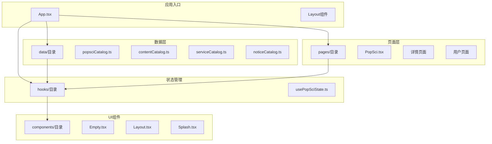
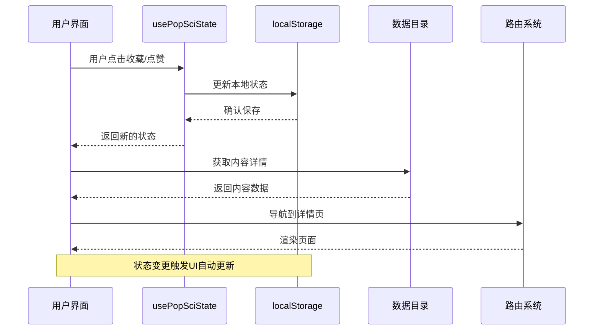
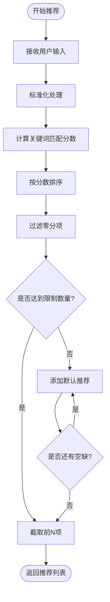
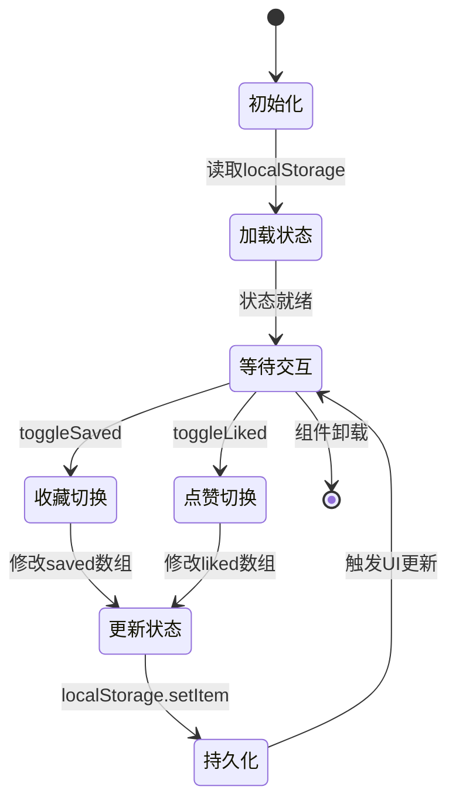
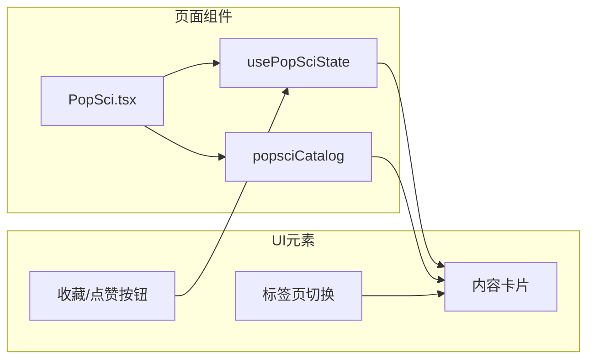
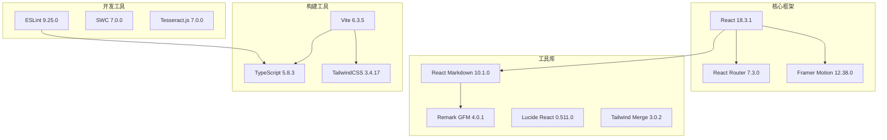
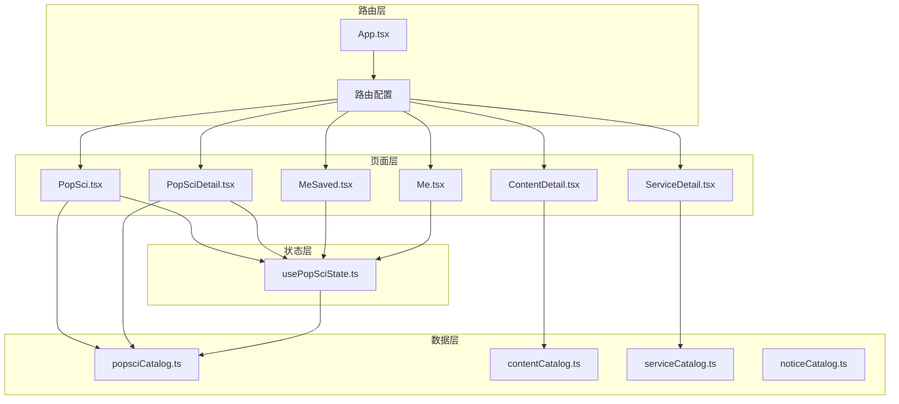

# 数据管理系统

<cite>
**本文档引用的文件**
- [popsciCatalog.ts](file://src/data/popsciCatalog.ts)
- [contentCatalog.ts](file://src/data/contentCatalog.ts)
- [serviceCatalog.ts](file://src/data/serviceCatalog.ts)
- [noticeCatalog.ts](file://src/data/noticeCatalog.ts)
- [usePopSciState.ts](file://src/hooks/usePopSciState.ts)
- [App.tsx](file://src/App.tsx)
- [PopSci.tsx](file://src/pages/PopSci.tsx)
- [PopSciDetail.tsx](file://src/pages/PopSciDetail.tsx)
- [ContentDetail.tsx](file://src/pages/ContentDetail.tsx)
- [ServiceDetail.tsx](file://src/pages/ServiceDetail.tsx)
- [Me.tsx](file://src/pages/Me.tsx)
- [MeSaved.tsx](file://src/pages/MeSaved.tsx)
- [package.json](file://package.json)
</cite>

## 目录
1. [简介](#简介)
2. [项目结构](#项目结构)
3. [核心组件](#核心组件)
4. [架构概览](#架构概览)
5. [详细组件分析](#详细组件分析)
6. [依赖分析](#依赖分析)
7. [性能考虑](#性能考虑)
8. [故障排除指南](#故障排除指南)
9. [结论](#结论)
10. [附录](#附录)

## 简介

本数据管理系统是一个基于React + TypeScript + Vite构建的健康科普内容平台，专注于提供科学、权威的健康知识传播。系统采用模块化的数据目录设计，通过类型安全的数据模型和状态管理机制，为用户提供个性化的内容体验。

系统的核心特色包括：
- **多类型内容统一管理**：支持文章、视频、服务包、商品等多种内容类型
- **智能状态管理**：基于localStorage的持久化状态管理
- **响应式UI绑定**：实时反映用户操作状态变化
- **类型安全保障**：完整的TypeScript类型定义确保数据一致性
- **高性能渲染**：优化的组件渲染策略和缓存机制

## 项目结构

项目采用清晰的分层架构，按照功能模块进行组织：



**图表来源**
- [App.tsx:19-51](file://src/App.tsx#L19-L51)
- [package.json:13-26](file://package.json#L13-L26)

**章节来源**
- [App.tsx:19-51](file://src/App.tsx#L19-L51)
- [package.json:1-48](file://package.json#L1-L48)

## 核心组件

### 数据目录系统

系统采用四个核心数据目录，每个目录负责特定类型的内容管理：

#### 科普内容目录 (popsciCatalog)
负责管理健康科普相关的文章和视频内容，支持类型区分和丰富的内容属性。

#### 内容目录 (contentCatalog)  
统一管理所有类型的内容资源，提供智能推荐和关键词匹配功能。

#### 服务目录 (serviceCatalog)
管理平台提供的各类健康服务包和产品信息。

#### 通知目录 (noticeCatalog)
处理系统通知和提醒信息，支持分类管理和内容展示。

### 状态管理组件

#### usePopSciState Hook
实现用户对科普内容的收藏和点赞状态管理，具备以下特性：
- **持久化存储**：基于localStorage的本地状态保存
- **类型安全**：严格的类型定义确保状态一致性
- **响应式更新**：自动响应状态变化触发UI更新
- **高效比较**：使用memoization优化性能

**章节来源**
- [usePopSciState.ts:30-79](file://src/hooks/usePopSciState.ts#L30-L79)
- [popsciCatalog.ts:29-98](file://src/data/popsciCatalog.ts#L29-L98)

## 架构概览

系统采用MVVM架构模式，通过数据驱动的方式实现UI更新：



**图表来源**
- [usePopSciState.ts:30-79](file://src/hooks/usePopSciState.ts#L30-L79)
- [PopSci.tsx:29-147](file://src/pages/PopSci.tsx#L29-L147)

## 详细组件分析

### popsciCatalog 数据模型

#### 类型定义架构

```mermaid
classDiagram
class PopSciType {
<<enumeration>>
"article"
"video"
}
class PopSciItemBase {
+string id
+PopSciType type
+string title
+string summary
+string coverUrl
+string[] tags
+string author
+string publishedAt
+number views
+number likes
}
class PopSciArticle {
+string bodyMarkdown
}
class PopSciVideo {
+string duration
+string sourceUrl
}
class PopSciItem {
<<union type>>
}
PopSciItemBase <|-- PopSciArticle
PopSciItemBase <|-- PopSciVideo
PopSciItem --> PopSciArticle
PopSciItem --> PopSciVideo
```

**图表来源**
- [popsciCatalog.ts:1-27](file://src/data/popsciCatalog.ts#L1-L27)

#### 数据结构特点

1. **类型安全设计**：使用联合类型确保文章和视频的差异化属性
2. **扩展性考虑**：基础接口定义了通用字段，便于未来扩展
3. **元数据丰富**：包含标签、作者、发布时间等完整信息
4. **多媒体支持**：视频内容包含时长和源地址字段

**章节来源**
- [popsciCatalog.ts:1-98](file://src/data/popsciCatalog.ts#L1-L98)

### contentCatalog 推荐系统

#### 内容推荐算法



**图表来源**
- [contentCatalog.ts:69-99](file://src/data/contentCatalog.ts#L69-L99)

#### 推荐策略

1. **关键词匹配**：基于内容关键词与用户输入的匹配度评分
2. **智能补全**：当匹配结果不足时自动添加默认推荐内容
3. **数量控制**：支持自定义推荐数量限制
4. **去重机制**：确保推荐结果的唯一性

**章节来源**
- [contentCatalog.ts:65-101](file://src/data/contentCatalog.ts#L65-L101)

### usePopSciState 状态管理

#### 状态管理模式



**图表来源**
- [usePopSciState.ts:30-79](file://src/hooks/usePopSciState.ts#L30-L79)

#### 状态管理特性

1. **键值格式**：使用"type:id"格式的复合键标识内容
2. **原子更新**：每次操作都是原子性的状态变更
3. **自动持久化**：状态变更自动保存到localStorage
4. **内存优化**：使用useMemo避免不必要的重新计算

**章节来源**
- [usePopSciState.ts:1-80](file://src/hooks/usePopSciState.ts#L1-L80)

### 页面组件集成

#### PopSci 主页面

PopSci页面实现了完整的科普内容展示功能：



**图表来源**
- [PopSci.tsx:26-269](file://src/pages/PopSci.tsx#L26-L269)

#### 详情页面

PopSciDetail页面提供了内容的深度展示：

1. **响应式布局**：根据内容类型动态调整显示方式
2. **Markdown渲染**：文章内容使用ReactMarkdown进行格式化
3. **外部链接处理**：视频内容提供安全的外部跳转
4. **状态同步**：详情页与主页面共享状态管理

**章节来源**
- [PopSciDetail.tsx:15-149](file://src/pages/PopSciDetail.tsx#L15-L149)

## 依赖分析

### 技术栈依赖

系统采用现代化的前端技术栈，各依赖项的作用如下：



**图表来源**
- [package.json:13-46](file://package.json#L13-L46)

### 组件间依赖关系



**图表来源**
- [App.tsx:19-51](file://src/App.tsx#L19-L51)
- [usePopSciState.ts:30-79](file://src/hooks/usePopSciState.ts#L30-L79)

**章节来源**
- [package.json:13-46](file://package.json#L13-L46)

## 性能考虑

### 渲染优化策略

1. **组件记忆化**：使用useMemo避免重复计算
2. **条件渲染**：根据状态动态决定渲染内容
3. **懒加载**：图片和视频采用延迟加载策略
4. **虚拟滚动**：大量内容时考虑实现虚拟滚动

### 状态管理优化

1. **原子操作**：每次状态变更都是原子性的
2. **批量更新**：避免频繁的状态更新触发
3. **内存管理**：及时清理不需要的状态数据
4. **序列化优化**：localStorage数据的序列化和反序列化优化

### 数据访问优化

1. **索引策略**：为常用查询建立索引
2. **缓存机制**：实现多级缓存策略
3. **分页加载**：大数据集时采用分页策略
4. **增量更新**：只更新发生变化的部分

## 故障排除指南

### 常见问题诊断

#### 状态不同步问题
- **症状**：收藏/点赞状态与实际UI不符
- **排查**：检查localStorage数据格式和解析逻辑
- **解决方案**：实现状态回退机制和数据校验

#### 内容加载失败
- **症状**：详情页面显示"内容不存在"
- **排查**：验证路由参数和数据查找逻辑
- **解决方案**：添加默认值和错误边界

#### 性能问题
- **症状**：页面渲染缓慢或卡顿
- **排查**：分析组件渲染次数和状态更新频率
- **解决方案**：实施组件拆分和优化策略

### 错误处理机制

系统实现了多层次的错误处理：

1. **类型检查**：编译时类型验证
2. **运行时校验**：数据格式和完整性检查
3. **用户友好提示**：友好的错误信息展示
4. **日志记录**：详细的错误日志便于调试

**章节来源**
- [usePopSciState.ts:13-24](file://src/hooks/usePopSciState.ts#L13-L24)
- [PopSciDetail.tsx:77-87](file://src/pages/PopSciDetail.tsx#L77-L87)

## 结论

本数据管理系统通过精心设计的数据模型、状态管理和UI架构，成功实现了健康科普内容的高效管理。系统的主要优势包括：

1. **类型安全**：完整的TypeScript类型定义确保数据一致性
2. **扩展性强**：模块化设计便于功能扩展和维护
3. **用户体验佳**：响应式的UI和流畅的交互体验
4. **性能优化**：多层优化策略确保系统性能稳定

未来可以考虑的改进方向：
- 实现服务端数据同步机制
- 添加搜索和过滤功能
- 优化移动端用户体验
- 增强数据分析和统计功能

## 附录

### 数据模型最佳实践

1. **类型定义**：始终使用TypeScript接口定义数据结构
2. **默认值**：为可选字段提供合理的默认值
3. **验证规则**：实现数据完整性验证机制
4. **版本管理**：为数据模型变更提供版本兼容性

### 新增内容类型集成

#### 集成步骤
1. 在对应的数据目录中添加类型定义
2. 实现数据访问函数（如getContentById）
3. 在路由系统中添加新的页面组件
4. 更新状态管理逻辑以支持新类型
5. 测试UI组件的兼容性

#### 示例流程


### 数据迁移策略

1. **向后兼容**：确保新版本不影响旧数据格式
2. **渐进式迁移**：分批次迁移现有数据
3. **备份策略**：迁移前做好数据备份
4. **回滚机制**：实现快速回滚能力
5. **监控告警**：迁移过程中实时监控数据完整性