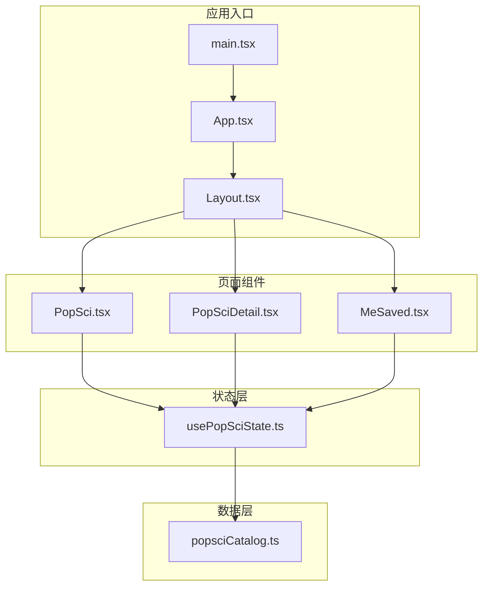
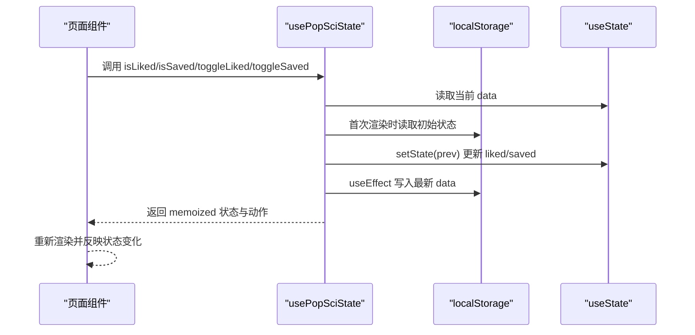
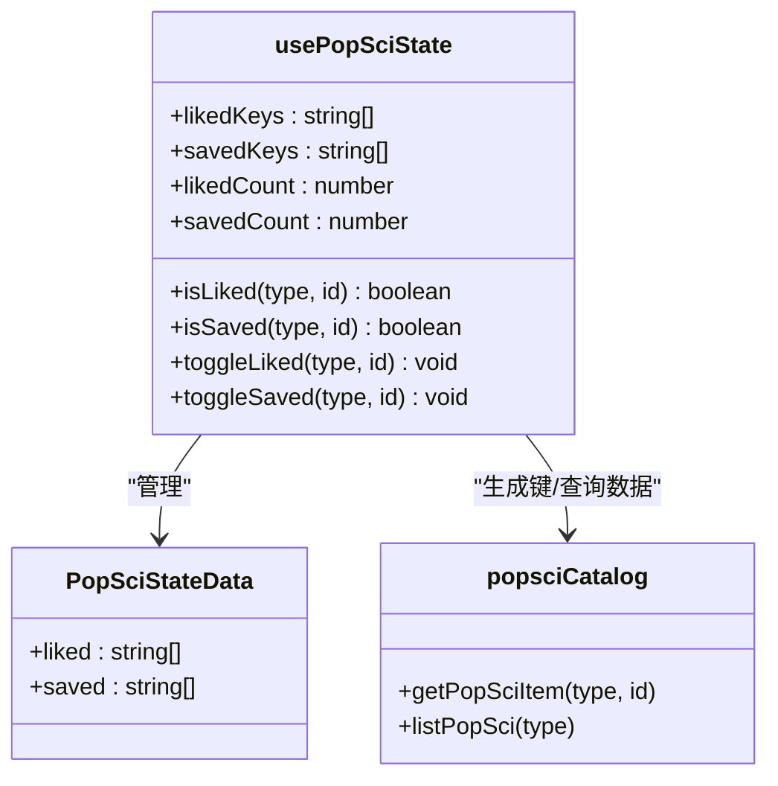
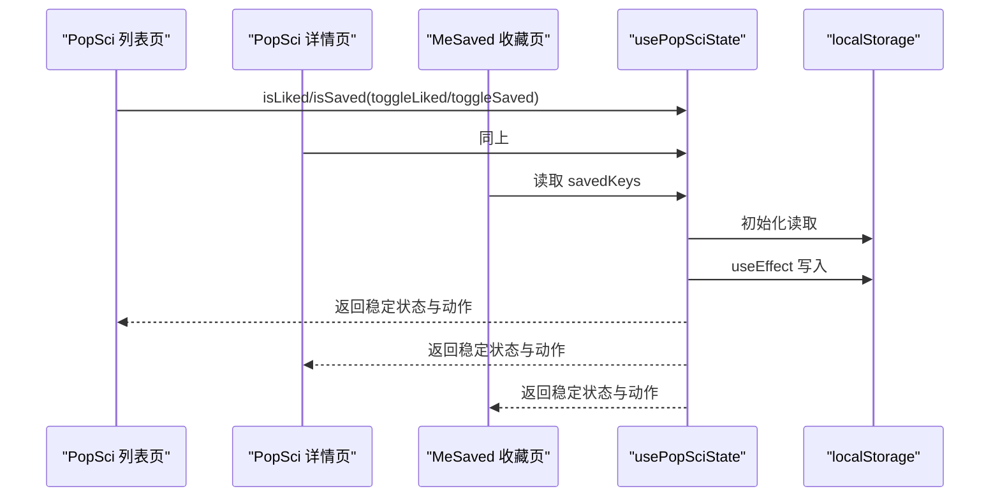
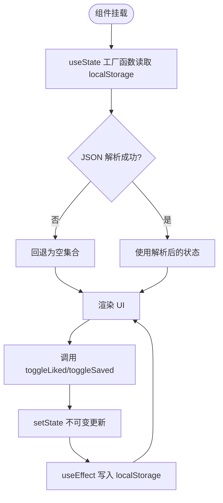
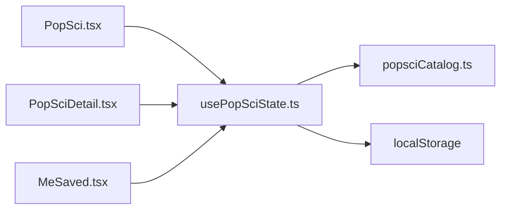

# 状态管理机制

<cite>
**本文引用的文件**
- [usePopSciState.ts](file://src/hooks/usePopSciState.ts)
- [popsciCatalog.ts](file://src/data/popsciCatalog.ts)
- [PopSci.tsx](file://src/pages/PopSci.tsx)
- [PopSciDetail.tsx](file://src/pages/PopSciDetail.tsx)
- [MeSaved.tsx](file://src/pages/MeSaved.tsx)
- [Layout.tsx](file://src/components/Layout.tsx)
- [App.tsx](file://src/App.tsx)
- [main.tsx](file://src/main.tsx)
- [useTheme.ts](file://src/hooks/useTheme.ts)
- [2026-04-14-chat-persistence-design.md](file://docs/superpowers/specs/2026-04-14-chat-persistence-design.md)
</cite>

## 目录
1. [简介](#简介)
2. [项目结构](#项目结构)
3. [核心组件](#核心组件)
4. [架构总览](#架构总览)
5. [详细组件分析](#详细组件分析)
6. [依赖分析](#依赖分析)
7. [性能考量](#性能考量)
8. [故障排查指南](#故障排查指南)
9. [结论](#结论)
10. [附录](#附录)

## 简介
本文件系统性解析 usePopSciState Hook 的设计架构与实现原理，覆盖状态管理策略、数据流控制、组件间通信机制、初始化流程、更新触发条件与响应式更新、持久化方案与缓存策略、性能优化、订阅模式、副作用处理与错误边界管理，并提供状态扩展最佳实践、调试技巧以及与 UI 组件的绑定关系与状态变化对界面的影响。

## 项目结构
该项目采用基于页面与组件的组织方式，状态管理集中在自定义 Hook 中，UI 组件通过 Hook 订阅状态并驱动渲染。核心路径如下：
- 钩子层：src/hooks/usePopSciState.ts
- 数据模型：src/data/popsciCatalog.ts
- 页面组件：src/pages/PopSci.tsx、src/pages/PopSciDetail.tsx、src/pages/MeSaved.tsx
- 应用入口与布局：src/main.tsx、src/App.tsx、src/components/Layout.tsx
- 主题钩子（对比参考）：src/hooks/useTheme.ts
- 文档规范（持久化设计参考）：docs/superpowers/specs/2026-04-14-chat-persistence-design.md

图表来源
- [main.tsx:1-11](file://src/main.tsx#L1-L11)
- [App.tsx:19-51](file://src/App.tsx#L19-L51)
- [Layout.tsx:19-65](file://src/components/Layout.tsx#L19-L65)
- [usePopSciState.ts:30-79](file://src/hooks/usePopSciState.ts#L30-L79)
- [popsciCatalog.ts:1-98](file://src/data/popsciCatalog.ts#L1-L98)
- [PopSci.tsx:26-270](file://src/pages/PopSci.tsx#L26-L270)
- [PopSciDetail.tsx:15-150](file://src/pages/PopSciDetail.tsx#L15-L150)
- [MeSaved.tsx:16-132](file://src/pages/MeSaved.tsx#L16-L132)

章节来源
- [main.tsx:1-11](file://src/main.tsx#L1-L11)
- [App.tsx:19-51](file://src/App.tsx#L19-L51)
- [Layout.tsx:19-65](file://src/components/Layout.tsx#L19-L65)

## 核心组件
- usePopSciState Hook：提供“点赞/收藏”状态的读取与切换能力，支持持久化与响应式更新。
- popsciCatalog 数据模型：定义内容类型、字段与查询接口，为状态键生成与 UI 渲染提供基础。
- 页面组件：PopSci、PopSciDetail、MeSaved 通过 Hook 订阅状态，驱动 UI 交互与视觉反馈。
- 主题 Hook（对比参考）：useTheme 展示了另一种持久化策略（localStorage + DOM 类名切换），便于对比持久化与副作用处理模式。

章节来源
- [usePopSciState.ts:30-79](file://src/hooks/usePopSciState.ts#L30-L79)
- [popsciCatalog.ts:1-98](file://src/data/popsciCatalog.ts#L1-L98)
- [PopSci.tsx:26-270](file://src/pages/PopSci.tsx#L26-L270)
- [PopSciDetail.tsx:15-150](file://src/pages/PopSciDetail.tsx#L15-L150)
- [MeSaved.tsx:16-132](file://src/pages/MeSaved.tsx#L16-L132)
- [useTheme.ts:1-29](file://src/hooks/useTheme.ts#L1-L29)

## 架构总览
usePopSciState 采用“本地状态 + 本地存储”的轻量级状态管理模式：
- 初始化：从 localStorage 解析初始状态，若失败则回退为空集合。
- 响应式：内部使用 useState 管理内存状态，useEffect 将变更写回 localStorage。
- 订阅：通过 useMemo 包装返回值，避免不必要的重渲染；isLiked/isSaved/toggleLiked/toggleSaved 以 useCallback 缓存函数引用。
- UI 绑定：页面组件直接消费 Hook 返回的状态与动作，实现点赞/收藏的即时反馈与持久化。

图表来源
- [usePopSciState.ts:30-79](file://src/hooks/usePopSciState.ts#L30-L79)
- [PopSci.tsx:29-147](file://src/pages/PopSci.tsx#L29-L147)
- [PopSciDetail.tsx:18-72](file://src/pages/PopSciDetail.tsx#L18-L72)
- [MeSaved.tsx:18-124](file://src/pages/MeSaved.tsx#L18-L124)

## 详细组件分析

### usePopSciState Hook 设计与实现
- 状态结构
  - liked/saved：字符串数组，元素格式为“类型:ID”，如“article:a-htn-winter-meds”。
  - 初始化：safeParse 安全解析 localStorage，失败时回退空数组。
  - 持久化：useEffect 监听 data，每次变更写入 localStorage。
- 访问器与动作
  - isLiked/isSaved：根据键判断是否已点赞/收藏。
  - toggleLiked/toggleSaved：切换状态，内部通过不可变更新构建新数组。
- 性能与稳定性
  - useCallback 包裹访问器与动作，减少引用抖动。
  - useMemo 包裹返回对象，确保返回值稳定，降低下游组件重渲染。
  - makeKey 统一键生成，避免拼接错误。
- 错误边界
  - safeParse 捕获 JSON 解析异常，防止异常中断初始化。
  - localStorage 读写失败不影响运行（回退为空集合）。

图表来源
- [usePopSciState.ts:6-28](file://src/hooks/usePopSciState.ts#L6-L28)
- [usePopSciState.ts:30-79](file://src/hooks/usePopSciState.ts#L30-L79)
- [popsciCatalog.ts:90-98](file://src/data/popsciCatalog.ts#L90-L98)

章节来源
- [usePopSciState.ts:30-79](file://src/hooks/usePopSciState.ts#L30-L79)

### 数据模型与键生成
- 类型定义：PopSciType 限定为 "article" | "video"。
- 键生成：makeKey(type, id) 统一生成“类型:ID”键，保证跨组件一致性。
- 查询工具：getPopSciItem/listPopSci 为 UI 提供内容数据，配合状态键进行筛选与渲染。

章节来源
- [popsciCatalog.ts:1-98](file://src/data/popsciCatalog.ts#L1-L98)
- [usePopSciState.ts:26-28](file://src/hooks/usePopSciState.ts#L26-L28)

### 页面组件与状态绑定
- PopSci 列表页
  - 订阅：usePopSciState 返回 isLiked/isSaved/toggleLiked/toggleSaved。
  - 交互：点击收藏/点赞按钮调用 toggleSaved/toggleLiked，即时更新 UI 并持久化。
  - 计数：点赞计数在 UI 层叠加本地状态，增强即时反馈。
- PopSciDetail 详情页
  - 订阅：同样使用 usePopSciState，根据当前项动态计算 liked/saved。
  - 交互：收藏/点赞按钮切换状态，返回列表页时状态保持一致。
- MeSaved 我的收藏页
  - 订阅：读取 savedKeys，解析键并映射到内容项。
  - 交互：支持取消收藏，联动 UI 与状态。

图表来源
- [PopSci.tsx:29-147](file://src/pages/PopSci.tsx#L29-L147)
- [PopSciDetail.tsx:18-72](file://src/pages/PopSciDetail.tsx#L18-L72)
- [MeSaved.tsx:18-124](file://src/pages/MeSaved.tsx#L18-L124)
- [usePopSciState.ts:30-79](file://src/hooks/usePopSciState.ts#L30-L79)

章节来源
- [PopSci.tsx:26-270](file://src/pages/PopSci.tsx#L26-L270)
- [PopSciDetail.tsx:15-150](file://src/pages/PopSciDetail.tsx#L15-L150)
- [MeSaved.tsx:16-132](file://src/pages/MeSaved.tsx#L16-L132)

### 初始化流程与更新触发
- 初始化
  - 首次渲染时，useState 的工厂函数从 localStorage 读取并解析状态。
  - safeParse 失败时回退为空集合，保证健壮性。
- 更新触发
  - toggleLiked/toggleSaved 通过 setState(prev) 不可变更新 liked/saved。
  - useEffect 监听 data，将最新状态写回 localStorage。
- 响应式更新
  - useMemo 包裹返回值，依赖项包括 data.liked/data.saved 与已缓存的动作/访问器。
  - useCallback 包裹访问器与动作，避免引用抖动导致的重渲染。

图表来源
- [usePopSciState.ts:31-38](file://src/hooks/usePopSciState.ts#L31-L38)
- [usePopSciState.ts:50-64](file://src/hooks/usePopSciState.ts#L50-L64)
- [usePopSciState.ts:36-38](file://src/hooks/usePopSciState.ts#L36-L38)

章节来源
- [usePopSciState.ts:30-79](file://src/hooks/usePopSciState.ts#L30-L79)

### 持久化方案与缓存策略
- 持久化介质：localStorage
  - 键名：统一前缀 popsci_state_v1，便于版本化与迁移。
  - 写入时机：每次 data 变更时写入，确保跨页面与刷新不丢失。
- 缓存策略
  - 内存缓存：useState 管理当前状态，优先读取内存，提升渲染性能。
  - 键缓存：makeKey 生成键，避免重复拼接与格式错误。
- 对比参考
  - useTheme：主题持久化采用相同策略（localStorage + DOM 类名切换），体现一致的持久化模式。
  - Chat 持久化设计文档：强调 localStorage 的简单性与容量限制，提供图片处理与过期 URL 的处理思路，可借鉴到状态持久化中对大体量数据的处理。

章节来源
- [usePopSciState.ts:11-11](file://src/hooks/usePopSciState.ts#L11-L11)
- [usePopSciState.ts:36-38](file://src/hooks/usePopSciState.ts#L36-L38)
- [useTheme.ts:6-18](file://src/hooks/useTheme.ts#L6-L18)
- [2026-04-14-chat-persistence-design.md:1-22](file://docs/superpowers/specs/2026-04-14-chat-persistence-design.md#L1-L22)

### 性能优化措施
- 函数引用稳定化
  - useCallback 包裹访问器与动作，减少下游组件重渲染。
- 返回值稳定化
  - useMemo 包裹返回对象，避免对象引用变化引发的重渲染。
- 不可变更新
  - 通过过滤与展开构造新数组，避免直接修改原数组，利于 React 比较与优化。
- 渲染层面
  - 页面组件使用动画与条件渲染，结合状态变化进行局部更新。

章节来源
- [usePopSciState.ts:40-78](file://src/hooks/usePopSciState.ts#L40-L78)
- [PopSci.tsx:70-266](file://src/pages/PopSci.tsx#L70-L266)

### 订阅模式、副作用与错误边界
- 订阅模式
  - 页面组件通过 Hook 订阅状态，无需全局状态库即可实现跨页面共享。
  - 返回值稳定化避免订阅方频繁重渲染。
- 副作用
  - useEffect 写入 localStorage，确保状态持久化。
  - DOM 类名切换（主题场景）体现副作用在 UI 层的应用。
- 错误边界
  - safeParse 捕获 JSON 异常，防止初始化阶段崩溃。
  - localStorage 读写失败时回退为空集合，保证运行时稳定。

章节来源
- [usePopSciState.ts:13-24](file://src/hooks/usePopSciState.ts#L13-L24)
- [usePopSciState.ts:36-38](file://src/hooks/usePopSciState.ts#L36-L38)
- [useTheme.ts:14-18](file://src/hooks/useTheme.ts#L14-L18)

### 状态扩展最佳实践与调试技巧
- 扩展最佳实践
  - 新增状态字段：在 PopSciStateData 中添加字段，提供默认值并在 safeParse 中兼容旧格式。
  - 新增动作：新增 toggleXxx 与不可变更新逻辑，确保 useEffect 写入完整状态。
  - 键扩展：如需复合键，保持 makeKey 与 parseKey 的一致性。
- 集成方法
  - 在目标页面引入 usePopSciState，按需使用 isXxx/toggleXxx。
  - 若涉及大体量数据，参考 Chat 持久化设计文档的容量与图片处理策略。
- 调试技巧
  - 在浏览器开发者工具的 Application/Storage 中查看 localStorage 键值。
  - 在 useEffect 中添加日志，确认写入时机与内容。
  - 使用 React DevTools 检查组件重渲染次数，验证 useMemo/useCallback 的效果。

章节来源
- [usePopSciState.ts:6-28](file://src/hooks/usePopSciState.ts#L6-L28)
- [usePopSciState.ts:30-79](file://src/hooks/usePopSciState.ts#L30-L79)
- [2026-04-14-chat-persistence-design.md:1-22](file://docs/superpowers/specs/2026-04-14-chat-persistence-design.md#L1-L22)

## 依赖分析
- 组件耦合
  - 页面组件依赖 usePopSciState，形成单向数据流：UI -> Hook -> 状态 -> UI。
  - Hook 依赖 popsciCatalog 的键生成与查询工具，保证键的一致性与可解析性。
- 外部依赖
  - localStorage：持久化介质。
  - React Hooks：useState/useEffect/useMemo/useCallback。
- 潜在循环依赖
  - 当前结构无循环依赖，模块职责清晰。

图表来源
- [PopSci.tsx:29-147](file://src/pages/PopSci.tsx#L29-L147)
- [PopSciDetail.tsx:18-72](file://src/pages/PopSciDetail.tsx#L18-L72)
- [MeSaved.tsx:18-124](file://src/pages/MeSaved.tsx#L18-L124)
- [usePopSciState.ts:30-79](file://src/hooks/usePopSciState.ts#L30-L79)
- [popsciCatalog.ts:90-98](file://src/data/popsciCatalog.ts#L90-L98)

章节来源
- [PopSci.tsx:26-270](file://src/pages/PopSci.tsx#L26-L270)
- [PopSciDetail.tsx:15-150](file://src/pages/PopSciDetail.tsx#L15-L150)
- [MeSaved.tsx:16-132](file://src/pages/MeSaved.tsx#L16-L132)
- [usePopSciState.ts:30-79](file://src/hooks/usePopSciState.ts#L30-L79)

## 性能考量
- 渲染优化
  - useMemo/useCallback 降低重渲染频率。
  - 不可变更新避免深层比较成本。
- 存储优化
  - localStorage 写入在状态变更时触发，避免频繁写入。
  - 对大体量数据需谨慎，参考 Chat 持久化设计文档的容量与图片处理策略。
- 交互体验
  - 点赞/收藏即时反馈，结合 UI 动画提升感知速度。

[本节为通用指导，无需特定文件来源]

## 故障排查指南
- 状态未持久化
  - 检查 localStorage 是否可用，确认键名与版本号。
  - 确认 useEffect 是否执行，是否存在异常导致写入失败。
- 状态不同步
  - 检查页面是否正确引入 usePopSciState。
  - 确认键生成规则一致（makeKey 与 parseKey）。
- 初始化异常
  - 检查 localStorage 中的原始数据格式，确保 JSON 可解析。
  - 查看 safeParse 的异常分支是否被触发。

章节来源
- [usePopSciState.ts:13-24](file://src/hooks/usePopSciState.ts#L13-L24)
- [usePopSciState.ts:36-38](file://src/hooks/usePopSciState.ts#L36-L38)
- [MeSaved.tsx:8-14](file://src/pages/MeSaved.tsx#L8-L14)

## 结论
usePopSciState 通过“本地状态 + 本地存储”的轻量模式实现了点赞/收藏的跨页面持久化与即时响应。其设计遵循不可变更新、函数引用稳定化与返回值稳定化的原则，结合 useMemo/useCallback 有效降低重渲染成本。配合页面组件的订阅式使用，实现了清晰的数据流与良好的用户体验。未来可在大体量数据与复杂状态演进时，参考 Chat 持久化设计文档的容量与数据治理策略，进一步完善状态管理方案。

[本节为总结性内容，无需特定文件来源]

## 附录
- 与 UI 组件的绑定关系
  - PopSci：列表项的点赞/收藏按钮绑定 toggleLiked/toggleSaved，实时更新 UI。
  - PopSciDetail：详情页的收藏/点赞按钮绑定相同动作，返回列表页时状态保持一致。
  - MeSaved：读取 savedKeys，解析并渲染收藏内容，支持取消收藏。
- 状态变化对界面的影响
  - 点赞/收藏按钮的样式与图标随状态变化而变化。
  - 点赞计数在列表页叠加本地状态，增强即时反馈。
  - 收藏列表页根据 savedKeys 动态渲染内容。

章节来源
- [PopSci.tsx:80-147](file://src/pages/PopSci.tsx#L80-L147)
- [PopSciDetail.tsx:47-72](file://src/pages/PopSciDetail.tsx#L47-L72)
- [MeSaved.tsx:65-124](file://src/pages/MeSaved.tsx#L65-L124)