# 共享组件

<cite>
**本文档引用的文件**
- [Empty.tsx](file://src/components/Empty.tsx)
- [Splash.tsx](file://src/components/Splash.tsx)
- [Layout.tsx](file://src/components/Layout.tsx)
- [utils.ts](file://src/lib/utils.ts)
- [App.tsx](file://src/App.tsx)
- [main.tsx](file://src/main.tsx)
- [MePlaceholder.tsx](file://src/pages/MePlaceholder.tsx)
- [Interact.tsx](file://src/pages/Interact.tsx)
- [contentCatalog.ts](file://src/data/contentCatalog.ts)
</cite>

## 目录
1. [简介](#简介)
2. [项目结构](#项目结构)
3. [核心组件](#核心组件)
4. [架构概览](#架构概览)
5. [详细组件分析](#详细组件分析)
6. [依赖关系分析](#依赖关系分析)
7. [性能考虑](#性能考虑)
8. [故障排除指南](#故障排除指南)
9. [结论](#结论)

## 简介

本文档深入解析了项目中的两个关键共享组件：Empty空状态组件和Splash启动页组件。这两个组件代表了现代Web应用中常见的UI模式，分别用于处理内容缺失状态和应用启动流程。

Empty组件提供了一个简洁的占位符解决方案，而Splash组件则实现了完整的启动页体验，包括手机号验证登录、游客浏览等功能。文档将详细说明这两个组件的设计理念、实现细节、接口规范以及最佳实践。

## 项目结构

项目采用模块化的组件架构，主要文件组织如下：

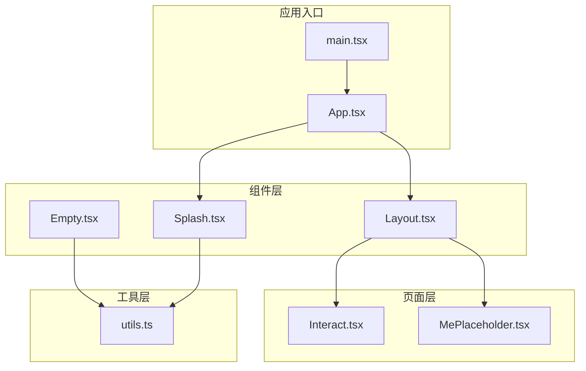

**图表来源**
- [main.tsx:1-11](file://src/main.tsx#L1-L11)
- [App.tsx:1-52](file://src/App.tsx#L1-L52)
- [Empty.tsx:1-9](file://src/components/Empty.tsx#L1-L9)
- [Splash.tsx:1-171](file://src/components/Splash.tsx#L1-L171)

**章节来源**
- [main.tsx:1-11](file://src/main.tsx#L1-L11)
- [App.tsx:1-52](file://src/App.tsx#L1-L52)

## 核心组件

### Empty空状态组件

Empty组件是一个极简的占位符组件，当前实现非常基础，主要用于演示目的。它提供了统一的样式类名接口，便于在不同场景下保持视觉一致性。

### Splash启动页组件

Splash组件实现了完整的启动页功能，包括：
- 品牌展示区域
- 手机号登录表单
- 验证码发送机制
- 游客浏览选项
- 流畅的动画过渡效果

**章节来源**
- [Empty.tsx:1-9](file://src/components/Empty.tsx#L1-L9)
- [Splash.tsx:1-171](file://src/components/Splash.tsx#L1-L171)

## 架构概览

应用的整体架构采用了分层设计模式，确保组件间的职责分离和可维护性：

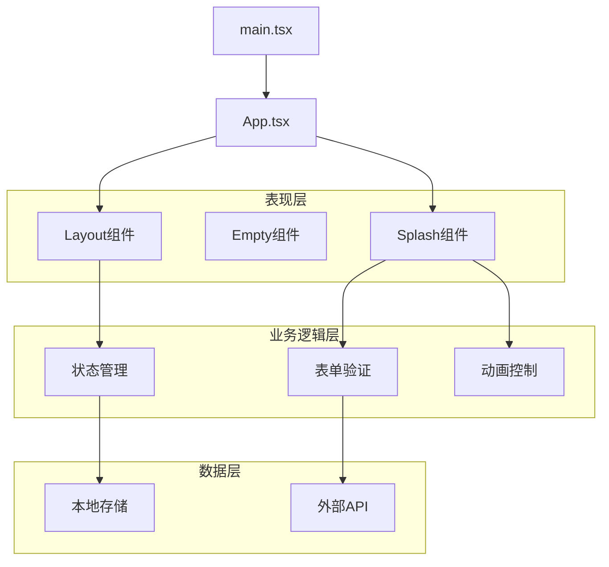

**图表来源**
- [App.tsx:19-28](file://src/App.tsx#L19-L28)
- [Splash.tsx:9-45](file://src/components/Splash.tsx#L9-L45)

## 详细组件分析

### Empty组件深度分析

#### 设计理念
Empty组件体现了"最小可用性"的设计原则，通过最少的代码实现最大的复用价值。当前实现虽然简单，但为未来的扩展预留了充足的空间。

#### 当前实现特点
- **极简设计**：仅包含基本的容器结构
- **样式复用**：使用统一的样式工具函数
- **占位符功能**：提供明确的内容缺失指示

#### 可扩展性设计
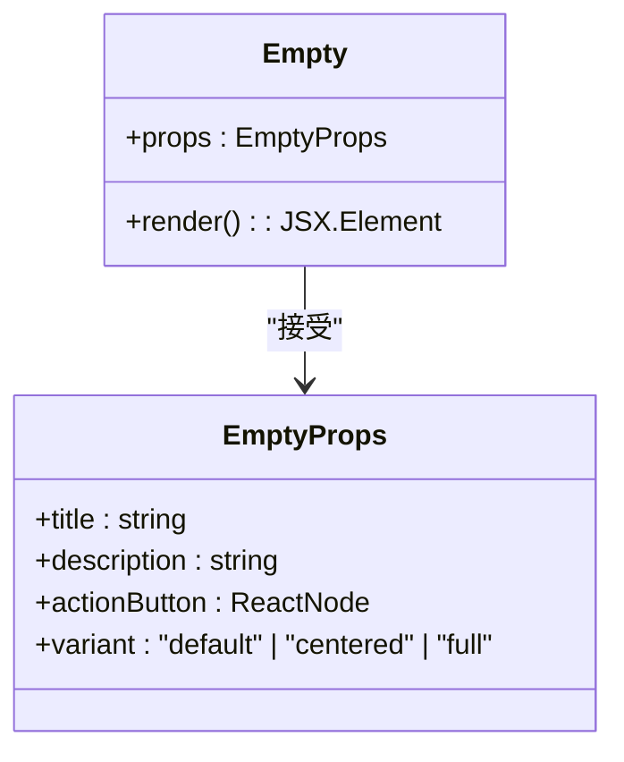

**图表来源**
- [Empty.tsx:4-7](file://src/components/Empty.tsx#L4-L7)

#### 使用场景建议
- 列表为空时的占位显示
- 加载状态的占位符
- 错误状态的友好提示
- 功能开发中的占位组件

**章节来源**
- [Empty.tsx:1-9](file://src/components/Empty.tsx#L1-L9)

### Splash启动页组件深度分析

#### 组件架构设计

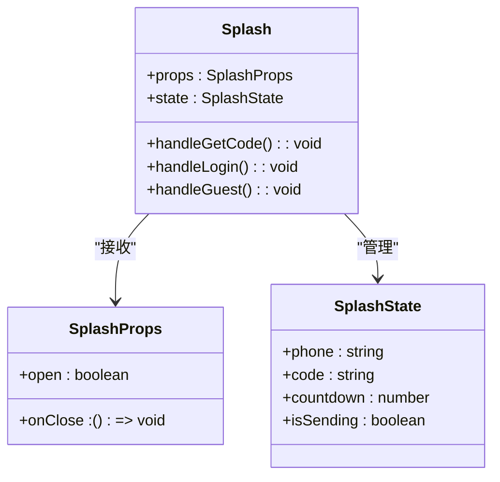

**图表来源**
- [Splash.tsx:4-7](file://src/components/Splash.tsx#L4-L7)
- [Splash.tsx:9-14](file://src/components/Splash.tsx#L9-L14)

#### 核心功能实现

##### 表单验证机制
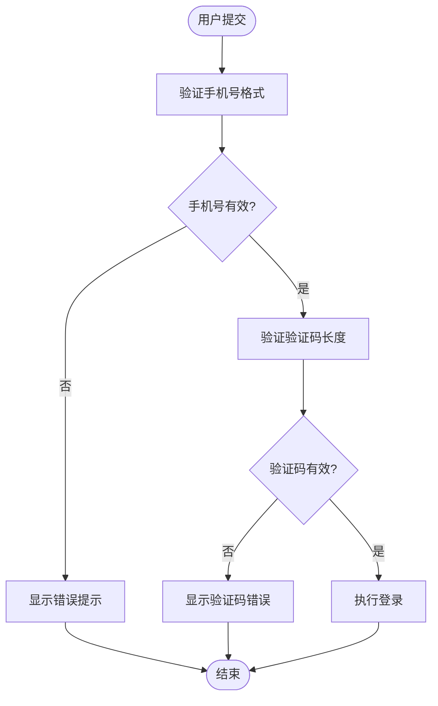

**图表来源**
- [Splash.tsx:34-45](file://src/components/Splash.tsx#L34-L45)

##### 验证码倒计时系统
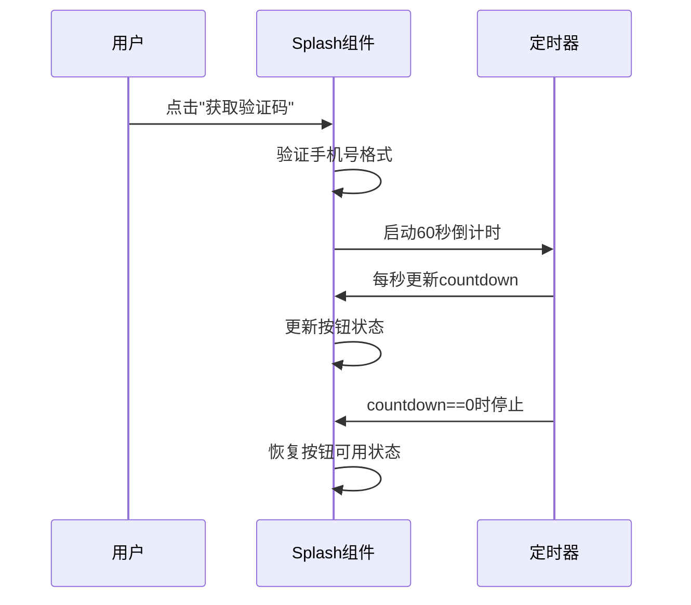

**图表来源**
- [Splash.tsx:15-32](file://src/components/Splash.tsx#L15-L32)

#### 动画系统设计

Splash组件使用Framer Motion实现了多层次的动画效果：

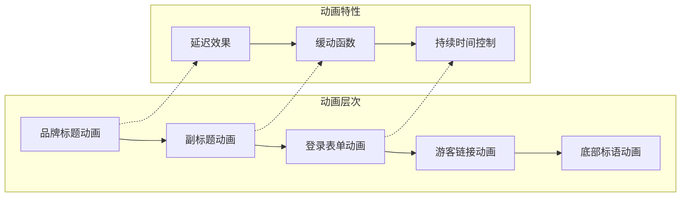

**图表来源**
- [Splash.tsx:65-81](file://src/components/Splash.tsx#L65-L81)
- [Splash.tsx:139-152](file://src/components/Splash.tsx#L139-L152)

#### 状态管理模式

组件采用React Hooks实现了完整的状态管理：

| 状态变量 | 类型 | 用途 | 默认值 |
|---------|------|------|--------|
| phone | string | 用户手机号 | "" |
| code | string | 验证码 | "" |
| countdown | number | 倒计时秒数 | 0 |
| isSending | boolean | 发送状态 | false |

**章节来源**
- [Splash.tsx:1-171](file://src/components/Splash.tsx#L1-L171)

### Layout组件集成分析

Layout组件为整个应用提供了导航框架，与Splash组件形成了完整的应用启动流程：

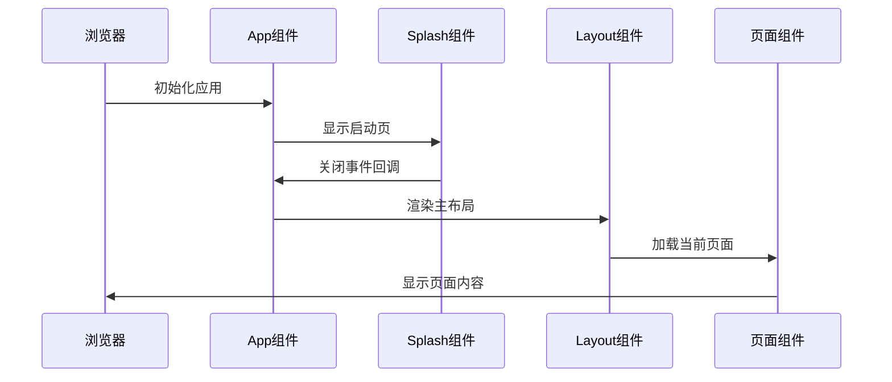

**图表来源**
- [App.tsx:19-28](file://src/App.tsx#L19-L28)
- [Layout.tsx:19-66](file://src/components/Layout.tsx#L19-L66)

**章节来源**
- [Layout.tsx:1-66](file://src/components/Layout.tsx#L1-L66)

## 依赖关系分析

### 组件间依赖关系

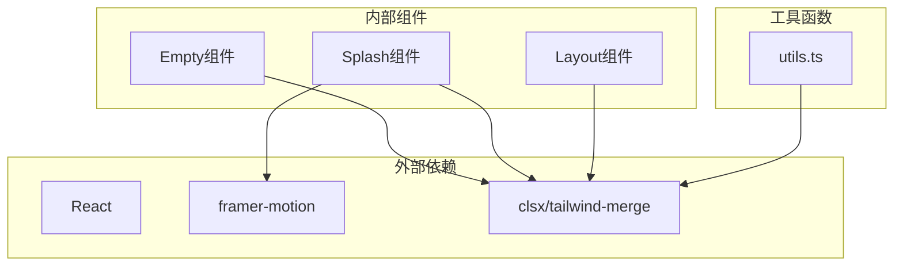

**图表来源**
- [Empty.tsx:1](file://src/components/Empty.tsx#L1)
- [Splash.tsx:1-2](file://src/components/Splash.tsx#L1-L2)
- [utils.ts:1-2](file://src/lib/utils.ts#L1-L2)

### 样式系统依赖

项目采用了Tailwind CSS的组合模式，通过自定义的`cn`函数实现样式的动态组合：

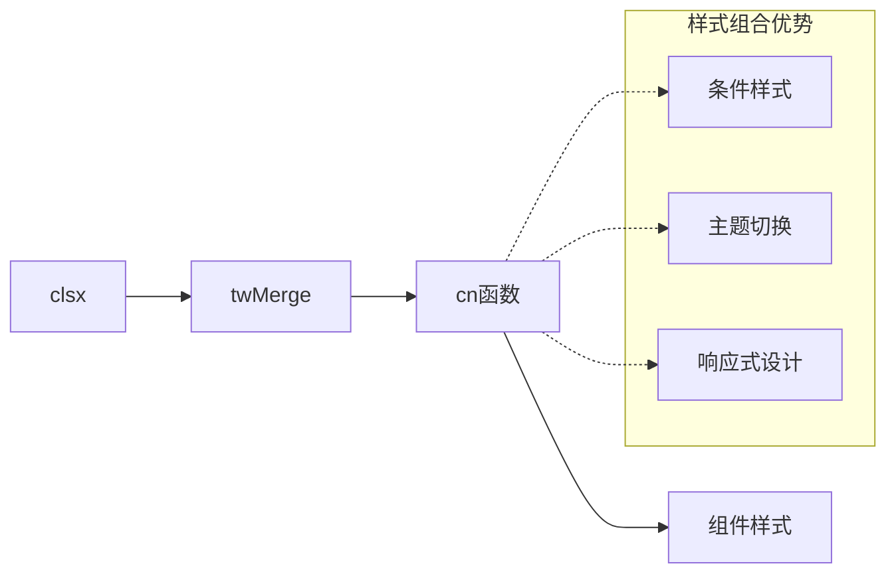

**图表来源**
- [utils.ts:4-6](file://src/lib/utils.ts#L4-L6)
- [Layout.tsx:6-8](file://src/components/Layout.tsx#L6-L8)

**章节来源**
- [utils.ts:1-7](file://src/lib/utils.ts#L1-L7)

## 性能考虑

### Empty组件性能优化

- **轻量级渲染**：组件结构简单，渲染开销极小
- **无副作用**：不依赖外部状态，避免不必要的重渲染
- **样式复用**：通过工具函数减少重复样式代码

### Splash组件性能优化策略

#### 动画性能优化
- **硬件加速**：使用transform和opacity属性触发GPU加速
- **动画缓存**：合理设置动画持续时间和缓动函数
- **条件渲染**：仅在需要时渲染复杂的动画元素

#### 状态管理优化
- **局部状态**：将相关状态合并到单一状态对象中
- **防抖处理**：对频繁的状态更新进行节流
- **内存泄漏防护**：及时清理定时器和事件监听器

#### 内存管理
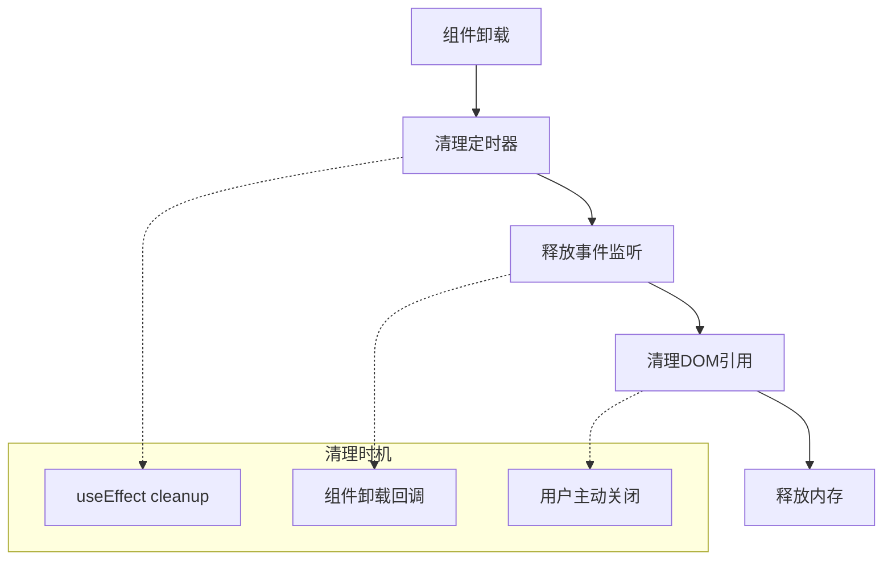

**图表来源**
- [Splash.tsx:22-31](file://src/components/Splash.tsx#L22-L31)

## 故障排除指南

### Empty组件常见问题

#### 问题：样式不生效
**可能原因**：
- 样式工具函数未正确导入
- Tailwind CSS配置问题

**解决方案**：
- 确认utils.ts文件正确导出cn函数
- 检查Tailwind配置文件中的content路径

#### 问题：组件显示异常
**可能原因**：
- 容器高度设置不当
- 样式冲突

**解决方案**：
- 确保父容器提供足够的高度
- 检查是否有全局样式覆盖

### Splash组件常见问题

#### 问题：动画不流畅
**可能原因**：
- 动画属性选择不当
- 性能监控不足

**解决方案**：
- 优先使用transform和opacity属性
- 使用浏览器开发者工具监控FPS

#### 问题：倒计时异常
**可能原因**：
- 定时器清理不彻底
- 状态更新时机问题

**解决方案**：
- 在组件卸载时清理所有定时器
- 使用useEffect的cleanup函数

#### 问题：表单验证失效
**可能原因**：
- 输入过滤逻辑错误
- 状态更新顺序问题

**解决方案**：
- 检查正则表达式匹配逻辑
- 确保状态更新的原子性

**章节来源**
- [Splash.tsx:15-45](file://src/components/Splash.tsx#L15-L45)

## 结论

本文档深入分析了Empty空状态组件和Splash启动页组件的设计实现。两个组件虽然功能相对简单，但在实际应用中发挥着重要作用。

**Empty组件**展现了"少即是多"的设计哲学，通过极简的实现提供了良好的可扩展性基础。

**Splash组件**展示了现代React应用中组件设计的最佳实践，包括：
- 清晰的职责分离
- 完善的状态管理
- 流畅的用户体验
- 良好的性能优化

这两个组件为项目的UI组件库奠定了坚实的基础，为后续的功能扩展和维护提供了清晰的指导原则。