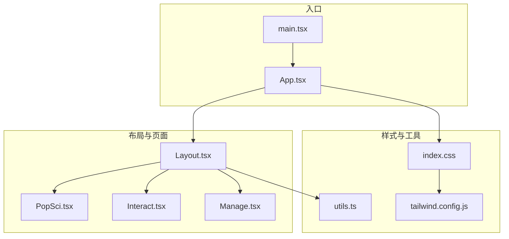
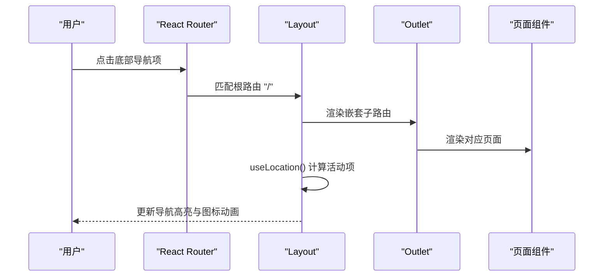
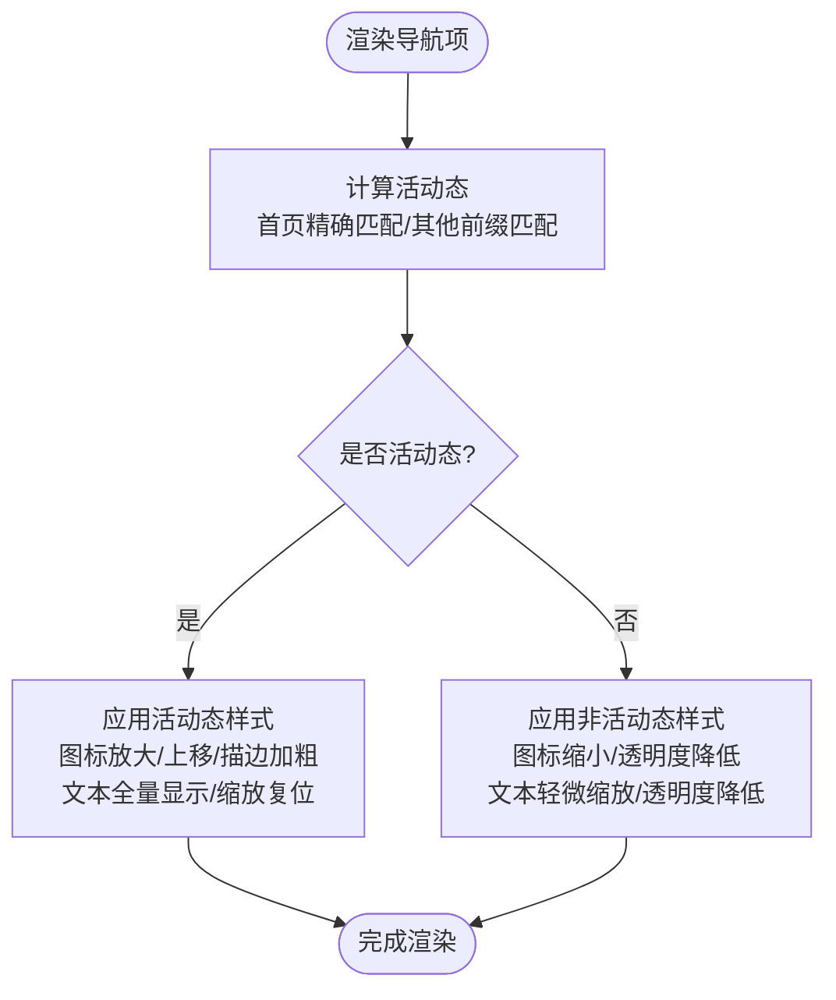
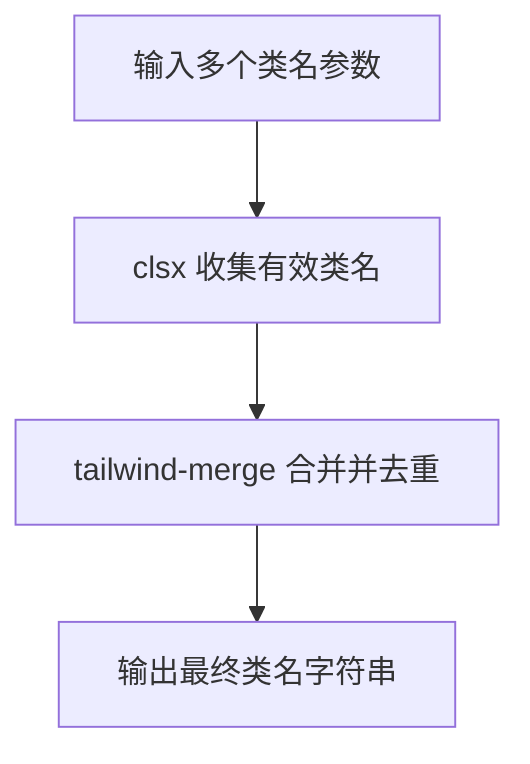
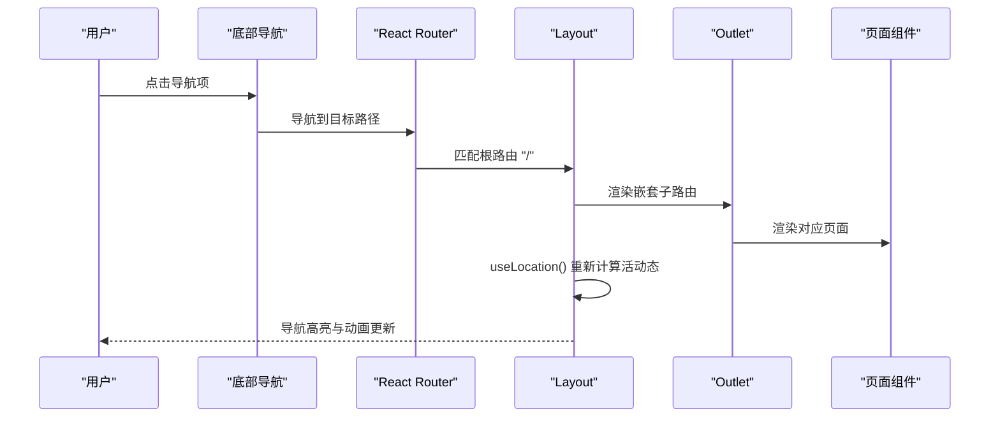
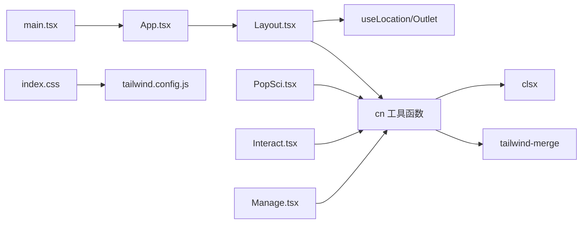

# 布局组件

<cite>
**本文引用的文件**
- [Layout.tsx](file://src/components/Layout.tsx)
- [utils.ts](file://src/lib/utils.ts)
- [App.tsx](file://src/App.tsx)
- [main.tsx](file://src/main.tsx)
- [index.css](file://src/index.css)
- [tailwind.config.js](file://tailwind.config.js)
- [package.json](file://package.json)
- [PopSci.tsx](file://src/pages/PopSci.tsx)
- [Interact.tsx](file://src/pages/Interact.tsx)
- [Manage.tsx](file://src/pages/Manage.tsx)
</cite>

## 目录
1. [简介](#简介)
2. [项目结构](#项目结构)
3. [核心组件](#核心组件)
4. [架构总览](#架构总览)
5. [详细组件分析](#详细组件分析)
6. [依赖关系分析](#依赖关系分析)
7. [性能考量](#性能考量)
8. [故障排查指南](#故障排查指南)
9. [结论](#结论)
10. [附录](#附录)

## 简介
本文件系统性解析移动端布局组件的设计与实现，重点覆盖：
- 底部导航栏的实现原理：导航项配置、活动状态判断逻辑、图标动画效果与响应式设计
- cn 工具函数的类名合并机制：基于 clsx 与 tailwind-merge 的高效样式管理
- 组件 Props 接口、状态管理、路由集成与用户体验设计
- 导航栏定制化方案、样式扩展方法与性能优化技巧
- 具体的代码示例路径与最佳实践，帮助开发者理解移动端布局组件的设计模式与扩展方式

## 项目结构
该项目采用前端单页应用（SPA）架构，使用 React + React Router DOM 实现路由嵌套与页面切换；Tailwind CSS 提供原子化样式，配合自定义主题变量与安全区域适配，确保移动端一致体验。

图表来源
- [main.tsx:1-11](file://src/main.tsx#L1-L11)
- [App.tsx:19-51](file://src/App.tsx#L19-L51)
- [Layout.tsx:19-65](file://src/components/Layout.tsx#L19-L65)
- [utils.ts:1-7](file://src/lib/utils.ts#L1-L7)
- [index.css:1-61](file://src/index.css#L1-L61)
- [tailwind.config.js:1-16](file://tailwind.config.js#L1-L16)

章节来源
- [main.tsx:1-11](file://src/main.tsx#L1-L11)
- [App.tsx:19-51](file://src/App.tsx#L19-L51)
- [Layout.tsx:19-65](file://src/components/Layout.tsx#L19-L65)
- [utils.ts:1-7](file://src/lib/utils.ts#L1-L7)
- [index.css:1-61](file://src/index.css#L1-L61)
- [tailwind.config.js:1-16](file://tailwind.config.js#L1-L16)

## 核心组件
- 布局容器 Layout：负责主内容区与底部导航栏的整体布局，使用 Outlet 渲染嵌套路由页面，并通过 useLocation 判断活动导航项。
- cn 工具函数：统一的类名合并器，结合 clsx 与 tailwind-merge，保证 Tailwind 冲突类被正确覆盖，提升样式管理效率。
- 应用入口 App：配置路由嵌套，将 Layout 作为根路由元素，内部注册各业务页面路由。

章节来源
- [Layout.tsx:19-65](file://src/components/Layout.tsx#L19-L65)
- [utils.ts:4-6](file://src/lib/utils.ts#L4-L6)
- [App.tsx:29-47](file://src/App.tsx#L29-L47)

## 架构总览
整体架构围绕“布局容器 + 路由嵌套 + 页面组件”的模式展开，底部导航栏作为全局 UI 元素贯穿所有页面，通过链接跳转与活动态样式联动，形成统一的移动端导航体验。

图表来源
- [Layout.tsx:19-65](file://src/components/Layout.tsx#L19-L65)
- [App.tsx:29-47](file://src/App.tsx#L29-L47)

## 详细组件分析

### 底部导航栏实现原理
- 导航项配置：通过常量数组集中维护导航项，包含路径、标签与图标组件，便于统一扩展与维护。
- 活动状态判断：首页特殊处理（精确匹配），其他页面采用前缀匹配以支持子路由激活态。
- 图标动画效果：活动态下图标缩放、上移与描边加粗，配合背景圆点扩散，增强视觉反馈。
- 文本与图标透明度/缩放：活动态文本全量显示，非活动态轻微缩放与透明度降低，保持层次感。
- 响应式设计：固定高度、居中对齐、安全区域适配（底部内边距），适配刘海屏与安全区域。

图表来源
- [Layout.tsx:30-62](file://src/components/Layout.tsx#L30-L62)

章节来源
- [Layout.tsx:10-17](file://src/components/Layout.tsx#L10-L17)
- [Layout.tsx:30-62](file://src/components/Layout.tsx#L30-L62)

### cn 工具函数与样式管理
- 类名合并机制：基于 clsx 收集条件类名，随后通过 tailwind-merge 合并，自动处理冲突类（如颜色、尺寸、边框等），避免重复与覆盖错误。
- 在组件中的应用：导航项、按钮、卡片等多处使用 cn，统一风格并减少重复代码。
- 性能优势：相比手动拼接字符串，cn 可在运行时按需组合，减少模板字符串拼接成本，同时 tailwind-merge 保证最终类名最小化。

图表来源
- [utils.ts:4-6](file://src/lib/utils.ts#L4-L6)
- [Layout.tsx:6-8](file://src/components/Layout.tsx#L6-L8)

章节来源
- [utils.ts:1-7](file://src/lib/utils.ts#L1-L7)
- [Layout.tsx:6-8](file://src/components/Layout.tsx#L6-L8)

### Props 接口与状态管理
- Layout 组件无外部 Props，内部通过 useLocation 获取当前路径，驱动导航项活动态判断。
- 页面组件通过 cn 导入 Layout 的 cn 工具函数，实现跨组件样式一致性。
- 状态管理：导航栏本身不维护状态，但页面组件可自行管理自身状态（例如 PopSci 的标签页、Interact 的聊天消息与 OCR 流程、Manage 的签到与提醒列表）。

章节来源
- [Layout.tsx:19-20](file://src/components/Layout.tsx#L19-L20)
- [PopSci.tsx:5](file://src/pages/PopSci.tsx#L5)
- [Interact.tsx:7](file://src/pages/Interact.tsx#L7)
- [Manage.tsx:10](file://src/pages/Manage.tsx#L10)

### 路由集成与用户体验设计
- 路由嵌套：App 中将 Layout 作为根路由元素，内部注册多个子路由，实现“布局容器 + 子页面”的组合。
- 页面切换：点击底部导航项触发 Link 跳转，页面内容通过 Outlet 动态渲染，保持布局不变。
- 用户体验：导航项具备焦点环、悬停与活动态颜色对比，图标与文本具备平滑过渡动画，提升交互反馈。

图表来源
- [App.tsx:29-47](file://src/App.tsx#L29-L47)
- [Layout.tsx:19-65](file://src/components/Layout.tsx#L19-L65)

章节来源
- [App.tsx:29-47](file://src/App.tsx#L29-L47)
- [Layout.tsx:19-65](file://src/components/Layout.tsx#L19-L65)

### 导航栏定制化方案与样式扩展
- 新增导航项：在导航项数组中添加对象，包含 path、label、icon 字段，即可自动渲染并参与活动态判断。
- 自定义样式：通过 cn 动态传入 Tailwind 类，结合主题变量与安全区域类，实现统一风格。
- 动画扩展：可在活动态条件下增加更多过渡属性（如阴影、旋转等），注意控制动画时长与缓动曲线，避免影响滚动性能。
- 响应式适配：利用 pb-safe 类与固定高度，确保在不同设备与系统状态栏下表现一致。

章节来源
- [Layout.tsx:10-17](file://src/components/Layout.tsx#L10-L17)
- [Layout.tsx:30-62](file://src/components/Layout.tsx#L30-L62)
- [index.css:37-44](file://src/index.css#L37-L44)

### 代码示例与最佳实践
- 使用 cn 合并类名：在导航项、按钮、卡片等组件中统一使用 cn，减少重复与冲突。
- 活动态判断：首页精确匹配，其他页面前缀匹配，确保子路由也能正确高亮。
- 动画与过渡：合理设置过渡时长与缓动，避免过度动画影响性能。
- 主题变量：通过 CSS 变量统一管理品牌色与辅助色，便于全局调整。
- 安全区域：使用 pb-safe 类适配刘海屏底部安全区域。

章节来源
- [utils.ts:4-6](file://src/lib/utils.ts#L4-L6)
- [Layout.tsx:30-62](file://src/components/Layout.tsx#L30-L62)
- [index.css:37-44](file://src/index.css#L37-L44)

## 依赖关系分析
- 组件间依赖：Layout 依赖 React Router 的 useLocation 与 Outlet；cn 依赖 clsx 与 tailwind-merge；页面组件通过 cn 导入 Layout 的 cn 工具函数。
- 样式依赖：index.css 引入 Tailwind 基础层与工具层，tailwind.config.js 配置内容扫描路径与插件。
- 外部依赖：React、React Router DOM、Lucide React、clsx、tailwind-merge、Framer Motion 等。

图表来源
- [Layout.tsx:1-8](file://src/components/Layout.tsx#L1-L8)
- [utils.ts:1-6](file://src/lib/utils.ts#L1-L6)
- [PopSci.tsx:5](file://src/pages/PopSci.tsx#L5)
- [Interact.tsx:7](file://src/pages/Interact.tsx#L7)
- [Manage.tsx:10](file://src/pages/Manage.tsx#L10)
- [App.tsx:19-51](file://src/App.tsx#L19-L51)
- [main.tsx:1-11](file://src/main.tsx#L1-L11)
- [index.css:1-61](file://src/index.css#L1-L61)
- [tailwind.config.js:1-16](file://tailwind.config.js#L1-L16)

章节来源
- [package.json:13-25](file://package.json#L13-L25)
- [Layout.tsx:1-8](file://src/components/Layout.tsx#L1-L8)
- [utils.ts:1-6](file://src/lib/utils.ts#L1-L6)
- [PopSci.tsx:5](file://src/pages/PopSci.tsx#L5)
- [Interact.tsx:7](file://src/pages/Interact.tsx#L7)
- [Manage.tsx:10](file://src/pages/Manage.tsx#L10)
- [App.tsx:19-51](file://src/App.tsx#L19-L51)
- [main.tsx:1-11](file://src/main.tsx#L1-L11)
- [index.css:1-61](file://src/index.css#L1-L61)
- [tailwind.config.js:1-16](file://tailwind.config.js#L1-L16)

## 性能考量
- 样式合并：使用 cn 与 tailwind-merge 减少冗余类名，避免重复覆盖导致的样式抖动。
- 动画控制：活动态动画时长与缓动需适度，避免在低端设备上造成卡顿。
- 滚动性能：页面内容区域使用溢出滚动，避免导航栏参与滚动计算。
- 资源加载：图标组件按需引入，减少首屏体积。
- 路由切换：嵌套路由切换仅更新内容区，保持布局稳定，降低重排成本。

## 故障排查指南
- 导航项不激活：检查路径匹配规则，首页使用精确匹配，其他页面使用前缀匹配。
- 样式冲突：确认是否正确使用 cn，避免直接拼接字符串类名导致冲突。
- 安全区域异常：检查 pb-safe 类是否正确应用，以及设备系统状态栏遮挡情况。
- 动画卡顿：适当缩短过渡时长或减少动画属性数量，优先保留关键视觉反馈。

## 结论
该布局组件通过简洁的导航配置与统一的样式合并机制，实现了移动端一致且富有反馈的导航体验。结合路由嵌套与原子化样式，既保证了可维护性，又兼顾了性能与可扩展性。开发者可在此基础上灵活定制导航项、扩展动画效果，并通过 cn 工具函数实现跨组件的样式一致性。

## 附录
- 主题变量与安全区域：通过 CSS 变量与 pb-safe 类统一管理品牌色与安全区域适配。
- 路由嵌套：根路由包裹 Layout，子路由在 Layout 内部渲染，实现布局与页面的解耦。
- 动画与过渡：活动态图标与文本具备平滑过渡，提升交互感知。

章节来源
- [index.css:7-44](file://src/index.css#L7-L44)
- [App.tsx:29-47](file://src/App.tsx#L29-L47)
- [Layout.tsx:30-62](file://src/components/Layout.tsx#L30-L62)