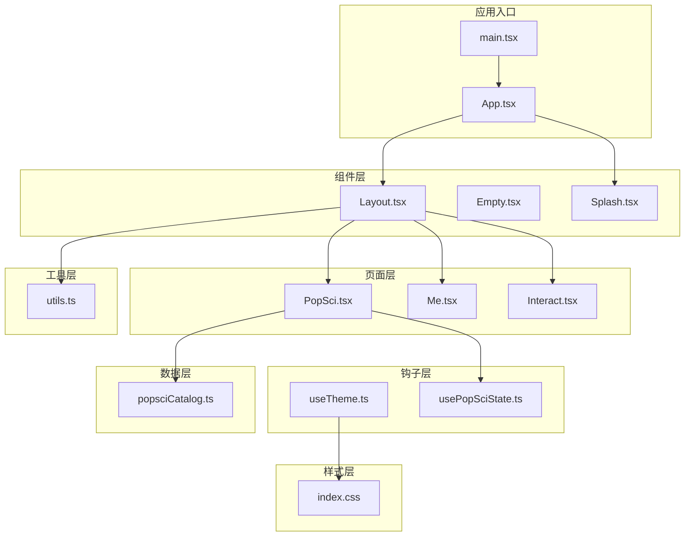
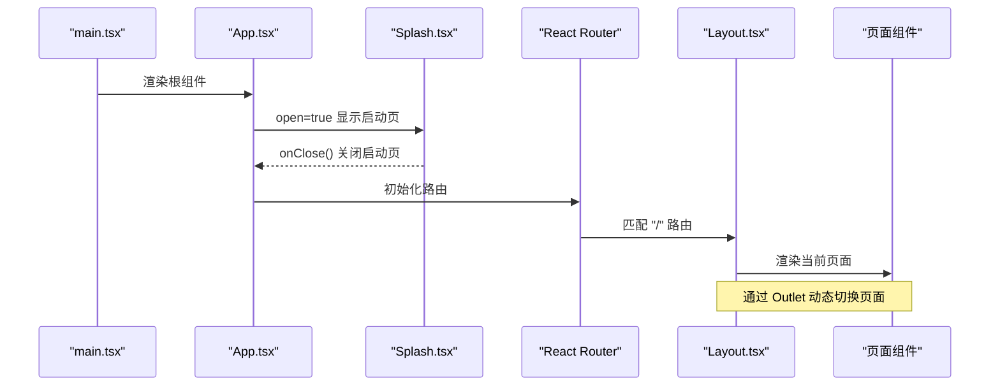
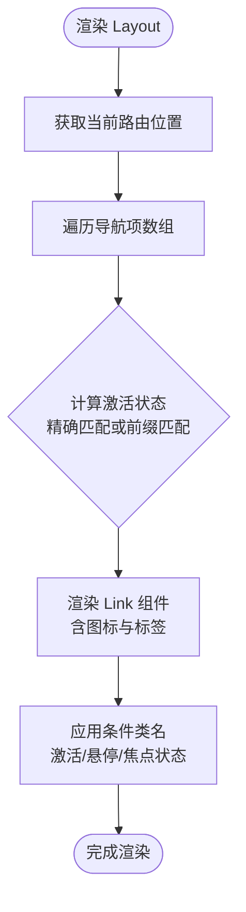
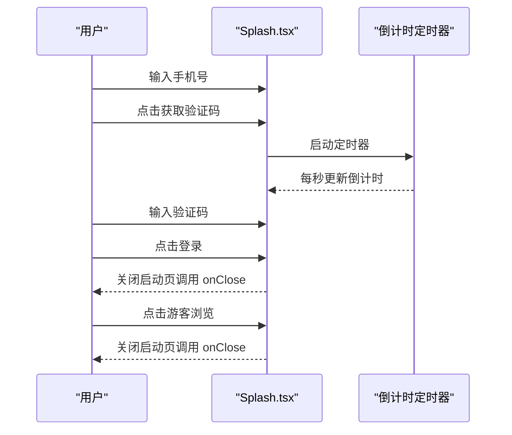
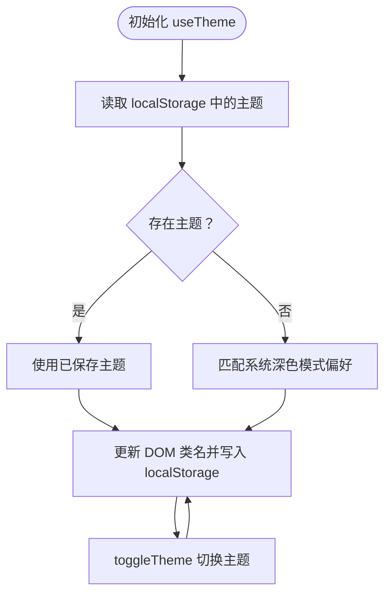
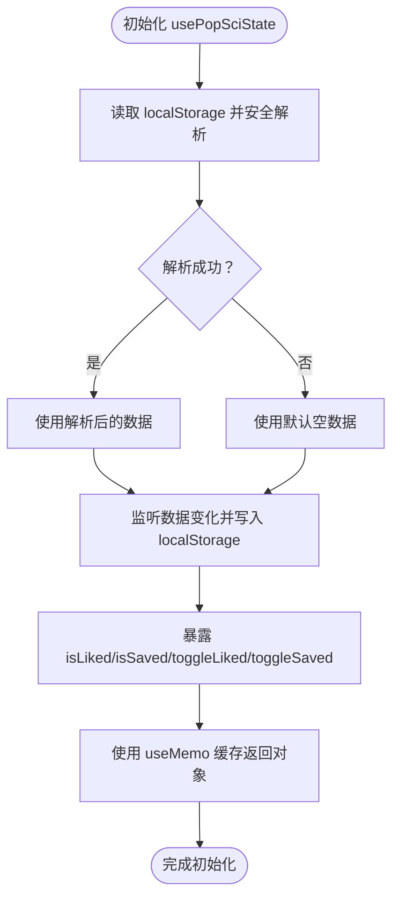
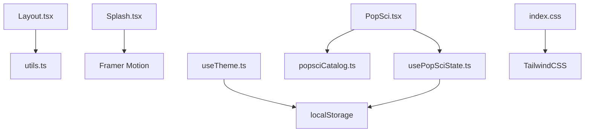

# 核心组件系统

<cite>
**本文档引用的文件**
- [Layout.tsx](file://src/components/Layout.tsx)
- [Empty.tsx](file://src/components/Empty.tsx)
- [Splash.tsx](file://src/components/Splash.tsx)
- [useTheme.ts](file://src/hooks/useTheme.ts)
- [usePopSciState.ts](file://src/hooks/usePopSciState.ts)
- [utils.ts](file://src/lib/utils.ts)
- [popsciCatalog.ts](file://src/data/popsciCatalog.ts)
- [App.tsx](file://src/App.tsx)
- [main.tsx](file://src/main.tsx)
- [PopSci.tsx](file://src/pages/PopSci.tsx)
- [Me.tsx](file://src/pages/Me.tsx)
- [Interact.tsx](file://src/pages/Interact.tsx)
- [index.css](file://src/index.css)
- [package.json](file://package.json)
</cite>

## 目录
1. [简介](#简介)
2. [项目结构](#项目结构)
3. [核心组件](#核心组件)
4. [架构总览](#架构总览)
5. [详细组件分析](#详细组件分析)
6. [依赖关系分析](#依赖关系分析)
7. [性能考量](#性能考量)
8. [故障排除指南](#故障排除指南)
9. [结论](#结论)
10. [附录](#附录)

## 简介
本项目是一个移动端优先的健康科普与互动应用，采用 React + Vite 技术栈，结合 TailwindCSS、Framer Motion 和 Lucide React 实现现代化的 UI 设计与流畅的动画体验。核心组件系统围绕三大共享组件展开：Layout 布局组件、Empty 空状态组件、Splash 启动页组件；同时配套两个自定义 Hook：useTheme 主题管理与 usePopSciState 内容状态管理。本文档将深入解析这些组件的设计思想、实现原理、Props 接口、状态管理机制、事件处理模式与生命周期管理，并提供组件复用最佳实践、性能优化技巧与可访问性设计考虑。

## 项目结构
项目采用按功能分层的组织方式：
- 组件层：共享 UI 组件（Layout、Empty、Splash）
- 钩子层：自定义 Hook（useTheme、usePopSciState）
- 页面层：业务页面（PopSci、Me、Interact 等）
- 数据层：类型定义与数据目录（popsciCatalog 等）
- 工具层：通用工具函数（cn 合并类名）
- 样式层：全局样式与主题变量
- 应用入口：App、main

图表来源
- [main.tsx:1-11](file://src/main.tsx#L1-L11)
- [App.tsx:19-51](file://src/App.tsx#L19-L51)
- [Layout.tsx:19-65](file://src/components/Layout.tsx#L19-L65)
- [Splash.tsx:9-169](file://src/components/Splash.tsx#L9-L169)
- [PopSci.tsx:26-269](file://src/pages/PopSci.tsx#L26-L269)
- [Me.tsx:4-64](file://src/pages/Me.tsx#L4-L64)
- [Interact.tsx:37-461](file://src/pages/Interact.tsx#L37-L461)
- [usePopSciState.ts:30-79](file://src/hooks/usePopSciState.ts#L30-L79)
- [useTheme.ts:5-29](file://src/hooks/useTheme.ts#L5-L29)
- [utils.ts:4-6](file://src/lib/utils.ts#L4-L6)
- [index.css:7-44](file://src/index.css#L7-L44)

章节来源
- [main.tsx:1-11](file://src/main.tsx#L1-L11)
- [App.tsx:19-51](file://src/App.tsx#L19-L51)
- [Layout.tsx:19-65](file://src/components/Layout.tsx#L19-L65)
- [Splash.tsx:9-169](file://src/components/Splash.tsx#L9-L169)
- [PopSci.tsx:26-269](file://src/pages/PopSci.tsx#L26-L269)
- [Me.tsx:4-64](file://src/pages/Me.tsx#L4-L64)
- [Interact.tsx:37-461](file://src/pages/Interact.tsx#L37-L461)
- [usePopSciState.ts:30-79](file://src/hooks/usePopSciState.ts#L30-L79)
- [useTheme.ts:5-29](file://src/hooks/useTheme.ts#L5-L29)
- [utils.ts:4-6](file://src/lib/utils.ts#L4-L6)
- [index.css:7-44](file://src/index.css#L7-L44)

## 核心组件
本节概述三大共享组件的功能定位与交互特性：
- Layout 布局组件：提供移动端底部导航栏、主内容区域 Outlet 插槽，统一页面容器与导航行为。
- Empty 空状态组件：提供简洁的空状态占位，便于在不同页面中复用一致的视觉与交互。
- Splash 启动页组件：负责首次进入应用时的登录/游客浏览流程，包含手机号输入、验证码倒计时、登录与游客浏览按钮。

章节来源
- [Layout.tsx:19-65](file://src/components/Layout.tsx#L19-L65)
- [Empty.tsx:4-8](file://src/components/Empty.tsx#L4-L8)
- [Splash.tsx:9-169](file://src/components/Splash.tsx#L9-L169)

## 架构总览
应用采用路由嵌套 + 组件组合的架构模式：
- App 作为根组件，负责控制 Splash 的显示与隐藏，并在 Layout 下挂载多个页面路由。
- Layout 作为页面骨架，内部包含主内容区与底部导航，通过 Outlet 渲染当前路由页面。
- 页面组件通过自定义 Hook 获取状态与数据，实现业务逻辑与 UI 的解耦。

图表来源
- [main.tsx:6-10](file://src/main.tsx#L6-L10)
- [App.tsx:19-51](file://src/App.tsx#L19-L51)
- [Splash.tsx:9-169](file://src/components/Splash.tsx#L9-L169)
- [Layout.tsx:22-27](file://src/components/Layout.tsx#L22-L27)

章节来源
- [main.tsx:6-10](file://src/main.tsx#L6-L10)
- [App.tsx:19-51](file://src/App.tsx#L19-L51)
- [Layout.tsx:22-27](file://src/components/Layout.tsx#L22-L27)

## 详细组件分析

### Layout 布局组件
- 导航设计：定义导航项数组，基于路径匹配判断激活状态，使用 Link 组件实现无刷新跳转，支持前缀匹配（如 /manage/xxx）。
- 样式合并：通过 cn 工具函数合并条件类名，实现图标与文本的动态高亮与缩放效果。
- 响应式布局：限定最大宽度、居中容器与安全区域适配，确保在移动端的良好体验。

图表来源
- [Layout.tsx:10-17](file://src/components/Layout.tsx#L10-L17)
- [Layout.tsx:31-61](file://src/components/Layout.tsx#L31-L61)
- [utils.ts:4-6](file://src/lib/utils.ts#L4-L6)

章节来源
- [Layout.tsx:10-17](file://src/components/Layout.tsx#L10-L17)
- [Layout.tsx:31-61](file://src/components/Layout.tsx#L31-L61)
- [utils.ts:4-6](file://src/lib/utils.ts#L4-L6)

### Empty 空状态组件
- 设计目标：提供统一的空状态占位，便于在不同页面中复用一致的视觉与交互。
- 使用建议：在数据为空时渲染 Empty 组件，避免空白页面带来的困惑。

章节来源
- [Empty.tsx:4-8](file://src/components/Empty.tsx#L4-L8)

### Splash 启动页组件
- Props 接口：open（是否显示）、onClose（关闭回调）。
- 加载策略：使用 Framer Motion 实现淡入淡出动画；包含手机号输入、验证码倒计时、登录与游客浏览功能。
- 事件处理：表单校验、倒计时定时器、登录成功回调。
- 可访问性：为交互元素添加 aria-label 与 aria-hidden 属性，确保屏幕阅读器友好。

图表来源
- [Splash.tsx:9-169](file://src/components/Splash.tsx#L9-L169)

章节来源
- [Splash.tsx:9-169](file://src/components/Splash.tsx#L9-L169)

### 自定义 Hook：useTheme 主题管理
- 状态管理：维护 light/dark 两种主题，优先读取 localStorage，否则根据系统偏好自动选择。
- 生命周期：通过 useEffect 在主题变更时更新 documentElement 类名与持久化存储。
- 返回值：包含 theme、toggleTheme、isDark 三个字段，便于在组件中直接消费。

图表来源
- [useTheme.ts:5-29](file://src/hooks/useTheme.ts#L5-L29)

章节来源
- [useTheme.ts:5-29](file://src/hooks/useTheme.ts#L5-L29)

### 自定义 Hook：usePopSciState 状态管理
- 数据结构：以键值对形式存储 liked/saved 状态，键由类型与 ID 组合而成，确保唯一性。
- 持久化：通过 localStorage 实现跨会话状态保持，提供安全解析与默认值处理。
- API 设计：暴露 isLiked/isSaved/toggleLiked/toggleSaved 等方法，配合 useMemo 缓存返回对象，避免不必要的重渲染。

图表来源
- [usePopSciState.ts:30-79](file://src/hooks/usePopSciState.ts#L30-L79)

章节来源
- [usePopSciState.ts:30-79](file://src/hooks/usePopSciState.ts#L30-L79)

### 页面组件与组件复用
- PopSci 页面：使用 usePopSciState 管理点赞与收藏状态，通过 cn 工具函数合并类名，实现统一的交互样式。
- Me 页面：展示用户菜单项，使用 cn 工具函数与图标组件实现一致的视觉风格。
- Interact 页面：集成聊天、OCR 图片识别与推荐内容，演示自定义 Hook 与外部库的协同使用。

章节来源
- [PopSci.tsx:26-269](file://src/pages/PopSci.tsx#L26-L269)
- [Me.tsx:4-64](file://src/pages/Me.tsx#L4-L64)
- [Interact.tsx:37-461](file://src/pages/Interact.tsx#L37-L461)

## 依赖关系分析
- 组件依赖：Layout 依赖 utils.ts 的 cn 工具；Splash 依赖 Framer Motion；PopSci 依赖 usePopSciState 与 popsciCatalog。
- 钩子依赖：useTheme 依赖浏览器环境（localStorage、matchMedia）；usePopSciState 依赖 localStorage。
- 样式依赖：index.css 定义全局主题变量与字体，TailwindCSS 提供原子化样式。

图表来源
- [Layout.tsx:1-8](file://src/components/Layout.tsx#L1-L8)
- [Splash.tsx:1-2](file://src/components/Splash.tsx#L1-L2)
- [PopSci.tsx:1-7](file://src/pages/PopSci.tsx#L1-L7)
- [useTheme.ts:1-18](file://src/hooks/useTheme.ts#L1-L18)
- [usePopSciState.ts:1-38](file://src/hooks/usePopSciState.ts#L1-L38)
- [index.css:3-5](file://src/index.css#L3-L5)

章节来源
- [Layout.tsx:1-8](file://src/components/Layout.tsx#L1-L8)
- [Splash.tsx:1-2](file://src/components/Splash.tsx#L1-L2)
- [PopSci.tsx:1-7](file://src/pages/PopSci.tsx#L1-L7)
- [useTheme.ts:1-18](file://src/hooks/useTheme.ts#L1-L18)
- [usePopSciState.ts:1-38](file://src/hooks/usePopSciState.ts#L1-L38)
- [index.css:3-5](file://src/index.css#L3-L5)

## 性能考量
- 组件渲染优化
  - 使用 useCallback 缓存 usePopSciState 的 isLiked/isSaved/toggleLiked/toggleSaved 方法，减少子组件重渲染。
  - 使用 useMemo 缓存 usePopSciState 返回的对象，避免每次渲染都产生新对象。
  - 在 PopSci 页面中，使用 AnimatePresence 与 layoutId 实现过渡动画，提升交互流畅度。
- 状态持久化
  - usePopSciState 通过 localStorage 实现状态持久化，避免频繁网络请求。
  - App 中的 Splash 状态通过 useState 控制，仅在应用启动时短暂存在。
- 动画与交互
  - Splash 使用 Framer Motion 实现淡入淡出动画，提升首屏体验。
  - Layout 的导航项使用条件类名与过渡动画，增强用户反馈。
- 可访问性
  - 所有交互元素均提供 aria-label 或 aria-hidden 属性，确保屏幕阅读器可用。
  - 使用 outline-none 与 focus-visible:ring 确保键盘可达性。

章节来源
- [usePopSciState.ts:40-78](file://src/hooks/usePopSciState.ts#L40-L78)
- [PopSci.tsx:26-269](file://src/pages/PopSci.tsx#L26-L269)
- [Splash.tsx:9-169](file://src/components/Splash.tsx#L9-L169)
- [Layout.tsx:31-61](file://src/components/Layout.tsx#L31-L61)

## 故障排除指南
- 主题切换无效
  - 检查浏览器是否支持 localStorage 与 matchMedia。
  - 确认 documentElement 上的 light/dark 类名是否正确更新。
- 状态未持久化
  - 检查 localStorage 是否被禁用或存储空间不足。
  - 确认 JSON 解析逻辑是否抛出异常导致回退到默认值。
- 启动页无法关闭
  - 确认 onClose 回调是否正确传递至 App，并在调用后将 showSplash 设置为 false。
- 导航高亮异常
  - 检查路径匹配逻辑，确认精确匹配与前缀匹配的边界条件。
- 动画卡顿
  - 减少不必要的 reflow 与 repaint，避免在动画期间进行大量 DOM 操作。
  - 使用 transform 与 opacity 等硬件加速友好的属性。

章节来源
- [useTheme.ts:14-18](file://src/hooks/useTheme.ts#L14-L18)
- [usePopSciState.ts:13-24](file://src/hooks/usePopSciState.ts#L13-L24)
- [App.tsx:19-23](file://src/App.tsx#L19-L23)
- [Layout.tsx:32-33](file://src/components/Layout.tsx#L32-L33)
- [Splash.tsx:52-60](file://src/components/Splash.tsx#L52-L60)

## 结论
本核心组件系统通过 Layout、Empty、Splash 三大共享组件与 useTheme、usePopSciState 两个自定义 Hook，实现了统一的导航体验、空状态处理与状态持久化。组件间通过清晰的 Props 接口与事件回调协作，结合 TailwindCSS 与 Framer Motion 提供了良好的视觉与交互体验。通过 useCallback、useMemo 等优化手段，有效降低了重渲染成本。建议在扩展新功能时遵循现有模式，保持组件职责单一、状态管理集中、样式工具化，以确保系统的可维护性与可扩展性。

## 附录
- 代码示例路径
  - [Layout 导航渲染:31-61](file://src/components/Layout.tsx#L31-L61)
  - [Empty 组件定义:4-8](file://src/components/Empty.tsx#L4-L8)
  - [Splash Props 与事件处理:4-49](file://src/components/Splash.tsx#L4-L49)
  - [useTheme 初始化与切换:5-22](file://src/hooks/useTheme.ts#L5-L22)
  - [usePopSciState 状态管理:30-78](file://src/hooks/usePopSciState.ts#L30-L78)
  - [PopSci 页面状态消费:29-147](file://src/pages/PopSci.tsx#L29-L147)
  - [Me 页面菜单渲染:6-60](file://src/pages/Me.tsx#L6-L60)
  - [Interact 页面聊天与 OCR:37-261](file://src/pages/Interact.tsx#L37-L261)
- 使用场景
  - 在新页面中复用 Layout 作为容器骨架，通过 Outlet 渲染内容。
  - 在数据为空时使用 Empty 统一展示空状态。
  - 在应用启动时使用 Splash 进行登录或游客浏览引导。
  - 在需要主题切换的组件中使用 useTheme。
  - 在需要点赞/收藏状态的组件中使用 usePopSciState。