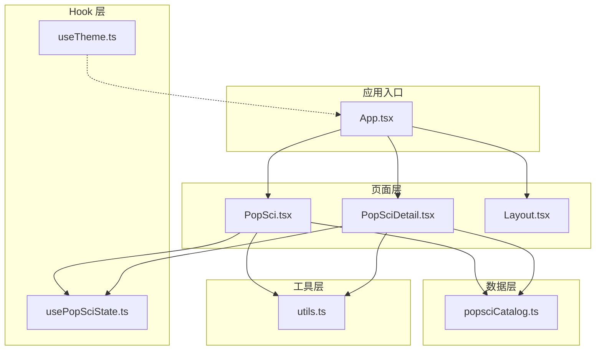
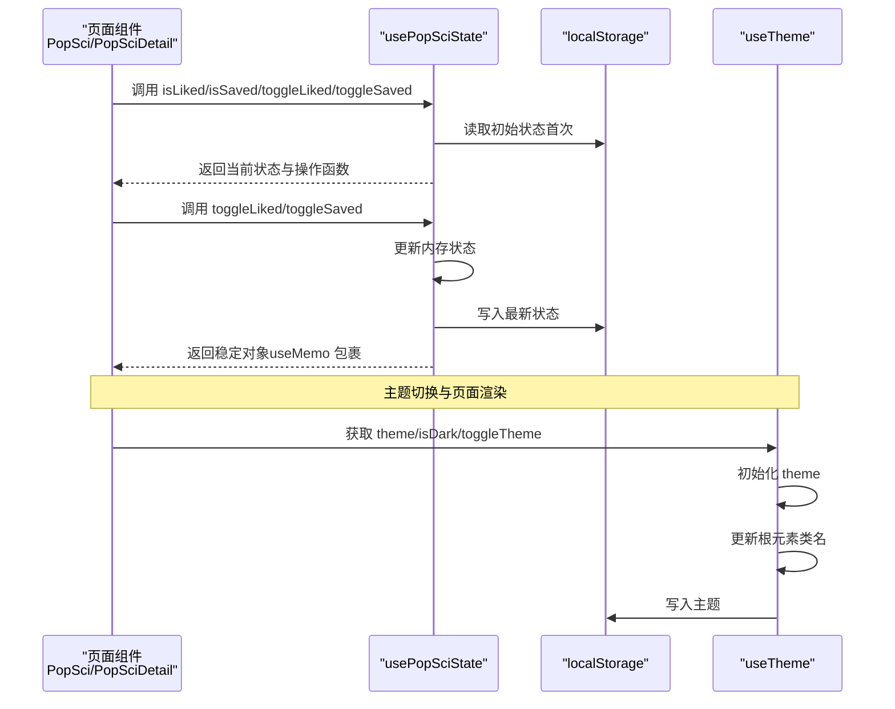
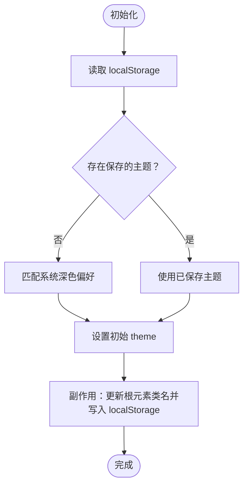
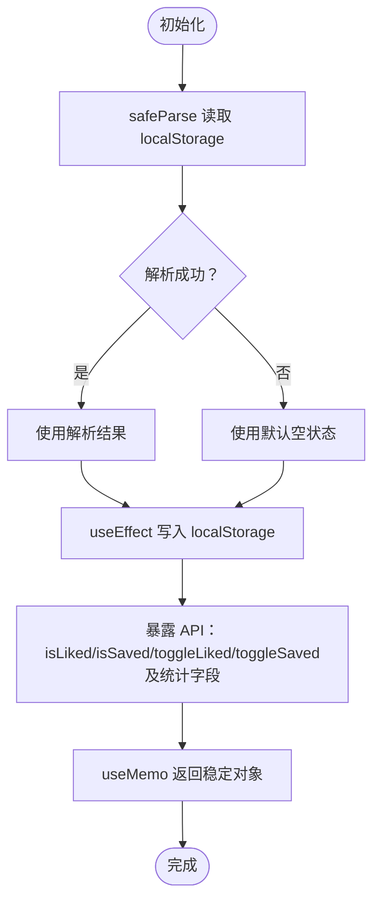
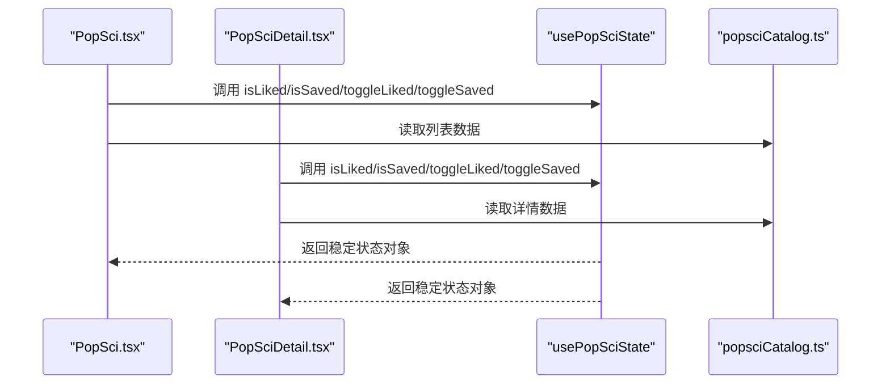
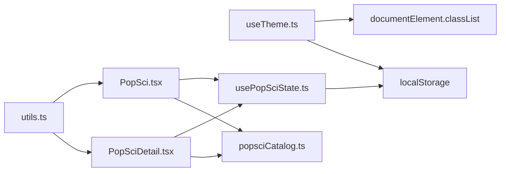

# 自定义Hook

<cite>
**本文引用的文件**
- [useTheme.ts](file://src/hooks/useTheme.ts)
- [usePopSciState.ts](file://src/hooks/usePopSciState.ts)
- [App.tsx](file://src/App.tsx)
- [Layout.tsx](file://src/components/Layout.tsx)
- [PopSci.tsx](file://src/pages/PopSci.tsx)
- [PopSciDetail.tsx](file://src/pages/PopSciDetail.tsx)
- [popsciCatalog.ts](file://src/data/popsciCatalog.ts)
- [utils.ts](file://src/lib/utils.ts)
- [package.json](file://package.json)
</cite>

## 目录
1. [引言](#引言)
2. [项目结构](#项目结构)
3. [核心组件](#核心组件)
4. [架构总览](#架构总览)
5. [详细组件分析](#详细组件分析)
6. [依赖关系分析](#依赖关系分析)
7. [性能考量](#性能考量)
8. [故障排查指南](#故障排查指南)
9. [结论](#结论)
10. [附录](#附录)

## 引言
本文件系统性梳理并文档化两个自定义Hook：useTheme 主题管理与 usePopSciState 科普内容状态管理。前者采用上下文提供者模式的替代实现，通过 Hook 暴露主题状态与切换能力，并结合浏览器偏好与本地存储实现持久化与响应式更新；后者以本地存储为核心，提供点赞/收藏的键值化状态管理与批量计算的稳定返回值，确保组件间高效通信与状态一致性。文档将覆盖参数接口、返回值结构、副作用处理、错误边界、组合使用模式、性能优化与测试策略，并给出最佳实践与扩展方案。

## 项目结构
本项目采用按功能分层的组织方式：Hooks 定义于 src/hooks，页面组件位于 src/pages，UI 基础组件位于 src/components，数据模型位于 src/data，工具函数位于 src/lib。路由配置集中在 App.tsx 中，页面通过 usePopSciState 与 useTheme 在不同场景下进行状态联动。

图表来源
- [App.tsx:19-51](file://src/App.tsx#L19-L51)
- [PopSci.tsx:1-270](file://src/pages/PopSci.tsx#L1-L270)
- [PopSciDetail.tsx:1-150](file://src/pages/PopSciDetail.tsx#L1-L150)
- [popsciCatalog.ts:1-98](file://src/data/popsciCatalog.ts#L1-L98)
- [useTheme.ts:1-29](file://src/hooks/useTheme.ts#L1-L29)
- [usePopSciState.ts:1-80](file://src/hooks/usePopSciState.ts#L1-L80)
- [utils.ts:1-7](file://src/lib/utils.ts#L1-L7)

章节来源
- [App.tsx:19-51](file://src/App.tsx#L19-L51)
- [package.json:13-26](file://package.json#L13-L26)

## 核心组件
- useTheme：提供主题状态（light/dark）、主题切换方法与深色判断标志，初始化时读取本地存储或系统偏好，变更时同步更新根元素类名与本地存储。
- usePopSciState：提供点赞/收藏的查询与切换能力，以及键集合与计数统计，初始化时从本地存储恢复状态，变更时自动持久化。

章节来源
- [useTheme.ts:5-29](file://src/hooks/useTheme.ts#L5-L29)
- [usePopSciState.ts:30-79](file://src/hooks/usePopSciState.ts#L30-L79)

## 架构总览
以下序列图展示了页面与 Hook 的交互流程，以及状态持久化的路径。

图表来源
- [PopSci.tsx:29](file://src/pages/PopSci.tsx#L29)
- [PopSciDetail.tsx:18](file://src/pages/PopSciDetail.tsx#L18)
- [usePopSciState.ts:30-79](file://src/hooks/usePopSciState.ts#L30-L79)
- [useTheme.ts:5-29](file://src/hooks/useTheme.ts#L5-L29)

## 详细组件分析

### useTheme 主题管理
- 设计模式
  - Hook 内部通过 useState 初始化主题，优先读取 localStorage，其次匹配系统深色偏好。
  - 通过 useEffect 同步根元素的类名，实现全局样式切换。
  - 提供 toggleTheme 实现 light/dark 双态切换。
- 参数与返回
  - 无外部参数。
  - 返回值包含：theme（当前主题）、toggleTheme（切换函数）、isDark（布尔判断）。
- 副作用与持久化
  - 每当 theme 变化，副作用会移除旧类名并添加新类名，同时写入 localStorage。
- 错误边界
  - 初始化阶段若系统媒体查询不可用，回退到 light。
- 组合使用
  - 页面组件可直接调用 useTheme 获取主题状态，配合 Tailwind 类名实现样式切换。
- 性能优化
  - 仅在 theme 变化时执行副作用，避免频繁 DOM 操作。
  - 使用常量字符串类名，降低样式切换成本。

图表来源
- [useTheme.ts:6-18](file://src/hooks/useTheme.ts#L6-L18)

章节来源
- [useTheme.ts:5-29](file://src/hooks/useTheme.ts#L5-L29)

### usePopSciState 状态管理
- 数据模型
  - 状态结构：liked/saved 为键数组，键格式为 "类型:标识符"，类型来自 PopSciType。
  - 存储键：popsci_state_v1，JSON 字符串形式。
- 初始化与持久化
  - 首次加载从 localStorage 解析，失败或缺失则回退为空对象。
  - 每当状态变化，立即写入 localStorage。
- 查询与切换
  - isLiked/isSaved：O(n) 查找，n 为对应数组长度。
  - toggleLiked/toggleSaved：构造新数组，保持不可变更新。
- 返回值稳定性
  - 使用 useMemo 包裹返回对象，避免每次渲染产生新的引用，减少子组件重渲染。
- 错误边界
  - safeParse 对 JSON 解析失败进行兜底，保证状态可用性。
- 组合使用
  - 页面组件通过解构获取 isLiked/isSaved/toggleLiked/toggleSaved 与统计字段，直接驱动 UI。
- 性能优化
  - useCallback 包裹查询与切换函数，减少闭包创建。
  - useMemo 包裹返回对象，避免不必要的重渲染。
  - 键生成函数 makeKey 与类型约束 makeKey(type, id) 保证键的唯一性与类型安全。

图表来源
- [usePopSciState.ts:30-79](file://src/hooks/usePopSciState.ts#L30-L79)

章节来源
- [usePopSciState.ts:13-24](file://src/hooks/usePopSciState.ts#L13-L24)
- [usePopSciState.ts:30-79](file://src/hooks/usePopSciState.ts#L30-L79)

### 页面与 Hook 的协作
- PopSci 列表页
  - 使用 usePopSciState 获取 isLiked/isSaved/toggleLiked/toggleSaved，驱动卡片上的收藏/点赞按钮状态与交互。
  - 通过 memoized 计算 likeCount，提升渲染性能。
- PopSciDetail 详情页
  - 使用 usePopSciState 获取当前项的收藏/点赞状态，提供一键切换。
  - 通过类型参数区分 article/video，统一使用同一 Hook。

图表来源
- [PopSci.tsx:29](file://src/pages/PopSci.tsx#L29)
- [PopSciDetail.tsx:18](file://src/pages/PopSciDetail.tsx#L18)
- [popsciCatalog.ts:90-98](file://src/data/popsciCatalog.ts#L90-L98)

章节来源
- [PopSci.tsx:29](file://src/pages/PopSci.tsx#L29)
- [PopSciDetail.tsx:18](file://src/pages/PopSciDetail.tsx#L18)
- [popsciCatalog.ts:1-98](file://src/data/popsciCatalog.ts#L1-L98)

## 依赖关系分析
- 依赖关系
  - useTheme 依赖浏览器媒体查询与 localStorage。
  - usePopSciState 依赖 localStorage 与 JSON 序列化。
  - 页面组件依赖 Hook 返回的稳定 API 与数据模型。
- 外部库
  - 项目使用 react、react-router-dom、clsx/tailwind-merge、framer-motion、react-markdown 等，但 Hook 本身不直接依赖这些库。

图表来源
- [useTheme.ts:14-18](file://src/hooks/useTheme.ts#L14-L18)
- [usePopSciState.ts:36-38](file://src/hooks/usePopSciState.ts#L36-L38)
- [PopSci.tsx:7](file://src/pages/PopSci.tsx#L7)
- [PopSciDetail.tsx:8](file://src/pages/PopSciDetail.tsx#L8)
- [popsciCatalog.ts:1-98](file://src/data/popsciCatalog.ts#L1-L98)
- [utils.ts:1-7](file://src/lib/utils.ts#L1-L7)

章节来源
- [package.json:13-26](file://package.json#L13-L26)

## 性能考量
- Hook 内部优化
  - useTheme：仅在 theme 变化时执行副作用，最小化 DOM 操作。
  - usePopSciState：useCallback 降低函数引用变化频率；useMemo 避免返回对象重复创建。
- 页面侧优化
  - PopSci 使用 useMemo 缓存列表数据与计算 likeCount。
  - 使用 cn 工具函数合并类名，避免多余样式计算。
- 存储层优化
  - localStorage 读写在状态变更时触发，避免频繁 IO；safeParse 对异常输入进行容错。

章节来源
- [useTheme.ts:14-18](file://src/hooks/useTheme.ts#L14-L18)
- [usePopSciState.ts:40-48](file://src/hooks/usePopSciState.ts#L40-L48)
- [usePopSciState.ts:66-78](file://src/hooks/usePopSciState.ts#L66-L78)
- [PopSci.tsx:32](file://src/pages/PopSci.tsx#L32)
- [utils.ts:4-6](file://src/lib/utils.ts#L4-L6)

## 故障排查指南
- 主题无法持久化
  - 检查 localStorage 是否可用；确认 documentElement.classList 操作是否被样式覆盖。
- 点赞/收藏状态不一致
  - 确认页面是否正确传入 type 与 id；核对键格式是否为 "类型:标识符"。
  - 检查 safeParse 是否抛出异常导致回退为空状态。
- 列表页与详情页状态不同步
  - 确保两处均使用同一 Hook 实例；避免在同一页面内重复实例化导致状态隔离。
- 性能问题
  - 若发现频繁重渲染，检查是否在渲染中创建新函数或对象；确保使用 useCallback/useMemo 包裹。

章节来源
- [useTheme.ts:14-18](file://src/hooks/useTheme.ts#L14-L18)
- [usePopSciState.ts:13-24](file://src/hooks/usePopSciState.ts#L13-L24)
- [usePopSciState.ts:30-38](file://src/hooks/usePopSciState.ts#L30-L38)

## 结论
useTheme 与 usePopSciState 通过简洁的 Hook 设计实现了主题与内容状态的统一管理。前者以最小副作用实现响应式主题切换，后者以本地存储为核心提供稳定的键值状态与高性能的返回值稳定性。两者配合页面组件与数据模型，形成清晰的数据流与职责分离，便于扩展与维护。

## 附录

### 接口与返回值规范
- useTheme
  - 返回值
    - theme: "light" | "dark"
    - toggleTheme(): void
    - isDark: boolean
- usePopSciState
  - 返回值
    - isLiked(type, id): boolean
    - isSaved(type, id): boolean
    - toggleLiked(type, id): void
    - toggleSaved(type, id): void
    - likedKeys: string[]
    - savedKeys: string[]
    - likedCount: number
    - savedCount: number

章节来源
- [useTheme.ts:24-28](file://src/hooks/useTheme.ts#L24-L28)
- [usePopSciState.ts:66-78](file://src/hooks/usePopSciState.ts#L66-L78)

### 组合使用模式与最佳实践
- 组合模式
  - 页面组件在渲染前调用 usePopSciState 获取状态与操作函数，再根据 isLiked/isSaved 控制 UI。
  - 主题与内容状态可并行使用，互不影响。
- 最佳实践
  - 使用 useCallback/useMemo 包裹高频调用的函数与对象。
  - 严格校验键格式与类型，避免运行时错误。
  - 在开发环境开启 ESLint React Hooks 插件，避免常见陷阱。
  - 对 localStorage 异常进行显式处理，保证用户体验。

章节来源
- [usePopSciState.ts:40-48](file://src/hooks/usePopSciState.ts#L40-L48)
- [usePopSciState.ts:66-78](file://src/hooks/usePopSciState.ts#L66-L78)
- [package.json:36-47](file://package.json#L36-L47)

### 测试策略
- 单元测试建议
  - useTheme：验证初始化逻辑（localStorage 优先、系统偏好回退）、toggleTheme 切换行为、副作用对根元素类名的影响。
  - usePopSciState：验证 safeParse 对空值与异常输入的处理、键生成与去重逻辑、toggleLiked/toggleSaved 的状态变更、useMemo 返回对象的稳定性。
- 集成测试建议
  - 页面组件：验证 PopSci 与 PopSciDetail 在不同路由下的状态联动与 UI 一致性。
  - 边界场景：模拟 localStorage 不可用、键格式错误、类型不匹配等情况，确保错误边界有效。

章节来源
- [useTheme.ts:6-18](file://src/hooks/useTheme.ts#L6-L18)
- [usePopSciState.ts:13-24](file://src/hooks/usePopSciState.ts#L13-L24)
- [usePopSciState.ts:30-38](file://src/hooks/usePopSciState.ts#L30-L38)