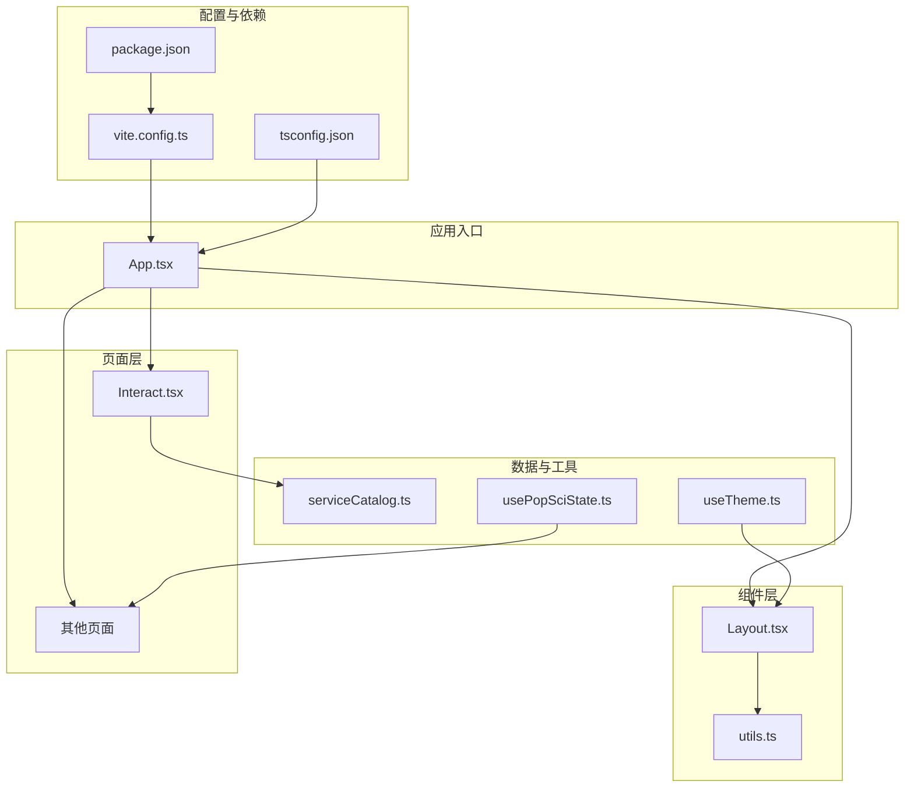
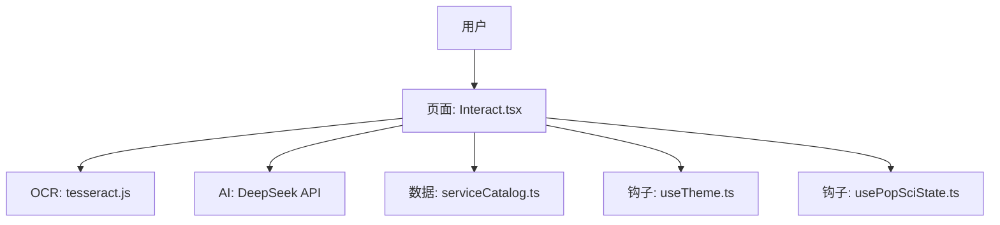
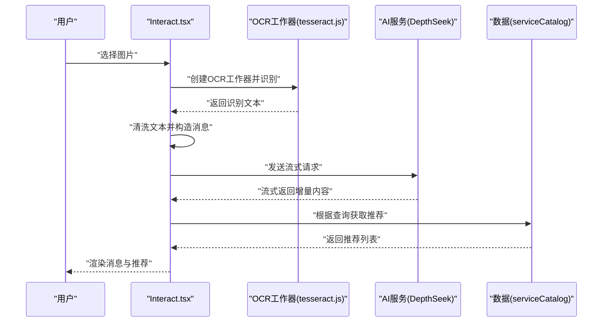
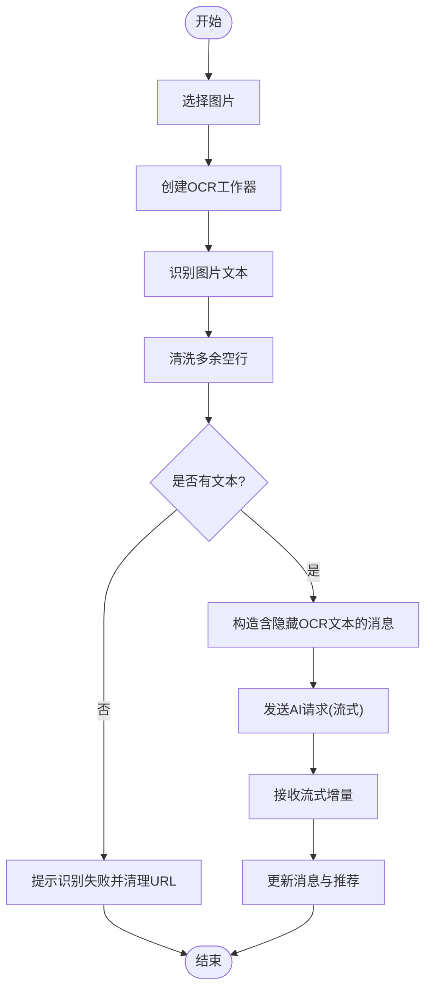
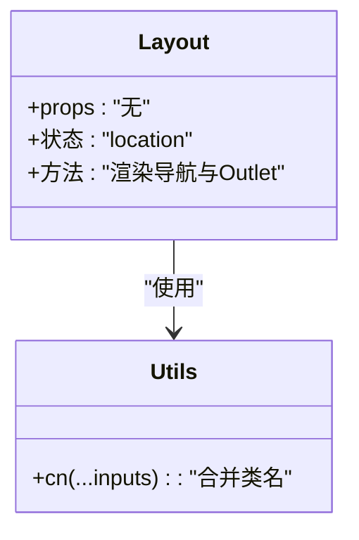
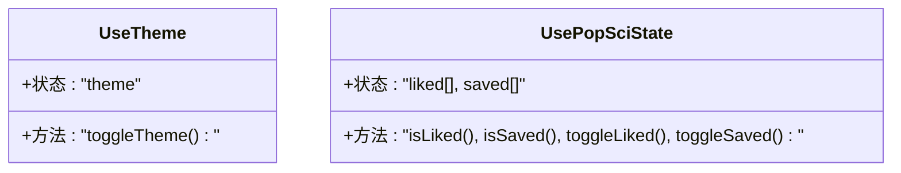
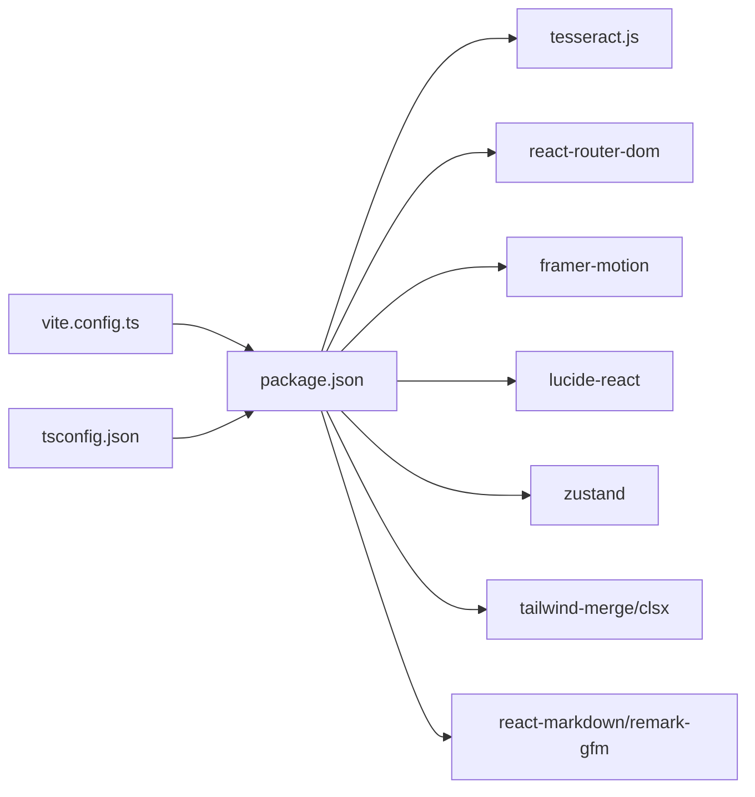

# 测试文档

<cite>
**本文引用的文件**
- [package.json](file://package.json)
- [vite.config.ts](file://vite.config.ts)
- [tsconfig.json](file://tsconfig.json)
- [README.md](file://README.md)
- [src/App.tsx](file://src/App.tsx)
- [src/components/Layout.tsx](file://src/components/Layout.tsx)
- [src/lib/utils.ts](file://src/lib/utils.ts)
- [src/hooks/useTheme.ts](file://src/hooks/useTheme.ts)
- [src/hooks/usePopSciState.ts](file://src/hooks/usePopSciState.ts)
- [src/pages/Interact.tsx](file://src/pages/Interact.tsx)
- [src/data/serviceCatalog.ts](file://src/data/serviceCatalog.ts)
- [.trae/specs/implement-ocr-medical-reports/spec.md](file://.trae/specs/implement-ocr-medical-reports/spec.md)
- [.trae/specs/implement-ocr-medical-reports/checklist.md](file://.trae/specs/implement-ocr-medical-reports/checklist.md)
- [test-tesseract.js](file://test-tesseract.js)
</cite>

## 目录
1. [引言](#引言)
2. [项目结构](#项目结构)
3. [核心组件](#核心组件)
4. [架构总览](#架构总览)
5. [详细组件分析](#详细组件分析)
6. [依赖分析](#依赖分析)
7. [性能考虑](#性能考虑)
8. [故障排查指南](#故障排查指南)
9. [结论](#结论)
10. [附录](#附录)

## 引言
本测试文档面向本项目的前端应用，系统化阐述测试策略与实施方法，覆盖单元测试、集成测试与UI自动化测试；深入解析OCR功能测试、API接口测试策略、组件测试最佳实践；并提供测试环境搭建、测试数据准备、覆盖率评估、工具使用指南、CI中的测试配置以及性能测试方法。文档同时总结测试用例设计原则、边界条件处理与回归测试执行要点，并给出测试报告解读方法。

## 项目结构
本项目采用React + TypeScript + Vite技术栈，采用按功能域组织的目录结构，核心模块包括：
- 组件层：布局、通用组件
- 页面层：路由页面与业务页面
- 数据与工具：数据目录、通用工具函数
- 钩子：主题与状态管理钩子
- 配置：Vite、TypeScript、ESLint等

图表来源
- [src/App.tsx:1-52](file://src/App.tsx#L1-L52)
- [src/components/Layout.tsx:1-66](file://src/components/Layout.tsx#L1-L66)
- [src/lib/utils.ts:1-7](file://src/lib/utils.ts#L1-L7)
- [src/hooks/useTheme.ts:1-29](file://src/hooks/useTheme.ts#L1-L29)
- [src/hooks/usePopSciState.ts:1-80](file://src/hooks/usePopSciState.ts#L1-L80)
- [src/pages/Interact.tsx:1-462](file://src/pages/Interact.tsx#L1-L462)
- [src/data/serviceCatalog.ts:1-47](file://src/data/serviceCatalog.ts#L1-L47)
- [vite.config.ts:1-22](file://vite.config.ts#L1-L22)
- [tsconfig.json:1-38](file://tsconfig.json#L1-L38)
- [package.json:1-48](file://package.json#L1-L48)

章节来源
- [src/App.tsx:1-52](file://src/App.tsx#L1-L52)
- [src/components/Layout.tsx:1-66](file://src/components/Layout.tsx#L1-L66)
- [src/lib/utils.ts:1-7](file://src/lib/utils.ts#L1-L7)
- [src/hooks/useTheme.ts:1-29](file://src/hooks/useTheme.ts#L1-L29)
- [src/hooks/usePopSciState.ts:1-80](file://src/hooks/usePopSciState.ts#L1-L80)
- [src/pages/Interact.tsx:1-462](file://src/pages/Interact.tsx#L1-L462)
- [src/data/serviceCatalog.ts:1-47](file://src/data/serviceCatalog.ts#L1-L47)
- [vite.config.ts:1-22](file://vite.config.ts#L1-L22)
- [tsconfig.json:1-38](file://tsconfig.json#L1-L38)
- [package.json:1-48](file://package.json#L1-L48)

## 核心组件
- 布局组件：负责导航栏、主内容区与底部导航的渲染与样式控制，使用Tailwind合并类名工具函数，确保样式一致性与可维护性。
- 主应用：集中定义路由与页面嵌套关系，承载启动页与各业务页面。
- 钩子：主题切换与持久化、科普内容收藏/点赞状态管理，均通过localStorage实现状态持久化。
- 页面组件：以Interact为例，包含聊天交互、OCR图片识别、AI对话流式响应、推荐内容展示等复杂交互逻辑。
- 数据目录：服务目录数据结构与查询方法，支撑页面推荐与导航。

章节来源
- [src/components/Layout.tsx:1-66](file://src/components/Layout.tsx#L1-L66)
- [src/App.tsx:1-52](file://src/App.tsx#L1-L52)
- [src/hooks/useTheme.ts:1-29](file://src/hooks/useTheme.ts#L1-L29)
- [src/hooks/usePopSciState.ts:1-80](file://src/hooks/usePopSciState.ts#L1-L80)
- [src/pages/Interact.tsx:1-462](file://src/pages/Interact.tsx#L1-L462)
- [src/data/serviceCatalog.ts:1-47](file://src/data/serviceCatalog.ts#L1-L47)

## 架构总览
下图展示了应用的运行时交互：用户通过页面组件发起交互，页面组件调用数据与钩子，必要时调用外部OCR与AI服务，最终更新UI状态。

图表来源
- [src/pages/Interact.tsx:1-462](file://src/pages/Interact.tsx#L1-L462)
- [src/data/serviceCatalog.ts:1-47](file://src/data/serviceCatalog.ts#L1-L47)
- [src/hooks/useTheme.ts:1-29](file://src/hooks/useTheme.ts#L1-L29)
- [src/hooks/usePopSciState.ts:1-80](file://src/hooks/usePopSciState.ts#L1-L80)

## 详细组件分析

### 组件A：Interact（聊天与OCR）
- 功能职责：聊天消息管理、快速问题、图片上传与OCR识别、AI流式响应、推荐内容展示、本地历史持久化。
- 关键流程：图片选择 -> 创建OCR工作器 -> 识别文本 -> 清洗文本 -> 发送AI请求 -> 流式接收 -> 更新UI与推荐。
- 错误处理：OCR失败、API异常、无密钥时降级提示、URL对象清理、禁用态防止重复触发。
- 性能考量：流式解码、按需渲染、本地存储优化、图片URL回收。

图表来源
- [src/pages/Interact.tsx:86-142](file://src/pages/Interact.tsx#L86-L142)
- [src/pages/Interact.tsx:144-248](file://src/pages/Interact.tsx#L144-L248)
- [src/data/serviceCatalog.ts:45-47](file://src/data/serviceCatalog.ts#L45-L47)

图表来源
- [src/pages/Interact.tsx:86-142](file://src/pages/Interact.tsx#L86-L142)
- [src/pages/Interact.tsx:144-248](file://src/pages/Interact.tsx#L144-L248)

章节来源
- [src/pages/Interact.tsx:1-462](file://src/pages/Interact.tsx#L1-L462)
- [src/data/serviceCatalog.ts:1-47](file://src/data/serviceCatalog.ts#L1-L47)

### 组件B：Layout（导航与样式）
- 功能职责：底部导航、路由出口、动态高亮、样式合并。
- 关键点：使用工具函数合并类名，保证样式一致性；导航项与路径映射清晰。

图表来源
- [src/components/Layout.tsx:1-66](file://src/components/Layout.tsx#L1-L66)
- [src/lib/utils.ts:1-7](file://src/lib/utils.ts#L1-L7)

章节来源
- [src/components/Layout.tsx:1-66](file://src/components/Layout.tsx#L1-L66)
- [src/lib/utils.ts:1-7](file://src/lib/utils.ts#L1-L7)

### 组件C：钩子（主题与状态）
- useTheme：主题持久化与切换，基于系统偏好与本地存储。
- usePopSciState：收藏/点赞状态持久化，键值规范化，回调函数防抖更新。

图表来源
- [src/hooks/useTheme.ts:1-29](file://src/hooks/useTheme.ts#L1-L29)
- [src/hooks/usePopSciState.ts:1-80](file://src/hooks/usePopSciState.ts#L1-L80)

章节来源
- [src/hooks/useTheme.ts:1-29](file://src/hooks/useTheme.ts#L1-L29)
- [src/hooks/usePopSciState.ts:1-80](file://src/hooks/usePopSciState.ts#L1-L80)

### 组件D：数据目录（服务目录）
- 功能职责：服务条目结构定义、查询方法。
- 关键点：类型安全的数据结构与查找函数，便于页面消费。

章节来源
- [src/data/serviceCatalog.ts:1-47](file://src/data/serviceCatalog.ts#L1-L47)

## 依赖分析
- 外部依赖：tesseract.js（OCR）、react-router-dom（路由）、framer-motion（动画）、lucide-react（图标）、zustand（状态管理）、tailwind-merge/clsx（样式）、react-markdown/remark-gfm（Markdown渲染）。
- 开发依赖：Vite、TypeScript、ESLint、TailwindCSS、React插件等。
- 构建配置：Vite启用React插件、TS路径别名、源码映射策略。

图表来源
- [package.json:1-48](file://package.json#L1-L48)
- [vite.config.ts:1-22](file://vite.config.ts#L1-L22)
- [tsconfig.json:1-38](file://tsconfig.json#L1-L38)

章节来源
- [package.json:1-48](file://package.json#L1-L48)
- [vite.config.ts:1-22](file://vite.config.ts#L1-L22)
- [tsconfig.json:1-38](file://tsconfig.json#L1-L38)

## 性能考虑
- 图片与URL：上传图片后生成本地URL用于预览，识别失败或流程结束后及时回收URL，避免内存泄漏。
- 本地存储：聊天历史持久化时过滤大字段，减少存储体积，提高读写效率。
- 流式响应：AI响应采用流式读取，逐步更新UI，降低首屏等待时间。
- 样式合并：统一使用类名合并工具，减少重复样式计算。
- 构建优化：开启源码映射策略，便于定位问题与性能分析。

章节来源
- [src/pages/Interact.tsx:70-84](file://src/pages/Interact.tsx#L70-L84)
- [src/pages/Interact.tsx:90-142](file://src/pages/Interact.tsx#L90-L142)
- [src/lib/utils.ts:1-7](file://src/lib/utils.ts#L1-L7)

## 故障排查指南
- OCR工作器初始化失败：检查语言包配置与浏览器兼容性，参考独立脚本验证。
- OCR识别结果为空：确认图片清晰度、角度与文字密度；对空文本进行降级提示。
- API密钥缺失：当未配置密钥时，页面提示配置方法并返回降级内容；确保环境变量正确注入。
- 网络异常：捕获API错误，提示重试并回退到推荐内容；避免UI卡死。
- UI状态异常：检查消息数组更新逻辑与流式解析缓冲区，确保增量拼接正确。

章节来源
- [test-tesseract.js:1-6](file://test-tesseract.js#L1-L6)
- [src/pages/Interact.tsx:152-166](file://src/pages/Interact.tsx#L152-L166)
- [src/pages/Interact.tsx:237-248](file://src/pages/Interact.tsx#L237-L248)

## 结论
本项目在前端层面实现了较为完整的交互闭环：图片OCR识别、AI流式对话、推荐内容与状态持久化。测试策略应围绕这些关键路径展开，确保单元测试覆盖核心逻辑、集成测试验证端到端流程、UI测试保障交互稳定性，并结合性能与回归测试形成完整质量保障体系。

## 附录

### 测试策略与实施方法
- 单元测试
  - 目标：验证纯函数、工具函数、状态钩子与数据结构的正确性。
  - 覆盖范围：工具函数（类名合并）、状态钩子（主题切换、收藏/点赞）、数据查询（服务目录）。
  - 推荐框架：Jest + React Testing Library（如引入）。
- 集成测试
  - 目标：验证页面组件与外部服务的协作，如OCR与AI接口。
  - 覆盖范围：Interact页面的图片上传、OCR识别、流式响应、推荐生成。
  - 推荐方式：Mock外部服务，隔离网络依赖；对关键分支进行断言。
- UI自动化测试
  - 目标：验证用户操作路径与界面一致性。
  - 覆盖范围：导航、输入、发送消息、图片上传、推荐点击。
  - 推荐框架：Playwright/Cypress（如引入）。
- OCR功能测试
  - 方法：准备多语言、多清晰度的图片样本；验证清洗逻辑与提示文案；模拟识别失败与超时。
  - 参考规格：体检报告OCR功能Spec与验收清单。
- API接口测试
  - 方法：对AI接口进行契约测试，覆盖正常、异常与限流场景；使用Mock服务或沙盒环境。
- 组件测试最佳实践
  - 使用快照测试与交互测试相结合；对动画与滚动行为进行稳定化处理；对本地存储进行隔离。
- 测试环境搭建
  - 安装依赖：确保Node环境与包管理器可用；安装开发依赖与运行时依赖。
  - 配置：Vite与TypeScript配置保持默认即可；如需测试，添加测试脚本与配置文件。
- 测试数据准备
  - OCR测试：准备中文/英文混合、倾斜、模糊等样本；准备空文本与极长文本。
  - 推荐测试：准备关键词与预期匹配的推荐条目。
- 测试覆盖率评估
  - 关注：语句覆盖率、分支覆盖率、函数覆盖率与行覆盖率；对关键路径与异常分支给予更高权重。
- 测试工具使用指南
  - 单元测试：Jest命令与配置；断言与Mock使用。
  - 集成测试：测试环境隔离与Mock策略。
  - UI测试：页面元素定位、交互序列与截图对比。
- 持续集成中的测试配置
  - 建议：在CI中执行单元测试与集成测试；UI测试在专用环境或容器中运行；覆盖率阈值与失败策略明确。
- 性能测试方法
  - 场景：图片识别耗时、流式响应延迟、页面渲染性能；使用浏览器性能面板与自定义基准测试。
- 测试用例设计原则
  - 原则：单一职责、可重复、可维护、可追溯；覆盖正常、边界与异常。
- 边界条件处理
  - 示例：空输入、超长文本、极小/极大图片、弱网、离线、语言包缺失。
- 回归测试执行
  - 建议：在每次重大改动后执行全量回归；对关键路径进行冒烟测试；记录失败与修复追踪。

### 实际测试代码示例与报告解读
- OCR功能测试示例
  - 路径参考：[test-tesseract.js:1-6](file://test-tesseract.js#L1-L6)
  - 报告解读：关注工作器创建与终止日志、语言包加载状态与错误堆栈。
- Interact页面测试示例
  - 路径参考：[src/pages/Interact.tsx:86-142](file://src/pages/Interact.tsx#L86-L142)、[src/pages/Interact.tsx:144-248](file://src/pages/Interact.tsx#L144-L248)
  - 报告解读：关注消息数组长度、流式增量拼接、推荐数量与类型标签。
- 规格与验收
  - 路径参考：[体检报告OCR功能 Spec:1-31](file://.trae/specs/implement-ocr-medical-reports/spec.md#L1-L31)、[验收清单:1-7](file://.trae/specs/implement-ocr-medical-reports/checklist.md#L1-L7)
  - 报告解读：逐项核对UI反馈、OCR识别、AI解读与错误提示。

章节来源
- [.trae/specs/implement-ocr-medical-reports/spec.md:1-31](file://.trae/specs/implement-ocr-medical-reports/spec.md#L1-L31)
- [.trae/specs/implement-ocr-medical-reports/checklist.md:1-7](file://.trae/specs/implement-ocr-medical-reports/checklist.md#L1-L7)
- [test-tesseract.js:1-6](file://test-tesseract.js#L1-L6)
- [src/pages/Interact.tsx:86-142](file://src/pages/Interact.tsx#L86-L142)
- [src/pages/Interact.tsx:144-248](file://src/pages/Interact.tsx#L144-L248)