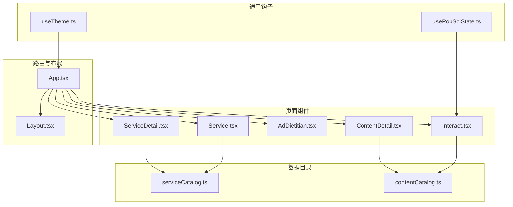
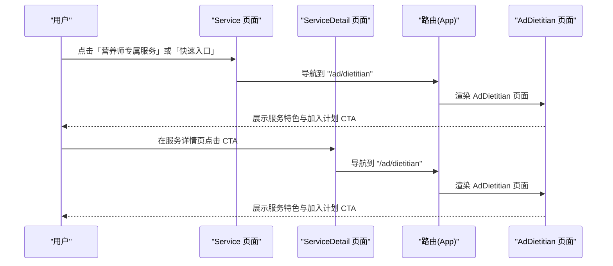
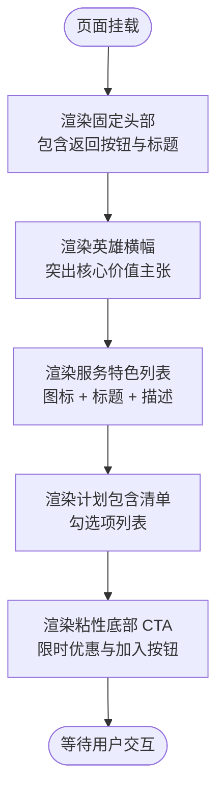
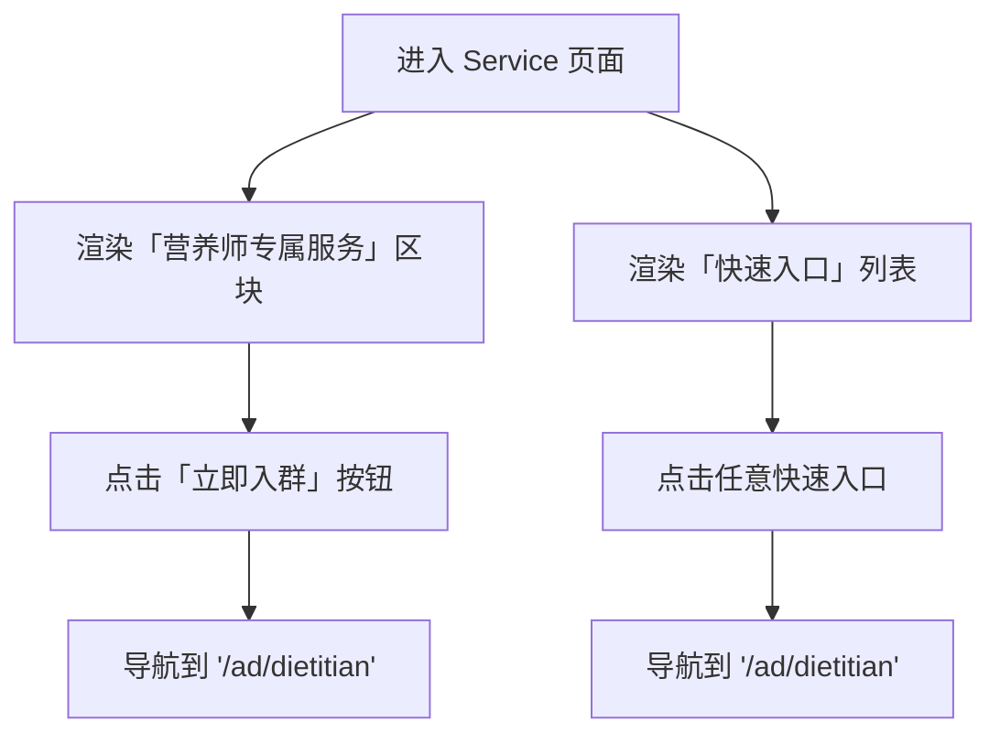
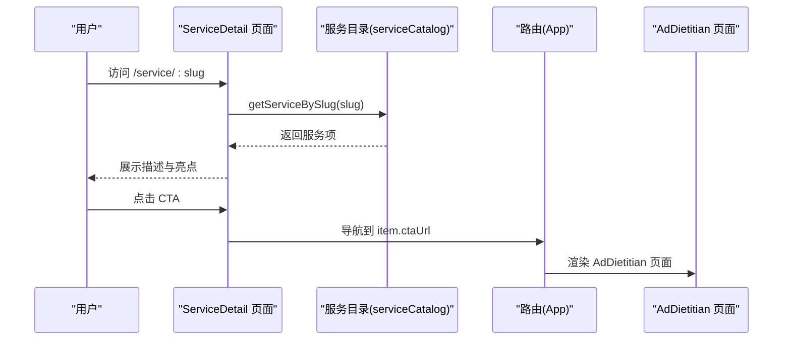
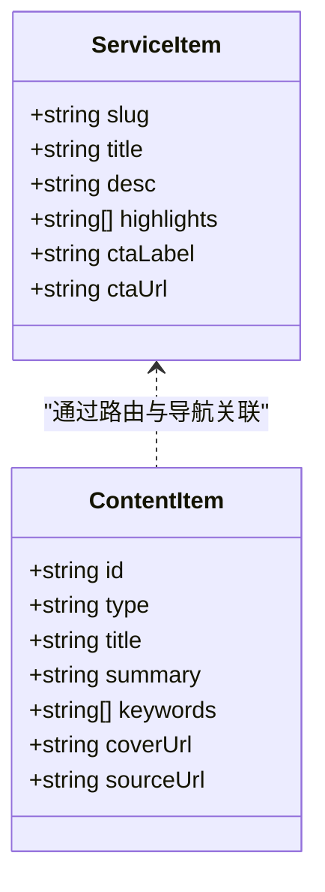
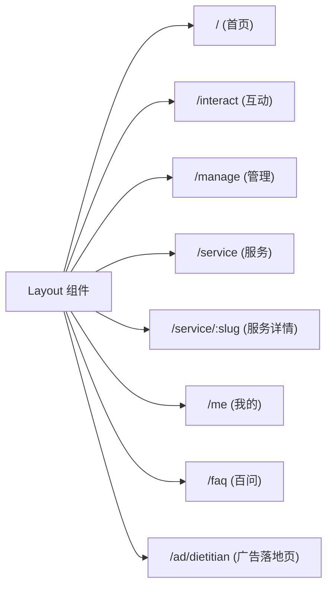
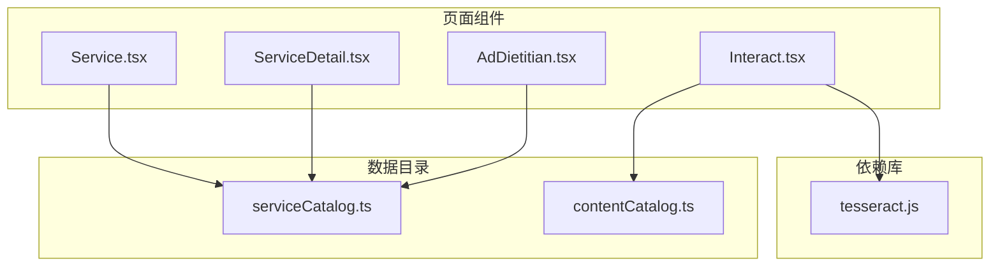

# 广告营养师集成设计

<cite>
**本文档引用的文件**
- [AdDietitian.tsx](file://src/pages/AdDietitian.tsx)
- [serviceCatalog.ts](file://src/data/serviceCatalog.ts)
- [Service.tsx](file://src/pages/Service.tsx)
- [ServiceDetail.tsx](file://src/pages/ServiceDetail.tsx)
- [App.tsx](file://src/App.tsx)
- [Layout.tsx](file://src/components/Layout.tsx)
- [contentCatalog.ts](file://src/data/contentCatalog.ts)
- [2026-04-17-ad-dietitian-design.md](file://docs/2026-04-17-ad-dietitian-design.md)
- [2026-04-14-chat-recommendations-design.md](file://docs/2026-04-14-chat-recommendations-design.md)
- [Interact.tsx](file://src/pages/Interact.tsx)
- [usePopSciState.ts](file://src/hooks/usePopSciState.ts)
- [useTheme.ts](file://src/hooks/useTheme.ts)
- [package.json](file://package.json)
</cite>

## 目录
1. [简介](#简介)
2. [项目结构](#项目结构)
3. [核心组件](#核心组件)
4. [架构总览](#架构总览)
5. [详细组件分析](#详细组件分析)
6. [依赖关系分析](#依赖关系分析)
7. [性能考虑](#性能考虑)
8. [故障排除指南](#故障排除指南)
9. [结论](#结论)
10. [附录](#附录)

## 简介
本设计文档围绕「广告营养师集成」展开，目标是将原有的外部链接替换为内部「广告落地页」，以提供更平滑、一致的用户体验。该落地页推广「营养师管理计划」，通过统一的路由、组件与数据目录，串联起服务入口、详情页与广告页之间的导航与交互。

本项目采用 React + TypeScript + Vite 技术栈，使用 React Router 进行路由管理，TailwindCSS 与自定义工具类进行样式控制，Lucide React 提供图标支持。整体架构遵循「页面组件 + 数据目录 + 路由配置」的分层设计，便于扩展与维护。

## 项目结构
项目采用按页面与功能模块组织的结构，核心路径如下：
- 页面组件：`src/pages/` 下包含各业务页面（如 Service、ServiceDetail、AdDietitian 等）
- 数据目录：`src/data/` 下包含服务目录与内容目录等静态数据
- 组件：`src/components/` 下包含通用布局与工具组件
- 钩子：`src/hooks/` 下包含状态与主题等通用逻辑
- 规范文档：`docs/` 下包含设计规范与需求说明

**图表来源**
- [App.tsx:29-46](file://src/App.tsx#L29-L46)
- [Layout.tsx:19-65](file://src/components/Layout.tsx#L19-L65)
- [Service.tsx:4-43](file://src/pages/Service.tsx#L4-L43)
- [ServiceDetail.tsx:1-75](file://src/pages/ServiceDetail.tsx#L1-L75)
- [AdDietitian.tsx:1-125](file://src/pages/AdDietitian.tsx#L1-L125)
- [contentCatalog.ts:1-101](file://src/data/contentCatalog.ts#L1-L101)
- [serviceCatalog.ts:1-49](file://src/data/serviceCatalog.ts#L1-L49)

**章节来源**
- [App.tsx:19-51](file://src/App.tsx#L19-L51)
- [Layout.tsx:19-65](file://src/components/Layout.tsx#L19-L65)

## 核心组件
- 营养师广告落地页：负责展示「营养师管理计划」的卖点、服务特色与价格信息，并提供加入计划的 CTA。
- 服务入口页：展示各类服务卡片与快速入口，点击后统一跳转至广告落地页。
- 服务详情页：展示具体服务的描述与亮点，并提供统一的 CTA 导航。
- 数据目录：包含服务目录与内容目录，提供统一的数据结构与查询方法。
- 路由与布局：统一的路由配置与底部导航，保证页面间的一致性与连贯性。

**章节来源**
- [AdDietitian.tsx:4-125](file://src/pages/AdDietitian.tsx#L4-L125)
- [Service.tsx:6-133](file://src/pages/Service.tsx#L6-L133)
- [ServiceDetail.tsx:6-75](file://src/pages/ServiceDetail.tsx#L6-L75)
- [serviceCatalog.ts:1-49](file://src/data/serviceCatalog.ts#L1-L49)
- [contentCatalog.ts:1-101](file://src/data/contentCatalog.ts#L1-L101)

## 架构总览
广告营养师集成的架构围绕「路由 → 页面 → 数据目录」的链路展开。服务入口页与详情页通过统一的 CTAUrl 指向广告落地页，广告页负责最终的转化展示与交互。

**图表来源**
- [App.tsx:46](file://src/App.tsx#L46)
- [Service.tsx:67-73](file://src/pages/Service.tsx#L67-L73)
- [Service.tsx:114](file://src/pages/Service.tsx#L114)
- [ServiceDetail.tsx:61-67](file://src/pages/ServiceDetail.tsx#L61-L67)
- [serviceCatalog.ts:17](file://src/data/serviceCatalog.ts#L17)

**章节来源**
- [2026-04-17-ad-dietitian-design.md:35-39](file://docs/2026-04-17-ad-dietitian-design.md#L35-L39)

## 详细组件分析

### 营养师广告落地页（AdDietitian）
AdDietitian 页面承担广告落地页的职责，包含头部返回按钮、英雄横幅、服务特色展示与底部粘性 CTA 区域。页面通过固定头部与粘性底部，确保在移动端的良好可读性与操作性。

**图表来源**
- [AdDietitian.tsx:31-121](file://src/pages/AdDietitian.tsx#L31-L121)

**章节来源**
- [AdDietitian.tsx:4-125](file://src/pages/AdDietitian.tsx#L4-L125)

### 服务入口页（Service）
Service 页面展示「营养师专属服务」区块与「精选服务」「快速入口」两大区域。其中「营养师专属服务」提供加入群组的 CTA，点击后统一导航至广告落地页；「快速入口」从服务目录中选取若干条目，点击后同样指向广告落地页。

**图表来源**
- [Service.tsx:55-81](file://src/pages/Service.tsx#L55-L81)
- [Service.tsx:107-127](file://src/pages/Service.tsx#L107-L127)
- [serviceCatalog.ts:10-43](file://src/data/serviceCatalog.ts#L10-L43)

**章节来源**
- [Service.tsx:6-133](file://src/pages/Service.tsx#L6-L133)
- [serviceCatalog.ts:10-49](file://src/data/serviceCatalog.ts#L10-L49)

### 服务详情页（ServiceDetail）
ServiceDetail 页面根据 slug 查询服务目录，展示服务描述、亮点标签与统一的 CTA。点击 CTA 后统一导航至广告落地页，保证用户路径的一致性。

**图表来源**
- [ServiceDetail.tsx:6-9](file://src/pages/ServiceDetail.tsx#L6-L9)
- [serviceCatalog.ts:45-47](file://src/data/serviceCatalog.ts#L45-L47)
- [ServiceDetail.tsx:61-67](file://src/pages/ServiceDetail.tsx#L61-L67)

**章节来源**
- [ServiceDetail.tsx:6-75](file://src/pages/ServiceDetail.tsx#L6-L75)
- [serviceCatalog.ts:45-47](file://src/data/serviceCatalog.ts#L45-L47)

### 数据目录与内容推荐
服务目录（serviceCatalog）与内容目录（contentCatalog）分别承载服务与内容的元数据。服务目录提供统一的 CTAUrl，确保所有服务入口均指向广告落地页；内容目录提供关键词匹配与默认推荐机制，支撑对话后的相关内容推荐。

**图表来源**
- [serviceCatalog.ts:1-8](file://src/data/serviceCatalog.ts#L1-L8)
- [contentCatalog.ts:3-11](file://src/data/contentCatalog.ts#L3-L11)

**章节来源**
- [serviceCatalog.ts:1-49](file://src/data/serviceCatalog.ts#L1-L49)
- [contentCatalog.ts:1-101](file://src/data/contentCatalog.ts#L1-L101)

### 路由与导航
App 路由在根布局下注册了多个页面路由，其中新增的广告落地页路由位于服务页之下，保持与其它详情页一致的布局风格。底部导航由 Layout 组件提供，确保跨页面的导航一致性。

**图表来源**
- [App.tsx:29-46](file://src/App.tsx#L29-L46)
- [Layout.tsx:10-17](file://src/components/Layout.tsx#L10-L17)

**章节来源**
- [App.tsx:19-51](file://src/App.tsx#L19-L51)
- [Layout.tsx:19-65](file://src/components/Layout.tsx#L19-L65)

## 依赖关系分析
- 组件耦合：Service 与 ServiceDetail 通过 serviceCatalog 解耦，避免硬编码 URL；AdDietitian 作为独立页面，仅依赖路由与导航。
- 数据依赖：服务目录提供统一的 CTAUrl，内容目录提供关键词匹配与默认推荐，支撑对话后的推荐能力。
- 外部依赖：项目引入了 tesseract.js 用于 OCR 识别，结合对话页实现报告解读与推荐。

**图表来源**
- [Service.tsx:4](file://src/pages/Service.tsx#L4)
- [ServiceDetail.tsx:4](file://src/pages/ServiceDetail.tsx#L4)
- [AdDietitian.tsx:1](file://src/pages/AdDietitian.tsx#L1)
- [contentCatalog.ts:1](file://src/data/contentCatalog.ts#L1)
- [package.json:24](file://package.json#L24)

**章节来源**
- [package.json:13-25](file://package.json#L13-L25)

## 性能考虑
- 路由懒加载：对于大型页面可考虑使用 React.lazy 与 Suspense 实现按需加载，减少首屏体积。
- 图标与资源：Lucide React 采用按需导入，避免引入未使用的图标，降低包体积。
- 样式优化：TailwindCSS 建议在生产环境启用 Purge 以移除未使用样式，提升渲染性能。
- 交互反馈：粘性 CTA 与滚动行为需注意移动端性能，避免频繁重排与重绘。

## 故障排除指南
- 导航异常
  - 症状：点击「立即入群」「快速入口」「服务详情 CTA」无法跳转至广告落地页。
  - 排查：确认路由配置中存在 `/ad/dietitian`，且服务目录中的 `ctaUrl` 已更新为 `/ad/dietitian`。
  - 参考
    - [App.tsx:46](file://src/App.tsx#L46)
    - [serviceCatalog.ts:17](file://src/data/serviceCatalog.ts#L17)
- 页面渲染问题
  - 症状：广告落地页在移动端显示异常或粘性 CTA 覆盖内容。
  - 排查：检查固定定位与安全区域（pb-safe）类名，确保在不同机型上正确适配。
  - 参考
    - [AdDietitian.tsx:34](file://src/pages/AdDietitian.tsx#L34)
    - [AdDietitian.tsx:104](file://src/pages/AdDietitian.tsx#L104)
- 数据查询失败
  - 症状：服务详情页显示「服务不存在」。
  - 排查：确认 slug 正确，服务目录中是否存在对应项，以及 `getServiceBySlug` 是否正常返回。
  - 参考
    - [ServiceDetail.tsx:9](file://src/pages/ServiceDetail.tsx#L9)
    - [serviceCatalog.ts:45-47](file://src/data/serviceCatalog.ts#L45-L47)
- 推荐内容不匹配
  - 症状：对话后推荐内容与主题无关。
  - 排查：检查输入文本是否包含关键词，或默认推荐池是否足够丰富。
  - 参考
    - [contentCatalog.ts:69-99](file://src/data/contentCatalog.ts#L69-L99)
    - [2026-04-14-chat-recommendations-design.md:60-67](file://docs/2026-04-14-chat-recommendations-design.md#L60-L67)

**章节来源**
- [App.tsx:46](file://src/App.tsx#L46)
- [serviceCatalog.ts:17](file://src/data/serviceCatalog.ts#L17)
- [AdDietitian.tsx:34](file://src/pages/AdDietitian.tsx#L34)
- [AdDietitian.tsx:104](file://src/pages/AdDietitian.tsx#L104)
- [ServiceDetail.tsx:9](file://src/pages/ServiceDetail.tsx#L9)
- [serviceCatalog.ts:45-47](file://src/data/serviceCatalog.ts#L45-L47)
- [contentCatalog.ts:69-99](file://src/data/contentCatalog.ts#L69-L99)
- [2026-04-14-chat-recommendations-design.md:60-67](file://docs/2026-04-14-chat-recommendations-design.md#L60-L67)

## 结论
本设计通过统一的路由与数据目录，将原本分散的服务入口整合至广告落地页，提升了用户体验的一致性与转化效率。配合内容目录的关键词匹配与默认推荐机制，可在对话后进一步引导用户深入了解相关内容与服务。未来可在此基础上扩展 A/B 测试、效果追踪与 ROI 计算，以实现更精细化的广告投放与运营优化。

## 附录
- 术语说明
  - CTA：Call To Action，行动号召按钮
  - ROI：投资回报率，用于衡量广告投放效果
- 相关文档
  - [2026-04-17-ad-dietitian-design.md](file://docs/2026-04-17-ad-dietitian-design.md)
  - [2026-04-14-chat-recommendations-design.md](file://docs/2026-04-14-chat-recommendations-design.md)