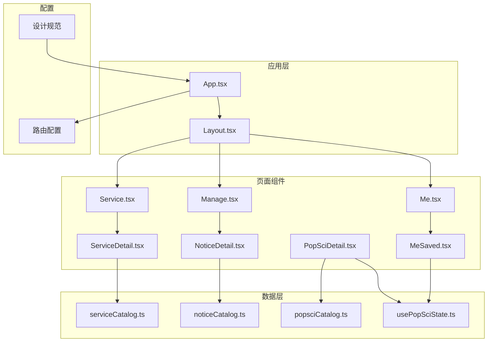
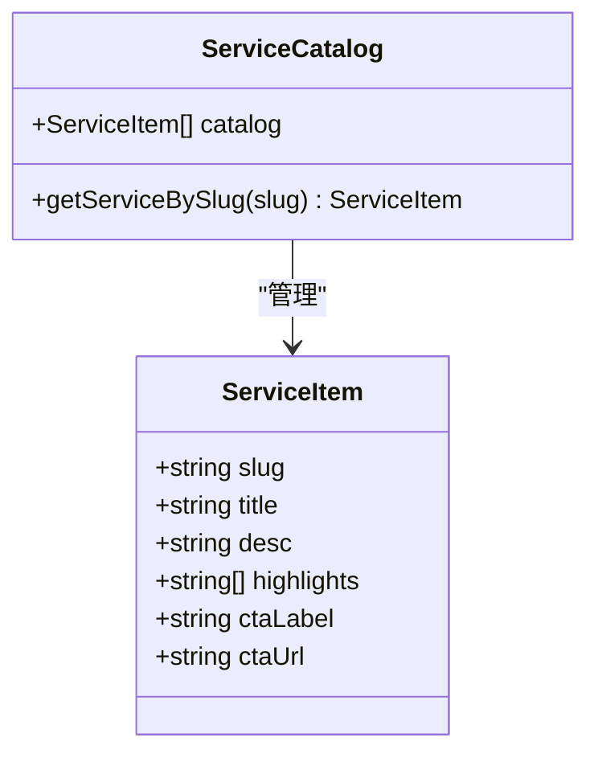
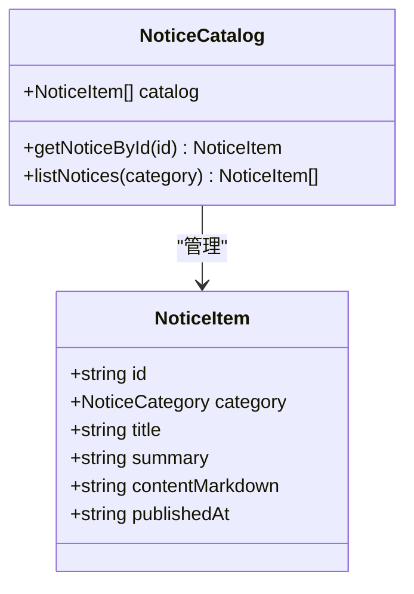
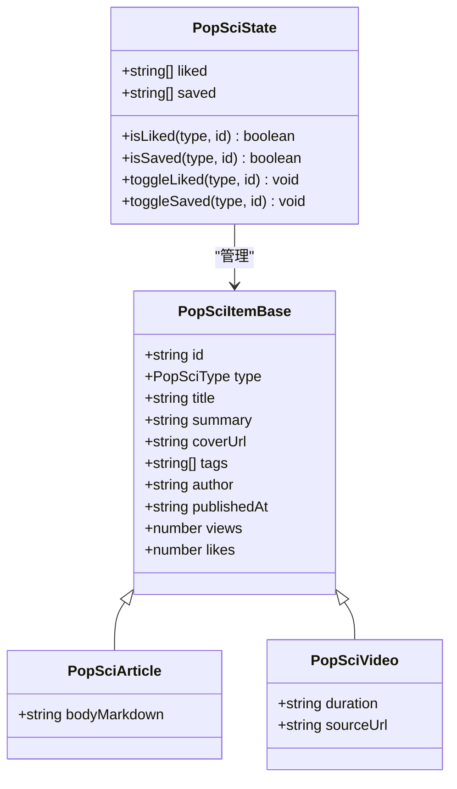
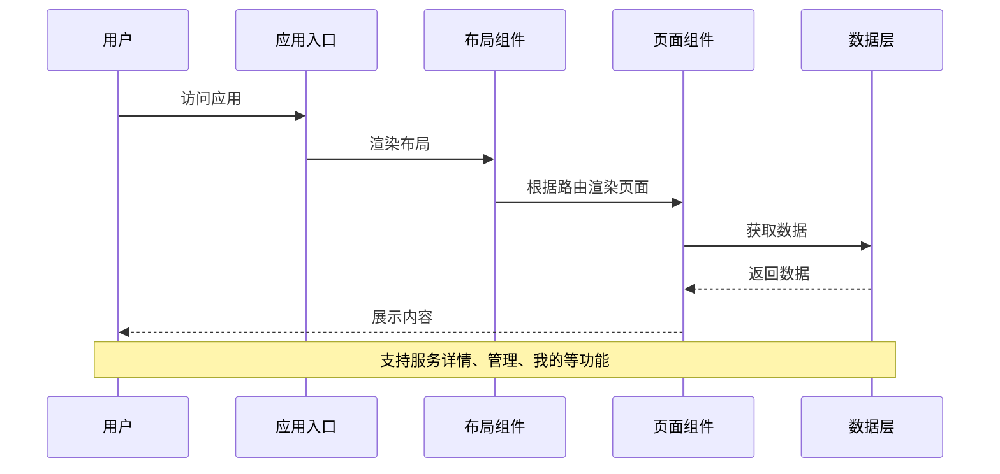
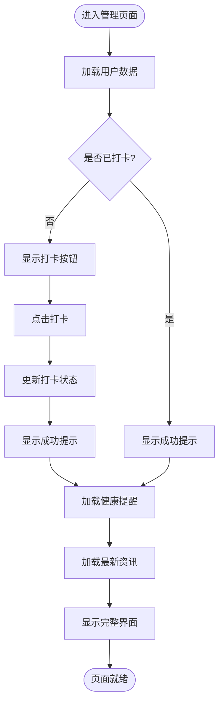
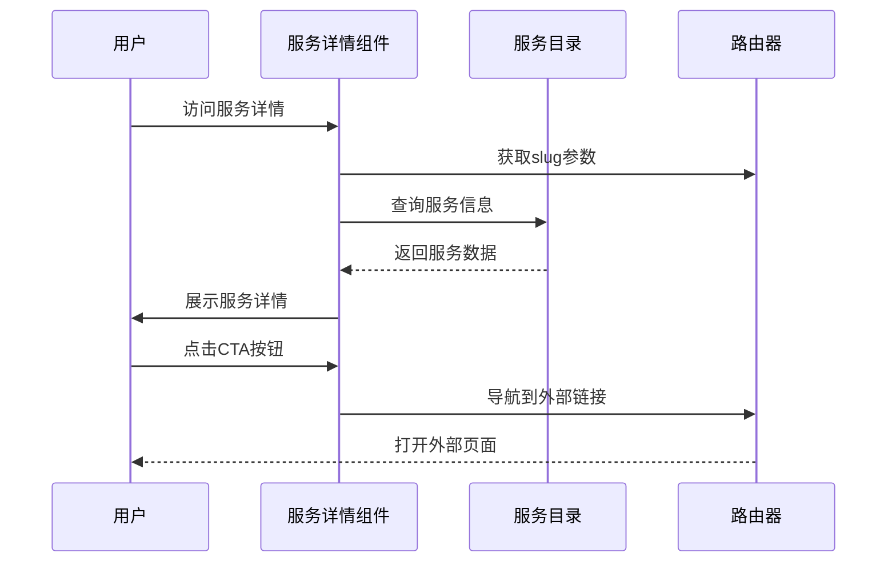
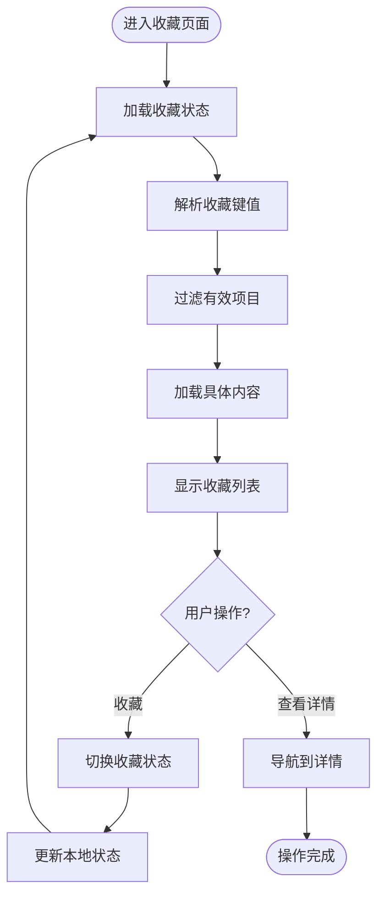
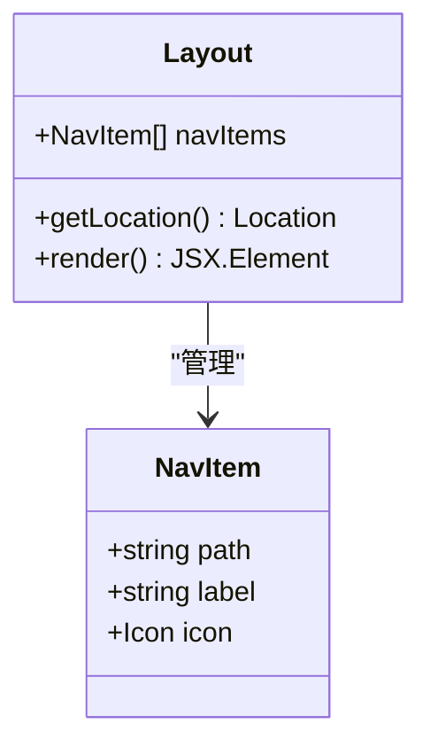
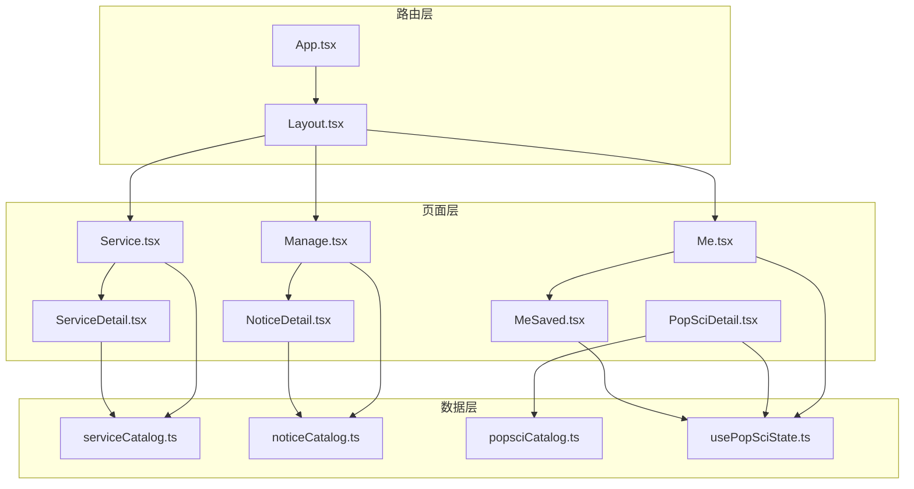

# 服务管理动作设计

<cite>
**本文档引用的文件**
- [2026-04-15-service-manage-me-actions-design.md](file://docs/superpowers/specs/2026-04-15-service-manage-me-actions-design.md)
- [serviceCatalog.ts](file://src/data/serviceCatalog.ts)
- [noticeCatalog.ts](file://src/data/noticeCatalog.ts)
- [popsciCatalog.ts](file://src/data/popsciCatalog.ts)
- [usePopSciState.ts](file://src/hooks/usePopSciState.ts)
- [Layout.tsx](file://src/components/Layout.tsx)
- [App.tsx](file://src/App.tsx)
- [Service.tsx](file://src/pages/Service.tsx)
- [ServiceDetail.tsx](file://src/pages/ServiceDetail.tsx)
- [Manage.tsx](file://src/pages/Manage.tsx)
- [Me.tsx](file://src/pages/Me.tsx)
- [MeSaved.tsx](file://src/pages/MeSaved.tsx)
- [NoticeDetail.tsx](file://src/pages/NoticeDetail.tsx)
- [PopSciDetail.tsx](file://src/pages/PopSciDetail.tsx)
</cite>

## 目录
1. [引言](#引言)
2. [项目结构](#项目结构)
3. [核心组件](#核心组件)
4. [架构概览](#架构概览)
5. [详细组件分析](#详细组件分析)
6. [依赖关系分析](#依赖关系分析)
7. [性能考虑](#性能考虑)
8. [故障排除指南](#故障排除指南)
9. [结论](#结论)
10. [附录](#附录)

## 引言

本文件为服务管理动作设计的综合文档，专注于医疗服务预约、管理、取消等核心业务流程的设计思路和实现方案。文档基于实际代码库进行分析，涵盖了服务状态机设计原理、业务规则验证和异常处理机制，以及用户权限管理、服务可用性检查和冲突解决策略。同时，文档还包含了服务历史记录追踪、状态变更通知和用户提醒机制，提供了服务管理界面的交互设计、数据验证和用户体验优化方案，并文档化了与第三方医疗系统集成的接口设计和数据同步策略。

## 项目结构

该项目采用基于功能模块的组织方式，主要分为以下层次：

**图表来源**
- [App.tsx:19-51](file://src/App.tsx#L19-L51)
- [Layout.tsx:19-65](file://src/components/Layout.tsx#L19-L65)

**章节来源**
- [App.tsx:19-51](file://src/App.tsx#L19-L51)
- [Layout.tsx:19-65](file://src/components/Layout.tsx#L19-L65)

## 核心组件

### 服务目录系统

服务目录系统是整个服务管理的基础数据结构，提供了服务的标准化描述和查询能力：

**图表来源**
- [serviceCatalog.ts:1-49](file://src/data/serviceCatalog.ts#L1-L49)

服务目录包含四种核心医疗服务：
- 绿通招募：全国三甲医院就医绿色通道
- 健康套餐：定制化全生命周期体检与专项筛查
- 产品分享：互联网医院与平台严选产品
- 名医在线：线上复诊与图文问诊

**章节来源**
- [serviceCatalog.ts:10-49](file://src/data/serviceCatalog.ts#L10-L49)

### 通知管理系统

通知管理系统负责健康提醒和最新资讯的分类管理：

**图表来源**
- [noticeCatalog.ts:3-59](file://src/data/noticeCatalog.ts#L3-L59)

通知系统支持两种类型：
- 健康提醒：包括天气变化、用药提醒等生活提醒
- 最新资讯：心血管健康管理指南更新等专业资讯

**章节来源**
- [noticeCatalog.ts:12-59](file://src/data/noticeCatalog.ts#L12-L59)

### 科普内容系统

科普内容系统提供健康知识的存储和管理：

**图表来源**
- [popsciCatalog.ts:3-27](file://src/data/popsciCatalog.ts#L3-L27)
- [usePopSciState.ts:30-79](file://src/hooks/usePopSciState.ts#L30-L79)

**章节来源**
- [popsciCatalog.ts:29-98](file://src/data/popsciCatalog.ts#L29-L98)
- [usePopSciState.ts:30-79](file://src/hooks/usePopSciState.ts#L30-L79)

## 架构概览

系统采用单页应用(SPA)架构，基于React Router实现路由管理：

**图表来源**
- [App.tsx:25-49](file://src/App.tsx#L25-L49)
- [Layout.tsx:19-65](file://src/components/Layout.tsx#L19-L65)

系统架构特点：
- 组件化设计：每个页面都是独立的React组件
- 数据驱动：通过数据层提供统一的数据访问接口
- 路由管理：基于React Router实现页面间的导航
- 状态管理：使用React Hooks实现组件状态管理

**章节来源**
- [App.tsx:19-51](file://src/App.tsx#L19-L51)
- [Layout.tsx:19-65](file://src/components/Layout.tsx#L19-L65)

## 详细组件分析

### 服务管理页面

服务管理页面提供了用户健康档案管理和提醒功能：

**图表来源**
- [Manage.tsx:7-167](file://src/pages/Manage.tsx#L7-L167)

管理页面核心功能：
- 每日打卡：提供轻量级的健康打卡功能
- 健康提醒：展示个性化的健康提醒信息
- 最新资讯：提供最新的健康资讯和指南

**章节来源**
- [Manage.tsx:7-167](file://src/pages/Manage.tsx#L7-L167)

### 服务详情页面

服务详情页面提供了服务的完整信息展示和操作入口：

**图表来源**
- [ServiceDetail.tsx:6-75](file://src/pages/ServiceDetail.tsx#L6-L75)
- [serviceCatalog.ts:45-49](file://src/data/serviceCatalog.ts#L45-L49)

服务详情页面设计要点：
- 动态路由：通过slug参数动态加载服务信息
- 完整信息展示：包括服务描述、亮点功能等
- 外部链接：提供专业的咨询服务入口

**章节来源**
- [ServiceDetail.tsx:6-75](file://src/pages/ServiceDetail.tsx#L6-L75)

### 我的收藏页面

我的收藏页面实现了内容的本地存储和管理：

**图表来源**
- [MeSaved.tsx:16-132](file://src/pages/MeSaved.tsx#L16-L132)
- [usePopSciState.ts:30-79](file://src/hooks/usePopSciState.ts#L30-L79)

收藏系统特性：
- 本地持久化：使用localStorage存储用户偏好
- 键值管理：通过类型+ID的格式管理不同内容类型
- 实时更新：状态变更即时反映在界面中

**章节来源**
- [MeSaved.tsx:16-132](file://src/pages/MeSaved.tsx#L16-L132)
- [usePopSciState.ts:30-79](file://src/hooks/usePopSciState.ts#L30-L79)

### 底部导航系统

底部导航系统提供了跨页面的一致性导航体验：

**图表来源**
- [Layout.tsx:10-17](file://src/components/Layout.tsx#L10-L17)

导航系统支持的功能：
- 五个主要功能区域：科普、互动、管理、服务、我的
- 活跃状态指示：根据当前路由高亮对应导航项
- 子路由支持：支持嵌套路径的导航高亮

**章节来源**
- [Layout.tsx:10-65](file://src/components/Layout.tsx#L10-L65)

## 依赖关系分析

系统各组件之间的依赖关系如下：

**图表来源**
- [App.tsx:25-49](file://src/App.tsx#L25-L49)
- [Service.tsx:4-5](file://src/pages/Service.tsx#L4-L5)

**章节来源**
- [App.tsx:25-49](file://src/App.tsx#L25-L49)

## 性能考虑

### 数据加载优化

系统采用了多种性能优化策略：

1. **懒加载模式**：页面组件按需加载，减少初始包体积
2. **缓存机制**：使用useMemo避免不必要的重新计算
3. **虚拟滚动**：对于大量列表数据，可考虑实现虚拟滚动
4. **图片优化**：使用响应式图片和适当的尺寸

### 状态管理优化

- 使用React Hooks替代复杂的Redux状态管理
- 本地状态与全局状态分离，避免不必要的重渲染
- 使用useCallback优化函数组件的性能

### 路由性能

- 基于React Router的懒加载路由
- 预加载关键页面以提升用户体验

## 故障排除指南

### 常见问题及解决方案

#### 服务详情页面空白问题

**问题现象**：访问服务详情页面显示空白

**可能原因**：
1. slug参数错误或不存在
2. 服务目录数据加载失败
3. 路由配置问题

**解决方案**：
1. 检查URL中的slug参数是否正确
2. 验证serviceCatalog中是否存在对应的slug
3. 确认路由配置是否正确

#### 收藏功能失效

**问题现象**：收藏按钮点击无效

**可能原因**：
1. localStorage访问被阻止
2. 状态管理Hook使用错误
3. 数据类型不匹配

**解决方案**：
1. 检查浏览器的localStorage设置
2. 确认usePopSciState Hook的正确使用
3. 验证内容类型的合法性

#### 导航高亮异常

**问题现象**：底部导航栏活跃状态显示错误

**可能原因**：
1. 路由路径配置问题
2. isActive判断逻辑错误
3. 子路由路径匹配问题

**解决方案**：
1. 检查路由配置中的路径设置
2. 验证isActive判断逻辑
3. 确认子路由的路径匹配规则

**章节来源**
- [ServiceDetail.tsx:33-44](file://src/pages/ServiceDetail.tsx#L33-L44)
- [MeSaved.tsx:50-62](file://src/pages/MeSaved.tsx#L50-L62)
- [Layout.tsx:32](file://src/components/Layout.tsx#L32)

## 结论

本服务管理动作设计文档基于实际的代码实现，全面阐述了医疗服务预约、管理、取消等核心业务流程的设计思路和实现方案。系统采用模块化架构，通过清晰的数据层、页面层和组件层分离，实现了良好的可维护性和扩展性。

主要设计特点包括：
- **模块化设计**：每个功能模块相对独立，便于维护和测试
- **数据驱动**：统一的数据访问接口，确保数据一致性
- **用户体验优先**：注重交互流畅性和视觉体验
- **可扩展性**：为未来的功能扩展预留了良好的架构基础

未来可以考虑的改进方向：
- 集成真实的后端API接口
- 实现用户认证和权限管理
- 添加服务状态跟踪和历史记录
- 优化移动端性能和兼容性

## 附录

### 设计规范参考

系统遵循了既定的设计规范，包括：
- 统一的颜色方案和字体系统
- 一致的交互模式和动效设计
- 响应式布局适配不同设备
- 无障碍访问支持

**章节来源**
- [2026-04-15-service-manage-me-actions-design.md:1-54](file://docs/superpowers/specs/2026-04-15-service-manage-me-actions-design.md#L1-L54)